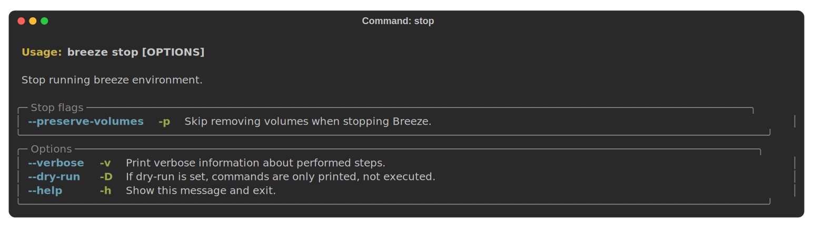

 .. Licensed to the Apache Software Foundation (ASF) under one
    or more contributor license agreements.  See the NOTICE file
    distributed with this work for additional information
    regarding copyright ownership.  The ASF licenses this file
    to you under the Apache License, Version 2.0 (the
    "License"); you may not use this file except in compliance
    with the License.  You may obtain a copy of the License at

 ..   http://www.apache.org/licenses/LICENSE-2.0

 .. Unless required by applicable law or agreed to in writing,
    software distributed under the License is distributed on an
    "AS IS" BASIS, WITHOUT WARRANTIES OR CONDITIONS OF ANY
    KIND, either express or implied.  See the License for the
    specific language governing permissions and limitations
    under the License.

.. raw:: html

    

      
    

.. contents:: :local:

Airflow Breeze CI environment
=============================

Airflow Breeze is an easy-to-use development and test environment using
`Docker Compose <https://docs.docker.com/compose/>`_.
The environment is available for local use and is also used in Airflow's CI tests.

We call it *Airflow Breeze* as **It's a Breeze to contribute to Airflow**.

The advantages and disadvantages of using the Breeze environment vs. other ways of testing Airflow
are described in `CONTRIBUTING.rst <CONTRIBUTING.rst#integration-test-development-environment>`_.

Prerequisites
=============

Docker Desktop
--------------

- **Version**: Install the latest stable `Docker Desktop <https://docs.docker.com/get-docker/>`_
  and add make sure it is in your PATH. ``Breeze`` detects if you are using version that is too
  old and warns you to upgrade.
- **Permissions**: Configure to run the ``docker`` commands directly and not only via root user.
  Your user should be in the ``docker`` group.
  See `Docker installation guide <https://docs.docker.com/install/>`_ for details.
- **Disk space**: On macOS, increase your available disk space before starting to work with
  the environment. At least 20 GB of free disk space is recommended. You can also get by with a
  smaller space but make sure to clean up the Docker disk space periodically.
  See also `Docker for Mac - Space <https://docs.docker.com/docker-for-mac/space>`_ for details
  on increasing disk space available for Docker on Mac.
- **Docker problems**: Sometimes it is not obvious that space is an issue when you run into
  a problem with Docker. If you see a weird behaviour, try ``breeze cleanup`` command.
  Also see `pruning <https://docs.docker.com/config/pruning/>`_ instructions from Docker.

Here is an example configuration with more than 200GB disk space for Docker:

.. raw:: html

    

        
    

- **Docker is not running** - even if it is running with Docker Desktop. This is an issue
  specific to Docker Desktop 4.13.0 (released in late October 2022). Please upgrade Docker
  Desktop to 4.13.1 or later to resolve the issue. For technical details, see also
  `docker/for-mac#6529 <https://github.com/docker/for-mac/issues/6529>`_.

Note: If you use Colima, please follow instructions at: `Contributors Quick Start Guide <https://github.com/apache/airflow/blob/main
/CONTRIBUTORS_QUICK_START.rst>`__

Docker Compose
--------------

- **Version**: Install the latest stable `Docker Compose <https://docs.docker.com/compose/install/>`_
  and add it to the PATH. ``Breeze`` detects if you are using version that is too old and warns you to upgrade.
- **Permissions**: Configure permission to be able to run the ``docker-compose`` command by your user.

Docker in WSL 2
---------------

- **WSL 2 installation** :
    Install WSL 2 and a Linux Distro (e.g. Ubuntu) see
    `WSL 2 Installation Guide <https://docs.microsoft.com/en-us/windows/wsl/install-win10>`_ for details.

- **Docker Desktop installation** :
    Install Docker Desktop for Windows. For Windows Home follow the
    `Docker Windows Home Installation Guide <https://docs.docker.com/docker-for-windows/install-windows-home>`_.
    For Windows Pro, Enterprise, or Education follow the
    `Docker Windows Installation Guide <https://docs.docker.com/docker-for-windows/install/>`_.

- **Docker setting** :
    WSL integration needs to be enabled

.. raw:: html

    

        
    

- **WSL 2 Filesystem Performance** :
    Accessing the host Windows filesystem incurs a performance penalty,
    it is therefore recommended to do development on the Linux filesystem.
    E.g. Run ``cd ~`` and create a development folder in your Linux distro home
    and git pull the Airflow repo there.

- **WSL 2 Docker mount errors**:
    Another reason to use Linux filesystem, is that sometimes - depending on the length of
    your path, you might get strange errors when you try start ``Breeze``, such as
    ``caused: mount through procfd: not a directory: unknown:``. Therefore checking out
    Airflow in Windows-mounted Filesystem is strongly discouraged.

- **WSL 2 Docker volume remount errors**:
    If you're experiencing errors such as ``ERROR: for docker-compose_airflow_run
    Cannot create container for service airflow: not a directory`` when starting Breeze
    after the first time or an error like ``docker: Error response from daemon: not a directory.
    See 'docker run --help'.`` when running the pre-commit tests, you may need to consider
    `installing Docker directly in WSL 2 <https://dev.to/bowmanjd/install-docker-on-windows-wsl-without-docker-desktop-34m9>`_
    instead of using Docker Desktop for Windows.

- **WSL 2 Memory Usage** :
    WSL 2 can consume a lot of memory under the process name "Vmmem". To reclaim the memory after
    development you can:

    * On the Linux distro clear cached memory: ``sudo sysctl -w vm.drop_caches=3``
    * If no longer using Docker you can quit Docker Desktop
      (right click system try icon and select "Quit Docker Desktop")
    * If no longer using WSL you can shut it down on the Windows Host
      with the following command: ``wsl --shutdown``

- **Developing in WSL 2**:
    You can use all the standard Linux command line utilities to develop on WSL 2.
    Further VS Code supports developing in Windows but remotely executing in WSL.
    If VS Code is installed on the Windows host system then in the WSL Linux Distro
    you can run ``code .`` in the root directory of you Airflow repo to launch VS Code.

The pipx tool
--------------

We are using ``pipx`` tool to install and manage Breeze. The ``pipx`` tool is created by the creators
of ``pip`` from `Python Packaging Authority <https://www.pypa.io/en/latest/>`_

Install pipx

.. code-block:: bash

    pip install --user pipx

Breeze, is not globally accessible until your PATH is updated. Add <USER FOLDER>\.local\bin as a variable
environments. This can be done automatically by the following command (follow instructions printed).

.. code-block:: bash

    pipx ensurepath

In Mac

.. code-block:: bash

    python -m pipx ensurepath

Resources required
==================

Memory
------

Minimum 4GB RAM for Docker Engine is required to run the full Breeze environment.

On macOS, 2GB of RAM are available for your Docker containers by default, but more memory is recommended
(4GB should be comfortable). For details see
`Docker for Mac - Advanced tab <https://docs.docker.com/v17.12/docker-for-mac/#advanced-tab>`_.

On Windows WSL 2 expect the Linux Distro and Docker containers to use 7 - 8 GB of RAM.

Disk
----

Minimum 40GB free disk space is required for your Docker Containers.

On Mac OS This might deteriorate over time so you might need to increase it or run ``breeze cleanup``
periodically. For details see
`Docker for Mac - Advanced tab <https://docs.docker.com/v17.12/docker-for-mac/#advanced-tab>`_.

On WSL2 you might want to increase your Virtual Hard Disk by following:
`Expanding the size of your WSL 2 Virtual Hard Disk <https://docs.microsoft.com/en-us/windows/wsl/compare-versions#expanding-the-size-of-your-wsl-2-virtual-hard-disk>`_

There is a command ``breeze ci resource-check`` that you can run to check available resources. See below
for details.

Cleaning the environment
------------------------

You may need to clean up your Docker environment occasionally. The images are quite big
(1.5GB for both images needed for static code analysis and CI tests) and, if you often rebuild/update
them, you may end up with some unused image data.

To clean up the Docker environment:

1. Stop Breeze with ``breeze stop``. (If Breeze is already running)

2. Run the ``breeze cleanup`` command.

3. Run ``docker images --all`` and ``docker ps --all`` to verify that your Docker is clean.

   Both commands should return an empty list of images and containers respectively.

If you run into disk space errors, consider pruning your Docker images with the ``docker system prune --all``
command. You may need to restart the Docker Engine before running this command.

In case of disk space errors on macOS, increase the disk space available for Docker. See
`Prerequisites <#prerequisites>`_ for details.

Installation
============

Set your working directory to root of (this) cloned repository.
Run this command to install Breeze (make sure to use ``-e`` flag):

.. code-block:: bash

    pipx install -e ./dev/breeze

Once this is complete, you should have ``breeze`` binary on your PATH and available to run by ``breeze``
command.

Those are all available commands for Breeze and details about the commands are described below:

.. image:: ./images/breeze/output-commands.svg
  :target: https://raw.githubusercontent.com/apache/airflow/main/images/breeze/output-commands.svg
  :width: 100%
  :alt: Breeze commands

Breeze installed this way is linked to your checked out sources of Airflow, so Breeze will
automatically use latest version of sources from ``./dev/breeze``. Sometimes, when dependencies are
updated ``breeze`` commands with offer you to run self-upgrade.

You can always run such self-upgrade at any time:

.. code-block:: bash

    breeze setup self-upgrade

If you have several checked out Airflow sources, Breeze will warn you if you are using it from a different
source tree and will offer you to re-install from those sources - to make sure that you are using the right
version.

You can skip Breeze's upgrade check by setting ``SKIP_BREEZE_UPGRADE_CHECK`` variable to non empty value.

By default Breeze works on the version of Airflow that you run it in - in case you are outside of the
sources of Airflow and you installed Breeze from a directory - Breeze will be run on Airflow sources from
where it was installed.

You can run ``breeze setup version`` command to see where breeze installed from and what are the current sources
that Breeze works on

Running Breeze for the first time
---------------------------------

The First time you run Breeze, it pulls and builds a local version of Docker images.
It pulls the latest Airflow CI images from the
`GitHub Container Registry <https://github.com/orgs/apache/packages?repo_name=airflow>`_
and uses them to build your local Docker images. Note that the first run (per python) might take up to 10
minutes on a fast connection to start. Subsequent runs should be much faster.

Once you enter the environment, you are dropped into bash shell of the Airflow container and you can
run tests immediately.

To use the full potential of breeze you should set up autocomplete. The ``breeze`` command comes
with a built-in bash/zsh/fish autocomplete setup command. After installing,
when you start typing the command, you can use <TAB> to show all the available switches and get
auto-completion on typical values of parameters that you can use.

You should set up the autocomplete option automatically by running:

.. code-block:: bash

   breeze setup autocomplete

Automating breeze installation
------------------------------

Breeze on POSIX-compliant systems (Linux, MacOS) can be automatically installed by running the
``scripts/tools/setup_breeze`` bash script. This includes checking and installing ``pipx``, setting up
``breeze`` with it and setting up autocomplete.

Customizing your environment
----------------------------

When you enter the Breeze environment, automatically an environment file is sourced from
``files/airflow-breeze-config/variables.env``.

You can also add ``files/airflow-breeze-config/init.sh`` and the script will be sourced always
when you enter Breeze. For example you can add ``pip install`` commands if you want to install
custom dependencies - but there are no limits to add your own customizations.

You can override the name of the init script by setting ``INIT_SCRIPT_FILE`` environment variable before
running the breeze environment.

You can also customize your environment by setting ``BREEZE_INIT_COMMAND`` environment variable. This variable
will be evaluated at entering the environment.

The ``files`` folder from your local sources is automatically mounted to the container under
``/files`` path and you can put there any files you want to make available for the Breeze container.

You can also copy any .whl or .sdist packages to dist and when you pass ``--use-packages-from-dist`` flag
as ``wheel`` or ``sdist`` line parameter, breeze will automatically install the packages found there
when you enter Breeze.

You can also add your local tmux configuration in ``files/airflow-breeze-config/.tmux.conf`` and
these configurations will be available for your tmux environment.

There is a symlink between ``files/airflow-breeze-config/.tmux.conf`` and ``~/.tmux.conf`` in the container,
so you can change it at any place, and run

.. code-block:: bash

  tmux source ~/.tmux.conf

inside container, to enable modified tmux configurations.

.. raw:: html

    

      
    

Regular development tasks
=========================

The regular Breeze development tasks are available as top-level commands. Those tasks are most often
used during the development, that's why they are available without any sub-command. More advanced
commands are separated to sub-commands.

Entering Breeze shell
---------------------

This is the most often used feature of breeze. It simply allows to enter the shell inside the Breeze
development environment (inside the Breeze container).

You can use additional ``breeze`` flags to choose your environment. You can specify a Python
version to use, and backend (the meta-data database). Thanks to that, with Breeze, you can recreate the same
environments as we have in matrix builds in the CI.

For example, you can choose to run Python 3.7 tests with MySQL as backend and with mysql version 8
as follows:

.. code-block:: bash

    breeze --python 3.7 --backend mysql --mysql-version 8

The choices you make are persisted in the ``./.build/`` cache directory so that next time when you use the
``breeze`` script, it could use the values that were used previously. This way you do not have to specify
them when you run the script. You can delete the ``.build/`` directory in case you want to restore the
default settings.

You can see which value of the parameters that can be stored persistently in cache marked with >VALUE<
in the help of the commands.

.. raw:: html

    

      
    

Building the documentation
--------------------------

To build documentation in Breeze, use the ``build-docs`` command:

.. code-block:: bash

     breeze build-docs

Results of the build can be found in the ``docs/_build`` folder.

The documentation build consists of three steps:

* verifying consistency of indexes
* building documentation
* spell checking

You can choose only one stage of the two by providing ``--spellcheck-only`` or ``--docs-only`` after
extra ``--`` flag.

.. code-block:: bash

    breeze build-docs --spellcheck-only

This process can take some time, so in order to make it shorter you can filter by package, using the flag
``--package-filter <PACKAGE-NAME>``. The package name has to be one of the providers or ``apache-airflow``. For
instance, for using it with Amazon, the command would be:

.. code-block:: bash

     breeze build-docs --package-filter apache-airflow-providers-amazon

Often errors during documentation generation come from the docstrings of auto-api generated classes.
During the docs building auto-api generated files are stored in the ``docs/_api`` folder. This helps you
easily identify the location the problems with documentation originated from.

Those are all available flags of ``build-docs`` command:

.. image:: ./images/breeze/output_build-docs.svg
  :target: https://raw.githubusercontent.com/apache/airflow/main/images/breeze/output_build-docs.svg
  :width: 100%
  :alt: Breeze build documentation

.. raw:: html

    

      
    

Running static checks
---------------------

You can run static checks via Breeze. You can also run them via pre-commit command but with auto-completion
Breeze makes it easier to run selective static checks. If you press <TAB> after the static-check and if
you have auto-complete setup you should see auto-completable list of all checks available.

.. code-block:: bash

     breeze static-checks -t run-mypy

The above will run mypy check for currently staged files.

You can also pass specific pre-commit flags for example ``--all-files`` :

.. code-block:: bash

     breeze static-checks -t run-mypy --all-files

The above will run mypy check for all files.

There is a convenience ``--last-commit`` flag that you can use to run static check on last commit only:

.. code-block:: bash

     breeze static-checks -t run-mypy --last-commit

The above will run mypy check for all files in the last commit.

There is another convenience ``--commit-ref`` flag that you can use to run static check on specific commit:

.. code-block:: bash

     breeze static-checks -t run-mypy --commit-ref 639483d998ecac64d0fef7c5aa4634414065f690

The above will run mypy check for all files in the 639483d998ecac64d0fef7c5aa4634414065f690 commit.
Any ``commit-ish`` reference from Git will work here (branch, tag, short/long hash etc.)

If you ever need to get a list of the files that will be checked (for troubleshooting) use these commands:

.. code-block:: bash

     breeze static-checks -t identity --verbose # currently staged files
     breeze static-checks -t identity --verbose --from-ref $(git merge-base main HEAD) --to-ref HEAD #  branch updates

Those are all available flags of ``static-checks`` command:

.. image:: ./images/breeze/output_static-checks.svg
  :target: https://raw.githubusercontent.com/apache/airflow/main/images/breeze/output_static-checks.svg
  :width: 100%
  :alt: Breeze static checks

.. note::

    When you run static checks, some of the artifacts (mypy_cache) is stored in docker-compose volume
    so that it can speed up static checks execution significantly. However, sometimes, the cache might
    get broken, in which case you should run ``breeze stop`` to clean up the cache.

.. note::

    You cannot change Python version for static checks that are run within Breeze containers.
    The ``--python`` flag has no effect for them. They are always run with lowest supported Python version.
    The main reason is to keep consistency in the results of static checks and to make sure that
    our code is fine when running the lowest supported version.

Starting Airflow
----------------

For testing Airflow you often want to start multiple components (in multiple terminals). Breeze has
built-in ``start-airflow`` command that start breeze container, launches multiple terminals using tmux
and launches all Airflow necessary components in those terminals.

When you are starting airflow from local sources, www asset compilation is automatically executed before.

.. code-block:: bash

    breeze --python 3.7 --backend mysql start-airflow

You can also use it to start any released version of Airflow from ``PyPI`` with the
``--use-airflow-version`` flag.

.. code-block:: bash

    breeze start-airflow --python 3.7 --backend mysql --use-airflow-version 2.2.5

Those are all available flags of ``start-airflow`` command:

.. image:: ./images/breeze/output_start-airflow.svg
  :target: https://raw.githubusercontent.com/apache/airflow/main/images/breeze/output_start-airflow.svg
  :width: 100%
  :alt: Breeze start-airflow

Launching multiple terminals in the same environment
----------------------------------------------------

Often if you want to run full airflow in the Breeze environment you need to launch multiple terminals and
run ``airflow webserver``, ``airflow scheduler``, ``airflow worker`` in separate terminals.

This can be achieved either via ``tmux`` or via exec-ing into the running container from the host. Tmux
is installed inside the container and you can launch it with ``tmux`` command. Tmux provides you with the
capability of creating multiple virtual terminals and multiplex between them. More about ``tmux`` can be
found at `tmux GitHub wiki page <https://github.com/tmux/tmux/wiki>`_ . Tmux has several useful shortcuts
that allow you to split the terminals, open new tabs etc - it's pretty useful to learn it.

Another way is to exec into Breeze terminal from the host's terminal. Often you can
have multiple terminals in the host (Linux/MacOS/WSL2 on Windows) and you can simply use those terminals
to enter the running container. It's as easy as launching ``breeze exec`` while you already started the
Breeze environment. You will be dropped into bash and environment variables will be read in the same
way as when you enter the environment. You can do it multiple times and open as many terminals as you need.

Those are all available flags of ``exec`` command:

.. image:: ./images/breeze/output_exec.svg
  :target: https://raw.githubusercontent.com/apache/airflow/main/images/breeze/output_exec.svg
  :width: 100%
  :alt: Breeze exec

Compiling www assets
--------------------

Airflow webserver needs to prepare www assets - compiled with node and yarn. The ``compile-www-assets``
command takes care about it. This is needed when you want to run webserver inside of the breeze.

.. image:: ./images/breeze/output_compile-www-assets.svg
  :target: https://raw.githubusercontent.com/apache/airflow/main/images/breeze/output_compile-www-assets.svg
  :width: 100%
  :alt: Breeze compile-www-assets

Breeze cleanup
--------------

Breeze uses docker images heavily and those images are rebuild periodically. This might cause extra
disk usage by the images. If you need to clean-up the images periodically you can run
``breeze setup cleanup`` command (by default it will skip removing your images before cleaning up but you
can also remove the images to clean-up everything by adding ``--all``).

Those are all available flags of ``cleanup`` command:

.. image:: ./images/breeze/output_cleanup.svg
  :target: https://raw.githubusercontent.com/apache/airflow/main/images/breeze/output_cleanup.svg
  :width: 100%
  :alt: Breeze setup cleanup

Running arbitrary commands in container
---------------------------------------

More sophisticated usages of the breeze shell is using the ``breeze shell`` command - it has more parameters
and you can also use it to execute arbitrary commands inside the container.

.. code-block:: bash

     breeze shell "ls -la"

Those are all available flags of ``shell`` command:

.. image:: ./images/breeze/output_shell.svg
  :target: https://raw.githubusercontent.com/apache/airflow/main/images/breeze/output_shell.svg
  :width: 100%
  :alt: Breeze shell

Stopping the environment
------------------------

After starting up, the environment runs in the background and takes quite some memory which you might
want to free for other things you are running on your host.

You can always stop it via:

.. code-block:: bash

   breeze stop

Those are all available flags of ``stop`` command:

.. image:: ./images/breeze/output_stop.svg
  :target: https://raw.githubusercontent.com/apache/airflow/main/images/breeze/output_stop.svg
  :width: 100%
  :alt: Breeze stop

Troubleshooting
===============

If you are having problems with the Breeze environment, try the steps below. After each step you
can check whether your problem is fixed.

1. If you are on macOS, check if you have enough disk space for Docker (Breeze will warn you if not).
2. Stop Breeze with ``breeze stop``.
3. Delete the ``.build`` directory and run ``breeze ci-image build``.
4. Clean up Docker images via ``breeze cleanup`` command.
5. Restart your Docker Engine and try again.
6. Restart your machine and try again.
7. Re-install Docker Desktop and try again.

In case the problems are not solved, you can set the VERBOSE_COMMANDS variable to "true":

.. code-block::

        export VERBOSE_COMMANDS="true"

Then run the failed command, copy-and-paste the output from your terminal to the
`Airflow Slack <https://s.apache.org/airflow-slack>`_  #airflow-breeze channel and
describe your problem.

Advanced commands
=================

Airflow Breeze is a bash script serving as a "swiss-army-knife" of Airflow testing. Under the
hood it uses other scripts that you can also run manually if you have problem with running the Breeze
environment. Breeze script allows performing the following tasks:

Running tests
-------------

You can run tests with ``breeze``. There are various tests type and breeze allows to run different test
types easily. You can run unit tests in different ways, either interactively run tests with the default
``shell`` command or via the ``testing`` commands. The latter allows to run more kinds of tests easily.

Here is the detailed set of options for the ``breeze testing`` command.

.. image:: ./images/breeze/output_testing.svg
  :target: https://raw.githubusercontent.com/apache/airflow/main/images/breeze/output_testing.svg
  :width: 100%
  :alt: Breeze testing

Iterate on tests interactively via ``shell`` command
....................................................

You can simply enter the ``breeze`` container and run ``pytest`` command there. You can enter the
container via just ``breeze`` command or ``breeze shell`` command (the latter has more options
useful when you run integration or system tests). This is the best way if you want to interactively
run selected tests and iterate with the tests. Once you enter ``breeze`` environment it is ready
out-of-the-box to run your tests by running the right ``pytest`` command (autocomplete should help
you with autocompleting test name if you start typing ``pytest tests<TAB>``).

Here are few examples:

Running single test:

.. code-block:: bash

    pytest tests/core/test_core.py::TestCore::test_check_operators

To run the whole test class:

.. code-block:: bash

    pytest tests/core/test_core.py::TestCore

You can re-run the tests interactively, add extra parameters to pytest and modify the files before
re-running the test to iterate over the tests. You can also add more flags when starting the
``breeze shell`` command when you run integration tests or system tests. Read more details about it
in the ``TESTING.rst <TESTING.rst#>`` where all the test types of our are explained and more information
on how to run them.

This applies to all kind of tests - all our tests can be run using pytest.

Running unit tests
..................

Another option you have is that you can also run tests via built-in ``breeze testing tests`` command.
The iterative ``pytest`` command allows to run test individually, or by class or in any other way
pytest allows to test them and run them interactively, but ``breeze testing tests`` command allows to
run the tests in the same test "types" that are used to run the tests in CI: for example Core, Always
API, Providers. This how our CI runs them - running each group in parallel to other groups and you can
replicate this behaviour.

Another interesting use of the ``breeze testing tests`` command is that you can easily specify sub-set of the
tests for Providers.

For example this will only run provider tests for airbyte and http providers:

.. code-block:: bash

   breeze testing tests --test-type "Providers[airbyte,http]"

You can also run parallel tests with ``--run-in-parallel`` flag - by default it will run all tests types
in parallel, but you can specify the test type that you want to run with space separated list of test
types passed to ``--test-types`` flag.

For example this will run API and WWW tests in parallel:

.. code-block:: bash

    breeze testing tests --test-types "API WWW" --run-in-parallel

Here is the detailed set of options for the ``breeze testing tests`` command.

.. image:: ./images/breeze/output_testing_tests.svg
  :target: https://raw.githubusercontent.com/apache/airflow/main/images/breeze/output_testing_tests.svg
  :width: 100%
  :alt: Breeze testing tests

Running integration tests
.........................

You can also run integration tests via built-in ``breeze testing integration-tests`` command. Some of our
tests require additional integrations to be started in docker-compose. The integration tests command will
run the expected integration and tests that need that integration.

For example this will only run kerberos tests:

.. code-block:: bash

   breeze testing integration-tests --integration Kerberos

Here is the detailed set of options for the ``breeze testing integration-tests`` command.

.. image:: ./images/breeze/output_testing_integration-tests.svg
  :target: https://raw.githubusercontent.com/apache/airflow/main/images/breeze/output_testing_integration_tests.svg
  :width: 100%
  :alt: Breeze testing integration-tests

Running Helm tests
..................

You can use Breeze to run all Helm tests. Those tests are run inside the breeze image as there are all
necessary tools installed there.

.. image:: ./images/breeze/output_testing_helm-tests.svg
  :target: https://raw.githubusercontent.com/apache/airflow/main/images/breeze/output_testing_helm-tests.svg
  :width: 100%
  :alt: Breeze testing helm-tests

You can also iterate over those tests with pytest commands, similarly as in case of regular unit tests.
The helm tests can be found in ``tests/chart`` folder in the main repo.

Running docker-compose tests
............................

You can use Breeze to run all docker-compose tests. Those tests are run using Production image
and they are running test with the Quick-start docker compose we have.

.. image:: ./images/breeze/output_testing_docker-compose-tests.svg
  :target: https://raw.githubusercontent.com/apache/airflow/main/images/breeze/output_testing_docker-compose-tests.svg
  :width: 100%
  :alt: Breeze testing docker-compose-tests

You can also iterate over those tests with pytest command, but - unlike regular unit tests and
Helm tests, they need to be run in local virtual environment. They also require to have
``DOCKER_IMAGE`` environment variable set, pointing to the image to test if you do not run them
through ``breeze testing docker-compose-tests`` command.

The docker-compose tests are in ``docker-tests/`` folder in the main repo.

Running Kubernetes tests
------------------------

Breeze helps with running Kubernetes tests in the same environment/way as CI tests are run.
Breeze helps to setup KinD cluster for testing, setting up virtualenv and downloads the right tools
automatically to run the tests.

You can:

* Setup environment for k8s tests with ``breeze k8s setup-env``
* Build airflow k8S images with ``breeze k8s build-k8s-image``
* Manage KinD Kubernetes cluster and upload image and deploy Airflow to KinD cluster via
  ``breeze k8s create-cluster``, ``breeze k8s configure-cluster``, ``breeze k8s deploy-airflow``, ``breeze k8s status``,
  ``breeze k8s upload-k8s-image``, ``breeze k8s delete-cluster`` commands
* Run Kubernetes tests  specified with ``breeze k8s tests`` command
* Run complete test run with ``breeze k8s run-complete-tests`` - performing the full cycle of creating
  cluster, uploading the image, deploying airflow, running tests and deleting the cluster
* Enter the interactive kubernetes test environment with ``breeze k8s shell`` and ``breeze k8s k9s`` command
* Run multi-cluster-operations ``breeze k8s list-all-clusters`` and
  ``breeze k8s delete-all-clusters`` commands as well as running complete tests in parallel
  via ``breeze k8s dump-logs`` command

This is described in detail in `Testing Kubernetes <TESTING.rst#running-tests-with-kubernetes>`_.

You can read more about KinD that we use in `The documentation <https://kind.sigs.k8s.io/>`_

Here is the detailed set of options for the ``breeze k8s`` command.

.. image:: ./images/breeze/output_k8s.svg
  :target: https://raw.githubusercontent.com/apache/airflow/main/images/breeze/output_k8s.svg
  :width: 100%
  :alt: Breeze k8s

Setting up K8S environment
..........................

Kubernetes environment can be set with the ``breeze k8s setup-env`` command.
It will create appropriate virtualenv to run tests and download the right set of tools to run
the tests: ``kind``, ``kubectl`` and ``helm`` in the right versions. You can re-run the command
when you want to make sure the expected versions of the tools are installed properly in the
virtualenv. The Virtualenv is available in ``.build/.k8s-env/bin`` subdirectory of your Airflow
installation.

.. image:: ./images/breeze/output_k8s_setup-env.svg
  :target: https://raw.githubusercontent.com/apache/airflow/main/images/breeze/output_k8s_setup-env.svg
  :width: 100%
  :alt: Breeze k8s setup-env

Creating K8S cluster
....................

You can create kubernetes cluster (separate cluster for each python/kubernetes version) via
``breeze k8s create-cluster`` command. With ``--force`` flag the cluster will be
deleted if exists. You can also use it to create multiple clusters in parallel with
``--run-in-parallel`` flag - this is what happens in our CI.

All parameters of the command are here:

.. image:: ./images/breeze/output_k8s_create-cluster.svg
  :target: https://raw.githubusercontent.com/apache/airflow/main/images/breeze/output_k8s_create-cluster.svg
  :width: 100%
  :alt: Breeze k8s create-cluster

Deleting K8S cluster
....................

You can delete current kubernetes cluster via ``breeze k8s delete-cluster`` command. You can also add
``--run-in-parallel`` flag to delete all clusters.

All parameters of the command are here:

.. image:: ./images/breeze/output_k8s_delete-cluster.svg
  :target: https://raw.githubusercontent.com/apache/airflow/main/images/breeze/output_k8s_delete-cluster.svg
  :width: 100%
  :alt: Breeze k8s delete-cluster

Building Airflow K8s images
...........................

Before deploying Airflow Helm Chart, you need to make sure the appropriate Airflow image is build (it has
embedded test dags, pod templates and webserver is configured to refresh immediately. This can
be done via ``breeze k8s build-k8s-image`` command. It can also be done in parallel for all images via
``--run-in-parallel`` flag.

All parameters of the command are here:

.. image:: ./images/breeze/output_k8s_build-k8s-image.svg
  :target: https://raw.githubusercontent.com/apache/airflow/main/images/breeze/output_k8s_build-k8s-image.svg
  :width: 100%
  :alt: Breeze k8s build-k8s-image

Uploading Airflow K8s images
............................

The K8S airflow images need to be uploaded to the KinD cluster. This can be done via
``breeze k8s upload-k8s-image`` command. It can also be done in parallel for all images via
``--run-in-parallel`` flag.

All parameters of the command are here:

.. image:: ./images/breeze/output_k8s_upload-k8s-image.svg
  :target: https://raw.githubusercontent.com/apache/airflow/main/images/breeze/output_k8s_upload-k8s-image.svg
  :width: 100%
  :alt: Breeze k8s upload-k8s-image

Configuring K8S cluster
.......................

In order to deploy Airflow, the cluster needs to be configured. Airflow namespace needs to be created
and test resources should be deployed. By passing ``--run-in-parallel`` the configuration can be run
for all clusters in parallel.

All parameters of the command are here:

.. image:: ./images/breeze/output_k8s_configure-cluster.svg
  :target: https://raw.githubusercontent.com/apache/airflow/main/images/breeze/output_k8s_configure-cluster.svg
  :width: 100%
  :alt: Breeze k8s configure-cluster

Deploying Airflow to the Cluster
................................

Airflow can be deployed to the Cluster with ``breeze k8s deploy-airflow``. This step will automatically
(unless disabled by switches) will rebuild the image to be deployed. It also uses the latest version
of the Airflow Helm Chart to deploy it. You can also choose to upgrade existing airflow deployment
and pass extra arguments to ``helm install`` or ``helm upgrade`` commands that are used to
deploy airflow. By passing ``--run-in-parallel`` the deployment can be run
for all clusters in parallel.

All parameters of the command are here:

.. image:: ./images/breeze/output_k8s_deploy-airflow.svg
  :target: https://raw.githubusercontent.com/apache/airflow/main/images/breeze/output_k8s_deploy-airflow.svg
  :width: 100%
  :alt: Breeze k8s deploy-airflow

Checking status of the K8S cluster
..................................

You can delete kubernetes cluster and airflow deployed in the current cluster
via ``breeze k8s status`` command. It can be also checked for all clusters created so far by passing
``--all`` flag.

All parameters of the command are here:

.. image:: ./images/breeze/output_k8s_status.svg
  :target: https://raw.githubusercontent.com/apache/airflow/main/images/breeze/output_k8s_status.svg
  :width: 100%
  :alt: Breeze k8s status

Running k8s tests
.................

You can run ``breeze k8s tests`` command to run ``pytest`` tests with your cluster. Those testa are placed
in ``kubernetes_tests/`` and you can either specify the tests to run as parameter of the tests command or
you can leave them empty to run all tests. By passing ``--run-in-parallel`` the tests can be run
for all clusters in parallel.

Run all tests:

.. code-block::bash

    breeze k8s tests

Run selected tests:

.. code-block::bash

    breeze k8s tests kubernetes_tests/test_kubernetes_executor.py

All parameters of the command are here:

.. image:: ./images/breeze/output_k8s_tests.svg
  :target: https://raw.githubusercontent.com/apache/airflow/main/images/breeze/output_k8s_tests.svg
  :width: 100%
  :alt: Breeze k8s tests

You can also specify any pytest flags as extra parameters - they will be passed to the
shell command directly. In case the shell parameters are the same as the parameters of the command, you
can pass them after ``--``. For example this is the way how you can see all available parameters of the shell
you have:

.. code-block::bash

    breeze k8s tests -- --help

The options that are not overlapping with the ``tests`` command options can be passed directly and mixed
with the specifications of tests you want to run. For example the command below will only run
``test_kubernetes_executor.py`` and will suppress capturing output from Pytest so that you can see the
output during test execution.

.. code-block::bash

    breeze k8s tests -- kubernetes_tests/test_kubernetes_executor.py -s

Running k8s complete tests
..........................

You can run ``breeze k8s run-complete-tests`` command to combine all previous steps in one command. That
command will create cluster, deploy airflow and run tests and finally delete cluster. It is used in CI
to run the whole chains in parallel.

Run all tests:

.. code-block::bash

    breeze k8s run-complete-tests

Run selected tests:

.. code-block::bash

    breeze k8s run-complete-tests kubernetes_tests/test_kubernetes_executor.py

All parameters of the command are here:

.. image:: ./images/breeze/output_k8s_run-complete-tests.svg
  :target: https://raw.githubusercontent.com/apache/airflow/main/images/breeze/output_k8s_run-complete-tests.svg
  :width: 100%
  :alt: Breeze k8s tests

You can also specify any pytest flags as extra parameters - they will be passed to the
shell command directly. In case the shell parameters are the same as the parameters of the command, you
can pass them after ``--``. For example this is the way how you can see all available parameters of the shell
you have:

.. code-block::bash

    breeze k8s run-complete-tests -- --help

The options that are not overlapping with the ``tests`` command options can be passed directly and mixed
with the specifications of tests you want to run. For example the command below will only run
``test_kubernetes_executor.py`` and will suppress capturing output from Pytest so that you can see the
output during test execution.

.. code-block::bash

    breeze k8s run-complete-tests -- kubernetes_tests/test_kubernetes_executor.py -s

Entering k8s shell
..................

You can have multiple clusters created - with different versions of Kubernetes and Python at the same time.
Breeze enables you to interact with the chosen cluster by entering dedicated shell session that has the
cluster pre-configured. This is done via ``breeze k8s shell`` command.

Once you are in the shell, the prompt will indicate which cluster you are interacting with as well
as executor you use, similar to:

.. code-block::bash

    (kind-airflow-python-3.9-v1.24.0:KubernetesExecutor)>

The shell automatically activates the virtual environment that has all appropriate dependencies
installed and you can interactively run all k8s tests with pytest command (of course the cluster need to
be created and airflow deployed to it before running the tests):

.. code-block::bash

    (kind-airflow-python-3.9-v1.24.0:KubernetesExecutor)> pytest kubernetes_tests/test_kubernetes_executor.py
    ================================================= test session starts =================================================
    platform linux -- Python 3.10.6, pytest-6.2.5, py-1.11.0, pluggy-1.0.0 -- /home/jarek/code/airflow/.build/.k8s-env/bin/python
    cachedir: .pytest_cache
    rootdir: /home/jarek/code/airflow, configfile: pytest.ini
    plugins: anyio-3.6.1
    collected 2 items

    kubernetes_tests/test_kubernetes_executor.py::TestKubernetesExecutor::test_integration_run_dag PASSED           [ 50%]
    kubernetes_tests/test_kubernetes_executor.py::TestKubernetesExecutor::test_integration_run_dag_with_scheduler_failure PASSED [100%]

    ================================================== warnings summary ===================================================
    .build/.k8s-env/lib/python3.10/site-packages/_pytest/config/__init__.py:1233
      /home/jarek/code/airflow/.build/.k8s-env/lib/python3.10/site-packages/_pytest/config/__init__.py:1233: PytestConfigWarning: Unknown config option: asyncio_mode

        self._warn_or_fail_if_strict(f"Unknown config option: {key}\n")

    -- Docs: https://docs.pytest.org/en/stable/warnings.html
    ============================================ 2 passed, 1 warning in 38.62s ============================================
    (kind-airflow-python-3.9-v1.24.0:KubernetesExecutor)>

All parameters of the command are here:

.. image:: ./images/breeze/output_k8s_shell.svg
  :target: https://raw.githubusercontent.com/apache/airflow/main/images/breeze/output_k8s_shell.svg
  :width: 100%
  :alt: Breeze k8s shell

You can also specify any shell flags and commands as extra parameters - they will be passed to the
shell command directly. In case the shell parameters are the same as the parameters of the command, you
can pass them after ``--``. For example this is the way how you can see all available parameters of the shell
you have:

.. code-block::bash

    breeze k8s shell -- --help

Running k9s tool
................

The ``k9s`` is a fantastic tool that allows you to interact with running k8s cluster. Since we can have
multiple clusters capability, ``breeze k8s k9s`` allows you to start k9s without setting it up or
downloading - it uses k9s docker image to run it and connect it to the right cluster.

All parameters of the command are here:

.. image:: ./images/breeze/output_k8s_k9s.svg
  :target: https://raw.githubusercontent.com/apache/airflow/main/images/breeze/output_k8s_k9s.svg
  :width: 100%
  :alt: Breeze k8s k9s

You can also specify any ``k9s`` flags and commands as extra parameters - they will be passed to the
``k9s`` command directly. In case the ``k9s`` parameters are the same as the parameters of the command, you
can pass them after ``--``. For example this is the way how you can see all available parameters of the
``k9s`` you have:

.. code-block::bash

    breeze k8s k9s -- --help

Dumping logs from all k8s clusters
..................................

KinD allows to export logs from the running cluster so that you can troubleshoot your deployment.
This can be done with ``breeze k8s logs`` command. Logs can be also dumped for all clusters created
so far by passing ``--all`` flag.

All parameters of the command are here:

.. image:: ./images/breeze/output_k8s_logs.svg
  :target: https://raw.githubusercontent.com/apache/airflow/main/images/breeze/output_k8s_logs.svg
  :width: 100%
  :alt: Breeze k8s logs

CI Image tasks
--------------

The image building is usually run for users automatically when needed,
but sometimes Breeze users might want to manually build, pull or verify the CI images.

.. image:: ./images/breeze/output_ci-image.svg
  :target: https://raw.githubusercontent.com/apache/airflow/main/images/breeze/output_ci-image.svg
  :width: 100%
  :alt: Breeze ci-image

For all development tasks, unit tests, integration tests, and static code checks, we use the
**CI image** maintained in GitHub Container Registry.

The CI image is built automatically as needed, however it can be rebuilt manually with
``ci image build`` command.

Building the image first time pulls a pre-built version of images from the Docker Hub, which may take some
time. But for subsequent source code changes, no wait time is expected.
However, changes to sensitive files like ``setup.py`` or ``Dockerfile.ci`` will trigger a rebuild
that may take more time though it is highly optimized to only rebuild what is needed.

Breeze has built in mechanism to check if your local image has not diverged too much from the
latest image build on CI. This might happen when for example latest patches have been released as new
Python images or when significant changes are made in the Dockerfile. In such cases, Breeze will
download the latest images before rebuilding because this is usually faster than rebuilding the image.

Building CI image
.................

Those are all available flags of ``ci-image build`` command:

.. image:: ./images/breeze/output_ci-image_build.svg
  :target: https://raw.githubusercontent.com/apache/airflow/main/images/breeze/output_ci-image_build.svg
  :width: 100%
  :alt: Breeze ci-image build

Pulling CI image
................

You can also pull the CI images locally in parallel with optional verification.

Those are all available flags of ``pull`` command:

.. image:: ./images/breeze/output_ci-image_pull.svg
  :target: https://raw.githubusercontent.com/apache/airflow/main/images/breeze/output_ci-image_pull.svg
  :width: 100%
  :alt: Breeze ci-image pull

Verifying CI image
..................

Finally, you can verify CI image by running tests - either with the pulled/built images or
with an arbitrary image.

Those are all available flags of ``verify`` command:

.. image:: ./images/breeze/output_ci-image_verify.svg
  :target: https://raw.githubusercontent.com/apache/airflow/main/images/breeze/output_ci-image_verify.svg
  :width: 100%
  :alt: Breeze ci-image verify

PROD Image tasks
----------------

Users can also build Production images when they are developing them. However when you want to
use the PROD image, the regular docker build commands are recommended. See
`building the image <https://airflow.apache.org/docs/docker-stack/build.html>`_

.. image:: ./images/breeze/output_prod-image.svg
  :target: https://raw.githubusercontent.com/apache/airflow/main/images/breeze/output_prod-image.svg
  :width: 100%
  :alt: Breeze prod-image

The **Production image** is also maintained in GitHub Container Registry for Caching
and in ``apache/airflow`` manually pushed for released versions. This Docker image (built using official
Dockerfile) contains size-optimised Airflow installation with selected extras and dependencies.

However in many cases you want to add your own custom version of the image - with added apt dependencies,
python dependencies, additional Airflow extras. Breeze's ``prod-image build`` command helps to build your own,
customized variant of the image that contains everything you need.

You can building the production image manually by using ``prod-image build`` command.
Note, that the images can also be built using ``docker build`` command by passing appropriate
build-args as described in `IMAGES.rst <IMAGES.rst>`_ , but Breeze provides several flags that
makes it easier to do it. You can see all the flags by running ``breeze prod-image build --help``,
but here typical examples are presented:

.. code-block:: bash

     breeze prod-image build --additional-extras "jira"

This installs additional ``jira`` extra while installing airflow in the image.

.. code-block:: bash

     breeze prod-image build --additional-python-deps "torchio==0.17.10"

This install additional pypi dependency - torchio in specified version.

.. code-block:: bash

     breeze prod-image build --additional-dev-apt-deps "libasound2-dev" \
         --additional-runtime-apt-deps "libasound2"

This installs additional apt dependencies - ``libasound2-dev`` in the build image and ``libasound`` in the
final image. Those are development dependencies that might be needed to build and use python packages added
via the ``--additional-python-deps`` flag. The ``dev`` dependencies are not installed in the final
production image, they are only installed in the build "segment" of the production image that is used
as an intermediate step to build the final image. Usually names of the ``dev`` dependencies end with ``-dev``
suffix and they need to also be paired with corresponding runtime dependency added for the runtime image
(without -dev).

.. code-block:: bash

     breeze prod-image build --python 3.7 --additional-dev-deps "libasound2-dev" \
        --additional-runtime-apt-deps "libasound2"

Same as above but uses python 3.7.

Building PROD image
...................

Those are all available flags of ``build-prod-image`` command:

.. image:: ./images/breeze/output_prod-image_build.svg
  :target: https://raw.githubusercontent.com/apache/airflow/main/images/breeze/output_prod-image_build.svg
  :width: 100%
  :alt: Breeze prod-image build

Pulling PROD image
..................

You can also pull PROD images in parallel with optional verification.

Those are all available flags of ``pull-prod-image`` command:

.. image:: ./images/breeze/output_prod-image_pull.svg
  :target: https://raw.githubusercontent.com/apache/airflow/main/images/breeze/output_prod-image_pull.svg
  :width: 100%
  :alt: Breeze prod-image pull

Verifying PROD image
....................

Finally, you can verify PROD image by running tests - either with the pulled/built images or
with an arbitrary image.

Those are all available flags of ``verify-prod-image`` command:

.. image:: ./images/breeze/output_prod-image_verify.svg
  :target: https://raw.githubusercontent.com/apache/airflow/main/images/breeze/output_prod-image_verify.svg
  :width: 100%
  :alt: Breeze prod-image verify

Breeze setup
------------

Breeze has tools that you can use to configure defaults and breeze behaviours and perform some maintenance
operations that might be necessary when you add new commands in Breeze. It also allows to configure your
host operating system for Breeze autocompletion.

Those are all available flags of ``setup`` command:

.. image:: ./images/breeze/output_setup.svg
  :target: https://raw.githubusercontent.com/apache/airflow/main/images/breeze/output_setup.svg
  :width: 100%
  :alt: Breeze setup

Breeze configuration
....................

You can configure and inspect settings of Breeze command via this command: Python version, Backend used as
well as backend versions.

Another part of configuration is enabling/disabling cheatsheet, asciiart. The cheatsheet and asciiart can
be disabled - they are "nice looking" and cheatsheet
contains useful information for first time users but eventually you might want to disable both if you
find it repetitive and annoying.

With the config setting colour-blind-friendly communication for Breeze messages. By default we communicate
with the users about information/errors/warnings/successes via colour-coded messages, but we can switch
it off by passing ``--no-colour`` to config in which case the messages to the user printed by Breeze
will be printed using different schemes (italic/bold/underline) to indicate different kind of messages
rather than colours.

Those are all available flags of ``setup config`` command:

.. image:: ./images/breeze/output_setup_config.svg
  :target: https://raw.githubusercontent.com/apache/airflow/main/images/breeze/output_setup_config.svg
  :width: 100%
  :alt: Breeze setup config

Setting up autocompletion
.........................

You get the auto-completion working when you re-enter the shell (follow the instructions printed).
The command will warn you and not reinstall autocomplete if you already did, but you can
also force reinstalling the autocomplete via:

.. code-block:: bash

   breeze setup autocomplete --force

Those are all available flags of ``setup-autocomplete`` command:

.. image:: ./images/breeze/output_setup_autocomplete.svg
  :target: https://raw.githubusercontent.com/apache/airflow/main/images/breeze/output_setup_autocomplete.svg
  :width: 100%
  :alt: Breeze setup autocomplete

Breeze version
..............

You can display Breeze version and with ``--verbose`` flag it can provide more information: where
Breeze is installed from and details about setup hashes.

Those are all available flags of ``version`` command:

.. image:: ./images/breeze/output_setup_version.svg
  :target: https://raw.githubusercontent.com/apache/airflow/main/images/breeze/output_setup_version.svg
  :width: 100%
  :alt: Breeze version

Breeze self-upgrade
...................

You can self-upgrade breeze automatically. Those are all available flags of ``self-upgrade`` command:

.. image:: ./images/breeze/output_setup_self-upgrade.svg
  :target: https://raw.githubusercontent.com/apache/airflow/main/images/breeze/output_setup_self-upgrade.svg
  :width: 100%
  :alt: Breeze setup self-upgrade

Regenerating images for documentation
.....................................

This documentation contains exported images with "help" of their commands and parameters. You can
regenerate those images that need to be regenerated because their commands changed (usually after
the breeze code has been changed) via ``regenerate-command-images`` command. Usually this is done
automatically via pre-commit, but sometimes (for example when ``rich`` or ``rich-click`` library changes)
you need to regenerate those images.

You can add ``--force`` flag (or ``FORCE="true"`` environment variable to regenerate all images (not
only those that need regeneration). You can also run the command with ``--check-only`` flag to simply
check if there are any images that need regeneration.

.. image:: ./images/breeze/output_setup_regenerate-command-images.svg
  :target: https://raw.githubusercontent.com/apache/airflow/main/images/breeze/output_setup_regenerate-command-images.svg
  :width: 100%
  :alt: Breeze setup regenerate-command-images

CI tasks
--------

Breeze hase a number of commands that are mostly used in CI environment to perform cleanup.

.. image:: ./images/breeze/output_ci.svg
  :target: https://raw.githubusercontent.com/apache/airflow/main/images/breeze/output_ci.svg
  :width: 100%
  :alt: Breeze ci commands

Running resource check
......................

Breeze requires certain resources to be available - disk, memory, CPU. When you enter Breeze's shell,
the resources are checked and information if there is enough resources is displayed. However you can
manually run resource check any time by ``breeze ci resource-check`` command.

Those are all available flags of ``resource-check`` command:

.. image:: ./images/breeze/output_ci_resource-check.svg
  :target: https://raw.githubusercontent.com/apache/airflow/main/images/breeze/output_ci_resource-check.svg
  :width: 100%
  :alt: Breeze ci resource-check

Freeing the space
.................

When our CI runs a job, it needs all memory and disk it can have. We have a Breeze command that frees
the memory and disk space used. You can also use it clear space locally but it performs a few operations
that might be a bit invasive - such are removing swap file and complete pruning of docker disk space used.

Those are all available flags of ``free-space`` command:

.. image:: ./images/breeze/output_ci_free-space.svg
  :target: https://raw.githubusercontent.com/apache/airflow/main/images/breeze/output_ci_free-space.svg
  :width: 100%
  :alt: Breeze ci free-space

Fixing File/Directory Ownership
...............................

On Linux, there is a problem with propagating ownership of created files (a known Docker problem). The
files and directories created in the container are not owned by the host user (but by the root user in our
case). This may prevent you from switching branches, for example, if files owned by the root user are
created within your sources. In case you are on a Linux host and have some files in your sources created
by the root user, you can fix the ownership of those files by running :

.. code-block::

  breeze ci fix-ownership

Those are all available flags of ``fix-ownership`` command:

.. image:: ./images/breeze/output_ci_fix-ownership.svg
  :target: https://raw.githubusercontent.com/apache/airflow/main/images/breeze/output_ci_fix-ownership.svg
  :width: 100%
  :alt: Breeze ci fix-ownership

Selective check
...............

When our CI runs a job, it needs to decide which tests to run, whether to build images and how much the test
should be run on multiple combinations of Python, Kubernetes, Backend versions. In order to optimize time
needed to run the CI Builds. You can also use the tool to test what tests will be run when you provide
a specific commit that Breeze should run the tests on.

The selective-check command will produce the set of ``name=value`` pairs of outputs derived
from the context of the commit/PR to be merged via stderr output.

More details about the algorithm used to pick the right tests and the available outputs can be
found in `Selective Checks <dev/breeze/SELECTIVE_CHECKS.md>`_.

Those are all available flags of ``selective-check`` command:

.. image:: ./images/breeze/output_ci_selective-check.svg
  :target: https://raw.githubusercontent.com/apache/airflow/main/images/breeze/output_ci_selective-check.svg
  :width: 100%
  :alt: Breeze ci selective-check

Getting workflow information
............................

When our CI runs a job, it might be within one of several workflows. Information about those workflows
is stored in GITHUB_CONTEXT. Rather than using some jq/bash commands, we retrieve the necessary information
(like PR labels, event_type, where the job runs on, job description and convert them into GA outputs.

Those are all available flags of ``get-workflow-info`` command:

.. image:: ./images/breeze/output_ci_get-workflow-info.svg
  :target: https://raw.githubusercontent.com/apache/airflow/main/images/breeze/output_ci_get-workflow-info.svg
  :width: 100%
  :alt: Breeze ci get-workflow-info

Tracking backtracking issues for CI builds
..........................................

When our CI runs a job, we automatically upgrade our dependencies in the ``main`` build. However, this might
lead to conflicts and ``pip`` backtracking for a long time (possibly forever) for dependency resolution.
Unfortunately those issues are difficult to diagnose so we had to invent our own tool to help us with
diagnosing them. This tool is ``find-newer-dependencies`` and it works in the way that it helps to guess
which new dependency might have caused the backtracking. The whole process is described in
`tracking backtracking issues <dev/TRACKING_BACKTRACKING_ISSUES.md>`_.

Those are all available flags of ``find-newer-dependencies`` command:

.. image:: ./images/breeze/output_ci_find-newer-dependencies.svg
  :target: https://raw.githubusercontent.com/apache/airflow/main/images/breeze/output_ci_find-newer-dependencies.svg
  :width: 100%
  :alt: Breeze ci find-newer-dependencies

Release management tasks
------------------------

Maintainers also can use Breeze for other purposes (those are commands that regular contributors likely
do not need or have no access to run). Those are usually connected with releasing Airflow:

.. image:: ./images/breeze/output_release-management.svg
  :target: https://raw.githubusercontent.com/apache/airflow/main/images/breeze/output_release-management.svg
  :width: 100%
  :alt: Breeze release management

Breeze can be used to prepare airflow packages - both "apache-airflow" main package and
provider packages.

Preparing provider documentation
................................

You can read more about testing provider packages in
`TESTING.rst <TESTING.rst#running-tests-with-provider-packages>`_

There are several commands that you can run in Breeze to manage and build packages:

* preparing Provider documentation files
* preparing Airflow packages
* preparing Provider packages

Preparing provider documentation files is part of the release procedure by the release managers
and it is described in detail in `dev <dev/README_RELEASE_PROVIDER_PACKAGES.md>`_ .

The below example perform documentation preparation for provider packages.

.. code-block:: bash

     breeze release-management prepare-provider-documentation

By default, the documentation preparation runs package verification to check if all packages are
importable, but you can add ``--skip-package-verification`` to skip it.

.. code-block:: bash

     breeze release-management prepare-provider-documentation --skip-package-verification

You can also add ``--answer yes`` to perform non-interactive build.

.. image:: ./images/breeze/output_release-management_prepare-provider-documentation.svg
  :target: https://raw.githubusercontent.com/apache/airflow/main/images/breeze/output_release-management_prepare-provider-documentation.svg
  :width: 100%
  :alt: Breeze prepare-provider-documentation

Preparing provider packages
...........................

You can use Breeze to prepare provider packages.

The packages are prepared in ``dist`` folder. Note, that this command cleans up the ``dist`` folder
before running, so you should run it before generating airflow package below as it will be removed.

The below example builds provider packages in the wheel format.

.. code-block:: bash

     breeze release-management prepare-provider-packages

If you run this command without packages, you will prepare all packages, you can however specify
providers that you would like to build. By default ``both`` types of packages are prepared (
``wheel`` and ``sdist``, but you can change it providing optional --package-format flag.

.. code-block:: bash

     breeze release-management prepare-provider-packages google amazon

You can see all providers available by running this command:

.. code-block:: bash

     breeze release-management prepare-provider-packages --help

.. image:: ./images/breeze/output_release-management_prepare-provider-packages.svg
  :target: https://raw.githubusercontent.com/apache/airflow/main/images/breeze/output_release-management_prepare-provider-packages.svg
  :width: 100%
  :alt: Breeze prepare-provider-packages

Verifying provider packages
...........................

Breeze can also be used to verify if provider classes are importable and if they are following the
right naming conventions. This happens automatically on CI but you can also run it manually if you
just prepared provider packages and they are present in ``dist`` folder.

.. code-block:: bash

     breeze release-management verify-provider-packages

You can also run the verification with an earlier airflow version to check for compatibility.

.. code-block:: bash

    breeze release-management verify-provider-packages --use-airflow-version 2.1.0

All the command parameters are here:

.. image:: ./images/breeze/output_release-management_verify-provider-packages.svg
  :target: https://raw.githubusercontent.com/apache/airflow/main/images/breeze/output_release-management_verify-provider-packages.svg
  :width: 100%
  :alt: Breeze verify-provider-packages

Generating Provider Issue
.........................

You can use Breeze to generate a provider issue when you release new providers.

.. image:: ./images/breeze/output_release-management_generate-issue-content.svg
  :target: https://raw.githubusercontent.com/apache/airflow/main/images/breeze/output_release-management_generate-issue-content.svg
  :width: 100%
  :alt: Breeze generate-issue-content

Preparing airflow packages
..........................

You can prepare airflow packages using Breeze:

.. code-block:: bash

     breeze release-management prepare-airflow-package

This prepares airflow .whl package in the dist folder.

Again, you can specify optional ``--package-format`` flag to build selected formats of airflow packages,
default is to build ``both`` type of packages ``sdist`` and ``wheel``.

.. code-block:: bash

     breeze release-management prepare-airflow-package --package-format=wheel

.. image:: ./images/breeze/output_release-management_prepare-airflow-package.svg
  :target: https://raw.githubusercontent.com/apache/airflow/main/images/breeze/output_release-management_prepare-airflow-package.svg
  :width: 100%
  :alt: Breeze release-management prepare-airflow-package

Generating constraints
......................

Whenever setup.py gets modified, the CI main job will re-generate constraint files. Those constraint
files are stored in separated orphan branches: ``constraints-main``, ``constraints-2-0``.

Those are constraint files as described in detail in the
`<CONTRIBUTING.rst#pinned-constraint-files>`_ contributing documentation.

You can use ``breeze release-management generate-constraints`` command to manually generate constraints for
all or selected python version and single constraint mode like this:

.. warning::

   In order to generate constraints, you need to build all images with ``--upgrade-to-newer-dependencies``
   flag - for all python versions.

.. code-block:: bash

     breeze release-management generate-constraints --airflow-constraints-mode constraints

Constraints are generated separately for each python version and there are separate constraints modes:

* 'constraints' - those are constraints generated by matching the current airflow version from sources
   and providers that are installed from PyPI. Those are constraints used by the users who want to
   install airflow with pip.

* "constraints-source-providers" - those are constraints generated by using providers installed from
  current sources. While adding new providers their dependencies might change, so this set of providers
  is the current set of the constraints for airflow and providers from the current main sources.
  Those providers are used by CI system to keep "stable" set of constraints.

* "constraints-no-providers" - those are constraints generated from only Apache Airflow, without any
  providers. If you want to manage airflow separately and then add providers individually, you can
  use those.

Those are all available flags of ``generate-constraints`` command:

.. image:: ./images/breeze/output_release-management_generate-constraints.svg
  :target: https://raw.githubusercontent.com/apache/airflow/main/images/breeze/output_release-management_generate-constraints.svg
  :width: 100%
  :alt: Breeze generate-constraints

In case someone modifies setup.py, the scheduled CI Tests automatically upgrades and
pushes changes to the constraint files, however you can also perform test run of this locally using
the procedure described in `Refreshing CI Cache <dev/REFRESHING_CI_CACHE.md#manually-generating-constraint-files>`_
which utilises multiple processors on your local machine to generate such constraints faster.

This bumps the constraint files to latest versions and stores hash of setup.py. The generated constraint
and setup.py hash files are stored in the ``files`` folder and while generating the constraints diff
of changes vs the previous constraint files is printed.

Releasing Production images
...........................

The **Production image** can be released by release managers who have permissions to push the image. This
happens only when there is an RC candidate or final version of Airflow released.

You release "regular" and "slim" images as separate steps.

Releasing "regular" images:

.. code-block:: bash

     breeze release-management release-prod-images --airflow-version 2.4.0

Or "slim" images:

.. code-block:: bash

     breeze release-management release-prod-images --airflow-version 2.4.0 --slim-images

By default when you are releasing the "final" image, we also tag image with "latest" tags but this
step can be skipped if you pass the ``--skip-latest`` flag.

These are all of the available flags for the ``release-prod-images`` command:

.. image:: ./images/breeze/output_release-management_release-prod-images.svg
  :target: https://raw.githubusercontent.com/apache/airflow/main/images/breeze/output_release-management_release-prod-images.svg
  :width: 100%
  :alt: Breeze release management release prod images

Details of Breeze usage
=======================

Database volumes in Breeze
--------------------------

Breeze keeps data for all it's integration in named docker volumes. Each backend and integration
keeps data in their own volume. Those volumes are persisted until ``breeze stop`` command.
You can also preserve the volumes by adding flag ``--preserve-volumes`` when you run the command.
Then, next time when you start Breeze, it will have the data pre-populated.

Those are all available flags of ``stop`` command:

Additional tools
----------------

To shrink the Docker image, not all tools are pre-installed in the Docker image. But we have made sure that there
is an easy process to install additional tools.

Additional tools are installed in ``/files/bin``. This path is added to ``$PATH``, so your shell will
automatically autocomplete files that are in that directory. You can also keep the binaries for your tools
in this directory if you need to.

**Installation scripts**

For the development convenience, we have also provided installation scripts for commonly used tools. They are
installed to ``/files/opt/``, so they are preserved after restarting the Breeze environment. Each script
is also available in ``$PATH``, so just type ``install_<TAB>`` to get a list of tools.

Currently available scripts:

* ``install_aws.sh`` - installs `the AWS CLI <https://aws.amazon.com/cli/>`__ including
* ``install_az.sh`` - installs `the Azure CLI <https://github.com/Azure/azure-cli>`__ including
* ``install_gcloud.sh`` - installs `the Google Cloud SDK <https://cloud.google.com/sdk>`__ including
  ``gcloud``, ``gsutil``.
* ``install_imgcat.sh`` - installs `imgcat - Inline Images Protocol <https://iterm2.com/documentation-images.html>`__
  for iTerm2 (Mac OS only)
* ``install_java.sh`` - installs `the OpenJDK 8u41 <https://openjdk.java.net/>`__
* ``install_kubectl.sh`` - installs `the Kubernetes command-line tool, kubectl <https://kubernetes.io/docs/reference/kubectl/kubectl/>`__
* ``install_snowsql.sh`` - installs `SnowSQL <https://docs.snowflake.com/en/user-guide/snowsql.html>`__
* ``install_terraform.sh`` - installs `Terraform <https://www.terraform.io/docs/index.html>`__

Launching Breeze integrations
-----------------------------

When Breeze starts, it can start additional integrations. Those are additional docker containers
that are started in the same docker-compose command. Those are required by some of the tests
as described in `<TESTING.rst#airflow-integration-tests>`_.

By default Breeze starts only airflow container without any integration enabled. If you selected
``postgres`` or ``mysql`` backend, the container for the selected backend is also started (but only the one
that is selected). You can start the additional integrations by passing ``--integration`` flag
with appropriate integration name when starting Breeze. You can specify several ``--integration`` flags
to start more than one integration at a time.
Finally you can specify ``--integration all`` to start all integrations.

Once integration is started, it will continue to run until the environment is stopped with
``breeze stop`` command. or restarted via ``breeze restart`` command

Note that running integrations uses significant resources - CPU and memory.

Using local virtualenv environment in Your Host IDE
---------------------------------------------------

You can set up your host IDE (for example, IntelliJ's PyCharm/Idea) to work with Breeze
and benefit from all the features provided by your IDE, such as local and remote debugging,
language auto-completion, documentation support, etc.

To use your host IDE with Breeze:

1. Create a local virtual environment:

   You can use any of the following wrappers to create and manage your virtual environments:
   `pyenv <https://github.com/pyenv/pyenv>`_, `pyenv-virtualenv <https://github.com/pyenv/pyenv-virtualenv>`_,
   or `virtualenvwrapper <https://virtualenvwrapper.readthedocs.io/en/latest/>`_.

2. Use the right command to activate the virtualenv (``workon`` if you use virtualenvwrapper or
   ``pyenv activate`` if you use pyenv.

3. Initialize the created local virtualenv:

.. code-block:: bash

   ./scripts/tools/initialize_virtualenv.py

.. warning::
   Make sure that you use the right Python version in this command - matching the Python version you have
   in your local virtualenv. If you don't, you will get strange conflicts.

4. Select the virtualenv you created as the project's default virtualenv in your IDE.

Note that you can also use the local virtualenv for Airflow development without Breeze.
This is a lightweight solution that has its own limitations.

More details on using the local virtualenv are available in the `LOCAL_VIRTUALENV.rst <LOCAL_VIRTUALENV.rst>`_.

Internal details of Breeze
==========================

Airflow directory structure inside container
--------------------------------------------

When you are in the CI container, the following directories are used:

.. code-block:: text

  /opt/airflow - Contains sources of Airflow mounted from the host (AIRFLOW_SOURCES).
  /root/airflow - Contains all the "dynamic" Airflow files (AIRFLOW_HOME), such as:
      airflow.db - sqlite database in case sqlite is used;
      logs - logs from Airflow executions;
      unittest.cfg - unit test configuration generated when entering the environment;
      webserver_config.py - webserver configuration generated when running Airflow in the container.
  /files - files mounted from "files" folder in your sources. You can edit them in the host as well
      dags - this is the folder where Airflow DAGs are read from
      airflow-breeze-config - this is where you can keep your own customization configuration of breeze

Note that when running in your local environment, the ``/root/airflow/logs`` folder is actually mounted
from your ``logs`` directory in the Airflow sources, so all logs created in the container are automatically
visible in the host as well. Every time you enter the container, the ``logs`` directory is
cleaned so that logs do not accumulate.

When you are in the production container, the following directories are used:

.. code-block:: text

  /opt/airflow - Contains sources of Airflow mounted from the host (AIRFLOW_SOURCES).
  /root/airflow - Contains all the "dynamic" Airflow files (AIRFLOW_HOME), such as:
      airflow.db - sqlite database in case sqlite is used;
      logs - logs from Airflow executions;
      unittest.cfg - unit test configuration generated when entering the environment;
      webserver_config.py - webserver configuration generated when running Airflow in the container.
  /files - files mounted from "files" folder in your sources. You can edit them in the host as well
      dags - this is the folder where Airflow DAGs are read from

Note that when running in your local environment, the ``/root/airflow/logs`` folder is actually mounted
from your ``logs`` directory in the Airflow sources, so all logs created in the container are automatically
visible in the host as well. Every time you enter the container, the ``logs`` directory is
cleaned so that logs do not accumulate.

Setting default answers for user interaction
--------------------------------------------

Sometimes during the build, you are asked whether to perform an action, skip it, or quit. This happens
when rebuilding or removing an image and in few other cases - actions that take a lot of time
or could be potentially destructive. You can force answer to the questions by providing an
``--answer`` flag in the commands that support it.

For automation scripts, you can export the ``ANSWER`` variable (and set it to
``y``, ``n``, ``q``, ``yes``, ``no``, ``quit`` - in all case combinations).

.. code-block::

  export ANSWER="yes"

Mounting Local Sources to Breeze
--------------------------------

Important sources of Airflow are mounted inside the ``airflow`` container that you enter.
This means that you can continue editing your changes on the host in your favourite IDE and have them
visible in the Docker immediately and ready to test without rebuilding images. You can disable mounting
by specifying ``--skip-mounting-local-sources`` flag when running Breeze. In this case you will have sources
embedded in the container and changes to these sources will not be persistent.

After you run Breeze for the first time, you will have empty directory ``files`` in your source code,
which will be mapped to ``/files`` in your Docker container. You can pass there any files you need to
configure and run Docker. They will not be removed between Docker runs.

By default ``/files/dags`` folder is mounted from your local ``<AIRFLOW_SOURCES>/files/dags`` and this is
the directory used by airflow scheduler and webserver to scan dags for. You can use it to test your dags
from local sources in Airflow. If you wish to add local DAGs that can be run by Breeze.

The ``/files/airflow-breeze-config`` folder contains configuration files that might be used to
customize your breeze instance. Those files will be kept across checking out a code from different
branches and stopping/starting breeze so you can keep your configuration there and use it continuously while
you switch to different source code versions.

Port Forwarding
---------------

When you run Airflow Breeze, the following ports are automatically forwarded:

* 12322 -> forwarded to Airflow ssh server -> airflow:22
* 28080 -> forwarded to Airflow webserver -> airflow:8080
* 25555 -> forwarded to Flower dashboard -> airflow:5555
* 25433 -> forwarded to Postgres database -> postgres:5432
* 23306 -> forwarded to MySQL database  -> mysql:3306
* 21433 -> forwarded to MSSQL database  -> mssql:1443
* 26379 -> forwarded to Redis broker -> redis:6379

You can connect to these ports/databases using:

* ssh connection for remote debugging: ssh -p 12322 airflow@127.0.0.1 pw: airflow
* Webserver: http://127.0.0.1:28080
* Flower:    http://127.0.0.1:25555
* Postgres:  jdbc:postgresql://127.0.0.1:25433/airflow?user=postgres&password=airflow
* Mysql:     jdbc:mysql://127.0.0.1:23306/airflow?user=root
* MSSQL:     jdbc:sqlserver://127.0.0.1:21433;databaseName=airflow;user=sa;password=Airflow123
* Redis:     redis://127.0.0.1:26379/0

If you do not use ``start-airflow`` command, you can start the webserver manually with
the ``airflow webserver`` command if you want to run it. You can use ``tmux`` to multiply terminals.
You may need to create a user prior to running the webserver in order to log in.
This can be done with the following command:

.. code-block:: bash

    airflow users create --role Admin --username admin --password admin --email admin@example.com --firstname foo --lastname bar

For databases, you need to run ``airflow db reset`` at least once (or run some tests) after you started
Airflow Breeze to get the database/tables created. You can connect to databases with IDE or any other
database client:

.. raw:: html

    

        
    

You can change the used host port numbers by setting appropriate environment variables:

* ``SSH_PORT``
* ``WEBSERVER_HOST_PORT``
* ``POSTGRES_HOST_PORT``
* ``MYSQL_HOST_PORT``
* ``MSSQL_HOST_PORT``
* ``FLOWER_HOST_PORT``
* ``REDIS_HOST_PORT``

If you set these variables, next time when you enter the environment the new ports should be in effect.

Managing Dependencies
---------------------

If you need to change apt dependencies in the ``Dockerfile.ci``, add Python packages in ``setup.py``
for airflow and in provider.yaml for packages. If you add any "node" dependencies in ``airflow/www``
, you need to compile them in the host with ``breeze compile-www-assets`` command.

Adding Dependencies Permanently
...............................

You can add dependencies to the ``Dockerfile.ci``, ``setup.py``.
After you exit the container and re-run ``breeze``, Breeze detects changes in dependencies,
asks you to confirm rebuilding the image and proceeds with rebuilding if you confirm (or skip it
if you do not confirm). After rebuilding is done, Breeze drops you to shell. You may also use the
``build`` command to only rebuild CI image and not to go into shell.

Incremental apt Dependencies in the Dockerfile.ci during development
....................................................................

During development, changing dependencies in ``apt-get`` closer to the top of the ``Dockerfile.ci``
invalidates cache for most of the image. It takes long time for Breeze to rebuild the image.
So, it is a recommended practice to add new dependencies initially closer to the end
of the ``Dockerfile.ci``. This way dependencies will be added incrementally.

Before merge, these dependencies should be moved to the appropriate ``apt-get install`` command,
which is already in the ``Dockerfile.ci``.

Recording command output
========================

Breeze uses built-in capability of ``rich`` to record and print the command help as an ``svg`` file.
It's enabled by setting ``RECORD_BREEZE_OUTPUT_FILE`` to a file name where it will be recorded.
By default it records the screenshots with default characters width and with "Breeze screenshot" title,
but you can override it with ``RECORD_BREEZE_WIDTH`` and ``RECORD_BREEZE_TITLE`` variables respectively.

Uninstalling Breeze
===================
Breeze was installed with ``pipx``, with ``pipx list``, you can list the installed packages.
Once you have the name of ``breeze`` package you can proceed to uninstall it.

.. code-block:: bash

    pipx list

This will also remove breeze from the folder: ``${HOME}.local/bin/``

.. code-block:: bash

    pipx uninstall apache-airflow-breeze
