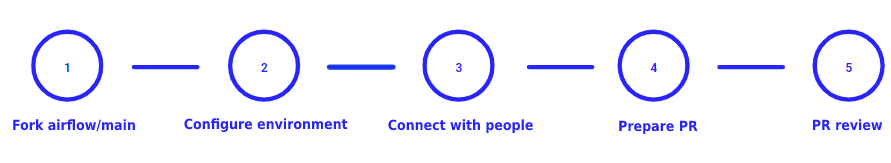
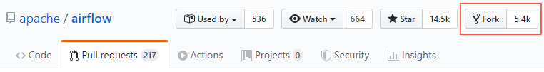
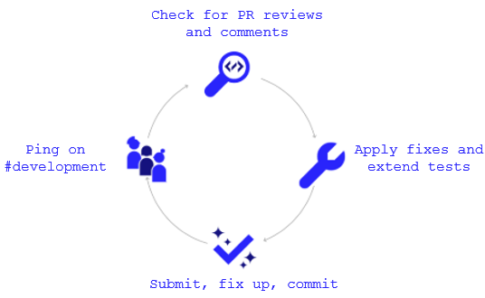
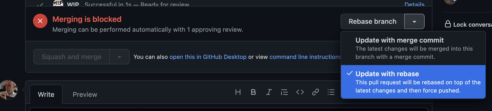

.. Licensed to the Apache Software Foundation (ASF) under one
    or more contributor license agreements.  See the NOTICE file
    distributed with this work for additional information
    regarding copyright ownership.  The ASF licenses this file
    to you under the Apache License, Version 2.0 (the
    "License"); you may not use this file except in compliance
    with the License.  You may obtain a copy of the License at

 ..   http://www.apache.org/licenses/LICENSE-2.0

 .. Unless required by applicable law or agreed to in writing,
    software distributed under the License is distributed on an
    "AS IS" BASIS, WITHOUT WARRANTIES OR CONDITIONS OF ANY
    KIND, either express or implied.  See the License for the
    specific language governing permissions and limitations
    under the License.

.. contents:: :local:

Contributions
=============

Contributions are welcome and are greatly appreciated! Every little bit helps,
and credit will always be given.

This document aims to explain the subject of contributions if you have not contributed to
any Open Source project, but it will also help people who have contributed to other projects learn about the
rules of that community.

New Contributor
---------------
If you are a new contributor, please follow the `Contributors Quick Start <https://github.com/apache/airflow/blob/main
/CONTRIBUTORS_QUICK_START.rst>`__ guide to get a gentle step-by-step introduction to setting up the development
environment and making your first contribution.

Get Mentoring Support
---------------------

If you are new to the project, you might need some help in understanding how the dynamics
of the community works and you might need to get some mentorship from other members of the
community - mostly Airflow committers (maintainers). Mentoring new members of the community is part of
maintainers job so do not be afraid of asking them to help you. You can do it
via comments in your PR, asking on a devlist or via Slack. For your convenience,
we have a dedicated #development-first-pr-support Slack channel where you can ask any questions
about making your first Pull Request (PR) contribution to the Airflow codebase - it's a safe space
where it is expected that people asking questions do not know a lot Airflow (yet!).
If you need help with Airflow see the Slack channel #troubleshooting.

To check on how mentoring works for the projects under Apache Software Foundation's
`Apache Community Development - Mentoring <https://community.apache.org/mentoring/>`_.

Report Bugs
-----------

Report bugs through `GitHub <https://github.com/apache/airflow/issues>`__.

Please report relevant information and preferably code that exhibits the
problem.

Fix Bugs
--------

Look through the GitHub issues for bugs. Anything is open to whoever wants to
implement it.

Issue reporting and resolution process
--------------------------------------

An unusual element of the Apache Airflow project is that you can open a PR to
fix an issue or make an enhancement, without needing to open an issue first.
This is intended to make it as easy as possible to contribute to the project.

If you however feel the need to open an issue (usually a bug or feature request)
consider starting with a `GitHub Discussion <https://github.com/apache/airflow/discussions>`_ instead.
In the vast majority of cases discussions are better than issues - you should only open
issues if you are sure you found a bug and have a reproducible case,
or when you want to raise a feature request that will not require a lot of discussion.
If you have a very important topic to discuss, start a discussion on the
`Devlist <https://lists.apache.org/list.html?dev@airflow.apache.org>`_ instead.

The Apache Airflow project uses a set of labels for tracking and triaging issues, as
well as a set of priorities and milestones to track how and when the enhancements and bug
fixes make it into an Airflow release. This is documented as part of
the `Issue reporting and resolution process <ISSUE_TRIAGE_PROCESS.rst>`_,

Implement Features
------------------

Look through the `GitHub issues labeled "kind:feature"
<https://github.com/apache/airflow/labels/kind%3Afeature>`__ for features.

Any unassigned feature request issue is open to whoever wants to implement it.

We've created the operators, hooks, macros and executors we needed, but we've
made sure that this part of Airflow is extensible. New operators, hooks, macros
and executors are very welcomed!

Improve Documentation
---------------------

Airflow could always use better documentation, whether as part of the official
Airflow docs, in docstrings, ``docs/*.rst`` or even on the web as blog posts or
articles.

See the `Docs README <https://github.com/apache/airflow/blob/main/docs/README.rst>`__ for more information about contributing to Airflow docs.

Submit Feedback
---------------

The best way to send feedback is to `open an issue on GitHub <https://github.com/apache/airflow/issues/new/choose>`__.

If you are proposing a new feature:

-   Explain in detail how it would work.
-   Keep the scope as narrow as possible to make it easier to implement.
-   Remember that this is a volunteer-driven project, and that contributions are
    welcome :)

Roles
=============

There are several roles within the Airflow Open-Source community.

For detailed information for each role, see: `Committers and PMC's <./COMMITTERS.rst>`__.

PMC Member
-----------

The PMC (Project Management Committee) is a group of maintainers that drives changes in the way that
Airflow is managed as a project.

Considering Apache, the role of the PMC is primarily to ensure that Airflow conforms to Apache's processes
and guidelines.

Committers/Maintainers
----------------------

You will often see the term "committer" or "maintainer" in the context of the Airflow project. This is a person
who has write access to the Airflow repository and can merge pull requests. Committers (also known as maintainers)
are also responsible for reviewing pull requests and guiding contributors to make their first contribution.
They are also responsible for making sure that the project is moving forward and that the quality of the
code is maintained.

The term "committer" and "maintainer" is used interchangeably. The term "committer" is the official term used by the
Apache Software Foundation, while "maintainer" is more commonly used in the Open Source community and is used
in context of GitHub in a number of guidelines and documentation, so this document will mostly use "maintainer",
when speaking about Github, Pull Request, Github Issues and Discussions. On the other hand, "committer" is more
often used in devlist discussions, official communications, Airflow website and every time when we formally
refer to the role.

The official list of committers can be found `here <https://airflow.apache.org/docs/apache-airflow/stable/project.html#committers>`__.

Additionally, committers are listed in a few other places (some of these may only be visible to existing committers):

* https://whimsy.apache.org/roster/committee/airflow
* https://github.com/orgs/apache/teams/airflow-committers/members

Committers are responsible for:

* Championing one or more items on the `Roadmap <https://cwiki.apache.org/confluence/display/AIRFLOW/Airflow+Home>`__
* Reviewing & Merging Pull-Requests
* Scanning and responding to GitHub issues
* Responding to questions on the dev mailing list (dev@airflow.apache.org)

Contributors
------------

A contributor is anyone who wants to contribute code, documentation, tests, ideas, or anything to the
Apache Airflow project.

Contributors are responsible for:

* Fixing bugs
* Adding features
* Championing one or more items on the `Roadmap <https://cwiki.apache.org/confluence/display/AIRFLOW/Airflow+Home>`__.

Security Team
-------------

Security issues in Airflow are handled by the Airflow Security Team. The team consists
of selected PMC members that are interested in looking at, discussing and fixing
security issues, but it can also include committers and non-committer contributors that are
not PMC members yet and have been approved by the PMC members in a vote. You can request to
be added to the team by sending a message to private@airflow.apache.org. However, the team
should be small and focused on solving security issues, so the requests will be evaluated
on a case-by-case basis and the team size will be kept relatively small, limited to only actively
security-focused contributors.

There are certain expectations from the members of the security team:

* They are supposed to be active in assessing, discussing, fixing and releasing the
  security issues in Airflow. While it is perfectly understood that as volunteers, we might have
  periods of lower activity, prolonged lack of activity and participation will result in removal
  from the team, pending PMC decision (the decision on removal can be taken by `LAZY CONSENSUS <https://community.apache.org/committers/lazyConsensus.html>`_ among
  all the PMC members on private@airflow.apache.org mailing list).

* They are not supposed to reveal the information about pending and unfixed security issues to anyone
  (including their employers) unless specifically authorised by the security team members, specifically
  if diagnosing and solving the issue might involve the need of external experts - for example security
  experts that are available through Airflow stakeholders. The intent about involving 3rd parties has
  to be discussed and agreed upon at security@airflow.apache.org.

* They have to have an `ICLA <https://www.apache.org/licenses/contributor-agreements.html>`_ signed with
  Apache Software Foundation.

* The security team members might inform 3rd parties about fixes, for example in order to assess if the fix
  is solving the problem or in order to assess its applicability to be applied by 3rd parties, as soon
  as a PR solving the issue is opened in the public airflow repository.

* In case of critical security issues, the members of the security team might iterate on a fix in a
  private repository and only open the PR in the public repository once the fix is ready to be released,
  with the intent of minimizing the time between the fix being available and the fix being released. In this
  case the PR might be sent to review and comment to the PMC members on private list, in order to request
  an expedited voting on the release. The voting for such release might be done on the
  private@airflow.apache.org mailing list and should be made public at the dev@apache.airflow.org
  mailing list as soon as the release is ready to be announced.

* The security team members working on the fix might be mentioned as remediation developers in the CVE
  including their job affiliation if they want to.

* Community members acting as release managers are by default members of the security team and unless they
  want to, they do not have to be involved in discussing and solving the issues. They are responsible for
  releasing the CVE information (announcement and publishing to security indexes) as part of the
  release process. This is facilitated by the security tool provided by the Apache Software Foundation.

* Severity of the issue is determined based on the criteria described in the
  `Severity Rating blog post <https://security.apache.org/blog/severityrating/>`_  by the Apache Software
  Foundation Security team.

Periodic Security team rotation
-------------------------------

Handling security issues is something of a chore, it takes vigilance, requires quick reaction and responses
and often requires to act outside of the regular "day" job. This means that not everyone can keep up with
being part of the security team for long while being engaged and active. While we do not expect all the
security team members to be active all the time, and - since we are volunteers, it's perfectly understandable
that work, personal life, family and generally life might not help with being active. And this is not a
considered as being failure, it's more stating the fact of life.

Also prolonged time of being exposed to handling "other's" problems and discussing similar kinds of problem
and responses might be tiring and might lead to burnout.

However, for those who have never done that before, participation in the security team might be an interesting
experience and a way to learn a lot about security and security issue handling. We have a lot of
established processes and tools that make the work of the security team members easier, so this can be
treated as a great learning experience for some community members. And knowing that this is not
a "lifetime" assignment, but rather a temporary engagement might make it easier for people to decide to
join the security team.

That's why introduced rotation of the security team members.

Periodically - every 3-4 months (depending on actual churn of the security issues that are reported to us),
we re-evaluate the engagement and activity of the security team members, and we ask them if they want to
continue being part of the security team, taking into account their engagement since the last team refinement.
Generally speaking if the engagement during the last period was marginal, the person is considered as a
candidate for removing from the team and it requires a deliberate confirmation of re-engagement to take
the person off-the-list.

At the same time we open up the possibility to other people in the community to join the team and make
a "call for new security team members" where community members can volunteer to join the security team.
Such volunteering should happen on the private@ list. The current members of the security team as well
as PMC members can also nominate other community members to join the team and those new team members
have to be well recognized and trusted by the community and accepted by the PMC.

The proposal of team refinement is passed to the PMC as LAZY CONSENSUS (or VOTE if consensus cannot
be reached). In case the consensus cannot be reached for the whole list, we can split it and ask for
lazy consensus for each person separately.

Contribution Workflow
=====================

Typically, you start your first contribution by reviewing open tickets
at `GitHub issues <https://github.com/apache/airflow/issues>`__.

If you create pull-request, you don't have to create an issue first, but if you want, you can do it.
Creating an issue will allow you to collect feedback or share plans with other people.

For example, you want to have the following sample ticket assigned to you:
`#7782: Add extra CC: to the emails sent by Airflow <https://github.com/apache/airflow/issues/7782>`_.

In general, your contribution includes the following stages:

1. Make your own `fork <https://help.github.com/en/github/getting-started-with-github/fork-a-repo>`__ of
   the Apache Airflow `main repository <https://github.com/apache/airflow>`__.

2. Create a `local virtualenv <LOCAL_VIRTUALENV.rst>`_,
   initialize the `Breeze environment <dev/breeze/doc/breeze.rst>`__, and
   install `pre-commit framework <STATIC_CODE_CHECKS.rst#pre-commit-hooks>`__.
   If you want to add more changes in the future, set up your fork and enable GitHub Actions.

3. Join `devlist <https://lists.apache.org/list.html?dev@airflow.apache.org>`__
   and set up a `Slack account <https://s.apache.org/airflow-slack>`__.

4. Make the change and create a `Pull Request (PR) from your fork <https://help.github.com/en/github/collaborating-with-issues-and-pull-requests/creating-a-pull-request-from-a-fork>`__.

5. Ping @ #development slack, comment @people. Be annoying. Be considerate.

Step 1: Fork the Apache Airflow Repo
------------------------------------
From the `apache/airflow <https://github.com/apache/airflow>`_ repo,
`create a fork <https://help.github.com/en/github/getting-started-with-github/fork-a-repo>`_:

Step 2: Configure Your Environment
----------------------------------

You can use several development environments for Airflow. If you prefer to have development environments
on your local machine, you might choose Local Virtualenv, or dockerized Breeze environment, however we
also have support for popular remote development environments: GitHub Codespaces and GitPodify.
You can see the differences between the various environments
`here <https://github.com/apache/airflow/blob/main/CONTRIBUTING.rst#development-environments>`__.

The local env instructions can be found in full in the `LOCAL_VIRTUALENV.rst <https://github.com/apache/airflow/blob/main/LOCAL_VIRTUALENV.rst>`_ file.

The Breeze Docker Compose env is to maintain a consistent and common development environment so that you
can replicate CI failures locally and work on solving them locally rather by pushing to CI.

The Breeze instructions can be found in full in the
`Breeze <https://github.com/apache/airflow/blob/main/dev/breeze/doc/breeze.rst>`_ file.

You can configure the Docker-based Breeze development environment as follows:

1. Install the latest versions of the `Docker Community Edition <https://docs.docker.com/get-docker/>`_ and `Docker Compose <https://docs.docker.com/compose/install/#install-compose>`_ and add them to the PATH.

2. Install `jq`_ on your machine. The exact command depends on the operating system (or Linux distribution) you use.

.. _jq: https://stedolan.github.io/jq/

For example, on Ubuntu:

.. code-block:: bash

   sudo apt install jq

or on macOS with `Homebrew <https://formulae.brew.sh/formula/jq>`_

.. code-block:: bash

   brew install jq

3. Enter Breeze, and run the following in the Airflow source code directory:

.. code-block:: bash

   breeze

Breeze starts with downloading the Airflow CI image from
the Docker Hub and installing all required dependencies.

This will enter the Docker environment and mount your local sources
to make them immediately visible in the environment.

4. Create a local virtualenv, for example:

.. code-block:: bash

   mkvirtualenv myenv --python=python3.9

5. Initialize the created environment:

.. code-block:: bash

   ./scripts/tools/initialize_virtualenv.py

6. Open your IDE (for example, PyCharm) and select the virtualenv you created
   as the project's default virtualenv in your IDE.

Step 3: Connect with People
---------------------------

For effective collaboration, make sure to join the following Airflow groups:

- Mailing lists:

  - Developer's mailing list `<dev-subscribe@airflow.apache.org>`_
    (quite substantial traffic on this list)

  - All commits mailing list: `<commits-subscribe@airflow.apache.org>`_
    (very high traffic on this list)

  - Airflow users mailing list: `<users-subscribe@airflow.apache.org>`_
    (reasonably small traffic on this list)

- `Issues on GitHub <https://github.com/apache/airflow/issues>`__

- `Slack (chat) <https://s.apache.org/airflow-slack>`__

Step 4: Prepare PR
------------------

1. Update the local sources to address the issue.

   For example, to address this example issue, do the following:

   * Read about `email configuration in Airflow </docs/apache-airflow/howto/email-config.rst>`__.

   * Find the class you should modify. For the example GitHub issue,
     this is `email.py <https://github.com/apache/airflow/blob/main/airflow/utils/email.py>`__.

   * Find the test class where you should add tests. For the example ticket,
     this is `test_email.py <https://github.com/apache/airflow/blob/main/tests/utils/test_email.py>`__.

   * Make sure your fork's main is synced with Apache Airflow's main before you create a branch. See
     `How to sync your fork <#how-to-sync-your-fork>`_ for details.

   * Create a local branch for your development. Make sure to use latest
     ``apache/main`` as base for the branch. See `How to Rebase PR <#how-to-rebase-pr>`_ for some details
     on setting up the ``apache`` remote. Note, some people develop their changes directly in their own
     ``main`` branches - this is OK and you can make PR from your main to ``apache/main`` but we
     recommend to always create a local branch for your development. This allows you to easily compare
     changes, have several changes that you work on at the same time and many more.
     If you have ``apache`` set as remote then you can make sure that you have latest changes in your main
     by ``git pull apache main`` when you are in the local ``main`` branch. If you have conflicts and
     want to override your locally changed main you can override your local changes with
     ``git fetch apache; git reset --hard apache/main``.

   * Modify the class and add necessary code and unit tests.

   * Run the unit tests from the `IDE <TESTING.rst#running-unit-tests-from-ide>`__
     or `local virtualenv <TESTING.rst#running-unit-tests-from-local-virtualenv>`__ as you see fit.

   * Run the tests in `Breeze <TESTING.rst#running-unit-tests-inside-breeze>`__.

   * Run and fix all the `static checks <STATIC_CODE_CHECKS.rst>`__. If you have
     `pre-commits installed <STATIC_CODE_CHECKS.rst#pre-commit-hooks>`__,
     this step is automatically run while you are committing your code. If not, you can do it manually
     via ``git add`` and then ``pre-commit run``.

   * Consider adding a newsfragment to your PR so you can add an entry in the release notes.
     The following newsfragment types are supported:

     * `significant`
     * `feature`
     * `improvement`
     * `bugfix`
     * `doc`
     * `misc`

     To add a newsfragment, create an ``rst`` file named ``{pr_number}.{type}.rst`` (e.g. ``1234.bugfix.rst``)
     and place in either `newsfragments <https://github.com/apache/airflow/blob/main/newsfragments>`__ for core newsfragments,
     or `chart/newsfragments <https://github.com/apache/airflow/blob/main/chart/newsfragments>`__ for helm chart newsfragments.

     In general newsfragments must be one line.  For newsfragment type ``significant``, you may include summary and body separated by a blank line, similar to ``git`` commit messages.

2. Rebase your fork, squash commits, and resolve all conflicts. See `How to rebase PR <#how-to-rebase-pr>`_
   if you need help with rebasing your change. Remember to rebase often if your PR takes a lot of time to
   review/fix. This will make rebase process much easier and less painful and the more often you do it,
   the more comfortable you will feel doing it.

3. Re-run static code checks again.

4. Make sure your commit has a good title and description of the context of your change, enough
   for maintainers reviewing it to understand why you are proposing a change. Make sure to follow other
   PR guidelines described in `Pull Request guidelines <#pull-request-guidelines>`_.
   Create Pull Request! Make yourself ready for the discussion!

5. The ``static checks`` and ``tests`` in your PR serve as a first-line-of-check, whether the PR
   passes the quality bar for Airflow. It basically means that until you get your PR green, it is not
   likely to get reviewed by maintainers unless you specifically ask for it and explain that you would like
   to get first pass of reviews and explain why achieving ``green`` status for it is not easy/feasible/desired.
   Similarly if your PR contains ``[WIP]`` in the title or it is marked as ``Draft`` it is not likely to get
   reviewed by maintainers unless you specifically ask for it and explain why and what specifically you want
   to get reviewed before it reaches ``Ready for review`` status. This might happen if you want to get initial
   feedback on the direction of your PR or if you want to get feedback on the design of your PR.

6. Avoid @-mentioning individual maintainers in your PR, unless you have good reason to believe that they are
   available, have time and/or interest in your PR. Generally speaking there are no "exclusive" reviewers for
   different parts of the code. Reviewers review PRs and respond when they have some free time to spare and
   when they feel they can provide some valuable feedback. If you want to get attention of maintainers, you can just
   follow-up on your PR and ask for review in general, however be considerate and do not expect "immediate"
   reviews. People review when they have time, most of the maintainers do such reviews in their
   free time, which is taken away from their families and other interests, so allow sufficient time before you
   follow-up - but if you see no reaction in several days, do follow-up, as with the number of PRs we have
   daily, some of them might simply fall through the cracks, and following up shows your interest in completing
   the PR as well as puts it at the top of "Recently commented" PRs. However, be considerate and mindful of
   the time zones, holidays, busy periods, and expect that some discussions and conversation might take time
   and get stalled occasionally. Generally speaking it's the author's responsibility to follow-up on the PR when
   they want to get it reviewed and merged.

Step 5: Pass PR Review
----------------------

Note that maintainers will use **Squash and Merge** instead of **Rebase and Merge**
when merging PRs and your commit will be squashed to single commit.

When a reviewer starts a conversation it is expected that you respond to questions, suggestions, doubts,
and generally it's great if all such conversations seem to converge to a common understanding. You do not
necessarily have to apply all the suggestions (often they are just opinions and suggestions even if they are
coming from seasoned maintainers) - it's perfectly ok that you respond to it with your own opinions and
understanding of the problem and your approach and if you have good arguments, presenting them is a good idea.

The reviewers might leave several types of responses:

* ``General PR comment`` - which usually means that there is a question/opinion/suggestion on how the PR can be
  improved, or it's an ask to explain how you understand the PR. You can usually quote some parts of such
  general comment and respond to it in your comments. Often comments that are raising questions in general
  might lead to different discussions, even a request to move the discussion to the devlist or even lead to
  completely new PRs created as a spin-off of the discussion.

* ``Comment/Conversation around specific lines of code`` - such conversation usually flags a potential
  improvement, or a potential problem with the code. It's a good idea to respond to such comments and explain
  your approach and understanding of the problem. The whole idea of a conversation is try to reach a consensus
  on a good way to address the problem. As an author you can resolve the conversation if you think the
  problem raised in the comment is resolved or ask the reviewer to re-review, confirm If you do not understand
  the comment, you can ask for clarifications. Generally assume good intention of the person who is reviewing
  your code and resolve conversations also having good intentions. Understand that it's not a person that
  is criticised or argued with, but rather the code and the approach. The important thing is to take care
  about quality of the the code and the project and want to make sure that the code is good.

  It's ok to mark the conversation resolved by anyone who can do it - it could be the author, who thinks
  the arguments are changes implemented make the conversation resolved, or the maintainer/person who
  started the conversation or it can be even marked as resolved by the maintainer who attempts to merge the
  PR and thinks that all conversations are resolved. However if you want to make sure attention and decision
  on merging the PR is given by maintainer, make sure you monitor, follow-up and close the conversations when
  you think they are resolved (ideally explaining why you think the conversation is resolved).

* ``Request changes`` - this is where maintainer is pretty sure that you should make a change to your PR
  because it contains serious flaw, design misconception, or a bug or it is just not in-line with the common
  approach Airflow community took on the issue. Usually you should respond to such request and either fix
  the problem or convince the maintainer that they were wrong (it happens more often than you think).
  Sometimes even if you do not agree with the request, it's a good idea to make the change anyway, because
  it might be a good idea to follow the common approach in the project. Sometimes it might even happen that
  two maintainers will have completely different opinions on the same issue and you will have to lead the
  discussion to try to achieve consensus. If you cannot achieve consensus and you think it's an important
  issue, you can ask for a vote on the issue by raising a devlist discussion - where you explain your case
  and follow up the discussion with a vote when you cannot achieve consensus there. The ``Request changes``
  status can be withdrawn by the maintainer, but if they don't - such PR cannot be merged - maintainers have
  the right to veto any code modification according to the `Apache Software Foundation rules <https://www.apache.org/foundation/voting.html#votes-on-code-modification>`_.

* ``Approval`` - this is given by a maintainer after the code has been reviewed and the maintainer agrees that
  it is a good idea to merge it. There might still be some unresolved conversations, requests and questions on
  such PR and you are expected to resolve them before the PR is merged. But the ``Approval`` status is a sign
  of trust from the maintainer who gave the approval that they think the PR is good enough as long as their
  comments will be resolved and they put the trust in the hands of the author and - possibly - other
  maintainers who will merge the request that they can do that without follow-up re-review and verification.

You need to have ``Approval`` of at least one maintainer (if you are maintainer yourself, it has to be
another maintainer). Ideally you should have 2 or more maintainers reviewing the code that touches
the core of Airflow - we do not have enforcement about ``2+`` reviewers required for Core of Airflow,
but maintainers will generally ask in the PR if they think second review is needed.

Your PR can be merged by a maintainer who will see that the PR is approved, all conversations are resolved
and the code looks good. The criteria for PR being merge-able are:

* ``green status for static checks and tests``
* ``conversations resolved``
* ``approval from 1 (or more for core changes) maintainers``
* no unresolved ``Request changes``

Once you reach the status, you do not need to do anything to get the PR merged. One of the maintainers
will merge such PRs. However if you see that for a few days such a PR is not merged, do not hesitate to comment
on your PR and mention that you think it is ready to be merged. Also, it's a good practice to rebase your PR
to latest ``main``, because there could be other changes merged in the meantime that might cause conflicts or
fail tests or static checks, so by rebasing a PR that has been build few days ago you make sure that it
still passes the tests and static checks today.

.. note:: |experimental|

   In December 2023 we enabled - experimentally - the requirement to resolve all the open conversations in a
   PR in order to make it merge-able. You will see in the status of the PR that it needs to have all the
   conversations resolved before it can be merged.

   This is an experiment and we will evaluate by the end of January 2024. If it turns out to be a good idea,
   we will keep it enabled in the future.

   The goal of this experiment is to make it easier to see when there are some conversations that are not
   resolved for everyone involved in the PR - author, reviewers and maintainers who try to figure out if
   the PR is ready to merge and - eventually - merge it. The goal is also to use conversations more as a "soft" way
   to request changes and limit the use of ``Request changes`` status to only those cases when the maintainer
   is sure that the PR should not be merged in the current state. That should lead to faster review/merge
   cycle and less problems with stalled PRs that have ``Request changes`` status but all the issues are
   already solved (assuming that maintainers will start treating the conversations this way).

Pull Request guidelines
=======================

Before you submit a Pull Request (PR) from your forked repo, check that it meets
these guidelines:

-   Include tests, either as doctests, unit tests, or both, to your pull request.

    The airflow repo uses `GitHub Actions <https://help.github.com/en/actions>`__ to
    run the tests and `codecov <https://codecov.io/gh/apache/airflow>`__ to track
    coverage. You can set up both for free on your fork. It will help you make sure you do not
    break the build with your PR and that you help increase coverage.
    Also we advise to install locally `pre-commit hooks <STATIC_CODE_CHECKS.rst#pre-commit-hooks>`__ to
    apply various checks, code generation and formatting at the time you make a local commit - which
    gives you near-immediate feedback on things you need to fix before you push your code to the PR, or in
    many case it will even fix it for you locally so that you can add and commit it straight away.

-   Follow our project's `Coding style and best practices`_. Usually we attempt to enforce the practices by
    having appropriate pre-commits. There are checks amongst them that aren't currently enforced
    programmatically (either because they are too hard or just not yet done).

-   We prefer that you ``rebase`` your PR (and do it quite often) rather than merge. It leads to
    easier reviews and cleaner changes where you know exactly what changes you've done. You can learn more
    about rebase vs. merge workflow in `Rebase and merge your pull request <https://github.blog/2016-09-26-rebase-and-merge-pull-requests/>`__
    and `Rebase your fork <http://stackoverflow.com/a/7244456/1110993>`__. Make sure to resolve all conflicts
    during rebase.

-   When merging PRs, Maintainer will use **Squash and Merge** which means then your PR will be merged as one
    commit, regardless of the number of commits in your PR. During the review cycle, you can keep a commit
    history for easier review, but if you need to, you can also squash all commits to reduce the
    maintenance burden during rebase.

-   Add an `Apache License <http://www.apache.org/legal/src-headers.html>`__ header to all new files. If you
    have ``pre-commit`` installed, pre-commit will do it automatically for you. If you hesitate to install
    pre-commit for your local repository - for example because it takes a few seconds to commit your changes,
    this one thing might be a good reason to convince anyone to install pre-commit.

-   If your PR adds functionality, make sure to update the docs as part of the same PR, not only
    code and tests. Docstring is often sufficient. Make sure to follow the Sphinx compatible standards.

-   Make sure your code fulfills all the
    `static code checks <STATIC_CODE_CHECKS.rst#static-code-checks>`__ we have in our code. The easiest way
    to make sure of that is - again - to install `pre-commit hooks <STATIC_CODE_CHECKS.rst#pre-commit-hooks>`__

-   Make sure your PR is small and focused on one change only - avoid adding unrelated changes, mixing
    adding features and refactoring. Keeping to that rule will make it easier to review your PR and will make
    it easier for release managers if they decide that your change should be cherry-picked to release it in a
    bug-fix release of Airflow. If you want to add a new feature and refactor the code, it's better to split the
    PR to several smaller PRs. It's also quite a good and common idea to keep a big ``Draft`` PR if you have
    a bigger change that you want to make and then create smaller PRs from it that are easier to review and
    merge and cherry-pick. It takes a long time (and a lot of attention and focus of a reviewer to review
    big PRs so by splitting it to smaller PRs you actually speed up the review process and make it easier
    for your change to be eventually merged.

-   Run relevant tests locally before opening PR. Often tests are placed in the files that are corresponding
    to the changed code (for example for ``airflow/cli/cli_parser.py`` changes you have tests in
    ``tests/cli/test_cli_parser.py``). However there are a number of cases where the tests that should run
    are placed elsewhere - you can either run tests for the whole ``TEST_TYPE`` that is relevant (see
    ``breeze testing tests --help`` output for available test types) or you can run all tests, or eventually
    you can push your code to PR and see results of the tests in the CI.

-   You can use any supported python version to run the tests, but the best is to check
    if it works for the oldest supported version (Python 3.8 currently). In rare cases
    tests might fail with the oldest version when you use features that are available in newer Python
    versions. For that purpose we have ``airflow.compat`` package where we keep back-ported
    useful features from newer versions.

-   Adhere to guidelines for commit messages described in this `article <http://chris.beams.io/posts/git-commit/>`__.
    This makes the lives of those who come after you (and your future self) a lot easier.

Airflow Git Branches
====================

All new development in Airflow happens in the ``main`` branch. All PRs should target that branch.

We also have a ``v2-*-test`` branches that are used to test ``2.*.x`` series of Airflow and where maintainers
cherry-pick selected commits from the main branch.

Cherry-picking is done with the ``-x`` flag.

The ``v2-*-test`` branch might be broken at times during testing. Expect force-pushes there so
maintainers should coordinate between themselves on who is working on the ``v2-*-test`` branch -
usually these are developers with the release manager permissions.

The ``v2-*-stable`` branch is rather stable - there are minimum changes coming from approved PRs that
passed the tests. This means that the branch is rather, well, "stable".

Once the ``v2-*-test`` branch stabilises, the ``v2-*-stable`` branch is synchronized with ``v2-*-test``.
The ``v2-*-stable`` branches are used to release ``2.*.x`` releases.

The general approach is that cherry-picking a commit that has already had a PR and unit tests run
against main is done to ``v2-*-test`` branches, but PRs from contributors towards 2.0 should target
``v2-*-stable`` branches.

The ``v2-*-test`` branches and ``v2-*-stable`` ones are merged just before the release and that's the
time when they converge.

The production images are released in DockerHub from:

* main branch for development
* ``2.*.*``, ``2.*.*rc*`` releases from the ``v2-*-stable`` branch when we prepare release candidates and
  final releases.

Development Environments
========================

There are two environments, available on Linux and macOS, that you can use to
develop Apache Airflow:

-   `Local virtualenv development environment <LOCAL_VIRTUALENV.rst>`_
    that supports running unit tests and can be used in your IDE.

-   `Breeze Docker-based development environment <dev/breeze/doc/breeze.rst>`_ that provides
    an end-to-end CI solution with all software dependencies covered.

The table below summarizes differences between the environments:

========================= ================================ ===================================== ========================================
**Property**              **Local virtualenv**             **Breeze environment**                 **GitHub Codespaces**
========================= ================================ ===================================== ========================================
Dev machine needed        - (-) You need a dev PC          - (-) You need a dev PC                (+) Works with remote setup
------------------------- -------------------------------- ------------------------------------- ----------------------------------------
Test coverage             - (-) unit tests only            - (+) integration and unit tests       (*/-) integration tests (extra config)
------------------------- -------------------------------- ------------------------------------- ----------------------------------------
Setup                     - (+) automated with breeze cmd  - (+) automated with breeze cmd        (+) automated with VSCode
------------------------- -------------------------------- ------------------------------------- ----------------------------------------
Installation difficulty   - (-) depends on the OS setup    - (+) works whenever Docker works      (+) works in a modern browser/VSCode
------------------------- -------------------------------- ------------------------------------- ----------------------------------------
Team synchronization      - (-) difficult to achieve       - (+) reproducible within team         (+) reproducible within team
------------------------- -------------------------------- ------------------------------------- ----------------------------------------
Reproducing CI failures   - (-) not possible in many cases - (+) fully reproducible               (+) reproduce CI failures
------------------------- -------------------------------- ------------------------------------- ----------------------------------------
Ability to update         - (-) requires manual updates    - (+) automated update via breeze cmd  (+/-) can be rebuild on demand
------------------------- -------------------------------- ------------------------------------- ----------------------------------------
Disk space and CPU usage  - (+) relatively lightweight     - (-) uses GBs of disk and many CPUs   (-) integration tests (extra config)
------------------------- -------------------------------- ------------------------------------- ----------------------------------------
IDE integration           - (+) straightforward            - (-) via remote debugging only        (-) integration tests (extra config)
========================= ================================ ===================================== ----------------------------------------

Typically, you are recommended to use both of these environments depending on your needs.

Local virtualenv Development Environment
----------------------------------------

All details about using and running local virtualenv environment for Airflow can be found
in `LOCAL_VIRTUALENV.rst <LOCAL_VIRTUALENV.rst>`__.

Benefits:

-   Packages are installed locally. No container environment is required.

-   You can benefit from local debugging within your IDE.

-   With the virtualenv in your IDE, you can benefit from autocompletion and running tests directly from the IDE.

Limitations:

-   You have to maintain your dependencies and local environment consistent with
    other development environments that you have on your local machine.

-   You cannot run tests that require external components, such as mysql,
    postgres database, hadoop, mongo, cassandra, redis, etc.

    The tests in Airflow are a mixture of unit and integration tests and some of
    them require these components to be set up. Local virtualenv supports only
    real unit tests. Technically, to run integration tests, you can configure
    and install the dependencies on your own, but it is usually complex.
    Instead, you are recommended to use
    `Breeze development environment <dev/breeze/doc/breeze.rst>`__ with all required packages
    pre-installed.

-   You need to make sure that your local environment is consistent with other
    developer environments. This often leads to a "works for me" syndrome. The
    Breeze container-based solution provides a reproducible environment that is
    consistent with other developers.

-   You are **STRONGLY** encouraged to also install and use `pre-commit hooks <STATIC_CODE_CHECKS.rst#pre-commit-hooks>`_
    for your local virtualenv development environment.
    Pre-commit hooks can speed up your development cycle a lot.

Breeze Development Environment
------------------------------

All details about using and running Airflow Breeze can be found in
`Breeze <dev/breeze/doc/breeze.rst>`__.

The Airflow Breeze solution is intended to ease your local development as "*It's
a Breeze to develop Airflow*".

Benefits:

-   Breeze is a complete environment that includes external components, such as
    mysql database, hadoop, mongo, cassandra, redis, etc., required by some of
    Airflow tests. Breeze provides a preconfigured Docker Compose environment
    where all these services are available and can be used by tests
    automatically.

-   Breeze environment is almost the same as used in the CI automated builds.
    So, if the tests run in your Breeze environment, they will work in the CI as well.
    See `<CI.rst>`_ for details about Airflow CI.

Limitations:

-   Breeze environment takes significant space in your local Docker cache. There
    are separate environments for different Python and Airflow versions, and
    each of the images takes around 3GB in total.

-   Though Airflow Breeze setup is automated, it takes time. The Breeze
    environment uses pre-built images from DockerHub and it takes time to
    download and extract those images. Building the environment for a particular
    Python version takes less than 10 minutes.

-   Breeze environment runs in the background taking precious resources, such as
    disk space and CPU. You can stop the environment manually after you use it
    or even use a ``bare`` environment to decrease resource usage.

.. note::

   Breeze CI images are not supposed to be used in production environments.
   They are optimized for repeatability of tests, maintainability and speed of building rather
   than production performance. The production images are not yet officially published.

Airflow dependencies
====================

.. note::

   Only ``pip`` installation is currently officially supported.

   While there are some successes with using other tools like `poetry <https://python-poetry.org/>`_ or
   `pip-tools <https://pypi.org/project/pip-tools/>`_, they do not share the same workflow as
   ``pip`` - especially when it comes to constraint vs. requirements management.
   Installing via ``Poetry`` or ``pip-tools`` is not currently supported.

   There are known issues with ``bazel`` that might lead to circular dependencies when using it to install
   Airflow. Please switch to ``pip`` if you encounter such problems. ``Bazel`` community works on fixing
   the problem in `this PR <https://github.com/bazelbuild/rules_python/pull/1166>`_ so it might be that
   newer versions of ``bazel`` will handle it.

   If you wish to install airflow using those tools you should use the constraint files and convert
   them to appropriate format and workflow that your tool requires.

Extras
------

There are a number of extras that can be specified when installing Airflow. Those
extras can be specified after the usual pip install - for example ``pip install -e.[ssh]`` for editable
installation. Note that there are two kinds of those extras - ``regular`` extras (used when you install
airflow as a user, but in ``editable`` mode you can also install ``devel`` extras that are necessary if
you want to run airflow locally for testing and ``doc`` extras that install tools needed to build
the documentation.

This is the full list of those extras:

Devel extras
.............

The ``devel`` extras are not available in the released packages. They are only available when you install
Airflow from sources in ``editable`` installation - i.e. one that you are usually using to contribute to
Airflow. They provide tools such as ``pytest`` and ``mypy`` for general purpose development and testing, also
some providers have their own development-related extras tbat allow to install tools necessary to run tests,
where the tools are specific for the provider.

  .. START DEVEL EXTRAS HERE
devel, devel-all, devel-all-dbs, devel-ci, devel-debuggers, devel-devscripts, devel-duckdb, devel-
hadoop, devel-mypy, devel-sentry, devel-static-checks, devel-tests
  .. END DEVEL EXTRAS HERE

Doc extras
...........

The ``doc`` extras are not available in the released packages. They are only available when you install
Airflow from sources in ``editable`` installation - i.e. one that you are usually using to contribute to
Airflow. They provide tools needed when you want to build Airflow documentation (note that you also need
``devel`` extras installed for airflow and providers in order to build documentation for airflow and
provider packages respectively). The ``doc`` package is enough to build regular documentation, where
``doc_gen`` is needed to generate ER diagram we have describing our database.

  .. START DOC EXTRAS HERE
doc, doc-gen
  .. END DOC EXTRAS HERE

Regular extras
..............

Those extras are available as regular Airflow extras and are targeted to be used by Airflow users and
contributors to select features of Airflow they want to use They might install additional providers or
just install dependencies that are necessary to enable the feature.

  .. START REGULAR EXTRAS HERE
aiobotocore, airbyte, alibaba, all, all-core, all-dbs, amazon, apache-atlas, apache-beam, apache-
cassandra, apache-drill, apache-druid, apache-flink, apache-hdfs, apache-hive, apache-impala,
apache-kafka, apache-kylin, apache-livy, apache-pig, apache-pinot, apache-spark, apache-webhdfs,
apprise, arangodb, asana, async, atlas, atlassian-jira, aws, azure, cassandra, celery, cgroups,
cloudant, cncf-kubernetes, cohere, common-io, common-sql, crypto, databricks, datadog, dbt-cloud,
deprecated-api, dingding, discord, docker, druid, elasticsearch, exasol, fab, facebook, ftp, gcp,
gcp_api, github, github-enterprise, google, google-auth, graphviz, grpc, hashicorp, hdfs, hive,
http, imap, influxdb, jdbc, jenkins, kerberos, kubernetes, ldap, leveldb, microsoft-azure,
microsoft-mssql, microsoft-psrp, microsoft-winrm, mongo, mssql, mysql, neo4j, odbc, openai,
openfaas, openlineage, opensearch, opsgenie, oracle, otel, pagerduty, pandas, papermill, password,
pgvector, pinecone, pinot, postgres, presto, qdrant, rabbitmq, redis, s3, s3fs, salesforce, samba,
saml, segment, sendgrid, sentry, sftp, singularity, slack, smtp, snowflake, spark, sqlite, ssh,
statsd, tableau, tabular, telegram, trino, vertica, virtualenv, weaviate, webhdfs, winrm, yandex,
zendesk
  .. END REGULAR EXTRAS HERE

Provider packages
-----------------

Airflow 2.0 is split into core and providers. They are delivered as separate packages:

* ``apache-airflow`` - core of Apache Airflow
* ``apache-airflow-providers-*`` - More than 70 provider packages to communicate with external services

The information/meta-data about the providers is kept in ``provider.yaml`` file in the right sub-directory
of ``airflow\providers``. This file contains:

* package name (``apache-airflow-provider-*``)
* user-facing name of the provider package
* description of the package that is available in the documentation
* list of versions of package that have been released so far
* list of dependencies of the provider package
* list of additional-extras that the provider package provides (together with dependencies of those extras)
* list of integrations, operators, hooks, sensors, transfers provided by the provider (useful for documentation generation)
* list of connection types, extra-links, secret backends, auth backends, and logging handlers (useful to both
  register them as they are needed by Airflow and to include them in documentation automatically).
* and more ...

If you want to add dependencies to the provider, you should add them to the corresponding ``provider.yaml``
and Airflow pre-commits and package generation commands will use them when preparing package information.

In Airflow 1.10 all those providers were installed together within one single package and when you installed
airflow locally, from sources, they were also installed. In Airflow 2.0, providers are separated out,
and not packaged together with the core when you build "apache-airflow" package, however when you install
airflow project locally with ``pip install -e ".[devel]"`` they are available on the same
environment as Airflow.

You should only update dependencies for the provider in the corresponding ``provider.yaml`` which is the
source of truth for all information about the provider.

Some of the packages have cross-dependencies with other providers packages. This typically happens for
transfer operators where operators use hooks from the other providers in case they are transferring
data between the providers. The list of dependencies is maintained (automatically with the
``update-providers-dependencies`` pre-commit) in the ``generated/provider_dependencies.json``.
Same pre-commit also updates generate dependencies in ``pyproject.toml``.

Cross-dependencies between provider packages are converted into extras - if you need functionality from
the other provider package you can install it adding [extra] after the
``apache-airflow-providers-PROVIDER`` for example:
``pip install apache-airflow-providers-google[amazon]`` in case you want to use GCP
transfer operators from Amazon ECS.

If you add a new dependency between different providers packages, it will be detected automatically during
and pre-commit will generate new entry in ``generated/provider_dependencies.json`` and update
``pyproject.toml`` so that the package extra dependencies are properly handled when package
might be installed when breeze is restarted or by your IDE or by running ``pip install -e ".[devel]"``.

Developing community managed provider packages
----------------------------------------------

While you can develop your own providers, Apache Airflow has 60+ providers that are managed by the community.
They are part of the same repository as Apache Airflow (we use ``monorepo`` approach where different
parts of the system are developed in the same repository but then they are packaged and released separately).
All the community-managed providers are in 'airflow/providers' folder and they are all sub-packages of
'airflow.providers' package. All the providers are available as ``apache-airflow-providers-<PROVIDER_ID>``
packages when installed by users, but when you contribute to providers you can work on airflow main
and install provider dependencies via ``editable`` extras - without having to manage and install providers
separately, you can easily run tests for the providers and when you run airflow from the ``main``
sources, all community providers are automatically available for you.

The capabilities of the community-managed providers are the same as the third-party ones. When
the providers are installed from PyPI, they provide the entry-point containing the metadata as described
in the previous chapter. However when they are locally developed, together with Airflow, the mechanism
of discovery of the providers is based on ``provider.yaml`` file that is placed in the top-folder of
the provider. The ``provider.yaml`` is the single source of truth for the provider metadata and it is
there where you should add and remove dependencies for providers (following by running
``update-providers-dependencies`` pre-commit to synchronize the dependencies with ``pyproject.toml``
of Airflow).

The ``provider.yaml`` file is compliant with the schema that is available in
`json-schema specification <https://github.com/apache/airflow/blob/main/airflow/provider.yaml.schema.json>`_.

Thanks to that mechanism, you can develop community managed providers in a seamless way directly from
Airflow sources, without preparing and releasing them as packages separately, which would be rather
complicated.

Regardless if you plan to contribute your provider, when you are developing your own, custom providers,
you can use the above functionality to make your development easier. You can add your provider
as a sub-folder of the ``airflow.providers`` package, add the ``provider.yaml`` file and install airflow
in development mode - then capabilities of your provider will be discovered by airflow and you will see
the provider among other providers in ``airflow providers`` command output.

Documentation for the community managed providers
-------------------------------------------------

When you are developing a community-managed provider, you are supposed to make sure it is well tested
and documented. Part of the documentation is ``provider.yaml`` file ``integration`` information and
``version`` information. This information is stripped-out from provider info available at runtime,
however it is used to automatically generate documentation for the provider.

If you have pre-commits installed, pre-commit will warn you and let you know what changes need to be
done in the ``provider.yaml`` file when you add a new Operator, Hooks, Sensor or Transfer. You can
also take a look at the other ``provider.yaml`` files as examples.

Well documented provider contains those:

* index.rst with references to packages, API used and example dags
* configuration reference
* class documentation generated from PyDoc in the code
* example dags
* how-to guides

You can see for example ``google`` provider which has very comprehensive documentation:

* `Documentation <docs/apache-airflow-providers-google>`_
* `Example DAGs <airflow/providers/google/cloud/example_dags>`_

Part of the documentation are example dags (placed in the ``tests/system`` folder). The reason why
they are in ``tests/system`` is because we are using the example dags for various purposes:

* showing real examples of how your provider classes (Operators/Sensors/Transfers) can be used
* snippets of the examples are embedded in the documentation via ``exampleinclude::`` directive
* examples are executable as system tests and some of our stakeholders run them regularly to
  check if ``system`` level instagration is still working, before releasing a new version of the provider.

Testing the community managed providers
---------------------------------------

We have high requirements when it comes to testing the community managed providers. We have to be sure
that we have enough coverage and ways to tests for regressions before the community accepts such
providers.

* Unit tests have to be comprehensive and they should tests for possible regressions and edge cases
  not only "green path"

* Integration tests where 'local' integration with a component is possible (for example tests with
  MySQL/Postgres DB/Trino/Kerberos all have integration tests which run with real, dockerized components

* System Tests which provide end-to-end testing, usually testing together several operators, sensors,
  transfers connecting to a real external system

You can read more about out approach for tests in `TESTING.rst <TESTING.rst>`_ but here
are some highlights.

Dependency management
=====================

Airflow is not a standard python project. Most of the python projects fall into one of two types -
application or library. As described in
`this StackOverflow question <https://stackoverflow.com/questions/28509481/should-i-pin-my-python-dependencies-versions>`_,
the decision whether to pin (freeze) dependency versions for a python project depends on the type. For
applications, dependencies should be pinned, but for libraries, they should be open.

For application, pinning the dependencies makes it more stable to install in the future - because new
(even transitive) dependencies might cause installation to fail. For libraries - the dependencies should
be open to allow several different libraries with the same requirements to be installed at the same time.

The problem is that Apache Airflow is a bit of both - application to install and library to be used when
you are developing your own operators and DAGs.

This - seemingly unsolvable - puzzle is solved by having pinned constraints files.

Pinned constraint files
=======================

.. note::

   Only ``pip`` installation is officially supported.

   While it is possible to install Airflow with tools like `poetry <https://python-poetry.org/>`_ or
   `pip-tools <https://pypi.org/project/pip-tools/>`_, they do not share the same workflow as
   ``pip`` - especially when it comes to constraint vs. requirements management.
   Installing via ``Poetry`` or ``pip-tools`` is not currently supported.

   There are known issues with ``bazel`` that might lead to circular dependencies when using it to install
   Airflow. Please switch to ``pip`` if you encounter such problems. ``Bazel`` community works on fixing
   the problem in `this PR <https://github.com/bazelbuild/rules_python/pull/1166>`_ so it might be that
   newer versions of ``bazel`` will handle it.

   If you wish to install airflow using those tools you should use the constraint files and convert
   them to appropriate format and workflow that your tool requires.

By default when you install ``apache-airflow`` package - the dependencies are as open as possible while
still allowing the apache-airflow package to install. This means that ``apache-airflow`` package might fail to
install in case a direct or transitive dependency is released that breaks the installation. In such case
when installing ``apache-airflow``, you might need to provide additional constraints (for
example ``pip install apache-airflow==1.10.2 Werkzeug<1.0.0``)

There are several sets of constraints we keep:

* 'constraints' - those are constraints generated by matching the current airflow version from sources
   and providers that are installed from PyPI. Those are constraints used by the users who want to
   install airflow with pip, they are named ``constraints-<PYTHON_MAJOR_MINOR_VERSION>.txt``.

* "constraints-source-providers" - those are constraints generated by using providers installed from
  current sources. While adding new providers their dependencies might change, so this set of providers
  is the current set of the constraints for airflow and providers from the current main sources.
  Those providers are used by CI system to keep "stable" set of constraints. They are named
  ``constraints-source-providers-<PYTHON_MAJOR_MINOR_VERSION>.txt``

* "constraints-no-providers" - those are constraints generated from only Apache Airflow, without any
  providers. If you want to manage airflow separately and then add providers individually, you can
  use those. Those constraints are named ``constraints-no-providers-<PYTHON_MAJOR_MINOR_VERSION>.txt``.

The first two can be used as constraints file when installing Apache Airflow in a repeatable way.
It can be done from the sources:

from the PyPI package:

.. code-block:: bash

  pip install apache-airflow[google,amazon,async]==2.2.5 \
    --constraint "https://raw.githubusercontent.com/apache/airflow/constraints-2.2.5/constraints-3.8.txt"

The last one can be used to install Airflow in "minimal" mode - i.e when bare Airflow is installed without
extras.

When you install airflow from sources (in editable mode) you should use "constraints-source-providers"
instead (this accounts for the case when some providers have not yet been released and have conflicting
requirements).

.. code-block:: bash

  pip install -e ".[devel]" \
    --constraint "https://raw.githubusercontent.com/apache/airflow/constraints-main/constraints-source-providers-3.8.txt"

This works also with extras - for example:

.. code-block:: bash

  pip install ".[ssh]" \
    --constraint "https://raw.githubusercontent.com/apache/airflow/constraints-main/constraints-source-providers-3.8.txt"

There are different set of fixed constraint files for different python major/minor versions and you should
use the right file for the right python version.

If you want to update just airflow dependencies, without paying attention to providers, you can do it using
``constraints-no-providers`` constraint files as well.

.. code-block:: bash

  pip install . --upgrade \
    --constraint "https://raw.githubusercontent.com/apache/airflow/constraints-main/constraints-no-providers-3.8.txt"

The ``constraints-<PYTHON_MAJOR_MINOR_VERSION>.txt`` and ``constraints-no-providers-<PYTHON_MAJOR_MINOR_VERSION>.txt``
will be automatically regenerated by CI job every time after the ``pyproject.toml`` is updated and pushed
if the tests are successful.

Documentation
=============

Documentation for ``apache-airflow`` package and other packages that are closely related to it ie.
providers packages are in ``/docs/`` directory. For detailed information on documentation development,
see: `docs/README.rst <docs/README.rst>`_

Diagrams
========

We started to use (and gradually convert old diagrams to use it) `Diagrams <https://diagrams.mingrammer.com/>`_
as our tool of choice to generate diagrams. The diagrams are generated from Python code and can be
automatically updated when the code changes. The diagrams are generated using pre-commit hooks (See
static checks below) but they can also be generated manually by running the corresponding Python code.

To run the code you need to install the dependencies in the virtualenv you use to run it:
* ``pip install diagrams rich``. You need to have graphviz installed in your
system (``brew install graphviz`` on macOS for example).

The source code of the diagrams are next to the generated diagram, the difference is that the source
code has ``.py`` extension and the generated diagram has ``.png`` extension. The pre-commit hook
 ``generate-airflow-diagrams`` will look for ``diagram_*.py`` files in the ``docs`` subdirectories
to find them and runs them when the sources changed and the diagrams are not up to date (the
pre-commit will automatically generate an .md5sum hash of the sources and store it next to the diagram
file).

In order to generate the diagram manually you can run the following command:

.. code-block:: bash

    python <path-to-diagram-file>.py

You can also generate all diagrams by:

.. code-block:: bash

    pre-commit run generate-airflow-diagrams

or with Breeze:

.. code-block:: bash

    breeze static-checks --type generate-airflow-diagrams --all-files

When you iterate over a diagram, you can also setup a "save" action in your IDE to run the python
file automatically when you save the diagram file.

Once you've done iteration and you are happy with the diagram, you can commit the diagram, the source
code and the .md5sum file. The pre-commit hook will then not run the diagram generation until the
source code for it changes.

Static code checks
==================

We check our code quality via static code checks. See
`STATIC_CODE_CHECKS.rst <STATIC_CODE_CHECKS.rst>`_ for details.

Your code must pass all the static code checks in the CI in order to be eligible for Code Review.
The easiest way to make sure your code is good before pushing is to use pre-commit checks locally
as described in the static code checks documentation.

.. _coding_style:

Coding style and best practices
===============================

Most of our coding style rules are enforced programmatically by ruff and mypy, which are run automatically
with static checks and on every Pull Request (PR), but there are some rules that are not yet automated and
are more Airflow specific or semantic than style.

Don't Use Asserts Outside Tests
-------------------------------

Our community agreed that to various reasons we do not use ``assert`` in production code of Apache Airflow.
For details check the relevant `mailing list thread <https://lists.apache.org/thread.html/bcf2d23fcd79e21b3aac9f32914e1bf656e05ffbcb8aa282af497a2d%40%3Cdev.airflow.apache.org%3E>`_.

In other words instead of doing:

.. code-block:: python

    assert some_predicate()

you should do:

.. code-block:: python

    if not some_predicate():
        handle_the_case()

The one exception to this is if you need to make an assert for typechecking (which should be almost a last resort) you can do this:

.. code-block:: python

    if TYPE_CHECKING:
        assert isinstance(x, MyClass)

Database Session Handling
-------------------------

**Explicit is better than implicit.** If a function accepts a ``session`` parameter it should not commit the
transaction itself. Session management is up to the caller.

To make this easier, there is the ``create_session`` helper:

.. code-block:: python

    from sqlalchemy.orm import Session

    from airflow.utils.session import create_session

    def my_call(x, y, *, session: Session):
        ...
        # You MUST not commit the session here.

    with create_session() as session:
        my_call(x, y, session=session)

.. warning::
  **DO NOT** add a default to the ``session`` argument **unless** ``@provide_session`` is used.

If this function is designed to be called by "end-users" (i.e. DAG authors) then using the ``@provide_session`` wrapper is okay:

.. code-block:: python

    from sqlalchemy.orm import Session

    from airflow.utils.session import NEW_SESSION, provide_session

    @provide_session
    def my_method(arg, *, session: Session = NEW_SESSION):
        ...
        # You SHOULD not commit the session here. The wrapper will take care of commit()/rollback() if exception

In both cases, the ``session`` argument is a `keyword-only argument`_. This is the most preferred form if
possible, although there are some exceptions in the code base where this cannot be used, due to backward
compatibility considerations. In most cases, ``session`` argument should be last in the argument list.

.. _`keyword-only argument`: https://www.python.org/dev/peps/pep-3102/

Don't use time() for duration calculations
-----------------------------------------

If you wish to compute the time difference between two events with in the same process, use
``time.monotonic()``, not ``time.time()`` nor ``timezone.utcnow()``.

If you are measuring duration for performance reasons, then ``time.perf_counter()`` should be used. (On many
platforms, this uses the same underlying clock mechanism as monotonic, but ``perf_counter`` is guaranteed to be
the highest accuracy clock on the system, monotonic is simply "guaranteed" to not go backwards.)

If you wish to time how long a block of code takes, use ``Stats.timer()`` -- either with a metric name, which
will be timed and submitted automatically:

.. code-block:: python

    from airflow.stats import Stats

    ...

    with Stats.timer("my_timer_metric"):
        ...

or to time but not send a metric:

.. code-block:: python

    from airflow.stats import Stats

    ...

    with Stats.timer() as timer:
        ...

    log.info("Code took %.3f seconds", timer.duration)

For full docs on ``timer()`` check out `airflow/stats.py`_.

If the start_date of a duration calculation needs to be stored in a database, then this has to be done using
datetime objects. In all other cases, using datetime for duration calculation MUST be avoided as creating and
diffing datetime operations are (comparatively) slow.

Naming Conventions for provider packages
----------------------------------------

In Airflow 2.0 we standardized and enforced naming for provider packages, modules and classes.
those rules (introduced as AIP-21) were not only introduced but enforced using automated checks
that verify if the naming conventions are followed. Here is a brief summary of the rules, for
detailed discussion you can go to `AIP-21 Changes in import paths <https://cwiki.apache.org/confluence/display/AIRFLOW/AIP-21%3A+Changes+in+import+paths>`_

The rules are as follows:

* Provider packages are all placed in 'airflow.providers'

* Providers are usually direct sub-packages of the 'airflow.providers' package but in some cases they can be
  further split into sub-packages (for example 'apache' package has 'cassandra', 'druid' ... providers ) out
  of which several different provider packages are produced (apache.cassandra, apache.druid). This is
  case when the providers are connected under common umbrella but very loosely coupled on the code level.

* In some cases the package can have sub-packages but they are all delivered as single provider
  package (for example 'google' package contains 'ads', 'cloud' etc. sub-packages). This is in case
  the providers are connected under common umbrella and they are also tightly coupled on the code level.

* Typical structure of provider package:
    * example_dags -> example DAGs are stored here (used for documentation and System Tests)
    * hooks -> hooks are stored here
    * operators -> operators are stored here
    * sensors -> sensors are stored here
    * secrets -> secret backends are stored here
    * transfers -> transfer operators are stored here

* Module names do not contain word "hooks", "operators" etc. The right type comes from
  the package. For example 'hooks.datastore' module contains DataStore hook and 'operators.datastore'
  contains DataStore operators.

* Class names contain 'Operator', 'Hook', 'Sensor' - for example DataStoreHook, DataStoreExportOperator

* Operator name usually follows the convention: ``<Subject><Action><Entity>Operator``
  (BigQueryExecuteQueryOperator) is a good example

* Transfer Operators are those that actively push data from one service/provider and send it to another
  service (might be for the same or another provider). This usually involves two hooks. The convention
  for those ``<Source>To<Destination>Operator``. They are not named *TransferOperator nor *Transfer.

* Operators that use external service to perform transfer (for example CloudDataTransferService operators
  are not placed in "transfers" package and do not have to follow the naming convention for
  transfer operators.

* It is often debatable where to put transfer operators but we agreed to the following criteria:

  * We use "maintainability" of the operators as the main criteria - so the transfer operator
    should be kept at the provider which has highest "interest" in the transfer operator

  * For Cloud Providers or Service providers that usually means that the transfer operators
    should land at the "target" side of the transfer

* Secret Backend name follows the convention: ``<SecretEngine>Backend``.

* Tests are grouped in parallel packages under "tests.providers" top level package. Module name is usually
  ``test_<object_to_test>.py``,

* System tests (not yet fully automated but allowing to run e2e testing of particular provider) are
  named with _system.py suffix.

Test Infrastructure
===================

We support the following types of tests:

* **Unit tests** are Python tests launched with ``pytest``.
  Unit tests are available both in the `Breeze environment <dev/breeze/doc/breeze.rst>`_
  and `local virtualenv <LOCAL_VIRTUALENV.rst>`_.

* **Integration tests** are available in the Breeze development environment
  that is also used for Airflow's CI tests. Integration test are special tests that require
  additional services running, such as Postgres, Mysql, Kerberos, etc.

* **System tests** are automatic tests that use external systems like
  Google Cloud. These tests are intended for an end-to-end DAG execution.

For details on running different types of Airflow tests, see `TESTING.rst <TESTING.rst>`_.

Metadata Database Updates
=========================

When developing features, you may need to persist information to the metadata
database. Airflow has `Alembic <https://github.com/sqlalchemy/alembic>`__ built-in
module to handle all schema changes. Alembic must be installed on your
development machine before continuing with migration.

.. code-block:: bash

    # starting at the root of the project
    $ pwd
    ~/airflow
    # change to the airflow directory
    $ cd airflow
    $ alembic revision -m "add new field to db"
       Generating
    ~/airflow/airflow/migrations/versions/a1e23c41f123_add_new_field_to_db.py

Note that migration file names are standardized by pre-commit hook ``update-migration-references``, so that they sort alphabetically and indicate
the Airflow version in which they first appear (the alembic revision ID is removed). As a result you should expect to see a pre-commit failure
on the first attempt.  Just stage the modified file and commit again
(or run the hook manually before committing).

After your new migration file is run through pre-commit it will look like this:

.. code-block::

    1234_A_B_C_add_new_field_to_db.py

This represents that your migration is the 1234th migration and expected for release in Airflow version A.B.C.

Node.js Environment Setup
=========================

``airflow/www/`` contains all yarn-managed, front-end assets. Flask-Appbuilder
itself comes bundled with jQuery and bootstrap. While they may be phased out
over time, these packages are currently not managed with yarn.

Make sure you are using recent versions of node and yarn. No problems have been
found with node\>=8.11.3 and yarn\>=1.19.1. The pre-commit framework of ours install
node and yarn automatically when installed - if you use ``breeze`` you do not need to install
neither node nor yarn.

Installing yarn and its packages manually
-----------------------------------------

To install yarn on macOS:

1.  Run the following commands (taken from `this source <https://gist.github.com/DanHerbert/9520689>`__):

.. code-block:: bash

    brew install node
    brew install yarn
    yarn config set prefix ~/.yarn

2.  Add ``~/.yarn/bin`` to your ``PATH`` so that commands you are installing
    could be used globally.

3.  Set up your ``.bashrc`` file and then ``source ~/.bashrc`` to reflect the
    change.

.. code-block:: bash

    export PATH="$HOME/.yarn/bin:$PATH"

4.  Install third-party libraries defined in ``package.json`` by running the following command

.. code-block:: bash

    yarn install

Generate Bundled Files with yarn
--------------------------------

To parse and generate bundled files for Airflow, run either of the following
commands:

.. code-block:: bash

    # Compiles the production / optimized js & css
    yarn run prod

    # Starts a web server that manages and updates your assets as you modify them
    # You'll need to run the webserver in debug mode too: ``airflow webserver -d``
    yarn run dev

Follow Style Guide
------------------

We try to enforce a more consistent style and follow the Javascript/Typescript community
guidelines.

Once you add or modify any JS/TS code in the project, please make sure it
follows the guidelines defined in `Airbnb
JavaScript Style Guide <https://github.com/airbnb/javascript>`__.

Apache Airflow uses `ESLint <https://eslint.org/>`__ as a tool for identifying and
reporting issues in JS/TS, and `Prettier <https://prettier.io/>`__ for code formatting.
Most IDE directly integrate with these tools, you can also manually run them with any of the following commands:

.. code-block:: bash

    # Format code in .js, .jsx, .ts, .tsx, .json, .css, .html files
    yarn format

    # Check JS/TS code in .js, .jsx, .ts, .tsx, .html files and report any errors/warnings
    yarn run lint

    # Check JS/TS code in .js, .jsx, .ts, .tsx, .html files and report any errors/warnings and fix them if possible
    yarn run lint:fix

    # Run tests for all .test.js, .test.jsx, .test.ts, test.tsx files
    yarn test

React, JSX and Chakra
-----------------------------

In order to create a more modern UI, we have started to include `React <https://reactjs.org/>`__ in the ``airflow/www/`` project.
If you are unfamiliar with React then it is recommended to check out their documentation to understand components and jsx syntax.

We are using `Chakra UI <https://chakra-ui.com/>`__ as a component and styling library. Notably, all styling is done in a theme file or
inline when defining a component. There are a few shorthand style props like ``px`` instead of ``padding-right, padding-left``.
To make this work, all Chakra styling and css styling are completely separate. It is best to think of the React components as a separate app
that lives inside of the main app.

How to sync your fork
=====================

When you have your fork, you should periodically synchronize the main of your fork with the
Apache Airflow main. In order to do that you can ``git pull --rebase`` to your local git repository from
apache remote and push the main (often with ``--force`` to your fork). There is also an easy
way to sync your fork in GitHub's web UI with the `Fetch upstream feature
<https://docs.github.com/en/github/collaborating-with-pull-requests/working-with-forks/syncing-a-fork#syncing-a-fork-from-the-web-ui>`_.

This will force-push the ``main`` branch from ``apache/airflow`` to the ``main`` branch
in your fork. Note that in case you modified the main in your fork, you might loose those changes.

How to rebase PR
================

A lot of people are unfamiliar with the rebase workflow in Git, but we think it is an excellent workflow,
providing a better alternative to the merge workflow. We've therefore written a short guide for those who
would like to learn it.

As of February 2022, GitHub introduced the capability of "Update with Rebase" which make it easy to perform
rebase straight in the GitHub UI, so in cases when there are no conflicts, rebasing to latest version
of ``main`` can be done very easily following the instructions
`in the GitHub blog <https://github.blog/changelog/2022-02-03-more-ways-to-keep-your-pull-request-branch-up-to-date/>`_

However, when you have conflicts, sometimes you will have to perform rebase manually, and resolve the
conflicts, and remainder of the section describes how to approach it.

As opposed to the merge workflow, the rebase workflow allows us to clearly separate your changes from the
changes of others. It puts the responsibility of rebasing on the
author of the change. It also produces a "single-line" series of commits on the main branch. This
makes it easier to understand what was going on and to find reasons for problems (it is especially
useful for "bisecting" when looking for a commit that introduced some bugs).

First of all, we suggest you read about the rebase workflow here:
`Merging vs. rebasing <https://www.atlassian.com/git/tutorials/merging-vs-rebasing>`_. This is an
excellent article that describes all the ins/outs of the rebase workflow. I recommend keeping it for future reference.

The goal of rebasing your PR on top of ``apache/main`` is to "transplant" your change on top of
the latest changes that are merged by others. It also allows you to fix all the conflicts
that arise as a result of other people changing the same files as you and merging the changes to ``apache/main``.

Here is how rebase looks in practice (you can find a summary below these detailed steps):

1. You first need to add the Apache project remote to your git repository. This is only necessary once,
so if it's not the first time you are following this tutorial you can skip this step. In this example,
we will be adding the remote
as "apache" so you can refer to it easily:

* If you use ssh: ``git remote add apache git@github.com:apache/airflow.git``
* If you use https: ``git remote add apache https://github.com/apache/airflow.git``

2. You then need to make sure that you have the latest main fetched from the ``apache`` repository. You can do this
   via:

   ``git fetch apache`` (to fetch apache remote)

   ``git fetch --all``  (to fetch all remotes)

3. Assuming that your feature is in a branch in your repository called ``my-branch`` you can easily check
   what is the base commit you should rebase from by:

   ``git merge-base my-branch apache/main``

   This will print the HASH of the base commit which you should use to rebase your feature from.
   For example: ``5abce471e0690c6b8d06ca25685b0845c5fd270f``. Copy that HASH and go to the next step.

   Optionally, if you want better control you can also find this commit hash manually.

   Run:

   ``git log``

   And find the first commit that you DO NOT want to "transplant".

   Performing:

   ``git rebase HASH``

   Will "transplant" all commits after the commit with the HASH.

4. Providing that you weren't already working on your branch, check out your feature branch locally via:

   ``git checkout my-branch``

5. Rebase:

   ``git rebase HASH --onto apache/main``

   For example:

   ``git rebase 5abce471e0690c6b8d06ca25685b0845c5fd270f --onto apache/main``

6. If you have no conflicts - that's cool. You rebased. You can now run ``git push --force-with-lease`` to
   push your changes to your repository. That should trigger the build in our CI if you have a
   Pull Request (PR) opened already.

7. While rebasing you might have conflicts. Read carefully what git tells you when it prints information
   about the conflicts. You need to solve the conflicts manually. This is sometimes the most difficult
   part and requires deliberately correcting your code and looking at what has changed since you developed your
   changes.

   There are various tools that can help you with this. You can use:

   ``git mergetool``

   You can configure different merge tools with it. You can also use IntelliJ/PyCharm's excellent merge tool.
   When you open a project in PyCharm which has conflicts, you can go to VCS > Git > Resolve Conflicts and there
   you have a very intuitive and helpful merge tool. For more information, see
   `Resolve conflicts <https://www.jetbrains.com/help/idea/resolving-conflicts.html>`_.

8. After you've solved your conflict run:

   ``git rebase --continue``

   And go either to point 6. or 7, depending on whether you have more commits that cause conflicts in your PR (rebasing applies each
   commit from your PR one-by-one).

Summary
-------------

Useful when you understand the flow but don't remember the steps and want a quick reference.

``git fetch --all``
``git merge-base my-branch apache/main``
``git checkout my-branch``
``git rebase HASH --onto apache/main``
``git push --force-with-lease``

How to communicate
==================

Apache Airflow is a Community within Apache Software Foundation. As the motto of
the Apache Software Foundation states "Community over Code" - people in the
community are far more important than their contribution.

This means that communication plays a big role in it, and this chapter is all about it.

In our communication, everyone is expected to follow the `ASF Code of Conduct <https://www.apache.org/foundation/policies/conduct>`_.

We have various channels of communication - starting from the official devlist, comments
in the PR, Slack, wiki.

All those channels can be used for different purposes.
You can join the channels via links at the `Airflow Community page <https://airflow.apache.org/community/>`_

* The `Apache Airflow devlist <https://lists.apache.org/list.html?dev@airflow.apache.org>`_ for:
   * official communication
   * general issues, asking community for opinion
   * discussing proposals
   * voting
* The `Airflow CWiki <https://cwiki.apache.org/confluence/display/AIRFLOW/Airflow+Home?src=breadcrumbs>`_ for:
   * detailed discussions on big proposals (Airflow Improvement Proposals also name AIPs)
   * helpful, shared resources (for example Apache Airflow logos
   * information that can be reused by others (for example instructions on preparing workshops)
* GitHub `Pull Requests (PRs) <https://github.com/apache/airflow/pulls>`_ for:
   * discussing implementation details of PRs
   * not for architectural discussions (use the devlist for that)
* The deprecated `JIRA issues <https://issues.apache.org/jira/projects/AIRFLOW/issues/AIRFLOW-4470?filter=allopenissues>`_ for:
   * checking out old but still valuable issues that are not on GitHub yet
   * mentioning the JIRA issue number in the title of the related PR you would like to open on GitHub

**IMPORTANT**
We don't create new issues on JIRA anymore. The reason we still look at JIRA issues is that there are valuable tickets inside of it. However, each new PR should be created on `GitHub issues <https://github.com/apache/airflow/issues>`_ as stated in `Contribution Workflow Example <https://github.com/apache/airflow/blob/main/CONTRIBUTING.rst#contribution-workflow-example>`_

* The `Apache Airflow Slack <https://s.apache.org/airflow-slack>`_ for:
   * ad-hoc questions related to development (#development channel)
   * asking for review (#development channel)
   * asking for help with first contribution PRs (#development-first-pr-support channel)
   * troubleshooting (#troubleshooting channel)
   * group talks (including SIG - special interest groups) (#sig-* channels)
   * notifications (#announcements channel)
   * random queries (#random channel)
   * regional announcements (#users-* channels)
   * occasional discussions (wherever appropriate including group and 1-1 discussions)

Please exercise caution against posting same questions across multiple channels. Doing so not only prevents
redundancy but also promotes more efficient and effective communication for everyone involved.

The devlist is the most important and official communication channel. Often at Apache project you can
hear "if it is not in the devlist - it did not happen". If you discuss and agree with someone from the
community on something important for the community (including if it is with maintainer or PMC member) the
discussion must be captured and reshared on devlist in order to give other members of the community to
participate in it.

We are using certain prefixes for email subjects for different purposes. Start your email with one of those:
  * ``[DISCUSS]`` - if you want to discuss something but you have no concrete proposal yet
  * ``[PROPOSAL]`` - if usually after "[DISCUSS]" thread discussion you want to propose something and see
    what other members of the community think about it.
  * ``[AIP-NN]`` - if the mail is about one of the Airflow Improvement Proposals
  * ``[VOTE]`` - if you would like to start voting on a proposal discussed before in a "[PROPOSAL]" thread

Voting is governed by the rules described in `Voting <https://www.apache.org/foundation/voting.html>`_

We are all devoting our time for community as individuals who except for being active in Apache Airflow have
families, daily jobs, right for vacation. Sometimes we are in different timezones or simply are
busy with day-to-day duties that our response time might be delayed. For us it's crucial
to remember to respect each other in the project with no formal structure.
There are no managers, departments, most of us is autonomous in our opinions, decisions.
All of it makes Apache Airflow community a great space for open discussion and mutual respect
for various opinions.

Disagreements are expected, discussions might include strong opinions and contradicting statements.
Sometimes you might get two maintainers asking you to do things differently. This all happened in the past
and will continue to happen. As a community we have some mechanisms to facilitate discussion and come to
a consensus, conclusions or we end up voting to make important decisions. It is important that these
decisions are not treated as personal wins or looses. At the end it's the community that we all care about
and what's good for community, should be accepted even if you have a different opinion. There is a nice
motto that you should follow in case you disagree with community decision "Disagree but engage". Even
if you do not agree with a community decision, you should follow it and embrace (but you are free to
express your opinion that you don't agree with it).

As a community - we have high requirements for code quality. This is mainly because we are a distributed
and loosely organised team. We have both - contributors that commit one commit only, and people who add
more commits. It happens that some people assume informal "stewardship" over parts of code for some time -
but at any time we should make sure that the code can be taken over by others, without excessive communication.
Setting high requirements for the code (fairly strict code review, static code checks, requirements of
automated tests, pre-commit checks) is the best way to achieve that - by only accepting good quality
code. Thanks to full test coverage we can make sure that we will be able to work with the code in the future.
So do not be surprised if you are asked to add more tests or make the code cleaner -
this is for the sake of maintainability.

Here are a few rules that are important to keep in mind when you enter our community:

* Do not be afraid to ask questions
* The communication is asynchronous - do not expect immediate answers, ping others on slack
  (#development channel) if blocked
* There is a #newbie-questions channel in slack as a safe place to ask questions
* You can ask one of the maintainers to be a mentor for you, maintainers can guide you within the community
* You can apply to more structured `Apache Mentoring Programme <https://community.apache.org/mentoringprogramme.html>`_
* It's your responsibility as an author to take your PR from start-to-end including leading communication
  in the PR
* It's your responsibility as an author to ping maintainers to review your PR - be mildly annoying sometimes,
  it's OK to be slightly annoying with your change - it is also a sign for maintainers that you care
* Be considerate to the high code quality/test coverage requirements for Apache Airflow
* If in doubt - ask the community for their opinion or propose to vote at the devlist
* Discussions should concern subject matters - judge or criticise the merit but never criticise people
* It's OK to express your own emotions while communicating - it helps other people to understand you
* Be considerate for feelings of others. Tell about how you feel not what you think of others

Commit Policy
=============

The following commit policy passed by a vote 8(binding FOR) to 0 against on May 27, 2016 on the dev list
and slightly modified and consensus reached in October 2020:

* Commits need a +1 vote from a committer who is not the author
* Do not merge a PR that regresses linting or does not pass CI tests (unless we have
  justification such as clearly transient error).
* When we do AIP voting, both PMC and committer +1s are considered as binding vote.

Resources & Links
=================
- `Airflow's official documentation <https://airflow.apache.org/>`__

- `More resources and links to Airflow related content on the Wiki <https://cwiki.apache.org/confluence/display/AIRFLOW/Airflow+Links>`__
