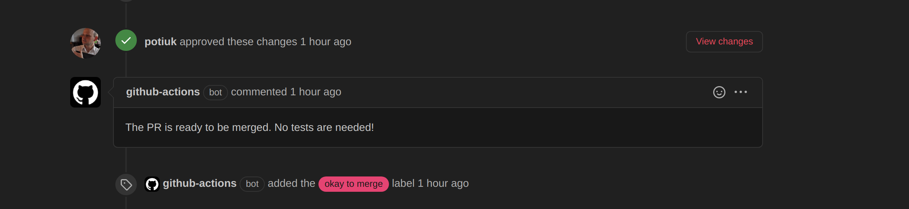
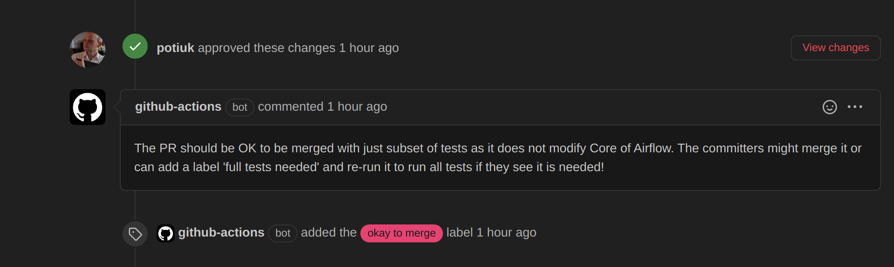
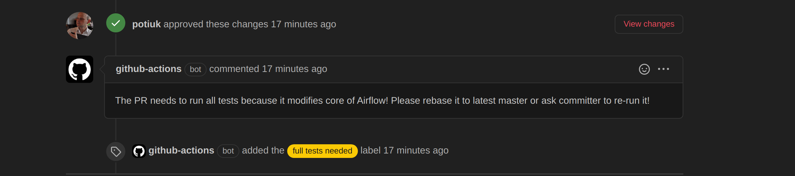

 .. Licensed to the Apache Software Foundation (ASF) under one
    or more contributor license agreements.  See the NOTICE file
    distributed with this work for additional information
    regarding copyright ownership.  The ASF licenses this file
    to you under the Apache License, Version 2.0 (the
    "License"); you may not use this file except in compliance
    with the License.  You may obtain a copy of the License at

 ..   http://www.apache.org/licenses/LICENSE-2.0

 .. Unless required by applicable law or agreed to in writing,
    software distributed under the License is distributed on an
    "AS IS" BASIS, WITHOUT WARRANTIES OR CONDITIONS OF ANY
    KIND, either express or implied.  See the License for the
    specific language governing permissions and limitations
    under the License.

.. contents:: :local:

Why non-standard pull request workflow?
---------------------------------------

This document describes the Pull Request Workflow we've implemented in Airflow. The workflow is slightly
more complex than regular workflow you might encounter in most of the projects because after experiencing
some huge delays in processing queues in October 2020 with GitHub Actions, we've decided to optimize the
workflow to minimize the use of GitHub Actions build time by utilising selective approach on which tests
and checks in the CI system are run depending on analysis of which files changed in the incoming PR and
allowing the Committers to control the scope of the tests during the approval/review process.

Just to give a bit of context, we started off with the approach that we always run all tests for all the
incoming PRs, however due to our matrix of tests growing, this approach did not scale with the increasing
number of PRs and when we had to compete with other Apache Software Foundation projects for the 180
slots that are available for the whole organization. More Apache Software Foundation projects started
to use GitHub Actions and we've started to experience long queues when our jobs waited for free slots.

We approached the problem by:

1) Improving mechanism of cancelling duplicate workflow runs more efficiently in case of queue conditions
   (duplicate workflow runs are generated when someone pushes a fixup quickly - leading to running both
   out-dated and current run to completion, taking precious slots. This has been implemented by improving
   `cancel-workflow-run <https://github.com/potiuk/cancel-workflow-runs/>`_ action we are using. In version
   4.1 it got a new feature of cancelling all duplicates even if there is a long queue of builds.

2) Heavily decreasing strain on the GitHub Actions jobs by introducing selective checks - mechanism
   to control which parts of the tests are run during the tests. This is implemented by the
   ``breeze selective-check`` command. It selectively chooses which tests should be run in the PR based on
   type of the PR and its content. More about it can be found in
   `Selective checks <dev/breeze/SELECTIVE_CHECKS.md>`_

3) Even more optimisation came from limiting the scope of tests to only "default" matrix parameters. So far
   in Airflow we always run all tests for all matrix combinations. The primary matrix components are:

   * Python versions (currently 3.7, 3.8, 3.9, 3.10)
   * Backend types (currently MySQL/Postgres)
   * Backed version (currently MySQL 5.7, MySQL 8, Postgres 13

   We've decided that instead of running all the combinations of parameters for all matrix component we will
   only run default values (Python 3.7, Mysql 5.7, Postgres 13) for all PRs which are not approved yet by
   the committers. This has a nice effect, that full set of tests (though with limited combinations of
   the matrix) are still run in the CI for every Pull Request that needs tests at all - allowing the
   contributors to make sure that their PR is "good enough" to be reviewed.

   Even after approval, the automated workflows we've implemented, check if the PR seems to need
   "full test matrix" and provide helpful information to both contributors and committers in the form of
   explanatory comments and labels set automatically showing the status of the PR. Committers have still
   control whether they want to merge such requests automatically or ask for rebase or re-run the tests
   and run "full tests" by applying the "full tests needed" label and re-running such request.
   The "full tests needed" label is also applied automatically after approval when the change touches
   the "core" of Airflow - also a separate check is added to the PR so that the "merge" button status
   will indicate to the committer that full tests are still needed. The committer might still decide,
   whether to merge such PR without the "full matrix". The "escape hatch" we have - i.e. running the full
   matrix of tests in the "merge push" will enable committers to catch and fix such problems quickly.
   More about it can be found in `Approval workflow and Matrix tests <#approval-workflow-and-matrix-tests>`_
   chapter.

4) We've also applied (and received) funds to run self-hosted runners. They are used for ``main`` runs
   and whenever the PRs are done by one of the maintainers. Maintainers can force using Public GitHub runners
   by applying "use public runners" label to the PR before submitting it.

Approval Workflow and Matrix tests
----------------------------------

As explained above the approval and matrix tests workflow works according to the algorithm below:

1) In case of "no-code" changes - so changes that do not change any of the code or environment of
   the application, no test are run (this is done via selective checks). Also no CI/PROD images are
   build saving extra minutes. Such build takes less than 2 minutes currently and only few jobs are run
   which is a very small fraction of the "full build" time.

2) When new PR is created, only a "default set" of matrix test are running. Only default
   values for each of the parameters are used effectively limiting it to running matrix builds for only
   one python version and one version of each of the backends. In this case only one CI and one PROD
   image is built, saving precious job slots. This build takes around 50% less time than the "full matrix"
   build.

3) When such PR gets approved, the system further analyses the files changed in this PR and further
   decision is made that should be communicated to both Committer and Reviewer.

3a) In case of "no-code" builds, a message is communicated that the PR is ready to be merged and
    no tests are needed.

3b) In case of "non-core" builds a message is communicated that such PR is likely OK to be merged as is with
    limited set of tests, but that the committer might decide to re-run the PR after applying
    "full tests needed" label, which will trigger full matrix build for tests for this PR. The committer
    might make further decision on what to do with this PR.

3c) In case of "core" builds (i. e. when the PR touches some "core" part of Airflow) a message is
    communicated that this PR needs "full test matrix", the "full tests needed" label is applied
    automatically and either the contributor might rebase the request to trigger full test build or the
    committer might re-run the build manually to trigger such full test rebuild. Also a check "in-progress"
    is added, so that the committer realises that the PR is not yet "green to merge". Pull requests with
    "full tests needed" label always trigger the full matrix build when rebased or re-run so if the
    PR gets rebased, it will continue triggering full matrix build.

4) If this or another committer "request changes" in a previously approved PR with "full tests needed"
   label, the bot automatically removes the label, moving it back to "run only default set of parameters"
   mode. For PRs touching core of airflow once the PR gets approved back, the label will be restored.
   If it was manually set by the committer, it has to be restored manually.

.. note:: Note that setting the labels and adding comments might be delayed, due to limitation of GitHub Actions,
      in case of queues, processing of Pull Request reviews might take some time, so it is advised not to merge
      PR immediately after approval. Luckily, the comments describing the status of the PR trigger notifications
      for the PRs and they provide good "notification" for the committer to act on a PR that was recently
      approved.

The PR approval workflow is possible thanks to two custom GitHub Actions we've developed:

* `Get workflow origin <https://github.com/potiuk/get-workflow-origin/>`_
* `Label when approved <https://github.com/TobKed/label-when-approved-action>`_

Next steps
----------

We are planning to also propose the approach to other projects from Apache Software Foundation to
make it a common approach, so that our effort is not limited only to one project.

Discussion about it in `this discussion <https://lists.apache.org/thread.html/r1708881f52adbdae722afb8fea16b23325b739b254b60890e72375e1%40%3Cbuilds.apache.org%3E>`_
