 .. Licensed to the Apache Software Foundation (ASF) under one
    or more contributor license agreements.  See the NOTICE file
    distributed with this work for additional information
    regarding copyright ownership.  The ASF licenses this file
    to you under the Apache License, Version 2.0 (the
    "License"); you may not use this file except in compliance
    with the License.  You may obtain a copy of the License at

 ..   http://www.apache.org/licenses/LICENSE-2.0

 .. Unless required by applicable law or agreed to in writing,
    software distributed under the License is distributed on an
    "AS IS" BASIS, WITHOUT WARRANTIES OR CONDITIONS OF ANY
    KIND, either express or implied.  See the License for the
    specific language governing permissions and limitations
    under the License.

.. contents:: :local:

Airflow Test Infrastructure
===========================

* **Unit tests** are Python tests that do not require any additional integrations.
  Unit tests are available both in the `Breeze environment <BREEZE.rst>`__
  and local virtualenv.

* **Integration tests** are available in the Breeze development environment
  that is also used for Airflow CI tests. Integration tests are special tests that require
  additional services running, such as Postgres, MySQL, Kerberos, etc.

* **System tests** are automatic tests that use external systems like
  Google Cloud. These tests are intended for an end-to-end DAG execution.
  The tests can be executed on both the current version of Apache Airflow and any older
  versions from 1.10.* series.

This document is about running Python tests. Before the tests are run, use
`static code checks <STATIC_CODE_CHECKS.rst>`__ that enable catching typical errors in the code.

Airflow Unit Tests
==================

All tests for Apache Airflow are run using `pytest <http://doc.pytest.org/en/latest/>`_ .

Writing Unit Tests
------------------

Follow the guidelines when writing unit tests:

* For standard unit tests that do not require integrations with external systems, make sure to simulate all communications.
* All Airflow tests are run with ``pytest``. Make sure to set your IDE/runners (see below) to use ``pytest`` by default.
* For new tests, use standard "asserts" of Python and ``pytest`` decorators/context managers for testing
  rather than ``unittest`` ones. See `pytest docs <http://doc.pytest.org/en/latest/assert.html>`_ for details.
* Use a parameterized framework for tests that have variations in parameters.
* Use with ``pytest.warn`` to capture warnings rather than ``recwarn`` fixture. We are aiming for 0-warning in our
  tests, so we run Pytest with ``--disable-warnings`` but instead we have ``pytest-capture-warnings`` plugin that
  overrides ``recwarn`` fixture behaviour.


Airflow configuration for unit tests
------------------------------------

Some of the unit tests require special configuration set as the ``default``. This is done automatically by
adding ``AIRFLOW__CORE__UNIT_TEST_MODE=True`` to the environment variables in Pytest auto-used
fixture. This in turn makes Airflow load test configuration from the file
``airflow/config_templates/unit_tests.cfg``. Test configuration from there replaces the original
defaults from ``airflow/config_templates/config.yml``. If you want to add some test-only configuration,
as default for all tests you should add the value to this file.

You can also - of course - override the values in individual test by patching environment variables following
the usual ``AIRFLOW__SECTION__KEY`` pattern or ``conf_vars`` context manager.

Airflow test types
------------------

Airflow tests in the CI environment are split into several test types. You can narrow down which
test types you want to use in various ``breeze testing`` sub-commands in three ways:

* via specifying the ``--test-type`` when you run single test type in ``breeze testing tests`` command
* via specifying space separating list of test types via ``--paralleltest-types`` or
  ``--exclude-parallel-test-types`` options when you run tests in parallel (in several testing commands)

Those test types are defined:

* ``Always`` - those are tests that should be always executed (always sub-folder)
* ``API`` - Tests for the Airflow API (api, api_connexion, api_experimental and api_internal sub-folders)
* ``CLI`` - Tests for the Airflow CLI (cli folder)
* ``Core`` - for the core Airflow functionality (core, executors, jobs, models, ti_deps, utils sub-folders)
* ``Operators`` - tests for the operators (operators folder with exception of Virtualenv Operator tests and
  External Python Operator tests that have their own test type). They are skipped by the
``virtualenv_operator`` and ``external_python_operator`` test markers that the tests are marked with.
* ``WWW`` - Tests for the Airflow webserver (www folder)
* ``Providers`` - Tests for all Providers of Airflow (providers folder)
* ``PlainAsserts`` - tests that require disabling ``assert-rewrite`` feature of Pytest (usually because
  a buggy/complex implementation of an imported library) (``plain_asserts`` marker)
* ``Other`` - all other tests remaining after the above tests are selected

There are also Virtualenv/ExternalPython operator test types that are excluded from ``Operators`` test type
and run as separate test types. Those are :

* ``PythonVenv`` - tests for PythonVirtualenvOperator - selected directly as TestPythonVirtualenvOperator
* ``BranchPythonVenv`` - tests for BranchPythonVirtualenvOperator - selected directly as TestBranchPythonVirtualenvOperator
* ``ExternalPython`` - tests for ExternalPythonOperator - selected directly as TestExternalPythonOperator
* ``BranchExternalPython`` - tests for BranchExternalPythonOperator - selected directly as TestBranchExternalPythonOperator

We have also tests that run "all" tests (so they do not look at the folder, but at the ``pytest`` markers
the tests are marked with to run with some filters applied.

* ``All-Postgres`` - tests that require Postgres database. They are only run when backend is Postgres (``backend("postgres")`` marker)
* ``All-MySQL`` - tests that require MySQL database. They are only run when backend is MySQL (``backend("mysql")`` marker)
* ``All-Quarantined`` - tests that are flaky and need to be fixed (``quarantined`` marker)
* ``All`` - all tests are run (this is the default)


We also have ``Integration`` tests that are running Integration tests with external software that is run
via ``--integration`` flag in ``breeze`` environment - via ``breeze testing integration-tests``.

* ``Integration`` - tests that require external integration images running in docker-compose

This is done for three reasons:

1. in order to selectively run only subset of the test types for some PRs
2. in order to allow efficient parallel test execution of the tests on Self-Hosted runners

For case 2. We can utilise memory and CPUs available on both CI and local development machines to run
test in parallel, but we cannot use pytest xdist plugin for that - we need to split the tests into test
types and run each test type with their own instance of database and separate container where the tests
in each type are run with exclusive access to their database and each test within test type runs sequentially.
By the nature of those tests - they rely on shared databases - and they update/reset/cleanup data in the
databases while they are executing.


DB and non-DB tests
-------------------

There are two kinds of unit tests in Airflow - DB and non-DB tests.

Some of the tests of Airflow (around 7000 of them on October 2023)
require a database to connect to in order to run. Those tests store and read data from Airflow DB using
Airflow's core code and it's crucial to run the tests against all real databases that Airflow supports in order
to check if the SQLAlchemy queries are correct and if the database schema is correct.

Those tests should be marked with ``@pytest.mark.db`` decorator on one of the levels:

* test method can be marked with ``@pytest.mark.db`` decorator
* test class can be marked with ``@pytest.mark.db`` decorator
* test module can be marked with ``pytestmark = pytest.mark.db`` at the top level of the module

Airflow's CI runs different test kinds separately.

For the DB tests, they are run against the multiple databases Airflow support, multiple versions of those
and multiple Python versions it supports. In order to save time for testing not all combinations are
tested but enough various combinations are tested to detect potential problems.

As of October 2023, Airflow has ~9000 Non-DB tests and around 7000 DB tests.

Airflow non-DB tests
--------------------

For the Non-DB tests, they are run once for each tested Python version with ``none`` database backend (which
causes any database access to fail. Those tests are run with ``pytest-xdist`` plugin in parallel which
means that we can efficiently utilised multi-processor machines (including ``self-hosted`` runners with
8 CPUS we have to run the tests with maximum parallelism).

It's usually straightforward to run those tests in local virtualenv because they do not require any
setup or running database. They also run much faster than DB tests. You can run them with ``pytest`` command
or with ``breeze`` that has all the dependencies needed to run all tests automatically installed. Of course
you can also select just specific test or folder or module for the Pytest to collect/run tests from there,
the example below shows how to run all tests, parallelising them with ``pytest-xdist``
(by specifying ``tests`` folder):

.. code-block:: bash

    pytest tests --skip-db-tests -n auto


The ``--skip-db-tests`` flag will only run tests that are not marked as DB tests.


You can also run ``breeze`` command to run all the tests (they will run in a separate container,
the selected python version and without access to any database). Adding ``--use-xdist`` flag will run all
tests in parallel using ``pytest-xdist`` plugin.

We have a dedicated, opinionated ``breeze testing non-db-tests`` command as well that runs non-DB tests
(it is also used in CI to run the non-DB tests, where you do not have to specify extra flags for
parallel running and you can run all the Non-DB tests
(or just a subset of them with ``--parallel-test-types`` or ``--exclude-parallel-test-types``) in parallel:

.. code-block:: bash

    breeze testing non-db-tests

You can pass ``--parallel-test-type`` list of test types to execute or ``--exclude--parallel-test-types``
to exclude them from the default set:.

.. code-block:: bash

    breeze testing non-db-tests --parallel-test-types "Providers API CLI"


.. code-block:: bash

    breeze testing non-db-tests --exclude-parallel-test-types "Providers API CLI"

You can also run the same commands via ``breeze testing tests`` - by adding the necessary flags manually:

.. code-block:: bash

    breeze testing tests --skip-db-tests --backend none --use-xdist

Also you can enter interactive shell with ``breeze`` and run tests from there if you want to iterate
with the tests. Source files in ``breeze`` are mounted as volumes so you can modify them locally and
rerun in Breeze as you will (``-n auto`` will parallelize tests using ``pytest-xdist`` plugin):

.. code-block:: bash

    breeze shell --backend none --python 3.8
    > pytest tests --skip-db-tests -n auto


Airflow DB tests
----------------

Airflow DB tests require database to run. It can be any of the supported Airflow Databases and they can
be run either using local virtualenv or Breeze


By default, the DB tests will use sqlite and the "airflow.db" database created and populated in the
``${AIRFLOW_HOME}`` folder. You do not need to do anything to get the database created and initialized,
but if you need to clean and restart the db, you can run tests with ``-with-db-init`` flag - then the
database will be re-initialized. You can also set ``AIRFLOW__DATABASE__SQL_ALCHEMY_CONN`` environment
variable to point to supported database (Postgres, MySQL, etc.) and the tests will use that database. You
might need to run ``airflow db reset`` to initialize the database in that case.

The "non-DB" tests are perfectly fine to run when you have database around but if you want to just run
DB tests (as happens in our CI for the ``Database`` runs) you can use ``--run-db-tests-only`` flag to filter
out non-DB tests (and obviously you can specify not only on the whole ``tests`` directory but on any
folders/files/tests selection, ``pytest`` supports).

.. code-block:: bash

    pytest tests/ --run-db-tests-only

You can also run DB tests with ``breeze`` dockerized environment. You can choose backend to use with
``--backend`` flag. The default is ``sqlite`` but you can also use others such as ``postgres`` or ``mysql``.
You can also select backend version and Python version to use. You can specify the ``test-type`` to run -
breeze will list the test types you can run with ``--help`` and provide auto-complete for them. Example
below runs the ``Core`` tests with ``postgres`` backend and ``3.8`` Python version:

We have a dedicated, opinionated ``breeze testing db-tests`` command as well that runs DB tests
(it is also used in CI to run the DB tests, where you do not have to specify extra flags for
parallel running and you can run all the DB tests
(or just a subset of them with ``--parallel-test-types`` or ``--exclude-parallel-test-types``) in parallel:

.. code-block:: bash

    breeze testing non-db-tests --backent postgres

You can pass ``--parallel-test-type`` list of test types to execute or ``--exclude--parallel-test-types``
to exclude them from the default set:.

.. code-block:: bash

    breeze testing db-tests --parallel-test-types "Providers API CLI"


.. code-block:: bash

    breeze testing db-tests --exclude-parallel-test-types "Providers API CLI"

You can also run the same commands via ``breeze testing tests`` - by adding the necessary flags manually:

.. code-block:: bash

    breeze testing tests --run-db-tests-only --backend postgres --run-tests-in-parallel


Also - if you want to iterate with the tests you can enter interactive shell and run the tests iteratively -
either by package/module/test or by test type - whatever ``pytest`` supports.

.. code-block:: bash

    breeze shell --backend postgres --python 3.8
    > pytest tests --run-db-tests-only

As explained before, you cannot run DB tests in parallel using ``pytest-xdist`` plugin, but ``breeze`` has
support to split all the tests into test-types to run in separate containers and with separate databases
and you can run the tests using ``--run-tests-in-parallel`` flag (which is automatically enabled when
you use ``breeze testing db-tests`` command):

.. code-block:: bash

    breeze testing tests --run-db-tests-only --backend postgres --python 3.8 --run-tests-in-parallel


Best practices for DB tests
===========================

Usually when you add new tests you add tests "similar" to the ones that are already there. In most cases,
therefore you do not have to worry about the test type - it will be automatically selected for you by the
fact that the Test Class that you add the tests or the whole module will be marked with ``db_test`` marker.

You should strive to write "pure" non-db unit tests (i.e. DB tests) but sometimes it's just better to plug-in
the existing framework of DagRuns, Dags, Connections and Variables to use the Database directly rather
than having to mock the DB access for example. It's up to you to decide.

However, if you choose to write DB tests you have to make sure you add the ``db_test`` marker - either to
the test method, class (with decorator) or whole module (with pytestmark at the top level of the module).

In most cases when you add tests to existing modules or classes, you follow similar tests so you do not
have to do anything, but in some cases you need to decide if your test should be marked as DB test or
whether it should be changed to not use the database at all.

If your test accesses the database but is not marked properly the Non-DB test in CI will fail with this message:

.. code ::

    "Your test accessed the DB but `_AIRFLOW_SKIP_DB_TESTS` is set.
    Either make sure your test does not use database or mark your test with `@pytest.mark.db_test`.

Marking test as DB test
-----------------------

You can apply the marker on method/function/class level with ``@pytest.mark.db_test`` decorator or
at the module level with ``pytestmark = pytest.mark.db_test`` at the top level of the module.

It's up to the author to decide whether to mark the test, class, or module as "DB-test" - generally the
less DB tests - the better and if we can clearly separate the parts that are DB from non-DB, we should,
but also it's ok if few tests are marked as DB tests when they are not but they are part of the class
or module that is "mostly-DB".

Sometimes, when your class can be clearly split to DB and non-DB parts, it's better to split the class
into two separate classes and mark only the DB class as DB test.

Method level:

.. code-block:: python

   import pytest


   @pytest.mark.db_test
   def test_add_tagging(self, sentry, task_instance):
       ...

Class level:


.. code-block:: python

   import pytest


   @pytest.mark.db_test
   class TestDatabricksHookAsyncAadTokenSpOutside:
       ...

Module level (at the top of the module):

.. code-block:: python

   import pytest

   from airflow.models.baseoperator import BaseOperator
   from airflow.models.dag import DAG
   from airflow.ti_deps.dep_context import DepContext
   from airflow.ti_deps.deps.task_concurrency_dep import TaskConcurrencyDep

   pytestmark = pytest.mark.db_test


How to verify if DB test is correctly classified
------------------------------------------------

When you add if you want to see if your DB test is correctly classified, you can run the test or group
of tests with ``--skip-db-tests`` flag.

You can run the all (or subset of) test types if you want to make sure all ot the problems are fixed

  .. code-block:: bash

     breeze testing tests --skip-db-tests tests/your_test.py

For the whole test suite you can run:

  .. code-block:: bash

     breeze testing non-db-tests

For selected test types (example - the tests will run for Providers/API/CLI code only:

  .. code-block:: bash

     breeze testing non-db-tests --parallel-test-types "Providers API CLI"


How to make your test not depend on DB
--------------------------------------

This is tricky and there is no single solution. Sometimes we can mock-out the methods that require
DB access or objects that normally require database. Sometimes we can decide to test just sinle method
of class rather than more complex set of steps. Generally speaking it's good to have as many "pure"
unit tests that require no DB as possible comparing to DB tests. They are usually faster an more
reliable as well.


Special cases
-------------

There are some tricky test cases that require special handling. Here are some of them:


Parameterized tests stability
~~~~~~~~~~~~~~~~~~~~~~~~~~~~~

The parameterized tests require stable order of parameters if they are run via xdist - because the parameterized
tests are distributed among multiple processes and handled separately. In some cases the parameterized tests
have undefined / random order (or parameters are not hashable - for example set of enums). In such cases
the xdist execution of the tests will fail and you will get an error mentioning "Known Limitations of xdist".
You can see details about the limitation `here <https://pytest-xdist.readthedocs.io/en/latest/known-limitations.html>`_

The error in this case will look similar to:

  .. code-block::

     Different tests were collected between gw0 and gw7. The difference is:


The fix for that is to sort the parameters in ``parametrize``. For example instead of this:

  .. code-block:: python

     @pytest.mark.parametrize("status", ALL_STATES)
     def test_method():
         ...


do that:


  .. code-block:: python

     @pytest.mark.parametrize("status", sorted(ALL_STATES))
     def test_method():
         ...

Similarly if your parameters are defined as result of utcnow() or other dynamic method - you should
avoid that, or assign unique IDs for those parametrized tests. Instead of this:

  .. code-block:: python

     @pytest.mark.parametrize(
         "url, expected_dag_run_ids",
         [
             (
                 f"api/v1/dags/TEST_DAG_ID/dagRuns?end_date_gte="
                 f"{urllib.parse.quote((timezone.utcnow() + timedelta(days=1)).isoformat())}",
                 [],
             ),
             (
                 f"api/v1/dags/TEST_DAG_ID/dagRuns?end_date_lte="
                 f"{urllib.parse.quote((timezone.utcnow() + timedelta(days=1)).isoformat())}",
                 ["TEST_DAG_RUN_ID_1", "TEST_DAG_RUN_ID_2"],
             ),
         ],
     )
     def test_end_date_gte_lte(url, expected_dag_run_ids):
         ...

Do this:

  .. code-block:: python

     @pytest.mark.parametrize(
         "url, expected_dag_run_ids",
         [
             pytest.param(
                 f"api/v1/dags/TEST_DAG_ID/dagRuns?end_date_gte="
                 f"{urllib.parse.quote((timezone.utcnow() + timedelta(days=1)).isoformat())}",
                 [],
                 id="end_date_gte",
             ),
             pytest.param(
                 f"api/v1/dags/TEST_DAG_ID/dagRuns?end_date_lte="
                 f"{urllib.parse.quote((timezone.utcnow() + timedelta(days=1)).isoformat())}",
                 ["TEST_DAG_RUN_ID_1", "TEST_DAG_RUN_ID_2"],
                 id="end_date_lte",
             ),
         ],
     )
     def test_end_date_gte_lte(url, expected_dag_run_ids):
         ...


Problems with Non-DB test collection
~~~~~~~~~~~~~~~~~~~~~~~~~~~~~~~~~~~~

Sometimes, even if whole module is marked as ``@pytest.mark.db_test`` even parsing the file and collecting
tests will fail when ``--skip-db-tests`` is used because some of the imports od objects created in the
module will read the database.

Usually what helps is to move such initialization code to inside the tests or pytest fixtures (and pass
objects needed by tests as fixtures rather than importing them from the module). Similarly you might
use DB - bound objects (like Connection) in your ``parametrize`` specification - this will also fail pytest
collection. Move creation of such objects to inside the tests:

Moving object creation from top-level to inside tests. This code will break collection of tests even if
the test is marked as DB test:


  .. code-block:: python

     pytestmark = pytest.mark.db_test

     TI = TaskInstance(
         task=BashOperator(task_id="test", bash_command="true", dag=DAG(dag_id="id"), start_date=datetime.now()),
         run_id="fake_run",
         state=State.RUNNING,
     )


     class TestCallbackRequest:
         @pytest.mark.parametrize(
             "input,request_class",
             [
                 (CallbackRequest(full_filepath="filepath", msg="task_failure"), CallbackRequest),
                 (
                     TaskCallbackRequest(
                         full_filepath="filepath",
                         simple_task_instance=SimpleTaskInstance.from_ti(ti=TI),
                         processor_subdir="/test_dir",
                         is_failure_callback=True,
                     ),
                     TaskCallbackRequest,
                 ),
                 (
                     DagCallbackRequest(
                         full_filepath="filepath",
                         dag_id="fake_dag",
                         run_id="fake_run",
                         processor_subdir="/test_dir",
                         is_failure_callback=False,
                     ),
                     DagCallbackRequest,
                 ),
                 (
                     SlaCallbackRequest(
                         full_filepath="filepath",
                         dag_id="fake_dag",
                         processor_subdir="/test_dir",
                     ),
                     SlaCallbackRequest,
                 ),
             ],
         )
         def test_from_json(self, input, request_class):
             ...


Instead - this will not break collection. The TaskInstance is not initialized when the module is parsed,
it will only be initialized when the test gets executed because we moved initialization of it from
top level / parametrize to inside the test:

  .. code-block:: python

    pytestmark = pytest.mark.db_test


    class TestCallbackRequest:
        @pytest.mark.parametrize(
            "input,request_class",
            [
                (CallbackRequest(full_filepath="filepath", msg="task_failure"), CallbackRequest),
                (
                    None,  # to be generated when test is run
                    TaskCallbackRequest,
                ),
                (
                    DagCallbackRequest(
                        full_filepath="filepath",
                        dag_id="fake_dag",
                        run_id="fake_run",
                        processor_subdir="/test_dir",
                        is_failure_callback=False,
                    ),
                    DagCallbackRequest,
                ),
                (
                    SlaCallbackRequest(
                        full_filepath="filepath",
                        dag_id="fake_dag",
                        processor_subdir="/test_dir",
                    ),
                    SlaCallbackRequest,
                ),
            ],
        )
        def test_from_json(self, input, request_class):
            if input is None:
                ti = TaskInstance(
                    task=BashOperator(
                        task_id="test", bash_command="true", dag=DAG(dag_id="id"), start_date=datetime.now()
                    ),
                    run_id="fake_run",
                    state=State.RUNNING,
                )

                input = TaskCallbackRequest(
                    full_filepath="filepath",
                    simple_task_instance=SimpleTaskInstance.from_ti(ti=ti),
                    processor_subdir="/test_dir",
                    is_failure_callback=True,
                )


Sometimes it is difficult to rewrite the tests, so you might add conditional handling and mock out some
database-bound methods or objects to avoid hitting the database during test collection. The code below
will hit the Database while parsing the tests, because this is what Variable.setdefault does when
parametrize specification is being parsed - even if test is marked as DB test.


  .. code-block:: python

      from airflow.models.variable import Variable

      pytestmark = pytest.mark.db_test

      initial_db_init()


      @pytest.mark.parametrize(
          "env, expected",
          [
              pytest.param(
                  {"plain_key": "plain_value"},
                  "{'plain_key': 'plain_value'}",
                  id="env-plain-key-val",
              ),
              pytest.param(
                  {"plain_key": Variable.setdefault("plain_var", "banana")},
                  "{'plain_key': 'banana'}",
                  id="env-plain-key-plain-var",
              ),
              pytest.param(
                  {"plain_key": Variable.setdefault("secret_var", "monkey")},
                  "{'plain_key': '***'}",
                  id="env-plain-key-sensitive-var",
              ),
              pytest.param(
                  {"plain_key": "{{ var.value.plain_var }}"},
                  "{'plain_key': '{{ var.value.plain_var }}'}",
                  id="env-plain-key-plain-tpld-var",
              ),
          ],
      )
      def test_rendered_task_detail_env_secret(patch_app, admin_client, request, env, expected):
          ...


You can make the code conditional and mock out the Variable to avoid hitting the database.


  .. code-block:: python

      from airflow.models.variable import Variable

      pytestmark = pytest.mark.db_test


      if os.environ.get("_AIRFLOW_SKIP_DB_TESTS") == "true":
          # Handle collection of the test by non-db case
          Variable = mock.MagicMock()  # type: ignore[misc] # noqa: F811
      else:
          initial_db_init()


      @pytest.mark.parametrize(
          "env, expected",
          [
              pytest.param(
                  {"plain_key": "plain_value"},
                  "{'plain_key': 'plain_value'}",
                  id="env-plain-key-val",
              ),
              pytest.param(
                  {"plain_key": Variable.setdefault("plain_var", "banana")},
                  "{'plain_key': 'banana'}",
                  id="env-plain-key-plain-var",
              ),
              pytest.param(
                  {"plain_key": Variable.setdefault("secret_var", "monkey")},
                  "{'plain_key': '***'}",
                  id="env-plain-key-sensitive-var",
              ),
              pytest.param(
                  {"plain_key": "{{ var.value.plain_var }}"},
                  "{'plain_key': '{{ var.value.plain_var }}'}",
                  id="env-plain-key-plain-tpld-var",
              ),
          ],
      )
      def test_rendered_task_detail_env_secret(patch_app, admin_client, request, env, expected):
          ...


Running Unit tests
==================

Running Unit Tests from PyCharm IDE
-----------------------------------

To run unit tests from the PyCharm IDE, create the `local virtualenv <LOCAL_VIRTUALENV.rst>`_,
select it as the default project's environment, then configure your test runner:

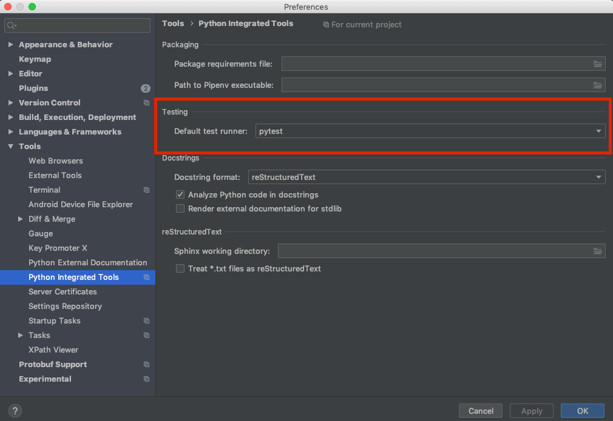

and run unit tests as follows:

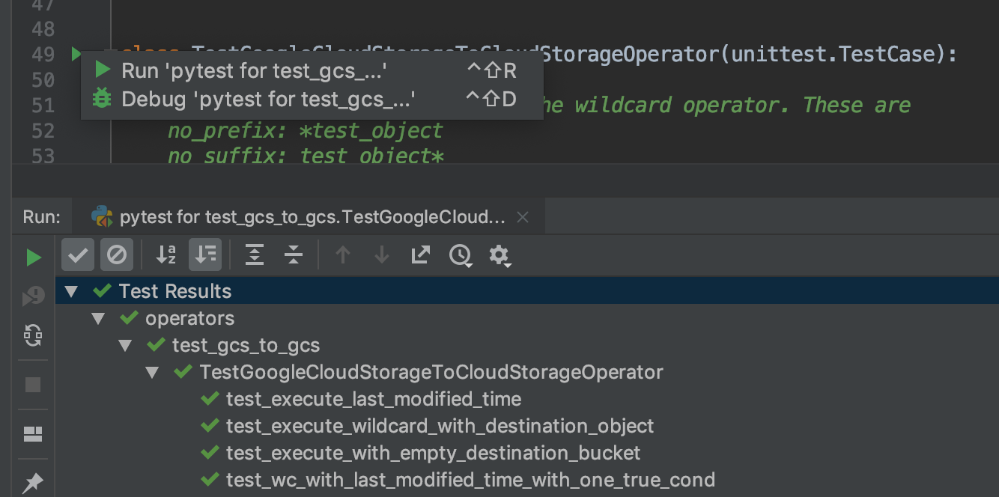

**NOTE:** You can run the unit tests in the standalone local virtualenv
(with no Breeze installed) if they do not have dependencies such as
Postgres/MySQL/Hadoop/etc.

Running Unit Tests from PyCharm IDE using Breeze
------------------------------------------------

Ideally, all unit tests should be run using the standardized Breeze environment.  While not
as convenient as the one-click "play button" in PyCharm, the IDE can be configured to do
this in two clicks.

1. Add Breeze as an "External Tool":

   a. From the settings menu, navigate to Tools > External Tools
   b. Click the little plus symbol to open the "Create Tool" popup and fill it out:

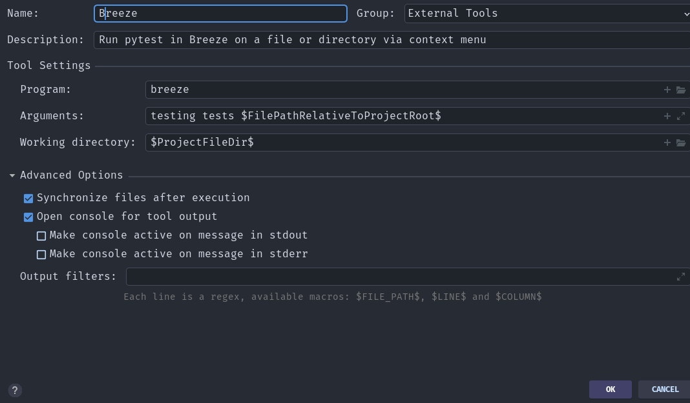

2. Add the tool to the context menu:

   a. From the settings menu, navigate to Appearance & Behavior > Menus & Toolbars > Project View Popup Menu
   b. Click on the list of entries where you would like it to be added.  Right above or below "Project View Popup Menu Run Group" may be a good choice, you can drag and drop this list to rearrange the placement later as desired.
   c. Click the little plus at the top of the popup window
   d. Find your "External Tool" in the new "Choose Actions to Add" popup and click OK.  If you followed the image above, it will be at External Tools > External Tools > Breeze

**Note:** That only adds the option to that one menu.  If you would like to add it to the context menu
when right-clicking on a tab at the top of the editor, for example, follow the steps above again
and place it in the "Editor Tab Popup Menu"

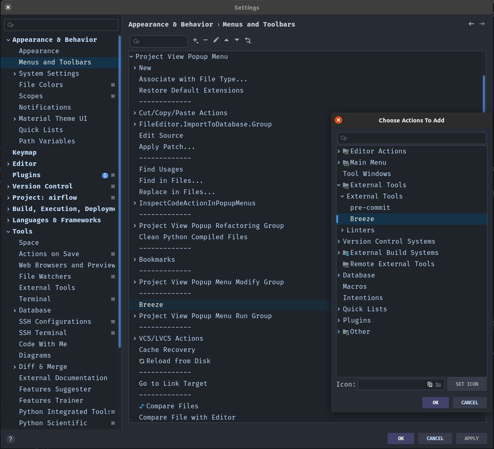

3. To run tests in Breeze, right click on the file or directory in the Project View and click Breeze.


Running Unit Tests from Visual Studio Code
------------------------------------------

To run unit tests from the Visual Studio Code:

1. Using the ``Extensions`` view install Python extension, reload if required

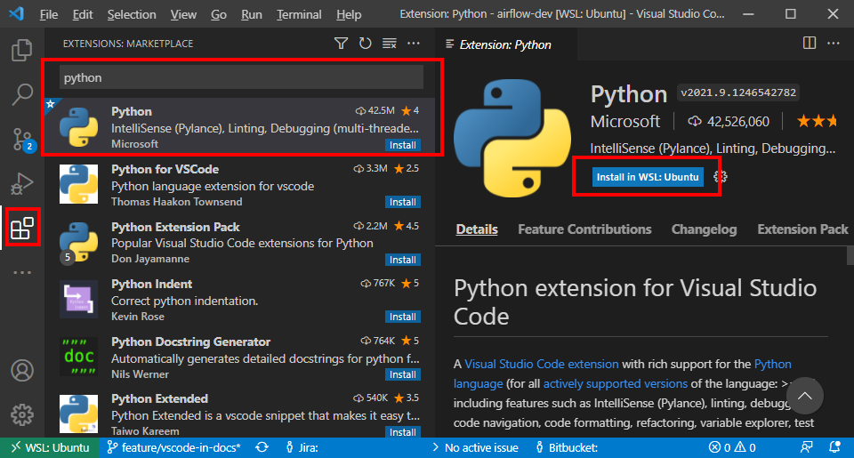

2. Using the ``Testing`` view click on ``Configure Python Tests`` and select ``pytest`` framework

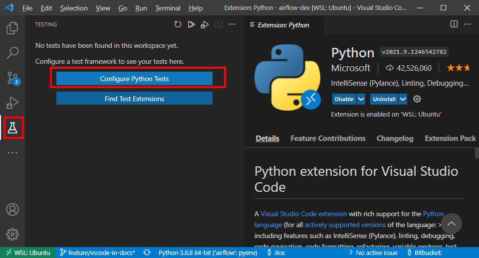

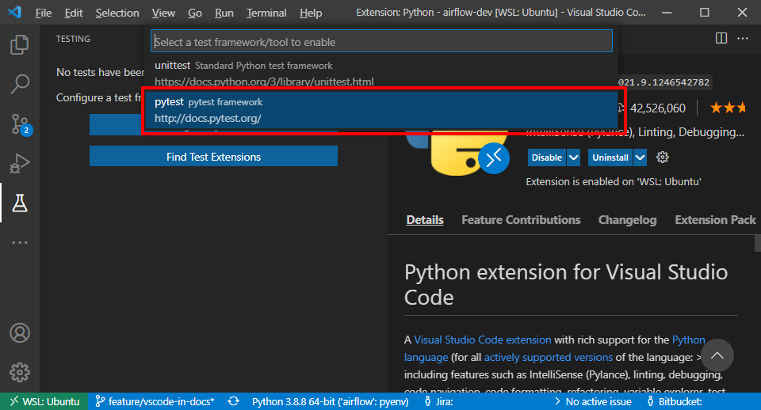

3. Open ``/.vscode/settings.json`` and add ``"python.testing.pytestArgs": ["tests"]`` to enable tests discovery

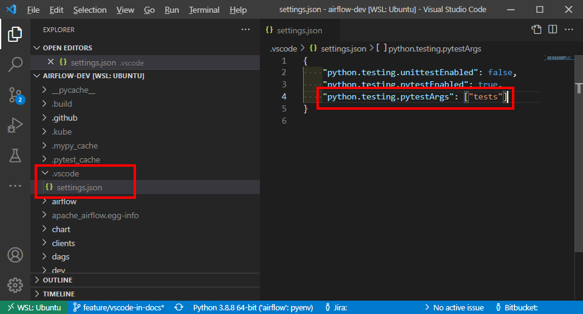

4. Now you are able to run and debug tests from both the ``Testing`` view and test files

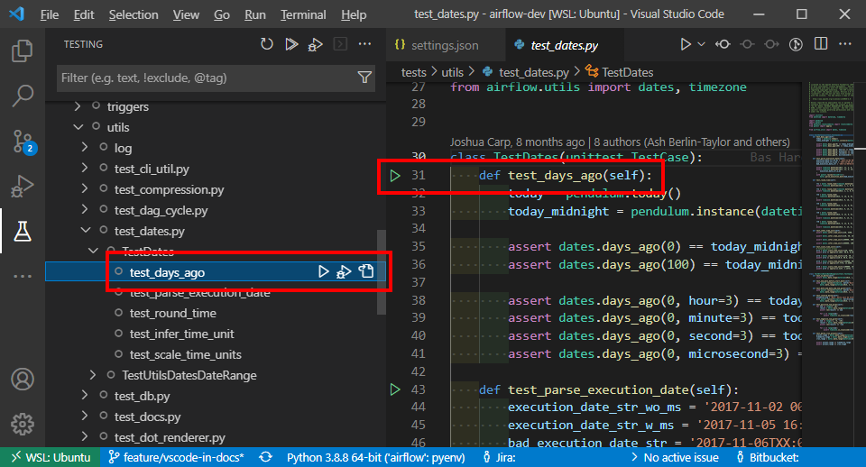

Running Unit Tests in local virtualenv
--------------------------------------

To run unit, integration, and system tests from the Breeze and your
virtualenv, you can use the `pytest <http://doc.pytest.org/en/latest/>`_ framework.

Custom ``pytest`` plugin runs ``airflow db init`` and ``airflow db reset`` the first
time you launch them. So, you can count on the database being initialized. Currently,
when you run tests not supported **in the local virtualenv, they may either fail
or provide an error message**.

There are many available options for selecting a specific test in ``pytest``. Details can be found
in the official documentation, but here are a few basic examples:

.. code-block:: bash

    pytest tests/core -k "TestCore and not check"

This runs the ``TestCore`` class but skips tests of this class that include 'check' in their names.
For better performance (due to a test collection), run:

.. code-block:: bash

    pytest tests/core/test_core.py -k "TestCore and not bash"

This flag is useful when used to run a single test like this:

.. code-block:: bash

    pytest tests/core/test_core.py -k "test_check_operators"

This can also be done by specifying a full path to the test:

.. code-block:: bash

    pytest tests/core/test_core.py::TestCore::test_check_operators

To run the whole test class, enter:

.. code-block:: bash

    pytest tests/core/test_core.py::TestCore

You can use all available ``pytest`` flags. For example, to increase a log level
for debugging purposes, enter:

.. code-block:: bash

    pytest --log-cli-level=DEBUG tests/core/test_core.py::TestCore


Running Tests using Breeze interactive shell
--------------------------------------------

You can run tests interactively using regular pytest commands inside the Breeze shell. This has the
advantage, that Breeze container has all the dependencies installed that are needed to run the tests
and it will ask you to rebuild the image if it is needed and some new dependencies should be installed.

By using interactive shell and iterating over the tests, you can iterate and re-run tests one-by-one
or group by group right after you modified them.

Entering the shell is as easy as:

.. code-block:: bash

     breeze

This should drop you into the container.

You can also use other switches (like ``--backend`` for example) to configure the environment for your
tests (and for example to switch to different database backend - see ``--help`` for more details).

Once you enter the container, you might run regular pytest commands. For example:

.. code-block:: bash

    pytest --log-cli-level=DEBUG tests/core/test_core.py::TestCore


Running Tests using Breeze from the Host
----------------------------------------

If you wish to only run tests and not to drop into the shell, apply the
``tests`` command. You can add extra targets and pytest flags after the ``--`` command. Note that
often you want to run the tests with a clean/reset db, so usually you want to add ``--db-reset`` flag
to breeze command. The Breeze image usually will have all the dependencies needed and it
will ask you to rebuild the image if it is needed and some new dependencies should be installed.

.. code-block:: bash

     breeze testing tests tests/providers/http/hooks/test_http.py tests/core/test_core.py --db-reset --log-cli-level=DEBUG

You can run the whole test suite without adding the test target:

.. code-block:: bash

    breeze testing tests --db-reset

You can also specify individual tests or a group of tests:

.. code-block:: bash

    breeze testing tests --db-reset tests/core/test_core.py::TestCore

You can also limit the tests to execute to specific group of tests

.. code-block:: bash

    breeze testing tests --test-type Core

In case of Providers tests, you can run tests for all providers

.. code-block:: bash

    breeze testing tests --test-type Providers

You can limit the set of providers you would like to run tests of

.. code-block:: bash

    breeze testing tests --test-type "Providers[airbyte,http]"

You can also run all providers but exclude the providers you would like to skip

.. code-block:: bash

    breeze testing tests --test-type "Providers[-amazon,google]"


Inspecting docker compose after test commands
---------------------------------------------

Sometimes you need to inspect docker compose after tests command complete,
for example when test environment could not be properly set due to
failed healthchecks. This can be achieved with ``--skip-docker-compose-down``
flag:

.. code-block:: bash

    breeze testing tests --skip--docker-compose-down


Running full Airflow unit test suite in parallel
------------------------------------------------

If you run ``breeze testing tests --run-in-parallel`` tests run in parallel
on your development machine - maxing out the number of parallel runs at the number of cores you
have available in your Docker engine.

In case you do not have enough memory available to your Docker (8 GB), the ``Integration``. ``Provider``
and ``Core`` test type are executed sequentially with cleaning the docker setup in-between. This
allows to print

This allows for massive speedup in full test execution. On 8 CPU machine with 16 cores and 64 GB memory
and fast SSD disk, the whole suite of tests completes in about 5 minutes (!). Same suite of tests takes
more than 30 minutes on the same machine when tests are run sequentially.

.. note::

  On MacOS you might have less CPUs and less memory available to run the tests than you have in the host,
  simply because your Docker engine runs in a Linux Virtual Machine under-the-hood. If you want to make
  use of the parallelism and memory usage for the CI tests you might want to increase the resources available
  to your docker engine. See the `Resources <https://docs.docker.com/docker-for-mac/#resources>`_ chapter
  in the ``Docker for Mac`` documentation on how to do it.

You can also limit the parallelism by specifying the maximum number of parallel jobs via
MAX_PARALLEL_TEST_JOBS variable. If you set it to "1", all the test types will be run sequentially.

.. code-block:: bash

    MAX_PARALLEL_TEST_JOBS="1" ./scripts/ci/testing/ci_run_airflow_testing.sh

.. note::

  In case you would like to cleanup after execution of such tests you might have to cleanup
  some of the docker containers running in case you use ctrl-c to stop execution. You can easily do it by
  running this command (it will kill all docker containers running so do not use it if you want to keep some
  docker containers running):

  .. code-block:: bash

      docker kill $(docker ps -q)

Running Backend-Specific Tests
------------------------------

Tests that are using a specific backend are marked with a custom pytest marker ``pytest.mark.backend``.
The marker has a single parameter - the name of a backend. It corresponds to the ``--backend`` switch of
the Breeze environment (one of ``mysql``, ``sqlite``, or ``postgres``). Backend-specific tests only run when
the Breeze environment is running with the right backend. If you specify more than one backend
in the marker, the test runs for all specified backends.

Example of the ``postgres`` only test:

.. code-block:: python

    @pytest.mark.backend("postgres")
    def test_copy_expert(self):
        ...


Example of the ``postgres,mysql`` test (they are skipped with the ``sqlite`` backend):

.. code-block:: python

    @pytest.mark.backend("postgres", "mysql")
    def test_celery_executor(self):
        ...


You can use the custom ``--backend`` switch in pytest to only run tests specific for that backend.
Here is an example of running only postgres-specific backend tests:

.. code-block:: bash

    pytest --backend postgres

Running Long-running tests
--------------------------

Some of the tests rung for a long time. Such tests are marked with ``@pytest.mark.long_running`` annotation.
Those tests are skipped by default. You can enable them with ``--include-long-running`` flag. You
can also decide to only run tests with ``-m long-running`` flags to run only those tests.

Running Quarantined tests
-------------------------

Some of our tests are quarantined. This means that this test will be run in isolation and that it will be
re-run several times. Also when quarantined tests fail, the whole test suite will not fail. The quarantined
tests are usually flaky tests that need some attention and fix.

Those tests are marked with ``@pytest.mark.quarantined`` annotation.
Those tests are skipped by default. You can enable them with ``--include-quarantined`` flag. You
can also decide to only run tests with ``-m quarantined`` flag to run only those tests.

Running Tests with provider packages
------------------------------------

Airflow 2.0 introduced the concept of splitting the monolithic Airflow package into separate
providers packages. The main "apache-airflow" package contains the bare Airflow implementation,
and additionally we have 70+ providers that we can install additionally to get integrations with
external services. Those providers live in the same monorepo as Airflow, but we build separate
packages for them and the main "apache-airflow" package does not contain the providers.

Most of the development in Breeze happens by iterating on sources and when you run
your tests during development, you usually do not want to build packages and install them separately.
Therefore by default, when you enter Breeze airflow and all providers are available directly from
sources rather than installed from packages. This is for example to test the "provider discovery"
mechanism available that reads provider information from the package meta-data.

When Airflow is run from sources, the metadata is read from provider.yaml
files, but when Airflow is installed from packages, it is read via the package entrypoint
``apache_airflow_provider``.

By default, all packages are prepared in wheel format. To install Airflow from packages you
need to run the following steps:

1. Prepare provider packages

.. code-block:: bash

     breeze release-management prepare-provider-packages [PACKAGE ...]

If you run this command without packages, you will prepare all packages. However, You can specify
providers that you would like to build if you just want to build few provider packages.
The packages are prepared in ``dist`` folder. Note that this command cleans up the ``dist`` folder
before running, so you should run it before generating ``apache-airflow`` package.

2. Prepare airflow packages

.. code-block:: bash

     breeze release-management prepare-airflow-package

This prepares airflow .whl package in the dist folder.

3. Enter breeze installing both airflow and providers from the dist packages

.. code-block:: bash

     breeze --use-airflow-version wheel --use-packages-from-dist --mount-sources skip

Airflow Docker Compose Tests
============================

Running Docker Compose Tests with Breeze
----------------------------------------

We also test in CI whether the Docker Compose that we expose in our documentation via
`Running Airflow in Docker <https://airflow.apache.org/docs/apache-airflow/stable/howto/docker-compose/index.html>`_
works as expected. Those tests are run in CI ("Test docker-compose quick start")
and you can run them locally as well.

The way the tests work:

1. They first build the Airflow production image
2. Then they take the Docker Compose file of ours and use the image to start it
3. Then they perform some simple DAG trigger tests which checks whether Airflow is up and can process
   an example DAG

This is done in a local environment, not in the Breeze CI image. It uses ``COMPOSE_PROJECT_NAME`` set to
``quick-start`` to avoid conflicts with other docker compose deployments you might have.

The complete test can be performed using Breeze. The prerequisite to that
is to have ``docker-compose`` (Docker Compose v1) or ``docker compose`` plugin (Docker Compose v2)
available on the path.

Running complete test with breeze:

.. code-block:: bash

    breeze prod-image build --python 3.8
    breeze testing docker-compose-tests

In case the test fails, it will dump the logs from the running containers to the console and it
will shutdown the Docker Compose deployment. In case you want to debug the Docker Compose deployment
created for the test, you can pass ``--skip-docker-compose-deletion`` flag to Breeze or
export ``SKIP_DOCKER_COMPOSE_DELETION`` set to "true" variable and the deployment
will not be deleted after the test.

You can also specify maximum timeout for the containers with ``--wait-for-containers-timeout`` flag.
You can also add ``-s`` option to the command pass it to underlying pytest command
to see the output of the test as it happens (it can be also set via
``WAIT_FOR_CONTAINERS_TIMEOUT`` environment variable)

The test can be also run manually with ``pytest docker_tests/test_docker_compose_quick_start.py``
command, provided that you have a local airflow venv with ``dev`` extra set and the
``DOCKER_IMAGE`` environment variable is set to the image you want to test. The variable defaults
to ``ghcr.io/apache/airflow/main/prod/python3.8:latest`` which is built by default
when you run ``breeze prod-image build --python 3.8``. also the switches ``--skip-docker-compose-deletion``
and ``--wait-for-containers-timeout`` can only be passed via environment variables.

If you want to debug the deployment using ``docker compose`` commands after ``SKIP_DOCKER_COMPOSE_DELETION``
was used, you should set ``COMPOSE_PROJECT_NAME`` to ``quick-start`` because this is what the test uses:

.. code-block:: bash

    export COMPOSE_PROJECT_NAME=quick-start

You can also add ``--project-name quick-start`` to the ``docker compose`` commands you run.
When the test will be re-run it will automatically stop previous deployment and start a new one.

Running Docker Compose deployment manually
------------------------------------------

You can also (independently of Pytest test) run docker-compose deployment manually with the image you built using
the prod image build command above.

.. code-block:: bash

    export AIRFLOW_IMAGE_NAME=ghcr.io/apache/airflow/main/prod/python3.8:latest

and follow the instructions in the
`Running Airflow in Docker <https://airflow.apache.org/docs/apache-airflow/stable/howto/docker-compose/index.html>`_
but make sure to use the docker-compose file from the sources in
``docs/apache-airflow/stable/howto/docker-compose/`` folder.

Then, the usual ``docker compose`` and ``docker`` commands can be used to debug such running instances.
The test performs a simple API call to trigger a DAG and wait for it, but you can follow our
documentation to connect to such running docker compose instances and test it manually.

Airflow Integration Tests
=========================

Some of the tests in Airflow are integration tests. These tests require ``airflow`` Docker
image and extra images with integrations (such as ``celery``, ``mongodb``, etc.).
The integration tests are all stored in the ``tests/integration`` folder.

Enabling Integrations
---------------------

Airflow integration tests cannot be run in the local virtualenv. They can only run in the Breeze
environment with enabled integrations and in the CI. See `CI <CI.rst>`_ for details about Airflow CI.

When you are in the Breeze environment, by default, all integrations are disabled. This enables only true unit tests
to be executed in Breeze. You can enable the integration by passing the ``--integration <INTEGRATION>``
switch when starting Breeze. You can specify multiple integrations by repeating the ``--integration`` switch
or using the ``--integration all-testable`` switch that enables all testable integrations and
``--integration all`` switch that enables all integrations.

NOTE: Every integration requires a separate container with the corresponding integration image.
These containers take precious resources on your PC, mainly the memory. The started integrations are not stopped
until you stop the Breeze environment with the ``stop`` command and started with the ``start`` command.

The following integrations are available:

.. list-table:: Airflow Test Integrations
   :widths: 15 80
   :header-rows: 1

   * - Integration
     - Description
   * - cassandra
     - Integration required for Cassandra hooks
   * - kerberos
     - Integration that provides Kerberos authentication
   * - mongo
     - Integration required for MongoDB hooks
   * - pinot
     - Integration required for Apache Pinot hooks
   * - celery
     - Integration required for Celery executor tests
   * - trino
     - Integration required for Trino hooks

To start the ``mongo`` integration only, enter:

.. code-block:: bash

    breeze --integration mongo

To start ``mongo`` and ``cassandra`` integrations, enter:

.. code-block:: bash

    breeze --integration mongo --integration cassandra

To start all testable integrations, enter:

.. code-block:: bash

    breeze --integration all-testable

To start all integrations, enter:

.. code-block:: bash

    breeze --integration all-testable

Note that Kerberos is a special kind of integration. Some tests run differently when
Kerberos integration is enabled (they retrieve and use a Kerberos authentication token) and differently when the
Kerberos integration is disabled (they neither retrieve nor use the token). Therefore, one of the test jobs
for the CI system should run all tests with the Kerberos integration enabled to test both scenarios.

Running Integration Tests
-------------------------

All tests using an integration are marked with a custom pytest marker ``pytest.mark.integration``.
The marker has a single parameter - the name of integration.

Example of the ``celery`` integration test:

.. code-block:: python

    @pytest.mark.integration("celery")
    def test_real_ping(self):
        hook = RedisHook(redis_conn_id="redis_default")
        redis = hook.get_conn()

        assert redis.ping(), "Connection to Redis with PING works."

The markers can be specified at the test level or the class level (then all tests in this class
require an integration). You can add multiple markers with different integrations for tests that
require more than one integration.

If such a marked test does not have a required integration enabled, it is skipped.
The skip message clearly says what is needed to use the test.

To run all tests with a certain integration, use the custom pytest flag ``--integration``.
You can pass several integration flags if you want to enable several integrations at once.

**NOTE:** If an integration is not enabled in Breeze or CI,
the affected test will be skipped.

To run only ``mongo`` integration tests:

.. code-block:: bash

    pytest --integration mongo tests/integration

To run integration tests for ``mongo`` and ``celery``:

.. code-block:: bash

    pytest --integration mongo --integration celery tests/integration


Here is an example of the collection limited to the ``providers/apache`` sub-directory:

.. code-block:: bash

    pytest --integration cassandra tests/integrations/providers/apache

Running Integration Tests from the Host
---------------------------------------

You can also run integration tests using Breeze from the host.

Runs all integration tests:

  .. code-block:: bash

       breeze testing integration-tests  --db-reset --integration all-testable

Runs all mongo DB tests:

  .. code-block:: bash

       breeze testing integration-tests --db-reset --integration mongo

Helm Unit Tests
===============

On the Airflow Project, we have decided to stick with pythonic testing for our Helm chart. This makes our chart
easier to test, easier to modify, and able to run with the same testing infrastructure. To add Helm unit tests
add them in ``helm_tests``.

.. code-block:: python

    class TestBaseChartTest:
        ...

To render the chart create a YAML string with the nested dictionary of options you wish to test. You can then
use our ``render_chart`` function to render the object of interest into a testable Python dictionary. Once the chart
has been rendered, you can use the ``render_k8s_object`` function to create a k8s model object. It simultaneously
ensures that the object created properly conforms to the expected resource spec and allows you to use object values
instead of nested dictionaries.

Example test here:

.. code-block:: python

    from tests.charts.common.helm_template_generator import render_chart, render_k8s_object

    git_sync_basic = """
    dags:
      gitSync:
      enabled: true
    """


    class TestGitSyncScheduler:
        def test_basic(self):
            helm_settings = yaml.safe_load(git_sync_basic)
            res = render_chart(
                "GIT-SYNC",
                helm_settings,
                show_only=["templates/scheduler/scheduler-deployment.yaml"],
            )
            dep: k8s.V1Deployment = render_k8s_object(res[0], k8s.V1Deployment)
            assert "dags" == dep.spec.template.spec.volumes[1].name


To execute all Helm tests using breeze command and utilize parallel pytest tests, you can run the
following command (but it takes quite a long time even in a multi-processor machine).

.. code-block:: bash

    breeze testing helm-tests

You can also execute tests from a selected package only. Tests in ``tests/chart`` are grouped by packages
so rather than running all tests, you can run only tests from a selected package. For example:

.. code-block:: bash

    breeze testing helm-tests --helm-test-package basic

Will run all tests from ``tests-charts/basic`` package.


You can also run Helm tests individually via the usual ``breeze`` command. Just enter breeze and run the
tests with pytest as you would do with regular unit tests (you can add ``-n auto`` command to run Helm
tests in parallel - unlike most of the regular unit tests of ours that require a database, the Helm tests are
perfectly safe to be run in parallel (and if you have multiple processors, you can gain significant
speedups when using parallel runs):

.. code-block:: bash

    breeze

This enters breeze container.

.. code-block:: bash

    pytest helm_tests -n auto

This runs all chart tests using all processors you have available.

.. code-block:: bash

    pytest helm_tests/test_airflow_common.py -n auto

This will run all tests from ``tests_airflow_common.py`` file using all processors you have available.

.. code-block:: bash

    pytest helm_tests/test_airflow_common.py

This will run all tests from ``tests_airflow_common.py`` file sequentially.


Kubernetes tests
================

Airflow has tests that are run against real Kubernetes cluster. We are using
`Kind <https://kind.sigs.k8s.io/>`_ to create and run the cluster. We integrated the tools to start/stop/
deploy and run the cluster tests in our repository and into Breeze development environment.

KinD has a really nice ``kind`` tool that you can use to interact with the cluster. Run ``kind --help`` to
learn more.

K8S test environment
------------------------

Before running ``breeze k8s`` cluster commands you need to setup the environment. This is done
by ``breeze k8s setup-env`` command. Breeze in this command makes sure to download tools that
are needed to run k8s tests: Helm, Kind, Kubectl in the right versions and sets up a
Python virtualenv that is needed to run the tests. All those tools and env are setup in
``.build/.k8s-env`` folder. You can activate this environment yourselves as usual by sourcing
``bin/activate`` script, but since we are supporting multiple clusters in the same installation
it is best if you use ``breeze k8s shell`` with the right parameters specifying which cluster
to use.

Multiple cluster support
------------------------

The main feature of ``breeze k8s`` command is that it allows you to manage multiple KinD clusters - one
per each combination of Python and Kubernetes version. This is used during CI where we can run same
tests against those different clusters - even in parallel.

The cluster name follows the pattern ``airflow-python-X.Y-vA.B.C`` where X.Y is a major/minor Python version
and A.B.C is Kubernetes version. Example cluster name:  ``airflow-python-3.8-v1.24.0``

Most of the commands can be executed in parallel for multiple images/clusters by adding ``--run-in-parallel``
to create clusters or deploy airflow. Similarly checking for status, dumping logs and deleting clusters
can be run with ``--all`` flag and they will be executed sequentially for all locally created clusters.

Per-cluster configuration files
-------------------------------

Once you start the cluster, the configuration for it is stored in a dynamically created folder - separate
folder for each python/kubernetes_version combination. The folder is ``./build/.k8s-clusters/<CLUSTER_NAME>``

There are two files there:

* kubectl config file stored in .kubeconfig file - our scripts set the ``KUBECONFIG`` variable to it
* KinD cluster configuration in .kindconfig.yml file - our scripts set the ``KINDCONFIG`` variable to it

The ``KUBECONFIG`` file is automatically used when you enter any of the ``breeze k8s`` commands that use
``kubectl`` or when you run ``kubectl`` in the k8s shell. The ``KINDCONFIG`` file is used when cluster is
started but You and the ``k8s`` command can inspect it to know for example what port is forwarded to the
webserver running in the cluster.

The files are deleted by ``breeze k8s delete-cluster`` command.

Managing Kubernetes Cluster
---------------------------

For your testing, you manage Kind cluster with ``k8s`` breeze command group. Those commands allow to
created:

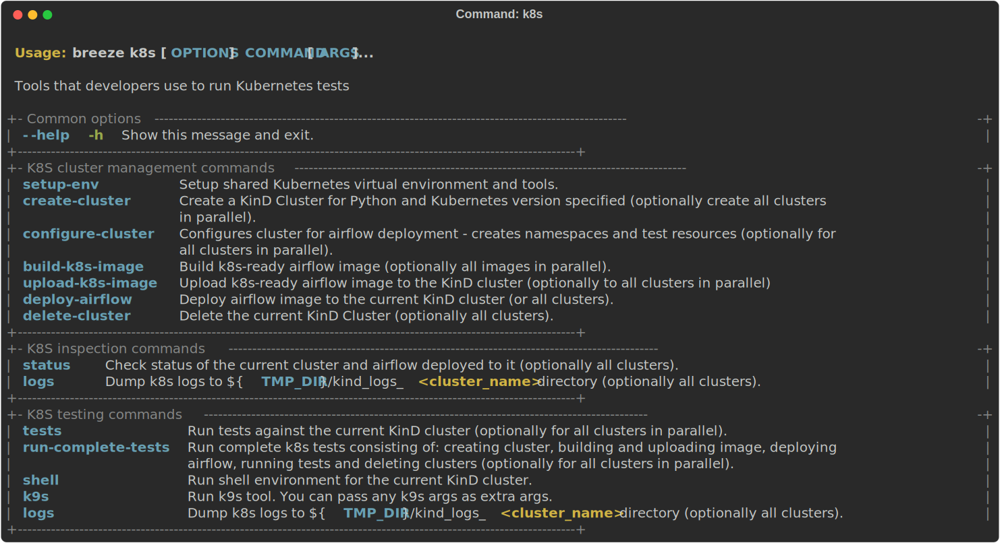

The command group allows you to setup environment, start/stop/recreate/status Kind Kubernetes cluster,
configure cluster (via ``create-cluster``, ``configure-cluster`` command). Those commands can be run with
``--run-in-parallel`` flag for all/selected clusters and they can be executed in parallel.

In order to deploy Airflow, the PROD image of Airflow need to be extended and example dags and POD
template files should be added to the image. This is done via ``build-k8s-image``, ``upload-k8s-image``.
This can also be done for all/selected images/clusters in parallel via ``--run-in-parallel`` flag.

Then Airflow (by using Helm Chart) can be deployed to the cluster via ``deploy-airflow`` command.
This can also be done for all/selected images/clusters in parallel via ``--run-in-parallel`` flag. You can
pass extra options when deploying airflow to configure your depliyment.

You can check the status, dump logs and finally delete cluster via ``status``, ``logs``, ``delete-cluster``
commands. This can also be done for all created clusters in parallel via ``--all`` flag.

You can interact with the cluster (via ``shell`` and ``k9s`` commands).

You can run set of k8s tests via ``tests`` command. You can also run tests in parallel on all/selected
clusters by ``--run-in-parallel`` flag.


Running tests with Kubernetes Cluster
-------------------------------------

You can either run all tests or you can select which tests to run. You can also enter interactive virtualenv
to run the tests manually one by one.


Running Kubernetes tests via breeze:

.. code-block:: bash

      breeze k8s tests
      breeze k8s tests TEST TEST [TEST ...]

Optionally add ``--executor``:

.. code-block:: bash

      breeze k8s tests --executor CeleryExecutor
      breeze k8s tests --executor CeleryExecutor TEST TEST [TEST ...]

Entering shell with Kubernetes Cluster
--------------------------------------

This shell is prepared to run Kubernetes tests interactively. It has ``kubectl`` and ``kind`` cli tools
available in the path, it has also activated virtualenv environment that allows you to run tests via pytest.

The virtualenv is available in ./.build/.k8s-env/
The binaries are available in ``.build/.k8s-env/bin`` path.

.. code-block:: bash

      breeze k8s shell

Optionally add ``--executor``:

.. code-block:: bash

      breeze k8s shell --executor CeleryExecutor


K9s CLI - debug Kubernetes in style!
------------------------------------

Breeze has built-in integration with fantastic k9s CLI tool, that allows you to debug the Kubernetes
installation effortlessly and in style. K9S provides terminal (but windowed) CLI that helps you to:

- easily observe what's going on in the Kubernetes cluster
- observe the resources defined (pods, secrets, custom resource definitions)
- enter shell for the Pods/Containers running,
- see the log files and more.

You can read more about k9s at `https://k9scli.io/ <https://k9scli.io/>`_

Here is the screenshot of k9s tools in operation:

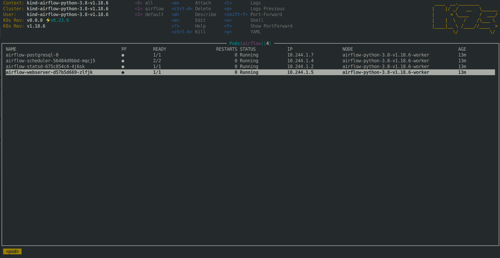


You can enter the k9s tool via breeze (after you deployed Airflow):

.. code-block:: bash

      breeze k8s k9s

You can exit k9s by pressing Ctrl-C.

Typical testing pattern for Kubernetes tests
--------------------------------------------

The typical session for tests with Kubernetes looks like follows:


1. Prepare the environment:

.. code-block:: bash

    breeze k8s setup-env

The first time you run it, it should result in creating the virtualenv and installing good versions
of kind, kubectl and helm. All of them are installed in ``./build/.k8s-env`` (binaries available in ``bin``
sub-folder of it).

.. code-block:: text

    Initializing K8S virtualenv in /Users/jarek/IdeaProjects/airflow/.build/.k8s-env
    Reinstalling PIP version in /Users/jarek/IdeaProjects/airflow/.build/.k8s-env
    Installing necessary packages in /Users/jarek/IdeaProjects/airflow/.build/.k8s-env
    The ``kind`` tool is not downloaded yet. Downloading 0.14.0 version.
    Downloading from: https://github.com/kubernetes-sigs/kind/releases/download/v0.14.0/kind-darwin-arm64
    The ``kubectl`` tool is not downloaded yet. Downloading 1.24.3 version.
    Downloading from: https://storage.googleapis.com/kubernetes-release/release/v1.24.3/bin/darwin/arm64/kubectl
    The ``helm`` tool is not downloaded yet. Downloading 3.9.2 version.
    Downloading from: https://get.helm.sh/helm-v3.9.2-darwin-arm64.tar.gz
    Extracting the darwin-arm64/helm to /Users/jarek/IdeaProjects/airflow/.build/.k8s-env/bin
    Moving the helm to /Users/jarek/IdeaProjects/airflow/.build/.k8s-env/bin/helm


This prepares the virtual environment for tests and downloads the right versions of the tools
to ``./build/.k8s-env``

2. Create the KinD cluster:

.. code-block:: bash

    breeze k8s create-cluster

Should result in KinD creating the K8S cluster.

.. code-block:: text

    Config created in /Users/jarek/IdeaProjects/airflow/.build/.k8s-clusters/airflow-python-3.8-v1.24.2/.kindconfig.yaml:

    # Licensed to the Apache Software Foundation (ASF) under one
    # or more contributor license agreements.  See the NOTICE file
    # distributed with this work for additional information
    # regarding copyright ownership.  The ASF licenses this file
    # to you under the Apache License, Version 2.0 (the
    # "License"); you may not use this file except in compliance
    # with the License.  You may obtain a copy of the License at
    #
    #   http://www.apache.org/licenses/LICENSE-2.0
    #
    # Unless required by applicable law or agreed to in writing,
    # software distributed under the License is distributed on an
    # "AS IS" BASIS, WITHOUT WARRANTIES OR CONDITIONS OF ANY
    # KIND, either express or implied.  See the License for the
    # specific language governing permissions and limitations
    # under the License.
    ---
    kind: Cluster
    apiVersion: kind.x-k8s.io/v1alpha4
    networking:
      ipFamily: ipv4
      apiServerAddress: "127.0.0.1"
      apiServerPort: 48366
    nodes:
      - role: control-plane
      - role: worker
        extraPortMappings:
          - containerPort: 30007
            hostPort: 18150
            listenAddress: "127.0.0.1"
            protocol: TCP


    Creating cluster "airflow-python-3.8-v1.24.2" ...
     ✓ Ensuring node image (kindest/node:v1.24.2) 🖼
     ✓ Preparing nodes 📦 📦
     ✓ Writing configuration 📜
     ✓ Starting control-plane 🕹️
     ✓ Installing CNI 🔌
     ✓ Installing StorageClass 💾
     ✓ Joining worker nodes 🚜
    Set kubectl context to "kind-airflow-python-3.8-v1.24.2"
    You can now use your cluster with:

    kubectl cluster-info --context kind-airflow-python-3.8-v1.24.2

    Not sure what to do next? 😅  Check out https://kind.sigs.k8s.io/docs/user/quick-start/

    KinD Cluster API server URL: http://localhost:48366
    Connecting to localhost:18150. Num try: 1
    Error when connecting to localhost:18150 : ('Connection aborted.', RemoteDisconnected('Remote end closed connection without response'))

    Airflow webserver is not available at port 18150. Run `breeze k8s deploy-airflow --python 3.8 --kubernetes-version v1.24.2` to (re)deploy airflow

    KinD cluster airflow-python-3.8-v1.24.2 created!

    NEXT STEP: You might now configure your cluster by:

    breeze k8s configure-cluster

3. Configure cluster for Airflow - this will recreate namespace and upload test resources for Airflow.

.. code-block:: bash

    breeze k8s configure-cluster

.. code-block:: text

    Configuring airflow-python-3.8-v1.24.2 to be ready for Airflow deployment
    Deleting K8S namespaces for kind-airflow-python-3.8-v1.24.2
    Error from server (NotFound): namespaces "airflow" not found
    Error from server (NotFound): namespaces "test-namespace" not found
    Creating namespaces
    namespace/airflow created
    namespace/test-namespace created
    Created K8S namespaces for cluster kind-airflow-python-3.8-v1.24.2

    Deploying test resources for cluster kind-airflow-python-3.8-v1.24.2
    persistentvolume/test-volume created
    persistentvolumeclaim/test-volume created
    service/airflow-webserver-node-port created
    Deployed test resources for cluster kind-airflow-python-3.8-v1.24.2


    NEXT STEP: You might now build your k8s image by:

    breeze k8s build-k8s-image

4. Check the status of the cluster

.. code-block:: bash

    breeze k8s status

Should show the status of current KinD cluster.

.. code-block:: text

    ========================================================================================================================
    Cluster: airflow-python-3.8-v1.24.2

        * KUBECONFIG=/Users/jarek/IdeaProjects/airflow/.build/.k8s-clusters/airflow-python-3.8-v1.24.2/.kubeconfig
        * KINDCONFIG=/Users/jarek/IdeaProjects/airflow/.build/.k8s-clusters/airflow-python-3.8-v1.24.2/.kindconfig.yaml

    Cluster info: airflow-python-3.8-v1.24.2

    Kubernetes control plane is running at https://127.0.0.1:48366
    CoreDNS is running at https://127.0.0.1:48366/api/v1/namespaces/kube-system/services/kube-dns:dns/proxy

    To further debug and diagnose cluster problems, use 'kubectl cluster-info dump'.

    Storage class for airflow-python-3.8-v1.24.2

    NAME                 PROVISIONER             RECLAIMPOLICY   VOLUMEBINDINGMODE      ALLOWVOLUMEEXPANSION   AGE
    standard (default)   rancher.io/local-path   Delete          WaitForFirstConsumer   false                  83s

    Running pods for airflow-python-3.8-v1.24.2

    NAME                                                               READY   STATUS    RESTARTS   AGE
    coredns-6d4b75cb6d-rwp9d                                           1/1     Running   0          71s
    coredns-6d4b75cb6d-vqnrc                                           1/1     Running   0          71s
    etcd-airflow-python-3.8-v1.24.2-control-plane                      1/1     Running   0          84s
    kindnet-ckc8l                                                      1/1     Running   0          69s
    kindnet-qqt8k                                                      1/1     Running   0          71s
    kube-apiserver-airflow-python-3.8-v1.24.2-control-plane            1/1     Running   0          84s
    kube-controller-manager-airflow-python-3.8-v1.24.2-control-plane   1/1     Running   0          84s
    kube-proxy-6g7hn                                                   1/1     Running   0          69s
    kube-proxy-dwfvp                                                   1/1     Running   0          71s
    kube-scheduler-airflow-python-3.8-v1.24.2-control-plane            1/1     Running   0          84s

    KinD Cluster API server URL: http://localhost:48366
    Connecting to localhost:18150. Num try: 1
    Error when connecting to localhost:18150 : ('Connection aborted.', RemoteDisconnected('Remote end closed connection without response'))

    Airflow webserver is not available at port 18150. Run `breeze k8s deploy-airflow --python 3.8 --kubernetes-version v1.24.2` to (re)deploy airflow


    Cluster healthy: airflow-python-3.8-v1.24.2

5. Build the image base on PROD Airflow image. You need to build the PROD image first (the command will
   guide you if you did not - either by running the build separately or passing ``--rebuild-base-image`` flag

.. code-block:: bash

    breeze k8s build-k8s-image

.. code-block:: text

    Building the K8S image for Python 3.8 using airflow base image: ghcr.io/apache/airflow/main/prod/python3.8:latest

    [+] Building 0.1s (8/8) FINISHED
     => [internal] load build definition from Dockerfile                                                                                                                                                                                                                                           0.0s
     => => transferring dockerfile: 301B                                                                                                                                                                                                                                                           0.0s
     => [internal] load .dockerignore                                                                                                                                                                                                                                                              0.0s
     => => transferring context: 35B                                                                                                                                                                                                                                                               0.0s
     => [internal] load metadata for ghcr.io/apache/airflow/main/prod/python3.8:latest                                                                                                                                                                                                             0.0s
     => [1/3] FROM ghcr.io/apache/airflow/main/prod/python3.8:latest                                                                                                                                                                                                                               0.0s
     => [internal] load build context                                                                                                                                                                                                                                                              0.0s
     => => transferring context: 3.00kB                                                                                                                                                                                                                                                            0.0s
     => CACHED [2/3] COPY airflow/example_dags/ /opt/airflow/dags/                                                                                                                                                                                                                                 0.0s
     => CACHED [3/3] COPY airflow/kubernetes_executor_templates/ /opt/airflow/pod_templates/                                                                                                                                                                                                       0.0s
     => exporting to image                                                                                                                                                                                                                                                                         0.0s
     => => exporting layers                                                                                                                                                                                                                                                                        0.0s
     => => writing image sha256:c0bdd363c549c3b0731b8e8ce34153d081f239ee2b582355b7b3ffd5394c40bb                                                                                                                                                                                                   0.0s
     => => naming to ghcr.io/apache/airflow/main/prod/python3.8-kubernetes:latest

    NEXT STEP: You might now upload your k8s image by:

    breeze k8s upload-k8s-image


5. Upload the image to KinD cluster - this uploads your image to make it available for the KinD cluster.

.. code-block:: bash

    breeze k8s upload-k8s-image

.. code-block:: text

    K8S Virtualenv is initialized in /Users/jarek/IdeaProjects/airflow/.build/.k8s-env
    Good version of kind installed: 0.14.0 in /Users/jarek/IdeaProjects/airflow/.build/.k8s-env/bin
    Good version of kubectl installed: 1.25.0 in /Users/jarek/IdeaProjects/airflow/.build/.k8s-env/bin
    Good version of helm installed: 3.9.2 in /Users/jarek/IdeaProjects/airflow/.build/.k8s-env/bin
    Stable repo is already added
    Uploading Airflow image ghcr.io/apache/airflow/main/prod/python3.8-kubernetes to cluster airflow-python-3.8-v1.24.2
    Image: "ghcr.io/apache/airflow/main/prod/python3.8-kubernetes" with ID "sha256:fb6195f7c2c2ad97788a563a3fe9420bf3576c85575378d642cd7985aff97412" not yet present on node "airflow-python-3.8-v1.24.2-worker", loading...
    Image: "ghcr.io/apache/airflow/main/prod/python3.8-kubernetes" with ID "sha256:fb6195f7c2c2ad97788a563a3fe9420bf3576c85575378d642cd7985aff97412" not yet present on node "airflow-python-3.8-v1.24.2-control-plane", loading...

    NEXT STEP: You might now deploy airflow by:

    breeze k8s deploy-airflow


7. Deploy Airflow to the cluster - this will use Airflow Helm Chart to deploy Airflow to the cluster.

.. code-block:: bash

    breeze k8s deploy-airflow

.. code-block:: text

    Deploying Airflow for cluster airflow-python-3.8-v1.24.2
    Deploying kind-airflow-python-3.8-v1.24.2 with airflow Helm Chart.
    Copied chart sources to /private/var/folders/v3/gvj4_mw152q556w2rrh7m46w0000gn/T/chart_edu__kir/chart
    Deploying Airflow from /private/var/folders/v3/gvj4_mw152q556w2rrh7m46w0000gn/T/chart_edu__kir/chart
    NAME: airflow
    LAST DEPLOYED: Tue Aug 30 22:57:54 2022
    NAMESPACE: airflow
    STATUS: deployed
    REVISION: 1
    TEST SUITE: None
    NOTES:
    Thank you for installing Apache Airflow 2.3.4!

    Your release is named airflow.
    You can now access your dashboard(s) by executing the following command(s) and visiting the corresponding port at localhost in your browser:

    Airflow Webserver:     kubectl port-forward svc/airflow-webserver 8080:8080 --namespace airflow
    Default Webserver (Airflow UI) Login credentials:
        username: admin
        password: admin
    Default Postgres connection credentials:
        username: postgres
        password: postgres
        port: 5432

    You can get Fernet Key value by running the following:

        echo Fernet Key: $(kubectl get secret --namespace airflow airflow-fernet-key -o jsonpath="{.data.fernet-key}" | base64 --decode)

    WARNING:
        Kubernetes workers task logs may not persist unless you configure log persistence or remote logging!
        Logging options can be found at: https://airflow.apache.org/docs/helm-chart/stable/manage-logs.html
        (This warning can be ignored if logging is configured with environment variables or secrets backend)

    ###########################################################
    #  WARNING: You should set a static webserver secret key  #
    ###########################################################

    You are using a dynamically generated webserver secret key, which can lead to
    unnecessary restarts of your Airflow components.

    Information on how to set a static webserver secret key can be found here:
    https://airflow.apache.org/docs/helm-chart/stable/production-guide.html#webserver-secret-key
    Deployed kind-airflow-python-3.8-v1.24.2 with airflow Helm Chart.

    Airflow for Python 3.8 and K8S version v1.24.2 has been successfully deployed.

    The KinD cluster name: airflow-python-3.8-v1.24.2
    The kubectl cluster name: kind-airflow-python-3.8-v1.24.2.


    KinD Cluster API server URL: http://localhost:48366
    Connecting to localhost:18150. Num try: 1
    Established connection to webserver at http://localhost:18150/health and it is healthy.
    Airflow Web server URL: http://localhost:18150 (admin/admin)

    NEXT STEP: You might now run tests or interact with airflow via shell (kubectl, pytest etc.) or k9s commands:


    breeze k8s tests

    breeze k8s shell

    breeze k8s k9s


8. Run Kubernetes tests

Note that the tests are executed in production container not in the CI container.
There is no need for the tests to run inside the Airflow CI container image as they only
communicate with the Kubernetes-run Airflow deployed via the production image.
Those Kubernetes tests require virtualenv to be created locally with airflow installed.
The virtualenv required will be created automatically when the scripts are run.

8a) You can run all the tests

.. code-block:: bash

    breeze k8s tests

.. code-block:: text

    Running tests with kind-airflow-python-3.8-v1.24.2 cluster.
     Command to run: pytest kubernetes_tests
    ========================================================================================= test session starts ==========================================================================================
    platform darwin -- Python 3.9.9, pytest-6.2.5, py-1.11.0, pluggy-1.0.0 -- /Users/jarek/IdeaProjects/airflow/.build/.k8s-env/bin/python
    cachedir: .pytest_cache
    rootdir: /Users/jarek/IdeaProjects/airflow/kubernetes_tests
    plugins: anyio-3.6.1, instafail-0.4.2, xdist-2.5.0, forked-1.4.0, timeouts-1.2.1, cov-3.0.0
    setup timeout: 0.0s, execution timeout: 0.0s, teardown timeout: 0.0s
    collected 55 items

    test_kubernetes_executor.py::TestKubernetesExecutor::test_integration_run_dag PASSED                                                                                            [  1%]
    test_kubernetes_executor.py::TestKubernetesExecutor::test_integration_run_dag_with_scheduler_failure PASSED                                                                     [  3%]
    test_kubernetes_pod_operator.py::TestKubernetesPodOperatorSystem::test_already_checked_on_failure PASSED                                                                        [  5%]
    test_kubernetes_pod_operator.py::TestKubernetesPodOperatorSystem::test_already_checked_on_success   ...

8b) You can enter an interactive shell to run tests one-by-one

This enters the virtualenv in ``.build/.k8s-env`` folder:

.. code-block:: bash

    breeze k8s shell

Once you enter the environment, you receive this information:

.. code-block:: text

    Entering interactive k8s shell.

    (kind-airflow-python-3.8-v1.24.2:KubernetesExecutor)>

In a separate terminal you can open the k9s CLI:

.. code-block:: bash

    breeze k8s k9s

Use it to observe what's going on in your cluster.

9. Debugging in IntelliJ/PyCharm

It is very easy to running/debug Kubernetes tests with IntelliJ/PyCharm. Unlike the regular tests they are
in ``kubernetes_tests`` folder and if you followed the previous steps and entered the shell using
``breeze k8s shell`` command, you can setup your IDE very easy to run (and debug) your
tests using the standard IntelliJ Run/Debug feature. You just need a few steps:

9a) Add the virtualenv as interpreter for the project:

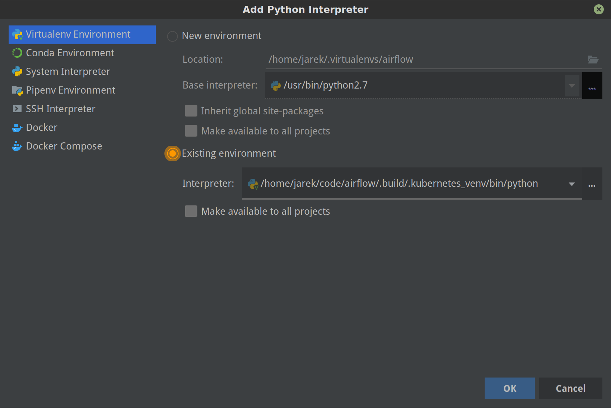

The virtualenv is created in your "Airflow" source directory in the
``.build/.k8s-env`` folder and you have to find ``python`` binary and choose
it when selecting interpreter.

9b) Choose pytest as test runner:

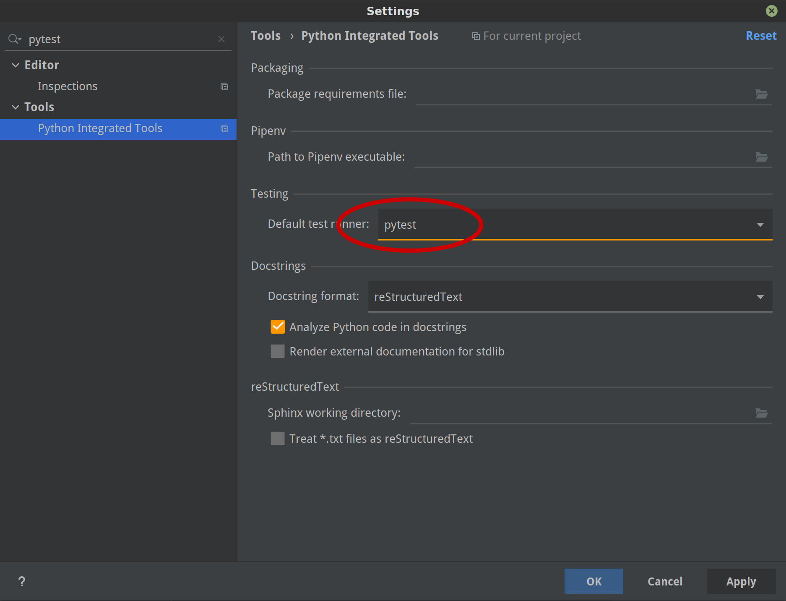

9c) Run/Debug tests using standard "Run/Debug" feature of IntelliJ

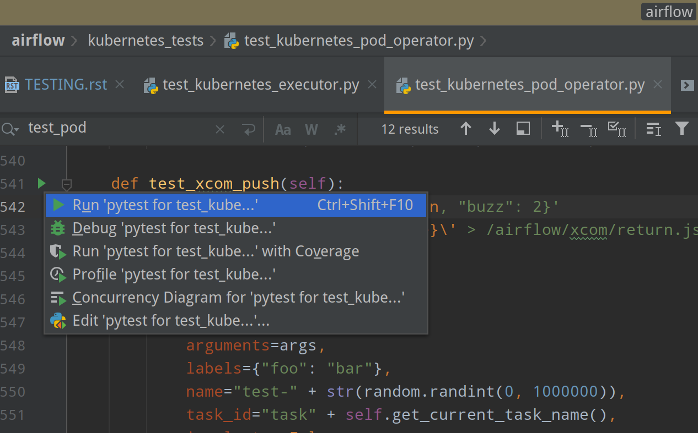


NOTE! The first time you run it, it will likely fail with
``kubernetes.config.config_exception.ConfigException``:
``Invalid kube-config file. Expected key current-context in kube-config``. You need to add KUBECONFIG
environment variable copying it from the result of "breeze k8s tests":

.. code-block:: bash

    echo ${KUBECONFIG}

    /home/jarek/code/airflow/.build/.kube/config

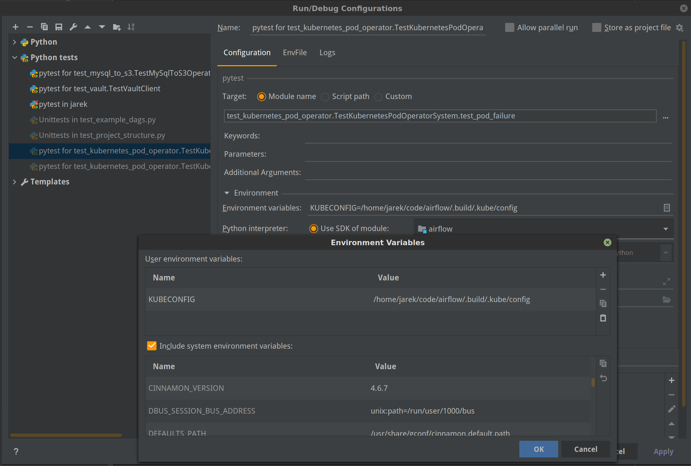


The configuration for Kubernetes is stored in your "Airflow" source directory in ".build/.kube/config" file
and this is where KUBECONFIG env should point to.

You can iterate with tests while you are in the virtualenv. All the tests requiring Kubernetes cluster
are in "kubernetes_tests" folder. You can add extra ``pytest`` parameters then (for example ``-s`` will
print output generated test logs and print statements to the terminal immediately. You should have
kubernetes_tests as your working directory.

.. code-block:: bash

    pytest test_kubernetes_executor.py::TestKubernetesExecutor::test_integration_run_dag_with_scheduler_failure -s

You can modify the tests or KubernetesPodOperator and re-run them without re-deploying
Airflow to KinD cluster.

10. Dumping logs

Sometimes You want to see the logs of the clister. This can be done with ``breeze k8s logs``.

.. code-block:: bash

    breeze k8s logs

11. Redeploying airflow

Sometimes there are side effects from running tests. You can run ``breeze k8s deploy-airflow --upgrade``
without recreating the whole cluster.

.. code-block:: bash

    breeze k8s deploy-airflow --upgrade

If needed you can also delete the cluster manually (within the virtualenv activated by
``breeze k8s shell``:

.. code-block:: bash

    kind get clusters
    kind delete clusters <NAME_OF_THE_CLUSTER>

Kind has also useful commands to inspect your running cluster:

.. code-block:: text

    kind --help

12. Stop KinD cluster when you are done

.. code-block:: bash

    breeze k8s delete-cluster

.. code-block:: text

    Deleting KinD cluster airflow-python-3.8-v1.24.2!
    Deleting cluster "airflow-python-3.8-v1.24.2" ...
    KinD cluster airflow-python-3.8-v1.24.2 deleted!


Running complete k8s tests
--------------------------

You can also run complete k8s tests with

.. code-block:: bash

    breeze k8s run-complete-tests

This will create cluster, build images, deploy airflow run tests and finally delete clusters as single
command. It is the way it is run in our CI, you can also run such complete tests in parallel.

Manually testing release candidate packages
===========================================

Breeze can be used to test new release candidates of packages - both Airflow and providers. You can easily
turn the CI image of Breeze to install and start Airflow for both Airflow and provider packages - both,
packages that are built from sources and packages that are downloaded from PyPI when they are released
there as release candidates.

The way to test it is rather straightforward:

1) Make sure that the packages - both ``airflow`` and ``providers`` are placed in the ``dist`` folder
   of your Airflow source tree. You can either build them there or download from PyPI (see the next chapter)

2) You can run ```breeze shell`` or ``breeze start-airflow`` commands with adding the following flags -
   ``--mount-sources remove`` and ``--use-packages-from-dist``. The first one removes the ``airflow``
   source tree from the container when starting it, the second one installs ``airflow`` and ``providers``
   packages from the ``dist`` folder when entering breeze.

Testing pre-release packages
----------------------------

There are two ways how you can get Airflow packages in ``dist`` folder - by building them from sources or
downloading them from PyPI.

.. note ::

    Make sure you run ``rm dist/*`` before you start building packages or downloading them from PyPI because
    the packages built there already are not removed manually.

In order to build apache-airflow from sources, you need to run the following command:

.. code-block:: bash

    breeze release-management prepare-airflow-package

In order to build providers from sources, you need to run the following command:

.. code-block:: bash

    breeze release-management prepare-provider-packages <PROVIDER_1> <PROVIDER_2> ... <PROVIDER_N>

The packages are built in ``dist`` folder and the command will summarise what packages are available in the
``dist`` folder after it finishes.

If you want to download the packages from PyPI, you need to run the following command:

.. code-block:: bash

    pip download apache-airflow-providers-<PROVIDER_NAME>==X.Y.Zrc1 --dest dist --no-deps

You can use it for both release and pre-release packages.

Examples of testing pre-release packages
----------------------------------------

Few examples below explain how you can test pre-release packages, and combine them with locally build
and released packages.

The following example downloads ``apache-airflow`` and ``celery`` and ``kubernetes`` provider packages from PyPI and
eventually starts Airflow with the Celery Executor. It also loads example dags and default connections:

.. code:: bash

    rm dist/*
    pip download apache-airflow==2.7.0rc1 --dest dist --no-deps
    pip download apache-airflow-providers-cncf-kubernetes==7.4.0rc1 --dest dist --no-deps
    pip download apache-airflow-providers-cncf-kubernetes==3.3.0rc1 --dest dist --no-deps
    breeze start-airflow --mount-sources remove --use-packages-from-dist --executor CeleryExecutor --load-default-connections --load-example-dags


The following example downloads ``celery`` and ``kubernetes`` provider packages from PyPI, builds
``apache-airflow`` package from the main sources and eventually starts Airflow with the Celery Executor.
It also loads example dags and default connections:

.. code:: bash

    rm dist/*
    breeze release-management prepare-airflow-package
    pip download apache-airflow-providers-cncf-kubernetes==7.4.0rc1 --dest dist --no-deps
    pip download apache-airflow-providers-cncf-kubernetes==3.3.0rc1 --dest dist --no-deps
    breeze start-airflow --mount-sources remove --use-packages-from-dist --executor CeleryExecutor --load-default-connections --load-example-dags

The following example builds ``celery``, ``kubernetes`` provider packages from PyPI, downloads 2.6.3 version
of ``apache-airflow`` package from PyPI and eventually starts Airflow using default executor
for the backend chosen (no example dags, no default connections):

.. code:: bash

    rm dist/*
    pip download apache-airflow==2.6.3 --dest dist --no-deps
    breeze release-management prepare-provider-packages celery cncf.kubernetes
    breeze start-airflow --mount-sources remove --use-packages-from-dist

You can mix and match packages from PyPI (final or pre-release candidates) with locally build packages. You
can also choose which providers to install this way since the ``--remove-sources`` flag makes sure that Airflow
installed does not contain all the providers - only those that you explicitly downloaded or built in the
``dist`` folder. This way you can test all the combinations of Airflow + Providers you might need.


Airflow System Tests
====================

System tests need to communicate with external services/systems that are available
if you have appropriate credentials configured for your tests.
The system tests derive from the ``tests.test_utils.system_test_class.SystemTests`` class. They should also
be marked with ``@pytest.marker.system(SYSTEM)`` where ``system`` designates the system
to be tested (for example, ``google.cloud``). These tests are skipped by default.

You can execute the system tests by providing the ``--system SYSTEM`` flag to ``pytest``. You can
specify several --system flags if you want to execute tests for several systems.

The system tests execute a specified example DAG file that runs the DAG end-to-end.

See more details about adding new system tests below.

Environment for System Tests
----------------------------

**Prerequisites:** You may need to set some variables to run system tests. If you need to
add some initialization of environment variables to Breeze, you can add a
``variables.env`` file in the ``files/airflow-breeze-config/variables.env`` file. It will be automatically
sourced when entering the Breeze environment. You can also add some additional
initialization commands in this file if you want to execute something
always at the time of entering Breeze.

There are several typical operations you might want to perform such as:

* generating a file with the random value used across the whole Breeze session (this is useful if
  you want to use this random number in names of resources that you create in your service
* generate variables that will be used as the name of your resources
* decrypt any variables and resources you keep as encrypted in your configuration files
* install additional packages that are needed in case you are doing tests with 1.10.* Airflow series
  (see below)

Example variables.env file is shown here (this is part of the variables.env file that is used to
run Google Cloud system tests.

.. code-block:: bash

  # Build variables. This file is sourced by Breeze.
  # Also it is sourced during continuous integration build in Cloud Build

  # Auto-export all variables
  set -a

  echo
  echo "Reading variables"
  echo

  # Generate random number that will be used across your session
  RANDOM_FILE="/random.txt"

  if [[ ! -f "${RANDOM_FILE}" ]]; then
      echo "${RANDOM}" > "${RANDOM_FILE}"
  fi

  RANDOM_POSTFIX=$(cat "${RANDOM_FILE}")


To execute system tests, specify the ``--system SYSTEM``
flag where ``SYSTEM`` is a system to run the system tests for. It can be repeated.


Forwarding Authentication from the Host
----------------------------------------------------

For system tests, you can also forward authentication from the host to your Breeze container. You can specify
the ``--forward-credentials`` flag when starting Breeze. Then, it will also forward the most commonly used
credentials stored in your ``home`` directory. Use this feature with care as it makes your personal credentials
visible to anything that you have installed inside the Docker container.

Currently forwarded credentials are:
  * credentials stored in ``${HOME}/.aws`` for ``aws`` - Amazon Web Services client
  * credentials stored in ``${HOME}/.azure`` for ``az`` - Microsoft Azure client
  * credentials stored in ``${HOME}/.config`` for ``gcloud`` - Google Cloud client (among others)
  * credentials stored in ``${HOME}/.docker`` for ``docker`` client
  * credentials stored in ``${HOME}/.snowsql`` for ``snowsql`` - SnowSQL (Snowflake CLI client)

Adding a New System Test
--------------------------

We are working on automating system tests execution (AIP-4) but for now, system tests are skipped when
tests are run in our CI system. But to enable the test automation, we encourage you to add system
tests whenever an operator/hook/sensor is added/modified in a given system.

* To add your own system tests, derive them from the
  ``tests.test_utils.system_tests_class.SystemTest`` class and mark with the
  ``@pytest.mark.system(SYSTEM_NAME)`` marker. The system name should follow the path defined in
  the ``providers`` package (for example, the system tests from ``tests.providers.google.cloud``
  package should be marked with ``@pytest.mark.system("google.cloud")``.

* If your system tests need some credential files to be available for an
  authentication with external systems, make sure to keep these credentials in the
  ``files/airflow-breeze-config/keys`` directory. Mark your tests with
  ``@pytest.mark.credential_file(<FILE>)`` so that they are skipped if such a credential file is not there.
  The tests should read the right credentials and authenticate them on their own. The credentials are read
  in Breeze from the ``/files`` directory. The local "files" folder is mounted to the "/files" folder in Breeze.

* If your system tests are long-running ones (i.e., require more than 20-30 minutes
  to complete), mark them with the ```@pytest.markers.long_running`` marker.
  Such tests are skipped by default unless you specify the ``--long-running`` flag to pytest.

* The system test itself (python class) does not have any logic. Such a test runs
  the DAG specified by its ID. This DAG should contain the actual DAG logic
  to execute. Make sure to define the DAG in ``providers/<SYSTEM_NAME>/example_dags``. These example DAGs
  are also used to take some snippets of code out of them when documentation is generated. So, having these
  DAGs runnable is a great way to make sure the documentation is describing a working example. Inside
  your test class/test method, simply use ``self.run_dag(<DAG_ID>,<DAG_FOLDER>)`` to run the DAG. Then,
  the system class will take care about running the DAG. Note that the DAG_FOLDER should be
  a subdirectory of the ``tests.test_utils.AIRFLOW_MAIN_FOLDER`` + ``providers/<SYSTEM_NAME>/example_dags``.


A simple example of a system test is available in:

``tests/providers/google/cloud/operators/test_compute_system.py``.

It runs two DAGs defined in ``airflow.providers.google.cloud.example_dags.example_compute.py``.


The typical system test session
-------------------------------

Here is the typical session that you need to do to run system tests:

1. Enter breeze

.. code-block:: bash

   breeze down
   breeze --python 3.8 --db-reset --forward-credentials

This will:

* stop the whole environment (i.e. recreates metadata database from the scratch)
* run Breeze with:
  * python 3.8 version
  * resetting the Airflow database
  * forward your local credentials to Breeze

3. Run the tests:

.. code-block:: bash

   pytest -o faulthandler_timeout=2400 \
      --system=google tests/providers/google/cloud/operators/test_compute_system.py

Iteration with System Tests if your resources are slow to create
----------------------------------------------------------------

When you want to iterate on system tests, you might want to create slow resources first.

If you need to set up some external resources for your tests (for example compute instances in Google Cloud)
you should set them up and teardown in the setUp/tearDown methods of your tests.
Since those resources might be slow to create, you might want to add some helpers that
set them up and tear them down separately via manual operations. This way you can iterate on
the tests without waiting for setUp and tearDown with every test.

In this case, you should build in a mechanism to skip setUp and tearDown in case you manually
created the resources. A somewhat complex example of that can be found in
``tests.providers.google.cloud.operators.test_cloud_sql_system.py`` and the helper is
available in ``tests.providers.google.cloud.operators.test_cloud_sql_system_helper.py``.

When the helper is run with ``--action create`` to create cloud sql instances which are very slow
to create and set-up so that you can iterate on running the system tests without
losing the time for creating theme every time. A temporary file is created to prevent from
setting up and tearing down the instances when running the test.

This example also shows how you can use the random number generated at the entry of Breeze if you
have it in your variables.env (see the previous chapter). In the case of Cloud SQL, you cannot reuse the
same instance name for a week so we generate a random number that is used across the whole session
and store it in ``/random.txt`` file so that the names are unique during tests.


!!!!!!!!!!!!!!!!!!!!!!!!!!!!!! Important !!!!!!!!!!!!!!!!!!!!!!!!!!!!

Do not forget to delete manually created resources before leaving the
Breeze session. They are usually expensive to run.

!!!!!!!!!!!!!!!!!!!!!!!!!!!!!! Important !!!!!!!!!!!!!!!!!!!!!!!!!!!!

1. Enter breeze

.. code-block:: bash

    breeze down
    breeze --python 3.8 --db-reset --forward-credentials

2. Run create action in helper (to create slowly created resources):

.. code-block:: bash

    python tests/providers/google/cloud/operators/test_cloud_sql_system_helper.py --action create

3. Run the tests:

.. code-block:: bash

   pytest -o faulthandler_timeout=2400 \
      --system=google tests/providers/google/cloud/operators/test_compute_system.py

4. Run delete action in helper:

.. code-block:: bash

    python tests/providers/google/cloud/operators/test_cloud_sql_system_helper.py --action delete


Local and Remote Debugging in IDE
=================================

One of the great benefits of using the local virtualenv and Breeze is an option to run
local debugging in your IDE graphical interface.

When you run example DAGs, even if you run them using unit tests within IDE, they are run in a separate
container. This makes it a little harder to use with IDE built-in debuggers.
Fortunately, IntelliJ/PyCharm provides an effective remote debugging feature (but only in paid versions).
See additional details on
`remote debugging <https://www.jetbrains.com/help/pycharm/remote-debugging-with-product.html>`_.

You can set up your remote debugging session as follows:

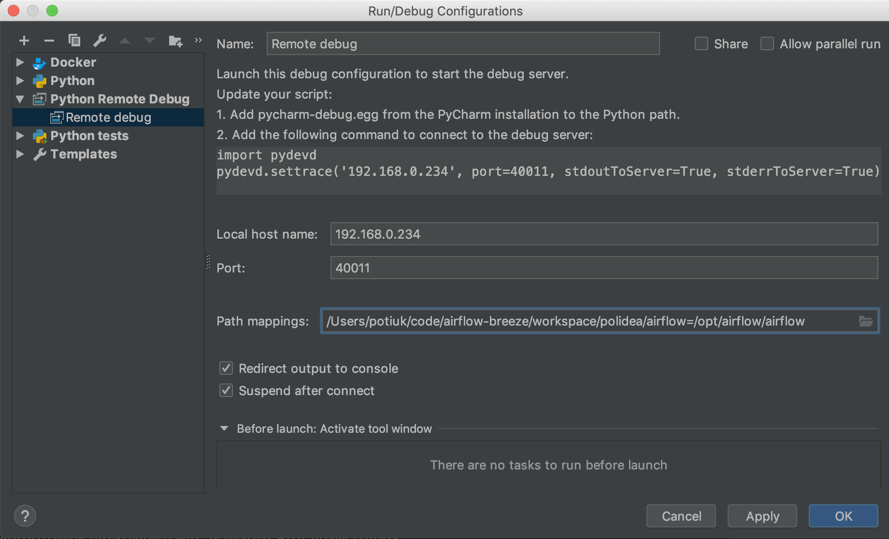

Note that on macOS, you have to use a real IP address of your host rather than the default
localhost because on macOS the container runs in a virtual machine with a different IP address.

Make sure to configure source code mapping in the remote debugging configuration to map
your local sources to the ``/opt/airflow`` location of the sources within the container:

.. image:: images/source_code_mapping_ide.png
    :align: center
    :alt: Source code mapping

Setup VM on GCP with SSH forwarding
-----------------------------------

Below are the steps you need to take to set up your virtual machine in the Google Cloud.

1. The next steps will assume that you have configured environment variables with the name of the network and
   a virtual machine, project ID and the zone where the virtual machine will be created

    .. code-block:: bash

      PROJECT_ID="<PROJECT_ID>"
      GCP_ZONE="europe-west3-a"
      GCP_NETWORK_NAME="airflow-debugging"
      GCP_INSTANCE_NAME="airflow-debugging-ci"

2. It is necessary to configure the network and firewall for your machine.
   The firewall must have unblocked access to port 22 for SSH traffic and any other port for the debugger.
   In the example for the debugger, we will use port 5555.

    .. code-block:: bash

      gcloud compute --project="${PROJECT_ID}" networks create "${GCP_NETWORK_NAME}" \
        --subnet-mode=auto

      gcloud compute --project="${PROJECT_ID}" firewall-rules create "${GCP_NETWORK_NAME}-allow-ssh" \
        --network "${GCP_NETWORK_NAME}" \
        --allow tcp:22 \
        --source-ranges 0.0.0.0/0

      gcloud compute --project="${PROJECT_ID}" firewall-rules create "${GCP_NETWORK_NAME}-allow-debugger" \
        --network "${GCP_NETWORK_NAME}" \
        --allow tcp:5555 \
        --source-ranges 0.0.0.0/0

3. If you have a network, you can create a virtual machine. To save costs, you can create a `Preemptible
   virtual machine <https://cloud.google.com/preemptible-vms>` that is automatically deleted for up
   to 24 hours.

    .. code-block:: bash

      gcloud beta compute --project="${PROJECT_ID}" instances create "${GCP_INSTANCE_NAME}" \
        --zone="${GCP_ZONE}" \
        --machine-type=f1-micro \
        --subnet="${GCP_NETWORK_NAME}" \
        --image=debian-11-bullseye-v20220120 \
        --image-project=debian-cloud \
        --preemptible

    To check the public IP address of the machine, you can run the command

    .. code-block:: bash

      gcloud compute --project="${PROJECT_ID}" instances describe "${GCP_INSTANCE_NAME}" \
        --zone="${GCP_ZONE}" \
        --format='value(networkInterfaces[].accessConfigs[0].natIP.notnull().list())'

4. The SSH Daemon's default configuration does not allow traffic forwarding to public addresses.
   To change it, modify the ``GatewayPorts`` options in the ``/etc/ssh/sshd_config`` file to ``Yes``
   and restart the SSH daemon.

    .. code-block:: bash

      gcloud beta compute --project="${PROJECT_ID}" ssh "${GCP_INSTANCE_NAME}" \
        --zone="${GCP_ZONE}" -- \
        sudo sed -i "s/#\?\s*GatewayPorts no/GatewayPorts Yes/" /etc/ssh/sshd_config

      gcloud beta compute --project="${PROJECT_ID}" ssh "${GCP_INSTANCE_NAME}" \
        --zone="${GCP_ZONE}" -- \
        sudo service sshd restart

5. To start port forwarding, run the following command:

    .. code-block:: bash

      gcloud beta compute --project="${PROJECT_ID}" ssh "${GCP_INSTANCE_NAME}" \
        --zone="${GCP_ZONE}" -- \
        -N \
        -R 0.0.0.0:5555:localhost:5555 \
        -v

If you have finished using the virtual machine, remember to delete it.

    .. code-block:: bash

      gcloud beta compute --project="${PROJECT_ID}" instances delete "${GCP_INSTANCE_NAME}" \
        --zone="${GCP_ZONE}"

You can use the GCP service for free if you use the `Free Tier <https://cloud.google.com/free>`__.

DAG Testing
===========

To ease and speed up the process of developing DAGs, you can use
py:class:`~airflow.executors.debug_executor.DebugExecutor`, which is a single process executor
for debugging purposes. Using this executor, you can run and debug DAGs from your IDE.

To set up the IDE:

1. Add ``main`` block at the end of your DAG file to make it runnable.
It will run a backfill job:

.. code-block:: python

  if __name__ == "__main__":
      dag.clear()
      dag.run()


2. Set up ``AIRFLOW__CORE__EXECUTOR=DebugExecutor`` in the run configuration of your IDE.
   Make sure to also set up all environment variables required by your DAG.

3. Run and debug the DAG file.

Additionally, ``DebugExecutor`` can be used in a fail-fast mode that will make
all other running or scheduled tasks fail immediately. To enable this option, set
``AIRFLOW__DEBUG__FAIL_FAST=True`` or adjust ``fail_fast`` option in your ``airflow.cfg``.

Also, with the Airflow CLI command ``airflow dags test``, you can execute one complete run of a DAG:

.. code-block:: bash

    # airflow dags test [dag_id] [execution_date]
    airflow dags test example_branch_operator 2018-01-01

By default ``/files/dags`` folder is mounted from your local ``<AIRFLOW_SOURCES>/files/dags`` and this is
the directory used by airflow scheduler and webserver to scan dags for. You can place your dags there
to test them.

The DAGs can be run in the main version of Airflow but they also work
with older versions.


Tracking SQL statements
=======================

You can run tests with SQL statements tracking. To do this, use the ``--trace-sql`` option and pass the
columns to be displayed as an argument. Each query will be displayed on a separate line.
Supported values:

* ``num`` -  displays the query number;
* ``time`` - displays the query execution time;
* ``trace`` - displays the simplified (one-line) stack trace;
* ``sql`` - displays the SQL statements;
* ``parameters`` - display SQL statement parameters.

If you only provide ``num``, then only the final number of queries will be displayed.

By default, pytest does not display output for successful tests, if you still want to see them, you must
pass the ``--capture=no`` option.

If you run the following command:

.. code-block:: bash

    pytest --trace-sql=num,sql,parameters --capture=no \
      tests/jobs/test_scheduler_job.py -k test_process_dags_queries_count_05

On the screen you will see database queries for the given test.

SQL query tracking does not work properly if your test runs subprocesses. Only queries from the main process
are tracked.

Code Coverage
=============

Airflow's CI process automatically uploads the code coverage report to codecov.io.

Viewing the Coverage Report Online:
-----------------------------------
For the most recent coverage report of the main branch, visit: https://codecov.io/gh/apache/airflow.

Generating Local Coverage Reports:
----------------------------------
If you wish to obtain coverage reports for specific areas of the codebase on your local machine, follow these steps:

a. Initiate a breeze shell.

b. Execute one of the commands below based on the desired coverage area:

   - **Core:** ``python scripts/cov/core_coverage.py``
   - **REST API:** ``python scripts/cov/restapi_coverage.py``
   - **CLI:** ``python scripts/cov/cli_coverage.py``
   - **Webserver:** ``python scripts/cov/www_coverage.py``

c. After execution, the coverage report will be available at: http://localhost:28000/dev/coverage/index.html.

 .. note::

     In order to see the coverage report, you must start webserver first in breeze environment via `airflow webserver`.
     Once you enter `breeze`, you can start `tmux`  (terminal multiplexer) and split the terminal (by pressing `ctrl-B "` for example)
     to contiinue testing and run the webserver in one tetminal and run tests in the second one (you can switch between
     the terminals with `ctrl-B <arrow>`).

Modules Not Fully Covered:
--------------------------
Each coverage command provides a list of modules that aren't fully covered. If you wish to enhance coverage for a particular module:

a. Work on the module to improve its coverage.

b. Once coverage reaches 100%, you can safely remove the module from the list of modules that are not fully covered.
   This list is inside each command's source code.
