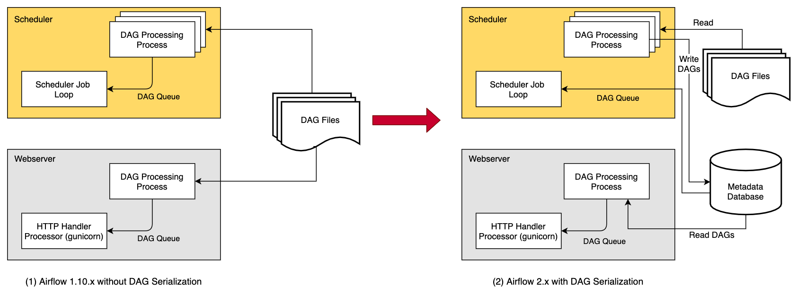

 .. Licensed to the Apache Software Foundation (ASF) under one
    or more contributor license agreements.  See the NOTICE file
    distributed with this work for additional information
    regarding copyright ownership.  The ASF licenses this file
    to you under the Apache License, Version 2.0 (the
    "License"); you may not use this file except in compliance
    with the License.  You may obtain a copy of the License at

 ..   http://www.apache.org/licenses/LICENSE-2.0

 .. Unless required by applicable law or agreed to in writing,
    software distributed under the License is distributed on an
    "AS IS" BASIS, WITHOUT WARRANTIES OR CONDITIONS OF ANY
    KIND, either express or implied.  See the License for the
    specific language governing permissions and limitations
    under the License.

.. _dag-serialization:

Dag Serialization
=================

In order to make Airflow Webserver stateless, Airflow >=1.10.7 supports
Dag Serialization and DB Persistence. From Airflow 2.0.0, the Scheduler
also uses serialized Dags for consistency and makes scheduling decisions.

Without Dag Serialization & persistence in DB, the Webserver and the Scheduler both
need access to the Dag files. Both the Scheduler and Webserver parse the Dag files.

With **Dag Serialization** we aim to decouple the Webserver from Dag parsing
which would make the Webserver very light-weight.

As shown in the image above, when using this feature,
the :class:`~airflow.jobs.scheduler_job.DagFileProcessorProcess` in the Scheduler
parses the Dag files, serializes them in JSON format and saves them in the Metadata DB
as :class:`~airflow.models.serialized_dag.SerializedDagModel` model.

The Webserver now instead of having to parse the Dag files again, reads the
serialized Dags in JSON, de-serializes them and creates the DagBag and uses it
to show in the UI. And the Scheduler does not need the actual Dags for making scheduling decisions,
instead of using the Dag files, we use the serialized Dags that contain all the information needed to
schedule the Dags from Airflow 2.0.0 (this was done as part of :ref:`Scheduler HA <scheduler:ha>`).

One of the key features that is implemented as a part of Dag Serialization is that
instead of loading an entire DagBag when the WebServer starts we only load each Dag on demand from the
Serialized Dag table. It helps to reduce the Webserver startup time and memory. This reduction is notable
when you have a large number of Dags.

You can enable the source code to be stored in the database to make the Webserver completely independent of the Dag files.
This is not necessary if your files are embedded in the Docker image or you can otherwise provide
them to the Webserver. The data is stored in the :class:`~airflow.models.dagcode.DagCode` model.

The last element is rendering template fields. When serialization is enabled, templates are not rendered
to requests, but a copy of the field contents is saved before the task is executed on worker.
The data is stored in the :class:`~airflow.models.renderedtifields.RenderedTaskInstanceFields` model.
To limit the excessive growth of the database, only the most recent entries are kept and older entries
are purged.

.. note::
  Dag Serialization is strictly required and can not be turned off from Airflow 2.0+.

Dag Serialization Settings
---------------------------

Add the following settings in ``airflow.cfg``:

.. code-block:: ini

    [core]

    # You can also update the following default configurations based on your needs
    min_serialized_dag_update_interval = 30
    min_serialized_dag_fetch_interval = 10
    max_num_rendered_ti_fields_per_task = 30
    compress_serialized_dags = False

*   ``min_serialized_dag_update_interval``: This flag sets the minimum interval (in seconds) after which
    the serialized Dags in the DB should be updated. This helps in reducing database write rate.
*   ``min_serialized_dag_fetch_interval``: This option controls how often the Serialized Dag will be re-fetched
    from the DB when it is already loaded in the DagBag in the Webserver. Setting this higher will reduce
    load on the DB, but at the expense of displaying a possibly stale cached version of the Dag.
*   ``max_num_rendered_ti_fields_per_task``: This option controls the maximum number of Rendered Task Instance
    Fields (Template Fields) per task to store in the Database.
*   ``compress_serialized_dags``: This option controls whether to compress the Serialized Dag to the Database.
    It is useful when there are very large Dags in your cluster. When ``True``, this will disable the Dag dependencies view.

If you are updating Airflow from <1.10.7, please do not forget to run ``airflow db migrate``.

Limitations
-----------

*   When using user-defined filters and macros, the Rendered View in the Webserver might show incorrect results
    for TIs that have not yet executed as it might be using external modules that the Webserver won't have access to.
    Use ``airflow tasks render`` CLI command in such situation to debug or test rendering of your template_fields.
    Once the tasks execution starts the Rendered Template Fields will be stored in the DB in a separate table and
    after which the correct values would be showed in the Webserver (Rendered View tab).

.. note::
    You need Airflow >= 1.10.10 for completely stateless Webserver.
    Airflow 1.10.7 to 1.10.9 needed access to Dag files in some cases.
    More Information: https://airflow.apache.org/docs/1.10.9/dag-serialization.html#limitations

Using a different JSON Library
------------------------------

To use a different JSON library instead of the standard ``json`` library like ``ujson``, you need to
define a ``json`` variable in local Airflow settings (``airflow_local_settings.py``) file as follows:

.. code-block:: python

    import ujson

    json = ujson

See :ref:`Configuring local settings <set-config:configuring-local-settings>` for details on how to
configure local settings.

.. _dag-serialization-defaults:

Dag Serialization with Default Values (Airflow 3.1+)
------------------------------------------------------

Starting with Airflow 3.1, Dag serialization establishes a versioned contract between Task SDKs
and Airflow server components (Scheduler & API-Server). Combined with the Task Execution API, this
decouples client and server components, enabling independent deployments and upgrades while maintaining
backward compatibility and automatic default value resolution.

How Default Values Work
~~~~~~~~~~~~~~~~~~~~~~~

When Airflow processes Dags, it applies default values in a specific order of precedence for the server:

1. **Schema defaults**: Built-in Airflow defaults (lowest priority)
2. **Client defaults**: SDK-specific defaults
3. **Dag default_args**: Dag-level settings (existing behavior)
4. **Partial arguments**: MappedOperator shared values
5. **Task values**: Explicit task settings (highest priority)

This means you can set defaults at different levels and more specific settings will override
more general ones.

JSON Structure
~~~~~~~~~~~~~~

Serialized Dags now include a ``client_defaults`` section that contains common default values:

.. code-block:: json

    {
      "__version": 3,
      "client_defaults": {
        "tasks": {
          "retry_delay": 300.0,
          "owner": "data_team"
        }
      },
      "dag": {
        "dag_id": "example_dag",
        "default_args": {
          "retries": 3
        },
        "tasks": [{
          "task_id": "example_task",
          "task_type": "BashOperator",
          "_task_module": "airflow.operators.bash",
          "bash_command": "echo hello",
          "owner": "specific_owner"
        }]
      }
    }

How Values Are Applied
~~~~~~~~~~~~~~~~~~~~~~

In the example above, the task ``example_task`` will have these final values:

- **retry_delay**: 300.0 (from client_defaults.tasks)
- **owner**: "data_team" (from client_defaults.tasks)
- **retries**: 3 (from dag.default_args, overrides client_defaults)
- **bash_command**: "echo hello" (explicit task value)
- **pool**: "default_pool" (from schema defaults)

The system automatically fills in any missing values by walking up the hierarchy.

MappedOperator Default Handling
~~~~~~~~~~~~~~~~~~~~~~~~~~~~~~~

MappedOperators (dynamic task mapping) also participate in the default value system:

.. code-block:: python

    # Dag Definition
    BashOperator.partial(task_id="mapped_task", retries=2, owner="team_lead").expand(
        bash_command=["echo 1", "echo 2", "echo 3"]
    )

In this example, each of the three generated task instances will inherit:

- **retries**: 2 (from partial arguments)
- **owner**: "team_lead" (from partial arguments)
- **pool**: "default_pool" (from client_defaults, since not specified in partial)
- **bash_command**: "echo 1", "echo 2", or "echo 3" respectively (from expand)

Independent Deployment Architecture
~~~~~~~~~~~~~~~~~~~~~~~~~~~~~~~~~~~

**Decoupled Components:**
The serialization contract, combined with the Task Execution API, enables complete separation between:

- **Server Components** (Scheduler, API-Server): Handle orchestration, don't run user code
- **Client Components** (Task SDK, Dag processor): Run user code in isolated environments

**Key Benefits:**

- **Independent upgrades**: Upgrade server components without touching user environments
- **Version compatibility**: Single server version supports multiple SDK versions simultaneously
- **Deployment flexibility**: Server and client components can be deployed and scaled separately
- **Security isolation**: User code runs only in client environments, never on server components
- **Multi-language SDK support**: Any language can implement a compliant Task SDK

**SDK Requirements:**
Any Task SDK implementation must:

1. **Follow published schemas**:
   - Dag serialization: Produce JSON that validates against schema. Example: ``https://airflow.apache.org/schemas/dag-serialization/v2.json``
   - Task execution: Support runtime communication via Execution API schema. Example: ``https://airflow.apache.org/schemas/execution-api/2025-05-20.json``
2. **Include client_defaults**: Optionally, provide SDK-specific defaults in the ``client_defaults.tasks`` section
3. **Use proper versioning**: Include ``__version`` field to indicate serialization format

**Server Guarantees:**
As long as SDKs conform to both schema contracts, Airflow server components will:

- Correctly deserialize Dags from any compliant SDK
- Support task execution communication during runtime
- Apply appropriate default values according to the hierarchy
- Maintain compatibility across SDK versions and languages

Implementation Status
~~~~~~~~~~~~~~~~~~~~~

**Current State (Airflow 3.1):**
The serialization contract establishes the foundation for client/server decoupling. While some
server components still contain Task SDK code (and vice versa), the contract ensures that:

- **Schema compliance** enables independent deployment when components are separated
- **Version compatibility** works regardless of code coupling
- **Deployment separation** is architecturally supported even if not yet fully implemented

**Future Evolution:**
Complete code decoupling between server and client components is planned for future releases.
The schema contract provides the stable interface that will remain consistent as this evolution
continues.
