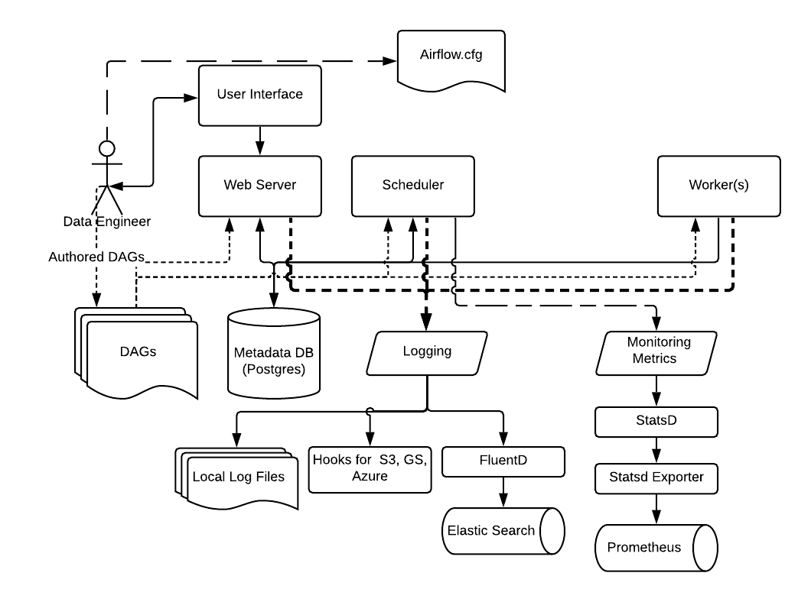

 .. Licensed to the Apache Software Foundation (ASF) under one
    or more contributor license agreements.  See the NOTICE file
    distributed with this work for additional information
    regarding copyright ownership.  The ASF licenses this file
    to you under the Apache License, Version 2.0 (the
    "License"); you may not use this file except in compliance
    with the License.  You may obtain a copy of the License at

 ..   http://www.apache.org/licenses/LICENSE-2.0

 .. Unless required by applicable law or agreed to in writing,
    software distributed under the License is distributed on an
    "AS IS" BASIS, WITHOUT WARRANTIES OR CONDITIONS OF ANY
    KIND, either express or implied.  See the License for the
    specific language governing permissions and limitations
    under the License.

Logging and Monitoring architecture
===================================

Airflow supports a variety of logging and monitoring mechanisms as shown below.

By default, Airflow supports logging into the local file system. These include logs from the Web server, the Scheduler, and the Workers running tasks. This is suitable for development environments and for quick debugging.

For cloud deployments, Airflow also has task handlers contributed by the Community for
logging to cloud storage such as AWS, Google Cloud, and Azure.

The logging settings and options can be specified in the Airflow Configuration file,
which as usual needs to be available to all the Airflow process: Web server, Scheduler, and Workers.

Default Airflow loggers
-----------------------

Airflow uses Python's standard logging framework, and most loggers follow the
Python package and module naming convention. A few logger names are useful to
know when reading logs or customizing logging behavior:

* ``root``: the root Python logger. During task execution, Airflow configures
  the root logger so standard Python loggers that propagate to it can write to
  the task log.
* ``airflow.task``: the parent logger for task logs. Operators and hooks use
  child loggers under this namespace, such as ``airflow.task.operators`` and
  ``airflow.task.hooks``.
* ``airflow.processor``: used by Dag file processing code, including messages
  emitted while parsing Dag files.
* ``airflow.processor_manager``: used by the scheduler's Dag processor manager
  to report Dag processing activity.
* ``flask_appbuilder``: used by Flask-AppBuilder in the webserver. Airflow's
  default logging configuration keeps this logger less verbose than Airflow's
  own component loggers.

Task logs are configured separately from other component logs because they must
be grouped by task instance and made available in the Airflow UI. For task log
file layout and remote task logging settings, see
:doc:`/administration-and-deployment/logging-monitoring/logging-tasks`.

For custom handlers, custom logger levels, or per-operator and per-task logger
configuration, see
:doc:`/administration-and-deployment/logging-monitoring/advanced-logging-configuration`.

You can customize the logging settings for each of the Airflow components by specifying the logging settings
in the Airflow Configuration file, or for advanced configuration by using
:doc:`advanced features </administration-and-deployment/logging-monitoring/advanced-logging-configuration>`.

For production deployments, we recommend using FluentD to capture logs and send it to destinations such as ElasticSearch or Splunk.

.. note::
    For more information on configuring logging, see :doc:`/administration-and-deployment/logging-monitoring/logging-tasks`

Similarly, we recommend using StatsD for gathering metrics from Airflow and send them to destinations such as Prometheus.

.. note::
    For more information on configuring metrics, see :doc:`/administration-and-deployment/logging-monitoring/metrics`
