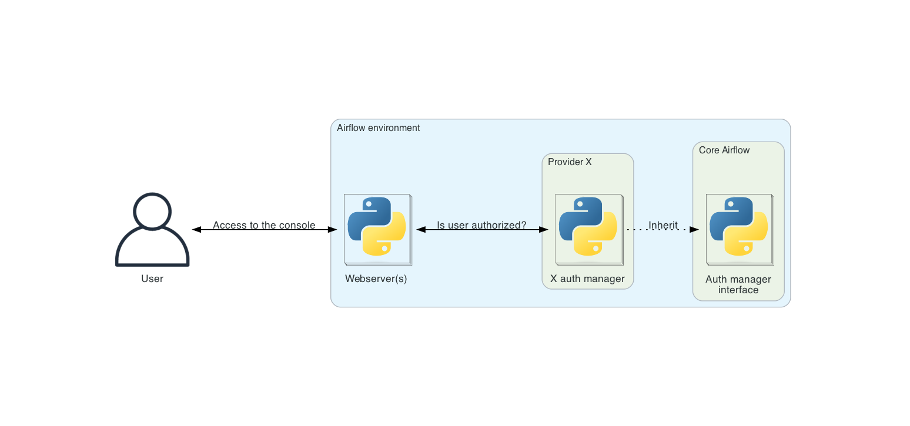

 .. Licensed to the Apache Software Foundation (ASF) under one
    or more contributor license agreements.  See the NOTICE file
    distributed with this work for additional information
    regarding copyright ownership.  The ASF licenses this file
    to you under the Apache License, Version 2.0 (the
    "License"); you may not use this file except in compliance
    with the License.  You may obtain a copy of the License at

 ..   http://www.apache.org/licenses/LICENSE-2.0

 .. Unless required by applicable law or agreed to in writing,
    software distributed under the License is distributed on an
    "AS IS" BASIS, WITHOUT WARRANTIES OR CONDITIONS OF ANY
    KIND, either express or implied.  See the License for the
    specific language governing permissions and limitations
    under the License.

Auth manager
============

Auth (for authentication/authorization) manager is the component in Airflow to handle user authentication and user authorization. They have a common
API and are "pluggable", meaning you can swap auth managers based on your installation needs.

Airflow can only have one auth manager configured at a time; this is set by the ``auth_manager`` option in the
``[core]`` section of :doc:`the configuration file </howto/set-config>`.

.. note::
    For more information on Airflow's configuration, see :doc:`/howto/set-config`.

If you want to check which auth manager is currently set, you can use the
``airflow config get-value core auth_manager`` command:

.. code-block:: bash

    $ airflow config get-value core auth_manager
    airflow.providers.fab.auth_manager.fab_auth_manager.FabAuthManager

.. toctree::
    :hidden:

    simple/index

Available auth managers to use
------------------------------

Here is the list of auth managers available today that you can use in your Airflow environment.

Provided by Airflow:

* :doc:`simple/index`

Provided by providers. The list of supported auth managers is available in :doc:`apache-airflow-providers:core-extensions/auth-managers`.

Why pluggable auth managers?
----------------------------

Airflow is used by a lot of different users with a lot of different configurations. Some Airflow environment might be
used by only one user and some might be used by thousand of users. An Airflow environment with only one (or very few)
users does not need the same user management as an environment used by thousand of them.

This is why the whole user management (user authentication and user authorization) is packaged in one component
called auth manager. So that it is easy to plug-and-play an auth manager that suits your specific needs.

By default, Airflow comes with the :doc:`simple/index`.

.. note::
    Switching to a different auth manager is a heavy operation and should be considered as such. It will
    impact users of the environment. The sign-in and sign-off experience will very likely change and disturb them if
    they are not advised. Plus, all current users and permissions will have to be copied over from the previous auth
    manager to the next.

Writing your own auth manager
-----------------------------

All Airflow auth managers implement a common interface so that they are pluggable and any auth manager has access
to all abilities and integrations within Airflow. This interface is used across Airflow to perform all user
authentication and user authorization related operation.

The public interface is :class:`~airflow.api_fastapi.auth.managers.base_auth_manager.BaseAuthManager`.
You can look through the code for the most detailed and up to date interface, but some important highlights are
outlined below.

.. note::
    For more information about Airflow's public interface see :doc:`/public-airflow-interface`.

Some reasons you may want to write a custom auth manager include:

* An auth manager does not exist which fits your specific use case, such as a specific tool or service for user management.
* You'd like to use an auth manager that leverages an identity provider from your preferred cloud provider.
* You have a private user management tool that is only available to you or your organization.

User representation
^^^^^^^^^^^^^^^^^^^

:class:`~airflow.api_fastapi.auth.managers.base_auth_manager.BaseAuthManager` defines an authentication manager,
parameterized by a user class T representing the authenticated user type.
Auth manager implementations (subclasses of :class:`~airflow.api_fastapi.auth.managers.base_auth_manager.BaseAuthManager`)
should specify the associated concrete user type. Each auth manager has its own user type definition.
Concrete user types should be subclass of :class:`~airflow.api_fastapi.auth.managers.models.base_user.BaseUser`.

Authentication related methods
^^^^^^^^^^^^^^^^^^^^^^^^^^^^^^

* ``get_url_login``: Return the URL the user is redirected to for signing in.
* ``get_url_logout``: Return the URL the user is redirected to when logging out. This is an optional method,
  this redirection is usually needed to invalidate resources when logging out, such as a session.
* ``serialize_user``: Serialize a user instance to a dict. This dict is the actual content of the JWT token.
  It should contain all the information needed to identify the user and make an authorization request.
* ``deserialize_user``: Create a user instance from a dict. The dict is the payload of the JWT token.
  This is the same dict returned by ``serialize_user``.

Authorization related methods
^^^^^^^^^^^^^^^^^^^^^^^^^^^^^

Most of authorization methods in :class:`~airflow.api_fastapi.auth.managers.base_auth_manager.BaseAuthManager` look the same.
Let's go over the different parameters used by most of these methods.

* ``method``: Use HTTP method naming to determine the type of action being done on a specific resource.

  * ``GET``: Can the user read the resource?
  * ``POST``: Can the user create a resource?
  * ``PUT``: Can the user modify the resource?
  * ``DELETE``: Can the user delete the resource?

* ``details``: Optional details about the resource being accessed.
* ``user``: The user trying to access the resource.

These authorization methods are:

* ``is_authorized_configuration``: Return whether the user is authorized to access Airflow configuration. Some details about the configuration can be provided (e.g. the config section).
* ``is_authorized_connection``: Return whether the user is authorized to access Airflow connections. Some details about the connection can be provided (e.g. the connection ID).
* ``is_authorized_dag``: Return whether the user is authorized to access a Dag. Some details about the Dag can be provided (e.g. the Dag ID).
  Also, ``is_authorized_dag`` is called for any entity related to Dags (e.g. task instances, Dag runs, ...). This information is passed in ``access_entity``.
  Example: ``auth_manager.is_authorized_dag(method="GET", access_entity=DagAccessEntity.Run, details=DagDetails(id="dag-1"))`` asks
  whether the user has permission to read the Dag runs of the Dag "dag-1".
* ``is_authorized_backfill``: Return whether the user is authorized to access Airflow backfills. Some details about the backfill can be provided (e.g. the backfill ID).
* ``is_authorized_asset``: Return whether the user is authorized to access Airflow assets. Some details about the asset can be provided (e.g. the asset ID).
* ``is_authorized_asset_alias``: Return whether the user is authorized to access Airflow asset aliases. Some details about the asset alias can be provided (e.g. the asset alias ID).
* ``is_authorized_pool``: Return whether the user is authorized to access Airflow pools. Some details about the pool can be provided (e.g. the pool name).
* ``is_authorized_variable``: Return whether the user is authorized to access Airflow variables. Some details about the variable can be provided (e.g. the variable key).
* ``is_authorized_view``: Return whether the user is authorized to access a specific view in Airflow. The view is specified through ``access_view`` (e.g. ``AccessView.CLUSTER_ACTIVITY``).
* ``is_authorized_custom_view``: Return whether the user is authorized to access a specific view not defined in Airflow. This view can be provided by the auth manager itself or a plugin defined by the user.
* ``filter_authorized_menu_items``: Given the list of menu items in the UI, return the list of menu items the user has access to.

It should be noted that the ``method`` parameter listed above may only have relevance for a specific subset of the auth manager's authorization methods.
For example, the ``configuration`` resource is by definition read-only, so only the ``GET`` parameter is relevant in the context of ``is_authorized_configuration``.

JWT token management by auth managers
^^^^^^^^^^^^^^^^^^^^^^^^^^^^^^^^^^^^^
The auth manager is responsible for creating the JWT token needed to interact with Airflow public API.
To achieve this, the auth manager **must** provide an endpoint to create this JWT token. This endpoint is usually
available at ``POST /auth/token``.
Please double check the auth manager documentation to find the accurate token generation endpoint.

The auth manager is also responsible for passing the JWT token to the Airflow UI. The protocol to exchange the JWT
token between the auth manager and Airflow UI is using cookies. The auth manager needs to save the JWT token in a
cookie named ``_token`` before redirecting to the Airflow UI. The Airflow UI will then read the cookie, save it, and delete it.

.. code-block:: python

    from airflow.api_fastapi.auth.managers.base_auth_manager import COOKIE_NAME_JWT_TOKEN

    response = RedirectResponse(url="/")

    secure = request.base_url.scheme == "https" or bool(conf.get("api", "ssl_cert", fallback=""))
    response.set_cookie(COOKIE_NAME_JWT_TOKEN, token, secure=secure, httponly=True)
    return response

.. note::
  Ensure that the cookie parameter ``httponly`` is set to ``True``. The UI does not manage the token.

Refreshing JWT Token
''''''''''''''''''''
Refreshing token is optional feature and its availability depends on the specific implementation of the auth manager.
The auth manager is responsible for refreshing the JWT token when it expires.
The Airflow API uses middleware that intercepts every request and checks the validity of the JWT token.
Token communication is handled through ``httponly`` cookies to improve security.
When the token expires, the `JWTRefreshMiddleware <https://github.com/apache/airflow/blob/3.1.5/airflow-core/src/airflow/api_fastapi/auth/middlewares/refresh_token.py>`_ middleware calls the auth manager's ``refresh_user`` method to obtain a new token.

To support token refresh operations, the auth manager must implement the ``refresh_user`` method.
This method receives an expired token and must return a new valid token.
User information is extracted from the expired token and used to generate a fresh token.

An example implementation of ``refresh_user`` could be:
`KeycloakAuthManager::refresh_user <https://github.com/apache/airflow/blob/3.1.5/providers/keycloak/src/airflow/providers/keycloak/auth_manager/keycloak_auth_manager.py#L113-L121>`_
User information is derived from the ``BaseUser`` instance.
It is important that the user object contains all the fields required to refresh the token. An example user class could be:
`KeycloakAuthManagerUser(BaseUser) <https://github.com/apache/airflow/blob/3.1.5/providers/keycloak/src/airflow/providers/keycloak/auth_manager/user.pys>`_.

Optional methods recommended to override for optimization
^^^^^^^^^^^^^^^^^^^^^^^^^^^^^^^^^^^^^^^^^^^^^^^^^^^^^^^^^

The following methods aren't required to override to have a functional Airflow auth manager. However, it is recommended to override these to make your auth manager faster (and potentially less costly):

* ``batch_is_authorized_connection``: Batch version of ``is_authorized_connection``. If not overridden, it calls ``is_authorized_connection`` for every single item.
* ``batch_is_authorized_dag``: Batch version of ``is_authorized_dag``. If not overridden, it calls ``is_authorized_dag`` for every single item.
* ``batch_is_authorized_pool``: Batch version of ``is_authorized_pool``. If not overridden, it calls ``is_authorized_pool`` for every single item.
* ``batch_is_authorized_variable``: Batch version of ``is_authorized_variable``. If not overridden, it calls ``is_authorized_variable`` for every single item.
* ``filter_authorized_connections``: Given a list of connection IDs (``conn_id``), return the list of connection IDs the user has access to.  If not overridden, it calls ``is_authorized_connection`` for every single connection passed as parameter.
* ``filter_authorized_dag_ids``: Given a list of Dag IDs, return the list of Dag IDs the user has access to.  If not overridden, it calls ``is_authorized_dag`` for every single Dag passes as parameter.
* ``filter_authorized_pools``: Given a list of pool names, return the list of pool names the user has access to.  If not overridden, it calls ``is_authorized_pool`` for every single pool passed as parameter.
* ``filter_authorized_variables``: Given a list of variable keys, return the list of variable keys the user has access to.  If not overridden, it calls ``is_authorized_variable`` for every single variable passed as parameter.

CLI
^^^

Auth managers may vend CLI commands which will be included in the ``airflow`` command line tool by implementing the ``get_cli_commands`` method. The commands can be used to setup required resources. Commands are only vended for the currently configured auth manager. A pseudo-code example of implementing CLI command vending from an auth manager can be seen below:

.. code-block:: python

    @staticmethod
    def get_cli_commands() -> list[CLICommand]:
        sub_commands = [
            ActionCommand(
                name="command_name",
                help="Description of what this specific command does",
                func=lazy_load_command("path.to.python.function.for.command"),
                args=(),
            ),
        ]

        return [
            GroupCommand(
                name="my_cool_auth_manager",
                help="Description of what this group of commands do",
                subcommands=sub_commands,
            ),
        ]

.. note::
    Currently there are no strict rules in place for the Airflow command namespace. It is up to developers to use names for their CLI commands that are sufficiently unique so as to not cause conflicts with other Airflow components.

.. note::
    When creating a new auth manager, or updating any existing auth manager, be sure to not import or execute any expensive operations/code at the module level. Auth manager classes are imported in several places and if they are slow to import this will negatively impact the performance of your Airflow environment, especially for CLI commands.

Extending API server application
^^^^^^^^^^^^^^^^^^^^^^^^^^^^^^^^

Auth managers have the option to extend the Airflow API server. Doing so, allow, for instance, to vend additional public API endpoints.
To extend the API server application, you need to implement the ``get_fastapi_app`` method.
Such additional endpoints can be used to manage resources such as users, groups, roles (if any) handled by your auth manager.
Endpoints defined by ``get_fastapi_app`` are mounted in ``/auth``.

Other optional methods
^^^^^^^^^^^^^^^^^^^^^^

* ``init``: This method is executed when Airflow is initializing.
  Override this method if you need to make any action (e.g. create resources, API call) that the auth manager needs.
* ``get_extra_menu_items``: Provide additional links to be added to the menu in the UI.
* ``get_db_manager``: If your auth manager requires one or several database managers (see :class:`~airflow.utils.db_manager.BaseDBManager`),
  their class paths need to be returned as part of this method. By doing so, they will be automatically added to the
  config ``[database] external_db_managers``.

Additional Caveats
^^^^^^^^^^^^^^^^^^

* Your auth manager should not reference anything from the ``airflow.security.permissions`` module, as that module is in the process of being deprecated.
  Instead, your code should use the definitions in ``airflow.api_fastapi.auth.managers.models.resource_details``. For more details on the ``airflow.security.permissions`` deprecation, see :doc:`/security/deprecated_permissions`
* The ``access_control`` attribute of a Dag instance is only compatible with the FAB auth manager. Custom auth manager implementations should leverage ``get_authorized_dag_ids`` for Dag instance attribute-based access controls in more customizable ways (e.g. authorization based on Dag tags, Dag bundles, etc.).
* You may find it useful to define a private, generalized ``_is_authorized`` method which acts as the standardized authorization mechanism, and which each
  public ``is_authorized_*`` method calls with the appropriate parameters.
  For concrete examples of this, refer to the ``SimpleAuthManager._is_authorized_method``. Further, it may be useful to optionally use the ``airflow.api_fastapi.auth.managers.base_auth_manager.ExtendedResourceMethod`` reference within your private method.

Dag and Dag Sub-Component Authorization
---------------------------------------

Given the hierarchical structure of Dags and their composite resources, the auth manager's ``is_authorized_dag`` method should also handle the authorization logic for Dag runs, tasks, and task instances.
The ``access_entity`` parameter passed to ``is_authorized_dag`` indicates which (if any) Dag sub-component the user is attempting to access. This leads to a few important points:

* If the ``access_entity`` parameter is ``None``, then the user is attempting to interact directly with the Dag, not any of its sub-components.
* When the ``access_entity`` parameter is not ``None``, it means the user is attempting to access some sub-component of the Dag. This is noteworthy, as in some cases the ``method`` parameter may be valid
  for the Dag's sub-entity, but not a valid action directly on the Dag itself. For example, the ``POST`` method is valid for Dag runs, but **not** for Dags.
* One potential way to model the example request mentioned above -- where the ``method`` only has meaning for the Dag sub-component -- is to authorize the user if **both** statements are true:

  * The user has ``PUT`` ("edit") permissions for the given Dag.
  * The user has ``POST`` ("create") permissions for Dag runs.

Next Steps
----------

Once you have created a new auth manager class implementing the :class:`~airflow.api_fastapi.auth.managers.base_auth_manager.BaseAuthManager` interface, you can configure Airflow to use it by setting the ``core.auth_manager`` configuration value to the module path of your auth manager:

.. code-block:: ini

    [core]
    auth_manager = my_company.auth_managers.MyCustomAuthManager

.. note::
    For more information on Airflow's configuration, see :doc:`/howto/set-config` and for more information on managing Python modules in Airflow see :doc:`/administration-and-deployment/modules_management`.
