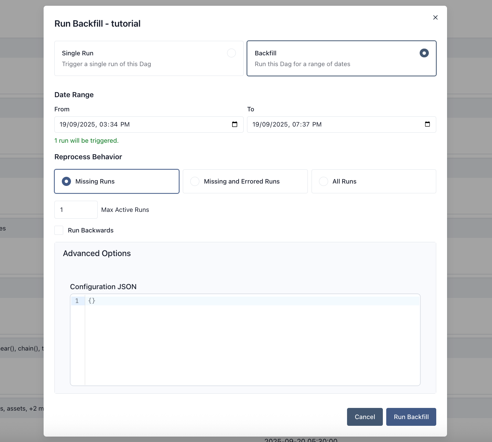
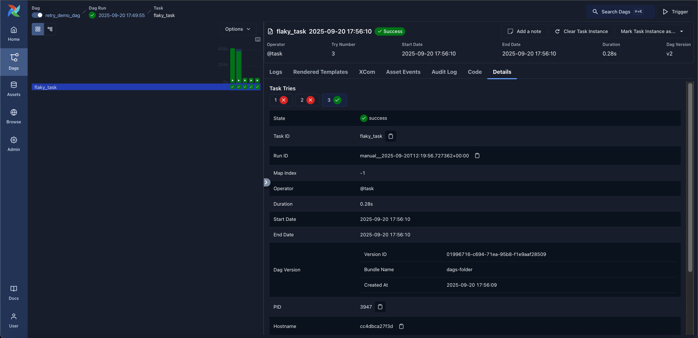
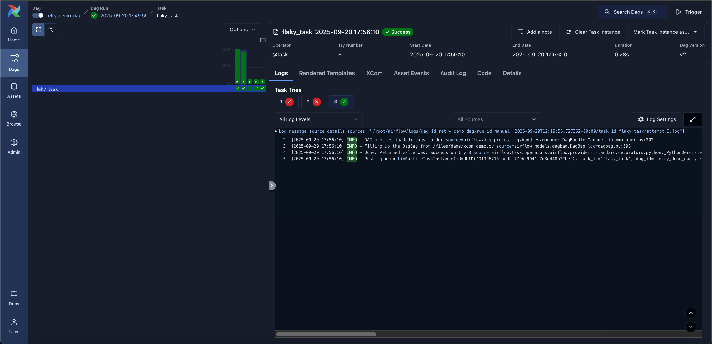

 .. Licensed to the Apache Software Foundation (ASF) under one
    or more contributor license agreements.  See the NOTICE file
    distributed with this work for additional information
    regarding copyright ownership.  The ASF licenses this file
    to you under the Apache License, Version 2.0 (the
    "License"); you may not use this file except in compliance
    with the License.  You may obtain a copy of the License at

 ..   http://www.apache.org/licenses/LICENSE-2.0

 .. Unless required by applicable law or agreed to in writing,
    software distributed under the License is distributed on an
    "AS IS" BASIS, WITHOUT WARRANTIES OR CONDITIONS OF ANY
    KIND, either express or implied.  See the License for the
    specific language governing permissions and limitations
    under the License.

Dag Runs
=========
A Dag Run is an object representing an instantiation of the Dag in time.
Any time the Dag is executed, a Dag Run is created and all tasks inside it are executed. The status of the Dag Run depends on the tasks states.
Each Dag Run is run separately from one another, meaning that you can have many runs of a Dag at the same time.

.. _dag-run:dag-run-status:

Dag Run Status
''''''''''''''

A Dag Run status is determined when the execution of the Dag is finished.
The execution of the Dag depends on its containing tasks and their dependencies.
The status is assigned to the Dag Run when all of the tasks are in the one of the terminal states (i.e. if there is no possible transition to another state) like ``success``, ``failed`` or ``skipped``.
The Dag Run is having the status assigned based on the so-called "leaf nodes" or simply "leaves". Leaf nodes are the tasks with no children.

There are two possible terminal states for the Dag Run:

- ``success`` if all of the leaf nodes states are either ``success`` or ``skipped``,
- ``failed`` if any of the leaf nodes state is either ``failed`` or ``upstream_failed``.

.. note::
    Be careful if some of your tasks have defined some specific :ref:`trigger rule <concepts:trigger-rules>`.
    These can lead to some unexpected behavior, e.g. if you have a leaf task with trigger rule `"all_done"`, it will be executed regardless of the states of the rest of the tasks and if it will succeed, then the whole Dag Run will also be marked as ``success``, even if something failed in the middle.

*Added in Airflow 2.7*

Dags that have a currently running Dag run can be shown on the UI dashboard in the "Running" tab. Similarly, Dags whose latest Dag run is marked as failed can be found on the "Failed" tab.

.. _data-interval:

Data Interval
-------------

Each Dag run in Airflow has an assigned "data interval" that represents the time
range it operates in. For a Dag scheduled with ``@daily``, for example, each of
its data interval would start each day at midnight (00:00) and end at midnight
(24:00).

A Dag run is usually scheduled *after* its associated data interval has ended,
to ensure the run is able to collect all the data within the time period. In
other words, a run covering the data period of 2020-01-01 generally does not
start to run until 2020-01-01 has ended, i.e. after 2020-01-02 00:00:00.

All dates in Airflow are tied to the data interval concept in some way. The
"logical date" (also called ``execution_date`` in Airflow versions prior to 2.2)
of a Dag run, for example, denotes the start of the data interval, not when the
Dag is actually executed.

Similarly, since the ``start_date`` argument for the Dag and its tasks points to
the same logical date, it marks the start of *the Dag's first data interval*, not
when tasks in the Dag will start running. In other words, a Dag run will only be
scheduled one interval after ``start_date``.

.. tip::

    If a cron expression or timedelta object is not enough to express your Dag's schedule,
    logical date, or data interval, see :doc:`../authoring-and-scheduling/timetable`.
    For more information on ``logical date``, see :ref:`concepts-dag-run` and
    :ref:`faq:what-does-execution-date-mean`

Re-run Dag
''''''''''
There can be cases where you will want to execute your Dag again. One such case is when the scheduled
Dag run fails.

.. _dag-catchup:

Catchup
-------

An Airflow Dag defined with a ``start_date``, possibly an ``end_date``, and a non-asset schedule, defines a series of intervals which the scheduler turns into individual Dag runs and executes.
By default, Dag runs that have not been run since the last data interval are not created by the scheduler upon activation of a Dag ( Airflow config ``scheduler.catchup_by_default=False``). The scheduler creates a Dag run only for the latest interval.

If you set ``catchup=True`` in the Dag, the scheduler will kick off a Dag Run for any data interval that has not been run since the last data interval (or has been cleared). This concept is called Catchup.

If your Dag is not written to handle its catchup (i.e., not limited to the interval, but instead to ``Now`` for instance.),
then you will want to turn catchup off, which is the default setting or can be done explicitly by setting ``catchup=False`` in the Dag definition, if the default config has been changed for your Airflow environment.

.. code-block:: python

    """
    Code that goes along with the Airflow tutorial located at:
    https://github.com/apache/airflow/blob/main/airflow/example_dags/tutorial.py
    """

    from airflow.sdk import DAG
    from airflow.providers.standard.operators.bash import BashOperator

    import datetime
    import pendulum

    dag = DAG(
        "tutorial",
        default_args={
            "depends_on_past": True,
            "retries": 1,
            "retry_delay": datetime.timedelta(minutes=3),
        },
        start_date=pendulum.datetime(2015, 12, 1, tz="UTC"),
        description="A simple tutorial Dag",
        schedule="@daily",
    )

In the example above, if the Dag is picked up by the scheduler daemon on
2016-01-02 at 6 AM, (or from the command line), a single Dag Run will be created
with a data between 2016-01-01 and 2016-01-02, and the next one will be created
just after midnight on the morning of 2016-01-03 with a data interval between
2016-01-02 and 2016-01-03.

Be aware that using a ``datetime.timedelta`` object as schedule can lead to a different behavior.
In such a case, the single Dag Run created will cover data between 2016-01-01 06:00 and
2016-01-02 06:00 (one schedule interval ending now). For a more detailed description of the
differences between a cron and a delta based schedule, take a look at the
:ref:`timetables comparison <Differences between the cron and delta data interval timetables>`

If the ``dag.catchup`` value had been ``True`` instead, the scheduler would have created a Dag Run
for each completed interval between 2015-12-01 and 2016-01-02 (but not yet one for 2016-01-02,
as that interval hasn't completed) and the scheduler will execute them sequentially.

Catchup is also triggered when you turn off a Dag for a specified period and then re-enable it.

This behavior is great for atomic assets that can easily be split into periods. Leaving catchup off is great
if your Dag performs catchup internally.

Backfill
--------
You may want to run the Dag for a specified historical period. For example,
a Dag is created with ``start_date`` **2024-11-21**, but another user requires
the output data from a month prior, i.e. **2024-10-21**.
This process is known as Backfill.

This can be done through either the UI or CLI.

UI
''
From the Dag Details page, click **Trigger** and select **Backfill** to open the backfill form. Set the date range, reprocess
behavior, max active runs, optional backwards ordering, and Advanced Config.

CLI
'''
For CLI usage, run the command below:

.. code-block:: bash

    airflow backfill create --dag-id DAG_ID \
        --start-date START_DATE \
        --end-date END_DATE \
        --reprocessing-behavior failed \
        --max-active-runs 3 \
        --run-backwards \
        --dag-run-conf '{"my": "param"}'

The `backfill command <../cli-and-env-variables-ref.html#backfill>`_ will
re-run all the instances of the dag_id for all the intervals within the start
date and end date.

Re-run Tasks
------------
Some of the tasks can fail during the scheduled run. Once you have fixed
the errors after going through the logs, you can re-run the tasks by clearing them for the
scheduled date. Clearing a task instance creates a record of the task instance.
The ``try_number`` of the current task instance is incremented, the ``max_tries`` set to ``0`` and the state set to ``None``, which causes the task to re-run.

An experimental feature in Airflow 3.1.0 allows you to clear the task instances and re-run with the latest bundle version.

Click on the failed task in the Tree or Graph views and then click on **Clear**.
The executor will re-run it.

There are multiple options you can select to re-run -

* **Past** - All the instances of the task in the runs before the Dag's most recent data interval
* **Future** -  All the instances of the task in the runs after the Dag's most recent data interval
* **Upstream** - The upstream tasks in the current Dag
* **Downstream** - The downstream tasks in the current Dag
* **Recursive** - All the tasks in the child Dags and parent Dags
* **Failed** - Only the failed tasks in the Dag's most recent run

You can also clear the task through CLI using the command:

.. code-block:: bash

    airflow tasks clear dag_id \
        --task-regex task_regex \
        --start-date START_DATE \
        --end-date END_DATE

For the specified ``dag_id`` and time interval, the command clears all instances of the tasks matching the regex.
For more options, you can check the help of the `clear command <../cli-and-env-variables-ref.html#clear>`_ :

.. code-block:: bash

    airflow tasks clear --help

Task Instance History
---------------------
When a task instance retries or is cleared, the task instance history is preserved. You can see this history by clicking on the task instance in the Grid view.

.. note::
    The try selector shown above is only available for tasks that have been retried or cleared.

The history shows the value of the task instance attributes at the end of the particular run. On the log page, you can also see the logs for each of the task instance tries.
This can be useful for debugging.

.. note::
    Related task instance objects like the XComs, rendered template fields, etc., are not preserved in the history. Only the task instance attributes, including the logs, are preserved.

External Triggers
'''''''''''''''''

Note that Dag Runs can also be created manually through the CLI. Just run the command -

.. code-block:: bash

    airflow dags trigger --logical-date logical_date run_id

The Dag Runs created externally to the scheduler get associated with the trigger's timestamp and are displayed
in the UI alongside scheduled Dag runs. The logical date passed inside the Dag can be specified using the ``-e`` argument.
The default is the current date in the UTC timezone.

In addition, you can also manually trigger a Dag Run using the web UI (tab **Dags** -> column **Links** -> button **Trigger Dag**)

.. _dagrun:parameters:

Passing Parameters when triggering Dags
---------------------------------------

When triggering a Dag from the CLI, the REST API or the UI, it is possible to pass configuration for a Dag Run as
a JSON blob.

Example of a parameterized Dag:

.. code-block:: python

    import pendulum

    from airflow.sdk import DAG
    from airflow.providers.standard.operators.bash import BashOperator

    dag = DAG(
        "example_parameterized_dag",
        schedule=None,
        start_date=pendulum.datetime(2021, 1, 1, tz="UTC"),
        catchup=False,
    )

    parameterized_task = BashOperator(
        task_id="parameterized_task",
        bash_command="echo value: {{ dag_run.conf['conf1'] }}",
        dag=dag,
    )

**Note**: The parameters from ``dag_run.conf`` can only be used in a template field of an operator.

Wait for a Dag Run
------------------

Airflow provides an experimental API to **wait for a Dag run to complete**. This is particularly useful when integrating Airflow into external systems or automation pipelines that need to pause execution until a Dag finishes.

The endpoint blocks (by polling) until the specified Dag run reaches a terminal state: ``success``, ``failed``, or ``canceled``.

This endpoint streams responses using the **NDJSON (Newline-Delimited JSON)** format. Each line in the response is a JSON object representing the state of the Dag run at that moment.

For example:

.. code-block:: none

   {"state": "running"}
   {"state": "success", "results": {"op": 42}}

This allows clients to monitor the run in real time and optionally collect XCom results from specific tasks.

.. note::

   This feature is **experimental** and may change or be removed in future Airflow versions.

Using CLI
^^^^^^^^^^^

.. code-block:: bash

    airflow dags trigger --conf '{"conf1": "value1"}' example_parameterized_dag

To Keep in Mind
''''''''''''''''
* Marking task instances as failed can be done through the UI. This can be used to stop running task instances.
* Marking task instances as successful can be done through the UI. This is mostly to fix false negatives, or
  for instance, when the fix has been applied outside of Airflow.
