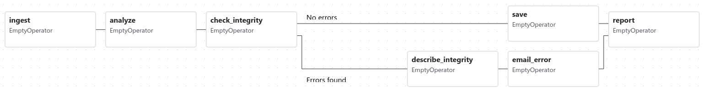
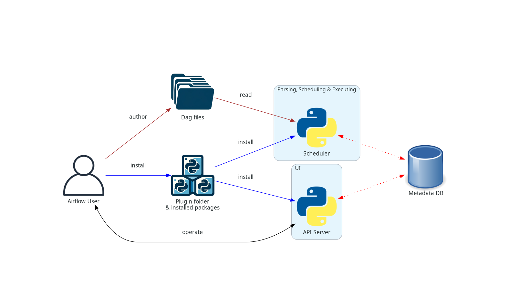
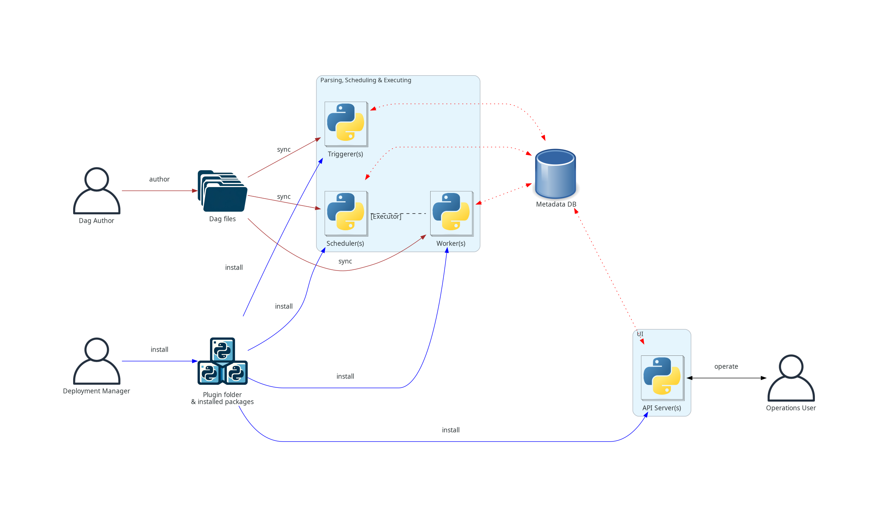
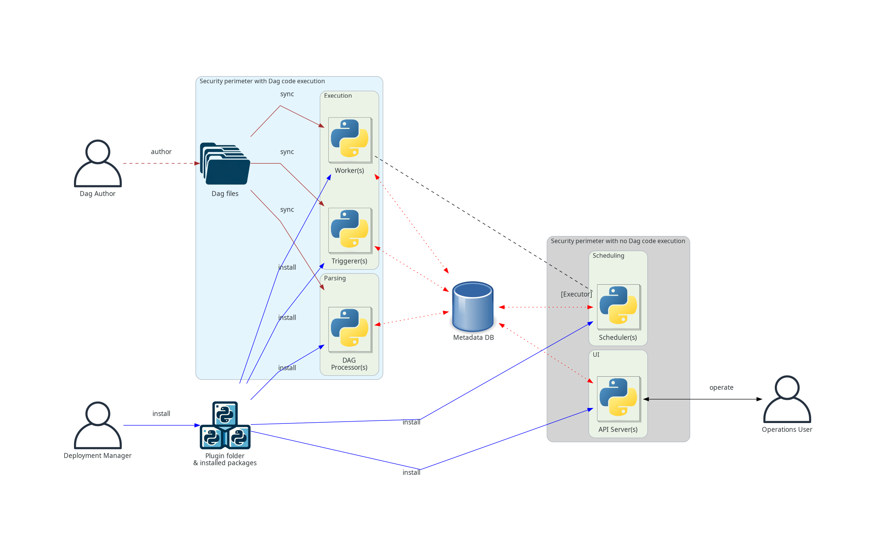
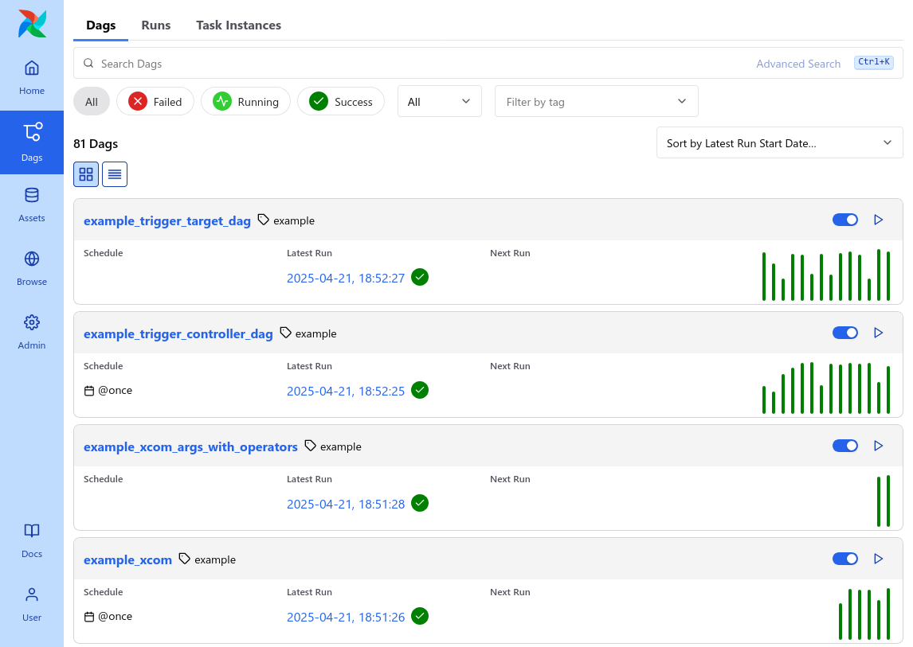

 .. Licensed to the Apache Software Foundation (ASF) under one
    or more contributor license agreements.  See the NOTICE file
    distributed with this work for additional information
    regarding copyright ownership.  The ASF licenses this file
    to you under the Apache License, Version 2.0 (the
    "License"); you may not use this file except in compliance
    with the License.  You may obtain a copy of the License at

 ..   http://www.apache.org/licenses/LICENSE-2.0

 .. Unless required by applicable law or agreed to in writing,
    software distributed under the License is distributed on an
    "AS IS" BASIS, WITHOUT WARRANTIES OR CONDITIONS OF ANY
    KIND, either express or implied.  See the License for the
    specific language governing permissions and limitations
    under the License.

Architecture Overview
=====================

Airflow is a platform that lets you build and run *workflows*. A workflow is represented as a
:doc:`Dag <dags>` (a Directed Acyclic Graph), and contains individual pieces of work called
:doc:`tasks`, arranged with dependencies and data flows taken into account.

A Dag specifies the dependencies between tasks, which defines the order in which to execute the tasks.
Tasks describe what to do, be it fetching data, running analysis, triggering other systems, or more.

Airflow itself is agnostic to what you're running - it will happily orchestrate and run anything,
either with high-level support from one of our providers, or directly as a command using the shell
or Python :doc:`operators`.

Airflow components
------------------

Airflow's architecture consists of multiple components. The following sections describe each component's
function and whether they're required for a bare-minimum Airflow installation, or an optional component
to achieve better Airflow extensibility, performance, and scalability.

Required components
...................

A minimal Airflow installation consists of the following components:

* A :doc:`scheduler <../administration-and-deployment/scheduler>`, which handles both triggering scheduled
  workflows, and submitting :doc:`tasks` to the executor to run. The :doc:`executor <executor/index>`, is
  a configuration property of the *scheduler*, not a separate component and runs within the scheduler
  process. There are several executors available out of the box, and you can also write your own.

* A *Dag processor*, which parses Dag files and serializes them into the
  *metadata database*. More about processing Dag files can be found in
  :doc:`/administration-and-deployment/dagfile-processing`

* A *webserver*, which presents a handy user interface to inspect, trigger and debug the behaviour of
  Dags and tasks.

* A folder of *Dag files*, which is read by the *scheduler* to figure out what tasks to run and when to
  run them.

* A *metadata database*, usually PostgreSQL or MySQL, which stores the state of tasks, Dags and variables.

  Setting up a metadata database is described in :doc:`/howto/set-up-database` and is required for
  Airflow to work.

Optional components
...................

Some Airflow components are optional and can enable better extensibility, scalability, and
performance in your Airflow:

* Optional *worker*, which executes the tasks given to it by the scheduler. In the basic installation
  worker might be part of the scheduler not a separate component. It can be run as a long running process
  in the :doc:`CeleryExecutor <apache-airflow-providers-celery:celery_executor>`, or as a POD in the
  :doc:`KubernetesExecutor <apache-airflow-providers-cncf-kubernetes:kubernetes_executor>`.

* Optional *triggerer*, which executes deferred tasks in an asyncio event loop. In basic installation
  where deferred tasks are not used, a triggerer is not necessary. More about deferring tasks can be
  found in :doc:`/authoring-and-scheduling/deferring`.

* Optional folder of *plugins*. Plugins are a way to extend Airflow's functionality (similar to installed
  packages). Plugins are read by the *scheduler*, *Dag processor*, *triggerer* and *webserver*. More about
  plugins can be found in :doc:`/administration-and-deployment/plugins`.

Deploying Airflow components
----------------------------

All the components are Python applications that can be deployed using various deployment mechanisms.

They can have extra *installed packages* installed in their Python environment. This is useful for example to
install custom operators or sensors or extend Airflow functionality with custom plugins.

While Airflow can be run in a single machine and with simple installation where only *scheduler* and
*webserver* are deployed, Airflow is designed to be scalable and secure, and is able to run in a distributed
environment - where various components can run on different machines, with different security perimeters
and can be scaled by running multiple instances of the components above.

The separation of components also allow for increased security, by isolating the components from each other
and by allowing to perform different tasks. For example separating *Dag processor* from *scheduler*
allows to make sure that the *scheduler* does not have access to the *Dag files* and cannot execute
code provided by *Dag author*.

Also while single person can run and manage Airflow installation, Airflow Deployment in more complex
setup can involve various roles of users that can interact with different parts of the system, which is
an important aspect of secure Airflow deployment. The roles are described in detail in the
:doc:`/security/security_model` and generally speaking include:

* Deployment Manager - a person that installs and configures Airflow and manages the deployment
* Dag author - a person that writes Dags and submits them to Airflow
* Operations User - a person that triggers Dags and tasks and monitors their execution

Architecture Diagrams
---------------------

The diagrams below show different ways to deploy Airflow - gradually from the simple "one machine" and
single person deployment, to a more complex deployment with separate components, separate user roles and
finally with more isolated security perimeters.

The meaning of the different connection types in the diagrams below is as follows:

* **brown solid lines** represent *Dag files* submission and synchronization
* **blue solid lines** represent deploying and accessing *installed packages* and *plugins*
* **black dashed lines** represent control flow of workers by the *scheduler* (via executor)
* **black solid lines** represent accessing the UI to manage execution of the workflows
* **red dashed lines** represent accessing the *metadata database* by all components

.. _overview-basic-airflow-architecture:

..
  TODO AIP-66 / AIP-72: These example architectures and diagrams need to be updated to reflect AF3 changes
  like bundles, required Dag processor, execution api, etc.

Basic Airflow deployment
........................

This is the simplest deployment of Airflow, usually operated and managed on a single
machine. Such a deployment usually uses the LocalExecutor, where the *scheduler* and the *workers* are in
the same Python process and the *Dag files* are read directly from the local filesystem by the *scheduler*.
The *webserver* runs on the same machine as the *scheduler*. There is no *triggerer* component, which
means that task deferral is not possible.

Such an installation typically does not separate user roles - deployment, configuration, operation, authoring
and maintenance are all done by the same person and there are no security perimeters between the components.

If you want to run Airflow on a single machine in a simple single-machine setup, you can skip the
more complex diagrams below and go straight to the :ref:`overview:workloads` section.

.. _overview-distributed-airflow-architecture:

Distributed Airflow architecture
................................

This is the architecture of Airflow where components of Airflow are distributed among multiple machines
and where various roles of users are introduced - *Deployment Manager*, **Dag author**,
**Operations User**. You can read more about those various roles in the :doc:`/security/security_model`.

In the case of a distributed deployment, it is important to consider the security aspects of the components.
The *webserver* does not have access to the *Dag files* directly. The code in the ``Code`` tab of the
UI is read from the *metadata database*. The *webserver* cannot execute any code submitted by the
**Dag author**. It can only execute code that is installed as an *installed package* or *plugin* by
the **Deployment Manager**. The **Operations User** only has access to the UI and can only trigger
Dags and tasks, but cannot author Dags.

The *Dag files* need to be synchronized between all the components that use them - *scheduler*,
*triggerer* and *workers*. The *Dag files* can be synchronized by various mechanisms - typical
ways how Dags can be synchronized are described in :doc:`helm-chart:manage-dag-files` of our
Helm Chart documentation. Helm chart is one of the ways how to deploy Airflow in K8S cluster.

.. _overview-separate-dag-processing-airflow-architecture:

Separate Dag processing architecture
....................................

In a more complex installation where security and isolation are important, you'll also see the
standalone *Dag processor* component that allows to separate *scheduler* from accessing *Dag files*.
This is suitable if the deployment focus is on isolation between parsed tasks. While Airflow does not yet
support full multi-tenant features, it can be used to make sure that **Dag author** provided code is never
executed in the context of the scheduler.

.. note::

    When Dag file is changed there can be cases where the scheduler and the worker will see different
    versions of the Dag until both components catch up. You can avoid the issue by making sure Dag is
    deactivated during deployment and reactivate once finished. If needed, the cadence of sync and scan
    of Dag folder can be configured. Please make sure you really know what you are doing if you change
    the configurations.

.. _overview:workloads:

Workloads
---------

A Dag runs through a series of :doc:`tasks`, and there are three common types of task you will see:

* :doc:`operators`, predefined tasks that you can string together quickly to build most parts of your Dags.

* :doc:`sensors`, a special subclass of Operators which are entirely about waiting for an external event to happen.

* A :doc:`taskflow`-decorated ``@task``, which is a custom Python function packaged up as a Task.

Internally, these are all actually subclasses of Airflow's ``BaseOperator``, and the concepts of Task and Operator are somewhat interchangeable, but it's useful to think of them as separate concepts - essentially, Operators and Sensors are *templates*, and when you call one in a Dag file, you're making a Task.

Control Flow
------------

:doc:`dags` are designed to be run many times, and multiple runs of them can happen in parallel. Dags are parameterized, always including an interval they are "running for" (the :ref:`data interval <data-interval>`), but with other optional parameters as well.

:doc:`tasks` have dependencies declared on each other. You'll see this in a Dag either using the ``>>`` and ``<<`` operators::

    first_task >> [second_task, third_task]
    fourth_task << third_task

Or, with the ``set_upstream`` and ``set_downstream`` methods::

    first_task.set_downstream([second_task, third_task])
    fourth_task.set_upstream(third_task)

These dependencies are what make up the "edges" of the graph, and how Airflow works out which order to run your tasks in. By default, a task will wait for all of its upstream tasks to succeed before it runs, but this can be customized using features like :ref:`Branching <concepts:branching>`, :ref:`LatestOnly <concepts:latest-only>`, and :ref:`Trigger Rules <concepts:trigger-rules>`.

To pass data between tasks you have three options:

* :doc:`xcoms` ("Cross-communications"), a system where you can have tasks push and pull small bits of metadata.

* Uploading and downloading large files from a storage service (either one you run, or part of a public cloud)

* TaskFlow API automatically passes data between tasks via implicit :doc:`xcoms`

Airflow sends out Tasks to run on Workers as space becomes available, so there's no guarantee all the tasks in your Dag will run on the same worker or the same machine.

As you build out your Dags, they are likely to get very complex, so Airflow provides several mechanisms for making this more sustainable, example :ref:`concepts:taskgroups` let you visually group tasks in the UI.

There are also features for letting you easily pre-configure access to a central resource, like a datastore, in the form of :doc:`../authoring-and-scheduling/connections`, and for limiting concurrency, via :doc:`../administration-and-deployment/pools`.

User interface
--------------

Airflow comes with a user interface that lets you see what Dags and their tasks are doing, trigger runs of Dags, view logs, and do some limited debugging and resolution of problems with your Dags.

It's generally the best way to see the status of your Airflow installation as a whole, as well as diving into individual Dags to see their layout, the status of each task, and the logs from each task.
