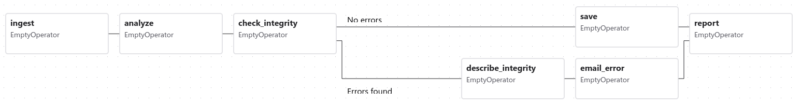
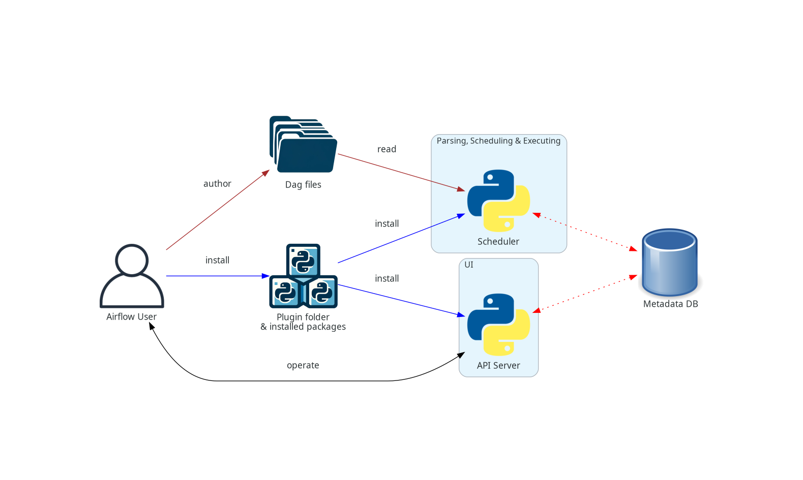
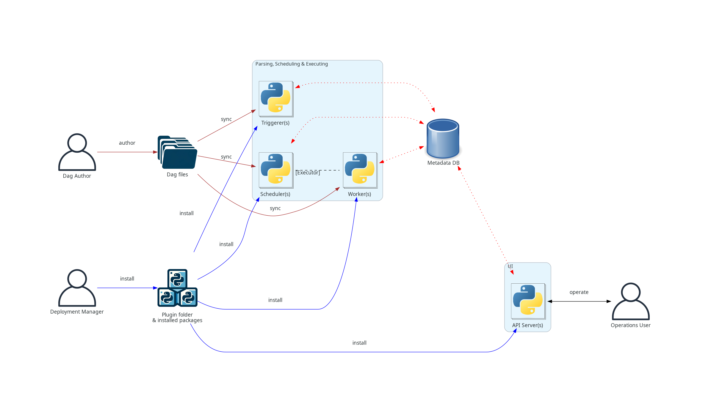
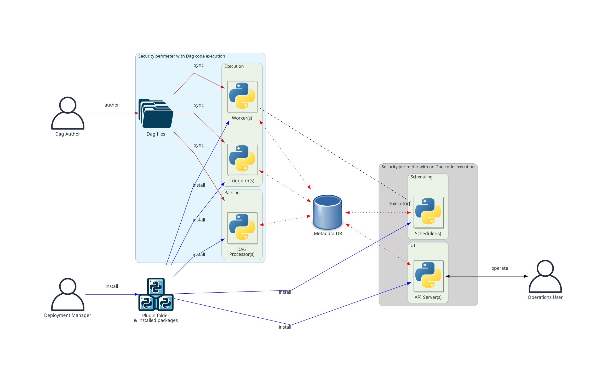
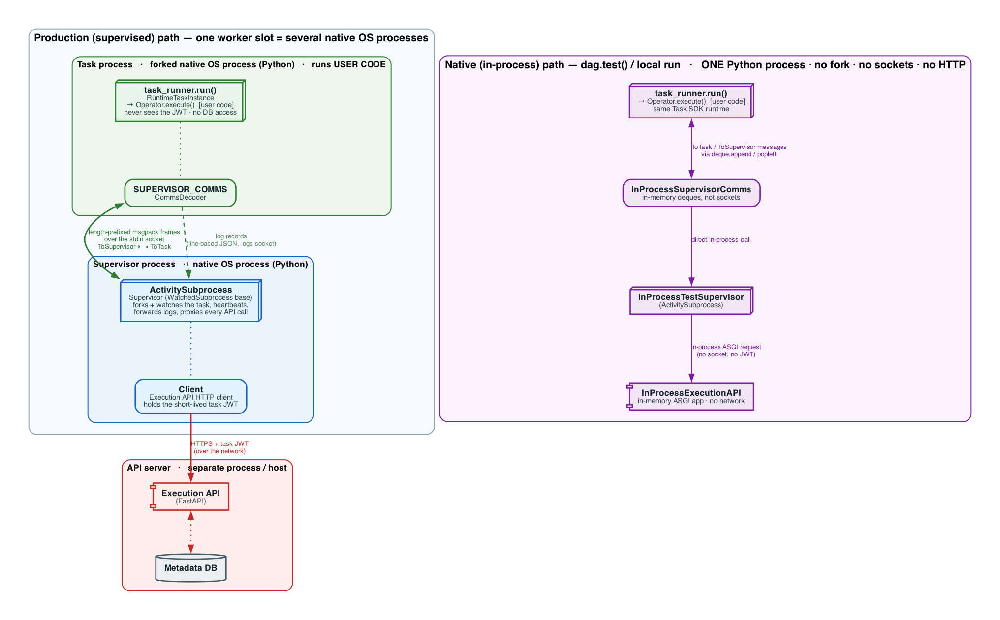
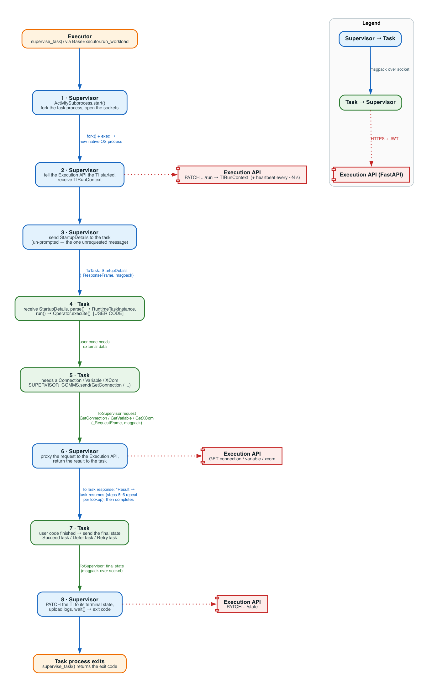
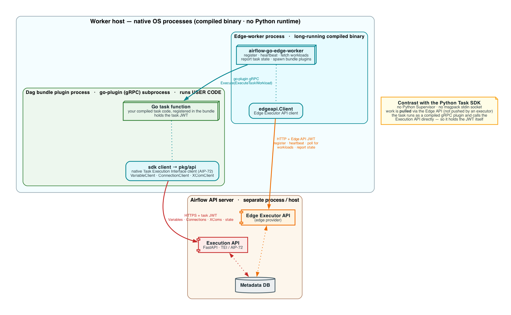
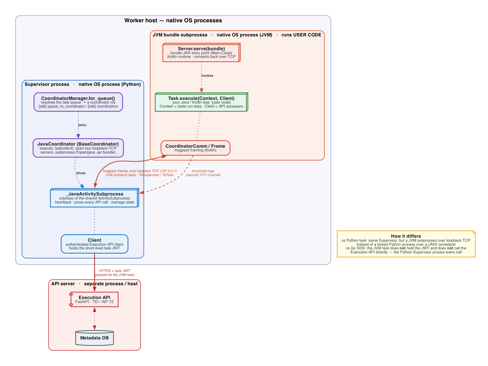
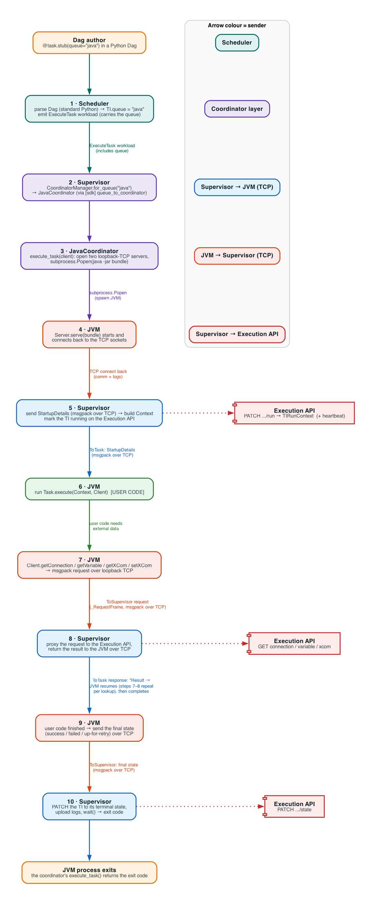
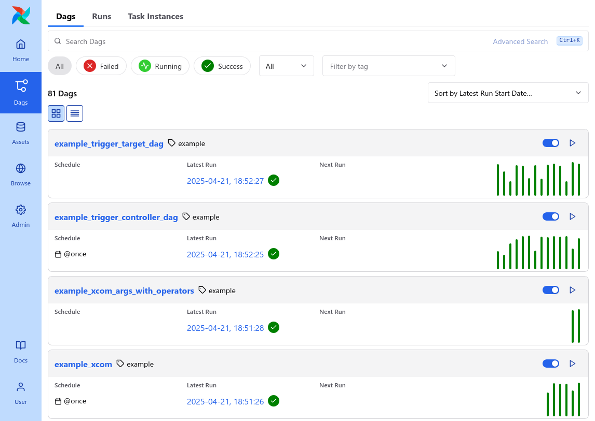

 .. Licensed to the Apache Software Foundation (ASF) under one
    or more contributor license agreements.  See the NOTICE file
    distributed with this work for additional information
    regarding copyright ownership.  The ASF licenses this file
    to you under the Apache License, Version 2.0 (the
    "License"); you may not use this file except in compliance
    with the License.  You may obtain a copy of the License at

 ..   http://www.apache.org/licenses/LICENSE-2.0

 .. Unless required by applicable law or agreed to in writing,
    software distributed under the License is distributed on an
    "AS IS" BASIS, WITHOUT WARRANTIES OR CONDITIONS OF ANY
    KIND, either express or implied.  See the License for the
    specific language governing permissions and limitations
    under the License.

Architecture Overview
=====================

Airflow is a platform that lets you build and run *workflows*. A workflow is represented as a
:doc:`Dag <dags>` (a Directed Acyclic Graph), and contains individual pieces of work called
:doc:`tasks`, arranged with dependencies and data flows taken into account.

A Dag specifies the dependencies between tasks, which defines the order in which to execute the tasks.
Tasks describe what to do, be it fetching data, running analysis, triggering other systems, or more.

Airflow itself is agnostic to what you're running - it will happily orchestrate and run anything,
either with high-level support from one of our providers, or directly as a command using the shell
or Python :doc:`operators`.

Airflow components
------------------

Airflow's architecture consists of multiple components. The following sections describe each component's
function and whether they're required for a bare-minimum Airflow installation, or an optional component
to achieve better Airflow extensibility, performance, and scalability.

Required components
...................

A minimal Airflow installation consists of the following components:

* A :doc:`scheduler <../administration-and-deployment/scheduler>`, which handles both triggering scheduled
  workflows, and submitting :doc:`tasks` to the executor to run. The :doc:`executor <executor/index>`, is
  a configuration property of the *scheduler*, not a separate component and runs within the scheduler
  process. There are several executors available out of the box, and you can also write your own.

* A *Dag processor*, which parses Dag files from a *Dag bundle* and serializes them into the
  *metadata database*. More about processing Dag files can be found in
  :doc:`/administration-and-deployment/dagfile-processing`

* A *Dag bundle*, which is configured for the *Dag processor* to parse Dag files from and allow *workers* to access the correct version of the Dag file. By default, this is a local folder on disk. More about Dag bundles can be found in
  :doc:`/administration-and-deployment/dag-bundles`

* An *API Server*, which serves the REST API and presents a user interface to inspect, trigger and debug the behaviour of
  Dags and tasks. The API server is also used by *tasks* using the *task SDK* to communicate state back to Airflow, without requiring direct access
  to the *metadata database*.

* A *metadata database*, usually PostgreSQL or MySQL, which stores the state of tasks, Dags and variables.

  Setting up a metadata database is described in :doc:`/howto/set-up-database` and is required for
  Airflow to work.

Optional components
...................

Some Airflow components are optional and can enable better extensibility, scalability, and
performance in your Airflow:

* Optional *worker*, which executes the tasks given to it by the scheduler. In the basic installation
  worker might be part of the scheduler not a separate component. It can be run as a long running process
  in the :doc:`CeleryExecutor <apache-airflow-providers-celery:celery_executor>`, or as a POD in the
  :doc:`KubernetesExecutor <apache-airflow-providers-cncf-kubernetes:kubernetes_executor>`.

* Optional *triggerer*, which executes deferred tasks in an asyncio event loop. In basic installation
  where deferred tasks are not used, a triggerer is not necessary. More about deferring tasks can be
  found in :doc:`/authoring-and-scheduling/deferring`. Note that :doc:`Human-in-the-loop </tutorial/hitl>`
  tasks wait in the scheduler-managed ``awaiting_input`` state and do not use the triggerer.

* Optional folder of *plugins*. Plugins are a way to extend Airflow's functionality (similar to installed
  packages). Plugins are read by the *scheduler*, *Dag processor*, *triggerer* and *API server*. More about
  plugins can be found in :doc:`/administration-and-deployment/plugins`.

Deploying Airflow components
----------------------------

All the components are Python applications that can be deployed using various deployment mechanisms.

They can have extra *installed packages* installed in their Python environment. This is useful for example to
install custom operators or sensors or extend Airflow functionality with custom plugins.

While Airflow can be run in a single machine and with simple installation where only *scheduler*, *Dag processor* and
*API server* are deployed, Airflow is designed to be scalable and secure, and is able to run in a distributed
environment - where various components can run on different machines, with different security perimeters
and can be scaled by running multiple instances of the components above.

The separation of components also allow for increased security, by isolating the components from each other
and by allowing to perform different tasks. For example separating *Dag processor* from *scheduler*
makes sure that the *scheduler* does not have access to the *Dag bundles* and cannot execute
code provided by *Dag author*.

Also while single person can run and manage Airflow installation, Airflow Deployment in more complex
setup can involve various roles of users that can interact with different parts of the system, which is
an important aspect of secure Airflow deployment. The roles are described in detail in the
:doc:`/security/security_model` and generally speaking include:

* Deployment Manager - a person that installs and configures Airflow and manages the deployment
* Dag author - a person that writes Dags and submits them to Airflow
* Operations User - a person that triggers Dags and tasks and monitors their execution

Architecture Diagrams
---------------------

The diagrams below show different ways to deploy Airflow - gradually from the simple "one machine" and
single person deployment, to a more complex deployment with separate components, separate user roles and
finally with more isolated security perimeters.

The meaning of the different connection types in the diagrams below is as follows:

* **brown solid lines** represent *Dag bundles* submission and synchronization
* **blue solid lines** represent deploying and accessing *installed packages* and *plugins*
* **black dashed lines** represent control flow of workers by the *scheduler* (via executor)
* **black solid lines** represent accessing the UI to manage execution of the workflows
* **red dashed lines** represent accessing the *metadata database*

.. _overview-basic-airflow-architecture:

..
  TODO AIP-72: These diagrams need to be updated to reflect AF3 changes like bundles, required Dag processor, execution api, etc.

Basic Airflow deployment
........................

This is the simplest deployment of Airflow, usually operated and managed on a single
machine. Such a deployment usually uses the LocalExecutor, where the *scheduler* and the *workers* are in
the same Python process. The *Dag processor* runs on the same machine, reads Dag files from the *Dag bundle* and serializes them into the *metadata database*
for the *scheduler* to read. The *API server* runs on the same machine as the *scheduler*.

Such an installation typically does not separate user roles - deployment, configuration, operation, authoring
and maintenance are all done by the same person and there are no security perimeters between the components.

If you want to run Airflow on a single machine in a simple single-machine setup, you can skip the
more complex diagrams below and go straight to the :ref:`overview:workloads` section.

.. _overview-distributed-airflow-architecture:

Distributed Airflow architecture
................................

This is the architecture of Airflow where components of Airflow are distributed among multiple machines
and where various roles of users are introduced - *Deployment Manager*, **Dag author**,
**Operations User**. You can read more about those various roles in the :doc:`/security/security_model`.

In the case of a distributed deployment, it is important to consider the security aspects of the components.
The *API server* does not have access to the *Dag bundles* directly. The code in the ``Code`` tab of the
UI is read from the *metadata database*. The *API server* cannot execute any code submitted by the
**Dag author**. It can only execute code that is installed as an *installed package* or *plugin* by
the **Deployment Manager**. The **Operations User** only has access to the UI and can only trigger
Dags and tasks, but cannot author Dags.

The *Dag processor*, and *workers* all need access to the *Dag bundles*. The *scheduler* and *triggerer* read from the *metadata database* and do not require direct access to *Dag bundles*.
In a distributed deployment, the *workers* get a specific *Dag bundle* version defined by the *scheduler* when executing a task.
Typical ways to
configure DAG bundle backends are described in :doc:`/administration-and-deployment/dag-bundles`.
Helm chart is one of the ways how to deploy Airflow in K8S cluster.

.. _overview-separate-dag-processing-airflow-architecture:

Separate Dag processing architecture
....................................

The *Dag processor* is a required component in all Airflow 3 deployments. It always runs as a standalone process, ensuring the *scheduler* never has direct access
to *Dag bundles* and cannot execute code provided by a **Dag author**. While Airflow does not
yet support full multi-tenant features, this separation ensures that **Dag author** provided
code is never executed in the context of the *scheduler*.

.. note::

    When using the default local disk *Dag bundle* backend, which does not support
    versioning, there can be cases where the *Dag processor* and *workers* see different
    versions of a Dag until both catch up to the latest files. Versioned *Dag bundle*
    backends (such as Git) address this by allowing the *scheduler* to pin a specific
    bundle version when dispatching each task. If needed, the cadence of sync and scan
    of the *Dag bundle* can be configured.

Task execution architecture
---------------------------

The diagrams above show how Airflow's components are *deployed*. The diagrams below instead show what happens
*inside a worker when a task actually runs* — how the Task SDK, the Supervisor and Coordinator processes, and
the language runtimes work together: which processes are involved, and the classes and protocols they use to
communicate.

.. _overview-task-sdk-execution-architecture:

Python Task SDK execution
.........................

When a *worker* actually runs a task, it does not run the user's code directly. Instead it starts a
lightweight **Supervisor** that runs in its own **native operating-system process** and
*forks* a second native process in which the **Task SDK** runtime (``task_runner``) executes the user code.
The two processes talk over a socket, and the Supervisor is the only side that ever holds the short-lived
task JWT or talks to the *Execution API* — the user's code never sees the token and never touches the
database.

The same runtime can also run *in-process* (a single Python process, no fork, no sockets, no HTTP) for
``dag.test()`` and local runs. The diagram below contrasts the two paths and marks where each Python process
lives:

The message flow of a supervised run — startup, running the user code, proxied Connection/Variable/XCom
lookups, heartbeats, and reporting the final state — is shown below as a sequence diagram, with each process
on its own lifeline. The **Supervisor** sits in the middle, so the Task ↔ Supervisor request/response
round-trip (the task asks for a Connection/Variable/XCom and gets the answer back) reads as arrows going back
and forth between neighboring lifelines. Each arrow is numbered, colored by its sender, and labeled with the
message class or protocol used:

.. _overview-non-python-language-sdks:

Non-Python language SDKs (Go and Java)
......................................

The Task Execution Interface (TEI) introduced in AIP-72 is language-agnostic, so a task can also be written in
a **compiled, non-Python language**. A Python Dag still declares the task with ``@task.stub(queue=...)`` (so
Python and non-Python tasks can be mixed in one Dag), but the actual work is delegated to the matching runtime.
There are currently **two different integration styles** — the Go SDK runs a standalone worker, while the Java
SDK plugs into the existing Python Supervisor.

.. _overview-go-sdk-architecture:

**Go SDK — standalone edge worker.** The `Go Task SDK
<https://github.com/apache/airflow/blob/main/go-sdk/README.md>`_ has **no Python Supervisor and no msgpack
stdin socket**. A long-running, compiled **edge worker** (``airflow-go-edge-worker``) *pulls* work from the
**Edge Executor API**, launches the user's compiled Dag bundle as a **go-plugin (gRPC) subprocess**, and
invokes the task over gRPC. The task then uses the **native TEI client** to reach the **Execution API**
directly over HTTPS — so, unlike the Python task, it holds the task JWT itself:

.. _overview-java-sdk-architecture:

**Java (JVM) SDK — Coordinator plugged into the Supervisor.** The `Java Task SDK
<https://github.com/apache/airflow/blob/main/java-sdk/README.md>`_ takes the opposite approach: it *reuses* the
existing Python Supervisor through a new **Coordinator** layer. ``CoordinatorManager`` resolves the task's
``queue`` to a ``BaseCoordinator`` — ``JavaCoordinator`` for the ``java`` queue, or the built-in
``_PythonCoordinator`` otherwise. ``JavaCoordinator`` opens two loopback-TCP servers, spawns a **JVM bundle
process** with ``subprocess.Popen``, and drives it with ``_JavaActivitySubprocess`` (a subclass of the shared
``ActivitySubprocess``). The JVM connects *back* over TCP and speaks the **same msgpack protocol** as a Python
task, so the Python side heartbeats, manages state, and **proxies every Execution-API call** — meaning the JVM
task, like a Python task, never holds the task JWT itself:

The end-to-end workflow of a Java task — from ``@task.stub`` through the coordinator, the JVM subprocess, the
proxied Connection/Variable/XCom lookups, and reporting the final state — is shown below as a sequence diagram.
As above, the **Supervisor** is the central lifeline, so the JVM ↔ Supervisor round-trip over loopback TCP is
drawn as arrows going back and forth to its neighbours:

.. note::

    Both the Go and Java SDKs are **experimental** and under active development. See the `Go Task SDK
    documentation <https://github.com/apache/airflow/blob/main/go-sdk/README.md>`_ and the `Java Task SDK
    documentation <https://github.com/apache/airflow/blob/main/java-sdk/README.md>`_ for current status,
    quick-starts, and known limitations.

.. _overview:workloads:

Workloads
---------

A Dag runs through a series of :doc:`tasks`, and there are three common types of task you will see:

* :doc:`operators`, predefined tasks that you can string together quickly to build most parts of your Dags.

* :doc:`sensors`, a special subclass of Operators which are entirely about waiting for an external event to happen.

* A :doc:`taskflow`-decorated ``@task``, which is a custom Python function packaged up as a Task.

Internally, these are all actually subclasses of Airflow's ``BaseOperator``, and the concepts of Task and Operator are somewhat interchangeable, but it's useful to think of them as separate concepts - essentially, Operators and Sensors are *templates*, and when you call one in a Dag file, you're making a Task.

Control Flow
------------

:doc:`dags` are designed to be run many times, and multiple runs of them can happen in parallel. Dags are parameterized, always including an interval they are "running for" (the :ref:`data interval <data-interval>`), but with other optional parameters as well.

:doc:`tasks` have dependencies declared on each other. You'll see this in a Dag either using the ``>>`` and ``<<`` operators::

    first_task >> [second_task, third_task]
    fourth_task << third_task

Or, with the ``set_upstream`` and ``set_downstream`` methods::

    first_task.set_downstream([second_task, third_task])
    fourth_task.set_upstream(third_task)

These dependencies are what make up the "edges" of the graph, and how Airflow works out which order to run your tasks in. By default, a task will wait for all of its upstream tasks to succeed before it runs, but this can be customized using features like :ref:`Branching <concepts:branching>`, :ref:`LatestOnly <concepts:latest-only>`, and :ref:`Trigger Rules <concepts:trigger-rules>`.

To pass data between tasks you have three options:

* :doc:`xcoms` ("Cross-communications"), a system where you can have tasks push and pull small bits of metadata.

* Uploading and downloading large files from a storage service (either one you run, or part of a public cloud)

* TaskFlow API automatically passes data between tasks via implicit :doc:`xcoms`

Airflow sends out Tasks to run on Workers as space becomes available, so there's no guarantee all the tasks in your Dag will run on the same worker or the same machine.

As you build out your Dags, they are likely to get very complex, so Airflow provides several mechanisms for making this more sustainable, example :ref:`concepts:taskgroups` let you visually group tasks in the UI.

There are also features for letting you easily pre-configure access to a central resource, like a datastore, in the form of :doc:`../authoring-and-scheduling/connections`, and for limiting concurrency, via :doc:`../administration-and-deployment/pools`.

User interface
--------------

Airflow comes with a user interface that lets you see what Dags and their tasks are doing, trigger runs of Dags, view logs, and do some limited debugging and resolution of problems with your Dags.

It's generally the best way to see the status of your Airflow installation as a whole, as well as diving into individual Dags to see their layout, the status of each task, and the logs from each task.
