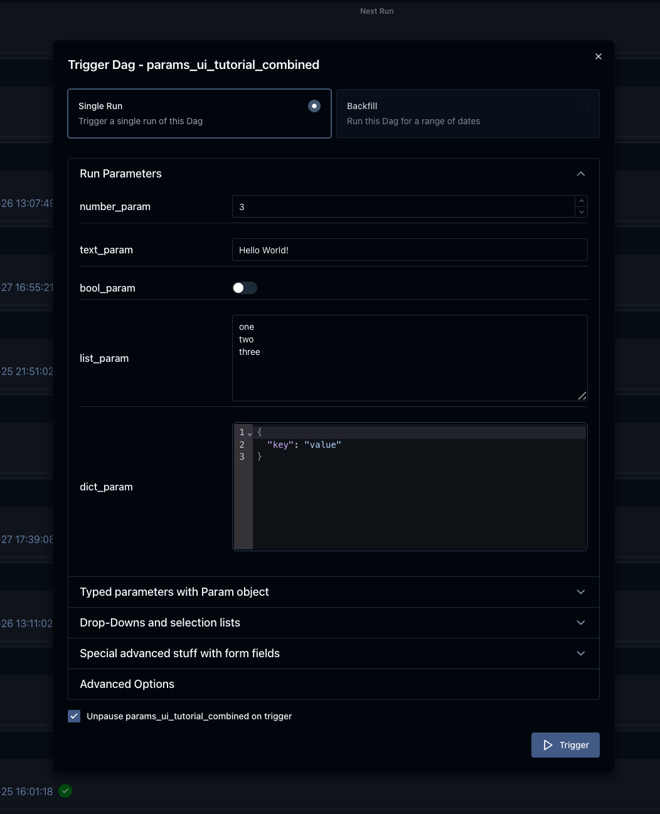
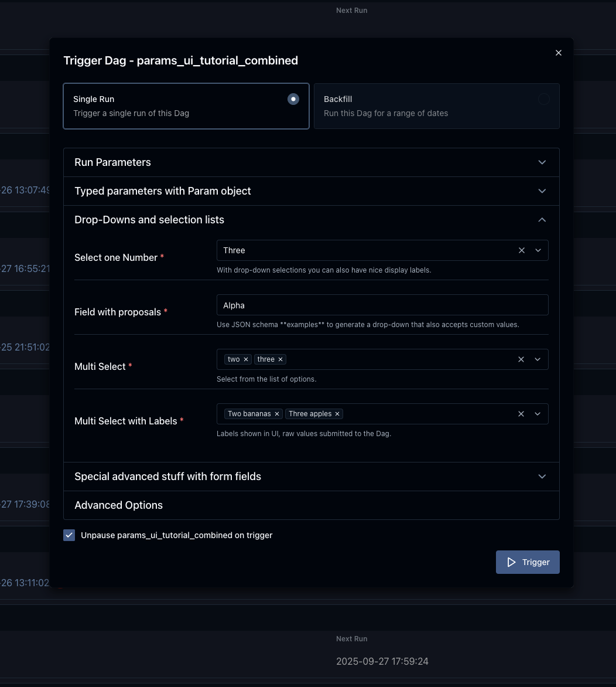
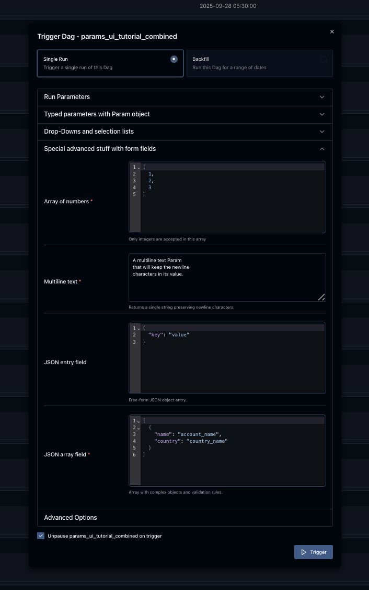

 .. Licensed to the Apache Software Foundation (ASF) under one
    or more contributor license agreements.  See the NOTICE file
    distributed with this work for additional information
    regarding copyright ownership.  The ASF licenses this file
    to you under the Apache License, Version 2.0 (the
    "License"); you may not use this file except in compliance
    with the License.  You may obtain a copy of the License at

 ..   http://www.apache.org/licenses/LICENSE-2.0

 .. Unless required by applicable law or agreed to in writing,
    software distributed under the License is distributed on an
    "AS IS" BASIS, WITHOUT WARRANTIES OR CONDITIONS OF ANY
    KIND, either express or implied.  See the License for the
    specific language governing permissions and limitations
    under the License.

.. _concepts:params:

Params
======

Params enable you to provide runtime configuration to tasks. You can configure default Params in your Dag
code and supply additional Params, or overwrite Param values, at runtime when you trigger a Dag.
:class:`~airflow.sdk.definitions.param.Param` values are validated with JSON Schema. For scheduled Dag runs,
default :class:`~airflow.sdk.definitions.param.Param` values are used.

Also defined Params are used to render a nice UI when triggering manually.
When you trigger a Dag manually, you can modify its Params before the Dag run starts.
If the user-supplied values don't pass validation, Airflow shows a warning instead of creating the Dag run.

Dag-level Params
----------------

To add Params to a :class:`~airflow.sdk.DAG`, initialize it with the ``params`` kwarg.
Use a dictionary that maps Param names to either a :class:`~airflow.sdk.definitions.param.Param` or an object indicating the parameter's default value.

.. code-block::
   :emphasize-lines: 7-10

    from airflow.sdk import DAG, task, Param, get_current_context
    import logging

    with DAG(
        "the_dag",
        params={
            "x": Param(5, type="integer", minimum=3),
            "my_int_param": 6
        },
    ) as dag:

        @task.python
        def example_task():
            ctx = get_current_context()
            logger = logging.getLogger("airflow.task")

            # This will print the default value, 6:
            logger.info(ctx["dag"].params["my_int_param"])

            # This will print the manually-provided value, 42:
            logger.info(ctx["params"]["my_int_param"])

            # This will print the default value, 5, since it wasn't provided manually:
            logger.info(ctx["params"]["x"])

        example_task()

    if __name__ == "__main__":
        dag.test(
            run_conf={"my_int_param": 42}
        )

.. note::

   Dag-level parameters are the default values passed on to tasks. These should not be confused with values manually
   provided through the UI form or CLI, which exist solely within the context of a :class:`~airflow.models.dagrun.DagRun`
   and a :class:`~airflow.models.taskinstance.TaskInstance`. This distinction is crucial for TaskFlow Dags, which may
   include logic within the ``with DAG(...) as dag:`` block. In such cases, users might try to access the manually-provided
   parameter values using the ``dag`` object, but this will only ever contain the default values. To ensure that the
   manually-provided values are accessed, use a template variable such as ``params`` or ``ti`` within your task.

Task-level Params
-----------------

You can also add Params to individual tasks.

.. code-block::

    def print_my_int_param(params):
      print(params.my_int_param)

    PythonOperator(
        task_id="print_my_int_param",
        params={"my_int_param": 10},
        python_callable=print_my_int_param,
    )

Task-level params take precedence over Dag-level params, and user-supplied params (when triggering the Dag)
take precedence over task-level params.

Referencing Params in a Task
----------------------------

Params can be referenced in :ref:`templated strings <templates-ref>` under ``params``. For example:

.. code-block::
   :emphasize-lines: 4

    PythonOperator(
        task_id="from_template",
        op_args=[
            "{{ params.my_int_param + 10 }}",
        ],
        python_callable=(
            lambda my_int_param: print(my_int_param)
        ),
    )

Even though Params can use a variety of types, the default behavior of templates is to provide your task with a string.
You can change this by setting ``render_template_as_native_obj=True`` while initializing the :class:`~airflow.models.dag.DAG`.

.. code-block::
   :emphasize-lines: 4

    with DAG(
        "the_dag",
        params={"my_int_param": Param(5, type="integer", minimum=3)},
        render_template_as_native_obj=True
    ):

This way, the :class:`~airflow.sdk.definitions.param.Param`'s type is respected when it's provided to your task:

.. code-block::

    # prints <class 'str'> by default
    # prints <class 'int'> if render_template_as_native_obj=True
    PythonOperator(
        task_id="template_type",
        op_args=[
            "{{ params.my_int_param }}",
        ],
        python_callable=(
            lambda my_int_param: print(type(my_int_param))
        ),
    )

Another way to access your param is via a task's ``context`` kwarg.

.. code-block::
   :emphasize-lines: 1,2

    def print_my_int_param(**context):
        print(context["params"]["my_int_param"])

    PythonOperator(
        task_id="print_my_int_param",
        python_callable=print_my_int_param,
        params={"my_int_param": 12345},
    )

JSON Schema Validation
----------------------

:class:`~airflow.sdk.definitions.param.Param` makes use of `JSON Schema <https://json-schema.org/>`_, so you can use the full JSON Schema specifications mentioned at https://json-schema.org/draft/2020-12/json-schema-validation.html to define ``Param`` objects.

.. code-block::

    with DAG(
        "my_dag",
        params={
            # an int with a default value
            "my_int_param": Param(10, type="integer", minimum=0, maximum=20),

            # a required param which can be of multiple types
            # a param must have a default value
            "multi_type_param": Param(5, type=["null", "number", "string"]),

            # an enum param, must be one of three values
            "enum_param": Param("foo", enum=["foo", "bar", 42]),

            # a param which uses json-schema formatting
            "email": Param(
                default="example@example.com",
                type="string",
                format="idn-email",
                minLength=5,
                maxLength=255,
            ),
        },
    ):

.. note::
    If ``schedule`` is defined for a Dag, params with defaults must be valid. This is validated during Dag parsing.
    If ``schedule=None`` then params are not validated during Dag parsing but before triggering a Dag.
    This is useful in cases where the Dag author does not want to provide defaults but wants to force users provide valid parameters
    at time of trigger.

.. note::
    As of now, for security reasons, one can not use :class:`~airflow.sdk.definitions.param.Param` objects derived out of custom classes. We are
    planning to have a registration system for custom :class:`~airflow.sdk.definitions.param.Param` classes, just like we've for Operator ExtraLinks.

Use Params to Provide a Trigger UI Form
---------------------------------------

.. versionadded:: 2.6.0

:class:`~airflow.models.dag.DAG` level params are used to render a user friendly trigger form.
This form is provided when a user clicks on the "Trigger Dag" button.

The Trigger UI Form is rendered based on the pre-defined Dag Params. If the Dag has no params defined, the trigger form is skipped.
The form elements can be defined with the :class:`~airflow.sdk.definitions.param.Param` class and attributes define how a form field is displayed.

The following features are supported in the Trigger UI Form:

- Direct scalar values (boolean, int, string, lists, dicts) from top-level Dag params are auto-boxed into :class:`~airflow.sdk.definitions.param.Param` objects.
  From the native Python data type the ``type`` attribute is auto detected. So these simple types render to a corresponding field type.
  The name of the parameter is used as label and no further validation is made, all values are treated as optional.
- If you use the :class:`~airflow.sdk.definitions.param.Param` class as definition of the parameter value, the following attributes can be added:

  - The :class:`~airflow.sdk.definitions.param.Param` attribute ``title`` is used to render the form field label of the entry box.
    If no ``title`` is defined the parameter name/key is used instead.
  - The :class:`~airflow.sdk.definitions.param.Param` attribute ``description`` is rendered below an entry field as help text in gray color.
    If you want to provide special formatting or links you need to use the Param attribute
    ``description_md``. See tutorial Dag :ref:`Params UI example Dag <params-ui-tutorial>` for an example.
  - The :class:`~airflow.sdk.definitions.param.Param` attribute ``type`` influences how a field is rendered. The following types are supported:

      .. list-table::
        :header-rows: 1

        * - Param type
          - Form element type
          - Additional supported attributes
          - Example

        * - ``string``
          - Generates a single-line text box or a text area to edit text.
          - * ``minLength``: Minimum text length
            * ``maxLength``: Maximum text length
            * | ``format="date"``: Generate a date-picker
              | with calendar pop-up
            * | ``format="date-time"``: Generate a date and
              | time-picker with calendar pop-up
            * ``format="time"``: Generate a time-picker
            * ``format="multiline"``: Generate a multi-line textarea
            * | ``enum=["a", "b", "c"]``: Generates a
              | drop-down select list for scalar values.
              | As of JSON validation, a value must be
              | selected or the field must be marked as
              | optional explicit. See also details inside
              | the  `JSON Schema Description for Enum <https://json-schema.org/understanding-json-schema/reference/generic.html#enumerated-values>`_.
            * | ``values_display={"a": "Alpha", "b": "Beta"}``:
              | For select drop-downs generated via
              | ``enum`` you can add the attribute
              | ``values_display`` with a dict and map data
              | values to display labels.
            * | ``examples=["One", "Two", "Three"]``: If you
              | want to present proposals for values
              | (not restricting the user to a fixed ``enum``
              | as above) you can make use of ``examples``
              | which is a list of items.

            | Also see
            | `further JSON Schema string type validation options <https://json-schema.org/understanding-json-schema/reference/string.html>`_
            | which are checked before Dag trigger in the backend.
          - ``Param("default", type="string", maxLength=10)``

            ``Param(f"{datetime.date.today()}", type="string", format="date")``

        * - ``number`` or

            ``integer``
          - | Generates a field which restricts adding
            | numeric values only. The HTML browser
            | typically also adds a spinner on the
            | right side to increase or decrease the
            | value. ``integer`` only permits int
            | numbers, ``number`` allows also
            | fractional values.
          - * ``minimum``: Minimum number value
            * ``maximum``: Maximum number value

            | Also see
            | `further JSON Schema numeric type validation options <https://json-schema.org/understanding-json-schema/reference/numeric.html>`_
            | which are checked before Dag trigger in the backend.
          - ``Param(42, type="integer", minimum=14, multipleOf=7)``

        * - ``boolean``
          - | Generates a toggle button to be used
            | as ``True`` or ``False``.
          - none.
          - ``Param(True, type="boolean")``

        * - ``array``
          - | Generates a HTML multi line text field,
            | every line edited will be made into a
            | string array as value.
          - * | If you add the attribute ``examples``
              | with a list, a multi-value select option
              | will be generated instead of a free text field.
            * | ``values_display={"a": "Alpha", "b": "Beta"}``:
              | For multi-value selects ``examples`` you can add
              | the attribute ``values_display`` with a dict and
              | map data values to display labels.
            * | If you add the attribute ``items`` with a
              | dictionary that contains a field ``type``
              | with a value other than "string", a JSON entry
              | field will be generated for more array types and
              | additional type validation as described in
              | `JSON Schema Array Items <https://json-schema.org/understanding-json-schema/reference/array.html#items>`_.
          - ``Param(["a", "b", "c"], type="array")``

            ``Param(["two", "three"], type="array", examples=["one", "two", "three", "four", "five"])``

            ``Param(["one@example.com", "two@example.com"], type="array", items={"type": "string", "format": "idn-email"})``

        * - ``object``
          - | Generates a JSON entry field with
            | text validation.
          - | The HTML form does only validate the syntax of the
            | JSON input. In order to validate the content for
            | specific structures take a look to the
            | `JSON Schema Object details <https://json-schema.org/understanding-json-schema/reference/object.html>`_.
          - ``Param({"key": "value"}, type=["object", "null"])``

        * - ``null``
          - | Specifies that no content is expected.
            | Standalone this does not make much sense
            | but it is useful for type combinations
            | like ``type=["null", "string"]`` as the
            | type attribute also accepts a list of
            | types.

            | Per default if you specify a type, a
            | field will be made required with
            | input - because of JSON validation.
            | If you want to have a field value being
            | added optional only, you must allow
            | JSON schema validation allowing null
            | values.
          -
          - ``Param(None, type=["null", "string"])``

- If a form field is left empty, it is passed as ``None`` value to the params dict.
- Form fields are rendered in the order of definition of ``params`` in the Dag.
- If you want to add sections to the Form, add the attribute ``section`` to each field. The text will be used as section label.
  Fields w/o ``section`` will be rendered in the default area.
  Additional sections will be collapsed per default.
- If you want to have params not being displayed, use the ``const`` attribute. These Params will be submitted but hidden in the Form.
  The ``const`` value must match the default value to pass `JSON Schema validation <https://json-schema.org/understanding-json-schema/reference/generic.html#constant-values>`_.
- On the bottom of the form the generated JSON configuration can be expanded.
  If you want to change values manually, the JSON configuration can be adjusted. Changes in the JSON will be reflected in the form fields.
- Fields can be required or optional. Typed fields are required by default to ensure they pass JSON schema validation. To make typed fields optional, you must allow the "null" type.
- Fields without a "section" will be rendered in the default area. Additional sections will be collapsed by default.

.. note::
    If the field is required the default value must be valid according to the schema as well. If the Dag is defined with
    ``schedule=None`` the parameter value validation is made at time of trigger.

For examples, please take a look at the two example dags provided: :ref:`Params trigger example Dag <params-trigger-ui>` and :ref:`Params UI example Dag <params-ui-tutorial>`.

.. _params-trigger-ui:
.. exampleinclude:: /../src/airflow/example_dags/example_params_trigger_ui.py
    :language: python
    :start-after: [START params_trigger]
    :end-before: [END params_trigger]

.. _params-ui-tutorial:
.. exampleinclude:: /../src/airflow/example_dags/example_params_ui_tutorial.py
    :language: python
    :start-after: [START section_1]
    :end-before: [END section_1]

.. exampleinclude:: /../src/airflow/example_dags/example_params_ui_tutorial.py
    :language: python
    :start-after: [START section_2]
    :end-before: [END section_2]

.. exampleinclude:: /../src/airflow/example_dags/example_params_ui_tutorial.py
    :language: python
    :start-after: [START section_3]
    :end-before: [END section_3]

The Params UI Tutorial is rendered in 4 sections with the most common examples. The first section shows the basic usage without
``Param`` class.

The second section shows how to use the ``Param`` class to define more attributes.

.. image:: ../img/ui-dark/trigger-dag-tutorial-form-2.png

The third section shows how to model selection lists and drop-downs.

Finally the fourth section shows advanced form elements.

.. versionchanged:: 3.0.0
    By default custom HTML is not allowed to prevent injection of scripts or other malicious HTML code. The previous field named
    ``description_html`` is now super-seeded with the attribute ``description_md``. ``description_html`` is not supported anymore.
    Custom form elements using the attribute ``custom_html_form`` was deprecated in version 2.8.0 and support was removed in 3.0.0.

Disabling Runtime Param Modification
------------------------------------

The ability to update params while triggering a Dag depends on the flag ``core.dag_run_conf_overrides_params``.
Setting this config to ``False`` will effectively turn your default params into constants.

Pre-populating Trigger Form via URL
-----------------------------------

To pre-populate values in the form when publishing a link to the trigger form you can call the trigger URL ``/dags/<dag_name>/trigger/single`` or ``/dags/<dag_name>/trigger/backfill``,
and add query parameters to the URL.

There are two trigger form URLs available, each supporting a different set of query parameters:

* ``/trigger/single``:
  - ``conf`` - JSON configuration.
  - ``run_id`` - run identifier.
  - ``logical_date`` - execution date in ``YYYY-MM-DDTHH:mm:ss.SSS`` format. Defaults to the current timestamp if not provided.
  - ``note`` - note attached to the DAG run.

* ``/trigger/backfill``:
  - ``conf`` - JSON configuration, applied to all runs.
  - ``from_date`` - start of the backfill window in ``YYYY-MM-DDTHH:mm:ss`` format.
  - ``to_date`` - end of the backfill window in ``YYYY-MM-DDTHH:mm:ss`` format.
  - ``max_active_runs`` - maximum concurrent runs. Defaults to ``1``.
  - ``reprocess_behavior`` - determines how existing runs are reprocessed. Supported values are:

    * ``failed`` - Missing and Errored Runs
    * ``completed`` - All Runs
    * ``none`` - Missing Runs

  - ``run_backwards`` - if set to true, the backfill is scheduled in reverse order. Defaults to ``false``.

The trigger form supports two different ways of providing ``conf`` values. The available input methods are summarized in the table below:

.. list-table:: ``conf`` parameter usage
   :header-rows: 1
   :widths: 15 35 55

   * - Form
     - Usage
     - Example
   * - JSON (explicit)
     - Provide the entire configuration as a JSON object.
       This form has higher priority if present.
     - ``/dags/{dag_id}/trigger/single?conf={"foo":"bar","x":123}``
   * - Key-value (implicit)
     - If ``conf`` is not specified, any query parameter that is not a reserved keyword
       will be automatically collected into ``conf``.
     - ``/dags/{dag_id}/trigger/single?run_id=myrun&foo=bar&x=123``
       results in ``conf={"foo":"bar","x":"123"}``

For example, you can pass the pathname and query like below:

``/dags/{dag_id}/trigger/single?run_id=my_run_dag&logical_date=2025-09-06T12:34:56.789&conf={"foo":"bar"}&note=run_note``

``/dags/{dag_id}/trigger/backfill?from_date=2025-09-01T00:00:00&to_date=2025-09-03T23:59:59&conf={"abc":"loo"}&max_active_runs=2&reprocess_behavior=failed&run_backwards=true``
