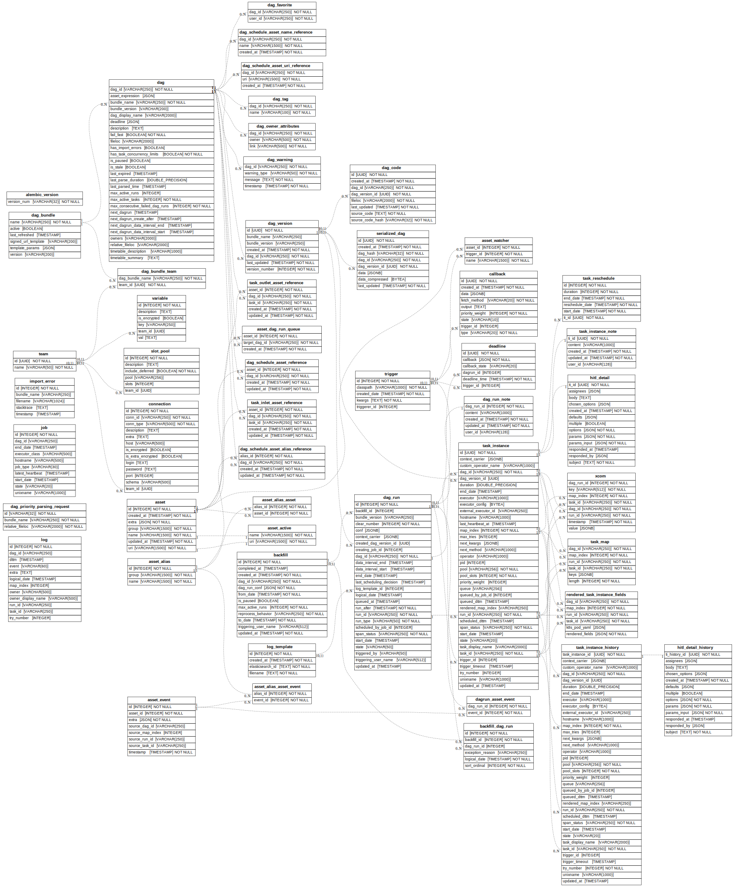

 .. Licensed to the Apache Software Foundation (ASF) under one
    or more contributor license agreements.  See the NOTICE file
    distributed with this work for additional information
    regarding copyright ownership.  The ASF licenses this file
    to you under the Apache License, Version 2.0 (the
    "License"); you may not use this file except in compliance
    with the License.  You may obtain a copy of the License at

 ..   http://www.apache.org/licenses/LICENSE-2.0

 .. Unless required by applicable law or agreed to in writing,
    software distributed under the License is distributed on an
    "AS IS" BASIS, WITHOUT WARRANTIES OR CONDITIONS OF ANY
    KIND, either express or implied.  See the License for the
    specific language governing permissions and limitations
    under the License.

ERD Schema of the Database
''''''''''''''''''''''''''

Here is the current Database schema diagram.

.. warning::

   The ER diagram shows the snapshot of the database structure valid for Airflow version |version| and it
   should be treated as an internal detail. It might be changed at any time and you should not directly
   access the database to retrieve information from it or modify the data - you should use
   :doc:`stable-rest-api-ref` to do that instead.
   The main purpose of this diagram is to help with troubleshooting and understanding of the
   internal Airflow DB architecture in case you have any problems with the database - for example
   when dealing with problems with migrations. See also :doc:`migrations-ref` for
   list of detailed database migrations that are applied when running migration script and
   `db command <cli-and-env-variables-ref.html#db>`_ for the commands that you can use to manage
   the migrations.

.. This image is automatically generated by prek hook via ``scripts/ci/prek/update_er_diagram.py``

