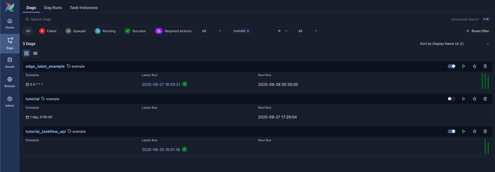

 .. Licensed to the Apache Software Foundation (ASF) under one
    or more contributor license agreements.  See the NOTICE file
    distributed with this work for additional information
    regarding copyright ownership.  The ASF licenses this file
    to you under the Apache License, Version 2.0 (the
    "License"); you may not use this file except in compliance
    with the License.  You may obtain a copy of the License at

 ..   http://www.apache.org/licenses/LICENSE-2.0

 .. Unless required by applicable law or agreed to in writing,
    software distributed under the License is distributed on an
    "AS IS" BASIS, WITHOUT WARRANTIES OR CONDITIONS OF ANY
    KIND, either express or implied.  See the License for the
    specific language governing permissions and limitations
    under the License.

Add tags to Dags and use it for filtering in the UI
===================================================

.. versionadded:: 1.10.8

In order to filter Dags (e.g by team), you can add tags in each Dag.
The filter is saved in a cookie and can be reset by the reset button.

For example:

In your Dag file, pass a list of tags you want to add to the Dag object:

.. code-block:: python

  dag = DAG(dag_id="example_dag_tag", schedule="0 0 * * *", tags=["example"])

**Screenshot**:

Tags are registered as part of Dag parsing.
In case of stale tags, you can purge old data with the Airflow CLI command ``airflow db clean``.
See :ref:`db clean usage<cli-db-clean>` for more details.
