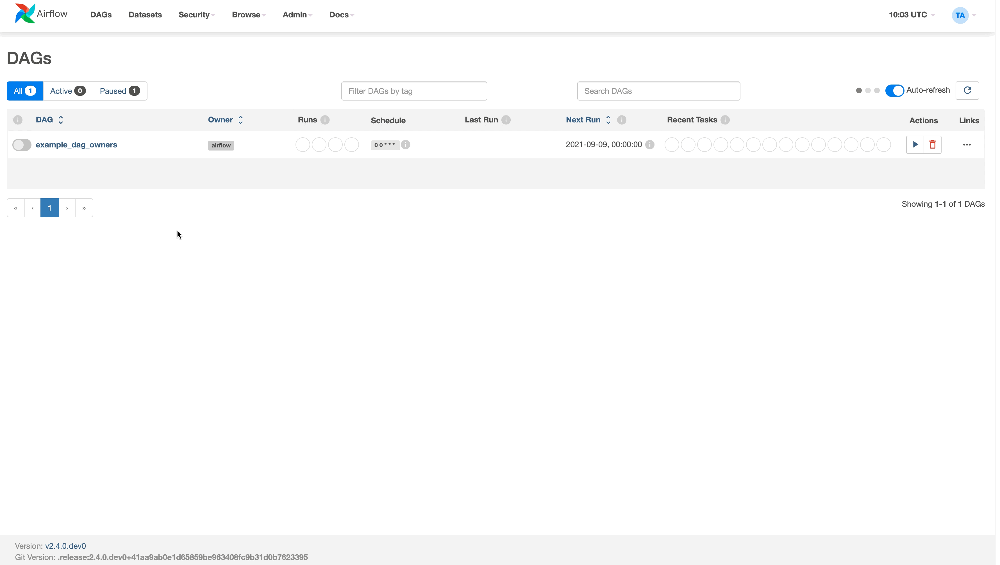

 .. Licensed to the Apache Software Foundation (ASF) under one
    or more contributor license agreements.  See the NOTICE file
    distributed with this work for additional information
    regarding copyright ownership.  The ASF licenses this file
    to you under the Apache License, Version 2.0 (the
    "License"); you may not use this file except in compliance
    with the License.  You may obtain a copy of the License at

 ..   http://www.apache.org/licenses/LICENSE-2.0

 .. Unless required by applicable law or agreed to in writing,
    software distributed under the License is distributed on an
    "AS IS" BASIS, WITHOUT WARRANTIES OR CONDITIONS OF ANY
    KIND, either express or implied.  See the License for the
    specific language governing permissions and limitations
    under the License.

Add Owner Links to Dag
=======================

.. versionadded:: 2.4.0

You can set the ``owner_links`` argument on your Dag object, which will make the owner a clickable link in the
main Dags view page instead of a search filter.

Two options are supported:

* An HTTP link (e.g. ``https://www.example.com``) which opens the webpage in your default internet client
* A `mailto <https://en.wikipedia.org/wiki/Mailto>`_ link (e.g. ``mailto:example@airflow.com``) which opens your default email client to send an email to the specified address

In your Dag, set the ``owner_links`` argument specifying a dictionary of an owner (key) and its link (value).
Next define a task using this owner, and the owner in the Dags view will link to the specified address.

.. code-block:: python
  :emphasize-lines: 5

  with DAG(
      dag_id="example_dag_owners",
      start_date=datetime(2022, 8, 5),
      schedule="0 0 * * *",
      owner_links={"airflow": "https://airflow.apache.org"},
  ):
      BashOperator(task_id="task_using_linked_owner", bash_command="echo 1", owner="airflow")

**Screenshot**:

