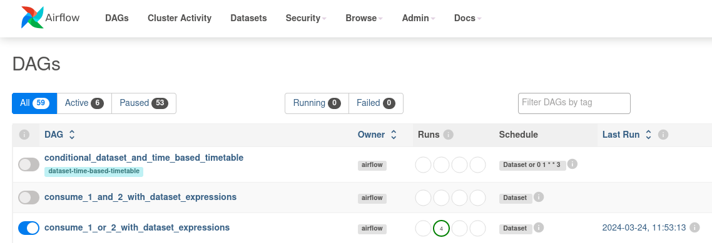
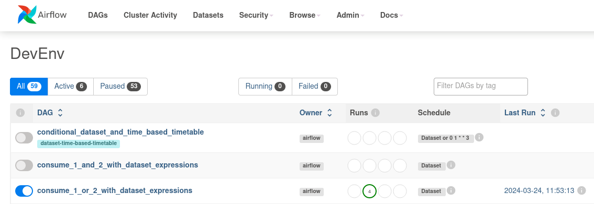
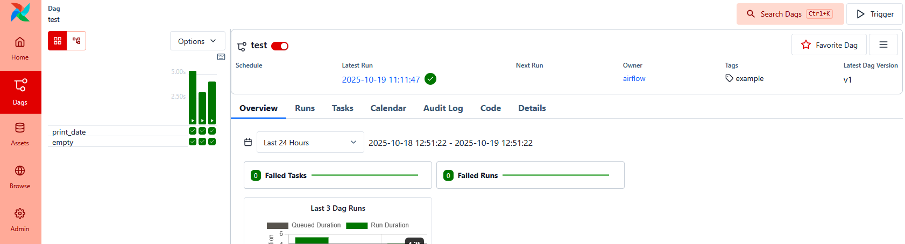
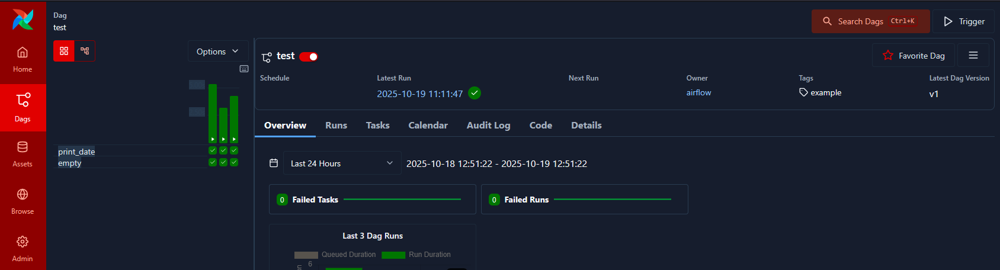
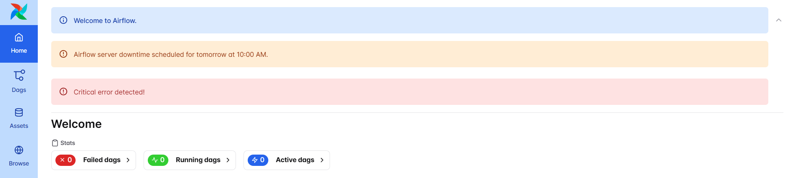
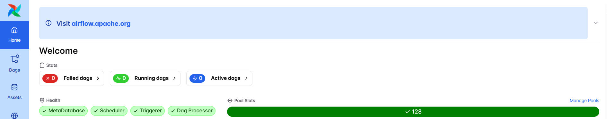

 .. Licensed to the Apache Software Foundation (ASF) under one
    or more contributor license agreements.  See the NOTICE file
    distributed with this work for additional information
    regarding copyright ownership.  The ASF licenses this file
    to you under the Apache License, Version 2.0 (the
    "License"); you may not use this file except in compliance
    with the License.  You may obtain a copy of the License at

 ..   http://www.apache.org/licenses/LICENSE-2.0

 .. Unless required by applicable law or agreed to in writing,
    software distributed under the License is distributed on an
    "AS IS" BASIS, WITHOUT WARRANTIES OR CONDITIONS OF ANY
    KIND, either express or implied.  See the License for the
    specific language governing permissions and limitations
    under the License.

Customizing the UI
==================

.. _customizing-the-ui:

Customizing Dag UI Header and Airflow Page Titles
-------------------------------------------------

Airflow now allows you to customize the Dag home page header and page title. This will help
distinguish between various installations of Airflow or simply amend the page text.

.. note::

    The custom title will be applied to both the page header and the page title.

To make this change, simply:

1.  Add the configuration option of ``instance_name`` under the ``[api]`` section inside ``airflow.cfg``:

.. code-block::

  [api]

  instance_name = "DevEnv"

2.  Alternatively, you can set a custom title using the environment variable:

.. code-block::

  AIRFLOW__API__INSTANCE_NAME = "DevEnv"

Screenshots
^^^^^^^^^^^

Before
""""""

After
"""""

.. _customizing-ui-theme:

Customizing UI theme
--------------------

We can provide a JSON configuration to customize the UI.

.. important::

  - You can customize the ``brand``, ``gray``, ``black``, and ``white`` color tokens, ``globalCss``, and the navigation icon via ``icon`` (and ``icon_dark_mode``).
  - All top-level fields (``tokens``, ``globalCss``, ``icon``, ``icon_dark_mode``) are **optional** — you can supply any combination, including an empty ``{}`` to restore OSS defaults.
  - All color tokens are **optional** — you can override any subset without supplying the others.
  - ``brand`` and ``gray`` each accept an 11-shade scale with keys ``50``–``950``.
  - ``black`` and ``white`` each accept a single color: ``{ "value": "oklch(...)" }``.
  - OKLCH colors must use the format ``oklch(l c h)``. For more info see :ref:`config:api__theme`
  - There is also the ability to provide custom global CSS for fine-grained theme control.

.. note::

  Modifying the ``brand`` color palette also modifies the navbar/sidebar.
  Modifying ``gray`` controls neutral surfaces and borders.
  Modifying ``black`` and ``white`` controls the darkest and lightest surface colors.

To customize the UI, simply:

1.  Add the configuration option of ``theme`` under the ``[api]`` section inside ``airflow.cfg``:

.. code-block::

  [api]

  theme = {
      "tokens": {
        "colors": {
          "brand": {
            "50": { "value": "oklch(0.971 0.013 17.38)" },
            "100": { "value": "oklch(0.936 0.032 17.717)" },
            "200": { "value": "oklch(0.885 0.062 18.334)" },
            "300": { "value": "oklch(0.808 0.114 19.571)" },
            "400": { "value": "oklch(0.704 0.191 22.216)" },
            "500": { "value": "oklch(0.637 0.237 25.331)" },
            "600": { "value": "oklch(0.577 0.245 27.325)" },
            "700": { "value": "oklch(0.505 0.213 27.518)" },
            "800": { "value": "oklch(0.444 0.177 26.899)" },
            "900": { "value": "oklch(0.396 0.141 25.723)" },
            "950": { "value": "oklch(0.258 0.092 26.042)" }
          }
        }
      }
    }

.. note::

  The whitespace, particularly on the last line, is important so a multi-line value works properly. More details can be found in the
  the `configparser docs <https://docs.python.org/3/library/configparser.html#supported-ini-file-structure>`_.

2.  Alternatively, you can set a custom theme using the environment variable:

.. code-block::

  AIRFLOW__API__THEME='{
    "tokens": {
      "colors": {
        "brand": {
          "50": { "value": "oklch(0.971 0.013 17.38)" },
          "100": { "value": "oklch(0.936 0.032 17.717)" },
          "200": { "value": "oklch(0.885 0.062 18.334)" },
          "300": { "value": "oklch(0.808 0.114 19.571)" },
          "400": { "value": "oklch(0.704 0.191 22.216)" },
          "500": { "value": "oklch(0.637 0.237 25.331)" },
          "600": { "value": "oklch(0.577 0.245 27.325)" },
          "700": { "value": "oklch(0.505 0.213 27.518)" },
          "800": { "value": "oklch(0.444 0.177 26.899)" },
          "900": { "value": "oklch(0.396 0.141 25.723)" },
          "950": { "value": "oklch(0.258 0.092 26.042)" }
        }
      }
    }
  }'

Screenshots
^^^^^^^^^^^

Light Mode
""""""""""

Dark Mode
"""""""""

3.  To add custom CSS rules to the airflow UI, you can include a ``globalCss`` key in the theme configuration. More information https://chakra-ui.com/docs/theming/customization/global-css

.. code-block::

  AIRFLOW__API__THEME='{
    "tokens": {
      "colors": {
        "brand": {
          "50": { "value": "oklch(0.971 0.013 17.38)" },
          "100": { "value": "oklch(0.936 0.032 17.717)" },
          "200": { "value": "oklch(0.885 0.062 18.334)" },
          "300": { "value": "oklch(0.808 0.114 19.571)" },
          "400": { "value": "oklch(0.704 0.191 22.216)" },
          "500": { "value": "oklch(0.637 0.237 25.331)" },
          "600": { "value": "oklch(0.577 0.245 27.325)" },
          "700": { "value": "oklch(0.505 0.213 27.518)" },
          "800": { "value": "oklch(0.444 0.177 26.899)" },
          "900": { "value": "oklch(0.396 0.141 25.723)" },
          "950": { "value": "oklch(0.258 0.092 26.042)" }
        }
      }
    },
    "globalCss": {
      "button": {
        "text-transform": "uppercase"
      }
    }
  }'

Customizing gray, black, and white tokens
^^^^^^^^^^^^^^^^^^^^^^^^^^^^^^^^^^^^^^^^^

You can override the neutral palette and surface colors independently of ``brand``. ``gray`` controls
borders and neutral UI elements, while ``black`` and ``white`` control the darkest and lightest surface
backgrounds. All fields are optional — supply only the tokens you want to change.

.. code-block::

  AIRFLOW__API__THEME='{
    "tokens": {
      "colors": {
        "gray": {
          "50":  { "value": "oklch(0.975 0.002 264.0)" },
          "100": { "value": "oklch(0.950 0.003 264.0)" },
          "200": { "value": "oklch(0.880 0.005 264.0)" },
          "300": { "value": "oklch(0.780 0.008 264.0)" },
          "400": { "value": "oklch(0.640 0.012 264.0)" },
          "500": { "value": "oklch(0.520 0.015 264.0)" },
          "600": { "value": "oklch(0.420 0.015 264.0)" },
          "700": { "value": "oklch(0.340 0.012 264.0)" },
          "800": { "value": "oklch(0.260 0.009 264.0)" },
          "900": { "value": "oklch(0.200 0.007 264.0)" },
          "950": { "value": "oklch(0.145 0.005 264.0)" }
        },
        "black": { "value": "oklch(0.220 0.025 288.6)" },
        "white": { "value": "oklch(0.985 0.002 264.0)" }
      }
    }
  }'

Icon (SVG-only)
^^^^^^^^^^^^^^^

You can replace the default Airflow icon in the navigation bar by providing an ``icon`` key (and optionally
``icon_dark_mode`` for dark color mode) in the ``theme`` configuration. The value must be either an absolute
``http(s)`` URL or an app-relative path starting with ``/``, and must point to an ``.svg`` file.

.. code-block::

  [api]

  theme = {
      "tokens": {
        "colors": {
          "brand": {
            "50": { "value": "oklch(0.971 0.013 17.38)" },
            "100": { "value": "oklch(0.936 0.032 17.717)" },
            "200": { "value": "oklch(0.885 0.062 18.334)" },
            "300": { "value": "oklch(0.808 0.114 19.571)" },
            "400": { "value": "oklch(0.704 0.191 22.216)" },
            "500": { "value": "oklch(0.637 0.237 25.331)" },
            "600": { "value": "oklch(0.577 0.245 27.325)" },
            "700": { "value": "oklch(0.505 0.213 27.518)" },
            "800": { "value": "oklch(0.444 0.177 26.899)" },
            "900": { "value": "oklch(0.396 0.141 25.723)" },
            "950": { "value": "oklch(0.258 0.092 26.042)" }
          }
        }
      },
      "icon": "/static/company-icon.svg",
      "icon_dark_mode": "/static/company-icon-dark.svg"
    }

.. note::

  - Only SVG icons are supported.
  - If the icon fails to load, Airflow falls back to its default icon.
  - Icon sizing is controlled by the UI and cannot be configured via the theme.

|

Adding Dashboard Alert Messages
===============================

Extra alert messages can be shown on the Airflow dashboard. This can be useful for warning about setup issues, announcing changes
to end users, or providing real-time status information. Dashboard alerts support both static and dynamic content.

Basic Static Alerts
-------------------

To add static alert messages that remain constant until the webserver is restarted:

1. Create an ``airflow_local_settings.py`` file and place it in ``$PYTHONPATH`` or in the ``$AIRFLOW_HOME/config`` folder.
   (Airflow adds ``$AIRFLOW_HOME/config`` to ``PYTHONPATH`` when Airflow is initialized)

2. Add the following contents to ``airflow_local_settings.py``:

  .. note::
      See :ref:`Configuring local settings <set-config:configuring-local-settings>` for details on how to configure local settings.

  .. code-block:: python

      from airflow.api_fastapi.common.types import UIAlert

      DASHBOARD_UIALERTS = [
          UIAlert("Welcome to Airflow", category="info"),
      ]

3. Restart the Airflow webserver, and you should now see the alert message displayed on the dashboard.

Alert Categories
----------------

You can control the category of the alert message. Available categories include:

- ``"info"`` (default) - Blue informational alerts
- ``"warning"`` - Yellow warning alerts
- ``"error"`` - Red error alerts

.. code-block:: python

      from airflow.api_fastapi.common.types import UIAlert

      DASHBOARD_UIALERTS = [
          UIAlert(text="Welcome to Airflow.", category="info"),
          UIAlert(text="Airflow server downtime scheduled for tomorrow at 10:00 AM.", category="warning"),
          UIAlert(text="Critical error detected!", category="error"),
      ]

Markdown Content in Alerts
--------------------------

Markdown can be included in alert messages for richer formatting. In the following example, we show an alert
message of heading 2 with a link included:

.. code-block:: python

    from airflow.api_fastapi.common.types import UIAlert

    DASHBOARD_UIALERTS = [
        UIAlert(text="## Visit [airflow.apache.org](https://airflow.apache.org)", category="info"),
    ]

Dynamic Dashboard Alerts
------------------------

Dashboard alerts support dynamic content that updates each time the dashboard page is refreshed. This allows for real-time
status updates without requiring webserver restarts. Dynamic alerts must be defined as an instance of an iterable object.
The recommended approach is to create a class that subclasses ``list`` and implements a custom ``__iter__`` method that
yields fresh alerts each time Airflow iterates over the alerts.

.. note::
  When implementing dynamic alerts it is important to keep alert generation logic lightweight to avoid
  impacting dashboard load times. Consider caching results for expensive operations and handle exceptions
  gracefully to prevent alert generation from breaking the UI.

Dynamic alerts are particularly useful for:

- **Real-time notifications**: Display current status updates or announcements
- **Deployment notifications**: Show current deployment status, build progress, or GitOps state
- **Temporary maintenance alerts**: Provide time-sensitive information about ongoing maintenance or issues
- **Environment-specific warnings**: Display different alerts based on current environment conditions
- **External service status**: Show the availability of dependent services or APIs

Creating Dynamic Alerts
^^^^^^^^^^^^^^^^^^^^^^^

To create dynamic alerts, define ``DASHBOARD_UIALERTS`` as an instance of a class that subclasses ``list``
and implements the ``__iter__`` method. The UI will iterate over any number ``UIAlert`` instances yielded by
this method and expose them as alerts on the dashboard page.

The example below demonstrates how logic can be applied to yield alerts dynamically. More practical use
cases might include alerts yielded from APIs, database queries or files.

.. code-block:: python

    import random
    from airflow.api_fastapi.common.types import UIAlert

    class DynamicAlerts(list):
        def __iter__(self):
            # This method is called each time Airflow iterates over DASHBOARD_UIALERTS
            # Example: Flip a coin
            if random.choice([True, False]):
                yield UIAlert("Heads!", category="info")
            else:
                yield UIAlert("Tails!", category="warning")

    # Create an instance of the class
    DASHBOARD_UIALERTS = DynamicAlerts()
