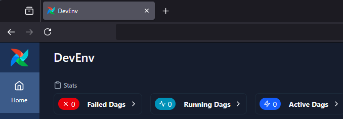

 .. Licensed to the Apache Software Foundation (ASF) under one
    or more contributor license agreements.  See the NOTICE file
    distributed with this work for additional information
    regarding copyright ownership.  The ASF licenses this file
    to you under the Apache License, Version 2.0 (the
    "License"); you may not use this file except in compliance
    with the License.  You may obtain a copy of the License at

 ..   http://www.apache.org/licenses/LICENSE-2.0

 .. Unless required by applicable law or agreed to in writing,
    software distributed under the License is distributed on an
    "AS IS" BASIS, WITHOUT WARRANTIES OR CONDITIONS OF ANY
    KIND, either express or implied.  See the License for the
    specific language governing permissions and limitations
    under the License.

Customizing the UI
==================

.. _customizing-the-ui:

Customizing Dag UI Header and Airflow Page Titles
==================================================

Airflow now allows you to customize the Dag home page header and page title. This will help
distinguish between various installations of Airflow or simply amend the page text.

.. note::

    The custom title will be applied to both the page header and the page title.

To make this change, simply:

1.  Add the configuration option of ``instance_name`` under the ``[webserver]`` section inside ``airflow.cfg``:

.. code-block::

  [webserver]

  instance_name = "DevEnv"

2.  Alternatively, you can set a custom title using the environment variable:

.. code-block::

  AIRFLOW__WEBSERVER__INSTANCE_NAME = "DevEnv"

Screenshots
^^^^^^^^^^^

Before
""""""

.. image:: ../img/change-site-title/default_instance_name_configuration.png

After
"""""

Add custom alert messages on the dashboard
------------------------------------------

Extra alert messages can be shown on the UI dashboard. This can be useful for warning about setup issues
or announcing changes to end users. The following example shows how to add alert messages:

1.  Add the following contents to ``airflow_local_settings.py`` file under ``$AIRFLOW_HOME/config``.
    Each alert message should specify a severity level (``info``, ``warning``, ``error``) using ``category``.

    .. code-block:: python

      from airflow.api_fastapi.common.types import UIAlert

      DASHBOARD_UIALERTS = [
          UIAlert(text="Welcome to Airflow.", category="info"),
          UIAlert(text="Airflow server downtime scheduled for tomorrow at 10:00 AM.", category="warning"),
          UIAlert(text="Critical error detected!", category="error"),
      ]

    See :ref:`Configuring local settings <set-config:configuring-local-settings>` for details on how to
    configure local settings.

2.  Restart Airflow Webserver, and you should now see:

.. image:: ../img/ui-alert-message.png

Alert messages also support Markdown. In the following example, we show an alert message of heading 2 with a link included.

    .. code-block:: python

      DASHBOARD_UIALERTS = [
          UIAlert(text="## Visit [airflow.apache.org](https://airflow.apache.org)", category="info"),
      ]

