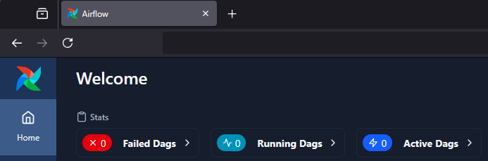

 .. Licensed to the Apache Software Foundation (ASF) under one
    or more contributor license agreements.  See the NOTICE file
    distributed with this work for additional information
    regarding copyright ownership.  The ASF licenses this file
    to you under the Apache License, Version 2.0 (the
    "License"); you may not use this file except in compliance
    with the License.  You may obtain a copy of the License at

 ..   http://www.apache.org/licenses/LICENSE-2.0

 .. Unless required by applicable law or agreed to in writing,
    software distributed under the License is distributed on an
    "AS IS" BASIS, WITHOUT WARRANTIES OR CONDITIONS OF ANY
    KIND, either express or implied.  See the License for the
    specific language governing permissions and limitations
    under the License.

Customizing the UI
==================

.. _customizing-the-ui:

Customizing Dag UI Header and Airflow Page Titles
-------------------------------------------------

Airflow now allows you to customize the Dag home page header and page title. This will help
distinguish between various installations of Airflow or simply amend the page text.

.. note::

    The custom title will be applied to both the page header and the page title.

To make this change, simply:

1.  Add the configuration option of ``instance_name`` under the ``[api]`` section inside ``airflow.cfg``:

.. code-block::

  [api]

  instance_name = "DevEnv"

2.  Alternatively, you can set a custom title using the environment variable:

.. code-block::

  AIRFLOW__API__INSTANCE_NAME = "DevEnv"

Screenshots
^^^^^^^^^^^

Before
""""""

After
"""""

.. image:: ../img/change-site-title/example_instance_name_configuration.png

|

Adding Dashboard Alert Messages
===============================

Extra alert messages can be shown on the Airflow dashboard. This can be useful for warning about setup issues, announcing changes
to end users, or providing real-time status information. Dashboard alerts support both static and dynamic content.

Basic Static Alerts
-------------------

To add static alert messages that remain constant until the webserver is restarted:

1. Create an ``airflow_local_settings.py`` file and place it in ``$PYTHONPATH`` or in the ``$AIRFLOW_HOME/config`` folder.
   (Airflow adds ``$AIRFLOW_HOME/config`` to ``PYTHONPATH`` when Airflow is initialized)

2. Add the following contents to ``airflow_local_settings.py``:

  .. note::
      See :ref:`Configuring local settings <set-config:configuring-local-settings>` for details on how to configure local settings.

  .. code-block:: python

      from airflow.api_fastapi.common.types import UIAlert

      DASHBOARD_UIALERTS = [
          UIAlert("Welcome to Airflow", category="info"),
      ]

3. Restart the Airflow webserver, and you should now see the alert message displayed on the dashboard.

Alert Categories
----------------

You can control the category of the alert message. Available categories include:

- ``"info"`` (default) - Blue informational alerts
- ``"warning"`` - Yellow warning alerts
- ``"error"`` - Red error alerts

.. code-block:: python

      from airflow.api_fastapi.common.types import UIAlert

      DASHBOARD_UIALERTS = [
          UIAlert(text="Welcome to Airflow.", category="info"),
          UIAlert(text="Airflow server downtime scheduled for tomorrow at 10:00 AM.", category="warning"),
          UIAlert(text="Critical error detected!", category="error"),
      ]

.. image:: ../img/ui-alert-message.png

Markdown Content in Alerts
--------------------------

Markdown can be included in alert messages for richer formatting. In the following example, we show an alert
message of heading 2 with a link included:

.. code-block:: python

    from airflow.api_fastapi.common.types import UIAlert

    DASHBOARD_UIALERTS = [
        UIAlert(text="## Visit [airflow.apache.org](https://airflow.apache.org)", category="info"),
    ]

.. image:: ../img/ui-alert-message-markdown.png

Dynamic Dashboard Alerts
------------------------

Dashboard alerts support dynamic content that updates each time the dashboard page is refreshed. This allows for real-time
status updates without requiring webserver restarts. Dynamic alerts must be defined as an instance of an iterable object.
The recommended approach is to create a class that subclasses ``list`` and implements a custom ``__iter__`` method that
yields fresh alerts each time Airflow iterates over the alerts.

.. note::
  When implementing dynamic alerts it is important to keep alert generation logic lightweight to avoid
  impacting dashboard load times. Consider caching results for expensive operations and handle exceptions
  gracefully to prevent alert generation from breaking the UI.

Dynamic alerts are particularly useful for:

- **Real-time notifications**: Display current status updates or announcements
- **Deployment notifications**: Show current deployment status, build progress, or GitOps state
- **Temporary maintenance alerts**: Provide time-sensitive information about ongoing maintenance or issues
- **Environment-specific warnings**: Display different alerts based on current environment conditions
- **External service status**: Show the availability of dependent services or APIs

Creating Dynamic Alerts
^^^^^^^^^^^^^^^^^^^^^^^

To create dynamic alerts, define ``DASHBOARD_UIALERTS`` as an instance of a class that subclasses ``list``
and implements the ``__iter__`` method. The UI will iterate over any number ``UIAlert`` instances yielded by
this method and expose them as alerts on the dashboard page.

The example below demonstrates how logic can be applied to yield alerts dynamically. More practical use
cases might include alerts yielded from APIs, database queries or files.

.. code-block:: python

    import random
    from airflow.api_fastapi.common.types import UIAlert

    class DynamicAlerts(list):
        def __iter__(self):
            # This method is called each time Airflow iterates over DASHBOARD_UIALERTS
            # Example: Flip a coin
            if random.choice([True, False]):
                yield UIAlert("Heads!", category="info")
            else:
                yield UIAlert("Tails!", category="warning")

    # Create an instance of the class
    DASHBOARD_UIALERTS = DynamicAlerts()
