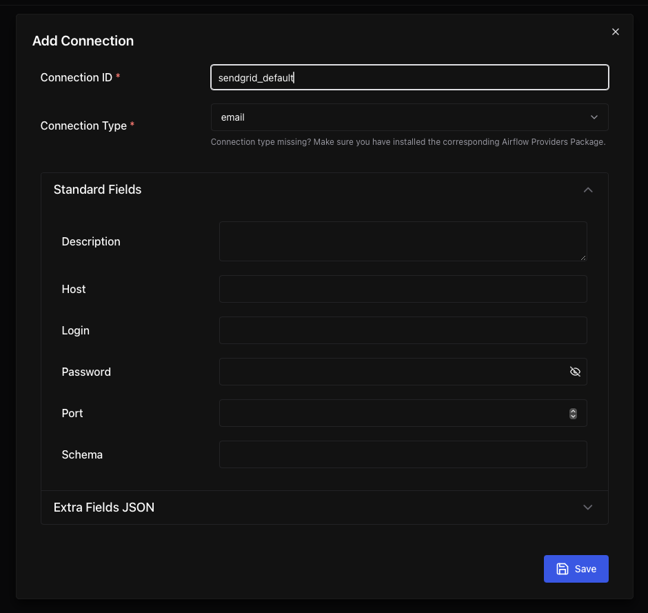

 .. Licensed to the Apache Software Foundation (ASF) under one
    or more contributor license agreements.  See the NOTICE file
    distributed with this work for additional information
    regarding copyright ownership.  The ASF licenses this file
    to you under the Apache License, Version 2.0 (the
    "License"); you may not use this file except in compliance
    with the License.  You may obtain a copy of the License at

 ..   http://www.apache.org/licenses/LICENSE-2.0

 .. Unless required by applicable law or agreed to in writing,
    software distributed under the License is distributed on an
    "AS IS" BASIS, WITHOUT WARRANTIES OR CONDITIONS OF ANY
    KIND, either express or implied.  See the License for the
    specific language governing permissions and limitations
    under the License.

Email Configuration
===================

You can configure the email that is being sent in your ``airflow.cfg``
by setting a ``subject_template`` and/or a ``html_content_template``
in the ``[email]`` section.

.. code-block:: ini

  [email]
  email_backend = airflow.utils.email.send_email_smtp
  subject_template = /path/to/my_subject_template_file
  html_content_template = /path/to/my_html_content_template_file

Equivalent environment variables look like:

.. code-block:: sh

  AIRFLOW__EMAIL__EMAIL_BACKEND=airflow.utils.email.send_email_smtp
  AIRFLOW__EMAIL__SUBJECT_TEMPLATE=/path/to/my_subject_template_file
  AIRFLOW__EMAIL__HTML_CONTENT_TEMPLATE=/path/to/my_html_content_template_file

You can configure a sender's email address by setting ``from_email`` in the ``[email]`` section like:

.. code-block:: ini

  [email]
  from_email = "John Doe <johndoe@example.com>"

Equivalent environment variables look like:

.. code-block:: sh

  AIRFLOW__EMAIL__FROM_EMAIL="John Doe <johndoe@example.com>"

By default, ``email_backend`` is set to ``airflow.utils.email.send_email_smtp``, which sends email over SMTP.

To configure SMTP settings, checkout the :ref:`SMTP <config:smtp>` section in the standard configuration.
If you do not want to store the SMTP credentials in the config or in the environment variables, you can create a
connection called ``smtp_default`` of ``Email`` type, or choose a custom connection name and set the ``email_conn_id`` with its name in
the configuration & store SMTP username-password in it. Other SMTP settings like host, port etc always gets picked up
from the configuration only. The connection can be of any type (for example 'HTTP connection').

If you want to check which email backend is currently set, you can use ``airflow config get-value email email_backend`` command as in
the example below.

.. code-block:: bash

    $ airflow config get-value email email_backend
    airflow.utils.email.send_email_smtp

To access the task's information you use `Jinja Templating <http://jinja.pocoo.org/docs/dev/>`_  in your template files.

For example a ``html_content_template`` file could look like this:

.. code-block::

  Try {{try_number}} out of {{max_tries + 1}} 
  Exception: {{exception_html}} 
  Log: <a href="{{ti.log_url}}">Link</a> 
  Host: {{ti.hostname}} 
  Mark success: <a href="{{ti.mark_success_url}}">Link</a> 

.. note::
    For more information on setting the configuration, see :doc:`set-config`

Alternative email backends
---------------------------

Instead of sending email over SMTP, you can point ``email_backend`` at an implementation provided by a
community provider to send email through a third-party service's API. To use one, install the relevant
provider distribution, set ``email_backend`` to the dotted path of its ``send_email`` function, and set
``email_conn_id`` to a connection holding the credentials it needs.

The list of email backends provided by community-managed providers is available in
:doc:`apache-airflow-providers:core-extensions/email-backends`.
