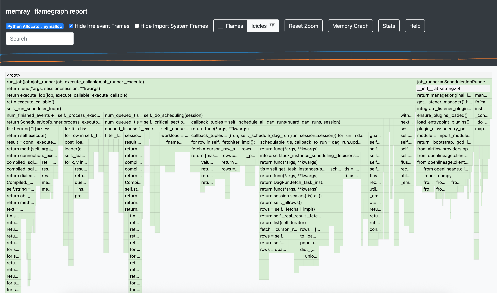

.. Licensed to the Apache Software Foundation (ASF) under one
    or more contributor license agreements.  See the NOTICE file
    distributed with this work for additional information
    regarding copyright ownership.  The ASF licenses this file
    to you under the Apache License, Version 2.0 (the
    "License"); you may not use this file except in compliance
    with the License.  You may obtain a copy of the License at

 ..   http://www.apache.org/licenses/LICENSE-2.0

 .. Unless required by applicable law or agreed to in writing,
    software distributed under the License is distributed on an
    "AS IS" BASIS, WITHOUT WARRANTIES OR CONDITIONS OF ANY
    KIND, either express or implied.  See the License for the
    specific language governing permissions and limitations
    under the License.

.. _memory-profiling:

Memory Profiling with Memray
=============================

Airflow integrates `Memray <https://bloomberg.github.io/memray/>`__, a memory profiler for Python,
to help you diagnose memory usage patterns and identify potential memory leaks in Airflow components.
This guide will walk you through how to profile memory usage in key Airflow components such as the
scheduler, API server, and DAG processor.

.. note::

    Memory profiling is an expensive operation and should generally only be used for debugging purposes
    in development. It is not recommended for production use.
    See :ref:`memory-profiling-precautions` for important precautions.

Prerequisites
-------------

Before you can use memory profiling, you need to install Airflow with the ``memray`` extra:

.. code-block:: bash

    pip install 'apache-airflow[memray]'

Alternatively, if you have an existing Airflow installation:

.. code-block:: bash

    pip install 'memray>=1.19.0'

.. note::

    For more information about supported environments, see the
    `Memray supported environments documentation <https://bloomberg.github.io/memray/supported_environments.html>`__.

Configuring Memory Profiling
-----------------------------

Memory profiling is controlled through Airflow's configuration. You can enable it for specific
components by setting the ``memray_trace_components`` option in the ``[profiling]`` section of your
``airflow.cfg`` file or through environment variables.

Configuration Options
^^^^^^^^^^^^^^^^^^^^^

Add the following to your ``airflow.cfg`` file:

.. code-block:: ini

    [profiling]
    # Comma-separated list of Airflow components to profile with memray
    # Valid components: scheduler, api, dag_processor
    # Invalid component names will be ignored
    memray_trace_components = scheduler,dag_processor,api

Or set it via environment variable:

.. code-block:: bash

    export AIRFLOW__PROFILING__MEMRAY_TRACE_COMPONENTS="scheduler,dag_processor,api"

.. note::

    To disable memory profiling after you've completed your analysis, simply set
    ``memray_trace_components`` to an empty string (or unset the environment variable)
    and restart the affected components.

Step-by-Step Profiling Guide
-----------------------------

This section provides a practical walkthrough of how to profile memory usage in your Airflow deployment.

Step 1: Enable Memory Profiling
^^^^^^^^^^^^^^^^^^^^^^^^^^^^^^^^

First, decide which component you want to profile. For this example, let's profile the scheduler.

Edit your ``airflow.cfg``:

.. code-block:: ini

    [profiling]
    memray_trace_components = scheduler

Or set the environment variable:

.. code-block:: bash

    export AIRFLOW__PROFILING__MEMRAY_TRACE_COMPONENTS=scheduler

Step 2: Restart the Component
^^^^^^^^^^^^^^^^^^^^^^^^^^^^^^

After enabling profiling for a component, you need to restart it for the changes to take effect.

.. code-block:: bash

    # If running standalone
    airflow scheduler

    # If running with systemd
    sudo systemctl restart airflow-scheduler

    # If running with Docker Compose
    docker-compose restart airflow-scheduler

Step 3: Run Your Workload
^^^^^^^^^^^^^^^^^^^^^^^^^^

Let Airflow run normally and perform the operations you want to profile. For example:

- Let the scheduler run for a period of time
- Process specific DAG files that may be problematic

The longer you let it run, the more data you'll collect. However, keep in mind that memory
profiling adds overhead, so a few minutes to an hour is usually sufficient for diagnosis.

Step 4: Retrieve the Profile File
^^^^^^^^^^^^^^^^^^^^^^^^^^^^^^^^^^

Memray will automatically generate a binary profile file in your ``$AIRFLOW_HOME`` directory.
The filename follows the pattern ``<component>_memory.bin``:

.. code-block:: bash

    # Default locations
    $AIRFLOW_HOME/scheduler_memory.bin
    $AIRFLOW_HOME/api_memory.bin
    $AIRFLOW_HOME/dag_processor_memory.bin

If running in a containerized environment, you may need to copy the file from the container:

.. code-block:: bash

    # Docker
    docker cp <container_name>:/path/to/airflow/home/scheduler_memory.bin .

    # Kubernetes
    kubectl cp <namespace>/<pod_name>:/path/to/airflow/home/scheduler_memory.bin ./scheduler_memory.bin

Step 5: Analyze the Profile
^^^^^^^^^^^^^^^^^^^^^^^^^^^^

Once you have the profile file, use Memray's analysis tools to visualize and understand the memory usage.

Generate a Flamegraph
"""""""""""""""""""""

The flamegraph is the most common way to visualize memory allocations:

.. code-block:: bash

    memray flamegraph scheduler_memory.bin

This will generate an HTML file (``memray-flamegraph-scheduler_memory.html``) that you can open in a web browser.

The flamegraph shows the call stack with the width of each box representing the amount of memory allocated
by that function. Functions at the top of the graph are leaf functions that directly allocate memory.

Other Analysis Methods
""""""""""""""""""""""

Memray provides several other ways to analyze memory profiles, including table reports, summary statistics,
live monitoring, and more. For detailed information on all available analysis commands and options,
refer to the `Memray documentation on analyzing results <https://bloomberg.github.io/memray/run.html>`__.

Interpreting Results
--------------------

When analyzing your memory profile, look for:

**High Memory Allocation Functions**
    Functions that allocate large amounts of memory or are called frequently. These are the widest
    bars in the flamegraph or top entries in the table report.

**Memory Retention Patterns**
    If you see certain functions consistently holding memory over time, this could indicate a memory leak.

**Unexpected Allocations**
    Look for memory allocations in places you wouldn't expect, which might indicate inefficient code
    or unnecessary data structures.

**Third-Party Library Usage**
    Sometimes memory issues are caused by how third-party libraries are used. The flamegraph will
    show you if a particular library is responsible for high memory usage.

.. _memory-profiling-precautions:

Precautions
--------------

1. **Profile in Non-Production Environments**
   Memory profiling adds significant overhead, including increased memory usage and performance
   degradation. Use it in development that mirror your production setup.

2. **Use Representative Workloads**
   Ensure the workload you're profiling is representative of your actual use case.

3. **Manage Profile File Sizes**
   Profile files can grow very large (hundreds of MB to several GB) and may consume significant
   disk space. Monitor available disk space during profiling sessions and regularly clean up
   old profile files after analysis to prevent storage issues.

Further Reading
---------------

For more detailed information about Memray and its capabilities, refer to the official documentation:

- `Memray Documentation <https://bloomberg.github.io/memray/>`__
- `Memray Getting Started Guide <https://bloomberg.github.io/memray/getting_started.html>`__
- `Understanding Memray Output <https://bloomberg.github.io/memray/run.html>`__
- `Memray API Reference <https://bloomberg.github.io/memray/api.html>`__
