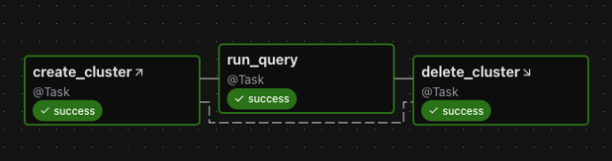
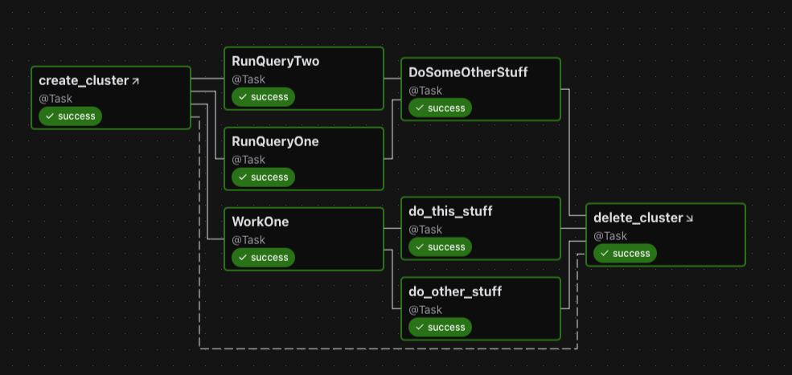
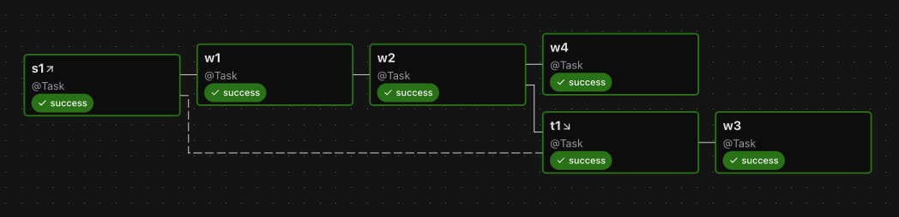
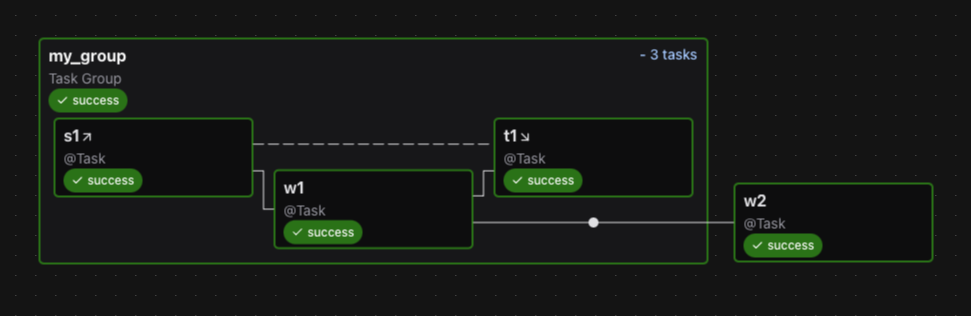
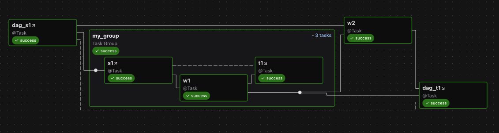
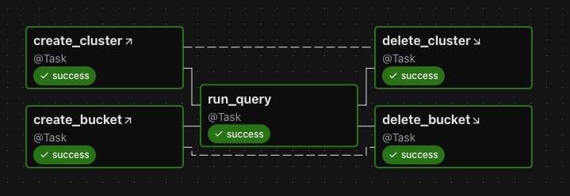
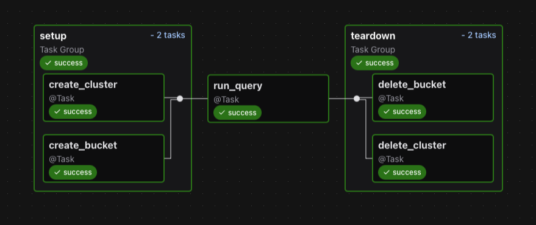

 .. Licensed to the Apache Software Foundation (ASF) under one
    or more contributor license agreements.  See the NOTICE file
    distributed with this work for additional information
    regarding copyright ownership.  The ASF licenses this file
    to you under the Apache License, Version 2.0 (the
    "License"); you may not use this file except in compliance
    with the License.  You may obtain a copy of the License at

 ..   http://www.apache.org/licenses/LICENSE-2.0

 .. Unless required by applicable law or agreed to in writing,
    software distributed under the License is distributed on an
    "AS IS" BASIS, WITHOUT WARRANTIES OR CONDITIONS OF ANY
    KIND, either express or implied.  See the License for the
    specific language governing permissions and limitations
    under the License.

Setup and Teardown
~~~~~~~~~~~~~~~~~~

In data workflows it's common to create a resource (such as a compute resource), use it to do some work, and then tear it down. Airflow provides setup and teardown tasks to support this need.

Key features of setup and teardown tasks:

  * If you clear a task, its setups and teardowns will be cleared.
  * By default, teardown tasks are ignored for the purpose of evaluating Dag run state.
  * A teardown task will run if its setup was successful, even if its work tasks failed. But it will skip if the setup was skipped.
  * Teardown tasks are ignored when setting dependencies against task groups.
  * Teardown will also be carried out if the Dag run is manually set to "failed" or "success" to ensure resources will be cleaned-up.

How setup and teardown works
""""""""""""""""""""""""""""

Basic usage
"""""""""""

Suppose you have a Dag that creates a cluster, runs a query, and deletes the cluster. Without using setup and teardown tasks you might set these relationships:

.. code-block:: python

  create_cluster >> run_query >> delete_cluster

To enable create_cluster and delete_cluster as setup and teardown tasks, we mark them as such methods ``as_setup`` and ``as_teardown`` and add an upstream / downstream relationship between them:

.. code-block:: python

  create_cluster.as_setup() >> run_query >> delete_cluster.as_teardown()
  create_cluster >> delete_cluster

For convenience we can do this in one line by passing ``create_cluster`` to the ``as_teardown`` method:

.. code-block:: python

  create_cluster >> run_query >> delete_cluster.as_teardown(setups=create_cluster)

Here's the graph for this Dag:

Observations:

  * If you clear ``run_query`` to run it again, then both ``create_cluster`` and ``delete_cluster`` will be cleared.
  * If ``run_query`` fails, then ``delete_cluster`` will still run.
  * The success of the Dag run will depend *only* on the success of ``run_query``.

Additionally, if we have multiple tasks to wrap, we can use the teardown as a context manager:

.. code-block:: python

  with delete_cluster().as_teardown(setups=create_cluster()):
      [RunQueryOne(), RunQueryTwo()] >> DoSomeOtherStuff()
      WorkOne() >> [do_this_stuff(), do_other_stuff()]

This will set create_cluster to run before the tasks in the context, and delete_cluster after them.

Here it is, shown in the graph:

Note that if you are attempting to add an already-instantiated task to a setup context you need to do it explicitly:

.. code-block:: python

  with my_teardown_task as scope:
      scope.add_task(work_task)  # work_task was already instantiated elsewhere

Setup "scope"
"""""""""""""

Tasks between a setup and its teardown are in the "scope" of the setup / teardown pair.

Let's look at an example:

.. code-block:: python

    s1 >> w1 >> w2 >> t1.as_teardown(setups=s1) >> w3
    w2 >> w4

And the graph:

In the above example, ``w1`` and ``w2`` are "between" ``s1`` and ``t1`` and therefore are assumed to require ``s1``. Thus if ``w1`` or ``w2`` is cleared, so too will be ``s1`` and ``t1``.  But if ``w3`` or ``w4`` is cleared, neither ``s1`` nor ``t1`` will be cleared.

You can have multiple setup tasks wired to a single teardown.  The teardown will run if at least one of the setups completed successfully.

You can have a setup without a teardown:

.. code-block:: python

    create_cluster >> run_query >> other_task

In this case, everything downstream of create_cluster is assumed to require it.  So if you clear other_task, it will also clear create_cluster.  Suppose that we add a teardown for create_cluster after run_query:

.. code-block:: python

    create_cluster >> run_query >> other_task
    run_query >> delete_cluster.as_teardown(setups=create_cluster)

Now, Airflow can infer that other_task does not require create_cluster, so if we clear other_task, create_cluster will not also be cleared.

In that example, we (in our pretend docs land) actually wanted to delete the cluster.  But supposing we did not, and we just wanted to say "other_task does not require create_cluster", then we could use an EmptyOperator to limit the setup's scope:

.. code-block:: python

    create_cluster >> run_query >> other_task
    run_query >> EmptyOperator(task_id="cluster_teardown").as_teardown(setups=create_cluster)

Implicit ALL_SUCCESS constraint
"""""""""""""""""""""""""""""""

Any task in the scope of a setup has an implicit "all_success" constraint on its setups.
This is necessary to ensure that if a task with indirect setups is cleared, it will
wait for them to complete.  If a setup fails or is skipped, the work tasks which depend
them will be marked ask failures or skips.  We also require that any non-teardown directly
downstream of a setup must have trigger rule ALL_SUCCESS.

Controlling Dag run state
"""""""""""""""""""""""""

Another feature of setup / teardown tasks is you can choose whether or not the teardown task should have an impact on Dag run state.  Perhaps you don't care if the "cleanup" work performed by your teardown task fails, and you only consider the Dag run a failure if the "work" tasks fail.  By default, teardown tasks are not considered for Dag run state.

Continuing with the example above, if you want the run's success to depend on ``delete_cluster``, then set ``on_failure_fail_dagrun=True`` when setting ``delete_cluster`` as teardown. For example:

.. code-block:: python

  create_cluster >> run_query >> delete_cluster.as_teardown(setups=create_cluster, on_failure_fail_dagrun=True)

Authoring with task groups
""""""""""""""""""""""""""

When adding dependency from task group to task group, or from task group to *task*, we ignore teardowns.  This allows teardowns to run in parallel, and allows Dag execution to proceed even if teardown tasks fail.

Consider this example:

.. code-block:: python

    with TaskGroup("my_group") as tg:
        s1 = s1()
        w1 = w1()
        t1 = t1()
        s1 >> w1 >> t1.as_teardown(setups=s1)
    w2 = w2()
    tg >> w2

Graph:

If ``t1`` were not a teardown task, then this Dag would effectively be ``s1 >> w1 >> t1 >> w2``.  But since we have marked ``t1`` as a teardown, it's ignored in ``tg >> w2``.  So the Dag is equivalent to the following:

.. code-block:: python

    s1 >> w1 >> [t1.as_teardown(setups=s1), w2]

Now let's consider an example with nesting:

.. code-block:: python

    with TaskGroup("my_group") as tg:
        s1 = s1()
        w1 = w1()
        t1 = t1()
        s1 >> w1 >> t1.as_teardown(setups=s1)
    w2 = w2()
    tg >> w2
    dag_s1 = dag_s1()
    dag_t1 = dag_t1()
    dag_s1 >> [tg, w2] >> dag_t1.as_teardown(setups=dag_s1)

Graph:

In this example ``s1`` is downstream of ``dag_s1``, so it must wait for ``dag_s1`` to complete successfully.  But ``t1`` and ``dag_t1`` can run concurrently, because ``t1`` is ignored in the expression ``tg >> dag_t1``.  If you clear ``w2``, it will clear ``dag_s1`` and ``dag_t1``, but not anything in the task group.

Running setups and teardowns in parallel
""""""""""""""""""""""""""""""""""""""""

You can run setup tasks in parallel:

.. code-block:: python

    (
        [create_cluster, create_bucket]
        >> run_query
        >> [delete_cluster.as_teardown(setups=create_cluster), delete_bucket.as_teardown(setups=create_bucket)]
    )

Graph:

It can be nice visually to put them in a group:

.. code-block:: python

    with TaskGroup("setup") as tg_s:
        create_cluster = create_cluster()
        create_bucket = create_bucket()
    run_query = run_query()
    with TaskGroup("teardown") as tg_t:
        delete_cluster = delete_cluster().as_teardown(setups=create_cluster)
        delete_bucket = delete_bucket().as_teardown(setups=create_bucket)
    tg_s >> run_query >> tg_t

And the graph:

Trigger rule behavior for teardowns
"""""""""""""""""""""""""""""""""""

Teardowns use a (non-configurable) trigger rule called ALL_DONE_SETUP_SUCCESS.  With this rule, as long as all upstreams are done and at least one directly connected setup is successful, the teardown will run.  If all of a teardown's setups were skipped or failed, those states will propagate to the teardown.

Side-effect on manual Dag state changes
"""""""""""""""""""""""""""""""""""""""

As teardown tasks are often used to clean-up resources they need to run also if the Dag is manually terminated. For the purpose of early termination a user can manually mark the Dag run as "success" or "failed" which kills all tasks before completion. If the Dag contains teardown tasks, they will still be executed. Therefore as a side effect allowing teardown tasks to be scheduled, a Dag will not be immediately set to a terminal state if the user requests so.
