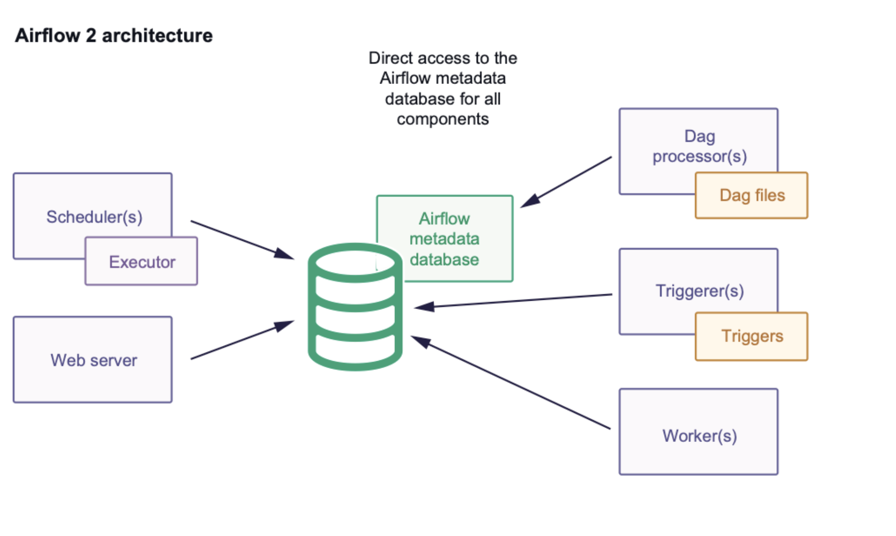
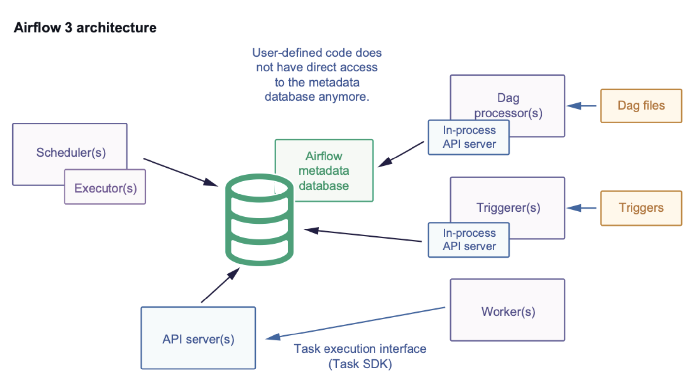

 .. Licensed to the Apache Software Foundation (ASF) under one
    or more contributor license agreements.  See the NOTICE file
    distributed with this work for additional information
    regarding copyright ownership.  The ASF licenses this file
    to you under the Apache License, Version 2.0 (the
    "License"); you may not use this file except in compliance
    with the License.  You may obtain a copy of the License at

 ..   http://www.apache.org/licenses/LICENSE-2.0

 .. Unless required by applicable law or agreed to in writing,
    software distributed under the License is distributed on an
    "AS IS" BASIS, WITHOUT WARRANTIES OR CONDITIONS OF ANY
    KIND, either express or implied.  See the License for the
    specific language governing permissions and limitations
    under the License.

Upgrading to Airflow 3
=======================

Apache Airflow 3 is a major release and contains :ref:`breaking changes<breaking-changes>`. This guide walks you through the steps required to upgrade from Airflow 2.x to Airflow 3.0.

Understanding Airflow 3.x Architecture Changes
-----------------------------------------------

Airflow 3.x introduces significant architectural changes that improve security, scalability, and maintainability. Understanding these changes helps you prepare for the upgrade and adapt your workflows accordingly.

Airflow 2.x Architecture
^^^^^^^^^^^^^^^^^^^^^^^^

- All components communicate directly with the Airflow metadata database.
- Airflow 2 was designed to run all components within the same network space: task code and task execution code (airflow package code that runs user code) run in the same process.
- Workers communicate directly with the Airflow database and execute all user code.
- User code could import sessions and perform malicious actions on the Airflow metadata database.
- The number of connections to the database was excessive, leading to scaling challenges.

Airflow 3.x Architecture
^^^^^^^^^^^^^^^^^^^^^^^^

- The API server is currently the sole access point for the metadata DB for tasks and workers.
- It supports several applications: the Airflow REST API, an internal API for the Airflow UI that hosts static JS, and an API for workers to interact with when executing TIs via the task execution interface.
- Workers communicate with the API server instead of directly with the database.
- Dag processor and Triggerer utilize the task execution mechanism for their tasks, especially when they require variables or connections.

Database Access Restrictions
^^^^^^^^^^^^^^^^^^^^^^^^^^^^
In Airflow 3, direct metadata database access from task code is now restricted. This is a key security and architectural improvement that affects how Dag authors interact with Airflow resources:

- **No Direct Database Access**: Task code can no longer directly import and use Airflow database sessions or models.
- **API-Based Resource Access**: All runtime interactions (state transitions, heartbeats, XComs, and resource fetching) are handled through a dedicated Task Execution API.
- **Enhanced Security**: This ensures isolation and security by preventing malicious task code from accessing or modifying the Airflow metadata database.
- **Stable Interface**: The Task SDK provides a stable, forward-compatible interface for accessing Airflow resources without direct database dependencies.

Step 1: Take care of prerequisites
----------------------------------

- Make sure that you are on Airflow 2.7 or later. It is recommended to upgrade to latest 2.x and then to Airflow 3.
- Make sure that your Python version is in the supported list.
- Ensure that you are not using any features or functionality that have been :ref:`removed in Airflow 3<breaking-changes>`.

Step 2: Clean and back up your existing Airflow Instance
---------------------------------------------------------

- It is highly recommended that you make a backup of your Airflow instance, specifically your Airflow metadata database before starting the migration process.

    - If you do not have a "hot backup" capability for your database, you should do it after shutting down your Airflow instances, so that the backup of your database will be consistent. For example, if you don't turn off your Airflow instance, the backup of the database will not include all TaskInstances or DagRuns.

    - If you did not make a backup and your migration fails, you might end up in a half-migrated state. This can be caused by, for example, a broken network connection between your Airflow CLI and the database during the migration. Having a backup is an important precaution to avoid problems like this.

- A long running Airflow instance can accumulate a substantial amount of data that are no longer required (for example, old XCom data). Schema changes will be a part of the Airflow 3
  upgrade process. These schema changes can take a long time if the database is large. For a faster, safer migration, we recommend that you clean up your Airflow meta-database before the upgrade.
  You can use the ``airflow db clean`` :ref:`Airflow CLI command<cli-db-clean>` to trim your Airflow database.

- Ensure that there are no errors related to Dag processing, such as ``AirflowDagDuplicatedIdException``.  You should
  be able to run ``airflow dags reserialize`` with no errors.  If you have to resolve errors from Dag processing,
  ensure you deploy your changes to your old instance prior to upgrade, and wait until your Dags have all been reprocessed
  (and all errors gone) before you proceed with upgrade.

Step 3: Dag authors - Check your Airflow Dags for compatibility
----------------------------------------------------------------

To minimize friction for users upgrading from prior versions of Airflow, we have created a Dag upgrade check utility using `Ruff <https://docs.astral.sh/ruff/>`_ combined with `AIR <https://docs.astral.sh/ruff/rules/#airflow-air>`_ rules.
The rules AIR301 and AIR302 indicate breaking changes in Airflow 3, while AIR311 and AIR312 highlight changes that are not currently breaking but are strongly recommended for updates.

The latest available ``ruff`` version will have the most up-to-date rules, but be sure to use at least version ``0.13.1``. The below example demonstrates how to check
for Dag incompatibilities that will need to be fixed before they will work as expected on Airflow 3.

.. code-block:: bash

    ruff check dags/ --select AIR301

To preview the recommended fixes, run the following command:

.. code-block:: bash

    ruff check dags/ --select AIR301 --show-fixes

Some changes can be automatically fixed. To do so, run the following command:

.. code-block:: bash

    ruff check dags/ --select AIR301 --fix

Some of the fixes are marked as unsafe. Unsafe fixes usually do not break Dag code. They're marked as unsafe as they may change some runtime behavior. For more information, see `Fix Safety <https://docs.astral.sh/ruff/linter/#fix-safety>`_.
To trigger these fixes, run the following command:

.. code-block:: bash

    ruff check dags/ --select AIR301 --fix --unsafe-fixes

.. note::

    In AIR rules, unsafe fixes involve changing import paths while keeping the name of the imported member the same. For instance, changing the import from ``from airflow.sensors.base_sensor_operator import BaseSensorOperator`` to ``from airflow.sdk.bases.sensor import BaseSensorOperator`` requires ruff to remove the original import before adding the new one. In contrast, safe fixes include changes to both the member name and the import path, such as changing ``from airflow.datasets import Dataset`` to `from airflow.sdk import Asset``. These adjustments do not require ruff to remove the old import. To remove unused legacy imports, it is necessary to enable the `unused-import` rule (F401) <https://docs.astral.sh/ruff/rules/unused-import/#unused-import-f401>.

You can also configure these flags through configuration files. See `Configuring Ruff <https://docs.astral.sh/ruff/configuration/>`_ for details.

Key Import Updates
^^^^^^^^^^^^^^^^^^

While ruff can automatically fix many import issues, here are the key import changes you'll need to make to ensure your DAGs and other
code import Airflow components correctly in Airflow 3. The older paths are deprecated and will be removed in a future Airflow version.

.. list-table::
   :header-rows: 1
   :widths: 50, 50

   * - **Old Import Path (Deprecated)**
     - **New Import Path (airflow.sdk)**
   * - ``airflow.decorators.dag``
     - ``airflow.sdk.dag``
   * - ``airflow.decorators.task``
     - ``airflow.sdk.task``
   * - ``airflow.decorators.task_group``
     - ``airflow.sdk.task_group``
   * - ``airflow.decorators.setup``
     - ``airflow.sdk.setup``
   * - ``airflow.decorators.teardown``
     - ``airflow.sdk.teardown``
   * - ``airflow.models.dag.DAG``
     - ``airflow.sdk.DAG``
   * - ``airflow.models.baseoperator.BaseOperator``
     - ``airflow.sdk.BaseOperator``
   * - ``airflow.models.param.Param``
     - ``airflow.sdk.Param``
   * - ``airflow.models.param.ParamsDict``
     - ``airflow.sdk.ParamsDict``
   * - ``airflow.models.baseoperatorlink.BaseOperatorLink``
     - ``airflow.sdk.BaseOperatorLink``
   * - ``airflow.sensors.base.BaseSensorOperator``
     - ``airflow.sdk.BaseSensorOperator``
   * - ``airflow.hooks.base.BaseHook``
     - ``airflow.sdk.BaseHook``
   * - ``airflow.notifications.basenotifier.BaseNotifier``
     - ``airflow.sdk.BaseNotifier``
   * - ``airflow.utils.task_group.TaskGroup``
     - ``airflow.sdk.TaskGroup``
   * - ``airflow.datasets.Dataset``
     - ``airflow.sdk.Asset``
   * - ``airflow.datasets.DatasetAlias``
     - ``airflow.sdk.AssetAlias``
   * - ``airflow.datasets.DatasetAll``
     - ``airflow.sdk.AssetAll``
   * - ``airflow.datasets.DatasetAny``
     - ``airflow.sdk.AssetAny``
   * - ``airflow.models.connection.Connection``
     - ``airflow.sdk.Connection``
   * - ``airflow.models.context.Context``
     - ``airflow.sdk.Context``
   * - ``airflow.models.variable.Variable``
     - ``airflow.sdk.Variable``
   * - ``airflow.io.*``
     - ``airflow.sdk.io.*``

**Migration Timeline**

- **Airflow 3.1**: Legacy imports show deprecation warnings but continue to work
- **Future Airflow version**: Legacy imports will be **removed**

Step 4: Install the Standard Provider
--------------------------------------

- Some of the commonly used Operators, Sensors, and Triggers which were bundled as part of the ``airflow-core`` package (for example ``BashOperator``, ``PythonOperator``, ``ExternalTaskSensor``, ``FileSensor``, etc.)
  have now been split out into a separate package: ``apache-airflow-providers-standard``.
- For convenience, this package can also be installed on Airflow 2.x versions, so that Dags can be modified to reference these Operators from the standard provider
  package instead of Airflow Core.

Step 5: Review custom written tasks for direct DB access
--------------------------------------------------------

In Airflow 3, operators cannot access the Airflow metadata database directly using database sessions.
If you have custom operators, review your code to ensure there are no direct database access calls.
You can follow examples in https://github.com/apache/airflow/issues/49187 to learn how to modify your code if needed.

If you have custom operators or task code that previously accessed the metadata database directly, you must migrate to one of the following approaches:

Recommended Approach: Use Airflow Python Client
^^^^^^^^^^^^^^^^^^^^^^^^^^^^^^^^^^^^^^^^^^^^^^^

Use the official `Airflow Python Client <https://github.com/apache/airflow-client-python>`_ to interact with
Airflow metadata database via REST API. The Python Client has APIs defined for most use cases, including DagRuns,
TaskInstances, Variables, Connections, XComs, and more.

**Pros:**
- No direct database network access required from workers
- Most aligned with Airflow 3's API-first architecture
- No database credentials needed in worker environment (uses API tokens)
- Workers don't need database drivers installed
- Centralized access control and authentication via API server

**Cons:**
- Requires installing ``apache-airflow-client`` package
- Requires acquisition of access tokens by performing API call to ``/auth/token`` and rotating them as needed
- Requires API server availability and network access to API server
- Not all database operations may be exposed via API endpoints

.. note::
   If you need functionality that is not available via the Airflow Python Client, consider requesting new API endpoints or Task SDK features. The Airflow community prioritizes adding missing API capabilities over enabling direct database access.

Known Workaround: Use DbApiHook (PostgresHook or MySqlHook)
^^^^^^^^^^^^^^^^^^^^^^^^^^^^^^^^^^^^^^^^^^^^^^^^^^^^^^^^^^^^

.. warning::
   This approach is **NOT recommended** and is documented only as a known workaround for users who cannot use the Airflow Python Client. This approach has significant limitations and **will** break in future Airflow versions.

   **Important considerations:**

   - **Will break in future versions**: This approach will break in Airflow 3.2+ and beyond. You are responsible for adapting your code when schema changes occur.
   - **Database schema is NOT a public API**: The Airflow metadata database schema can change at any time without notice. Schema changes will break your queries without warning.
   - **Breaks task isolation**: This contradicts one of Airflow 3's core features - task isolation. Tasks should not directly access the metadata database.
   - **Performance implications**: This reintroduces Airflow 2 behavior where each task opens separate database connections, dramatically changing performance characteristics and scalability.

If your use case cannot be addressed using the Python Client and you understand the risks above, you ma use database hooks to query your metadata database directly. Create a database
connection (PostgreSQL or MySQL, matching your metadata database type) pointing to your metadata database
and use Database Hooks in Airflow.

**Note:** These hooks connect directly to the database (not via
the API server) using database drivers like psycopg2 or mysqlclient.

**Example using PostgresHook (MySql has similar interface too)**

.. code-block:: python

   from airflow.sdk import task
   from airflow.providers.postgres.hooks.postgres import PostgresHook

   @task
   def get_connections_from_db():
       hook = PostgresHook(postgres_conn_id="metadata_postgres")
       records = hook.get_records(
           sql="""
           SELECT conn_id, conn_type, host, schema, login
           FROM connection
           WHERE conn_type = 'postgres'
           LIMIT 10;
           """
       )

       return records

**Example using SQLExecuteQueryOperator**

You can also use ``SQLExecuteQueryOperator`` if you prefer to use operators instead of hooks:

.. code-block:: python

   from airflow.providers.common.sql.operators.sql import SQLExecuteQueryOperator

   query_task = SQLExecuteQueryOperator(
       task_id="query_metadata",
       conn_id="metadata_postgres",
       sql="SELECT conn_id, conn_type FROM connection WHERE conn_type = 'postgres'",
       do_xcom_push=True,
   )

.. note::
   Always use **read-only database credentials** for metadata database connections and it is recommended to use temporary credentials.

Step 6: Deployment Managers - Upgrade your Airflow Instance
------------------------------------------------------------

For an easier and safer upgrade process, we have also created a utility to upgrade your Airflow instance configuration.

The first step is to run this configuration check utility as shown below:

.. code-block:: bash

    airflow config update

This configuration utility can also update your configuration to automatically be compatible with Airflow 3. This can be done as shown below:

.. code-block:: bash

    airflow config update --fix

The biggest part of an Airflow upgrade is the database upgrade. The database upgrade process for Airflow 3 is the same as for Airflow 2.7 or later:

.. code-block:: bash

    airflow db migrate

If you have plugins that use Flask-AppBuilder views ( ``appbuilder_views`` ), Flask-AppBuilder menu items ( ``appbuilder_menu_items`` ), or Flask blueprints ( ``flask_blueprints`` ), you will either need to convert
them to FastAPI apps or ensure you install the FAB provider which provides a backwards compatibility layer for Airflow 3.
Ideally, you should convert your plugins to the Airflow 3 Plugin interface i.e External Views (``external_views``), Fast API apps (``fastapi_apps``)
and FastAPI middlewares (``fastapi_root_middlewares``).

If you use the Airflow Helm Chart to deploy Airflow, please check your defined values against configuration options available in Airflow 3.
All configuration options below ``webserver`` need to be changed to ``apiServer``. Consider that many parameters have been renamed or removed.

Step 7: Changes to your startup scripts
---------------------------------------

In Airflow 3, the Webserver has become a generic API server. The API server can be started up using the following command:

.. code-block:: bash

    airflow api-server

The Dag processor must now be started independently, even for local or development setups:

.. code-block:: bash

    airflow dag-processor

You should now be able to start up your Airflow 3 instance.

Step 8: Things to check
-----------------------

Please consider checking the following things after upgrading your Airflow instance:

- If you configured Single-Sign-On (SSO) using OAuth, OIDC, or LDAP, make sure that the authentication is working as expected.
  If you use a custom ``webserver_config.py`` you need to replace ``from airflow.www.security import AirflowSecurityManager``
  with ``from airflow.providers.fab.auth_manager.security_manager.override import FabAirflowSecurityManagerOverride``.

.. _breaking-changes:

Breaking Changes
================

Some capabilities which were deprecated in Airflow 2.x are not available in Airflow 3.
These include:

- **SubDAGs**: Replaced by TaskGroups, Assets, and Data Aware Scheduling.
- **Sequential Executor**: Replaced by LocalExecutor, which can be used with SQLite for local development use cases.
- **CeleryKubernetesExecutor and LocalKubernetesExecutor**: Replaced by `Multiple Executor Configuration <https://airflow.apache.org/docs/apache-airflow/stable/core-concepts/executor/index.html#using-multiple-executors-concurrently>`_
- **SLAs**: Deprecated and removed; replaced with :doc:`Deadline Alerts </howto/deadline-alerts>`.
- **Subdir**: Used as an argument on many CLI commands, ``--subdir`` or ``-S`` has been superseded by :doc:`Dag bundles </administration-and-deployment/dag-bundles>`.
- **REST API** (``/api/v1``) replaced: Use the modern FastAPI-based stable ``/api/v2`` instead; see :doc:`Airflow API v2 </stable-rest-api-ref>` for details.
- **Some Airflow context variables**: The following keys are no longer available in a :ref:`task instance's context <templates:variables>`. If not replaced, will cause Dag errors:
  - ``tomorrow_ds``
  - ``tomorrow_ds_nodash``
  - ``yesterday_ds``
  - ``yesterday_ds_nodash``
  - ``prev_ds``
  - ``prev_ds_nodash``
  - ``prev_execution_date``
  - ``prev_execution_date_success``
  - ``next_execution_date``
  - ``next_ds_nodash``
  - ``next_ds``
  - ``execution_date``
- The ``catchup_by_default`` Dag parameter is now ``False`` by default.
- The ``create_cron_data_intervals`` configuration is now ``False`` by default. This means that the ``CronTriggerTimetable`` will be used by default instead of the ``CronDataIntervalTimetable``
- **Simple Auth** is now default ``auth_manager``. To continue using FAB as the Auth Manager, please install the FAB provider and set ``auth_manager`` to ``FabAuthManager``:

  .. code-block:: ini

      airflow.providers.fab.auth_manager.fab_auth_manager.FabAuthManager
- **AUTH API** api routes defined in the auth manager are prefixed with the ``/auth`` route. Urls consumed outside of the application such as oauth redirect urls will have to updated accordingly. For example an oauth redirect url that was ``https://<your-airflow-url.com>/oauth-authorized/google`` in Airflow 2.x will be ``https://<your-airflow-url.com>/auth/oauth-authorized/google`` in Airflow 3.x
