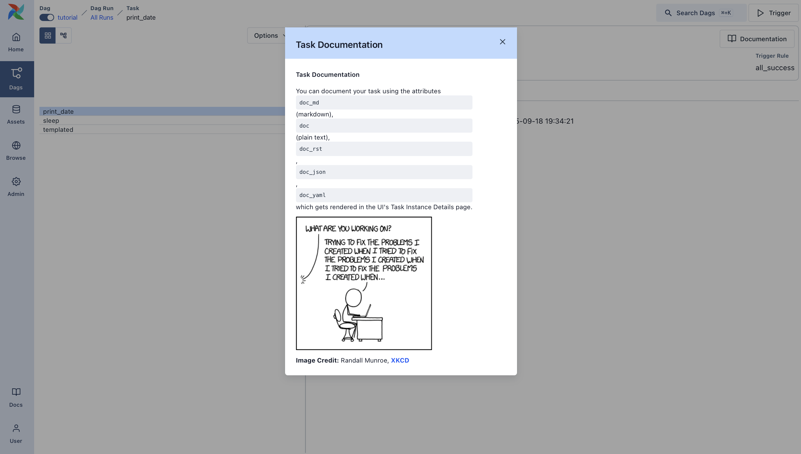
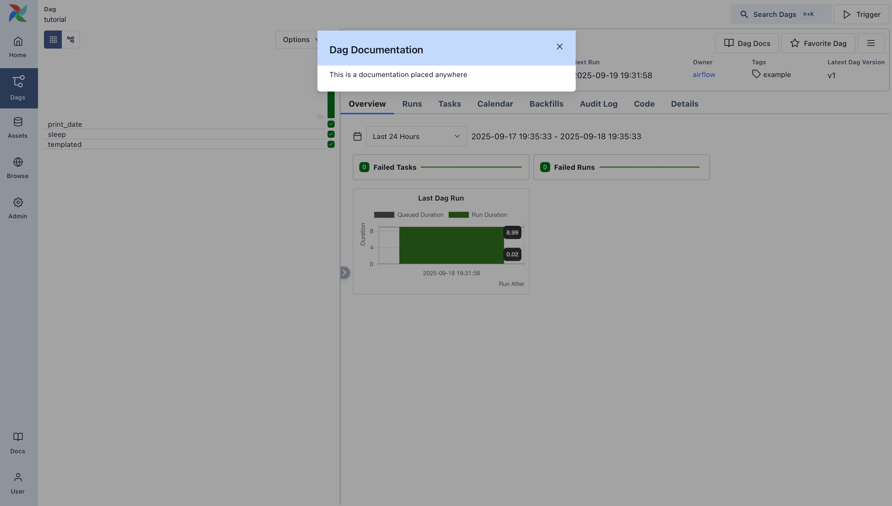

 .. Licensed to the Apache Software Foundation (ASF) under one
    or more contributor license agreements.  See the NOTICE file
    distributed with this work for additional information
    regarding copyright ownership.  The ASF licenses this file
    to you under the Apache License, Version 2.0 (the
    "License"); you may not use this file except in compliance
    with the License.  You may obtain a copy of the License at

 ..   http://www.apache.org/licenses/LICENSE-2.0

 .. Unless required by applicable law or agreed to in writing,
    software distributed under the License is distributed on an
    "AS IS" BASIS, WITHOUT WARRANTIES OR CONDITIONS OF ANY
    KIND, either express or implied.  See the License for the
    specific language governing permissions and limitations
    under the License.

Airflow 101: Building Your First Workflow
=========================================
Welcome to world of Apache Airflow! In this tutorial, we'll guide you through the essential concepts of Airflow, helping
you understand how to write your first Dag. Whether you're familiar with Python or just starting out, we'll make the
journey enjoyable and straightforward.

What is a Dag?
--------------
At its core, a Dag is a collection of tasks organized in a way that reflects their relationships and dependencies. It's
like a roadmap for your workflow, showing how each task connects to the others. Don't worry if this sounds a bit complex;
we'll break it down step by step.

Example Pipeline definition
---------------------------
Let's start with a simple example of a pipeline definition. Although it might seem overwhelming at first, we'll explain
each line in detail.

.. exampleinclude:: /../src/airflow/example_dags/tutorial.py
    :language: python
    :start-after: [START tutorial]
    :end-before: [END tutorial]

Understanding the Dag Definition File
-------------------------------------
Think of the Airflow Python script as a configuration file that lays out the structure of your Dag in code. The actual
tasks you define here run in a different environment, which means this script isn't meant for data processing. Its main
job is to define the Dag object, and it needs to evaluate quickly since the Dag File Processor checks it regularly for
any changes.

Importing Modules
-----------------
To get started, we need to import the necessary libraries. This is a typical first step in any Python script.

.. exampleinclude:: /../src/airflow/example_dags/tutorial.py
    :language: python
    :start-after: [START import_module]
    :end-before: [END import_module]

|

For more details on how Python and Airflow handle modules, check out
:doc:`/administration-and-deployment/modules_management`.

Setting Default Arguments
-------------------------
When creating a Dag and its tasks, you can either pass arguments directly to each task or define a set of default
parameters in a dictionary. The latter approach is usually more efficient and cleaner.

.. exampleinclude:: /../src/airflow/example_dags/tutorial.py
    :language: python
    :dedent: 4
    :start-after: [START default_args]
    :end-before: [END default_args]

|

If you want to dive deeper into the parameters of the BaseOperator, take a look at the documentation for
:py:class:`airflow.sdk.BaseOperator` documentation.

Creating a Dag
--------------
Next, we'll need to create a Dag object to house our tasks. We'll provide a unique identifier for the Dag, known as the
``dag_id``, and specify the default arguments we just defined. We'll also set a schedule for our Dag to run every day.

.. exampleinclude:: /../src/airflow/example_dags/tutorial.py
    :language: python
    :start-after: [START instantiate_dag]
    :end-before: [END instantiate_dag]

Understanding Operators
-----------------------
An operator represents a unit of work in Airflow. They are the building blocks of your workflows, allowing you to
define what tasks will be executed. While we can use operators for many tasks, Airflow also offers the :doc:`TaskFlow API <taskflow>`
for a more Pythonic way to define workflows, which we'll touch on later.

All operators derive from the ``BaseOperator``, which includes the essential arguments needed to run tasks in Airflow.
Some popular operators include the ``PythonOperator``, ``BashOperator``, and ``KubernetesPodOperator``. In this tutorial, we'll
focus on the ``BashOperator`` to execute some simple bash commands.

Defining Tasks
--------------
To use an operator, you must instantiate it as a task. Tasks dictate how the operator will perform its work within the
Dag's context. In the example below, we instantiate the BashOperator twice to run two different bash scripts. The
``task_id`` serves as a unique identifier for each task.

.. exampleinclude:: /../src/airflow/example_dags/tutorial.py
    :language: python
    :dedent: 4
    :start-after: [START basic_task]
    :end-before: [END basic_task]

|

Notice how we mix operator-specific arguments (like ``bash_command``) with common arguments (like ``retries``) inherited
from ``BaseOperator``. This approach simplifies our code. In the second task, we even override the ``retries`` parameter to
set it to ``3``.

The precedence for task arguments is as follows:

1.  Explicitly passed arguments
2.  Values from the ``default_args`` dictionary
3.  The operator's default values, if available

|

.. note::
    Remember, every task must include or inherit the arguments ``task_id`` and ``owner``. Otherwise, Airflow will raise an
    error. Fortunately, a fresh Airflow installation defaults the ``owner`` to ``airflow``, so you mainly need to ensure
    ``task_id`` is set.

Using Jinja for Templating
--------------------------
Airflow harnesses the power of `Jinja Templating <https://jinja.palletsprojects.com/en/2.11.x/>`_, giving you access to
built-in parameters and macros to enhance your workflows. This section will introduce you to the basics of templating in
Airflow, focusing on the commonly used template variable: ``{{ ds }}``, which represents today's date stamp.

.. exampleinclude:: /../src/airflow/example_dags/tutorial.py
    :language: python
    :dedent: 4
    :start-after: [START jinja_template]
    :end-before: [END jinja_template]

|

You'll notice that the ``templated_command`` includes logic in ```` blocks and references parameters like
``{{ ds }}``. You can also pass files to the ``bash_command``, such as ``bash_command='templated_command.sh'``, allowing
for better organization of your code. You can even define ``user_defined_macros`` and ``user_defined_filters`` to create
your own variables and filters for use in templates. For more on custom filters, refer to the
`Jinja Documentation <https://jinja.palletsprojects.com/en/latest/api/#custom-filters>`_.

For more information on the variables and macros that can be referenced in templates, please read through the
:ref:`templates-ref`.

Adding Dag and Tasks documentation
----------------------------------
You can add documentation to your Dag or individual tasks. While Dag documentation currently supports markdown, task
documentation can be in plain text, markdown reStructuredText, JSON, or YAML. It's a good practice to include
documentation at the start of your Dag file.

.. exampleinclude:: /../src/airflow/example_dags/tutorial.py
    :language: python
    :dedent: 4
    :start-after: [START documentation]
    :end-before: [END documentation]

|

|

Setting up Dependencies
-----------------------
In Airflow, tasks can depend on one another. For instance, if you have tasks ``t1``, ``t2``, and ``t3``, you can define
their dependencies in several ways:

.. code-block:: python

    t1.set_downstream(t2)

    # This means that t2 will depend on t1
    # running successfully to run.
    # It is equivalent to:
    t2.set_upstream(t1)

    # The bit shift operator can also be
    # used to chain operations:
    t1 >> t2

    # And the upstream dependency with the
    # bit shift operator:
    t2 << t1

    # Chaining multiple dependencies becomes
    # concise with the bit shift operator:
    t1 >> t2 >> t3

    # A list of tasks can also be set as
    # dependencies. These operations
    # all have the same effect:
    t1.set_downstream([t2, t3])
    t1 >> [t2, t3]
    [t2, t3] << t1

Be mindful that Airflow will raise errors if it detects cycles in your Dag or if a dependency is referenced multiple
times.

Working with Time Zones
-----------------------

Creating a time zone aware Dag is straightforward. Just ensure you use time zone aware dates
with `pendulum <https://github.com/python-pendulum/pendulum>`_. Avoid using the standard library
`timezone <https://docs.python.org/3/library/datetime.html#timezone-objects>`_ as they have known limitations.

Recap
-----
Congratulations! By now, you should have a basic understanding of how to create a Dag, define tasks and their
dependencies, and use templating in Airflow. Your code should resemble the following:

.. exampleinclude:: /../src/airflow/example_dags/tutorial.py
    :language: python
    :start-after: [START tutorial]
    :end-before: [END tutorial]

.. _testing:

Testing Your Pipeline
---------------------
Now it's time to test your pipeline! First, ensure that your script parses successfully. If you saved your code in
``tutorial.py`` within the Dags folder specified in your ``airflow.cfg``, you can run:

.. code-block:: bash

    python ~/airflow/dags/tutorial.py

If the script runs without errors, congratulations! Your Dag is set up correctly.

Command Line Metadata Validation
'''''''''''''''''''''''''''''''''
Let's validate your script further by running a few commands:

.. code-block:: bash

    # initialize the database tables
    airflow db migrate

    # print the list of active Dags
    airflow dags list

    # prints the list of tasks in the "tutorial" Dag
    airflow tasks list tutorial

    # prints the graphviz representation of "tutorial" Dag
    airflow dags show tutorial

Testing Task Instances and Dag Runs
'''''''''''''''''''''''''''''''''''
You can test specific task instances for a designated *logical date*. This simulates the scheduler running your task for
a particular date and time.

.. note::
  Notice that the scheduler runs your task *for* a specific date and time, not necessarily *at* that date or time.
  The *logical date* is the timestamp that a Dag run is **named after**, and it typically corresponds to the **end**
  of the time period your workflow is operating on — or the time at which the Dag run was manually triggered.

  Airflow uses this logical date to organize and track each run; it's how you refer to a specific execution in the UI,
  logs, and code. When triggering a Dag via the UI or API, you can supply your own logical date to run the workflow
  *as of* a specific point in time.

.. code-block:: bash

    # command layout: command subcommand [dag_id] [task_id] [(optional) date]

    # testing print_date
    airflow tasks test tutorial print_date 2015-06-01

    # testing sleep
    airflow tasks test tutorial sleep 2015-06-01

You can also see how your templates get rendered by running:

.. code-block:: bash

    # testing templated
    airflow tasks test tutorial templated 2015-06-01

This command will provide detailed logs and execute your bash command.

Keep in mind that the ``airflow tasks test`` command runs task instances locally, outputs their logs to stdout, and
doesn't track state in the database. This is a handy way to test individual task instances.

Similarly, ``airflow dags test`` runs a single Dag run without registering any state in the database, which is useful
for testing your entire Dag locally.

What's Next?
-------------
That's a wrap! You've successfully written and tested your first Airflow pipeline. As you continue your journey,
consider merging your code into a repository with a Scheduler running against it, which will allow your Dag to be
triggered and executed daily.

Here are a few suggestions for your next steps:

.. seealso::
    - Continue to the next step of the tutorial: :doc:`/tutorial/taskflow`
    - Explore the :doc:`/core-concepts/index` section for detailed explanation of Airflow concepts such as Dags, Tasks, Operators, and more.
