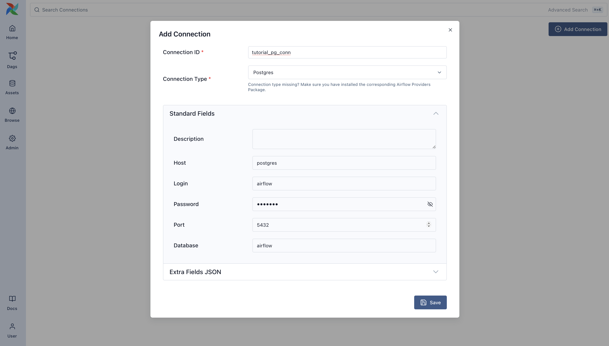
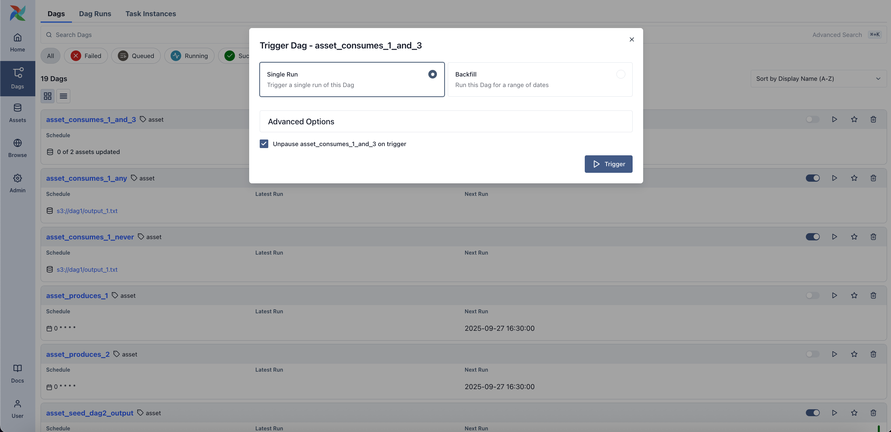
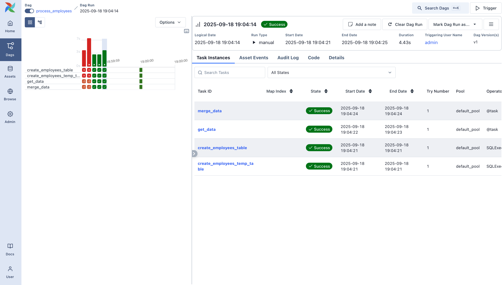

 .. Licensed to the Apache Software Foundation (ASF) under one
    or more contributor license agreements.  See the NOTICE file
    distributed with this work for additional information
    regarding copyright ownership.  The ASF licenses this file
    to you under the Apache License, Version 2.0 (the
    "License"); you may not use this file except in compliance
    with the License.  You may obtain a copy of the License at

 ..   http://www.apache.org/licenses/LICENSE-2.0

 .. Unless required by applicable law or agreed to in writing,
    software distributed under the License is distributed on an
    "AS IS" BASIS, WITHOUT WARRANTIES OR CONDITIONS OF ANY
    KIND, either express or implied.  See the License for the
    specific language governing permissions and limitations
    under the License.

Building a Simple Data Pipeline
===============================

Welcome to the third tutorial in our series! At this point, you've already written your first Dag and used some basic
operators. Now it's time to build a small but meaningful data pipeline -- one that retrieves data from an external
source, loads it into a database, and cleans it up along the way.

This tutorial introduces the ``SQLExecuteQueryOperator``, a flexible and modern way to execute SQL in Airflow. We'll use
it to interact with a local Postgres database, which we'll configure in the Airflow UI.

By the end of this tutorial, you'll have a working pipeline that:

- Downloads a CSV file
- Loads the data into a staging table
- Cleans the data and upserts it into a target table

Along the way, you'll gain hands-on experience with Airflow's UI, connection system, SQL execution, and Dag authoring
patterns.

Want to go deeper as you go? Here are two helpful references:

- The `SQLExecuteQueryOperator <https://airflow.apache.org/docs/apache-airflow-providers-common-sql/stable/_api/airflow/providers/common/sql/operators/sql/index.html#airflow.providers.common.sql.operators.sql.SQLExecuteQueryOperator>`_ documentation
- The `Postgres provider <https://airflow.apache.org/docs/apache-airflow-providers-postgres/stable/index.html>`_ documentation

Let's get started!

Initial setup
-------------

.. caution::
  You'll need Docker installed to run this tutorial. We'll be using Docker Compose to launch Airflow locally. If you
  need help setting it up, check out the :doc:`Docker Compose quickstart guide </howto/docker-compose/index>`.

To run our pipeline, we need a working Airflow environment. Docker Compose makes this easy and safe -- no system-wide
installs required. Just open your terminal and run the following:

.. code-block:: bash

  # Download the docker-compose.yaml file
  curl -LfO 'https://airflow.apache.org/docs/apache-airflow/stable/docker-compose.yaml'

  # Make expected directories and set an expected environment variable
  mkdir -p ./dags ./logs ./plugins
  echo -e "AIRFLOW_UID=$(id -u)" > .env

  # Initialize the database
  docker compose up airflow-init

  # Start up all services
  docker compose up

Once Airflow is up and running, visit the UI at ``http://localhost:8080``.

Log in with:

- **Username:** ``airflow``
- **Password:** ``airflow``

You'll land in the Airflow dashboard, where you can trigger Dags, explore logs, and manage your environment.

Create a Postgres Connection
----------------------------

Before our pipeline can write to Postgres, we need to tell Airflow how to connect to it. In the UI, open the **Admin >
Connections** page and click the + button to add a new
`connection <https://airflow.apache.org/docs/apache-airflow/stable/concepts/connections.html>`_.

Fill in the following details:

- Connection ID: ``tutorial_pg_conn``
- Connection Type: ``postgres``
- Host: ``postgres``
- Database: ``airflow`` (this is the default database in our container)
- Login: ``airflow``
- Password: ``airflow``
- Port: ``5432``

|

Save the connection. This tells Airflow how to reach the Postgres database running in your Docker environment.

Next, we'll start building the pipeline that uses this connection.

Create tables for staging and final data
----------------------------------------

Let's begin with table creation. We'll create two tables:

- ``employees_temp``: a staging table used for raw data
- ``employees``: the cleaned and deduplicated destination

We'll use the ``SQLExecuteQueryOperator`` to run the SQL statements needed to create these tables.

.. code-block:: python

  from airflow.providers.common.sql.operators.sql import SQLExecuteQueryOperator

  create_employees_table = SQLExecuteQueryOperator(
      task_id="create_employees_table",
      conn_id="tutorial_pg_conn",
      sql="""
          CREATE TABLE IF NOT EXISTS employees (
              "Serial Number" NUMERIC PRIMARY KEY,
              "Company Name" TEXT,
              "Employee Markme" TEXT,
              "Description" TEXT,
              "Leave" INTEGER
          );""",
  )

  create_employees_temp_table = SQLExecuteQueryOperator(
      task_id="create_employees_temp_table",
      conn_id="tutorial_pg_conn",
      sql="""
          DROP TABLE IF EXISTS employees_temp;
          CREATE TABLE employees_temp (
              "Serial Number" NUMERIC PRIMARY KEY,
              "Company Name" TEXT,
              "Employee Markme" TEXT,
              "Description" TEXT,
              "Leave" INTEGER
          );""",
  )

You can optionally place these SQL statements in ``.sql`` files inside your ``dags/`` folder and pass the file path to
the ``sql=`` argument. This can be a great way to keep your Dag code clean.

Load data into the staging table
--------------------------------

Next, we'll download a CSV file, save it locally, and load it into ``employees_temp`` using the ``PostgresHook``.

.. code-block:: python

  import os
  import requests
  from airflow.sdk import task
  from airflow.providers.postgres.hooks.postgres import PostgresHook

  @task
  def get_data():
      # NOTE: configure this as appropriate for your Airflow environment
      data_path = "/opt/airflow/dags/files/employees.csv"
      os.makedirs(os.path.dirname(data_path), exist_ok=True)

      url = "https://raw.githubusercontent.com/apache/airflow/main/airflow-core/docs/tutorial/pipeline_example.csv"

      response = requests.request("GET", url)

      with open(data_path, "w") as file:
          file.write(response.text)

      postgres_hook = PostgresHook(postgres_conn_id="tutorial_pg_conn")
      conn = postgres_hook.get_conn()
      cur = conn.cursor()
      with open(data_path, "r") as file:
          cur.copy_expert(
              "COPY employees_temp FROM STDIN WITH CSV HEADER DELIMITER AS ',' QUOTE '\"'",
              file,
          )
      conn.commit()

This task gives you a taste of combining Airflow with native Python and SQL hooks -- a common pattern in real-world
pipelines.

Merge and clean the data
------------------------

Now let's deduplicate the data and merge it into our final table. We'll write a task that runs a SQL `INSERT ... ON
CONFLICT DO UPDATE`.

.. code-block:: python

  from airflow.sdk import task
  from airflow.providers.postgres.hooks.postgres import PostgresHook

  @task
  def merge_data():
      query = """
          INSERT INTO employees
          SELECT *
          FROM (
              SELECT DISTINCT *
              FROM employees_temp
          ) t
          ON CONFLICT ("Serial Number") DO UPDATE
          SET
                "Employee Markme" = excluded."Employee Markme",
                "Description" = excluded."Description",
                "Leave" = excluded."Leave";
      """
      try:
          postgres_hook = PostgresHook(postgres_conn_id="tutorial_pg_conn")
          conn = postgres_hook.get_conn()
          cur = conn.cursor()
          cur.execute(query)
          conn.commit()
          return 0
      except Exception as e:
          return 1

Defining the Dag
----------------

Now that we've defined all our tasks, it's time to put them together into a Dag.

.. code-block:: python

  import datetime
  import pendulum
  import os

  import requests
  from airflow.sdk import dag, task
  from airflow.providers.postgres.hooks.postgres import PostgresHook
  from airflow.providers.common.sql.operators.sql import SQLExecuteQueryOperator

  @dag(
      dag_id="process_employees",
      schedule="0 0 * * *",
      start_date=pendulum.datetime(2021, 1, 1, tz="UTC"),
      catchup=False,
      dagrun_timeout=datetime.timedelta(minutes=60),
  )
  def ProcessEmployees():
      create_employees_table = SQLExecuteQueryOperator(
          task_id="create_employees_table",
          conn_id="tutorial_pg_conn",
          sql="""
              CREATE TABLE IF NOT EXISTS employees (
                  "Serial Number" NUMERIC PRIMARY KEY,
                  "Company Name" TEXT,
                  "Employee Markme" TEXT,
                  "Description" TEXT,
                  "Leave" INTEGER
              );""",
      )

      create_employees_temp_table = SQLExecuteQueryOperator(
          task_id="create_employees_temp_table",
          conn_id="tutorial_pg_conn",
          sql="""
              DROP TABLE IF EXISTS employees_temp;
              CREATE TABLE employees_temp (
                  "Serial Number" NUMERIC PRIMARY KEY,
                  "Company Name" TEXT,
                  "Employee Markme" TEXT,
                  "Description" TEXT,
                  "Leave" INTEGER
              );""",
      )

      @task
      def get_data():
          # NOTE: configure this as appropriate for your Airflow environment
          data_path = "/opt/airflow/dags/files/employees.csv"
          os.makedirs(os.path.dirname(data_path), exist_ok=True)

          url = "https://raw.githubusercontent.com/apache/airflow/main/airflow-core/docs/tutorial/pipeline_example.csv"

          response = requests.request("GET", url)

          with open(data_path, "w") as file:
              file.write(response.text)

          postgres_hook = PostgresHook(postgres_conn_id="tutorial_pg_conn")
          conn = postgres_hook.get_conn()
          cur = conn.cursor()
          with open(data_path, "r") as file:
              cur.copy_expert(
                  "COPY employees_temp FROM STDIN WITH CSV HEADER DELIMITER AS ',' QUOTE '\"'",
                  file,
              )
          conn.commit()

      @task
      def merge_data():
          query = """
              INSERT INTO employees
              SELECT *
              FROM (
                  SELECT DISTINCT *
                  FROM employees_temp
              ) t
              ON CONFLICT ("Serial Number") DO UPDATE
              SET
                "Employee Markme" = excluded."Employee Markme",
                "Description" = excluded."Description",
                "Leave" = excluded."Leave";
          """
          try:
              postgres_hook = PostgresHook(postgres_conn_id="tutorial_pg_conn")
              conn = postgres_hook.get_conn()
              cur = conn.cursor()
              cur.execute(query)
              conn.commit()
              return 0
          except Exception as e:
              return 1

      [create_employees_table, create_employees_temp_table] >> get_data() >> merge_data()

  dag = ProcessEmployees()

Save this Dag as ``dags/process_employees.py``. After a short delay, it will show up in the UI.

Trigger and explore your Dag
----------------------------

Open the Airflow UI and find the ``process_employees`` Dag in the list. Toggle it "on" using the slider, then trigger a
run using the play button.

You can watch each task as it runs in the **Grid** view, and explore logs for each step.

|

|

|

Once it succeeds, you'll have a fully working pipeline that integrates data from the outside world, loads it into
Postgres, and keeps it clean.

What's Next?
-------------

Nice work! You've now built a real pipeline using Airflow's core patterns and tools. Here are a few ideas for where to
go next:

- Try swapping in a different SQL provider, like MySQL or SQLite.
- Split your Dag into TaskGroups or refactor into a more usable pattern.
- Add an alerting step or send a notification when data is processed.

.. seealso::
    - Browse more how-to guides in the :doc:`Airflow documentation </howto/index>`
    - Explore the `SQL provider reference <https://airflow.apache.org/docs/apache-airflow-providers-common-sql/stable/>`_
    - Learn how to :doc:`write your own custom operator </howto/custom-operator>`
