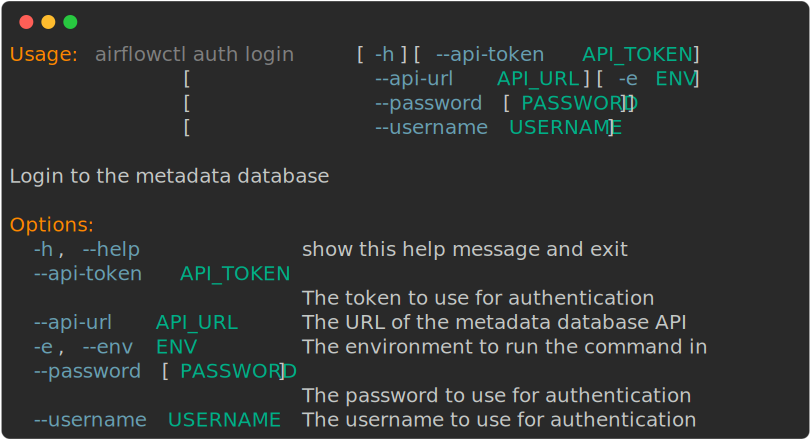
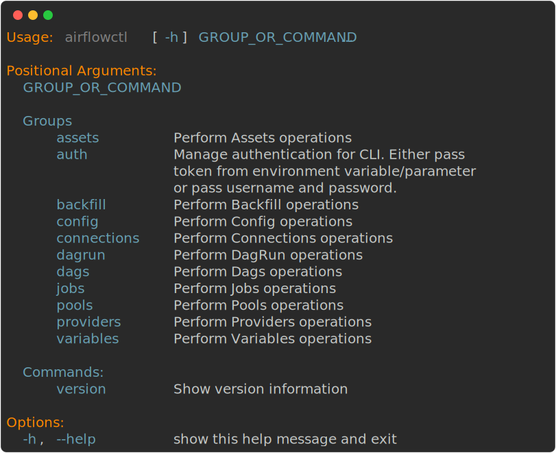
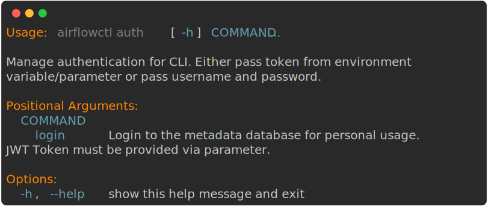
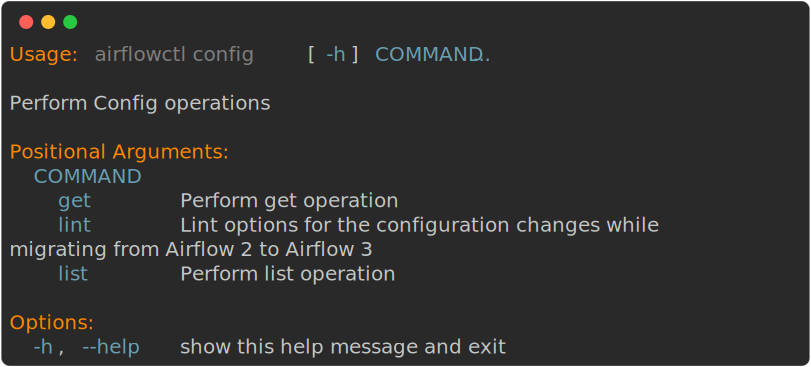
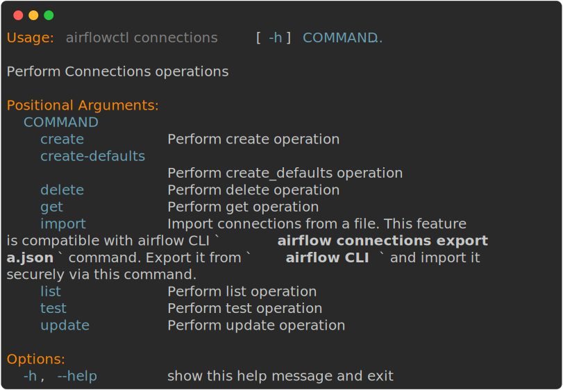
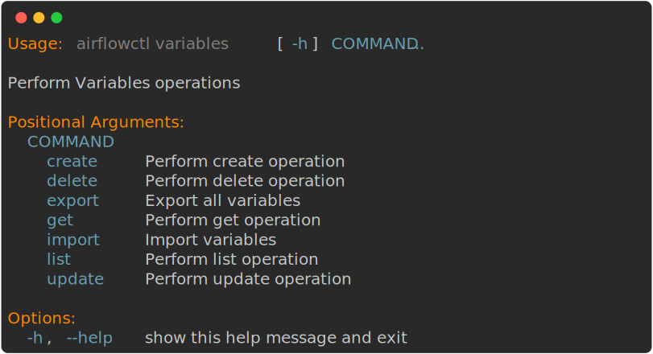

 .. Licensed to the Apache Software Foundation (ASF) under one
    or more contributor license agreements.  See the NOTICE file
    distributed with this work for additional information
    regarding copyright ownership.  The ASF licenses this file
    to you under the Apache License, Version 2.0 (the
    "License"); you may not use this file except in compliance
    with the License.  You may obtain a copy of the License at

 ..   http://www.apache.org/licenses/LICENSE-2.0

 .. Unless required by applicable law or agreed to in writing,
    software distributed under the License is distributed on an
    "AS IS" BASIS, WITHOUT WARRANTIES OR CONDITIONS OF ANY
    KIND, either express or implied.  See the License for the
    specific language governing permissions and limitations
    under the License.

How-to Guides
=============

Setting up the sandbox in the :doc:`/start` section was easy;
building a production-grade environment requires a bit more work!

These how-to guides will step you through common tasks in using and
configuring an airflowctl environment.

How to use airflowctl
----------------------

**Important Note**
''''''''''''''''''
airflowctl needs the Airflow API running to be able to work. Please, see the login section below before use.
Otherwise, you may get errors.

Login
'''''
airflowctl needs to be able to connect to the Airflow API. You should pass API URL as a parameter to the command
``--api-url``. The URL should be in the form of ``http(s)://<host>:<port>``.
You can also set the environment variable ``AIRFLOW_CLI_TOKEN`` to the token to use for authentication.

There are two ways to authenticate with the Airflow API:
1. Using a token acquired from the Airflow API

.. code-block:: bash

  airflowctl auth login --api-url <api_url> --api-token <token> --env <env_name:production>

2. Using a username and password

.. code-block:: bash

  airflowctl auth login --api-url <api_url> --username <username> --password <password> --env <env_name:production>

3. (optional) Using a token acquired from the Airflow API and username and password

.. code-block:: bash

  export AIRFLOW_CLI_TOKEN=<token>
  airflowctl auth login --api-url <api_url> --env <env_name>

In both cases token is securely stored in the keyring backend. Only configuration persisted in ``~/.config/airflow`` file
is the API URL and the environment name. The token is stored in the keyring backend and is not persisted in the
configuration file. The keyring backend is used to securely store the token and is not accessible to the user.

Datetime Usage
''''''''''''''
For datetime parameters, date should be timezone aware and in ISO format.
For example: ``2025-10-10T10:00:00+00:00``
Let's take example of triggering a DAG run with a logical date, run after and a note.

.. code-block:: bash

  airflowctl dagrun trigger --dag-id="example_bash_operator" --logical-date="2025-09-06T00:00:00+00:00" --run-after="2025-09-06T00:00:00+00:00" --note="Triggered from airflowctl"

More Usage and Help Pictures
''''''''''''''''''''''''''''
For more information use

.. code-block:: bash

  airflowctl auth login --help

You are ready to use airflowctl now.
Please, also see :doc:`/cli-and-env-variables-ref` for the list of available commands and options.

You can use the command ``airflowctl --help`` to see the list of available commands.

All Available Group Command References
--------------------------------------

Below are the command reference diagrams for all available commands in airflowctl.
These visual references show the full command syntax, options, and parameters for each command.

**Assets**
''''''''''

**Auth**
''''''''

**Backfills**
'''''''''''''
.. image:: ../images/output_backfills.svg
  :target: https://raw.githubusercontent.com/apache/airflow/main/airflow-ctl/docs/images/output_backfills.svg
  :width: 60%
  :alt: airflowctl Backfills Command

**Config**
''''''''''

**Connections**
'''''''''''''''

**Dags**
''''''''
.. image:: ../images/output_dag.svg
  :target: https://raw.githubusercontent.com/apache/airflow/main/airflow-ctl/docs/images/output_dag.svg
  :width: 60%
  :alt: airflowctl Dag Command

**Dag Runs**
''''''''''''

**Jobs**
''''''''

**Pools**
'''''''''

**Providers**
'''''''''''''

**Variables**
'''''''''''''

**Version**
'''''''''''

