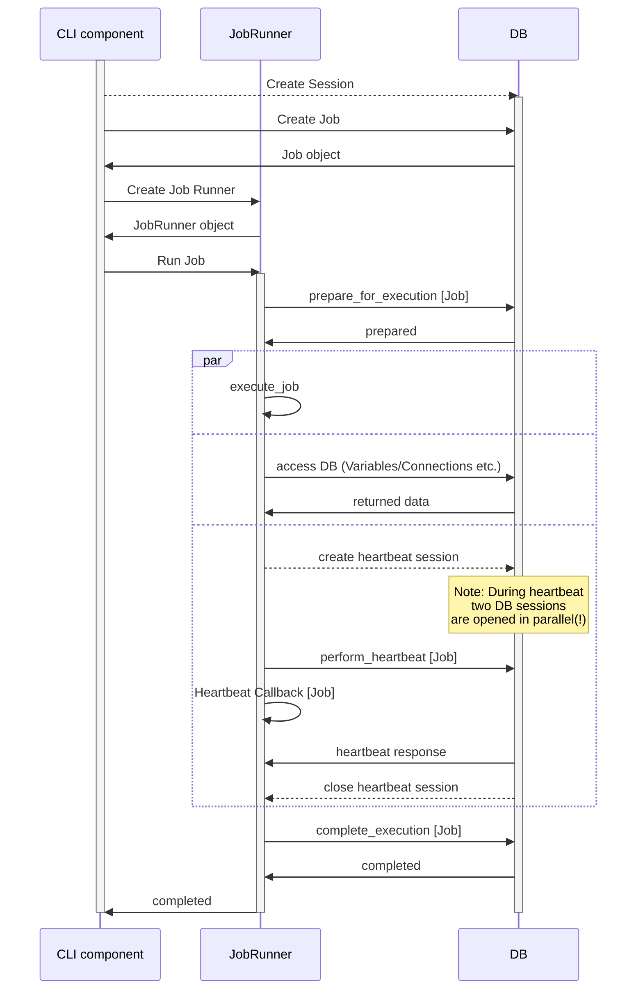
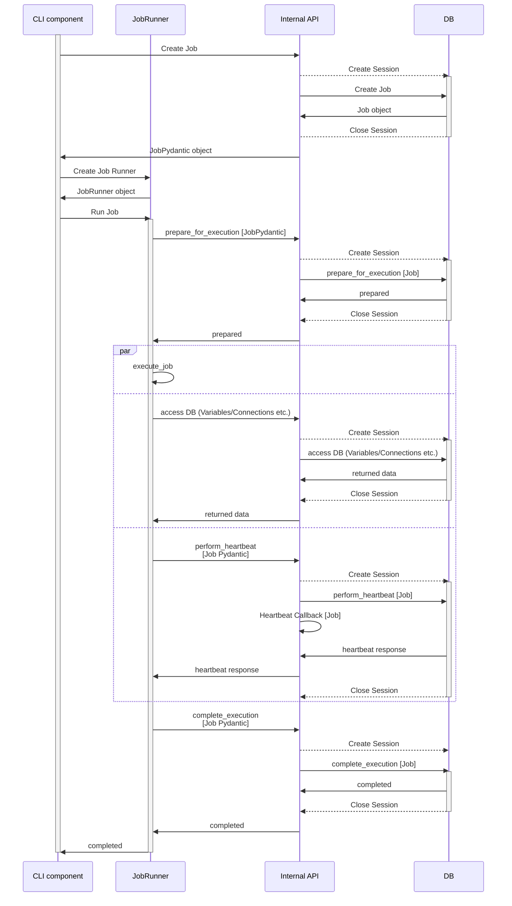

<!--
 Licensed to the Apache Software Foundation (ASF) under one
 or more contributor license agreements.  See the NOTICE file
 distributed with this work for additional information
 regarding copyright ownership.  The ASF licenses this file
 to you under the Apache License, Version 2.0 (the
 "License"); you may not use this file except in compliance
 with the License.  You may obtain a copy of the License at

   http://www.apache.org/licenses/LICENSE-2.0

 Unless required by applicable law or agreed to in writing,
 software distributed under the License is distributed on an
 "AS IS" BASIS, WITHOUT WARRANTIES OR CONDITIONS OF ANY
 KIND, either express or implied.  See the License for the
 specific language governing permissions and limitations
 under the License.
 -->

These sequence diagrams explain the lifecycle of a Job with relation to the database
operation in the context of the internal API of Airflow.

As part of AIP-44 implementation we separated the ORM Job instance from the code the job runs,
introducing a concept of Job Runners. The Job Runner is a class that is responsible for running
the code and it might execute either in-process when direct database is used, or remotely when
the job is run remotely and communicates via internal API (this part is a work-in-progress and we
will keep on updating these lifecycle diagrams).

This apply to all of the CLI components Airflow runs (Scheduler, DagFileProcessor, Triggerer,
Worker) that run a job. The AIP-44 implementation is not yet complete, but when complete it will
apply to some of the components (DagFileProcessor, Triggerer, Worker) and not to others (Scheduler).

## In-Process Job Runner

## Internal API Job Runner (WIP)

