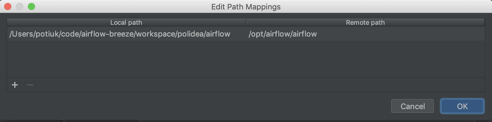

 .. Licensed to the Apache Software Foundation (ASF) under one
    or more contributor license agreements.  See the NOTICE file
    distributed with this work for additional information
    regarding copyright ownership.  The ASF licenses this file
    to you under the Apache License, Version 2.0 (the
    "License"); you may not use this file except in compliance
    with the License.  You may obtain a copy of the License at

 ..   http://www.apache.org/licenses/LICENSE-2.0

 .. Unless required by applicable law or agreed to in writing,
    software distributed under the License is distributed on an
    "AS IS" BASIS, WITHOUT WARRANTIES OR CONDITIONS OF ANY
    KIND, either express or implied.  See the License for the
    specific language governing permissions and limitations
    under the License.

Local Virtual Environment (virtualenv)
======================================

The easiest wey to run tests for Airflow is to use local virtualenv. While Breeze is the recommended
way to run tests - because it provides a reproducible environment and is easy to set up, it is not
always the best option as you need to run your tests inside a docker container. This might make it
harder to debug the tests and to use your IDE to run them.

That's why we recommend using local virtualenv for development and testing.

**The outline for this document in GitHub is available at top-right corner button (with 3-dots and 3 lines).**

Installation in local virtualenv
--------------------------------

Required Software Packages
..........................

Use system-level package managers like yum, apt-get for Linux, or
Homebrew for macOS to install required software packages:

* Python (One of: 3.8, 3.9, 3.10, 3.11, 3.12)
* MySQL 5.7+
* libxml
* helm (only for helm chart tests)

Refer to the `Dockerfile.ci <../Dockerfile.ci>`__ for a comprehensive list
of required packages.

.. note::

   - MySql 2.2.0 needs pkgconf to be a pre requisite, refer `here <http://pkgconf.org/>`_ to install pkgconf
   - MacOs with ARM architectures require graphviz for venv setup, refer `here <https://graphviz.org/download/>`_ to install graphviz
   - The helm chart tests need helm to be installed as a pre requisite. Refer `here <https://helm.sh/docs/intro/install/>`_ to install and setup helm

.. note::

   As of version 2.8 Airflow follows PEP 517/518 and uses ``pyproject.toml`` file to define build dependencies
   and build process and it requires relatively modern versions of packaging tools to get airflow built from
   local sources or ``sdist`` packages, as PEP 517 compliant build hooks are used to determine dynamic build
   dependencies. In case of ``pip`` it means that at least version 22.1.0 is needed (released at the beginning of
   2022) to build or install Airflow from sources. This does not affect the ability of installing Airflow from
   released wheel packages.

Installing Airflow
..................

The simplest way to install Airflow in local virtualenv is to use ``pip``:

.. code:: bash

    pip install -e ".[devel,<OTHER EXTRAS>]" # for example: pip install -e ".[devel,google,postgres]"

This will install Airflow in 'editable' mode - where sources of Airflow are taken directly from the source
code rather than moved to the installation directory. You need to run this command in the virtualenv you
want to install Airflow in - and you need to have the virtualenv activated.

While you can use any virtualenv manager, we recommend using `Hatch <https://hatch.pypa.io/latest/>`__
as your development environment front-end, and we already use Hatch backend ``hatchling`` for Airflow.

Hatchling is automatically installed when you build Airflow but since airflow build system uses
``PEP`` compliant ``pyproject.toml`` file, you can use any front-end build system that supports
``PEP 517`` and ``PEP 518``. You can also use ``pip`` to install Airflow in editable mode.

Extras (optional dependencies)
..............................

You can also install extra packages (like ``[ssh]``, etc) via
``pip install -e [devel,EXTRA1,EXTRA2 ...]``. However, some of them may
have additional install and setup requirements for your local system.

For example, if you have a trouble installing the mysql client on macOS and get
an error as follows:

.. code:: text

    ld: library not found for -lssl

you should set LIBRARY\_PATH before running ``pip install``:

.. code:: bash

    export LIBRARY_PATH=$LIBRARY_PATH:/usr/local/opt/openssl/lib/

You are STRONGLY encouraged to also install and use `pre-commit hooks <08_static_code_checks.rst#pre-commit-hooks>`_
for your local virtualenv development environment. Pre-commit hooks can speed up your
development cycle a lot.

The full list of extras is available in `pyproject.toml <../pyproject.toml>`_ and can be easily retrieved using hatch via

.. note::

   Only ``pip`` installation is currently officially supported.
   Make sure you have the latest pip installed, reference `version <https://pip.pypa.io/en/stable/#>`_

   While there are some successes with using other tools like `poetry <https://python-poetry.org/>`_ or
   `pip-tools <https://pypi.org/project/pip-tools/>`_, they do not share the same workflow as
   ``pip`` - especially when it comes to constraint vs. requirements management.
   Installing via ``Poetry`` or ``pip-tools`` is not currently supported.

   There are known issues with ``bazel`` that might lead to circular dependencies when using it to install
   Airflow. Please switch to ``pip`` if you encounter such problems. ``Bazel`` community works on fixing
   the problem in `this PR <https://github.com/bazelbuild/rules_python/pull/1166>`_ so it might be that
   newer versions of ``bazel`` will handle it.

   If you wish to install airflow using those tools you should use the constraint files and convert
   them to appropriate format and workflow that your tool requires.

Using Hatch
-----------

Airflow uses `hatch <https://hatch.pypa.io/>`_ as a build and development tool of choice. It is one of popular
build tools and environment managers for Python, maintained by the Python Packaging Authority.
It is an optional tool that is only really needed when you want to build packages from sources, but
it is also very convenient to manage your Python versions and virtualenvs.

Airflow project contains some pre-defined virtualenv definitions in ``pyproject.toml`` that can be
easily used by hatch to create your local venvs. This is not necessary for you to develop and test
Airflow, but it is a convenient way to manage your local Python versions and virtualenvs.

Installing Hatch
................

You can install hatch using various other ways (including Gui installers).

Example using ``pipx``:

.. code:: bash

    pipx install hatch

We recommend using ``pipx`` as you can manage installed Python apps easily and later use it
to upgrade ``hatch`` easily as needed with:

.. code:: bash

    pipx upgrade hatch

Using Hatch to manage your Python versions
..........................................

You can also use hatch to install and manage airflow virtualenvs and development
environments. For example, you can install Python 3.10 with this command:

.. code:: bash

    hatch python install 3.10

or install all Python versions that are used in Airflow:

.. code:: bash

    hatch python install all

Manage your virtualenvs with Hatch
..................................

Airflow has some pre-defined virtualenvs that you can use to develop and test airflow.
You can see the list of available envs with:

.. code:: bash

    hatch env show

This is what it shows currently:

+-------------+---------+---------------------------------------------------------------+
| Name        | Type    | Description                                                   |
+=============+=========+===============================================================+
| default     | virtual | Default environment with Python 3.8 for maximum compatibility |
+-------------+---------+---------------------------------------------------------------+
| airflow-38  | virtual | Environment with Python 3.8. No devel installed.              |
+-------------+---------+---------------------------------------------------------------+
| airflow-39  | virtual | Environment with Python 3.9. No devel installed.              |
+-------------+---------+---------------------------------------------------------------+
| airflow-310 | virtual | Environment with Python 3.10. No devel installed.             |
+-------------+---------+---------------------------------------------------------------+
| airflow-311 | virtual | Environment with Python 3.11. No devel installed              |
+-------------+---------+---------------------------------------------------------------+
| airflow-312 | virtual | Environment with Python 3.12. No devel installed              |
+-------------+---------+---------------------------------------------------------------+

The default env (if you have not used one explicitly) is ``default`` and it is a Python 3.8
virtualenv for maximum compatibility. You can install devel set of dependencies with it
by running:

.. code:: bash

    pip install -e ".[devel]"

After entering the environment.

The other environments are just bare-bones Python virtualenvs with Airflow core requirements only,
without any extras installed and without any tools. They are much faster to create than the default
environment, and you can manually install either appropriate extras or directly tools that you need for
testing or development.

.. code:: bash

    hatch env create

You can create specific environment by using them in create command:

.. code:: bash

    hatch env create airflow-310

You can install extras in the environment by running pip command:

.. code:: bash

    hatch -e airflow-310 run -- pip install -e ".[devel,google]"

And you can enter the environment with running a shell of your choice (for example zsh) where you
can run any commands

.. code:: bash

    hatch -e airflow-310 shell

Once you are in the environment (indicated usually by updated prompt), you can just install
extra dependencies you need:

.. code:: bash

    [~/airflow] [airflow-310] pip install -e ".[devel,google]"

You can also see where hatch created the virtualenvs and use it in your IDE or activate it manually:

.. code:: bash

    hatch env find airflow-310

You will get path similar to:

.. code::

    /Users/jarek/Library/Application Support/hatch/env/virtual/apache-airflow/TReRdyYt/apache-airflow

Then you will find ``python`` binary and ``activate`` script in the ``bin`` sub-folder of this directory and
you can configure your IDE to use this python virtualenv if you want to use that environment in your IDE.

You can also set default environment name by HATCH_ENV environment variable.

You can clean the env by running:

.. code:: bash

    hatch env prune

More information about hatch can be found in `Hatch: Environments <https://hatch.pypa.io/latest/environment/>`__

Using Hatch to build your packages
..................................

You can use hatch to build installable package from the airflow sources. Such package will
include all metadata that is configured in ``pyproject.toml`` and will be installable with pip.

The packages will have pre-installed dependencies for providers that are always
installed when Airflow is installed from PyPI. By default both ``wheel`` and ``sdist`` packages are built.

.. code:: bash

    hatch build

You can also build only ``wheel`` or ``sdist`` packages:

.. code:: bash

    hatch build -t wheel
    hatch build -t sdist

Local and Remote Debugging in IDE
---------------------------------

One of the great benefits of using the local virtualenv and Breeze is an option to run
local debugging in your IDE graphical interface.

When you run example DAGs, even if you run them using unit tests within IDE, they are run in a separate
container. This makes it a little harder to use with IDE built-in debuggers.
Fortunately, IntelliJ/PyCharm provides an effective remote debugging feature (but only in paid versions).
See additional details on
`remote debugging <https://www.jetbrains.com/help/pycharm/remote-debugging-with-product.html>`_.

You can set up your remote debugging session as follows:

.. image:: images/setup_remote_debugging.png
    :align: center
    :alt: Setup remote debugging

Note that on macOS, you have to use a real IP address of your host rather than the default
localhost because on macOS the container runs in a virtual machine with a different IP address.

Make sure to configure source code mapping in the remote debugging configuration to map
your local sources to the ``/opt/airflow`` location of the sources within the container:

Developing Providers
--------------------

In Airflow 2.0 we introduced split of Apache Airflow into separate packages - there is one main
apache-airflow package with core of Airflow and 70+ packages for all providers (external services
and software Airflow can communicate with).

When you install airflow from sources using editable install, you can develop together both - main version
of Airflow and providers, which is pretty convenient, because you can use the same environment for both.

Running ``pip install -e .`` will install Airflow in editable mode, but all provider code will also be
available in the same environment. However, most provider need some additional dependencies.

You can install the dependencies of the provider you want to develop by installing airflow in editable
mode with ``provider id`` as extra (with ``-`` instead of ``.``) . You can see the list of provider's extras in the
`extras reference <../docs/apache-airflow/extra-packages-ref.rst>`_.

For example, if you want to develop Google provider, you can install it with:

.. code:: bash

    pip install -e ".[devel,google]"

In case of a provider has name compose of several segments, you can use ``-`` to separate them. You can also
install multiple extra dependencies at a time:

.. code:: bash

    pip install -e ".[devel,apache-beam,dbt-cloud]"

The dependencies for providers are configured in ``airflow/providers/PROVIDERS_FOLDER/provider.yaml`` file -
separately for each provider. You can find there two types of ``dependencies`` - production runtime
dependencies, and sometimes ``devel-dependencies`` which are needed to run tests. While ``provider.yaml``
file is the single source of truth for the dependencies, eventually they need to find its way to Airflow`s
``pyproject.toml``. This is done by running:

.. code:: bash

    pre-commit run update-providers-dependencies --all-files

This will update ``pyproject.toml`` with the dependencies from ``provider.yaml`` files and from there
it will be used automatically when you install Airflow in editable mode.

If you want to add another dependency to a provider, you should add it to corresponding ``provider.yaml``,
run the command above and commit the changes to ``pyproject.toml``. Then running
``pip install -e .[devel,PROVIDER_EXTRA]`` will install the new dependencies. Tools like ``hatch`` can also
install the dependencies automatically when you create or switch to a development environment.

Installing recommended version of dependencies
----------------------------------------------

Whatever virtualenv solution you use, when you want to make sure you are using the same
version of dependencies as in main, you can install recommended version of the dependencies by using
constraint-python<PYTHON_MAJOR_MINOR_VERSION>.txt files as ``constraint`` file. This might be useful
to avoid "works-for-me" syndrome, where you use different version of dependencies than the ones
that are used in main, CI tests and by other contributors.

There are different constraint files for different python versions. For example this command will install
all basic devel requirements and requirements of google provider as last successfully tested for Python 3.8:

.. code:: bash

    pip install -e ".[devel,google]" \
      --constraint "https://raw.githubusercontent.com/apache/airflow/constraints-main/constraints-source-providers-3.8.txt"

Make sure to use latest main for such installation, those constraints are "development constraints" and they
are refreshed several times a day to make sure they are up to date with the latest changes in the main branch.

Note that this might not always work as expected, because the constraints are not always updated
immediately after the dependencies are updated, sometimes there is a very recent change (few hours, rarely more
than a day) which still runs in ``canary`` build and constraints will not be updated until the canary build
succeeds. Usually what works in this case is running your install command without constraints.

You can upgrade just airflow, without paying attention to provider's dependencies by using
the 'constraints-no-providers' constraint files. This allows you to keep installed provider dependencies
and install to latest supported ones by pure airflow core.

.. code:: bash

    pip install -e ".[devel]" \
      --constraint "https://raw.githubusercontent.com/apache/airflow/constraints-main/constraints-no-providers-3.8.txt"

These are examples of the development options available with the local virtualenv in your IDE:

* local debugging;
* Airflow source view;
* auto-completion;
* documentation support;
* unit tests.

This document describes minimum requirements and instructions for using a standalone version of the local virtualenv.

Running Tests
-------------

Running tests is described in `Testing documentation <09_testing.rst>`_.

While most of the tests are typical unit tests that do not require external components, there are a number
of Integration tests. You can technically use local virtualenv to run those tests, but it requires to
set up all necessary dependencies for all the providers you are going to tests and also setup
databases - and sometimes other external components (for integration test).

So, generally it should be easier to use the `Breeze <../dev/breeze/doc/README.rst>`__ development environment
(especially for Integration tests).

Connecting to database
----------------------

When analyzing the situation, it is helpful to be able to directly query the database. You can do it using
the built-in Airflow command (however you needs a CLI client tool for each database to be installed):

.. code:: bash

    airflow db shell

The command will explain what CLI tool is needed for the database you have configured.

-----------

As the next step, it is important to learn about `Static code checks <08_static_code_checks.rst>`__.that are
used to automate code quality checks. Your code must pass the static code checks to get merged.
