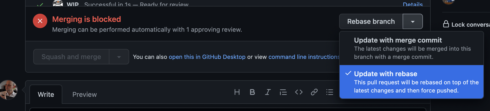

 .. Licensed to the Apache Software Foundation (ASF) under one
    or more contributor license agreements.  See the NOTICE file
    distributed with this work for additional information
    regarding copyright ownership.  The ASF licenses this file
    to you under the Apache License, Version 2.0 (the
    "License"); you may not use this file except in compliance
    with the License.  You may obtain a copy of the License at

 ..   http://www.apache.org/licenses/LICENSE-2.0

 .. Unless required by applicable law or agreed to in writing,
    software distributed under the License is distributed on an
    "AS IS" BASIS, WITHOUT WARRANTIES OR CONDITIONS OF ANY
    KIND, either express or implied.  See the License for the
    specific language governing permissions and limitations
    under the License.

Working with Git
================

In this document you can learn basics of how you should use Git in Airflow project. It explains branching model and stresses
that we are using rebase workflow. It also explains how to sync your fork with the main repository.

**The outline for this document in GitHub is available at top-right corner button (with 3-dots and 3 lines).**

Airflow Git Branches
====================

All new development in Airflow happens in the ``main`` branch. All PRs should target that branch.

We also have a ``v2-*-test`` branches that are used to test ``2.*.x`` series of Airflow and where maintainers
cherry-pick selected commits from the main branch.

Cherry-picking is done with the ``-x`` flag.

The ``v2-*-test`` branch might be broken at times during testing. Expect force-pushes there so
maintainers should coordinate between themselves on who is working on the ``v2-*-test`` branch -
usually these are developers with the release manager permissions.

The ``v2-*-stable`` branch is rather stable - there are minimum changes coming from approved PRs that
passed the tests. This means that the branch is rather, well, "stable".

Once the ``v2-*-test`` branch stabilizes, the ``v2-*-stable`` branch is synchronized with ``v2-*-test``.
The ``v2-*-stable`` branches are used to release ``2.*.x`` releases.

The general approach is that cherry-picking a commit that has already had a PR and unit tests run
against main is done to ``v2-*-test`` branches, but PRs from contributors towards 2.0 should target
``v2-*-stable`` branches.

The ``v2-*-test`` branches and ``v2-*-stable`` ones are merged just before the release and that's the
time when they converge.

The production images are released in DockerHub from:

* main branch for development
* ``2.*.*``, ``2.*.*rc*`` releases from the ``v2-*-stable`` branch when we prepare release candidates and
  final releases.

How to sync your fork
=====================

When you have your fork, you should periodically synchronize the main of your fork with the
Apache Airflow main. In order to do that you can ``git pull --rebase`` to your local git repository from
apache remote and push the main (often with ``--force`` to your fork). There is also an easy
way to sync your fork in GitHub's web UI with the `Fetch upstream feature
<https://docs.github.com/en/github/collaborating-with-pull-requests/working-with-forks/syncing-a-fork#syncing-a-fork-from-the-web-ui>`_.

This will force-push the ``main`` branch from ``apache/airflow`` to the ``main`` branch
in your fork. Note that in case you modified the main in your fork, you might loose those changes.

How to rebase PR
================

A lot of people are unfamiliar with the rebase workflow in Git, but we think it is an excellent workflow,
providing a better alternative to the merge workflow. We've therefore written a short guide for those who
would like to learn it.

As of February 2022, GitHub introduced the capability of "Update with Rebase" which make it easy to perform
rebase straight in the GitHub UI, so in cases when there are no conflicts, rebasing to latest version
of ``main`` can be done very easily following the instructions
`in the GitHub blog <https://github.blog/changelog/2022-02-03-more-ways-to-keep-your-pull-request-branch-up-to-date/>`_

However, when you have conflicts, sometimes you will have to perform rebase manually, and resolve the
conflicts, and remainder of the section describes how to approach it.

As opposed to the merge workflow, the rebase workflow allows us to clearly separate your changes from the
changes of others. It puts the responsibility of rebasing on the
author of the change. It also produces a "single-line" series of commits on the main branch. This
makes it easier to understand what was going on and to find reasons for problems (it is especially
useful for "bisecting" when looking for a commit that introduced some bugs).

First of all, we suggest you read about the rebase workflow here:
`Merging vs. rebasing <https://www.atlassian.com/git/tutorials/merging-vs-rebasing>`_. This is an
excellent article that describes all the ins/outs of the rebase workflow. I recommend keeping it for future reference.

The goal of rebasing your PR on top of ``apache/main`` is to "transplant" your change on top of
the latest changes that are merged by others. It also allows you to fix all the conflicts
that arise as a result of other people changing the same files as you and merging the changes to ``apache/main``.

Here is how rebase looks in practice (you can find a summary below these detailed steps):

1. You first need to add the Apache project remote to your git repository. This is only necessary once,
so if it's not the first time you are following this tutorial you can skip this step. In this example,
we will be adding the remote
as "apache" so you can refer to it easily:

* If you use ssh: ``git remote add apache git@github.com:apache/airflow.git``
* If you use https: ``git remote add apache https://github.com/apache/airflow.git``

2. You then need to make sure that you have the latest main fetched from the ``apache`` repository. You can do this
   via:

   ``git fetch apache`` (to fetch apache remote)

   ``git fetch --all``  (to fetch all remotes)

3. Assuming that your feature is in a branch in your repository called ``my-branch`` you can easily check
   what is the base commit you should rebase from by:

   ``git merge-base my-branch apache/main``

   This will print the HASH of the base commit which you should use to rebase your feature from.
   For example: ``5abce471e0690c6b8d06ca25685b0845c5fd270f``. Copy that HASH and go to the next step.

   Optionally, if you want better control you can also find this commit hash manually.

   Run:

   ``git log``

   And find the first commit that you DO NOT want to "transplant".

   Performing:

   ``git rebase HASH``

   Will "transplant" all commits after the commit with the HASH.

4. Providing that you weren't already working on your branch, check out your feature branch locally via:

   ``git checkout my-branch``

5. Rebase:

   ``git rebase HASH --onto apache/main``

   For example:

   ``git rebase 5abce471e0690c6b8d06ca25685b0845c5fd270f --onto apache/main``

6. If you have no conflicts - that's cool. You rebased. You can now run ``git push --force-with-lease`` to
   push your changes to your repository. That should trigger the build in our CI if you have a
   Pull Request (PR) opened already.

7. While rebasing you might have conflicts. Read carefully what git tells you when it prints information
   about the conflicts. You need to solve the conflicts manually. This is sometimes the most difficult
   part and requires deliberately correcting your code and looking at what has changed since you developed your
   changes.

   There are various tools that can help you with this. You can use:

   ``git mergetool``

   You can configure different merge tools with it. You can also use IntelliJ/PyCharm's excellent merge tool.
   When you open a project in PyCharm which has conflicts, you can go to VCS > Git > Resolve Conflicts and there
   you have a very intuitive and helpful merge tool. For more information, see
   `Resolve conflicts <https://www.jetbrains.com/help/idea/resolving-conflicts.html>`_.

8. After you've solved your conflict run:

   ``git rebase --continue``

   And go either to point 6. or 7, depending on whether you have more commits that cause conflicts in your PR (rebasing applies each
   commit from your PR one-by-one).

Summary
-------------

Useful when you understand the flow but don't remember the steps and want a quick reference.

``git fetch --all``
``git merge-base my-branch apache/main``
``git checkout my-branch``
``git rebase HASH --onto apache/main``
``git push --force-with-lease``

-------

Now, once you know it all you can read more about how Airflow repository is a monorepo containing both airflow package and
more than 80 `provider packages <11_provider_packages.rst>`__ and how to develop providers.
