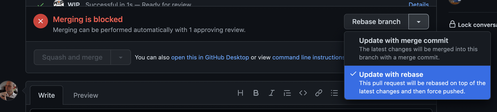

 .. Licensed to the Apache Software Foundation (ASF) under one
    or more contributor license agreements.  See the NOTICE file
    distributed with this work for additional information
    regarding copyright ownership.  The ASF licenses this file
    to you under the Apache License, Version 2.0 (the
    "License"); you may not use this file except in compliance
    with the License.  You may obtain a copy of the License at

 ..   http://www.apache.org/licenses/LICENSE-2.0

 .. Unless required by applicable law or agreed to in writing,
    software distributed under the License is distributed on an
    "AS IS" BASIS, WITHOUT WARRANTIES OR CONDITIONS OF ANY
    KIND, either express or implied.  See the License for the
    specific language governing permissions and limitations
    under the License.

Working with Git
================

In this document you can learn basics of how you should use Git in Airflow project. It explains branching model and stresses
that we are using rebase workflow. It also explains how to sync your fork with the main repository.

.. contents:: Table of Contents
   :depth: 2
   :local:

Git remote naming conventions
=============================

Airflow documentation, helper scripts (``dev/sync_fork.sh``), release tooling and
agent instructions (``AGENTS.md``) all assume the following two remote names, and
you should configure your local checkout to match:

* ``upstream`` — the canonical ``apache/airflow`` repository (where you fetch from).
* ``origin`` — your personal fork of ``apache/airflow`` (where you push branches
  for PRs).

Always push PR branches to ``origin``; don't push to ``upstream`` (the branch
protection on ``apache/airflow`` will reject it anyway). Working on dedicated
branches is recommended, though developing directly on your fork's ``main`` is
tolerated — see `Contribution Workflow </contributing-docs/18_contribution_workflow.rst#step-4-prepare-pr>`_.

If your existing checkout uses different names (for example ``apache`` for the
Apache remote, or ``origin`` pointing at ``apache/airflow`` with your fork under
another name), rename them to match the convention. Common migrations:

.. code-block:: bash

   # Case 1: upstream is currently named "apache"
   git remote rename apache upstream

   # Case 2: "origin" points at apache/airflow and your fork is named "fork"
   git remote rename origin upstream
   git remote rename fork origin

   # Case 3: upstream is missing entirely
   git remote add upstream https://github.com/apache/airflow.git
   # ... or via SSH:
   git remote add upstream git@github.com:apache/airflow.git

Then confirm with ``git remote -v``. Ad-hoc remote names still work for one-off
commands, but the helper scripts and documented workflows below all assume
``upstream`` / ``origin``.

Airflow Git Branches
====================

All new development in Airflow happens in the ``main`` branch which is now Airflow 3. All PRs should target that branch.

We also have a ``v2-10-test`` branch that is used to test ``2.10.x`` series of Airflow 2 and where maintainers
cherry-pick selected commits from the main branch.

*For Contributors*:
All bug fixes after ``2.10.0`` release will target Airflow 3. We will make the best effort to make them available in ``2.10.x``,
but if somebody wants to guarantee that a fix is included in ``2.10.x``, they need to raise the PR explicitly to the ``v2-10-test`` branch too.

*For Committers*:
When merging bugfix PRs to the ``main`` branch, the committers should also try to cherry-pick it to ``v2-10-test`` branch.
If there are merge conflicts, the committer should add a comment on the original PR, informing the author and asking them
to raise a separate PR against ``v2-10-test`` branch. If this doesn't happen, there is no guarantee that the PR will be part of ``2.10.x``
Cherry-picking is done with the ``-x`` flag. In the future, this can happen automatically with the help of a bot and appropriate
label on a PR.

Once the ``v2-10-test`` branch stabilizes, the ``v2-10-stable`` branch is synchronized with ``v2-10-test``.
The ``v2-10-stable`` branches are used to release ``2.10.x`` releases.

The general approach is that cherry-picking a commit that has already had a PR and unit tests run
against main is done to ``v2-10-test`` branch, and PRs from contributors towards 2.0 should target
``v2-10-test`` branch.

The ``v2-10-test`` branch and ``v2-10-stable`` ones are merged just before the release and that's the
time when they converge.

The production images are released in DockerHub from:

* main branch for development
* ``3.*.*``, ``3.*.*rc*`` releases from the ``v3-*-stable`` branch when we prepare release candidates and
  final releases.
* ``2.*.*``, ``2.*.*rc*`` releases from the ``v2-*-stable`` branch when we prepare release candidates and
  final releases.

Airflow Helm Chart branches
---------------------------

The Airflow Helm Chart follows a different branch model from Airflow core, because
the chart's major version cadence is independent of Airflow's:

* ``main`` — development branch for the next **Airflow Helm Chart 2.x** major release.
  This is where deprecations are *removed*, restructurings land, and a number of
  optional features are being **extracted from the core chart into separate
  kustomizable overlays** (users will compose them on top of the rendered chart with
  ``kustomize`` instead of toggling them via ever-growing ``values.yaml`` keys). PRs
  with new features, refactorings, or breaking changes for the chart should target
  ``main``.

* ``chart/v1-2x-test`` — maintenance branch for the **1.2x.x** release line. This
  branch is **strictly for bug-fixes, doc-fixes, and deprecation warnings** that give
  1.2x.x users notice before features are removed in 2.x. No new features, no
  restructurings, and no overlay extractions land here. ``1.2x.x`` chart releases are
  cut from this branch.

The full workflow — which PRs target which branch, which commits are cherry-picked
across, milestones, and the umbrella refurbish project — is documented in
`dev/README_HELM_CHART2_DEV.md <../dev/README_HELM_CHART2_DEV.md>`__. Read it before
opening a chart PR. The current 2.0 scope and chart release schedule live on the
`Release Plan <https://cwiki.apache.org/confluence/display/AIRFLOW/Release+Plan>`__
wiki page, which is the source of truth as the plan evolves.

How to sync your fork
=====================

When you have your fork, you should periodically synchronize the main of your fork with the
Apache Airflow main. In order to do that you can ``git pull --rebase`` to your local git repository from
the ``upstream`` remote and push the main (often with ``--force`` to your fork). There is also an easy
way to sync your fork in GitHub's web UI with the `Fetch upstream feature
<https://docs.github.com/en/github/collaborating-with-pull-requests/working-with-forks/syncing-a-fork#syncing-a-fork-from-the-web-ui>`_.

This will force-push the ``main`` branch from ``apache/airflow`` to the ``main`` branch
in your fork. Note that in case you modified the main in your fork, you might loose those changes.

Syncing multiple branches with the helper script
------------------------------------------------

If you also backport to the current release branch (for example ``v3-2-test``) you usually
want to keep more than one branch of your fork in sync with upstream. The
``dev/sync_fork.sh`` helper does that in one go — it fetches ``upstream`` and force-pushes
each listed branch from ``upstream/<branch>`` directly to ``origin/<branch>`` without
touching your local working tree or checked-out branch.

.. warning::

   The script uses ``git push --force`` and will **overwrite** the listed branches
   on your fork. By default it targets ``main`` and the current release branch
   (currently ``v3-2-test``). Any commits you have on those branches in your fork
   that are not in upstream will be lost. If you keep work on those branches,
   commit it to a different branch first.

Assumes your remotes are named ``upstream`` (for ``apache/airflow``) and ``origin``
(for your fork). Override with the ``UPSTREAM_REMOTE`` and ``ORIGIN_REMOTE``
environment variables if yours are named differently.

.. code-block:: console

    # Sync the default branches (main and the current release branch)
    ./dev/sync_fork.sh

    # Sync only main
    ./dev/sync_fork.sh main

    # Sync a specific set of branches
    ./dev/sync_fork.sh main v3-2-test v3-1-test

How to rebase PR
================

A lot of people are unfamiliar with the rebase workflow in Git, but we think it is an excellent workflow,
providing a better alternative to the merge workflow. We've therefore written a short guide for those who
would like to learn it.

Rebasing is a good practice recommended to follow for all code changes.

As of February 2022, GitHub introduced the capability of "Update with Rebase" which make it easy to perform
rebase straight in the GitHub UI, so in cases when there are no conflicts, rebasing to latest version
of ``main`` can be done very easily following the instructions
`in the GitHub blog <https://github.blog/changelog/2022-02-03-more-ways-to-keep-your-pull-request-branch-up-to-date/>`_

However, when you have conflicts, sometimes you will have to perform rebase manually, and resolve the
conflicts, and remainder of the section describes how to approach it.

As opposed to the merge workflow, the rebase workflow allows us to clearly separate your changes from the
changes of others. It puts the responsibility of rebasing on the
author of the change. It also produces a "single-line" series of commits on the main branch. This
makes it easier to understand what was going on and to find reasons for problems (it is especially
useful for "bisecting" when looking for a commit that introduced some bugs).

First of all, we suggest you read about the rebase workflow here:
`Merging vs. rebasing <https://www.atlassian.com/git/tutorials/merging-vs-rebasing>`_. This is an
excellent article that describes all the ins/outs of the rebase workflow. I recommend keeping it for future reference.

The goal of rebasing your PR on top of ``upstream/main`` is to "transplant" your change on top of
the latest changes that are merged by others. It also allows you to fix all the conflicts
that arise as a result of other people changing the same files as you and merging the changes to ``upstream/main``.

Here is how rebase looks in practice (you can find a summary below these detailed steps):

1. You first need to add the Apache project remote to your git repository. This is only necessary once,
   so if it's not the first time you are following this tutorial you can skip this step. Per the
   `Git remote naming conventions`_ we add it as ``upstream``:

   * If you use ssh: ``git remote add upstream git@github.com:apache/airflow.git``
   * If you use https: ``git remote add upstream https://github.com/apache/airflow.git``

2. You then need to make sure that you have the latest main fetched from the ``upstream`` repository. You can do this
   via

   ``git fetch upstream`` (to fetch upstream remote)

   ``git fetch --all``  (to fetch all remotes)

3. Assuming that your feature is in a branch in your repository called ``my-branch`` you can easily check
   what is the base commit you should rebase from via

   ``git merge-base my-branch upstream/main``

   This will print the HASH of the base commit which you should use to rebase your feature from.
   For example: ``5abce471e0690c6b8d06ca25685b0845c5fd270f``. Copy that HASH and go to the next step.

   Optionally, if you want better control you can also find this commit hash manually.

   Run:

   ``git log``

   And find the first commit that you DO NOT want to "transplant".

   Performing:

   ``git rebase HASH``

   Will "transplant" all commits after the commit with the HASH.

4. Providing that you weren't already working on your branch, check out your feature branch locally via

   ``git checkout my-branch``

5. Commit your code change

   ``git add .``

   ``git commit``

   If you encounter error "Please tell me who you are .git", run the below commands to set up.

   ``git config user.name "someone"``

   ``git config user.email "someone@someplace.com"``

   You can add the ``--global`` flag to avoid setting it for every cloned repo.

6. Rebase

   ``git rebase HASH --onto upstream/main``

   For example:

   ``git rebase 5abce471e0690c6b8d06ca25685b0845c5fd270f --onto upstream/main``

   Rebasing is a good practice recommended to follow for all code changes.

7. If you have no conflicts - that's cool. You rebased. You can now run ``git push --force-with-lease`` to
   push your changes to your repository. That should trigger the build in our CI if you have a
   Pull Request (PR) opened already

8. When you have conflicts with ``uv.lock`` when rebasing, simply delete the ``uv.lock`` file and run
   ``uv lock`` to regenerate it. This is the recommended way to solve conflicts in ``uv.lock`` file.

9. While rebasing you might have conflicts. Read carefully what git tells you when it prints information
   about the conflicts. You need to solve the conflicts manually. This is sometimes the most difficult
   part and requires deliberately correcting your code and looking at what has changed since you developed your
   changes

   There are various tools that can help you with this. You can use:

   ``git mergetool``

   You can configure different merge tools with it. You can also use IntelliJ/PyCharm's excellent merge tool.
   When you open a project in PyCharm which has conflicts, you can go to VCS > Git > Resolve Conflicts and there
   you have a very intuitive and helpful merge tool. For more information, see
   `Resolve conflicts <https://www.jetbrains.com/help/idea/resolving-conflicts.html>`_.

10. After you've solved your conflict run

   ``git rebase --continue``

   And go to either point 6 or 7, depending on whether you have more commits that cause conflicts in your PR (rebasing applies each
   commit from your PR one-by-one).

Summary
-------------

Useful when you understand the flow but don't remember the steps and want a quick reference.

.. code-block:: console

    git fetch --all
    git add .
    git commit
    git merge-base my-branch upstream/main
    git checkout my-branch
    git rebase HASH --onto upstream/main
    git push --force-with-lease

-------

Now, once you know it all you can read more about how Airflow repository is a monorepo containing both Airflow package and
more than 80 `providers <11_documentation_building.rst>`__ and how to develop providers.
