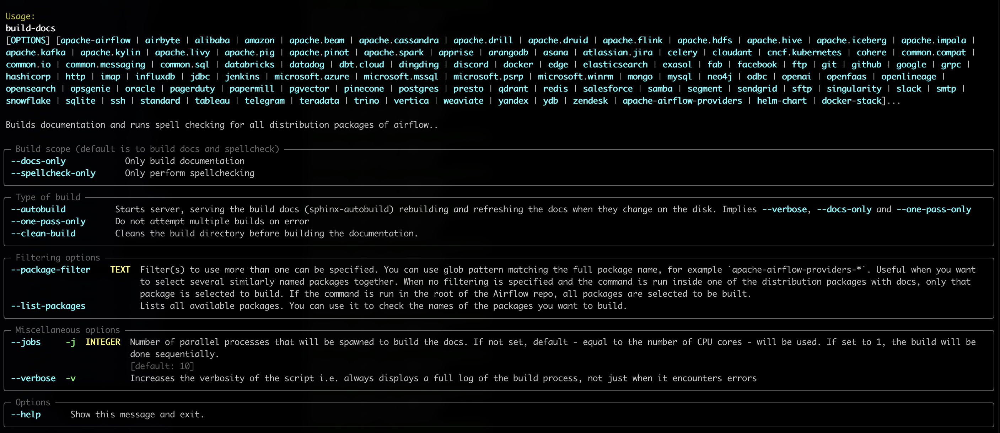

 .. Licensed to the Apache Software Foundation (ASF) under one
    or more contributor license agreements.  See the NOTICE file
    distributed with this work for additional information
    regarding copyright ownership.  The ASF licenses this file
    to you under the Apache License, Version 2.0 (the
    "License"); you may not use this file except in compliance
    with the License.  You may obtain a copy of the License at

 ..   http://www.apache.org/licenses/LICENSE-2.0

 .. Unless required by applicable law or agreed to in writing,
    software distributed under the License is distributed on an
    "AS IS" BASIS, WITHOUT WARRANTIES OR CONDITIONS OF ANY
    KIND, either express or implied.  See the License for the
    specific language governing permissions and limitations
    under the License.

Building documentation
======================

Airflow uses Sphinx to build the documentation. As of Airflow 3 when we split
the distributions into multiple packages, and moved the documentation to inside those
distribution building the documentation is way easier than it was on Airflow 2 and you
can usually iterate on documentation way faster, including automatically refreshing the
documentation in your browser when using ``sphinx-autobuild``.

The current distributions we have that have sphinx-buildable documentation are:

Documentation in separate distributions:

* ``airflow-core/docs`` - documentation for Airflow Core
* ``providers/**/docs`` - documentation for Providers
* ``chart/docs`` - documentation for Helm Chart
* ``task-sdk/docs`` - documentation for Task SDK (new format not yet published)
* ``airflow-ctl/docs`` - documentation for Airflow CLI (future)

Documentation for general overview and summaries not connected with any specific distribution:

* ``docker-stack-docs`` - documentation for Docker Stack'
* ``providers-summary-docs`` - documentation for provider summary page

Each of the distributions have a ``conf.py`` file in the root of the documentation and there
are various configuration parameters for sphinx configured in the ``conf.py`` files. A number of common
functions in those ``conf.py`` files are imported from ``deve-common`` distribution, from ``doc`` package,
you can also find ``sphinx_ext`` folder there that keeps extensions used during our documentation build.

Building documentation with uv in local venv
--------------------------------------------

Prerequisites
.............

*  `uv <https://docs.astral.sh/uv/>`_ as mandatory tool.

First of all. you need to have ``uv`` installed. You can very easily build the documentation
in your local virtualenv using ``uv`` command. Because some dependencies are not easy to be installed
on all OS-es, the ``docs`` group of dependencies is not installed by default when you run
``uv sync`` or ``uv run`` - so you need to pass ``--group docs`` when you want to run command locally
that installs the documentation dependencies.

* Python 3.11

.. warning::

   At least until we manage to workaround it you need to use at most Python 3.11 to build documentation for
   some packages (``samba`` and ``google``).

   When you try to build docs locally (at least on MacOS) with Python 3.12, you get
   ``TypeError: __type_params__ must be set to a tuple`` error related
   to `This CPython issue <https://github.com/python/cpython/issues/119011>`_

You should run ``uv python pin 3.11`` to pin to Python 3.11 in order to build documentation.

.. code-block::

   uv python pin 3.11

* Enchant system dependency

.. warning::

   There is a prerequisite needed to build the documentation locally. Airflow's Sphinx configuration
   depends on ``enchant`` C-library that needs to be installed and configured to be used by ``pyenchant``
   Python distribution package. You can install it as explained in the
   `pyenchant documentation <https://pyenchant.github.io/pyenchant/install.html>`__. Usually you use your
   package manager on Linux or ``brew`` on ``MacOS``. Sometimes you might also need to configure it
   so that ``pyenchant`` can find the dictionary files. You will get error like:

   .. code-block:: txt

       Could not import extension sphinxcontrib.spelling (exception: The 'enchant' C library was not
       found and maybe needs to be installed

The easiest way is to find where your enchant library is (usually libenchant-2.dylib)
and set the ``PYENCHANT_LIBRARY_PATH`` environment variable to that path in your ``.zshrc`` or ``.bashrc``
- depending which terminal you use and restart your terminal. For example on MacOS,
``brew install enchant`` or ``brew reinstall enchant`` will print the path where enchant is
installed and usually the library is in the ``lib`` subfolder of it. An example of line added
to one of the ``.rc`` files:

.. code-block:: bash

  export PYENCHANT_LIBRARY_PATH=/opt/homebrew/Cellar/enchant/2.8.2/lib/libenchant-2.dylib

Also for some of the providers you might have trouble installing dependencies. The ``uv run``
command will automatically install the needed dependencies for you but some of them might need extra
system dependencies. You can always revert to ``breeze`` way of building the documentation in this
case (see below) in case you have problems with ``uv run`` command not being able to install
the dependencies.

Once you have ``enchant`` installed and configured, you can build the documentation very easily.

Building the documentation
..........................

In Airflow 3 the documentation is placed closely to where source code is placed (in most distribution
packages it is in the ``doc`` subfolder of a distribution you want to build the documentation for.
Some distributions do not have ``docs`` subfolder - when they are ``doc-only``. The ``build-doc`` script
is installed automatically from ``devel-common`` distribution and available to run using ``uv run``
command (or directly ``build-docs`` inside the ``breeze`` container). This script will automatically
detect which distribution you are in and build the documentation for it.

.. note::

    You can also run all those commands directly (without ``uv run --group docs``) inside ``breeze``
    container, because there all dependencies are already installed and there is no need to
    sync dependencies.

.. code-block:: bash

      cd YOUR_DISTRIBUTION_FOLDER
      uv run --group docs build-docs

Example:

.. code-block:: bash

      cd providers/fab
      uv run --group docs build-docs

or

.. code-block:: bash

      cd airflow-core
      uv run --group docs build-docs

When you iterate on the documentation rather than wait for a complete build to pass you might want to
run a documentation server that will expose the built documentation and enable auto-refreshing the
documentation in your browser (including refreshing the browser when you change the documentation files):

.. code-block:: bash

      cd YOUR_DISTRIBUTION_FOLDER
      uv run --group docs build-docs --autobuild

Example:

.. code-block:: bash

      cd providers/fab
      uv run --group docs build-docs --autobuild

Building docs for multiple distributions at the same time
.........................................................

Sometimes - when you have references between distributions and you make changes in both distributions.
The common problem when you build such documentation might be when you want to - at the same time - modify
documentation for several distributions and refer to the new documentation from the other distribution and
that might not work because the documentation for the other distribution is not built yet.

If you just build one distribution, the links to the other distribution will not work. And the bad thing
might be that you have circular references and the links might be needed in both directions.

In order to fix that problem you should run the same ``build-docs`` command and specify the
packages you want to build together. The ``build-docs`` command will attempt to build the docs up to
three times in order to make sure that references between the packages are resolved.

Note that this will not work with ``--autobuild`` option because
the ``--autobuild`` option will only build the documentation for single distribution at a time. You will
see an error if you try to use ``--autobuild`` with multiple distributions. But once the "other" package
is build, you will be able ot use ``--autobuild`` for the other package (until you use ``--clean-build``
option).

You can run this command in the folder of the package you want to build - if the package needs another
package, usually local virtualenv created by ``uv`` will include sources for the other package. But in case
you refer to a package that has no direct dependency, some dependencies might not be installed, so you
might need to run it from the root of Airflow repository - when you run ``uv run`` there - all dependencies
for all packages are installed and available.

.. code-block:: bash
      cd YOUR_DISTRIBUTION_FOLDER
      uv run --group docs build-docs PACKAGE_1 PACKAGE_2

Example of building both amazon and google provider docs from amazon provider dir:

.. code-block:: bash

      cd providers/amazon
      uv run --group docs build-docs amazon google

Building documentation for all distributions
............................................

If you want to build all documentation at once, you can run the command from the root of the Airflow
repository and by default it will build all documentation in parallel.

.. code-block:: bash

      cd YOUR_ROOT_OF_AIRFLOW_REPO
      uv run --group docs build-docs

Complete command has the following parameters:

Building documentation in Breeze
--------------------------------

This used to be the default way of building documentation - but this method requires things to start
and run in Docker containers and is a bit slower than using ``uv`` - especially when iterating with changes.
and especially comparing it to sphinx-autobuild. However, the ``breeze`` CI container is guaranteed to have
all the dependencies installed that should allow to build all documentation for all distributions we have
and it is independent on the host / local environment including the OS you are using. You can always
fall-back to this method if - for some reason - your local documentation building is failing.

Basic command is ``breeze build-docs`` which except ``--auto-build`` has very similar options
as the ``uv run build-docs`` command.. You can also specify a number of options like selecting which
distribution packages you want to build and which kind of build to run (``--doc-only`` od ``--spelling-only``)
or request to ``--clean`` the build directory before building the documentation.

For example:

.. code-block:: bash

    breeze build-docs --doc-only --clean fab

Will build ``fab`` provider documentation and clean inventories and other build artifacts before.

You can also use ``breeze build-docs --help`` to see available options and head to
`breeze documentation <../dev/breeze/doc/03_developer_tasks.rst>`__ to learn more about the ``breeze``
command and it's options.

Hints and issues when building documentation
============================================

We are using Sphinx to build our documentation, and while powerful, Sphinx is known from speaking riddles.
Sometimes the errors printed by Sphinx build commands are a bit cryptic and do not tell you exactly how to
solve them.

Here are typical issues and guidelines on how to solve them:

WARNING: document isn't included in any toctree
-----------------------------------------------

This is by far most common and most cryptic error printed by Sphinx. What it really means is that the
document that this error refers to is not linked from anywhere else in any of the other documents. By
default all the documents that we generate, should be somehow reachable by the user from the main index, but
apparently there is some document that is not reachable, so no other document refer to it
either via index and Sphinx complains about this.

There might be several reasons for this:

* the document is referred to in some other documents with ``:ref:`` or ``:doc:`` but there is a typo and
  the name is wrong. Or the reference does not use properly formatted syntax for those directives.

* the document should be referred by some ``:toctree:`` directive that walks through some of the sub-folders
  of regular folders or the ``_api`` folders automatically generated by the ``autoapi`` extension.
  For example the below ``toctree`` will build index with references to all the files that are
  direct sub-directories of ``operators/airbyte`` and ``connections`` folders.

.. code-block::

   .. toctree::
    :hidden:
    :maxdepth: 1
    :caption: Guides

    Operators <operators/airbyte>
    Connection types <connections>

Including examples and other files
----------------------------------

When you include examples using ``.. exampleinclude::`` or ``.. include::`` directive, you should use relative
reference only to the files that are in the same distribution in one of the subfolders - when you know that
this file is relative to your documentation file. For example:

.. code-block::

   ``.. include:: ../_partials/prerequisite_tasks.rst``

This one will include ``prerequisite_tasks.rst`` file from ``_partials`` subdirectory of the parent folder of
the folder where the file you include it from is.

However, when you need to refer to files outside of your "docs" tree, it is better to start your reference
with ``/``. Such reference start from the "top" of your documentation tree in your distribution (usually
``docs`` folder in your distribution. This way, when we move the distributions around, we should be able
to easily move the whole distribution around by knowing how the distribution moved relatively to the included
file. For example:

.. code-block::

   ``.. include:: /../../../devel-common/src/sphinx_exts/includes/sections-and-options.rst``
