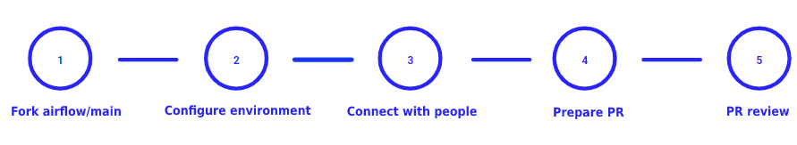
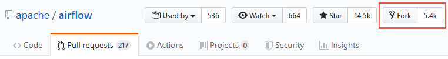
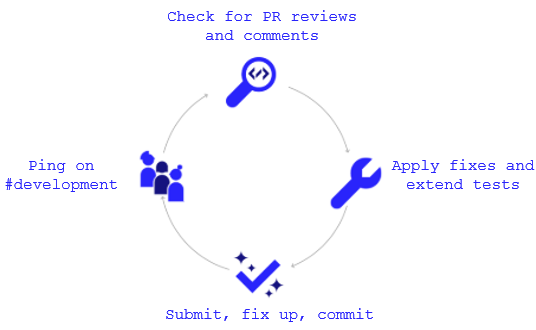

 .. Licensed to the Apache Software Foundation (ASF) under one
    or more contributor license agreements.  See the NOTICE file
    distributed with this work for additional information
    regarding copyright ownership.  The ASF licenses this file
    to you under the Apache License, Version 2.0 (the
    "License"); you may not use this file except in compliance
    with the License.  You may obtain a copy of the License at

 ..   http://www.apache.org/licenses/LICENSE-2.0

 .. Unless required by applicable law or agreed to in writing,
    software distributed under the License is distributed on an
    "AS IS" BASIS, WITHOUT WARRANTIES OR CONDITIONS OF ANY
    KIND, either express or implied.  See the License for the
    specific language governing permissions and limitations
    under the License.

Contribution Workflow
=====================

**The outline for this document in GitHub is available at top-right corner button (with 3-dots and 3 lines).**

Typically, you start your first contribution by reviewing open tickets
at `GitHub issues <https://github.com/apache/airflow/issues>`__.

If you create pull-request, you don't have to create an issue first, but if you want, you can do it.
Creating an issue will allow you to collect feedback or share plans with other people.

For example, you want to have the following sample ticket assigned to you:
`#7782: Add extra CC: to the emails sent by Airflow <https://github.com/apache/airflow/issues/7782>`_.

In general, your contribution includes the following stages:

1. Make your own `fork <https://help.github.com/en/github/getting-started-with-github/fork-a-repo>`__ of
   the Apache Airflow `main repository <https://github.com/apache/airflow>`__.

2. Create a `local virtualenv <07_local_virtualenv.rst>`_,
   initialize the `Breeze environment <../dev/breeze/doc/README.rst>`__, and
   install `prek tool <08_static_code_checks.rst#prek-hooks>`__.
   If you want to add more changes in the future, set up your fork and enable GitHub Actions.

3. Join `devlist <https://lists.apache.org/list.html?dev@airflow.apache.org>`__
   and set up a `Slack account <https://s.apache.org/airflow-slack>`__.

4. Make the change and create a `Pull Request (PR) from your fork <https://help.github.com/en/github/collaborating-with-issues-and-pull-requests/creating-a-pull-request-from-a-fork>`__.

5. Ping @ #contributors slack, comment @people. Be annoying. Be considerate.

Step 1: Fork the Apache Airflow Repo
------------------------------------
From the `apache/airflow <https://github.com/apache/airflow>`_ repo,
`create a fork <https://help.github.com/en/github/getting-started-with-github/fork-a-repo>`_:

Step 2: Configure Your Environment
----------------------------------

You can use several development environments for Airflow. If you prefer to have development environments
on your local machine, you might choose Local Virtualenv, or dockerized Breeze environment, however we
also have support for popular remote development environments: GitHub Codespaces and GitPodify.
You can see the differences between the various environments in `Development environments <06_development_environments.rst>`__.

The local environment instructions can be found in full in the `Local virtualenv <07_local_virtualenv.rst>`_ file.

The Breeze Docker Compose environment is to maintain a consistent and common development environment so that you
can replicate CI failures locally and work on solving them locally rather by pushing to CI.

The Breeze instructions can be found in full in the `Breeze documentation <../dev/breeze/doc/README.rst>`_ file.

You can configure the Docker-based Breeze development environment as follows:

1. Install the latest versions of the `Docker Community Edition <https://docs.docker.com/get-docker/>`_ and
`Docker Compose <https://docs.docker.com/compose/install/#install-compose>`_ and add them to the PATH.

2. Install `jq`_ on your machine. The exact command depends on the operating system (or Linux distribution) you use.

.. _jq: https://stedolan.github.io/jq/

For example, on Ubuntu:

.. code-block:: bash

   sudo apt install jq

or on macOS with `Homebrew <https://formulae.brew.sh/formula/jq>`_

.. code-block:: bash

   brew install jq

3. Enter Breeze, and run the following in the Airflow source code directory:

.. code-block:: bash

   breeze

Breeze starts with downloading the Airflow CI image from
the Docker Hub and installing all required dependencies.

This will enter the Docker environment and mount your local sources
to make them immediately visible in the environment.

4. Create a local virtualenv, for example:

.. code-block:: bash

   python3 -m venv venv && source venv/bin/activate

5. Initialize the created environment:

.. code-block:: bash

   ./scripts/tools/initialize_virtualenv.py

6. Open your IDE (for example, PyCharm) and select the virtual environment you created
   as the project's default virtual environment in your IDE.

Step 3: Connect with People
---------------------------

For effective collaboration, make sure to join the following Airflow groups:

- Mailing lists:

  - Developer's mailing list `<dev-subscribe@airflow.apache.org>`_
    (quite substantial traffic on this list)

  - All commits mailing list: `<commits-subscribe@airflow.apache.org>`_
    (very high traffic on this list)

  - Airflow users mailing list: `<users-subscribe@airflow.apache.org>`_
    (reasonably small traffic on this list)

- `Issues on GitHub <https://github.com/apache/airflow/issues>`__

- `Slack (chat) <https://s.apache.org/airflow-slack>`__

Step 4: Prepare PR
------------------

1. Update the local sources to address the issue.

   For example, to address this example issue, do the following:

   * Read about `email configuration in Airflow </airflow-core/docs/howto/email-config.rst>`__.

   * Find the class you should modify. For the example GitHub issue,
     this is `email.py <https://github.com/apache/airflow/blob/main/airflow-core/src/airflow/utils/email.py>`__.

   * Find the test class where you should add tests. For the example ticket,
     this is `test_email.py <https://github.com/apache/airflow/blob/main/airflow-core/tests/unit/utils/test_email.py>`__.

   * Make sure your fork's main is synced with Apache Airflow's main before you create a branch. See
     `How to sync your fork <10_working_with_git.rst#how-to-sync-your-fork>`_ for details.

   * Create a local branch for your development. Make sure to use latest
     ``apache/main`` as base for the branch. See `How to Rebase PR </contributing-docs/10_working_with_git.rst#how-to-rebase-pr>`_ for some details
     on setting up the ``apache`` remote. Note, some people develop their changes directly in their own
     ``main`` branches - this is OK and you can make PR from your main to ``apache/main`` but we
     recommend to always create a local branch for your development. This allows you to easily compare
     changes, have several changes that you work on at the same time and many more.
     If you have ``apache`` set as remote then you can make sure that you have latest changes in your main
     by ``git pull apache main`` when you are in the local ``main`` branch. If you have conflicts and
     want to override your locally changed main you can override your local changes with
     ``git fetch apache; git reset --hard apache/main``.

   * Modify the class and add necessary code and unit tests.

   * Run and fix all the `static checks <08_static_code_checks.rst>`__. If you have
     `prek installed <08_static_code_checks.rst#prek-hooks>`__,
     this step is automatically run while you are committing your code. If not, you can do it manually
     via ``git add`` and then ``prek``.

   * Run the appropriate tests as described in `Testing documentation <09_testing.rst>`__.

   * Consider adding a newsfragment to your PR so you can add an entry in the release notes.
     The following newsfragment types are supported:

     * `significant`
     * `feature`
     * `improvement`
     * `bugfix`
     * `doc`
     * `misc`

     To add a newsfragment, create an ``rst`` file named ``{pr_number}.{type}.rst`` (e.g. ``1234.bugfix.rst``)
     and place in either `airflow-core/newsfragments </airflow-core/newsfragments>`__ for core newsfragments,
     or `chart/newsfragments </chart/newsfragments>`__ for helm chart newsfragments.

     In general newsfragments must be one line.  For newsfragment type ``significant``,
     you should follow the template in ``airflow-core/newsfragments/template.significant.rst`` to include summary, body, change type and migrations rules needed.
     One thing to note here is that a ``significant`` newsfragment always doesn't have to be a breaking change, i.e. it can not have a change type and migration rules.
     This can also be done by the following command.

     .. code-block:: bash

        uv tool run towncrier create --dir airflow-core --config newsfragments/config.toml --content "`cat airflow-core/newsfragments/template.significant.rst`"

2. Rebase your fork, squash commits, and resolve all conflicts. See `How to rebase PR <10_working_with_git.rst#how-to-rebase-pr>`_
   if you need help with rebasing your change. Remember to rebase often if your PR takes a lot of time to
   review/fix. This will make rebase process much easier and less painful and the more often you do it,
   the more comfortable you will feel doing it.

3. Re-run static code checks again.

4. Make sure your commit has a good title and description of the context of your change, enough
   for maintainers reviewing it to understand why you are proposing a change. Make sure to follow other
   PR guidelines described in `Pull Request guidelines <05_pull_requests.rst#pull-request-guidelines>`_.
   Create Pull Request! Make yourself ready for the discussion!

5. The ``static checks`` and ``tests`` in your PR serve as a first-line-of-check, whether the PR
   passes the quality bar for Airflow. It basically means that until you get your PR green, it is not
   likely to get reviewed by maintainers unless you specifically ask for it and explain that you would like
   to get first pass of reviews and explain why achieving ``green`` status for it is not easy/feasible/desired.
   Similarly if your PR contains ``[WIP]`` in the title or it is marked as ``Draft`` it is not likely to get
   reviewed by maintainers unless you specifically ask for it and explain why and what specifically you want
   to get reviewed before it reaches ``Ready for review`` status. This might happen if you want to get initial
   feedback on the direction of your PR or if you want to get feedback on the design of your PR.

6. Avoid @-mentioning individual maintainers in your PR, unless you have good reason to believe that they are
   available, have time and/or interest in your PR. Generally speaking there are no "exclusive" reviewers for
   different parts of the code. Reviewers review PRs and respond when they have some free time to spare and
   when they feel they can provide some valuable feedback. If you want to get attention of maintainers, you can just
   follow-up on your PR and ask for review in general, however be considerate and do not expect "immediate"
   reviews. People review when they have time, most of the maintainers do such reviews in their
   free time, which is taken away from their families and other interests, so allow sufficient time before you
   follow-up - but if you see no reaction in several days, do follow-up, as with the number of PRs we have
   daily, some of them might simply fall through the cracks, and following up shows your interest in completing
   the PR as well as puts it at the top of "Recently commented" PRs. However, be considerate and mindful of
   the time zones, holidays, busy periods, and expect that some discussions and conversation might take time
   and get stalled occasionally. Generally speaking it's the author's responsibility to follow-up on the PR when
   they want to get it reviewed and merged.

Step 5: Pass PR Review
----------------------

Note that maintainers will use **Squash and Merge** instead of **Rebase and Merge**
when merging PRs and your commit will be squashed to single commit.

When a reviewer starts a conversation it is expected that you respond to questions, suggestions, doubts,
and generally it's great if all such conversations seem to converge to a common understanding. You do not
necessarily have to apply all the suggestions (often they are just opinions and suggestions even if they are
coming from seasoned maintainers) - it's perfectly ok that you respond to it with your own opinions and
understanding of the problem and your approach and if you have good arguments, presenting them is a good idea.

The reviewers might leave several types of responses:

* ``General PR comment`` - which usually means that there is a question/opinion/suggestion on how the PR can be
  improved, or it's an ask to explain how you understand the PR. You can usually quote some parts of such
  general comment and respond to it in your comments. Often comments that are raising questions in general
  might lead to different discussions, even a request to move the discussion to the devlist or even lead to
  completely new PRs created as a spin-off of the discussion.

* ``Comment/Conversation around specific lines of code`` - such conversation usually flags a potential
  improvement, or a potential problem with the code. It's a good idea to respond to such comments and explain
  your approach and understanding of the problem. The whole idea of a conversation is try to reach a consensus
  on a good way to address the problem. As an author you can resolve the conversation if you think the
  problem raised in the comment is resolved or ask the reviewer to re-review, confirm If you do not understand
  the comment, you can ask for clarifications. Generally assume good intention of the person who is reviewing
  your code and resolve conversations also having good intentions. Understand that it's not a person that
  is criticised or argued with, but rather the code and the approach. The important thing is to take care
  about quality of the the code and the project and want to make sure that the code is good.

  It's ok to mark the conversation resolved by anyone who can do it - it could be the author, who thinks
  the arguments are changes implemented make the conversation resolved, or the maintainer/person who
  started the conversation or it can be even marked as resolved by the maintainer who attempts to merge the
  PR and thinks that all conversations are resolved. However if you want to make sure attention and decision
  on merging the PR is given by maintainer, make sure you monitor, follow-up and close the conversations when
  you think they are resolved (ideally explaining why you think the conversation is resolved).

* ``Request changes`` - this is where maintainer is pretty sure that you should make a change to your PR
  because it contains serious flaw, design misconception, or a bug or it is just not in-line with the common
  approach Airflow community took on the issue. Usually you should respond to such request and either fix
  the problem or convince the maintainer that they were wrong (it happens more often than you think).
  Sometimes even if you do not agree with the request, it's a good idea to make the change anyway, because
  it might be a good idea to follow the common approach in the project. Sometimes it might even happen that
  two maintainers will have completely different opinions on the same issue and you will have to lead the
  discussion to try to achieve consensus. If you cannot achieve consensus and you think it's an important
  issue, you can ask for a vote on the issue by raising a devlist discussion - where you explain your case
  and follow up the discussion with a vote when you cannot achieve consensus there. The ``Request changes``
  status can be withdrawn by the maintainer, but if they don't - such PR cannot be merged - maintainers have
  the right to veto any code modification according to the `Apache Software Foundation rules <https://www.apache.org/foundation/voting.html#votes-on-code-modification>`_.

* ``Approval`` - this is given by a maintainer after the code has been reviewed and the maintainer agrees that
  it is a good idea to merge it. There might still be some unresolved conversations, requests and questions on
  such PR and you are expected to resolve them before the PR is merged. But the ``Approval`` status is a sign
  of trust from the maintainer who gave the approval that they think the PR is good enough as long as their
  comments will be resolved and they put the trust in the hands of the author and - possibly - other
  maintainers who will merge the request that they can do that without follow-up re-review and verification.

You need to have ``Approval`` of at least one maintainer (if you are maintainer yourself, it has to be
another maintainer). Ideally you should have 2 or more maintainers reviewing the code that touches
the core of Airflow - we do not have enforcement about ``2+`` reviewers required for Core of Airflow,
but maintainers will generally ask in the PR if they think second review is needed.

Your PR can be merged by a maintainer who will see that the PR is approved, all conversations are resolved
and the code looks good. The criteria for PR being merge-able are:

* ``green status for static checks and tests``
* ``conversations resolved``
* ``approval from 1 (or more for core changes) maintainers``
* no unresolved ``Request changes``

Once you reach the status, you do not need to do anything to get the PR merged. One of the maintainers
will merge such PRs. However if you see that for a few days such a PR is not merged, do not hesitate to comment
on your PR and mention that you think it is ready to be merged. Also, it's a good practice to rebase your PR
to latest ``main``, because there could be other changes merged in the meantime that might cause conflicts or
fail tests or static checks, so by rebasing a PR that has been build few days ago you make sure that it
still passes the tests and static checks today.
