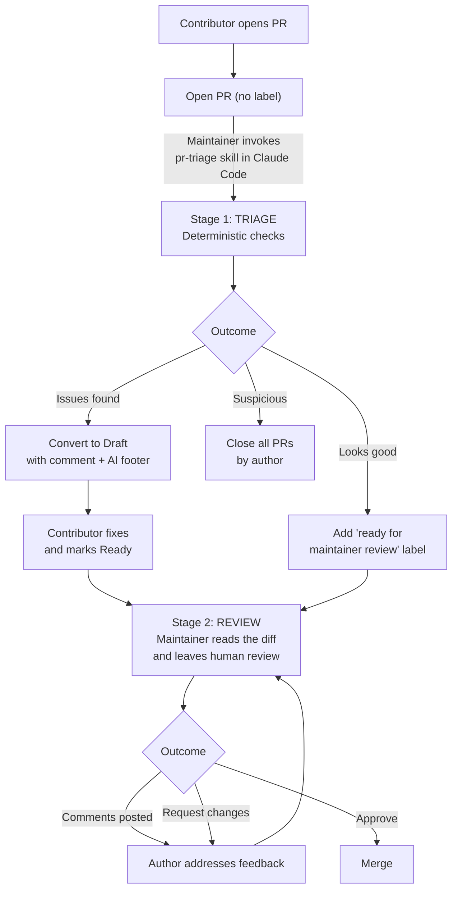

<!--
 Licensed to the Apache Software Foundation (ASF) under one
 or more contributor license agreements.  See the NOTICE file
 distributed with this work for additional information
 regarding copyright ownership.  The ASF licenses this file
 to you under the Apache License, Version 2.0 (the
 "License"); you may not use this file except in compliance
 with the License.  You may obtain a copy of the License at

   http://www.apache.org/licenses/LICENSE-2.0

 Unless required by applicable law or agreed to in writing,
 software distributed under the License is distributed on an
 "AS IS" BASIS, WITHOUT WARRANTIES OR CONDITIONS OF ANY
 KIND, either express or implied.  See the License for the
 specific language governing permissions and limitations
 under the License.
-->

# Maintainer PR Triage and Review

This document describes how Apache Airflow maintainers triage incoming Pull Requests
using **agentic skills** that run inside [Claude Code](https://claude.com/claude-code).
The triage workflow that used to live in the `breeze pr auto-triage` command has been
replaced by the [`pr-triage`](../.github/skills/pr-triage/SKILL.md) skill, which is
maintained as plain Markdown alongside the codebase and is invoked from a maintainer's
local Claude Code session.

## Overview

Apache Airflow receives a high volume of Pull Requests from contributors around the
world. Maintainers need to assess each PR for basic quality criteria, CI status, merge
conflicts, and code correctness before it can be merged. The skill-based workflow
streamlines this in a way that:

- **keeps the maintainer in control** — every state-changing action (draft, close,
  comment, label, rerun, approve workflow) is proposed by the skill and only happens
  on explicit confirmation;
- **stays human-readable and editable** — the skill is just Markdown checked into the
  repository, so anyone who reads English can change the rules, add a violation type,
  or reword a comment template, and the change goes through normal code review;
- **runs against `gh` and the GitHub GraphQL API directly** — no bespoke long-running
  tool, no per-developer setup beyond `gh auth login`.

## Why the first pass is automated

This anchor is referenced by the AI-attribution footer that the skill appends to every
contributor-facing comment. Contributors who follow the link from one of those
comments land here.

Apache Airflow gets dozens of new Pull Requests every day from contributors all over
the world. A maintainer's most valuable resource is the time they spend in actual
conversation with a contributor — explaining a design decision, helping a first-time
contributor land their change, weighing a tradeoff that only a human reviewer can
weigh. That time is finite and irreplaceable.

To protect it, the project splits PR handling into two stages:

1. **First pass — automated, mechanical, fast.** A maintainer invokes the
   [`pr-triage`](../.github/skills/pr-triage/SKILL.md) skill, which sweeps the open
   PR queue, runs purely deterministic checks (CI status, merge conflicts, unresolved
   review threads, workflow-approval state, draft staleness), and proposes a
   disposition for each PR. The maintainer confirms in batches — accepting a group of
   "rebase" PRs in one keystroke, pulling individual PRs out for case-by-case
   handling, skipping anything that doesn't fit. Comments posted by the skill are
   drafted by an AI-assisted tool, attribute themselves clearly to the contributor,
   and link back here so contributors understand why their first piece of feedback
   came from a tool rather than a person.
2. **Second pass — human review, on PRs that survived the first pass.** Once a PR
   carries the `ready for maintainer review` label, a maintainer reads the diff,
   leaves substantive comments, asks questions, suggests improvements, and ultimately
   approves or requests changes. This is the part of the work that has to be done by
   a human and benefits from a human's full attention.

Automating the first pass is what makes the second pass possible. Without it,
maintainers would spend most of their week mechanically checking whether each PR has
green CI, is rebased on `main`, and has no unresolved review threads — instead of
actually reviewing code. **There is no rush** — the skill grants generous grace
windows and posts comments that explicitly tell contributors to take their time. The
goal is not to push contributors faster; it is to make sure that when a maintainer
*does* engage, it is on a PR that is ready for that engagement.

## Two-stage workflow

Stage 1 is the focus of this document. Stage 2 is plain human review and intentionally
has no automation behind it — the dedicated review skill that may eventually live
alongside `pr-triage` is out of scope here.

## Stage 1: invoking the `pr-triage` skill

The skill lives at [`.github/skills/pr-triage/`](../.github/skills/pr-triage/) with a
matching symlink at `.claude/skills/pr-triage` so Claude Code picks it up without any
per-developer setup. Its entry point is
[`SKILL.md`](../.github/skills/pr-triage/SKILL.md); the rest of the directory breaks
the logic out by topic (classification, fetch-and-batch, stale sweeps, comment
templates, etc.).

To run a triage pass, open Claude Code in your local clone of the repository and ask
for a triage. Common phrasings the skill recognises:

- `triage the PR queue` — default sweep over open non-collaborator PRs
- `triage PR 12345` — re-triage a single PR (e.g. after a contributor pushed)
- `triage PRs with label area:core` — restrict to a label
- `triage PRs from <login>` — restrict to one author
- `triage review-for-me` — only PRs with review requested from you
- `run the stale sweep` — close stale drafts / convert inactive PRs to draft
- `morning triage` — same as the default sweep

The skill's `when_to_use` block (in [`SKILL.md`](../.github/skills/pr-triage/SKILL.md))
lists the full set of recognised invocation patterns.

### What the triage skill checks

The first-pass classification is purely deterministic — see
[`classify.md`](../.github/skills/pr-triage/classify.md) for the full decision matrix
— and runs against data fetched in a single aliased GraphQL call per page of PRs:

1. **Pending workflow approval** — first-time-contributor PRs whose CI workflows
   need maintainer approval before they can run. The skill surfaces these first so
   the maintainer can review the diff for tampering before approving.
2. **Merge conflicts** — `mergeable: CONFLICTING`. Routed straight to draft (GitHub's
   `update-branch` endpoint cannot resolve conflicts, so a `rebase` suggestion would
   waste a round-trip).
3. **Failing CI** — fetched via the repo-level
   `GET /repos/.../actions/runs?status=action_required` endpoint as the primary
   signal, then cross-referenced against `statusCheckRollup`. The REST call is
   needed because the rollup can return `SUCCESS` while real CI is still pending —
   see Golden rule 1b in [`SKILL.md`](../.github/skills/pr-triage/SKILL.md#golden-rules).
4. **Unresolved review threads** — open conversations from collaborators or from
   `copilot*[bot]` (Copilot threads are evaluated separately, with a 7-day grace
   window).
5. **Staleness** — drafts older than 7 days with no author reply after a triage
   comment, untriaged drafts older than 2 weeks, non-draft PRs with 4+ weeks of
   inactivity, and workflow-approval PRs with 4+ weeks of inactivity. See
   [`stale-sweeps.md`](../.github/skills/pr-triage/stale-sweeps.md).

### Available triage actions

For each classified PR the skill picks a default action and groups the PRs by action
so the maintainer can confirm a whole group at once. Per-PR override is always
available. The full set of actions:

| Action | Description |
|---|---|
| `draft` | Convert to draft and post a comment listing the violations. |
| `comment` | Post the violations comment without converting to draft (used while the contributor is actively working). |
| `close` | Close with a comment — used for repeated quality violations from the same author. Never accepts batch-confirm without a per-PR review. |
| `rebase` | Trigger GitHub's update-branch — only for PRs that are *not* in conflict (conflicting PRs are routed to `draft` instead). |
| `rerun` | Rerun failed CI checks — used for transient failures or for PRs whose failures match recent main-branch flakes. |
| `mark-ready` | Add the `ready for maintainer review` label, signalling that Stage 1 is done. **Never** applied while workflow approval is pending; the skill MUST verify zero `action_required` workflow runs before adding the label. |
| `ping` | Ping author or stale reviewer about an unresolved thread. |
| `approve-workflow` | Approve a first-time-contributor's pending CI workflows after a diff inspection. |
| `flag-suspicious` | Close all PRs from the author and apply the `suspicious changes detected` label. Per-PR confirm always required. |
| `skip` | Leave the PR alone this run. |

The full action recipes (the `gh` / GraphQL calls each action issues) are in
[`actions.md`](../.github/skills/pr-triage/actions.md); the comment bodies posted by
the `draft` / `comment` / `close` / `ping` actions are in
[`comment-templates.md`](../.github/skills/pr-triage/comment-templates.md).

### AI-attribution footer on every contributor-facing comment

Every comment the skill posts to a contributor ends with the same AI-attribution
footer (see [`comment-templates.md`](../.github/skills/pr-triage/comment-templates.md#ai-attribution-footer)).
The footer:

- tells the contributor the comment was drafted by an AI-assisted tool and may
  contain mistakes,
- promises that an Apache Airflow maintainer — a real person — will take the next
  look once the contributor has addressed the points raised,
- links back to the [Why the first pass is automated](#why-the-first-pass-is-automated)
  section above so the contributor can read the rationale for the two-stage process.

This is non-negotiable per Golden rule 8 in
[`SKILL.md`](../.github/skills/pr-triage/SKILL.md#golden-rules) — only the
intentionally-terse `suspicious-changes` template is exempt.

## Stage 2: human review

PRs that survive Stage 1 (carry the `ready for maintainer review` label) are read by
a maintainer. There is no automation behind this stage by design — the read,
critique, suggest, and approve loop is exactly the part of the work that needs full
human attention.

A separate `pr-review` skill that handles structured walk-throughs of long diffs may
appear alongside `pr-triage` in the future, but it is out of scope here. Anything
about line-level review comments, approve / request-changes submissions, or merge
decisions belongs in that future skill, not in `pr-triage`.

## Backlog statistics — the `pr-stats` skill

The [`pr-stats`](../.github/skills/pr-stats/SKILL.md) skill is the read-only,
no-mutations counterpart of `pr-triage`. It is the successor to the now-removed
`breeze pr stats` command and produces two summary tables grouped by `area:*` label:

- **Triaged PRs — Final State** — for PRs that were triaged and have since been
  closed or merged: closed-vs-merged ratios per area, plus the share of authors who
  responded before close.
- **Triaged PRs — Still Open** — for currently-open PRs: per-area triage coverage,
  draft / non-draft split, response rates, ready-for-review counts, plus age-bucket
  histograms (`<1d`, `1-7d`, `1-4w`, `>4w`) on both the time-since-drafting and
  time-since-author-response axes.

Invoke it the same way as `pr-triage` — open Claude Code in your local clone and ask
for stats. Phrasings the skill recognises include `run PR stats`, `show the area
breakdown`, `how is the PR queue doing`, or any variation on "give me numbers about
the open PR backlog". A typical workflow is `pr-stats` → spot the area with the worst
triage coverage → `pr-triage label:area:<that-area>` to act on it.

The skill detects triaged PRs by scanning comment bodies for the canonical
`Pull Request quality criteria` marker that `pr-triage` posts on every triage comment.
That same detector also catches the legacy HTML-comment markers left by the removed
breeze command, so historical triaged PRs are still counted correctly.

## Labels and PR states

The triage workflow uses the following labels and states:

| Label / State | Meaning |
|---|---|
| `ready for maintainer review` | PR has passed Stage 1 and is queued for human review. Applied only after the skill has verified that no workflow runs are awaiting approval. |
| `closed because of multiple quality violations` | PR was closed because the author has multiple open PRs with quality issues. |
| `suspicious changes detected` | PR (and all open PRs by the same author) was closed because the diff contained suspicious patterns (secret exfiltration, malicious CI modifications, etc.). |
| **Draft status** | PR was converted to draft because it does not meet quality criteria. The contributor is asked to fix the listed issues and mark the PR as "Ready for review" once done. |

## For contributors

You don't need to use the triage skill — it is a maintainer-facing workflow. But
understanding how it works helps you get your PRs reviewed faster.

**There is no rush.** The skill grants generous grace windows: 24 hours by default
before a PR with failing CI gets flagged, 96 hours once a maintainer has already
engaged with you, 7 days before a draft is closed for inactivity, 4 weeks before an
inactive non-draft PR is converted to draft. Comments posted by the skill explicitly
remind you that you can take your time.

Tips for getting through Stage 1 quickly:

1. **Start in Draft.** Keep your PR in draft until CI is green and you are confident
   it meets the [quality criteria](05_pull_requests.rst#pull-request-quality-criteria).
2. **Write a clear title and description.** Both the deterministic checks and a
   maintainer's eventual human review depend on these.
3. **Fix issues at your own pace.** If your PR is converted to draft with a comment,
   address each item and mark the PR as "Ready for review" again. The next triage
   pass will re-evaluate.
4. **Keep CI green.** Resolve CI failures before requesting review.
5. **Resolve review threads yourself.** Reviewers don't auto-close their own
   threads. Once you've addressed a thread — by pushing a fix or by replying with
   why the suggestion doesn't apply — click "Resolve conversation" yourself.
6. **Disclose Gen-AI usage.** If you used Gen-AI tools, include the disclosure block
   from the [Gen-AI guidelines](05_pull_requests.rst#gen-ai-assisted-contributions).
