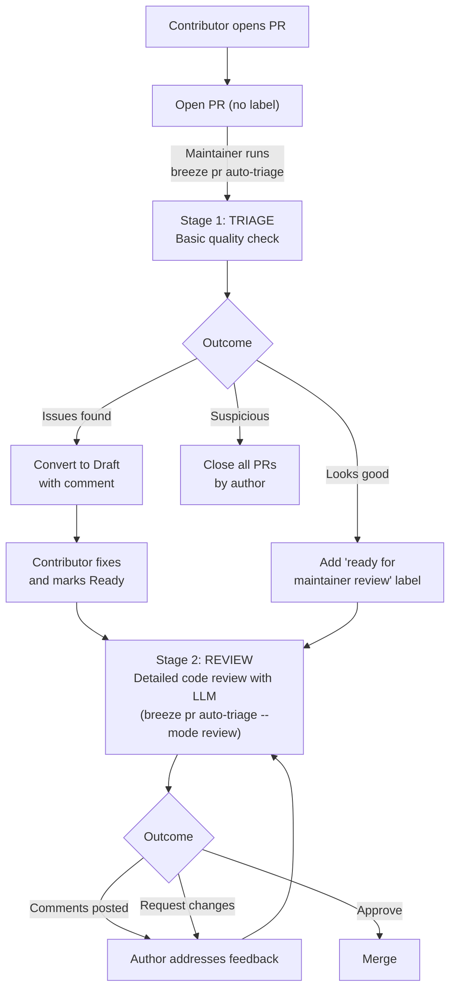
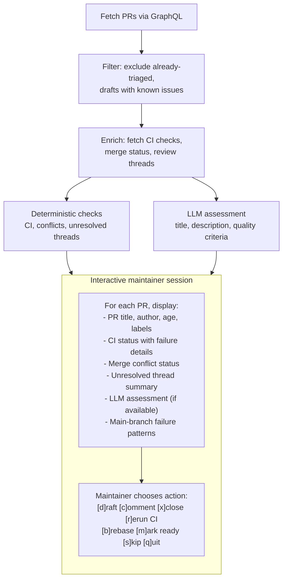
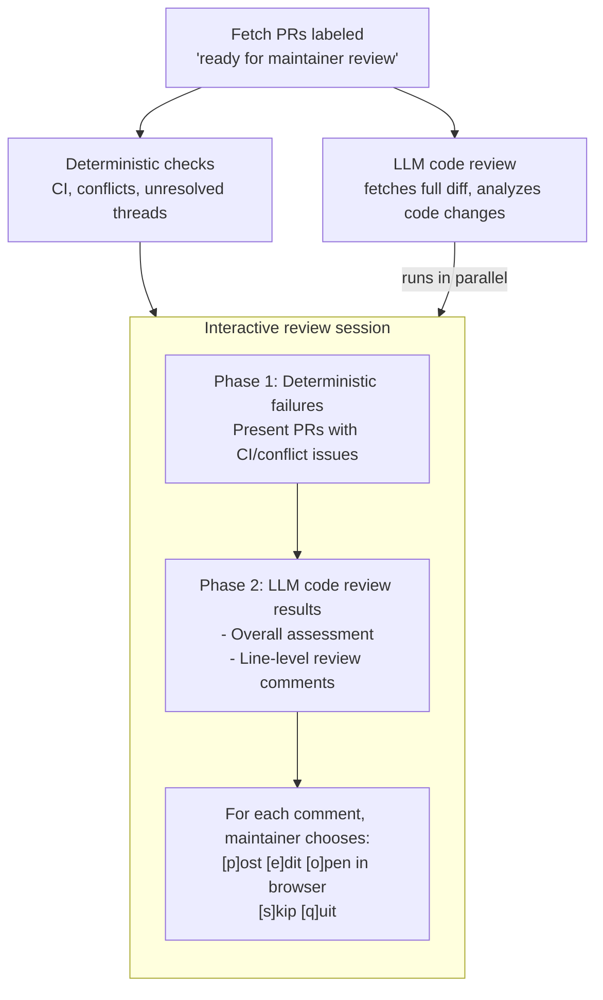

<!--
 Licensed to the Apache Software Foundation (ASF) under one
 or more contributor license agreements.  See the NOTICE file
 distributed with this work for additional information
 regarding copyright ownership.  The ASF licenses this file
 to you under the Apache License, Version 2.0 (the
 "License"); you may not use this file except in compliance
 with the License.  You may obtain a copy of the License at

   http://www.apache.org/licenses/LICENSE-2.0

 Unless required by applicable law or agreed to in writing,
 software distributed under the License is distributed on an
 "AS IS" BASIS, WITHOUT WARRANTIES OR CONDITIONS OF ANY
 KIND, either express or implied.  See the License for the
 specific language governing permissions and limitations
 under the License.
-->

# Maintainer PR Triage and Review

This document describes the **auto-triage** workflow — a maintainer-driven tool that helps
Apache Airflow maintainers triage and review incoming Pull Requests faster and in a more
informed way. The tool is part of the Breeze development environment and is invoked via
`breeze pr auto-triage`.

## Overview

Apache Airflow receives a high volume of Pull Requests from contributors around the world.
Maintainers need to assess each PR for basic quality criteria, CI status, merge conflicts,
and code correctness before it can be merged. The **auto-triage** tool streamlines this
process by combining deterministic checks with optional LLM-assisted analysis, while
keeping the maintainer firmly in control of every decision.

**Key principles:**

- **Maintainer-driven** — The tool presents information and suggests actions, but every
  decision (drafting, closing, commenting, approving) is made by a human maintainer
  through interactive prompts. The tool never takes autonomous action on PRs.

- **Two-stage process** — The workflow is split into two distinct stages: a fast **triage**
  pass that checks basic quality criteria, and a deeper **review** pass that performs
  detailed code analysis with LLM assistance.

- **Better-informed decisions** — By aggregating CI status, merge conflicts, unresolved
  review threads, main-branch failure patterns, and LLM assessments into a single
  interactive session, maintainers can make faster and more consistent decisions.

## Two-stage workflow

The auto-triage tool operates in two modes that correspond to the two stages of the PR
lifecycle:



## Stage 1: Triage

The triage stage is the first pass over incoming PRs. It focuses on whether each PR meets
the project's basic [quality criteria](05_pull_requests.rst#pull-request-quality-criteria)
and is ready for deeper review. It is invoked with:

```bash
breeze pr auto-triage
```

This is the default mode (`--mode triage`).

### What the triage stage checks

The triage stage performs a series of **deterministic checks** on each PR:

1. **CI status** — Are the CI checks passing, failing, or still running? PRs with
   in-progress workflows are skipped until the next triage run.

2. **Merge conflicts** — Does the PR have merge conflicts with the base branch? If so,
   the author needs to rebase.

3. **Unresolved review threads** — Are there open review conversations that the author
   has not addressed?

4. **Workflow approval** — For PRs from first-time contributors, CI workflows need
   maintainer approval before they can run. The triage tool presents these PRs first
   so maintainers can review the diff for security concerns before approving.

After deterministic checks, PRs that pass are optionally sent to an **LLM for quality
assessment**. The LLM evaluates the PR title, description, and metadata against the
project's [Pull Request guidelines](05_pull_requests.rst#pull-request-guidelines)
and flags potential violations such as:

- Generic or unclear PR titles
- Missing or inadequate descriptions
- Missing Gen-AI disclosure (when AI-generated patterns are detected)
- Unrelated changes bundled together

### How triage processes PRs



### Available triage actions

When the tool presents a PR, the maintainer can choose from these actions:

| Action | Description |
|--------|-------------|
| **[d]raft** | Convert the PR to draft status and post a comment listing the issues found. The maintainer can select which violations to include. This signals to the contributor that they should fix the listed issues and mark the PR as "Ready for review" once done. |
| **[c]omment** | Post a comment listing the issues without converting to draft. Useful when the contributor is actively working on the PR. |
| **[x]close** | Close the PR with a comment explaining the quality violations. Used when a contributor has multiple PRs with repeated quality issues. |
| **[r]erun** | Rerun failed CI checks. Useful when failures appear to be transient or caused by infrastructure issues. |
| **[b]rebase** | Suggest that the author rebase onto the latest base branch. |
| **[m]ark** | Add the `ready for maintainer review` label, signaling that the PR has passed basic quality checks and is ready for the deeper review stage. |
| **[s]kip** | Skip the PR without taking any action. |
| **[o]pen** | Open the PR in the browser for manual inspection. |
| **[w]show** | Display the PR diff inline in the terminal. |
| **[q]uit** | Exit the triage session. Progress on already-processed PRs is preserved. |

### CI failure analysis

The triage tool provides context to help maintainers distinguish between failures caused
by the PR and systemic failures on the main branch:

- **Main-branch failure patterns** — The tool fetches recent merged PRs and identifies
  checks that are consistently failing across the repository. When a PR's failed check
  matches a known main-branch failure, this is highlighted so the maintainer knows not
  to penalize the contributor.

- **Canary build status** — The status of scheduled canary builds on the main branch is
  displayed, giving maintainers a quick view of overall CI health.

- **Grace period** — CI failures are given a grace window before the PR is flagged,
  so contributors have time to address them at their own pace:

  - **24 hours (default)** — For new PRs without collaborator engagement. This gives
    contributors a full day to notice and fix CI issues.
  - **96 hours (extended)** — When a collaborator, member, or owner has already left
    a review or comment on the PR. This extended window acknowledges that the contributor
    is actively working with a maintainer and should not be rushed.

  PRs within their grace window are skipped during triage. The tool displays which
  grace period applies and whether collaborator engagement was detected.

## Stage 2: Review

The review stage is a deeper, LLM-assisted code review of PRs that have already passed
triage and carry the `ready for maintainer review` label. It is invoked with:

```bash
breeze pr auto-triage --mode review
```

### What the review stage does



The LLM code review analyzes the full PR diff and produces:

- **Overall assessment** — A high-level verdict: approve, comment, or request changes.
- **Summary** — A concise summary of what the PR does and potential concerns.
- **Line-level comments** — Specific review comments attached to particular files and
  lines, covering areas such as:

  - Correctness and potential bugs
  - Security concerns
  - Performance implications
  - Architecture boundary violations
  - API design issues
  - Testing coverage
  - Style and best practices

### Interactive comment submission

For each line-level comment proposed by the LLM, the maintainer reviews it and decides:

- **[p]ost** — Post the comment to the PR on GitHub.
- **[e]dit** — Edit the comment text before posting (opens `$EDITOR`).
- **[o]pen** — Open the relevant file in the browser for context.
- **[s]kip** — Skip this comment.
- **[q]uit** — Stop reviewing comments for this PR.

The tool detects duplicate comments (same file, line, and body as an existing review
comment) and skips them automatically. Nearby existing comments are displayed for context
to avoid redundant feedback.

After individual comments, the maintainer is prompted to post an overall review comment
summarizing the review.

## LLM integration and safety

The auto-triage tool optionally uses LLM providers (Claude or Codex) for PR assessment
and code review. Several safety measures are in place:

- **Read-only mode** — The LLM runs in a restricted permission mode with access only to
  read-only tools (file reading, code search). It cannot modify files or execute code.

- **Repository restriction** — LLM-assisted triage is only enabled for trusted
  repositories (`apache/airflow`).

- **No autonomous actions** — The LLM produces assessments and review comments, but
  posting them to GitHub always requires explicit maintainer confirmation through the
  interactive prompts.

- **Caching** — LLM results are cached by PR number and commit SHA, so re-running
  triage on the same PR state does not incur redundant LLM calls. The cache can be
  cleared with `--clear-llm-cache`.

- **Safety validation** — The tool checks for dangerous environment variables that could
  bypass LLM sandboxing and blocks them. The maintainer must confirm before LLM
  processing begins.

## Labels and PR states

The triage workflow uses specific labels and PR states to track progress:

| Label / State | Meaning |
|---------------|---------|
| `ready for maintainer review` | PR has passed basic quality checks and is queued for detailed review (Stage 2). |
| `closed because of multiple quality violations` | PR was closed because the contributor has multiple open PRs with quality issues. |
| `suspicious changes detected` | PR (and all PRs by the same author) was closed because the diff contained suspicious patterns (e.g., secret exfiltration attempts, malicious CI modifications). |
| **Draft status** | PR was converted to draft because it does not meet quality criteria. The contributor should fix the issues listed in the comment and mark it as "Ready for review" when done. |

## Common usage examples

Triage all open PRs:

```bash
breeze pr auto-triage
```

Triage PRs with a specific label:

```bash
breeze pr auto-triage --label area:core
```

Triage a single PR:

```bash
breeze pr auto-triage --pr 12345
```

Review PRs that are ready for maintainer review:

```bash
breeze pr auto-triage --mode review
```

Review PRs assigned to you:

```bash
breeze pr auto-triage --mode review --reviews-for-me
```

Use only deterministic checks (no LLM):

```bash
breeze pr auto-triage --check-mode api
```

Dry run (no actions taken, just display what would be done):

```bash
breeze pr auto-triage --dry-run
```

Clear cached LLM assessments and start fresh:

```bash
breeze pr auto-triage --clear-llm-cache
```

## For contributors

As a contributor, you don't need to use the auto-triage tool — it is a maintainer-facing
workflow. However, understanding how it works helps you get your PRs reviewed faster.

**There is no rush.** We want contributors to work at their own pace. The triage tool
gives you a generous grace period to fix issues — 24 hours by default, and 96 hours
once a maintainer has started engaging with your PR. Comments posted by the tool will
always remind you that you can take your time.

Here are some tips:

1. **Start with Draft** — Keep your PR in draft until CI passes and you're confident
   it meets the [quality criteria](05_pull_requests.rst#pull-request-quality-criteria).

2. **Write a clear title and description** — Both the deterministic checks and the LLM
   assessment evaluate your PR title and description. A descriptive title and meaningful
   description help your PR pass triage quickly.

3. **Fix issues at your own pace** — If your PR is converted to draft with a comment
   listing issues, address each one and mark the PR as "Ready for review" when you're
   done. The next triage run will re-evaluate it. There is no deadline.

4. **Keep CI green** — Resolve CI failures before requesting review. The triage tool
   flags PRs with failing checks, but gives you at least 24 hours before flagging
   (96 hours if a maintainer has already engaged).

5. **Resolve review threads** — Unresolved conversations block the triage process. Address
   reviewer feedback and resolve the threads.

6. **Disclose Gen-AI usage** — If you used Gen-AI tools, include a disclosure in the PR
   description per the [Gen-AI guidelines](05_pull_requests.rst#gen-ai-assisted-contributions).
   The LLM assessment flags PRs that appear AI-generated but lack disclosure.
