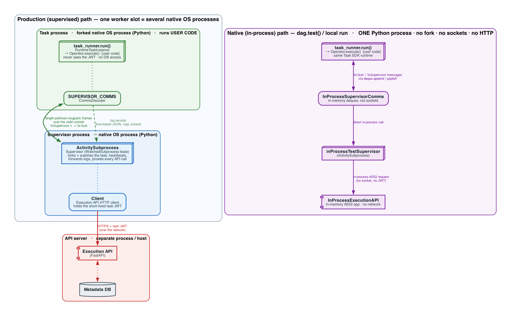
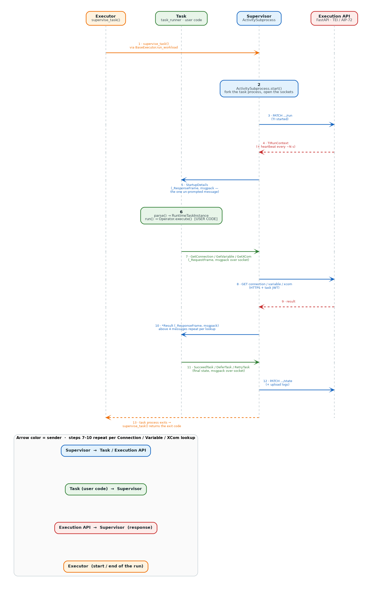
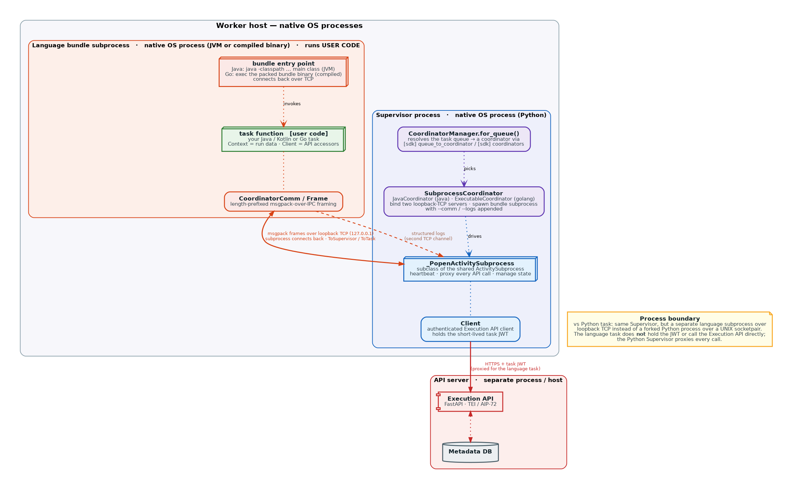
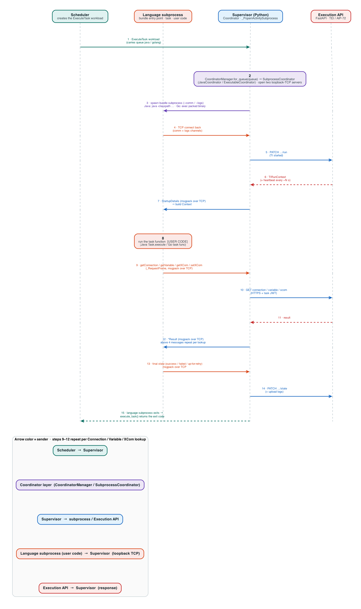

 .. Licensed to the Apache Software Foundation (ASF) under one
    or more contributor license agreements.  See the NOTICE file
    distributed with this work for additional information
    regarding copyright ownership.  The ASF licenses this file
    to you under the Apache License, Version 2.0 (the
    "License"); you may not use this file except in compliance
    with the License.  You may obtain a copy of the License at

 ..   http://www.apache.org/licenses/LICENSE-2.0

 .. Unless required by applicable law or agreed to in writing,
    software distributed under the License is distributed on an
    "AS IS" BASIS, WITHOUT WARRANTIES OR CONDITIONS OF ANY
    KIND, either express or implied.  See the License for the
    specific language governing permissions and limitations
    under the License.

Task execution architecture
===========================

This page is developer-facing background on what happens *inside a worker when a task actually runs* — how the
Task SDK, the Supervisor and Coordinator processes, and the language runtimes work together: which processes
are involved, and the classes and protocols they use to communicate. It complements
`Adding a new language SDK <30_new_language_sdk.rst>`__, which covers how to implement the coordinator side of
a new runtime.

End users do not need any of this: they only configure a queue and write tasks. The user-facing guides live
under `Non-Python Task SDKs <../airflow-core/docs/authoring-and-scheduling/language-sdks/index.rst>`__.

.. contents:: Table of Contents
   :local:
   :depth: 2

Python Task SDK execution
-------------------------

When a *worker* actually runs a task, it does not run the user's code directly. Instead it starts a
lightweight **Supervisor** that runs in its own **native operating-system process** and
*forks* a second native process in which the **Task SDK** runtime (``task_runner``) executes the user code.
The two processes talk over a socket, and the Supervisor is the only side that ever holds the short-lived
task JWT or talks to the *Execution API* — the user's code never sees the token and never touches the
database.

The same runtime can also run *in-process* (a single Python process, no fork, no sockets, no HTTP) for
``dag.test()`` and local runs. The diagram below contrasts the two paths and marks where each Python process
lives:

The message flow of a supervised run — startup, running the user code, proxied Connection/Variable/XCom
lookups, heartbeats, and reporting the final state — is shown below as a sequence diagram, with each process
on its own lifeline. The **Supervisor** sits in the middle, so the Task ↔ Supervisor request/response
round-trip (the task asks for a Connection/Variable/XCom and gets the answer back) reads as arrows going back
and forth between neighboring lifelines. Each arrow is numbered, colored by its sender, and labeled with the
message class or protocol used:

Non-Python language SDKs (Go and Java)
--------------------------------------

The Task Execution Interface (TEI) introduced in AIP-72 is language-agnostic, so a task can also be written in
a **compiled, non-Python language**. A Python Dag still declares the task with ``@task.stub(queue=...)`` (so
Python and non-Python tasks can be mixed in one Dag), but the actual work is delegated to the matching runtime.
The **first-class** integration is the **Coordinator** layer — the Python Supervisor drives the language runtime
as a subprocess and proxies every Execution-API call for it — and it is the shared direction for the Java, Go,
and upcoming language SDKs.

**Coordinator (Java and Go).** Both the
`Java SDK <../airflow-core/docs/authoring-and-scheduling/language-sdks/java.rst>`__ and the
`Go SDK <../airflow-core/docs/authoring-and-scheduling/language-sdks/go.rst>`__ *reuse* the existing Python
Supervisor through the **Coordinator** layer. ``CoordinatorManager`` resolves the task's ``queue`` to a
``BaseCoordinator`` — a ``SubprocessCoordinator`` (``JavaCoordinator`` for the ``java`` queue,
``ExecutableCoordinator`` for the Go bundle queue, e.g. ``golang``), or the built-in ``_PythonCoordinator``
otherwise. The coordinator opens two loopback-TCP servers, spawns the language **bundle subprocess**
(``java -classpath ... <main class>`` for Java, or the self-contained packed bundle binary for Go) with
``--comm`` / ``--logs`` appended, and drives it with ``_PopenActivitySubprocess`` (a subclass of the shared
``ActivitySubprocess``). The subprocess connects *back* over TCP and speaks the **same msgpack protocol** as a
Python task, so the Python side heartbeats, manages state, and **proxies every Execution-API call** — meaning
the language task, like a Python task, never holds the task JWT itself. Because the mature Python Supervisor
handles the Airflow-facing concerns, this mode inherits its capabilities — remote task logs (S3/GCS, etc.), the
full range of task states, and alternate XCom backends:

The end-to-end workflow of a coordinator task — from ``@task.stub`` through the coordinator, the language
subprocess, the proxied Connection/Variable/XCom lookups, and reporting the final state — is shown below as a
sequence diagram. The **Supervisor** is the central lifeline, so the subprocess ↔ Supervisor round-trip over
loopback TCP is drawn as arrows going back and forth to its neighbours:

.. note::

    Both the Go and Java SDKs are **experimental** and under active development. See the
    `Non-Python Task SDKs guide <../airflow-core/docs/authoring-and-scheduling/language-sdks/index.rst>`__ —
    the `Go SDK <../airflow-core/docs/authoring-and-scheduling/language-sdks/go.rst>`__ and
    `Java SDK <../airflow-core/docs/authoring-and-scheduling/language-sdks/java.rst>`__ pages — for current
    status, quick-starts, and known limitations.

------

To implement the coordinator side of a new runtime, continue to
`Adding a new language SDK <30_new_language_sdk.rst>`__.
