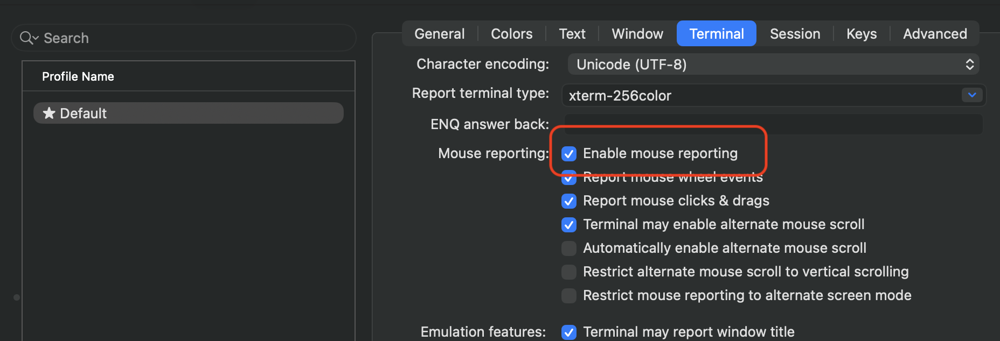

<!--
 Licensed to the Apache Software Foundation (ASF) under one
 or more contributor license agreements.  See the NOTICE file
 distributed with this work for additional information
 regarding copyright ownership.  The ASF licenses this file
 to you under the Apache License, Version 2.0 (the
 "License"); you may not use this file except in compliance
 with the License.  You may obtain a copy of the License at

   http://www.apache.org/licenses/LICENSE-2.0

 Unless required by applicable law or agreed to in writing,
 software distributed under the License is distributed on an
 "AS IS" BASIS, WITHOUT WARRANTIES OR CONDITIONS OF ANY
 KIND, either express or implied.  See the License for the
 specific language governing permissions and limitations
 under the License.
 -->

# Quick Reference: mprocs Support in Breeze

## Basic Command

```bash
breeze start-airflow --use-mprocs
```

Breeze will start Airflow components using mprocs to manage multiple processes in a single terminal window.
It will generate dynamically the required configuration based on the selected executor and options and use it,
the generated configuration file is stored in a `files` folder inside the container, so that you can also
use it outside of Breeze if needed.

## Common Usage Patterns

| Command                                                       | Description                     |
|---------------------------------------------------------------|---------------------------------|
| `breeze start-airflow --use-mprocs`                           | Start Airflow with mprocs       |
| `breeze start-airflow --use-mprocs --debug scheduler`         | Debug scheduler with mprocs     |
| `breeze start-airflow --use-mprocs --executor CeleryExecutor` | Use mprocs with Celery          |
| `breeze start-airflow --use-mprocs --dev-mode`                | Use mprocs in dev mode          |
| `breeze start-airflow --use-tmux`                             | Explicitly use tmux (default)   |


## mprocs Keyboard Shortcuts

| Key  | Action                     |
|------|----------------------------|
| `↑↓` | Navigate between processes |
| `r`  | Restart selected process   |
| `x`  | Stop selected process      |
| `s`  | Start selected process     |
| `a`  | Add new process            |
| `q`  | Quit mprocs                |
| `?`  | Show help                  |

## Components Managed

- **scheduler** - Airflow scheduler
- **api_server** (3.x+) / **webserver** (2.x) - Web interface
- **triggerer** - Handles deferred tasks
- **dag_processor** - Standalone DAG processor (when enabled)
- **celery_worker** - Celery worker (with CeleryExecutor)
- **flower** - Celery monitoring (when enabled)
- **edge_worker** - Edge worker (with EdgeExecutor)

## Environment Variables

| Variable                   | Purpose                         |
|----------------------------|---------------------------------|
| `USE_MPROCS`               | Enable mprocs mode              |
| `INTEGRATION_CELERY`       | Enable Celery components        |
| `CELERY_FLOWER`            | Enable Flower UI                |
| `STANDALONE_DAG_PROCESSOR` | Enable standalone DAG processor |
| `BREEZE_DEBUG_*`           | Enable component debugging      |
| `DEV_MODE`                 | Enable development mode         |

## Debug Ports (when debugging enabled)

| Component     | Port   |
|---------------|--------|
| Scheduler     | 50231  |
| Dag Processor | 50232  |
| Triggerer     | 50233  |
| API Server    | 50234  |
| Celery Worker | 50235  |
| Edge Worker   | 50236  |
| Web Server    | 50237  |

## Installation

mprocs is **pre-installed** in the Breeze CI image as of Airflow 3.x development. No additional setup is required.

For older images or custom setups, you can install mprocs manually:

```bash
# Download and install mprocs
MPROCS_VERSION="0.7.3"
SYSTEM=$(uname -s | tr '[:upper:]' '[:lower:]')
PLATFORM=$([ "$(uname -m)" = "aarch64" ] && echo "arm64" || echo "amd64")
curl -L "https://github.com/pvolok/mprocs/releases/download/v${MPROCS_VERSION}/mprocs-${MPROCS_VERSION}-${SYSTEM}-${PLATFORM}.tar.gz" \
  | tar -xz -C /usr/local/bin/ mprocs
chmod +x /usr/local/bin/mprocs
```

## Mac OS X and iTerm2

Mouse clicks are not captured correctly by default in iTerm2 (which is often used by developers on MacOS).
You need to configure "Enable Mouse reporting" to take advantage of the copying feature and mouse handling:



## Standalone execution

You can run mprocs outside of Breeze for custom setups. Create a `mprocs.yaml` configuration
file defining your processes, then start mprocs:

```bash
mprocs -f mprocs.yaml
```

An example [mprocs.yaml](mprocs.yaml) file for Airflow components can be found in this directory - it has
default configurations for all major Airflow components, but you can customize it as needed by copying it
elsewhere and modifying the process definitions, uncommenting the commented or adding new processes.
