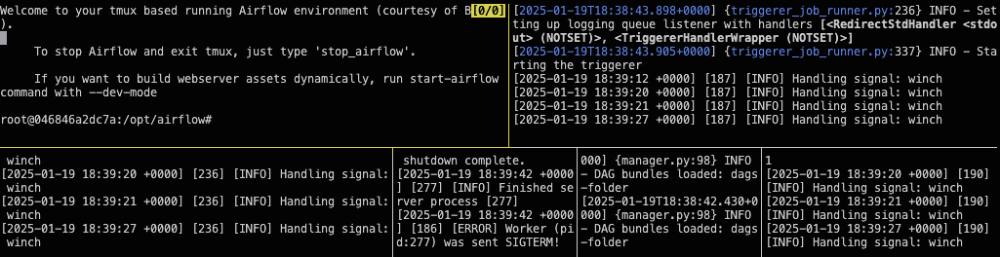

 .. Licensed to the Apache Software Foundation (ASF) under one
    or more contributor license agreements.  See the NOTICE file
    distributed with this work for additional information
    regarding copyright ownership.  The ASF licenses this file
    to you under the Apache License, Version 2.0 (the
    "License"); you may not use this file except in compliance
    with the License.  You may obtain a copy of the License at

 ..   http://www.apache.org/licenses/LICENSE-2.0

 .. Unless required by applicable law or agreed to in writing,
    software distributed under the License is distributed on an
    "AS IS" BASIS, WITHOUT WARRANTIES OR CONDITIONS OF ANY
    KIND, either express or implied.  See the License for the
    specific language governing permissions and limitations
    under the License.

**The outline for this document in GitHub is available at top-right corner button (with 3-dots and 3 lines).**

Connect your project to Gitpod
~~~~~~~~~~~~~~~~~~~~~~~~~~~~~~

1. Go to |airflow_github| and fork the project.

   .. |airflow_github| raw:: html

     <a href="https://github.com/apache/airflow/" target="_blank">https://github.com/apache/airflow/</a>

   .. raw:: html

     

       
     

2. Go to your github account's fork of airflow, click on ``Code``, and copy the clone link.

   .. raw:: html

      

        
      

3. Add go to https://gitpod.io/#<copied-url> as shown.

   .. raw:: html

      

        
      

Installing Breeze
---------------

Gitpod's default image includes the required packages. You can install Breeze using either uv or pipx:

Using uv (recommended):

.. code-block:: bash

   pip install uv
   uv tool install -e ./dev/breeze

Using pipx (alternative):

.. code-block:: bash

   pip install pipx
   pipx install -e ./dev/breeze

Initializing the Database
-----------------------

Before running the webserver, you need to initialize the database:

1. Reset the database:

   .. code-block:: bash

      airflow db reset

2. Create an admin user:

   .. code-block:: bash

      airflow users create \
         --role Admin \
         --username admin \
         --password admin \
         --email admin@example.com \
         --firstname foo \
         --lastname bar

.. note::
    ``airflow users`` command is only available when `FAB auth manager <https://airflow.apache.org/docs/apache-airflow-providers-fab/stable/auth-manager/index.html>`_ is enabled.

Starting Airflow
--------------

To start Airflow using Breeze:

.. code-block:: bash

   breeze start-airflow

To start Airflow in development mode:

.. code-block:: bash

   breeze start-airflow --dev-mode

.. note::
   The database initialization step is required only when you plan to use the webserver.
   When running tests, the database will be initialized automatically on the first run.

Next Steps
---------

For typical development tasks, refer to the `Quick Start Guide <../03b_contributors_quick_start_seasoned_developers.rst>`_.
