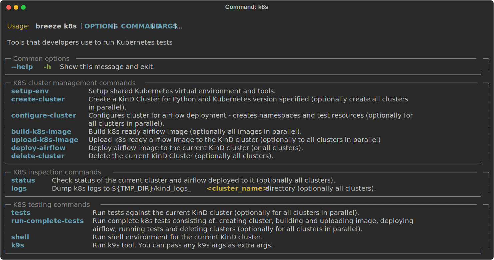

 .. Licensed to the Apache Software Foundation (ASF) under one
    or more contributor license agreements.  See the NOTICE file
    distributed with this work for additional information
    regarding copyright ownership.  The ASF licenses this file
    to you under the Apache License, Version 2.0 (the
    "License"); you may not use this file except in compliance
    with the License.  You may obtain a copy of the License at

 ..   http://www.apache.org/licenses/LICENSE-2.0

 .. Unless required by applicable law or agreed to in writing,
    software distributed under the License is distributed on an
    "AS IS" BASIS, WITHOUT WARRANTIES OR CONDITIONS OF ANY
    KIND, either express or implied.  See the License for the
    specific language governing permissions and limitations
    under the License.

Kubernetes tests
================

Airflow has tests that are run against real Kubernetes cluster. We are using
`Kind <https://kind.sigs.k8s.io/>`_ to create and run the cluster. We integrated the tools to start/stop/
deploy and run the cluster tests in our repository and into Breeze development environment.

KinD has a really nice ``kind`` tool that you can use to interact with the cluster. Run ``kind --help`` to
learn more.

**The outline for this document in GitHub is available at top-right corner button (with 3-dots and 3 lines).**

K8S test environment
--------------------

Before running ``breeze k8s`` cluster commands you need to setup the environment. This is done
by ``breeze k8s setup-env`` command. Breeze in this command makes sure to download tools that
are needed to run k8s tests: Helm, Kind, Kubectl in the right versions and sets up a
Python virtualenv that is needed to run the tests. All those tools and env are setup in
``.build/.k8s-env`` folder. You can activate this environment yourselves as usual by sourcing
``bin/activate`` script, but since we are supporting multiple clusters in the same installation
it is best if you use ``breeze k8s shell`` with the right parameters specifying which cluster
to use.

Multiple cluster support
------------------------

The main feature of ``breeze k8s`` command is that it allows you to manage multiple KinD clusters - one
per each combination of Python and Kubernetes version. This is used during CI where we can run same
tests against those different clusters - even in parallel.

The cluster name follows the pattern ``airflow-python-X.Y-vA.B.C`` where X.Y is a major/minor Python version
and A.B.C is Kubernetes version. Example cluster name:  ``airflow-python-3.9-v1.24.0``

Most of the commands can be executed in parallel for multiple images/clusters by adding ``--run-in-parallel``
to create clusters or deploy airflow. Similarly checking for status, dumping logs and deleting clusters
can be run with ``--all`` flag and they will be executed sequentially for all locally created clusters.

Per-cluster configuration files
-------------------------------

Once you start the cluster, the configuration for it is stored in a dynamically created folder - separate
folder for each python/kubernetes_version combination. The folder is ``./build/.k8s-clusters/<CLUSTER_NAME>``

There are two files there:

* kubectl config file stored in .kubeconfig file - our scripts set the ``KUBECONFIG`` variable to it
* KinD cluster configuration in .kindconfig.yml file - our scripts set the ``KINDCONFIG`` variable to it

The ``KUBECONFIG`` file is automatically used when you enter any of the ``breeze k8s`` commands that use
``kubectl`` or when you run ``kubectl`` in the k8s shell. The ``KINDCONFIG`` file is used when cluster is
started but You and the ``k8s`` command can inspect it to know for example what port is forwarded to the
webserver running in the cluster.

The files are deleted by ``breeze k8s delete-cluster`` command.

Managing Kubernetes Cluster
---------------------------

For your testing, you manage Kind cluster with ``k8s`` breeze command group. Those commands allow to
created:

The command group allows you to setup environment, start/stop/recreate/status Kind Kubernetes cluster,
configure cluster (via ``create-cluster``, ``configure-cluster`` command). Those commands can be run with
``--run-in-parallel`` flag for all/selected clusters and they can be executed in parallel.

In order to deploy Airflow, the PROD image of Airflow need to be extended and example dags and POD
template files should be added to the image. This is done via ``build-k8s-image``, ``upload-k8s-image``.
This can also be done for all/selected images/clusters in parallel via ``--run-in-parallel`` flag.

Then Airflow (by using Helm Chart) can be deployed to the cluster via ``deploy-airflow`` command.
This can also be done for all/selected images/clusters in parallel via ``--run-in-parallel`` flag. You can
pass extra options when deploying airflow to configure your depliyment.

You can check the status, dump logs and finally delete cluster via ``status``, ``logs``, ``delete-cluster``
commands. This can also be done for all created clusters in parallel via ``--all`` flag.

You can interact with the cluster (via ``shell`` and ``k9s`` commands).

You can run set of k8s tests via ``tests`` command. You can also run tests in parallel on all/selected
clusters by ``--run-in-parallel`` flag.

Running tests with Kubernetes Cluster
-------------------------------------

You can either run all tests or you can select which tests to run. You can also enter interactive virtualenv
to run the tests manually one by one.

Running Kubernetes tests via breeze:

.. code-block:: bash

      breeze k8s tests
      breeze k8s tests TEST TEST [TEST ...]

Optionally add ``--executor``:

.. code-block:: bash

      breeze k8s tests --executor CeleryExecutor
      breeze k8s tests --executor CeleryExecutor TEST TEST [TEST ...]

Entering shell with Kubernetes Cluster
--------------------------------------

This shell is prepared to run Kubernetes tests interactively. It has ``kubectl`` and ``kind`` cli tools
available in the path, it has also activated virtualenv environment that allows you to run tests via pytest.

The virtualenv is available in ./.build/.k8s-env/
The binaries are available in ``.build/.k8s-env/bin`` path.

.. code-block:: bash

      breeze k8s shell

Optionally add ``--executor``:

.. code-block:: bash

      breeze k8s shell --executor CeleryExecutor

K9s CLI - debug Kubernetes in style!
------------------------------------

Breeze has built-in integration with fantastic k9s CLI tool, that allows you to debug the Kubernetes
installation effortlessly and in style. K9S provides terminal (but windowed) CLI that helps you to:

- easily observe what's going on in the Kubernetes cluster
- observe the resources defined (pods, secrets, custom resource definitions)
- enter shell for the Pods/Containers running,
- see the log files and more.

You can read more about k9s at `https://k9scli.io/ <https://k9scli.io/>`_

Here is the screenshot of k9s tools in operation:

You can enter the k9s tool via breeze (after you deployed Airflow):

.. code-block:: bash

      breeze k8s k9s

You can exit k9s by pressing Ctrl-C.

Typical testing pattern for Kubernetes tests
--------------------------------------------

The typical session for tests with Kubernetes looks like follows:

1. Prepare the environment:

.. code-block:: bash

    breeze k8s setup-env

The first time you run it, it should result in creating the virtualenv and installing good versions
of kind, kubectl and helm. All of them are installed in ``./build/.k8s-env`` (binaries available in ``bin``
sub-folder of it).

.. code-block:: text

    Initializing K8S virtualenv in /Users/jarek/IdeaProjects/airflow/.build/.k8s-env
    Reinstalling PIP version in /Users/jarek/IdeaProjects/airflow/.build/.k8s-env
    Installing necessary packages in /Users/jarek/IdeaProjects/airflow/.build/.k8s-env
    The ``kind`` tool is not downloaded yet. Downloading 0.14.0 version.
    Downloading from: https://github.com/kubernetes-sigs/kind/releases/download/v0.14.0/kind-darwin-arm64
    The ``kubectl`` tool is not downloaded yet. Downloading 1.24.3 version.
    Downloading from: https://storage.googleapis.com/kubernetes-release/release/v1.24.3/bin/darwin/arm64/kubectl
    The ``helm`` tool is not downloaded yet. Downloading 3.9.2 version.
    Downloading from: https://get.helm.sh/helm-v3.9.2-darwin-arm64.tar.gz
    Extracting the darwin-arm64/helm to /Users/jarek/IdeaProjects/airflow/.build/.k8s-env/bin
    Moving the helm to /Users/jarek/IdeaProjects/airflow/.build/.k8s-env/bin/helm

This prepares the virtual environment for tests and downloads the right versions of the tools
to ``./build/.k8s-env``

2. Create the KinD cluster:

.. code-block:: bash

    breeze k8s create-cluster

Should result in KinD creating the K8S cluster.

.. code-block:: text

    Config created in /Users/jarek/IdeaProjects/airflow/.build/.k8s-clusters/airflow-python-3.9-v1.24.2/.kindconfig.yaml:

    # Licensed to the Apache Software Foundation (ASF) under one
    # or more contributor license agreements.  See the NOTICE file
    # distributed with this work for additional information
    # regarding copyright ownership.  The ASF licenses this file
    # to you under the Apache License, Version 2.0 (the
    # "License"); you may not use this file except in compliance
    # with the License.  You may obtain a copy of the License at
    #
    #   http://www.apache.org/licenses/LICENSE-2.0
    #
    # Unless required by applicable law or agreed to in writing,
    # software distributed under the License is distributed on an
    # "AS IS" BASIS, WITHOUT WARRANTIES OR CONDITIONS OF ANY
    # KIND, either express or implied.  See the License for the
    # specific language governing permissions and limitations
    # under the License.
    ---
    kind: Cluster
    apiVersion: kind.x-k8s.io/v1alpha4
    networking:
      ipFamily: ipv4
      apiServerAddress: "127.0.0.1"
      apiServerPort: 48366
    nodes:
      - role: control-plane
      - role: worker
        extraPortMappings:
          - containerPort: 30007
            hostPort: 18150
            listenAddress: "127.0.0.1"
            protocol: TCP

    Creating cluster "airflow-python-3.9-v1.24.2" ...
     ✓ Ensuring node image (kindest/node:v1.24.2) 🖼
     ✓ Preparing nodes 📦 📦
     ✓ Writing configuration 📜
     ✓ Starting control-plane 🕹️
     ✓ Installing CNI 🔌
     ✓ Installing StorageClass 💾
     ✓ Joining worker nodes 🚜
    Set kubectl context to "kind-airflow-python-3.9-v1.24.2"
    You can now use your cluster with:

    kubectl cluster-info --context kind-airflow-python-3.9-v1.24.2

    Not sure what to do next? 😅  Check out https://kind.sigs.k8s.io/docs/user/quick-start/

    KinD Cluster API server URL: http://localhost:48366
    Connecting to localhost:18150. Num try: 1
    Error when connecting to localhost:18150 : ('Connection aborted.', RemoteDisconnected('Remote end closed connection without response'))

    Airflow webserver is not available at port 18150. Run `breeze k8s deploy-airflow --python 3.9 --kubernetes-version v1.24.2` to (re)deploy airflow

    KinD cluster airflow-python-3.9-v1.24.2 created!

    NEXT STEP: You might now configure your cluster by:

    breeze k8s configure-cluster

3. Configure cluster for Airflow - this will recreate namespace and upload test resources for Airflow.

.. code-block:: bash

    breeze k8s configure-cluster

.. code-block:: text

    Configuring airflow-python-3.9-v1.24.2 to be ready for Airflow deployment
    Deleting K8S namespaces for kind-airflow-python-3.9-v1.24.2
    Error from server (NotFound): namespaces "airflow" not found
    Error from server (NotFound): namespaces "test-namespace" not found
    Creating namespaces
    namespace/airflow created
    namespace/test-namespace created
    Created K8S namespaces for cluster kind-airflow-python-3.9-v1.24.2

    Deploying test resources for cluster kind-airflow-python-3.9-v1.24.2
    persistentvolume/test-volume created
    persistentvolumeclaim/test-volume created
    service/airflow-webserver-node-port created
    Deployed test resources for cluster kind-airflow-python-3.9-v1.24.2

    NEXT STEP: You might now build your k8s image by:

    breeze k8s build-k8s-image

4. Check the status of the cluster

.. code-block:: bash

    breeze k8s status

Should show the status of current KinD cluster.

.. code-block:: text

    ========================================================================================================================
    Cluster: airflow-python-3.9-v1.24.2

        * KUBECONFIG=/Users/jarek/IdeaProjects/airflow/.build/.k8s-clusters/airflow-python-3.9-v1.24.2/.kubeconfig
        * KINDCONFIG=/Users/jarek/IdeaProjects/airflow/.build/.k8s-clusters/airflow-python-3.9-v1.24.2/.kindconfig.yaml

    Cluster info: airflow-python-3.9-v1.24.2

    Kubernetes control plane is running at https://127.0.0.1:48366
    CoreDNS is running at https://127.0.0.1:48366/api/v1/namespaces/kube-system/services/kube-dns:dns/proxy

    To further debug and diagnose cluster problems, use 'kubectl cluster-info dump'.

    Storage class for airflow-python-3.9-v1.24.2

    NAME                 PROVISIONER             RECLAIMPOLICY   VOLUMEBINDINGMODE      ALLOWVOLUMEEXPANSION   AGE
    standard (default)   rancher.io/local-path   Delete          WaitForFirstConsumer   false                  83s

    Running pods for airflow-python-3.9-v1.24.2

    NAME                                                               READY   STATUS    RESTARTS   AGE
    coredns-6d4b75cb6d-rwp9d                                           1/1     Running   0          71s
    coredns-6d4b75cb6d-vqnrc                                           1/1     Running   0          71s
    etcd-airflow-python-3.9-v1.24.2-control-plane                      1/1     Running   0          84s
    kindnet-ckc8l                                                      1/1     Running   0          69s
    kindnet-qqt8k                                                      1/1     Running   0          71s
    kube-apiserver-airflow-python-3.9-v1.24.2-control-plane            1/1     Running   0          84s
    kube-controller-manager-airflow-python-3.9-v1.24.2-control-plane   1/1     Running   0          84s
    kube-proxy-6g7hn                                                   1/1     Running   0          69s
    kube-proxy-dwfvp                                                   1/1     Running   0          71s
    kube-scheduler-airflow-python-3.9-v1.24.2-control-plane            1/1     Running   0          84s

    KinD Cluster API server URL: http://localhost:48366
    Connecting to localhost:18150. Num try: 1
    Error when connecting to localhost:18150 : ('Connection aborted.', RemoteDisconnected('Remote end closed connection without response'))

    Airflow webserver is not available at port 18150. Run `breeze k8s deploy-airflow --python 3.9 --kubernetes-version v1.24.2` to (re)deploy airflow

    Cluster healthy: airflow-python-3.9-v1.24.2

5. Build the image base on PROD Airflow image. You need to build the PROD image first (the command will
   guide you if you did not) either by running the build separately or passing ``--rebuild-base-image``
   flag. Generally speaking you should not need to rebuild the base image unless you changed some
   dependencies in ``pyproject.toml``.

   Note, that this command by default uses ``--use-uv`` flag to use ``uv`` to build the image instead of
   ``pip``. This is much faster (50% faster) to rebuild the image and iterate with your code but if you
   built your PROD image without ``--use-uv`` flag the first build might be a bit longer. You can also switch
   to using a ``pip`` based image by specifying ``--no-use-uv`` flag together with ``--rebuid-base-image``.

.. code-block:: bash

    breeze k8s build-k8s-image

.. code-block:: text

    Building the K8S image for Python 3.9 using airflow base image: ghcr.io/apache/airflow/main/prod/python3.9:latest

    [+] Building 0.1s (8/8) FINISHED
     => [internal] load build definition from Dockerfile                                                                                                                                                                                                                                           0.0s
     => => transferring dockerfile: 301B                                                                                                                                                                                                                                                           0.0s
     => [internal] load .dockerignore                                                                                                                                                                                                                                                              0.0s
     => => transferring context: 35B                                                                                                                                                                                                                                                               0.0s
     => [internal] load metadata for ghcr.io/apache/airflow/main/prod/python3.9:latest                                                                                                                                                                                                             0.0s
     => [1/3] FROM ghcr.io/apache/airflow/main/prod/python3.9:latest                                                                                                                                                                                                                               0.0s
     => [internal] load build context                                                                                                                                                                                                                                                              0.0s
     => => transferring context: 3.00kB                                                                                                                                                                                                                                                            0.0s
     => CACHED [2/3] COPY airflow/example_dags/ /opt/airflow/dags/                                                                                                                                                                                                                                 0.0s
     => CACHED [3/3] COPY airflow/kubernetes_executor_templates/ /opt/airflow/pod_templates/                                                                                                                                                                                                       0.0s
     => exporting to image                                                                                                                                                                                                                                                                         0.0s
     => => exporting layers                                                                                                                                                                                                                                                                        0.0s
     => => writing image sha256:c0bdd363c549c3b0731b8e8ce34153d081f239ee2b582355b7b3ffd5394c40bb                                                                                                                                                                                                   0.0s
     => => naming to ghcr.io/apache/airflow/main/prod/python3.9-kubernetes:latest

    NEXT STEP: You might now upload your k8s image by:

    breeze k8s upload-k8s-image

5. Upload the image to KinD cluster - this uploads your image to make it available for the KinD cluster.

.. code-block:: bash

    breeze k8s upload-k8s-image

.. code-block:: text

    K8S Virtualenv is initialized in /Users/jarek/IdeaProjects/airflow/.build/.k8s-env
    Good version of kind installed: 0.14.0 in /Users/jarek/IdeaProjects/airflow/.build/.k8s-env/bin
    Good version of kubectl installed: 1.25.0 in /Users/jarek/IdeaProjects/airflow/.build/.k8s-env/bin
    Good version of helm installed: 3.9.2 in /Users/jarek/IdeaProjects/airflow/.build/.k8s-env/bin
    Stable repo is already added
    Uploading Airflow image ghcr.io/apache/airflow/main/prod/python3.9-kubernetes to cluster airflow-python-3.9-v1.24.2
    Image: "ghcr.io/apache/airflow/main/prod/python3.9-kubernetes" with ID "sha256:fb6195f7c2c2ad97788a563a3fe9420bf3576c85575378d642cd7985aff97412" not yet present on node "airflow-python-3.9-v1.24.2-worker", loading...
    Image: "ghcr.io/apache/airflow/main/prod/python3.9-kubernetes" with ID "sha256:fb6195f7c2c2ad97788a563a3fe9420bf3576c85575378d642cd7985aff97412" not yet present on node "airflow-python-3.9-v1.24.2-control-plane", loading...

    NEXT STEP: You might now deploy airflow by:

    breeze k8s deploy-airflow

7. Deploy Airflow to the cluster - this will use Airflow Helm Chart to deploy Airflow to the cluster.

.. code-block:: bash

    breeze k8s deploy-airflow

.. code-block:: text

    Deploying Airflow for cluster airflow-python-3.9-v1.24.2
    Deploying kind-airflow-python-3.9-v1.24.2 with airflow Helm Chart.
    Copied chart sources to /private/var/folders/v3/gvj4_mw152q556w2rrh7m46w0000gn/T/chart_edu__kir/chart
    Deploying Airflow from /private/var/folders/v3/gvj4_mw152q556w2rrh7m46w0000gn/T/chart_edu__kir/chart
    NAME: airflow
    LAST DEPLOYED: Tue Aug 30 22:57:54 2022
    NAMESPACE: airflow
    STATUS: deployed
    REVISION: 1
    TEST SUITE: None
    NOTES:
    Thank you for installing Apache Airflow 2.3.4!

    Your release is named airflow.
    You can now access your dashboard(s) by executing the following command(s) and visiting the corresponding port at localhost in your browser:

    Airflow Webserver:     kubectl port-forward svc/airflow-webserver 8080:8080 --namespace airflow
    Default Webserver (Airflow UI) Login credentials:
        username: admin
        password: admin
    Default Postgres connection credentials:
        username: postgres
        password: postgres
        port: 5432

    You can get Fernet Key value by running the following:

        echo Fernet Key: $(kubectl get secret --namespace airflow airflow-fernet-key -o jsonpath="{.data.fernet-key}" | base64 --decode)

    WARNING:
        Kubernetes workers task logs may not persist unless you configure log persistence or remote logging!
        Logging options can be found at: https://airflow.apache.org/docs/helm-chart/stable/manage-logs.html
        (This warning can be ignored if logging is configured with environment variables or secrets backend)

    ###########################################################
    #  WARNING: You should set a static webserver secret key  #
    ###########################################################

    You are using a dynamically generated webserver secret key, which can lead to
    unnecessary restarts of your Airflow components.

    Information on how to set a static webserver secret key can be found here:
    https://airflow.apache.org/docs/helm-chart/stable/production-guide.html#webserver-secret-key
    Deployed kind-airflow-python-3.9-v1.24.2 with airflow Helm Chart.

    Airflow for Python 3.9 and K8S version v1.24.2 has been successfully deployed.

    The KinD cluster name: airflow-python-3.9-v1.24.2
    The kubectl cluster name: kind-airflow-python-3.9-v1.24.2.

    KinD Cluster API server URL: http://localhost:48366
    Connecting to localhost:18150. Num try: 1
    Established connection to webserver at http://localhost:18150/health and it is healthy.
    Airflow Web server URL: http://localhost:18150 (admin/admin)

    NEXT STEP: You might now run tests or interact with airflow via shell (kubectl, pytest etc.) or k9s commands:

    breeze k8s tests

    breeze k8s shell

    breeze k8s k9s

8. Run Kubernetes tests

Note that the tests are executed in production container not in the CI container.
There is no need for the tests to run inside the Airflow CI container image as they only
communicate with the Kubernetes-run Airflow deployed via the production image.
Those Kubernetes tests require virtualenv to be created locally with airflow installed.
The virtualenv required will be created automatically when the scripts are run.

8a) You can run all the tests

.. code-block:: bash

    breeze k8s tests

.. code-block:: text

    Running tests with kind-airflow-python-3.9-v1.24.2 cluster.
     Command to run: pytest kubernetes_tests
    ========================================================================================= test session starts ==========================================================================================
    platform darwin -- Python 3.9.9, pytest-6.2.5, py-1.11.0, pluggy-1.0.0 -- /Users/jarek/IdeaProjects/airflow/.build/.k8s-env/bin/python
    cachedir: .pytest_cache
    rootdir: /Users/jarek/IdeaProjects/airflow/kubernetes_tests
    plugins: anyio-3.6.1, instafail-0.4.2, xdist-2.5.0, forked-1.4.0, timeouts-1.2.1, cov-3.0.0
    setup timeout: 0.0s, execution timeout: 0.0s, teardown timeout: 0.0s
    collected 55 items

    test_kubernetes_executor.py::TestKubernetesExecutor::test_integration_run_dag PASSED                                                                                            [  1%]
    test_kubernetes_executor.py::TestKubernetesExecutor::test_integration_run_dag_with_scheduler_failure PASSED                                                                     [  3%]
    test_kubernetes_pod_operator.py::TestKubernetesPodOperatorSystem::test_already_checked_on_failure PASSED                                                                        [  5%]
    test_kubernetes_pod_operator.py::TestKubernetesPodOperatorSystem::test_already_checked_on_success   ...

8b) You can enter an interactive shell to run tests one-by-one

This enters the virtualenv in ``.build/.k8s-env`` folder:

.. code-block:: bash

    breeze k8s shell

Once you enter the environment, you receive this information:

.. code-block:: text

    Entering interactive k8s shell.

    (kind-airflow-python-3.9-v1.24.2:KubernetesExecutor)>

In a separate terminal you can open the k9s CLI:

.. code-block:: bash

    breeze k8s k9s

Use it to observe what's going on in your cluster.

9. Debugging in IntelliJ/PyCharm

It is very easy to running/debug Kubernetes tests with IntelliJ/PyCharm. Unlike the regular tests they are
in ``kubernetes_tests`` folder and if you followed the previous steps and entered the shell using
``breeze k8s shell`` command, you can setup your IDE very easy to run (and debug) your
tests using the standard IntelliJ Run/Debug feature. You just need a few steps:

9a) Add the virtualenv as interpreter for the project:

The virtualenv is created in your "Airflow" source directory in the
``.build/.k8s-env`` folder and you have to find ``python`` binary and choose
it when selecting interpreter.

9b) Choose pytest as test runner:

9c) Run/Debug tests using standard "Run/Debug" feature of IntelliJ

NOTE! The first time you run it, it will likely fail with
``kubernetes.config.config_exception.ConfigException``:
``Invalid kube-config file. Expected key current-context in kube-config``. You need to add KUBECONFIG
environment variable copying it from the result of "breeze k8s tests":

.. code-block:: bash

    echo ${KUBECONFIG}

    /home/jarek/code/airflow/.build/.kube/config

The configuration for Kubernetes is stored in your "Airflow" source directory in ".build/.kube/config" file
and this is where KUBECONFIG env should point to.

You can iterate with tests while you are in the virtualenv. All the tests requiring Kubernetes cluster
are in "kubernetes_tests" folder. You can add extra ``pytest`` parameters then (for example ``-s`` will
print output generated test logs and print statements to the terminal immediately. You should have
kubernetes_tests as your working directory.

.. code-block:: bash

    pytest test_kubernetes_executor.py::TestKubernetesExecutor::test_integration_run_dag_with_scheduler_failure -s

You can modify the tests or KubernetesPodOperator and re-run them without re-deploying
Airflow to KinD cluster.

10. Dumping logs

Sometimes You want to see the logs of the clister. This can be done with ``breeze k8s logs``.

.. code-block:: bash

    breeze k8s logs

11. Redeploying airflow

Sometimes there are side effects from running tests. You can run ``breeze k8s deploy-airflow --upgrade``
without recreating the whole cluster.

.. code-block:: bash

    breeze k8s deploy-airflow --upgrade

If needed you can also delete the cluster manually (within the virtualenv activated by
``breeze k8s shell``:

.. code-block:: bash

    kind get clusters
    kind delete clusters <NAME_OF_THE_CLUSTER>

Kind has also useful commands to inspect your running cluster:

.. code-block:: text

    kind --help

12. Stop KinD cluster when you are done

.. code-block:: bash

    breeze k8s delete-cluster

.. code-block:: text

    Deleting KinD cluster airflow-python-3.9-v1.24.2!
    Deleting cluster "airflow-python-3.9-v1.24.2" ...
    KinD cluster airflow-python-3.9-v1.24.2 deleted!

Running complete k8s tests
--------------------------

You can also run complete k8s tests with

.. code-block:: bash

    breeze k8s run-complete-tests

This will create cluster, build images, deploy airflow run tests and finally delete clusters as single
command. It is the way it is run in our CI, you can also run such complete tests in parallel.

-----

For other kinds of tests look at `Testing document <../09_testing.rst>`__
