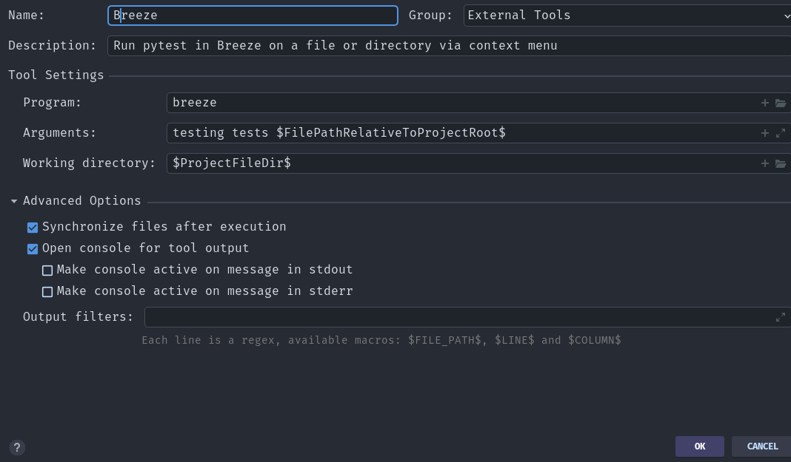
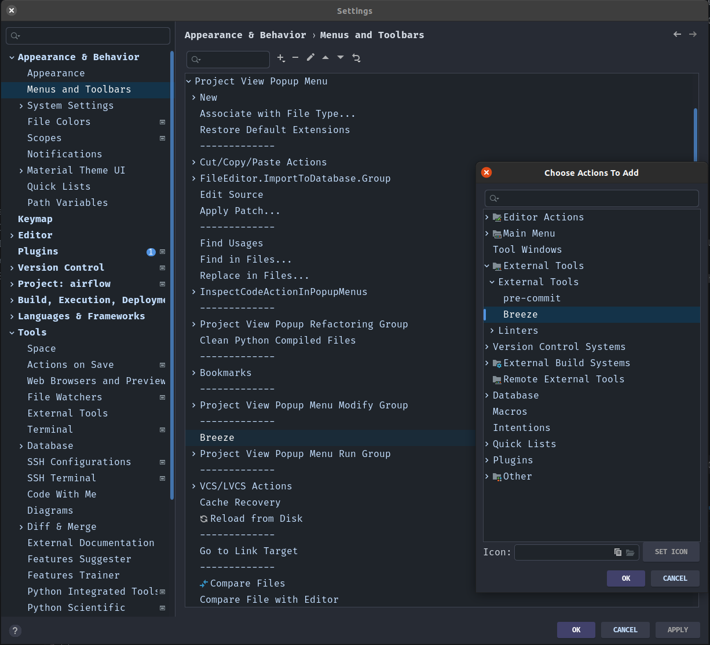
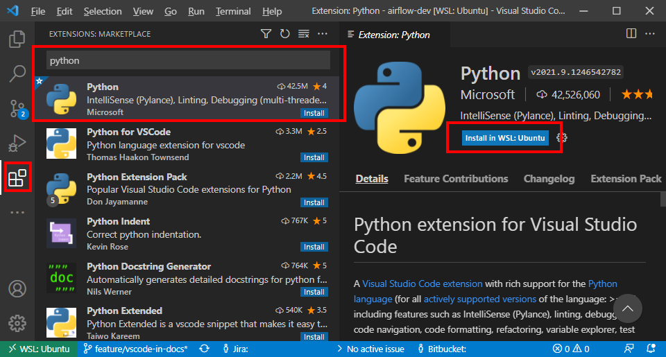
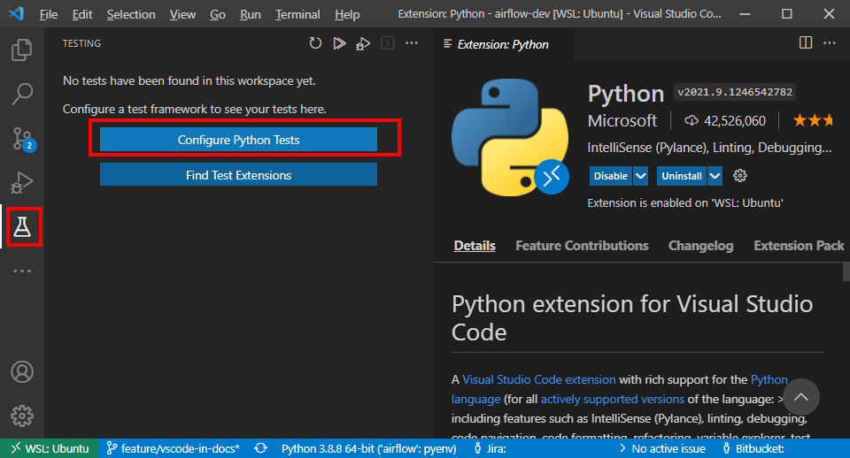
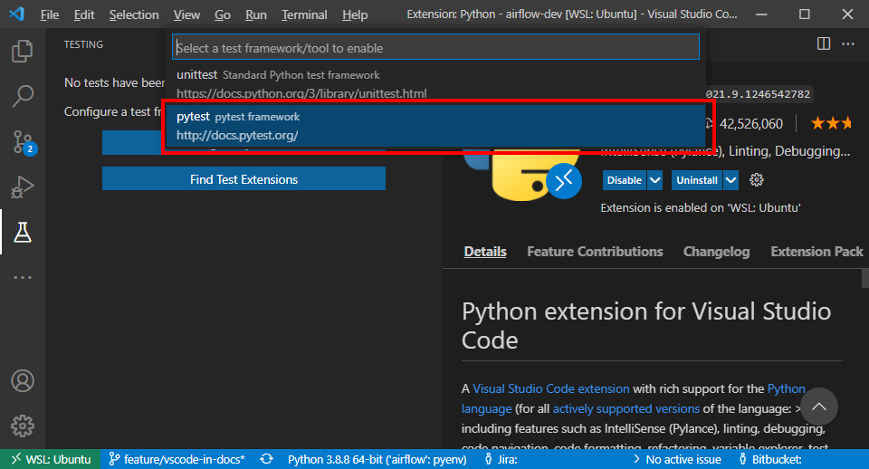
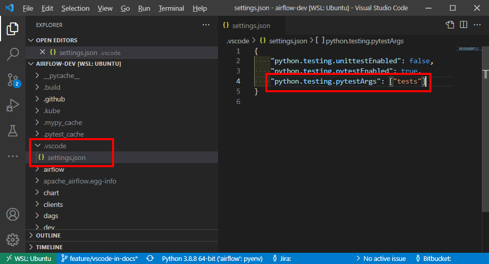
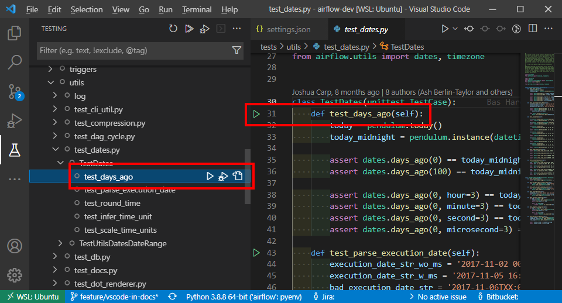

 .. Licensed to the Apache Software Foundation (ASF) under one
    or more contributor license agreements.  See the NOTICE file
    distributed with this work for additional information
    regarding copyright ownership.  The ASF licenses this file
    to you under the Apache License, Version 2.0 (the
    "License"); you may not use this file except in compliance
    with the License.  You may obtain a copy of the License at

 ..   http://www.apache.org/licenses/LICENSE-2.0

 .. Unless required by applicable law or agreed to in writing,
    software distributed under the License is distributed on an
    "AS IS" BASIS, WITHOUT WARRANTIES OR CONDITIONS OF ANY
    KIND, either express or implied.  See the License for the
    specific language governing permissions and limitations
    under the License.

Airflow Unit Tests
==================

All unit tests for Apache Airflow are run using `pytest <http://doc.pytest.org/en/latest/>`_.

**The outline for this document in GitHub is available via the button in the top-right corner (icon with 3 dots and 3 lines).**

Writing Unit Tests
------------------

Follow these guidelines when writing unit tests:

* For standard unit tests that do not require integration with external systems, ensure all communications are simulated (mocked).
* All Airflow tests are run with ``pytest``. Ensure your IDE or runners (see below) are configured to use ``pytest`` by default.
* For tests, use standard Python "asserts" and ``pytest`` decorators/context managers for testing rather than ``unittest`` ones. See `pytest docs <http://doc.pytest.org/en/latest/assert.html>`__ for details.
* Use the ``pytest.mark.parametrize`` marker for tests that have variations in parameters. See `pytest docs <https://docs.pytest.org/en/latest/how-to/parametrize.html>`__ for details.
* Use ``pytest.warns`` to capture warnings instead of the ``recwarn`` fixture. We aim for zero warnings in our tests; therefore, we run pytest with ``--disable-warnings`` and utilize a custom warning capture system.

Handling warnings
.................

By default, specific warnings are prohibited in new tests:

* ``airflow.exceptions.AirflowProviderDeprecationWarning``

Any test triggering this warning without capturing it will fail.

.. code-block:: console

    [Breeze:3.10.19] root@91e633d08aa8:/opt/airflow# pytest tests/models/test_dag.py::TestDag::test_clear_dag
    ...
    FAILED tests/models/test_dag.py::TestDag::test_clear_dag[None-None] - airflow.exceptions.RemovedInAirflow3Warning: Calling `DAG.create_dagrun()` without an explicit data interval is deprecated

**NOTE:** As of Airflow 3.0, the test file ``tests/models/test_dag.py`` has been relocated to ``airflow-core/tests/unit/models/test_dag.py``.

To avoid this, ensure that:

* Do not use deprecated methods, classes, or arguments in your test cases.
* Your changes do not affect other components. For example, deprecating a part of Airflow Core or a Community Supported Provider might trigger new deprecation warnings. In this case, changes should also be made in all affected components in a backward-compatible way.
* Use ``pytest.warns``. See `pytest doc <https://docs.pytest.org/en/latest/how-to/capture-warnings.html#warns>`__ context manager to catch warnings when testing deprecated components. (Yes, we still need to test legacy/deprecated features until they are completely removed).

.. code-block:: python

    def test_deprecated_argument():
        with pytest.warns(AirflowProviderDeprecationWarning, match="expected warning pattern"):
            SomeDeprecatedClass(foo="bar", spam="egg")

Mocking time-related functionality in tests
-------------------------------------------

Mocking sleep calls
...................

To speed up test execution and avoid unnecessary delays, you should mock sleep calls in tests or set the sleep time to 0.
If the method you are testing includes a call to ``time.sleep()`` or ``asyncio.sleep()``, mock these calls.
How to mock ``sleep()`` depends on how it is imported:

* If ``time.sleep`` is imported as ``import time``:

.. code-block:: python

    @mock.patch("time.sleep", return_value=None)
    def test_your_test():
        pass

* If ``sleep`` is imported directly using ``from time import sleep``:

.. code-block:: python

    @mock.patch("path.to.the.module.sleep", return_value=None)
    def test_your_test():
        pass

For methods that use ``asyncio`` for async sleep calls, the process is identical.

**NOTE:** There are certain cases where the method's correct functioning depends on actual time passing.
In those cases, the test with the mock will fail. It is acceptable to leave it unmocked in such scenarios.
Use your judgment and prefer mocking whenever possible.

Controlling date and time
.........................

Some features rely on the current date and time, e.g., a function that generates timestamps or measures the passing of time.
To test such features reliably, we use the ``time-machine`` library to control the system's time:

.. code-block:: python

    @time_machine.travel(datetime(2025, 3, 27, 21, 58, 1, 2345), tick=False)
    def test_log_message(self):
        """
        The tested code uses datetime.now() to generate a timestamp.
        Freezing time ensures the timestamp is predictable and testable.
        """

By setting ``tick=False``, time is frozen at the specified moment and does not advance during the test.
If you want time to progress from a fixed starting point, you can set ``tick=True``.

Airflow configuration for unit tests
------------------------------------

Some unit tests require special configuration set as the ``default``. This is done automatically by
adding ``AIRFLOW__CORE__UNIT_TEST_MODE=True`` to the environment variables in a Pytest auto-use
fixture. This, in turn, makes Airflow load test configuration from the file
``airflow/config_templates/unit_tests.cfg``. Test configuration from there replaces the original
defaults from ``airflow/config_templates/config.yml``. If you want to add some test-only configuration
as a default for all tests, you should add the value to this file.

You can also override the values in individual tests by patching environment variables following
the usual ``AIRFLOW__SECTION__KEY`` pattern or using the ``conf_vars`` context manager.

Airflow unit test types
-----------------------

Airflow tests in the CI environment are split into several test types. You can narrow down which
test types you want to use in various ``breeze testing`` sub-commands in three ways:

* By specifying the ``--test-type`` when running a single test type in ``breeze testing core-tests``, ``breeze testing providers-tests``, or ``breeze testing integration-tests`` commands.
* By specifying a space-separated list of test types via the ``--parallel-test-types`` or ``--excluded-parallel-test-types`` options when running tests in parallel.

The defined test types are:

* ``Always`` - Tests that should always be executed (always sub-folder).
* ``API`` - Tests for the Airflow API (api, api_internal, api_fastapi sub-folders).
* ``CLI`` - Tests for the Airflow CLI (cli folder).
* ``Core`` - Tests for core Airflow functionality (core, executors, jobs, models, ti_deps, utils sub-folders).
* ``Operators`` - Tests for operators (operators folder).
* ``WWW`` - Tests for the Airflow webserver (www folder).
* ``Providers`` - Tests for all Airflow Providers (providers folder).
* ``Other`` - All other tests remaining after the above tests are selected.

We also have types that run "all" tests (ignoring folders, but looking at ``pytest`` markers with filters applied):

* ``All-Postgres`` - Tests that require a Postgres database. Only run when the backend is Postgres (``backend("postgres")`` marker).
* ``All-MySQL`` - Tests that require a MySQL database. Only run when the backend is MySQL (``backend("mysql")`` marker).
* ``All-Quarantined`` - Tests that are flaky and need to be fixed (``quarantined`` marker).
* ``All`` - All tests are run (this is the default).

We also have ``Integration`` tests that run with external software via the ``--integration`` flag in the ``breeze`` environment (via ``breeze testing integration-tests``).

* ``Integration`` - Tests that require external integration images running in docker-compose.

This structure exists for two reasons:

1. To allow selectively running only a subset of test types for some PRs.
2. To allow efficient parallel execution of tests on Self-Hosted runners.

For case 2: We can utilize the memory and CPUs available on both CI and local development machines to run
tests in parallel. However, we cannot use the pytest xdist plugin for this. Instead, we split the tests into test
types and run each type with its own database instance and separate container. The tests in each type run with exclusive access to their database, and tests within a type run sequentially.
This is necessary because these tests rely on shared databases and update/reset/cleanup data during execution.

DB and non-DB tests
-------------------

There are two kinds of unit tests in Airflow: DB and non-DB tests. This chapter describes the differences
between these two types.

Airflow non-DB tests
....................

Non-DB tests are run once for each tested Python version with the ``none`` database backend (which
causes any database access to fail). These tests are run with the ``pytest-xdist`` plugin in parallel, which
means we can efficiently utilize multi-processor machines (including ``self-hosted`` runners with
8 CPUs, where we run tests with maximum parallelism).

It is usually straightforward to run these tests in a local virtualenv because they do not require any
database setup. They also run much faster than DB tests. You can run them with the ``pytest`` command
or with ``breeze`` (which has all dependencies automatically installed). You can also select specific tests, folders, or modules for Pytest to collect/run.
The example below shows how to run all tests, parallelizing them with ``pytest-xdist`` (by specifying the ``tests`` folder):

.. code-block:: bash

    pytest airflow-core/tests --skip-db-tests -n auto

The ``--skip-db-tests`` flag will only run tests that are not marked as DB tests.

You can also use the ``breeze`` command to run all the tests (they will run in a separate container,
with the selected Python version and without access to any database). Adding the ``--use-xdist`` flag will run all
tests in parallel using the ``pytest-xdist`` plugin.

You can run parallel commands via ``breeze testing core-tests`` or ``breeze testing providers-tests``
by adding the parallel flags:

.. code-block:: bash

    breeze testing core-tests --skip-db-tests --backend none --use-xdist

You can pass a list of test types to execute via ``--parallel-test-type`` or exclude them via ``--exclude-parallel-test-types``:

.. code-block:: bash

    breeze testing providers-tests --run-in-parallel --skip-db-tests --backend none --parallel-test-types "Providers[google] Providers[amazon]"

Additionally, you can enter an interactive shell with ``breeze`` and run tests from there to iterate. Source files in ``breeze`` are mounted as volumes, so you can modify them locally and
rerun in Breeze as needed (``-n auto`` will parallelize tests using the ``pytest-xdist`` plugin):

.. code-block:: bash

    breeze shell --backend none --python 3.10
    > pytest airflow-core/tests --skip-db-tests -n auto

Airflow DB tests
................

Some Airflow tests require a database connection. These tests store and read data
from the Airflow DB using Airflow's core code. It is crucial to run these tests against all real databases
that Airflow supports to check if SQLAlchemy queries and the database schema are correct.

These tests should be marked with the ``@pytest.mark.db_test`` decorator at one of the following levels:

* Test method level
* Test class level
* Module level (using ``pytestmark = pytest.mark.db_test`` at the top of the module)

DB tests are run against multiple supported databases, database versions, and Python versions. To save time, not all combinations are
tested, but enough variations are covered to detect potential problems.

By default, DB tests use SQLite and the "airflow.db" database created in the ``${AIRFLOW_HOME}`` folder. You do not need to do anything to create or initialize the database.
However, if you need to clean and restart the DB, you can run tests with the ``--with-db-init`` flag to re-initialize it. You can also set the ``AIRFLOW__DATABASE__SQL_ALCHEMY_CONN`` environment
variable to point to a supported database (Postgres, MySQL, etc.), and the tests will use that database. You
might need to run ``airflow db reset`` to initialize the database in that case.

It is perfectly fine to run "non-DB" tests when you have a database configured. However, if you want to run *only*
DB tests (as done in our CI for ``Database`` runs), you can use the ``--run-db-tests-only`` flag to filter
out non-DB tests. (You can specify the whole ``tests`` directory or any specific folder/file selection).

.. code-block:: bash

    pytest airflow-core/tests --run-db-tests-only

You can also run DB tests within the ``breeze`` dockerized environment. You can choose the backend with the
``--backend`` flag. The default is ``sqlite``, but you can also use ``postgres`` or ``mysql``.
You can also select the backend version and Python version. Breeze will list the available test types via ``--help`` and provide auto-complete.
The example below runs ``Core`` tests with the ``postgres`` backend and Python ``3.10``:

You can also run the commands via ``breeze testing core-tests`` or ``breeze testing providers-tests``
by adding the parallel flags manually:

.. code-block:: bash

    breeze testing core-tests --run-db-tests-only --backend postgres --run-in-parallel

You can pass a list of test types to execute via ``--parallel-test-type`` or exclude them via ``--exclude-parallel-test-types``:

.. code-block:: bash

    breeze testing providers-tests --run-in-parallel --run-db-tests-only --parallel-test-types "Providers[google] Providers[amazon]"

If you want to iterate on tests, you can enter the interactive shell and run tests iteratively—either by package/module/test or by test type, whatever ``pytest`` supports.

.. code-block:: bash

    breeze shell --backend postgres --python 3.10
    > pytest airflow-core/tests --run-db-tests-only

As explained before, you cannot run DB tests in parallel using the ``pytest-xdist`` plugin. However, ``breeze`` supports splitting all tests into test-types to run in separate containers with separate databases using the ``--run-in-parallel`` flag.

.. code-block:: bash

    breeze testing core-tests --run-db-tests-only --backend postgres --python 3.10 --run-in-parallel

Examples of marking test as DB test
...................................

You can apply the marker on the method/function/class level with the ``@pytest.mark.db_test`` decorator or
at the module level with ``pytestmark = pytest.mark.db_test`` at the top of the module.

It is up to the author to decide whether to mark the test, class, or module as a "DB-test". Generally, the fewer DB tests, the better. If we can clearly separate DB parts from non-DB parts, we should.
However, it is acceptable if a few non-DB tests are marked as DB tests because they are part of a class or module that is "mostly-DB".

Sometimes, when a class can be clearly split into DB and non-DB parts, it is better to split the class
into two separate classes and mark only the DB class as a DB test.

Method level:

.. code-block:: python

   import pytest

   @pytest.mark.db_test
   def test_add_tagging(self, sentry, task_instance): ...

Class level:

.. code-block:: python

   import pytest

   @pytest.mark.db_test
   class TestDatabricksHookAsyncAadTokenSpOutside: ...

Module level (at the top of the module):

.. code-block:: python

   import pytest

   from airflow.models.baseoperator import BaseOperator
   from airflow.models.dag import DAG
   from airflow.ti_deps.dep_context import DepContext
   from airflow.ti_deps.deps.task_concurrency_dep import TaskConcurrencyDep

   pytestmark = pytest.mark.db_test

Best practices for DB tests
...........................

Usually, when adding new tests, you create tests similar to the existing ones. In most cases,
you do not have to worry about the test type. It will be automatically selected for you because the Test Class or module you are adding to is already marked with the ``db_test`` marker.

You should strive to write "pure" non-DB unit tests. However, sometimes it is better to plug into the existing framework of DagRuns, Dags, Connections, and Variables to use the Database directly rather than mocking all DB access. This decision is up to you.

However, if you choose to write DB tests, you must ensure the ``db_test`` marker is added either to the test method, class (with decorator), or whole module (with pytestmark).

If your test accesses the database but is not marked properly, the Non-DB test run in CI will fail with this message:

.. code ::

    "Your test accessed the DB but `_AIRFLOW_SKIP_DB_TESTS` is set.
    Either make sure your test does not use database or mark your test with `@pytest.mark.db_test`.

How to verify if a DB test is correctly classified
..................................................

If you want to verify if your DB test is correctly classified, you can run the test or group
of tests with the ``--skip-db-tests`` flag.

You can run all (or a subset of) test types to ensure all problems are fixed:

  .. code-block:: bash

     breeze testing core-tests --skip-db-tests tests/your_test.py

For the whole test suite:

  .. code-block:: bash

     breeze testing core-tests --skip-db-tests

For selected test types (e.g., only ``Providers/API/CLI`` code):

  .. code-block:: bash

     breeze testing providers-tests --skip-db-tests --parallel-test-types "Providers[google] Providers[amazon]"

You can also enter the interactive shell with the ``--skip-db-tests`` flag and run tests iteratively:

  .. code-block:: bash

     breeze shell --skip-db-tests
     > pytest tests/your_test.py

How to make your test not depend on DB
......................................

This is tricky and there is no single solution. Sometimes we can mock out methods that require
DB access or objects that normally require a database. Sometimes we can decide to test just a single method
of a class rather than a complex set of steps. Generally speaking, it is better to have as many "pure"
unit tests (requiring no DB) as possible compared to DB tests. They are usually faster and more reliable.

Special cases
.............

There are some tricky test cases that require special handling. Here are some of them:

Parameterized tests stability
~~~~~~~~~~~~~~~~~~~~~~~~~~~~~

Parameterized tests require a stable order of parameters if they are run via ``xdist``. This is because parameterized
tests are distributed among multiple processes and handled separately. In some cases, parameterized tests
have an undefined/random order (or parameters are not hashable, e.g., a set of enums). In such cases,
the xdist execution will fail, and you will get an error mentioning "Known Limitations of xdist".
You can see details about the limitation `here <https://pytest-xdist.readthedocs.io/en/latest/known-limitations.html>`_.

The error in this case will look similar to:

.. code-block::

    Different tests were collected between gw0 and gw7. The difference is:

The fix is to sort the parameters in ``parametrize``. For example, instead of this:

.. code-block:: python

   @pytest.mark.parametrize("status", ALL_STATES)
   def test_method(): ...

do this:

.. code-block:: python

   @pytest.mark.parametrize("status", sorted(ALL_STATES))
   def test_method(): ...

Similarly, if your parameters are defined as a result of ``utcnow()`` or another dynamic method, you should
avoid that or assign unique IDs for those parametrized tests. Instead of this:

.. code-block:: python

   @pytest.mark.parametrize(
       "url, expected_dag_run_ids",
       [
           (
               f"api/v1/dags/TEST_DAG_ID/dagRuns?end_date_gte="
               f"{urllib.parse.quote((timezone.utcnow() + timedelta(days=1)).isoformat())}",
               [],
           ),
           (
               f"api/v1/dags/TEST_DAG_ID/dagRuns?end_date_lte="
               f"{urllib.parse.quote((timezone.utcnow() + timedelta(days=1)).isoformat())}",
               ["TEST_DAG_RUN_ID_1", "TEST_DAG_RUN_ID_2"],
           ),
       ],
   )
   def test_end_date_gte_lte(url, expected_dag_run_ids): ...

Do this:

.. code-block:: python

   @pytest.mark.parametrize(
       "url, expected_dag_run_ids",
       [
           pytest.param(
               f"api/v1/dags/TEST_DAG_ID/dagRuns?end_date_gte="
               f"{urllib.parse.quote((timezone.utcnow() + timedelta(days=1)).isoformat())}",
               [],
               id="end_date_gte",
           ),
           pytest.param(
               f"api/v1/dags/TEST_DAG_ID/dagRuns?end_date_lte="
               f"{urllib.parse.quote((timezone.utcnow() + timedelta(days=1)).isoformat())}",
               ["TEST_DAG_RUN_ID_1", "TEST_DAG_RUN_ID_2"],
               id="end_date_lte",
           ),
       ],
   )
   def test_end_date_gte_lte(url, expected_dag_run_ids): ...

Problems with Non-DB test collection
~~~~~~~~~~~~~~~~~~~~~~~~~~~~~~~~~~~~

Sometimes, even if the whole module is marked as ``@pytest.mark.db_test``, parsing the file and collecting
tests will fail when ``--skip-db-tests`` is used because some imports or objects created in the
module read from the database.

Moving such initialization code to inside the tests or pytest fixtures (and passing objects needed by tests as fixtures rather than importing them from the module) usually helps. Similarly, you might
use DB-bound objects (like Connection) in your ``parametrize`` specification—this will also fail pytest
collection. Move the creation of such objects to inside the tests.

Example: Moving object creation from top-level to inside tests. This code will break test collection even if
the test is marked as a DB test:

.. code-block:: python

   TI = TaskInstance(
       task=BashOperator(task_id="test", bash_command="true", dag=DAG(dag_id="id"), start_date=datetime.now()),
       run_id="fake_run",
       state=State.RUNNING,
   )

   class TestCallbackRequest:
       @pytest.mark.parametrize(
           "input,request_class",
           [
               (CallbackRequest(full_filepath="filepath", msg="task_failure"), CallbackRequest),
               (
                   TaskCallbackRequest(
                       full_filepath="filepath",
                       simple_task_instance=SimpleTaskInstance.from_ti(ti=TI),
                       is_failure_callback=True,
                   ),
                   TaskCallbackRequest,
               ),
               (
                   DagCallbackRequest(
                       full_filepath="filepath",
                       dag_id="fake_dag",
                       run_id="fake_run",
                       is_failure_callback=False,
                   ),
                   DagCallbackRequest,
               ),
               (
                   SlaCallbackRequest(
                       full_filepath="filepath",
                       dag_id="fake_dag",
                   ),
                   SlaCallbackRequest,
               ),
           ],
       )
       def test_from_json(self, input, request_class): ...

Instead, do this (which will not break collection). The ``TaskInstance`` is not initialized when the module is parsed;
it will only be initialized when the test gets executed:

.. code-block:: python

  pytestmark = pytest.mark.db_test

  class TestCallbackRequest:
      @pytest.mark.parametrize(
          "input,request_class",
          [
              (CallbackRequest(full_filepath="filepath", msg="task_failure"), CallbackRequest),
              (
                  None,  # to be generated when test is run
                  TaskCallbackRequest,
              ),
              (
                  DagCallbackRequest(
                      full_filepath="filepath",
                      dag_id="fake_dag",
                      run_id="fake_run",
                      is_failure_callback=False,
                  ),
                  DagCallbackRequest,
              ),
              (
                  SlaCallbackRequest(
                      full_filepath="filepath",
                      dag_id="fake_dag",
                  ),
                  SlaCallbackRequest,
              ),
          ],
      )
      def test_from_json(self, input, request_class):
          if input is None:
              ti = TaskInstance(
                  task=BashOperator(
                      task_id="test", bash_command="true", dag=DAG(dag_id="id"), start_date=datetime.now()
                  ),
                  run_id="fake_run",
                  state=State.RUNNING,
              )

              input = TaskCallbackRequest(
                  full_filepath="filepath",
                  simple_task_instance=SimpleTaskInstance.from_ti(ti=ti),
                  is_failure_callback=True,
              )

Sometimes it is difficult to rewrite the tests, so you might add conditional handling and mock out some
database-bound methods or objects to avoid hitting the database during test collection. The code below
will hit the Database while parsing the tests because this is what ``Variable.setdefault`` does when
the parametrize specification is parsed—even if the test is marked as a DB test.

.. code-block:: python

    from airflow.models.variable import Variable

    pytestmark = pytest.mark.db_test

    initial_db_init()

    @pytest.mark.parametrize(
        "env, expected",
        [
            pytest.param(
                {"plain_key": "plain_value"},
                "{'plain_key': 'plain_value'}",
                id="env-plain-key-val",
            ),
            pytest.param(
                {"plain_key": Variable.setdefault("plain_var", "banana")},
                "{'plain_key': 'banana'}",
                id="env-plain-key-plain-var",
            ),
            pytest.param(
                {"plain_key": Variable.setdefault("secret_var", "monkey")},
                "{'plain_key': '***'}",
                id="env-plain-key-sensitive-var",
            ),
            pytest.param(
                {"plain_key": "{{ var.value.plain_var }}"},
                "{'plain_key': '{{ var.value.plain_var }}'}",
                id="env-plain-key-plain-tpld-var",
            ),
        ],
    )
    def test_rendered_task_detail_env_secret(patch_app, admin_client, request, env, expected): ...

You can make the code conditional and mock out ``Variable`` to avoid hitting the database.

.. code-block:: python

    from airflow.models.variable import Variable

    pytestmark = pytest.mark.db_test

    if os.environ.get("_AIRFLOW_SKIP_DB_TESTS") == "true":
        # Handle collection of the test by non-db case
        Variable = mock.MagicMock()  # type: ignore[misc] # noqa: F811
    else:
        initial_db_init()

    @pytest.mark.parametrize(
        "env, expected",
        [
            pytest.param(
                {"plain_key": "plain_value"},
                "{'plain_key': 'plain_value'}",
                id="env-plain-key-val",
            ),
            pytest.param(
                {"plain_key": Variable.setdefault("plain_var", "banana")},
                "{'plain_key': 'banana'}",
                id="env-plain-key-plain-var",
            ),
            pytest.param(
                {"plain_key": Variable.setdefault("secret_var", "monkey")},
                "{'plain_key': '***'}",
                id="env-plain-key-sensitive-var",
            ),
            pytest.param(
                {"plain_key": "{{ var.value.plain_var }}"},
                "{'plain_key': '{{ var.value.plain_var }}'}",
                id="env-plain-key-plain-tpld-var",
            ),
        ],
    )
    def test_rendered_task_detail_env_secret(patch_app, admin_client, request, env, expected): ...

You can also use a fixture to create an object that needs the database.

.. code-block:: python

    from airflow.models import Connection

    pytestmark = pytest.mark.db_test

    @pytest.fixture()
    def get_connection1():
        return Connection()

    @pytest.fixture()
    def get_connection2():
        return Connection(host="apache.org", extra={})

    @pytest.mark.parametrize(
        "conn",
        [
            "get_connection1",
            "get_connection2",
        ],
    )
    def test_as_json_from_connection(self, conn: Connection):
        conn = request.getfixturevalue(conn)
        ...

Running Unit tests
------------------

Running Unit Tests from PyCharm IDE
...................................

To run unit tests from the PyCharm IDE, create a `local virtualenv <../07_local_virtualenv.rst>`_,
select it as the default project's environment, then configure your test runner:

.. image:: images/pycharm/configure_test_runner.png
    :align: center
    :alt: Configuring test runner

and run unit tests as follows:

.. image:: images/pycharm/running_unittests.png
    :align: center
    :alt: Running unit tests

**NOTE:** You can run unit tests in the standalone local virtualenv
(with no Breeze installed) if they do not have dependencies such as
Postgres/MySQL/Hadoop/etc.

Running Unit Tests from PyCharm IDE using Breeze
................................................

Ideally, all unit tests should be run using the standardized Breeze environment. While not
as convenient as the one-click "play button" in PyCharm, the IDE can be configured to do
this in two clicks.

1. Add Breeze as an "External Tool":

   a. From the settings menu, navigate to ``Tools > External Tools``.
   b. Click the plus symbol to open the ``Create Tool`` popup and fill it out:

2. Add the tool to the context menu:

   a. From the settings menu, navigate to ``Appearance & Behavior > Menus & Toolbars > Project View Popup Menu``.
   b. Click on the list of entries where you would like it to be added. Right above or below ``Project View Popup Menu Run Group`` may be a good choice; you can drag and drop this list to rearrange the placement later.
   c. Click the plus symbol at the top of the popup window.
   d. Find your ``External Tool`` in the new ``Choose Actions to Add`` popup and click OK. If you followed the image above, it will be at ``External Tools > External Tools > Breeze``.

**Note:** This only adds the option to that specific menu. If you would like to add it to the context menu
when right-clicking on a tab at the top of the editor, for example, follow the steps above again
and place it in the ``Editor Tab Popup Menu``.

3. To run tests in Breeze, right-click on the file or directory in the ``Project View`` and click Breeze.

Running Unit Tests from Visual Studio Code
..........................................

To run unit tests from Visual Studio Code:

1. Using the ``Extensions`` view, install the Python extension. Reload if required.

2. Using the ``Testing`` view, click on ``Configure Python Tests`` and select the ``pytest`` framework.

3. Open ``/.vscode/settings.json`` and add ``"python.testing.pytestArgs": ["tests"]`` to enable test discovery.

4. Now you are able to run and debug tests from both the ``Testing`` view and test files.

Running Unit Tests in local virtualenv
......................................

To run unit, integration, and system tests from Breeze and your
virtualenv, you can use the `pytest <http://doc.pytest.org/en/latest/>`_ framework.

The custom ``pytest`` plugin runs ``airflow db init`` and ``airflow db reset`` the first
time you launch them. So, you can count on the database being initialized. Currently,
when you run tests that are not supported **in the local virtualenv, they may either fail
or provide an error message**.

There are many available options for selecting a specific test in ``pytest``. Details can be found
in the official documentation, but here are a few basic examples:

.. code-block:: bash

    pytest airflow-core/tests/unit/core -k "TestCore and not check"

This runs the ``TestCore`` class but skips tests in this class that include 'check' in their names.
For better performance (due to test collection), run:

.. code-block:: bash

    pytest airflow-core/tests/unit/core/test_core.py -k "TestCore and not bash"

This flag is useful when used to run a single test like this:

.. code-block:: bash

    pytest airflow-core/tests/unit/core/test_core.py -k "test_check_operators"

This can also be done by specifying a full path to the test:

.. code-block:: bash

    pytest airflow-core/tests/unit/core/test_core.py::TestCore::test_dag_params_and_task_params

To run the whole test class, enter:

.. code-block:: bash

    pytest airflow-core/tests/unit/core/test_core.py::TestCore

You can use all available ``pytest`` flags. For example, to increase the log level
for debugging purposes, enter:

.. code-block:: bash

    pytest --log-cli-level=DEBUG airflow-core/tests/unit/core/test_core.py::TestCore

Running Tests using Breeze interactive shell
............................................

You can run tests interactively using regular pytest commands inside the Breeze shell. This has the
advantage that the Breeze container has all the dependencies installed that are needed to run the tests,
and it will ask you to rebuild the image if needed (e.g., if new dependencies should be installed).

By using the interactive shell and iterating over tests, you can re-run tests one-by-one
or group-by-group immediately after modifying them.

Entering the shell is as easy as:

.. code-block:: bash

      breeze

This should drop you into the container.

You can also use other switches (like ``--backend``) to configure the environment for your
tests (e.g., to switch to a different database backend - see ``--help`` for more details).

Once inside the container, you can run regular pytest commands. For example:

.. code-block:: bash

    pytest --log-cli-level=DEBUG airflow-core/tests/unit/core/test_core.py::TestCore

Running Tests using Breeze from the Host
........................................

If you wish to only run tests and not drop into the shell, use the ``tests`` command.
You can add extra targets and pytest flags after the ``tests`` command. Note that
often you want to run the tests with a clean/reset DB, so usually, you want to add the ``--db-reset`` flag
to the breeze command. The Breeze image will usually have all the dependencies needed, and it
will ask you to rebuild the image if needed.

.. code-block:: bash

    breeze testing providers-tests providers/http/tests/http/hooks/test_http.py airflow-core/tests/unit/core/test_core.py --db-reset --log-cli-level=DEBUG

You can run the whole core test suite without adding the test target:

.. code-block:: bash

    breeze testing core-tests --db-reset

You can run the whole providers test suite without adding the test target:

.. code-block:: bash

    breeze testing providers-tests --db-reset

You can also specify individual tests or a group of tests:

.. code-block:: bash

    breeze testing core-tests --db-reset airflow-core/tests/unit/core/test_core.py::TestCore

You can also limit the tests to execute to a specific group of tests:

.. code-block:: bash

    breeze testing core-tests --test-type Other

In the case of Providers tests, you can run tests for all providers:

.. code-block:: bash

    breeze testing providers-tests --test-type Providers

You can limit the set of providers you would like to run tests for:

.. code-block:: bash

    breeze testing providers-tests --test-type "Providers[airbyte,http]"

You can also run all providers but exclude specific ones:

.. code-block:: bash

    breeze testing providers-tests --test-type "Providers[-amazon,google]"

Sometimes you need to inspect docker-compose after the tests command completes,
for example, when the test environment could not be properly set due to
failed health checks. This can be achieved with the ``--skip-docker-compose-down``
flag:

.. code-block:: bash

    breeze testing core-tests --skip-docker-compose-down

Running full Airflow unit test suite in parallel
................................................

If you run ``breeze testing core-tests --run-in-parallel`` or
``breeze testing providers-tests --run-in-parallel``, tests are executed in parallel
on your development machine, using as many cores as are available to the Docker engine.

If your Docker environment has limited memory (less than 8 GB), then ``Integration``, ``Provider``,
and ``Core`` tests are run sequentially, with the Docker setup cleaned between test runs
to minimize memory usage.

This approach allows for a massive speedup in full test execution. On a machine with 8 CPUs
(16 cores), 64 GB of RAM, and a fast SSD, the full suite of tests can complete in about
5 minutes (!) — compared to more than 30 minutes when run sequentially.

.. note::

  On MacOS, you might have fewer CPUs and less memory available to run tests than you have on the host,
  simply because your Docker engine runs in a Linux Virtual Machine under the hood. If you want to make
  use of parallelism and memory usage for CI tests, you might want to increase the resources available
  to your docker engine. See the `Resources <https://docs.docker.com/docker-for-mac/#resources>`_ chapter
  in the ``Docker for Mac`` documentation on how to do it.

You can also limit the parallelism by specifying the maximum number of parallel jobs via the
``MAX_PARALLEL_TEST_JOBS`` variable. If you set it to "1", all test types will be run sequentially.

.. code-block:: bash

    MAX_PARALLEL_TEST_JOBS="1" ./scripts/ci/testing/ci_run_airflow_testing.sh

.. note::

  In case you would like to cleanup after execution of such tests, you might have to cleanup
  some of the docker containers running if you use ctrl-c to stop execution. You can easily do it by
  running this command (it will kill all running docker containers, so do not use it if you want to keep some
  containers running):

  .. code-block:: bash

      docker kill $(docker ps -q)

Running Backend-Specific Tests
..............................

Tests that use a specific backend are marked with a custom pytest marker ``pytest.mark.backend``.
The marker has a single parameter - the name of the backend. It corresponds to the ``--backend`` switch of
the Breeze environment (one of ``mysql``, ``sqlite``, or ``postgres``). Backend-specific tests only run when
the Breeze environment is running with the correct backend. If you specify more than one backend
in the marker, the test runs for all specified backends.

Example of the ``postgres`` only test:

.. code-block:: python

    @pytest.mark.backend("postgres")
    def test_copy_expert(self): ...

Example of the ``postgres,mysql`` test (skipped with the ``sqlite`` backend):

.. code-block:: python

    @pytest.mark.backend("postgres", "mysql")
    def test_celery_executor(self): ...

You can use the custom ``--backend`` switch in pytest to only run tests specific to that backend.
Here is an example of running only postgres-specific backend tests:

.. code-block:: bash

    pytest --backend postgres

Running Long-running tests
..........................

Some tests run for a long time. Such tests are marked with the ``@pytest.mark.long_running`` annotation.
These tests are skipped by default. You can enable them with the ``--include-long-running`` flag. You
can also decide to run *only* those tests with the ``-m long-running`` flag.

Running Quarantined tests
.........................

Some of our tests are quarantined. This means that the test will be run in isolation and re-run several times.
Also, when quarantined tests fail, the whole test suite will not fail. Quarantined tests are usually flaky tests that need attention and fixing.

These tests are marked with the ``@pytest.mark.quarantined`` annotation.
They are skipped by default. You can enable them with the ``--include-quarantined`` flag. You
can also decide to run *only* those tests with the ``-m quarantined`` flag.

Compatibility Provider unit tests against older Airflow releases
----------------------------------------------------------------

Why we run provider compatibility tests
.......................................

Our CI runs provider tests for providers with previous compatible Airflow releases. This allows checking
if the providers still work when installed on older Airflow versions.

The back-compatibility tests are based on the configuration specified in the
``PROVIDERS_COMPATIBILITY_TESTS_MATRIX`` constant in the ``./dev/breeze/src/airflow_breeze/global_constants.py``
file - which specifies:

* Python version
* Airflow version
* Which providers should be removed for the tests (exclusions)
* Whether to run tests for this Airflow/Python version

These tests can be used to test the compatibility of providers with past (and future!) releases of Airflow.
For example, it could be used to run the latest provider versions with released or main
Airflow 3 if they are developed independently.

The tests use the current source version of the ``tests`` folder and current ``providers``, so care should be
taken that the tests implemented for providers in the sources allow running against previous versions
of Airflow and against Airflow installed from the PyPI package rather than from sources.

Running the compatibility tests locally
.......................................

Running tests locally is easy with the appropriate ``breeze`` command. In CI, the command
is slightly different as it runs using providers built using wheel packages, but it is faster
to run it locally and easier to iterate if you need to fix a provider using provider sources mounted
directly to the container.

1. Make sure to build the latest Breeze CI image:

.. code-block:: bash

   breeze ci-image build --python 3.9

2. Enter the breeze environment by selecting the appropriate Airflow version and choosing
   the ``providers-and-tests`` option for the ``--mount-sources`` flag.

.. code-block:: bash

  breeze shell --use-airflow-version 2.9.1 --mount-sources providers-and-tests

3. You can then run tests as usual:

.. code-block:: bash

   pytest providers/<provider>/tests/.../test.py

4. Iterate with the tests and providers. Both providers and tests are mounted from local sources, so
   changes you make locally in both tests and provider sources are immediately reflected inside the
   breeze container, and you can re-run the tests inside the ``breeze`` container without restarting it
   (which makes it faster to iterate).

.. note::

   Since providers are installed from sources rather than from packages, plugins from providers are not
   recognized by ProvidersManager for Airflow < 2.10, and tests that expect plugins to work might not work.
   In such cases, you should follow the ``CI`` way of running the tests (see below).

Implementing compatibility for provider tests for older Airflow versions
........................................................................

When you implement tests for providers, you should ensure that they are compatible with older Airflow versions.

Note that some tests, if written without taking care about compatibility, might not work with older
versions of Airflow. This is due to refactoring, renaming, and tests relying on Airflow internals that
are not part of the public API. We deal with this in one of the following ways:

1) If the whole provider is supposed to only work for a later Airflow version, we remove the whole provider
   by excluding it from the compatibility test configuration (see below).

2) Some compatibility shims are defined in ``devel-common/src/tests_common/test_utils/compat.py`` - and
   they can be used to make the tests compatible. For example, importing ``ParseImportError`` after the
   exception has been renamed from ``ImportError``. This would fail in Airflow 2.9, but we have a fallback
   import in ``compat.py`` that falls back to the old import automatically. So, all tests testing/expecting
   ``ParseImportError`` should import it from the ``tests_common.tests_utils.compat`` module. There are a few
   other compatibility shims defined there, and you can add more if needed in a similar way.

3) If only some tests are not compatible and use features that are available only in a newer Airflow version,
   we can mark those tests with the appropriate ``AIRFLOW_V_3_X_PLUS`` boolean constant defined
   in ``version_compat.py``. For example:

.. code-block:: python

  from tests_common.test_utils.version_compat import AIRFLOW_V_3_0_PLUS

  @pytest.mark.skipif(not AIRFLOW_V_3_0_PLUS, reason="The tests should be skipped for Airflow < 3.0")
  def some_test_that_only_works_for_airflow_3_0_plus():
      pass

4) Sometimes, the tests should only be run when Airflow is installed from the sources in main.
   In this case, you can add the conditional ``skipif`` marker for ``RUNNING_TESTS_AGAINST_AIRFLOW_PACKAGES``
   to the test. For example:

.. code-block:: python

  from tests_common import RUNNING_TESTS_AGAINST_AIRFLOW_PACKAGES

  @pytest.mark.skipif(
      RUNNING_TESTS_AGAINST_AIRFLOW_PACKAGES, reason="Plugin initialization is done early in case of packages"
  )
  def test_plugin():
      pass

5) Sometimes Pytest collection fails because certain imports used by the tests either do not exist,
   fail with a RuntimeError about compatibility ("minimum Airflow version is required"), or raise ``AirflowOptionalProviderFeatureException``. In such cases, you should wrap the imports in the
   ``ignore_provider_compatibility_error`` context manager adding the ``__file__``
   module name as a parameter. This will stop failing pytest collection and automatically skip the whole
   module from unit tests.

   For example:

.. code-block:: python

   with ignore_provider_compatibility_error("2.8.0", __file__):
       from airflow.providers.common.io.xcom.backend import XComObjectStorageBackend

6) In some cases, to enable pytest collection on older Airflow versions, you might need to convert
   a top-level import into a local import so that the Pytest parser does not fail on collection.

Running provider compatibility tests in CI
..........................................

In CI, these tests are run in a slightly more complex way because we want to run them against the built
providers rather than those mounted from sources.

In case of canary runs, we add the ``--clean-airflow-installation`` flag that removes all packages before
installing the older Airflow version, and then installs development dependencies
from the latest Airflow. This avoids cases where a provider depends on a new dependency added in the latest
version of Airflow. This clean removal and re-installation takes quite some time, so to speed up the tests in regular PRs, we only do this in canary runs.

The exact way CI tests are run can be reproduced locally by building providers from a selected tag/commit and
using them to install and run tests against the selected Airflow version.

Here is how to reproduce it:

1. Make sure to build the latest Breeze CI image:

.. code-block:: bash

   breeze ci-image build --python 3.10

2. Build providers from latest sources:

.. code-block:: bash

   rm dist/*
   breeze release-management prepare-provider-distributions --include-not-ready-providers \
      --skip-tag-check --distribution-format wheel

3. Prepare provider constraints:

.. code-block:: bash

   breeze release-management generate-constraints --airflow-constraints-mode constraints-source-providers --answer yes

4. Remove providers that are not compatible with the Airflow version installed by default. You can look up
   the incompatible providers in the ``PROVIDERS_COMPATIBILITY_TESTS_MATRIX`` constant in the
   ``./dev/breeze/src/airflow_breeze/global_constants.py`` file.

5. Enter the breeze environment, installing the selected Airflow version and the providers prepared from main:

.. code-block:: bash

  breeze shell --use-distributions-from-dist --distribution-format wheel --use-airflow-version 2.9.1  \
   --install-airflow-with-constraints --providers-skip-constraints --mount-sources tests

In case you want to reproduce a canary run, you need to add the ``--clean-airflow-installation`` flag:

.. code-block:: bash

  breeze shell --use-distributions-from-dist --distribution-format wheel --use-airflow-version 2.9.1  \
   --install-airflow-with-constraints --providers-skip-constraints --mount-sources tests --clean-airflow-installation

6. You can then run tests as usual:

.. code-block:: bash

   pytest providers/<provider>/tests/.../test.py

7. Iterate with the tests.

The tests are run using:

* Airflow installed from PyPI
* Tests coming from the current Airflow sources (mounted inside the breeze image)
* Providers built from the current Airflow sources and placed in dist

This means that you can modify and run tests and re-run them because sources are mounted from the host.
However, if you want to modify provider code, you need to exit breeze, rebuild the provider package, and
restart breeze using the command above.

Rebuilding a single provider package can be done using this command:

.. code-block:: bash

  breeze release-management prepare-provider-distributions \
    --skip-tag-check --distribution-format wheel <provider>

Lowest direct dependency resolution tests
-----------------------------------------

We have special tests that run with the lowest direct resolution of dependencies for Airflow and providers.
This is run to check whether we are using a feature that is not available in an
older version of some dependencies.

Tests with lowest-direct dependency resolution for Airflow
..........................................................

You can test minimum dependencies installed by Airflow by running (for example, to run "Core" tests):

.. code-block:: bash

    breeze testing core-tests --force-lowest-dependencies --test-type "Core"

You can also iterate on the tests and versions of the dependencies by entering the breeze shell and
running the tests from there, after manually downgrading the dependencies:

.. code-block:: bash

    breeze shell    # enter the container
    cd airflow-core
    uv sync --resolution lowest-direct

or run the ``--force-lowest-dependencies`` switch directly from the breeze command line:

.. code-block:: bash

    breeze shell --force-lowest-dependencies --test-type "Core"

The way it works: after you enter the breeze container, you run ``uv-sync`` in the airflow-core
folder to downgrade the dependencies to the lowest version that is compatible
with the dependencies specified in airflow-core dependencies. You will see it in the output of the breeze
command as a sequence of downgrades like this:

.. code-block:: diff

   - aiohttp==3.9.5
   + aiohttp==3.9.2
   - anyio==4.4.0
   + anyio==3.7.1

Tests with lowest-direct dependency resolution for a Provider
.............................................................

Similarly, we can test if the provider tests are working for the lowest dependencies of a specific provider.

These tests can be easily run locally with breeze (replace PROVIDER_ID with the id of the provider):

.. code-block:: bash

    breeze testing providers-tests --force-lowest-dependencies --test-type "Providers[PROVIDER_ID]"

If you find that the tests are failing for some dependencies, make sure to add the minimum version for
the dependency in the ``provider.yaml`` file of the appropriate provider and re-run it.

You can also iterate on the tests and versions of the dependencies by entering the breeze shell,
manually downgrading dependencies for the provider, and running the tests after that:

.. code-block:: bash

    breeze shell
    cd providers/PROVIDER_ID
    uv sync --resolution lowest-direct

or run the ``--force-lowest-dependencies`` switch directly from the breeze command line:

.. code-block:: bash

    breeze shell --force-lowest-dependencies --test-type "Providers[google]"

Similarly to "Core" tests, the dependencies will be downgraded to the lowest version that is
compatible with the dependencies specified in the provider dependencies, and you will see the list of
downgrades in the output of the breeze command. Note that this will include combined downgrades of both
Airflow and selected provider dependencies, so the list will be longer than in "Core" tests
and longer than **just** the dependencies of the provider. For example, for a ``google`` provider, part of the
downgraded dependencies will contain both Airflow and Google Provider dependencies:

.. code-block:: diff

 - flask-login==0.6.3
 + flask-login==0.6.2
 - flask-session==0.5.0
 + flask-session==0.4.0
 - flask-wtf==1.2.1
 + flask-wtf==1.1.0
 - fsspec==2023.12.2
 + fsspec==2023.10.0
 - gcloud-aio-bigquery==7.1.0
 + gcloud-aio-bigquery==6.1.2
 - gcloud-aio-storage==9.2.0

You can also (if your local virtualenv can install the dependencies for the provider)
reproduce the same set of dependencies in your local virtual environment by running:

.. code-block:: bash

    cd airflow-core
    uv sync --resolution lowest-direct

for Airflow core, and:

.. code-block:: bash

    cd providers/PROVIDER_ID
    uv sync --resolution lowest-direct

for the providers.

How to fix failing lowest-direct dependency resolution tests
............................................................

When your tests pass in regular tests but fail in "lowest-direct" dependency resolution tests, you need
to figure out one of the problems:

* Lower-bindings missing in the ``pyproject.toml`` file (in ``airflow-core`` or the corresponding provider).
  This is usually a very easy thing that takes a little bit of time to figure out. Especially if you
  just added a new feature from a library you use, check the release notes for the minimum
  version of the library you can use and set it as ``>=VERSION`` in the ``pyproject.toml``.

* Figuring out if airflow-core or the provider needs additional providers or additional dependencies in the dev
  dependency group for the provider. Sometimes tests need another provider to be installed that is not
  normally needed as a required dependency of the provider being tested. Those dependencies
  should be added after the ``# Additional devel dependencies`` comment in the case of providers. Adding the
  dependencies here means that when ``uv sync`` is run, the packages and their dependencies will be installed.

.. code-block:: toml

    [dependency-groups]
    dev = [
        "apache-airflow",
        "apache-airflow-task-sdk",
        "apache-airflow-devel-common",
        "apache-airflow-providers-common-sql",
        "apache-airflow-providers-fab",
        # Additional devel dependencies (do not remove this line and add extra development dependencies)
        # Limit deltalake to avoid issue with missing linux ARM wheels: https://github.com/delta-io/delta-rs/issues/4041
        "deltalake>=1.1.3,!=1.3.0",
        "apache-airflow-providers-microsoft-azure",
    ]

Sometimes it might get a bit tricky to know the minimum version of the library you should be using.
In this case, you can easily find it by looking at the error and list of downgraded packages and
guessing which one is causing the problem. You can then look at the release notes of the
library and find the minimum version. Alternatively, you can use the technique known as bisecting, which allows
you to quickly figure out the right version without knowing the root cause of the problem.

Assume you suspect library "foo", which was downgraded from 1.0.0 to 0.1.0, is causing the problem. The bisecting
technique looks like this:

* Run ``uv sync --resolution lowest-direct`` (the ``foo`` library is downgraded to 0.1.0). Your test should
  fail.
* Make sure that just upgrading the ``foo`` library to 1.0.0 -> re-run failing test (with ``pytest <test>``)
  and see that it passes.
* Downgrade the ``foo`` library to 0.1.0 -> re-run failing test (with ``pytest <test>``) and see that it
  fails.
* Look at the list of versions available for the library between 0.1.0 and 1.0.0 (for example, via
  `<https://pypi.org/project/foo/#history>`_ link - where ``foo`` is your library).
* Find a middle version between 1.0.0 and 0.1.0 and upgrade the library to this version - see if the
  test passes or fails. If it passes, continue finding the middle version between the current version
  and the lower version. If it fails, continue finding the middle version between the current version and
  the higher version.
* Continue this way until you find the lowest version that passes the test.
* Set this version in the ``pyproject.toml`` file, run ``uv sync --resolution lowest-direct``, and see if the test
  passes. If it does, you are done. If it does not, repeat the process.

You can also skip some tests when force lowest dependencies are used in breeze by adding the marker below. This is sometimes needed if your "core" or "provider" tests depend on
all or many providers to be installed (for example, tests loading multiple examples or connections):

.. code-block:: python

    from tests_common.pytest_plugin import skip_if_force_lowest_dependencies_marker

    @skip_if_force_lowest_dependencies_marker
    def test_my_test_that_should_be_skipped():
        assert 1 == 1

You can also locally set the ``FORCE_LOWEST_DEPENDENCIES`` environment variable to ``true`` before
running ``pytest`` to skip these tests when running locally.

Other Settings
--------------

Enable masking secrets in tests
...............................

By default, masking secrets in tests is disabled because it might have side effects
on other tests that intend to check ``logging/stdout/stderr`` values.

If you need to test masking secrets in test cases,
you have to apply ``pytest.mark.enable_redact`` to the specific test case, class, or module.

.. code-block:: python

    @pytest.mark.enable_redact
    def test_masking(capsys):
        mask_secret("eggs")
        RedactedIO().write("spam eggs and potatoes")
        assert "spam *** and potatoes" in capsys.readouterr().out

Skip test on unsupported platform / environment
...............................................

You can apply the marker ``pytest.mark.platform(name)`` to a specific test case, class, or module
to prevent it from running on an unsupported platform.

- ``linux``: Run test only on Linux platform.
- ``breeze``: Run test only inside the Breeze container. This might be useful if you run
  potentially dangerous things in tests or if it expects to use common Breeze utilities.

Warnings capture system
.......................

By default, all warnings captured during the test runs are saved into ``tests/warnings.txt``.

If required, you can change the path by providing ``--warning-output-path`` as a pytest CLI argument
or by setting the environment variable ``CAPTURE_WARNINGS_OUTPUT``.

.. code-block:: console

    [Breeze:3.10.19] root@3f98e75b1ebe:/opt/airflow# pytest airflow-core/tests/unit/core/ --warning-output-path=/foo/bar/spam.egg
    ...
    ========================= Warning summary. Total: 28, Unique: 12 ==========================
    airflow: total 11, unique 1
      runtest: total 11, unique 1
    other: total 7, unique 1
      runtest: total 7, unique 1
    tests: total 10, unique 10
      runtest: total 10, unique 10
    Warnings saved into /foo/bar/spam.egg file.

    ================================= short test summary info =================================

You might also disable warning capture by providing ``--disable-capture-warnings`` as a pytest CLI argument
or by setting the `global warnings filter <https://docs.python.org/3/library/warnings.html#the-warnings-filter>`__
to **ignore**, e.g., set the ``PYTHONWARNINGS`` environment variable to ``ignore``.

.. code-block:: bash

    pytest airflow-core/tests/unit/core/ --disable-capture-warnings

Keep tests using environment variables
......................................

By default, all environment variables related to Airflow (starting with ``AIRFLOW__``) are cleared before running tests
to avoid potential side effects. However, in some scenarios, you might want to disable this mechanism and keep the
environment variables you defined to configure your Airflow environment. For example, you might want to run tests
against a specific database configured through the environment variable ``AIRFLOW__DATABASE__SQL_ALCHEMY_CONN``,
or run tests using a specific executor configured through ``AIRFLOW__CORE__EXECUTOR``.

To keep using environment variables you defined in your environment, you need to provide ``--keep-env-variables`` as
a pytest CLI argument.

.. code-block:: bash

    pytest airflow-core/tests/unit/core/ --no-db-cleanup

This parameter is also available in Breeze.

.. code-block:: bash

    breeze testing core-tests --keep-env-variables

Disable database cleanup before each test module
................................................

By default, the database is cleared of all items before running tests. This is to avoid potential conflicts with
existing resources in the database when running tests using the database. However, in some scenarios, you might want to
disable this mechanism and keep the database as is. For example, you might want to run tests in parallel against the
same database. In that case, you need to disable the database cleanup, otherwise, the tests will conflict with
each other (one test will delete the resources that another one is creating).

To disable the database cleanup, you need to provide ``--no-db-cleanup`` as a pytest CLI argument.

.. code-block:: bash

    pytest airflow-core/tests/unit/core/ --no-db-cleanup

This parameter is also available in Breeze.

.. code-block:: bash

    breeze testing core-tests --no-db-cleanup airflow-core/tests/unit/core/

Code Coverage
-------------

Airflow's CI process automatically uploads the code coverage report to codecov.io.
For the most recent coverage report of the main branch, visit: https://codecov.io/gh/apache/airflow.

Generating Local Coverage Reports:
..................................

If you wish to obtain coverage reports for specific areas of the codebase on your local machine, follow these steps:

a. Initiate a breeze shell.

b. Execute one of the commands below based on the desired coverage area:

- **Core:** ``python scripts/cov/core_coverage.py``
- **REST API:** ``python scripts/cov/restapi_coverage.py``
- **CLI:** ``python scripts/cov/cli_coverage.py``
- **Other:** ``python scripts/cov/other_coverage.py``

c. After execution, run the following commands from the repository root
   (inside the Breeze shell):

   .. code-block:: bash

      cd htmlcov/
      python -m http.server 5555

   The Breeze container maps port ``5555`` inside the container to
   ``25555`` on the host, so you can open the coverage report at
   http://localhost:25555 in your browser.

.. note::

   You no longer need to start the Airflow web server to view the
   coverage report. The lightweight HTTP server above is sufficient and
   avoids an extra service. If port 25555 on the host is already in use,
   adjust the container-to-host mapping with
   ``BREEZE_PORTS_EXTRA="<host_port>:5555" breeze start-airflow``.

Modules Not Fully Covered:
..........................

Each coverage command provides a list of modules that aren't fully covered. If you wish to enhance coverage for a particular module:

a. Work on the module to improve its coverage.

b. Once coverage reaches 100%, you can safely remove the module from the list of modules that are not fully covered.
   This list is inside each command's source code.

Tracking SQL statements
-----------------------

You can run tests with SQL statements tracking. To do this, use the ``--trace-sql`` option and pass the
columns to be displayed as an argument. Each query will be displayed on a separate line.
Supported values:

* ``num`` - Displays the query number.
* ``time`` - Displays the query execution time.
* ``trace`` - Displays the simplified (one-line) stack trace.
* ``sql`` - Displays the SQL statements.
* ``parameters`` - Displays SQL statement parameters.

If you only provide ``num``, then only the final number of queries will be displayed.

By default, pytest does not display output for successful tests. If you still want to see them, you must
pass the ``--capture=no`` option.

If you run the following command:

.. code-block:: bash

    pytest --trace-sql=num,sql,parameters --capture=no \
      airflow-core/tests/unit/jobs/test_scheduler_job.py -k test_process_dags_queries_count_05

You will see database queries for the given test on the screen.

SQL query tracking does not work properly if your test runs subprocesses. Only queries from the main process
are tracked.

-----

For other kinds of tests, look at the `Testing document <../09_testing.rst>`__
