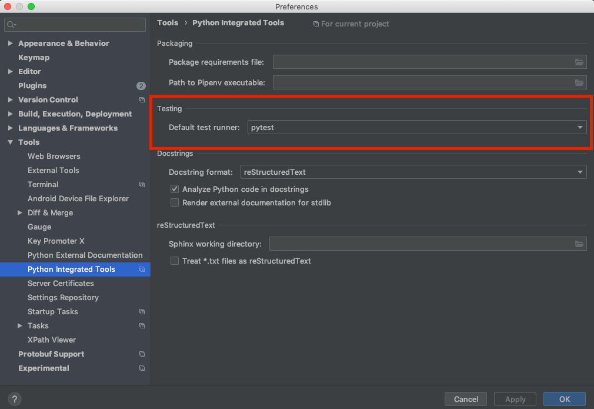

 .. Licensed to the Apache Software Foundation (ASF) under one
    or more contributor license agreements.  See the NOTICE file
    distributed with this work for additional information
    regarding copyright ownership.  The ASF licenses this file
    to you under the Apache License, Version 2.0 (the
    "License"); you may not use this file except in compliance
    with the License.  You may obtain a copy of the License at

 ..   http://www.apache.org/licenses/LICENSE-2.0

 .. Unless required by applicable law or agreed to in writing,
    software distributed under the License is distributed on an
    "AS IS" BASIS, WITHOUT WARRANTIES OR CONDITIONS OF ANY
    KIND, either express or implied.  See the License for the
    specific language governing permissions and limitations
    under the License.

Airflow Unit Tests
==================

All unit tests for Apache Airflow are run using `pytest <http://doc.pytest.org/en/latest/>`_ .

.. contents:: :local:

Writing Unit Tests
------------------

Follow the guidelines when writing unit tests:

* For standard unit tests that do not require integrations with external systems, make sure to simulate all communications.
* All Airflow tests are run with ``pytest``. Make sure to set your IDE/runners (see below) to use ``pytest`` by default.
* For tests, use standard "asserts" of Python and ``pytest`` decorators/context managers for testing
  rather than ``unittest`` ones. See `pytest docs <http://doc.pytest.org/en/latest/assert.html>`__ for details.
* Use a ``pytest.mark.parametrize`` marker for tests that have variations in parameters.
  See `pytest docs <https://docs.pytest.org/en/latest/how-to/parametrize.html>`__ for details.
* Use with ``pytest.warn`` to capture warnings rather than ``recwarn`` fixture. We are aiming for 0-warning in our
  tests, so we run Pytest with ``--disable-warnings`` but instead we have custom warning capture system.

Handling warnings
.................

By default, in the new tests selected warnings are prohibited:

* ``airflow.exceptions.AirflowProviderDeprecationWarning``
* ``airflow.exceptions.RemovedInAirflow3Warning``
* ``airflow.utils.context.AirflowContextDeprecationWarning``

That mean if one of this warning appear during test run and do not captured the test will failed.

.. code-block:: console

    root@91e633d08aa8:/opt/airflow# pytest tests/models/test_dag.py::TestDag::test_clear_dag
    ...
    FAILED tests/models/test_dag.py::TestDag::test_clear_dag[None-None] - airflow.exceptions.RemovedInAirflow3Warning: Calling `DAG.create_dagrun()` without an explicit data interval is deprecated

For avoid this make sure:

* You do not use deprecated method, classes and arguments in your test cases;
* Your change do not affect other component, e.g. deprecate one part of Airflow Core or one of Community Supported
  Providers might be a reason for new deprecation warnings. In this case changes should be also made in all affected
  components in backward compatible way.
* You use ``pytest.warn`` (see `pytest doc <https://docs.pytest.org/en/latest/how-to/capture-warnings.html#warns>`__
  context manager for catch warning during the test deprecated components.
  Yes we still need to test legacy/deprecated stuff until it complitly removed)

.. code-block:: python

    def test_deprecated_argument():
        with pytest.warns(AirflowProviderDeprecationWarning, match="expected warning pattern"):
            SomeDeprecatedClass(foo="bar", spam="egg")

Airflow configuration for unit tests
------------------------------------

Some of the unit tests require special configuration set as the ``default``. This is done automatically by
adding ``AIRFLOW__CORE__UNIT_TEST_MODE=True`` to the environment variables in Pytest auto-used
fixture. This in turn makes Airflow load test configuration from the file
``airflow/config_templates/unit_tests.cfg``. Test configuration from there replaces the original
defaults from ``airflow/config_templates/config.yml``. If you want to add some test-only configuration,
as default for all tests you should add the value to this file.

You can also - of course - override the values in individual test by patching environment variables following
the usual ``AIRFLOW__SECTION__KEY`` pattern or ``conf_vars`` context manager.

Airflow unit test types
-----------------------

Airflow tests in the CI environment are split into several test types. You can narrow down which
test types you want to use in various ``breeze testing`` sub-commands in three ways:

* via specifying the ``--test-type`` when you run single test type in ``breeze testing tests`` command
* via specifying space separating list of test types via ``--paralleltest-types`` or
  ``--exclude-parallel-test-types`` options when you run tests in parallel (in several testing commands)

Those test types are defined:

* ``Always`` - those are tests that should be always executed (always sub-folder)
* ``API`` - Tests for the Airflow API (api, api_connexion, api_experimental and api_internal sub-folders)
* ``CLI`` - Tests for the Airflow CLI (cli folder)
* ``Core`` - for the core Airflow functionality (core, executors, jobs, models, ti_deps, utils sub-folders)
* ``Operators`` - tests for the operators (operators folder with exception of Virtualenv Operator tests and
  External Python Operator tests that have their own test type). They are skipped by the
``virtualenv_operator`` and ``external_python_operator`` test markers that the tests are marked with.
* ``WWW`` - Tests for the Airflow webserver (www folder)
* ``Providers`` - Tests for all Providers of Airflow (providers folder)
* ``PlainAsserts`` - tests that require disabling ``assert-rewrite`` feature of Pytest (usually because
  a buggy/complex implementation of an imported library) (``plain_asserts`` marker)
* ``Other`` - all other tests remaining after the above tests are selected

There are also Virtualenv/ExternalPython operator test types that are excluded from ``Operators`` test type
and run as separate test types. Those are :

* ``PythonVenv`` - tests for PythonVirtualenvOperator - selected directly as TestPythonVirtualenvOperator
* ``BranchPythonVenv`` - tests for BranchPythonVirtualenvOperator - selected directly as TestBranchPythonVirtualenvOperator
* ``ExternalPython`` - tests for ExternalPythonOperator - selected directly as TestExternalPythonOperator
* ``BranchExternalPython`` - tests for BranchExternalPythonOperator - selected directly as TestBranchExternalPythonOperator

We have also tests that run "all" tests (so they do not look at the folder, but at the ``pytest`` markers
the tests are marked with to run with some filters applied.

* ``All-Postgres`` - tests that require Postgres database. They are only run when backend is Postgres (``backend("postgres")`` marker)
* ``All-MySQL`` - tests that require MySQL database. They are only run when backend is MySQL (``backend("mysql")`` marker)
* ``All-Quarantined`` - tests that are flaky and need to be fixed (``quarantined`` marker)
* ``All`` - all tests are run (this is the default)

We also have ``Integration`` tests that are running Integration tests with external software that is run
via ``--integration`` flag in ``breeze`` environment - via ``breeze testing integration-tests``.

* ``Integration`` - tests that require external integration images running in docker-compose

This is done for three reasons:

1. in order to selectively run only subset of the test types for some PRs
2. in order to allow efficient parallel test execution of the tests on Self-Hosted runners

For case 2. We can utilize memory and CPUs available on both CI and local development machines to run
test in parallel, but we cannot use pytest xdist plugin for that - we need to split the tests into test
types and run each test type with their own instance of database and separate container where the tests
in each type are run with exclusive access to their database and each test within test type runs sequentially.
By the nature of those tests - they rely on shared databases - and they update/reset/cleanup data in the
databases while they are executing.

DB and non-DB tests
-------------------

There are two kinds of unit tests in Airflow - DB and non-DB tests. This chapter describe the differences
between those two types.

Airflow non-DB tests
....................

For the Non-DB tests, they are run once for each tested Python version with ``none`` database backend (which
causes any database access to fail. Those tests are run with ``pytest-xdist`` plugin in parallel which
means that we can efficiently utilised multi-processor machines (including ``self-hosted`` runners with
8 CPUS we have to run the tests with maximum parallelism).

It's usually straightforward to run those tests in local virtualenv because they do not require any
setup or running database. They also run much faster than DB tests. You can run them with ``pytest`` command
or with ``breeze`` that has all the dependencies needed to run all tests automatically installed. Of course
you can also select just specific test or folder or module for the Pytest to collect/run tests from there,
the example below shows how to run all tests, parallelizing them with ``pytest-xdist``
(by specifying ``tests`` folder):

.. code-block:: bash

    pytest tests --skip-db-tests -n auto

The ``--skip-db-tests`` flag will only run tests that are not marked as DB tests.

You can also run ``breeze`` command to run all the tests (they will run in a separate container,
the selected python version and without access to any database). Adding ``--use-xdist`` flag will run all
tests in parallel using ``pytest-xdist`` plugin.

We have a dedicated, opinionated ``breeze testing non-db-tests`` command as well that runs non-DB tests
(it is also used in CI to run the non-DB tests, where you do not have to specify extra flags for
parallel running and you can run all the Non-DB tests
(or just a subset of them with ``--parallel-test-types`` or ``--exclude-parallel-test-types``) in parallel:

.. code-block:: bash

    breeze testing non-db-tests

You can pass ``--parallel-test-type`` list of test types to execute or ``--exclude--parallel-test-types``
to exclude them from the default set:.

.. code-block:: bash

    breeze testing non-db-tests --parallel-test-types "Providers API CLI"

.. code-block:: bash

    breeze testing non-db-tests --exclude-parallel-test-types "Providers API CLI"

You can also run the same commands via ``breeze testing tests`` - by adding the necessary flags manually:

.. code-block:: bash

    breeze testing tests --skip-db-tests --backend none --use-xdist

Also you can enter interactive shell with ``breeze`` and run tests from there if you want to iterate
with the tests. Source files in ``breeze`` are mounted as volumes so you can modify them locally and
rerun in Breeze as you will (``-n auto`` will parallelize tests using ``pytest-xdist`` plugin):

.. code-block:: bash

    breeze shell --backend none --python 3.8
    > pytest tests --skip-db-tests -n auto

Airflow DB tests
................

Some of the tests of Airflow require a database to connect to in order to run. Those tests store and read data
from Airflow DB using Airflow's core code and it's crucial to run the tests against all real databases
that Airflow supports in order to check if the SQLAlchemy queries are correct and if the database
  schema is correct.

Those tests should be marked with ``@pytest.mark.db`` decorator on one of the levels:

* test method can be marked with ``@pytest.mark.db`` decorator
* test class can be marked with ``@pytest.mark.db`` decorator
* test module can be marked with ``pytestmark = pytest.mark.db`` at the top level of the module

For the DB tests, they are run against the multiple databases Airflow support, multiple versions of those
and multiple Python versions it supports. In order to save time for testing not all combinations are
tested but enough various combinations are tested to detect potential problems.

By default, the DB tests will use sqlite and the "airflow.db" database created and populated in the
``${AIRFLOW_HOME}`` folder. You do not need to do anything to get the database created and initialized,
but if you need to clean and restart the db, you can run tests with ``-with-db-init`` flag - then the
database will be re-initialized. You can also set ``AIRFLOW__DATABASE__SQL_ALCHEMY_CONN`` environment
variable to point to supported database (Postgres, MySQL, etc.) and the tests will use that database. You
might need to run ``airflow db reset`` to initialize the database in that case.

The "non-DB" tests are perfectly fine to run when you have database around but if you want to just run
DB tests (as happens in our CI for the ``Database`` runs) you can use ``--run-db-tests-only`` flag to filter
out non-DB tests (and obviously you can specify not only on the whole ``tests`` directory but on any
folders/files/tests selection, ``pytest`` supports).

.. code-block:: bash

    pytest tests/ --run-db-tests-only

You can also run DB tests with ``breeze`` dockerized environment. You can choose backend to use with
``--backend`` flag. The default is ``sqlite`` but you can also use others such as ``postgres`` or ``mysql``.
You can also select backend version and Python version to use. You can specify the ``test-type`` to run -
breeze will list the test types you can run with ``--help`` and provide auto-complete for them. Example
below runs the ``Core`` tests with ``postgres`` backend and ``3.8`` Python version:

We have a dedicated, opinionated ``breeze testing db-tests`` command as well that runs DB tests
(it is also used in CI to run the DB tests, where you do not have to specify extra flags for
parallel running and you can run all the DB tests
(or just a subset of them with ``--parallel-test-types`` or ``--exclude-parallel-test-types``) in parallel:

.. code-block:: bash

    breeze testing non-db-tests --backend postgres

You can pass ``--parallel-test-type`` list of test types to execute or ``--exclude--parallel-test-types``
to exclude them from the default set:.

.. code-block:: bash

    breeze testing db-tests --parallel-test-types "Providers API CLI"

.. code-block:: bash

    breeze testing db-tests --exclude-parallel-test-types "Providers API CLI"

You can also run the same commands via ``breeze testing tests`` - by adding the necessary flags manually:

.. code-block:: bash

    breeze testing tests --run-db-tests-only --backend postgres --run-tests-in-parallel

Also - if you want to iterate with the tests you can enter interactive shell and run the tests iteratively -
either by package/module/test or by test type - whatever ``pytest`` supports.

.. code-block:: bash

    breeze shell --backend postgres --python 3.8
    > pytest tests --run-db-tests-only

As explained before, you cannot run DB tests in parallel using ``pytest-xdist`` plugin, but ``breeze`` has
support to split all the tests into test-types to run in separate containers and with separate databases
and you can run the tests using ``--run-tests-in-parallel`` flag (which is automatically enabled when
you use ``breeze testing db-tests`` command):

.. code-block:: bash

    breeze testing tests --run-db-tests-only --backend postgres --python 3.8 --run-tests-in-parallel

Examples of marking test as DB test
...................................

You can apply the marker on method/function/class level with ``@pytest.mark.db_test`` decorator or
at the module level with ``pytestmark = pytest.mark.db_test`` at the top level of the module.

It's up to the author to decide whether to mark the test, class, or module as "DB-test" - generally the
less DB tests - the better and if we can clearly separate the parts that are DB from non-DB, we should,
but also it's ok if few tests are marked as DB tests when they are not but they are part of the class
or module that is "mostly-DB".

Sometimes, when your class can be clearly split to DB and non-DB parts, it's better to split the class
into two separate classes and mark only the DB class as DB test.

Method level:

.. code-block:: python

   import pytest

   @pytest.mark.db_test
   def test_add_tagging(self, sentry, task_instance):
       ...

Class level:

.. code-block:: python

   import pytest

   @pytest.mark.db_test
   class TestDatabricksHookAsyncAadTokenSpOutside:
       ...

Module level (at the top of the module):

.. code-block:: python

   import pytest

   from airflow.models.baseoperator import BaseOperator
   from airflow.models.dag import DAG
   from airflow.ti_deps.dep_context import DepContext
   from airflow.ti_deps.deps.task_concurrency_dep import TaskConcurrencyDep

   pytestmark = pytest.mark.db_test

Best practices for DB tests
...........................

Usually when you add new tests you add tests "similar" to the ones that are already there. In most cases,
therefore you do not have to worry about the test type - it will be automatically selected for you by the
fact that the Test Class that you add the tests or the whole module will be marked with ``db_test`` marker.

You should strive to write "pure" non-db unit tests (i.e. DB tests) but sometimes it's just better to plug-in
the existing framework of DagRuns, Dags, Connections and Variables to use the Database directly rather
than having to mock the DB access for example. It's up to you to decide.

However, if you choose to write DB tests you have to make sure you add the ``db_test`` marker - either to
the test method, class (with decorator) or whole module (with pytestmark at the top level of the module).

In most cases when you add tests to existing modules or classes, you follow similar tests so you do not
have to do anything, but in some cases you need to decide if your test should be marked as DB test or
whether it should be changed to not use the database at all.

If your test accesses the database but is not marked properly the Non-DB test in CI will fail with this message:

.. code ::

    "Your test accessed the DB but `_AIRFLOW_SKIP_DB_TESTS` is set.
    Either make sure your test does not use database or mark your test with `@pytest.mark.db_test`.

How to verify if DB test is correctly classified
................................................

When you add if you want to see if your DB test is correctly classified, you can run the test or group
of tests with ``--skip-db-tests`` flag.

You can run the all (or subset of) test types if you want to make sure all ot the problems are fixed

  .. code-block:: bash

     breeze testing tests --skip-db-tests tests/your_test.py

For the whole test suite you can run:

  .. code-block:: bash

     breeze testing non-db-tests

For selected test types (example - the tests will run for Providers/API/CLI code only:

  .. code-block:: bash

     breeze testing non-db-tests --parallel-test-types "Providers API CLI"

How to make your test not depend on DB
......................................

This is tricky and there is no single solution. Sometimes we can mock-out the methods that require
DB access or objects that normally require database. Sometimes we can decide to test just sinle method
of class rather than more complex set of steps. Generally speaking it's good to have as many "pure"
unit tests that require no DB as possible comparing to DB tests. They are usually faster an more
reliable as well.

Special cases
.............

There are some tricky test cases that require special handling. Here are some of them:

Parameterized tests stability
~~~~~~~~~~~~~~~~~~~~~~~~~~~~~

The parameterized tests require stable order of parameters if they are run via xdist - because the parameterized
tests are distributed among multiple processes and handled separately. In some cases the parameterized tests
have undefined / random order (or parameters are not hashable - for example set of enums). In such cases
the xdist execution of the tests will fail and you will get an error mentioning "Known Limitations of xdist".
You can see details about the limitation `here <https://pytest-xdist.readthedocs.io/en/latest/known-limitations.html>`_

The error in this case will look similar to:

  .. code-block::

     Different tests were collected between gw0 and gw7. The difference is:

The fix for that is to sort the parameters in ``parametrize``. For example instead of this:

  .. code-block:: python

     @pytest.mark.parametrize("status", ALL_STATES)
     def test_method():
         ...

do that:

  .. code-block:: python

     @pytest.mark.parametrize("status", sorted(ALL_STATES))
     def test_method():
         ...

Similarly if your parameters are defined as result of utcnow() or other dynamic method - you should
avoid that, or assign unique IDs for those parametrized tests. Instead of this:

  .. code-block:: python

     @pytest.mark.parametrize(
         "url, expected_dag_run_ids",
         [
             (
                 f"api/v1/dags/TEST_DAG_ID/dagRuns?end_date_gte="
                 f"{urllib.parse.quote((timezone.utcnow() + timedelta(days=1)).isoformat())}",
                 [],
             ),
             (
                 f"api/v1/dags/TEST_DAG_ID/dagRuns?end_date_lte="
                 f"{urllib.parse.quote((timezone.utcnow() + timedelta(days=1)).isoformat())}",
                 ["TEST_DAG_RUN_ID_1", "TEST_DAG_RUN_ID_2"],
             ),
         ],
     )
     def test_end_date_gte_lte(url, expected_dag_run_ids):
         ...

Do this:

  .. code-block:: python

     @pytest.mark.parametrize(
         "url, expected_dag_run_ids",
         [
             pytest.param(
                 f"api/v1/dags/TEST_DAG_ID/dagRuns?end_date_gte="
                 f"{urllib.parse.quote((timezone.utcnow() + timedelta(days=1)).isoformat())}",
                 [],
                 id="end_date_gte",
             ),
             pytest.param(
                 f"api/v1/dags/TEST_DAG_ID/dagRuns?end_date_lte="
                 f"{urllib.parse.quote((timezone.utcnow() + timedelta(days=1)).isoformat())}",
                 ["TEST_DAG_RUN_ID_1", "TEST_DAG_RUN_ID_2"],
                 id="end_date_lte",
             ),
         ],
     )
     def test_end_date_gte_lte(url, expected_dag_run_ids):
         ...

Problems with Non-DB test collection
~~~~~~~~~~~~~~~~~~~~~~~~~~~~~~~~~~~~

Sometimes, even if whole module is marked as ``@pytest.mark.db_test`` even parsing the file and collecting
tests will fail when ``--skip-db-tests`` is used because some of the imports od objects created in the
module will read the database.

Usually what helps is to move such initialization code to inside the tests or pytest fixtures (and pass
objects needed by tests as fixtures rather than importing them from the module). Similarly you might
use DB - bound objects (like Connection) in your ``parametrize`` specification - this will also fail pytest
collection. Move creation of such objects to inside the tests:

Moving object creation from top-level to inside tests. This code will break collection of tests even if
the test is marked as DB test:

  .. code-block:: python

     TI = TaskInstance(
         task=BashOperator(task_id="test", bash_command="true", dag=DAG(dag_id="id"), start_date=datetime.now()),
         run_id="fake_run",
         state=State.RUNNING,
     )

     class TestCallbackRequest:
         @pytest.mark.parametrize(
             "input,request_class",
             [
                 (CallbackRequest(full_filepath="filepath", msg="task_failure"), CallbackRequest),
                 (
                     TaskCallbackRequest(
                         full_filepath="filepath",
                         simple_task_instance=SimpleTaskInstance.from_ti(ti=TI),
                         processor_subdir="/test_dir",
                         is_failure_callback=True,
                     ),
                     TaskCallbackRequest,
                 ),
                 (
                     DagCallbackRequest(
                         full_filepath="filepath",
                         dag_id="fake_dag",
                         run_id="fake_run",
                         processor_subdir="/test_dir",
                         is_failure_callback=False,
                     ),
                     DagCallbackRequest,
                 ),
                 (
                     SlaCallbackRequest(
                         full_filepath="filepath",
                         dag_id="fake_dag",
                         processor_subdir="/test_dir",
                     ),
                     SlaCallbackRequest,
                 ),
             ],
         )
         def test_from_json(self, input, request_class):
             ...

Instead - this will not break collection. The TaskInstance is not initialized when the module is parsed,
it will only be initialized when the test gets executed because we moved initialization of it from
top level / parametrize to inside the test:

  .. code-block:: python

    pytestmark = pytest.mark.db_test

    class TestCallbackRequest:
        @pytest.mark.parametrize(
            "input,request_class",
            [
                (CallbackRequest(full_filepath="filepath", msg="task_failure"), CallbackRequest),
                (
                    None,  # to be generated when test is run
                    TaskCallbackRequest,
                ),
                (
                    DagCallbackRequest(
                        full_filepath="filepath",
                        dag_id="fake_dag",
                        run_id="fake_run",
                        processor_subdir="/test_dir",
                        is_failure_callback=False,
                    ),
                    DagCallbackRequest,
                ),
                (
                    SlaCallbackRequest(
                        full_filepath="filepath",
                        dag_id="fake_dag",
                        processor_subdir="/test_dir",
                    ),
                    SlaCallbackRequest,
                ),
            ],
        )
        def test_from_json(self, input, request_class):
            if input is None:
                ti = TaskInstance(
                    task=BashOperator(
                        task_id="test", bash_command="true", dag=DAG(dag_id="id"), start_date=datetime.now()
                    ),
                    run_id="fake_run",
                    state=State.RUNNING,
                )

                input = TaskCallbackRequest(
                    full_filepath="filepath",
                    simple_task_instance=SimpleTaskInstance.from_ti(ti=ti),
                    processor_subdir="/test_dir",
                    is_failure_callback=True,
                )

Sometimes it is difficult to rewrite the tests, so you might add conditional handling and mock out some
database-bound methods or objects to avoid hitting the database during test collection. The code below
will hit the Database while parsing the tests, because this is what Variable.setdefault does when
parametrize specification is being parsed - even if test is marked as DB test.

  .. code-block:: python

      from airflow.models.variable import Variable

      pytestmark = pytest.mark.db_test

      initial_db_init()

      @pytest.mark.parametrize(
          "env, expected",
          [
              pytest.param(
                  {"plain_key": "plain_value"},
                  "{'plain_key': 'plain_value'}",
                  id="env-plain-key-val",
              ),
              pytest.param(
                  {"plain_key": Variable.setdefault("plain_var", "banana")},
                  "{'plain_key': 'banana'}",
                  id="env-plain-key-plain-var",
              ),
              pytest.param(
                  {"plain_key": Variable.setdefault("secret_var", "monkey")},
                  "{'plain_key': '***'}",
                  id="env-plain-key-sensitive-var",
              ),
              pytest.param(
                  {"plain_key": "{{ var.value.plain_var }}"},
                  "{'plain_key': '{{ var.value.plain_var }}'}",
                  id="env-plain-key-plain-tpld-var",
              ),
          ],
      )
      def test_rendered_task_detail_env_secret(patch_app, admin_client, request, env, expected):
          ...

You can make the code conditional and mock out the Variable to avoid hitting the database.

  .. code-block:: python

      from airflow.models.variable import Variable

      pytestmark = pytest.mark.db_test

      if os.environ.get("_AIRFLOW_SKIP_DB_TESTS") == "true":
          # Handle collection of the test by non-db case
          Variable = mock.MagicMock()  # type: ignore[misc] # noqa: F811
      else:
          initial_db_init()

      @pytest.mark.parametrize(
          "env, expected",
          [
              pytest.param(
                  {"plain_key": "plain_value"},
                  "{'plain_key': 'plain_value'}",
                  id="env-plain-key-val",
              ),
              pytest.param(
                  {"plain_key": Variable.setdefault("plain_var", "banana")},
                  "{'plain_key': 'banana'}",
                  id="env-plain-key-plain-var",
              ),
              pytest.param(
                  {"plain_key": Variable.setdefault("secret_var", "monkey")},
                  "{'plain_key': '***'}",
                  id="env-plain-key-sensitive-var",
              ),
              pytest.param(
                  {"plain_key": "{{ var.value.plain_var }}"},
                  "{'plain_key': '{{ var.value.plain_var }}'}",
                  id="env-plain-key-plain-tpld-var",
              ),
          ],
      )
      def test_rendered_task_detail_env_secret(patch_app, admin_client, request, env, expected):
          ...

You can also use fixture to create object that needs database just like this.

  .. code-block:: python

      from airflow.models import Connection

      pytestmark = pytest.mark.db_test

      @pytest.fixture()
      def get_connection1():
          return Connection()

      @pytest.fixture()
      def get_connection2():
          return Connection(host="apache.org", extra={})

      @pytest.mark.parametrize(
          "conn",
          [
              "get_connection1",
              "get_connection2",
          ],
      )
      def test_as_json_from_connection(self, conn: Connection):
          conn = request.getfixturevalue(conn)
          ...

Running Unit tests
------------------

Running Unit Tests from PyCharm IDE
...................................

To run unit tests from the PyCharm IDE, create the `local virtualenv <07_local_virtualenv.rst>`_,
select it as the default project's environment, then configure your test runner:

and run unit tests as follows:

.. image:: images/pycharm/running_unittests.png
    :align: center
    :alt: Running unit tests

**NOTE:** You can run the unit tests in the standalone local virtualenv
(with no Breeze installed) if they do not have dependencies such as
Postgres/MySQL/Hadoop/etc.

Running Unit Tests from PyCharm IDE using Breeze
................................................

Ideally, all unit tests should be run using the standardized Breeze environment.  While not
as convenient as the one-click "play button" in PyCharm, the IDE can be configured to do
this in two clicks.

1. Add Breeze as an "External Tool":

   a. From the settings menu, navigate to Tools > External Tools
   b. Click the little plus symbol to open the "Create Tool" popup and fill it out:

2. Add the tool to the context menu:

   a. From the settings menu, navigate to Appearance & Behavior > Menus & Toolbars > Project View Popup Menu
   b. Click on the list of entries where you would like it to be added.  Right above or below "Project View Popup Menu Run Group" may be a good choice, you can drag and drop this list to rearrange the placement later as desired.
   c. Click the little plus at the top of the popup window
   d. Find your "External Tool" in the new "Choose Actions to Add" popup and click OK.  If you followed the image above, it will be at External Tools > External Tools > Breeze

**Note:** That only adds the option to that one menu.  If you would like to add it to the context menu
when right-clicking on a tab at the top of the editor, for example, follow the steps above again
and place it in the "Editor Tab Popup Menu"

3. To run tests in Breeze, right click on the file or directory in the Project View and click Breeze.

Running Unit Tests from Visual Studio Code
..........................................

To run unit tests from the Visual Studio Code:

1. Using the ``Extensions`` view install Python extension, reload if required

2. Using the ``Testing`` view click on ``Configure Python Tests`` and select ``pytest`` framework

.. image:: images/vscode_select_pytest_framework.png
    :align: center
    :alt: Selecting pytest framework

3. Open ``/.vscode/settings.json`` and add ``"python.testing.pytestArgs": ["tests"]`` to enable tests discovery

.. image:: images/vscode_add_pytest_settings.png
    :align: center
    :alt: Enabling tests discovery

4. Now you are able to run and debug tests from both the ``Testing`` view and test files

.. image:: images/vscode_run_tests.png
    :align: center
    :alt: Running tests

Running Unit Tests in local virtualenv
......................................

To run unit, integration, and system tests from the Breeze and your
virtualenv, you can use the `pytest <http://doc.pytest.org/en/latest/>`_ framework.

Custom ``pytest`` plugin runs ``airflow db init`` and ``airflow db reset`` the first
time you launch them. So, you can count on the database being initialized. Currently,
when you run tests not supported **in the local virtualenv, they may either fail
or provide an error message**.

There are many available options for selecting a specific test in ``pytest``. Details can be found
in the official documentation, but here are a few basic examples:

.. code-block:: bash

    pytest tests/core -k "TestCore and not check"

This runs the ``TestCore`` class but skips tests of this class that include 'check' in their names.
For better performance (due to a test collection), run:

.. code-block:: bash

    pytest tests/core/test_core.py -k "TestCore and not bash"

This flag is useful when used to run a single test like this:

.. code-block:: bash

    pytest tests/core/test_core.py -k "test_check_operators"

This can also be done by specifying a full path to the test:

.. code-block:: bash

    pytest tests/core/test_core.py::TestCore::test_dag_params_and_task_params

To run the whole test class, enter:

.. code-block:: bash

    pytest tests/core/test_core.py::TestCore

You can use all available ``pytest`` flags. For example, to increase a log level
for debugging purposes, enter:

.. code-block:: bash

    pytest --log-cli-level=DEBUG tests/core/test_core.py::TestCore

Running Tests using Breeze interactive shell
............................................

You can run tests interactively using regular pytest commands inside the Breeze shell. This has the
advantage, that Breeze container has all the dependencies installed that are needed to run the tests
and it will ask you to rebuild the image if it is needed and some new dependencies should be installed.

By using interactive shell and iterating over the tests, you can iterate and re-run tests one-by-one
or group by group right after you modified them.

Entering the shell is as easy as:

.. code-block:: bash

     breeze

This should drop you into the container.

You can also use other switches (like ``--backend`` for example) to configure the environment for your
tests (and for example to switch to different database backend - see ``--help`` for more details).

Once you enter the container, you might run regular pytest commands. For example:

.. code-block:: bash

    pytest --log-cli-level=DEBUG tests/core/test_core.py::TestCore

Running Tests using Breeze from the Host
........................................

If you wish to only run tests and not to drop into the shell, apply the
``tests`` command. You can add extra targets and pytest flags after the ``--`` command. Note that
often you want to run the tests with a clean/reset db, so usually you want to add ``--db-reset`` flag
to breeze command. The Breeze image usually will have all the dependencies needed and it
will ask you to rebuild the image if it is needed and some new dependencies should be installed.

.. code-block:: bash

     breeze testing tests tests/providers/http/hooks/test_http.py tests/core/test_core.py --db-reset --log-cli-level=DEBUG

You can run the whole test suite without adding the test target:

.. code-block:: bash

    breeze testing tests --db-reset

You can also specify individual tests or a group of tests:

.. code-block:: bash

    breeze testing tests --db-reset tests/core/test_core.py::TestCore

You can also limit the tests to execute to specific group of tests

.. code-block:: bash

    breeze testing tests --test-type Core

In case of Providers tests, you can run tests for all providers

.. code-block:: bash

    breeze testing tests --test-type Providers

You can limit the set of providers you would like to run tests of

.. code-block:: bash

    breeze testing tests --test-type "Providers[airbyte,http]"

You can also run all providers but exclude the providers you would like to skip

.. code-block:: bash

    breeze testing tests --test-type "Providers[-amazon,google]"

Sometimes you need to inspect docker compose after tests command complete,
for example when test environment could not be properly set due to
failed healthchecks. This can be achieved with ``--skip-docker-compose-down``
flag:

.. code-block:: bash

    breeze testing tests --skip--docker-compose-down

Running full Airflow unit test suite in parallel
................................................

If you run ``breeze testing tests --run-in-parallel`` tests run in parallel
on your development machine - maxing out the number of parallel runs at the number of cores you
have available in your Docker engine.

In case you do not have enough memory available to your Docker (8 GB), the ``Integration``. ``Provider``
and ``Core`` test type are executed sequentially with cleaning the docker setup in-between. This
allows to print

This allows for massive speedup in full test execution. On 8 CPU machine with 16 cores and 64 GB memory
and fast SSD disk, the whole suite of tests completes in about 5 minutes (!). Same suite of tests takes
more than 30 minutes on the same machine when tests are run sequentially.

.. note::

  On MacOS you might have less CPUs and less memory available to run the tests than you have in the host,
  simply because your Docker engine runs in a Linux Virtual Machine under-the-hood. If you want to make
  use of the parallelism and memory usage for the CI tests you might want to increase the resources available
  to your docker engine. See the `Resources <https://docs.docker.com/docker-for-mac/#resources>`_ chapter
  in the ``Docker for Mac`` documentation on how to do it.

You can also limit the parallelism by specifying the maximum number of parallel jobs via
MAX_PARALLEL_TEST_JOBS variable. If you set it to "1", all the test types will be run sequentially.

.. code-block:: bash

    MAX_PARALLEL_TEST_JOBS="1" ./scripts/ci/testing/ci_run_airflow_testing.sh

.. note::

  In case you would like to cleanup after execution of such tests you might have to cleanup
  some of the docker containers running in case you use ctrl-c to stop execution. You can easily do it by
  running this command (it will kill all docker containers running so do not use it if you want to keep some
  docker containers running):

  .. code-block:: bash

      docker kill $(docker ps -q)

Running Backend-Specific Tests
..............................

Tests that are using a specific backend are marked with a custom pytest marker ``pytest.mark.backend``.
The marker has a single parameter - the name of a backend. It corresponds to the ``--backend`` switch of
the Breeze environment (one of ``mysql``, ``sqlite``, or ``postgres``). Backend-specific tests only run when
the Breeze environment is running with the right backend. If you specify more than one backend
in the marker, the test runs for all specified backends.

Example of the ``postgres`` only test:

.. code-block:: python

    @pytest.mark.backend("postgres")
    def test_copy_expert(self):
        ...

Example of the ``postgres,mysql`` test (they are skipped with the ``sqlite`` backend):

.. code-block:: python

    @pytest.mark.backend("postgres", "mysql")
    def test_celery_executor(self):
        ...

You can use the custom ``--backend`` switch in pytest to only run tests specific for that backend.
Here is an example of running only postgres-specific backend tests:

.. code-block:: bash

    pytest --backend postgres

Running Long-running tests
..........................

Some of the tests rung for a long time. Such tests are marked with ``@pytest.mark.long_running`` annotation.
Those tests are skipped by default. You can enable them with ``--include-long-running`` flag. You
can also decide to only run tests with ``-m long-running`` flags to run only those tests.

Running Quarantined tests
.........................

Some of our tests are quarantined. This means that this test will be run in isolation and that it will be
re-run several times. Also when quarantined tests fail, the whole test suite will not fail. The quarantined
tests are usually flaky tests that need some attention and fix.

Those tests are marked with ``@pytest.mark.quarantined`` annotation.
Those tests are skipped by default. You can enable them with ``--include-quarantined`` flag. You
can also decide to only run tests with ``-m quarantined`` flag to run only those tests.

Running Tests with provider packages
....................................

Airflow 2.0 introduced the concept of splitting the monolithic Airflow package into separate
providers packages. The main "apache-airflow" package contains the bare Airflow implementation,
and additionally we have 70+ providers that we can install additionally to get integrations with
external services. Those providers live in the same monorepo as Airflow, but we build separate
packages for them and the main "apache-airflow" package does not contain the providers.

Most of the development in Breeze happens by iterating on sources and when you run
your tests during development, you usually do not want to build packages and install them separately.
Therefore by default, when you enter Breeze airflow and all providers are available directly from
sources rather than installed from packages. This is for example to test the "provider discovery"
mechanism available that reads provider information from the package meta-data.

When Airflow is run from sources, the metadata is read from provider.yaml
files, but when Airflow is installed from packages, it is read via the package entrypoint
``apache_airflow_provider``.

By default, all packages are prepared in wheel format. To install Airflow from packages you
need to run the following steps:

1. Prepare provider packages

.. code-block:: bash

     breeze release-management prepare-provider-packages [PACKAGE ...]

If you run this command without packages, you will prepare all packages. However, You can specify
providers that you would like to build if you just want to build few provider packages.
The packages are prepared in ``dist`` folder. Note that this command cleans up the ``dist`` folder
before running, so you should run it before generating ``apache-airflow`` package.

2. Prepare airflow packages

.. code-block:: bash

     breeze release-management prepare-airflow-package

This prepares airflow .whl package in the dist folder.

3. Enter breeze installing both airflow and providers from the dist packages

.. code-block:: bash

     breeze --use-airflow-version wheel --use-packages-from-dist --mount-sources skip

Other Settings
--------------

Enable masking secrets in tests
...............................

By default masking secrets in test disabled because it might have side effects
into the other tests which intends to check logging/stdout/stderr values

If you need to test masking secrets in test cases
you have to apply ``pytest.mark.enable_redact`` to the specific test case, class or module.

.. code-block:: python

    @pytest.mark.enable_redact
    def test_masking(capsys):
        mask_secret("eggs")
        RedactedIO().write("spam eggs and potatoes")
        assert "spam *** and potatoes" in capsys.readouterr().out

Skip test on unsupported platform / environment
...............................................

You can apply the marker ``pytest.mark.platform(name)`` to the specific test case, class or module
for prevent to run on unsupported platform.

- ``linux``: Run test only on linux platform
- ``breeze``: Run test only inside of Breeze container, it might be useful in case of run
  some potential dangerous things in tests or if it expects to use common Breeze things.

Warnings capture system
.......................

By default, all warnings captured during the test runs are saved into the ``tests/warnings.txt``.

If required, you could change the path by providing ``--warning-output-path`` as pytest CLI arguments
or by setting the environment variable ``CAPTURE_WARNINGS_OUTPUT``.

.. code-block:: console

    root@3f98e75b1ebe:/opt/airflow# pytest tests/core/ --warning-output-path=/foo/bar/spam.egg
    ...
    ========================= Warning summary. Total: 28, Unique: 12 ==========================
    airflow: total 11, unique 1
      runtest: total 11, unique 1
    other: total 7, unique 1
      runtest: total 7, unique 1
    tests: total 10, unique 10
      runtest: total 10, unique 10
    Warnings saved into /foo/bar/spam.egg file.

    ================================= short test summary info =================================

You might also disable capture warnings by providing ``--disable-capture-warnings`` as pytest CLI arguments
or by setting `global warnings filter <https://docs.python.org/3/library/warnings.html#the-warnings-filter>`__
to **ignore**, e.g. set ``PYTHONWARNINGS`` environment variable to ``ignore``.

.. code-block:: bash

     pytest tests/core/ --disable-capture-warnings

Code Coverage
-------------

Airflow's CI process automatically uploads the code coverage report to codecov.io.
For the most recent coverage report of the main branch, visit: https://codecov.io/gh/apache/airflow.

Generating Local Coverage Reports:
..................................

If you wish to obtain coverage reports for specific areas of the codebase on your local machine, follow these steps:

a. Initiate a breeze shell.

b. Execute one of the commands below based on the desired coverage area:

   - **Core:** ``python scripts/cov/core_coverage.py``
   - **REST API:** ``python scripts/cov/restapi_coverage.py``
   - **CLI:** ``python scripts/cov/cli_coverage.py``
   - **Webserver:** ``python scripts/cov/www_coverage.py``

c. After execution, the coverage report will be available at: http://localhost:28000/dev/coverage/index.html.

 .. note::

     In order to see the coverage report, you must start webserver first in breeze environment via the
     `airflow webserver`. Once you enter `breeze`, you can start `tmux`  (terminal multiplexer) and
     split the terminal (by pressing `ctrl-B "` for example) to continue testing and run the webserver
     in one terminal and run tests in the second one (you can switch between the terminals with `ctrl-B <arrow>`).

Modules Not Fully Covered:
..........................

Each coverage command provides a list of modules that aren't fully covered. If you wish to enhance coverage for a particular module:

a. Work on the module to improve its coverage.

b. Once coverage reaches 100%, you can safely remove the module from the list of modules that are not fully covered.
   This list is inside each command's source code.

Tracking SQL statements
-----------------------

You can run tests with SQL statements tracking. To do this, use the ``--trace-sql`` option and pass the
columns to be displayed as an argument. Each query will be displayed on a separate line.
Supported values:

* ``num`` -  displays the query number;
* ``time`` - displays the query execution time;
* ``trace`` - displays the simplified (one-line) stack trace;
* ``sql`` - displays the SQL statements;
* ``parameters`` - display SQL statement parameters.

If you only provide ``num``, then only the final number of queries will be displayed.

By default, pytest does not display output for successful tests, if you still want to see them, you must
pass the ``--capture=no`` option.

If you run the following command:

.. code-block:: bash

    pytest --trace-sql=num,sql,parameters --capture=no \
      tests/jobs/test_scheduler_job.py -k test_process_dags_queries_count_05

On the screen you will see database queries for the given test.

SQL query tracking does not work properly if your test runs subprocesses. Only queries from the main process
are tracked.

-----

For other kinds of tests look at `Testing document <../09_testing.rst>`__
