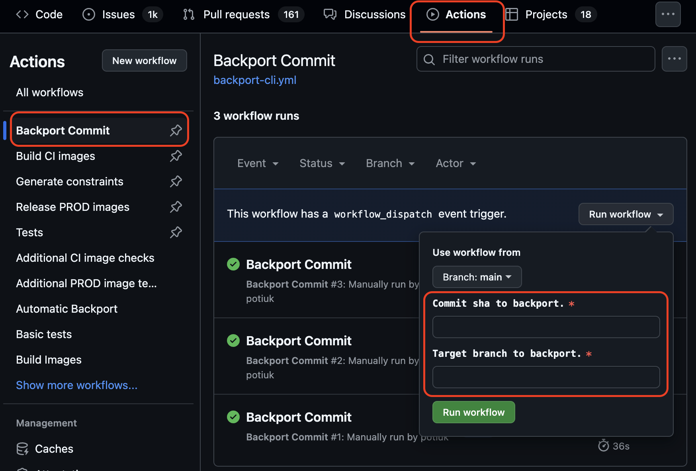

<!--
 Licensed to the Apache Software Foundation (ASF) under one
 or more contributor license agreements.  See the NOTICE file
 distributed with this work for additional information
 regarding copyright ownership.  The ASF licenses this file
 to you under the Apache License, Version 2.0 (the
 "License"); you may not use this file except in compliance
 with the License.  You may obtain a copy of the License at

   http://www.apache.org/licenses/LICENSE-2.0

 Unless required by applicable law or agreed to in writing,
 software distributed under the License is distributed on an
 "AS IS" BASIS, WITHOUT WARRANTIES OR CONDITIONS OF ANY
 KIND, either express or implied.  See the License for the
 specific language governing permissions and limitations
 under the License.
-->
<!-- START doctoc generated TOC please keep comment here to allow auto update -->
<!-- DON'T EDIT THIS SECTION, INSTEAD RE-RUN doctoc TO UPDATE -->
**Table of contents**

- [Main branch is Airflow 3.x](#main-branch-is-airflow-3x)
- [Contributors](#contributors)
  - [Developing for Providers and the Helm Chart](#developing-for-providers-and-the-helm-chart)
  - [Developing for Airflow 3.x, 3.1.x](#developing-for-airflow-3x-31x)
  - [Developing for Airflow 3](#developing-for-airflow-3)
  - [Developing for Airflow 2.11.x](#developing-for-airflow-211x)
- [Committers / PMCs](#committers--pmcs)
  - [Merging PRs for providers and Helm chart](#merging-prs-for-providers-and-helm-chart)
  - [Merging PRs targeted for Airflow 3.X](#merging-prs-targeted-for-airflow-3x)
  - [What do we backport to `v3-1-test` branch?](#what-do-we-backport-to-v3-1-test-branch)
  - [How to backport PR with GitHub Actions](#how-to-backport-pr-with-github-actions)
  - [How to backport PR with `cherry-picker` CLI](#how-to-backport-pr-with-cherry-picker-cli)
  - [Merging PRs for Airflow 3](#merging-prs-for-airflow-3)
- [Milestones for PR](#milestones-for-pr)
  - [Set 3.1.x milestone](#set-31x-milestone)
  - [Set 3.2 milestone](#set-32-milestone)

<!-- END doctoc generated TOC please keep comment here to allow auto update -->

# Main branch is Airflow 3.x

The `main` branch is for development of Airflow 3.x (next minor release).
Airflow 3.1.x releases will be cut from `v3-1-stable` branch.
Airflow 2.11.x releases will be cut from `v2-11-stable` branch.

# Contributors

The following section explains which branches you should target with your PR.

## Developing for Providers and the Helm Chart

PRs should target the `main` branch.
Make sure your changes are only related to Providers or the Helm chart.
Avoid mixing core changes into the same PR.

## Developing for Airflow 3.x, 3.1.x

If the PR is relevant to both Airflow 3.x and 3.1.x, it should target the `main` branch.

If you want to have a fix backported to 3.1.x please add (or request to add) "backport-to-v3-1-test" label to the PR. CI will automatically attempt to create a backport PR after merge.

When preparing a new 3.1.x release, the release manager will sync the `v3-1-test` branch to `v3-1-stable` and cut the release from the stable branch.
PRs should **never** target `v3-1-stable` directly unless explicitly instructed by the release manager.

## Developing for Airflow 3

PRs should target `main` branch.

## Developing for Airflow 2.11.x

If a PR can be cleanly cherry-picked from `main` to `v2-11-test`, it should target the `main` branch and include the `backport-to-v2-11-test` label to automate the backport.
If the PR cannot be cherry-picked without conflicts, you must manually create a PR targeting the `v2-11-test` branch.

> [!IMPORTANT]
> Airflow 2.11 is intended as a bridge release for Airflow 3.
> As such, it is not expected to introduce new features beyond those relevant to the transition to Airflow 3.
> That said, we focus only critical security fixes in the maintenance period until end-of-life.

When preparing a new 2.11.x release, the release manager will sync the `v2-11-test` branch to `v2-11-stable` and cut the release from the stable branch.
PRs should **never** target `v2-11-stable` directly unless explicitly instructed by the release manager.

# Committers / PMCs

The following sections explains the protocol for merging PRs.

## Merging PRs for providers and Helm chart

Make sure PR targets `main` branch.
Avoid merging PRs that involve (providers + core) or (helm chart + core).
Core parts should be extracted to a separate PR.
Exclusions should be pre-approved specifically with a comment by release manager.
Do not treat PR approval (Green V) as exclusion approval.

## Merging PRs targeted for Airflow 3.X

The committer who merges the PR is responsible for backporting the PRs that are 3.1 bug fixes (generally speaking)
to `v3-1-test` (latest active branch we release bugfixes from). See next chapter to see what kind of changes we cherry-pick.

It means that they should create a new PR where the original commit from main is cherry-picked and take care for resolving conflicts.
If the cherry-pick is too complex, then ask the PR author / start your own PR against `v3-1-test` directly with the change.
Note: tracking that the PRs merged as expected is the responsibility of committer who merged the PR.

Committer may also request from PR author to raise 2 PRs one against `main` branch and one against `v3-1-test` prior to accepting the code change.

Mistakes happen, and such backport PR work might fall through cracks. Therefore, if the committer thinks
that certain PRs should be backported, they should set 3.1.x milestone for them.

This way release manager can verify (as usual) if all the "expected" PRs have
been backported and cherry-pick remaining PRS.

We are using `cherry-picker` - a [tool](https://github.com/python/cherry-picker) that has been developed by
Python developers. It allows to easily cherry-pick PRs from one branch to another. It works both - via
command line and via GitHub Actions interface.

## What do we backport to `v3-1-test` branch?

The `v3-1-test` latest branch is generally used to release bugfixes, but what we cherry-pick is a bit more
nuanced than `bugfixes only`. We cherry-pick:

* **Bug-fixes** (obviously) - but not all of them - often we might decide to not cherry-pick bug-fixes that are
  not relevant to the latest release or difficult to cherry-pick
* **CI changes** - we cherry-pick most CI changes because our CI has a lot of dependencies on external factors
  (such as dependencies, Python versions, etc.) and we want to keep it up-to-date in the bugfix branch to
  keep CI green and to make latest workflows work in the same way as in the main branch
* **Documentation changes** - we cherry-pick documentation changes that are relevant to the latest release
  and that help users to understand how to use the latest release. We do not cherry-pick documentation changes
  that refer to features that are added in `main` branch and not in the latest release.
* **Minor refactorings in active areas** - sometimes we might decide to cherry-pick minor refactorings
  that are relevant to the latest release and that help us to keep the codebase clean and maintainable,
  particularly when they are done in areas that are likely to be cherry-picked. The reason why we are doing
  it is to make it easier for future cherry-picks to avoid conflicts. Committers should use their judgment
  whether to cherry-pick such changes (default being `no`) and they should be always justified by explaining
  why this change is cherry-picked even if it is not a bug-fix.


## How to backport PR with GitHub Actions

When you want to backport commit via GitHub actions (you need to be a committer), you
should use "Backport commit" action. You need to know the commit hash of the commit you want to backport.
You can pin the workflow from the list of workflows for easy access to it.

> [!NOTE]
> It should be the commit hash of the commit in the `main` branch, not in the original PR - you can find it
> via `git log` or looking up main History.



Use `main` as source of the workflow and copy the commit hash and enter the target branch name
(e.g. `v2-11-test`, `v3-0-test`).

The action should create a new PR with the cherry-picked commit and add a comment in the PR when it is
successful (or when it fails). If automatic backporting fails because of conflicts, you have to revert to
manual backporting using `cherry-picker` CLI.

## How to backport PR with `cherry-picker` CLI

Backporting via CLI might be more convenient for some users. Also it is necessary if you want to backport
PR that has conflicts. It also allows to backport commit to multiple branches in the same command.

To backport PRs to any branch (for example: v2-11-test), you can use the following command:

It's easiest to install it (and keep cherry-picker up-to-date) using `uv tool`:

```bash
uv tool install cherry-picker
````

And upgrade it with:

```bash
uv tool upgrade cherry-picker
```

Then, in order to backport a commit to a branch, you can use the following command:

```bash
cherry_picker COMMIT_SHA BRANCH_NAME1 [BRANCH_NAME2 ...]
```

This will create a new branch with the cherry-picked commit and open a PR against the target branch in
your browser.

If the GH_AUTH environment variable is set in your command line, the cherry-picker automatically creates a new pull request when there are no conflicts. To set GH_AUTH, use the token from your GitHub repository.

To set GH_AUTH run this:

```bash
export GH_AUTH={token}
```

Sometimes it might result with conflict. In such case, you should manually resolve the conflicts.
Some IDEs like IntelliJ has a fantastic conflict resolution tool - just follow `Git -> Resolve conflicts`
menu after you get the conflict. But you can also resolve the conflicts manually; see [How conflicts are
are presented](https://git-scm.com/docs/git-merge#_how_conflicts_are_presented) and
[How to resolve conflicts](https://git-scm.com/docs/git-merge#_how_to_resolve_conflicts) for more details.

```bash
cherry_picker --status  # Should show if all conflicts are resolved
cherry_picker --continue  # Should continue cherry-picking process
```

> [!WARNING]
> Sometimes, when you stop cherry-picking process in the middle, you might end up with your repo in a bad
> state and cherry-picker might print this message:
>
> > 🐍 🍒 ⛏
> >
> > You're not inside a cpython repo right now! 🙅
>
> You should then run `cherry-picker --abort` to clean up the mess and start over. If that does not work
> you might need to run `git config --local --remove-section cherry-picker` to clean up the configuration
> stored in `.git/config`.

## Merging PRs for Airflow 3

Make sure PR target `main` branch.

### PRs that involve breaking changes

Our goal is to avoid breaking changes whenever possible. Therefore, we should allow time for community members to review PRs that contain such changes - please avoid rushing to merge them. Also, please make sure that such PRs contain a `significant` newsfragment that contains `**Breaking Change**`.


# Milestones for PR

## Set 3.1.x milestone

Milestone will be added only to the original PR.

1. PR targeting `v3-1-test` directly - milestone will be on that PR.
2. PR targeting `main` with backport PR targeting `v3-1-test`. Milestone will be added only on the PR targeting `v3-1-main`.

## Set 3.2 milestone

Set for any feature that targets Airflow 3.x only.
