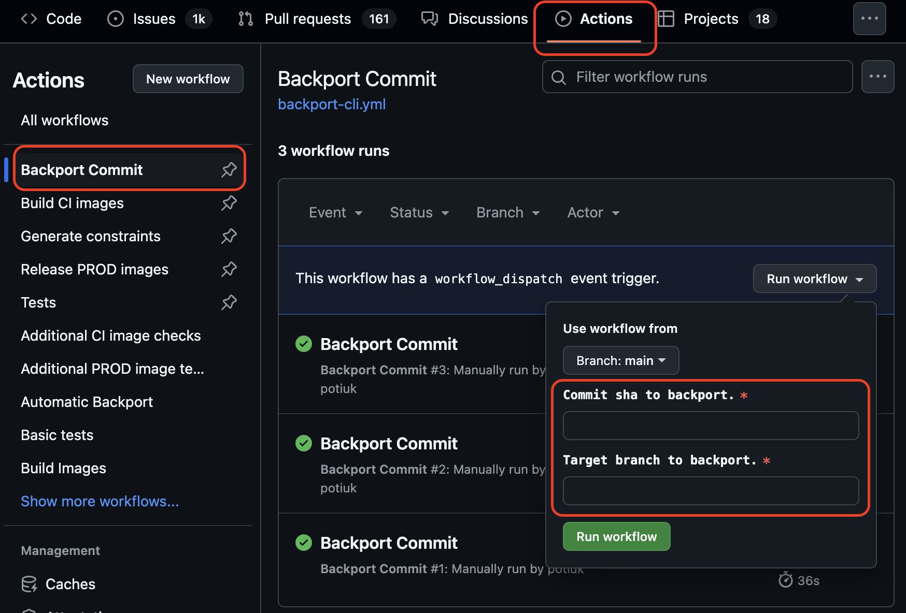

<!--
 Licensed to the Apache Software Foundation (ASF) under one
 or more contributor license agreements.  See the NOTICE file
 distributed with this work for additional information
 regarding copyright ownership.  The ASF licenses this file
 to you under the Apache License, Version 2.0 (the
 "License"); you may not use this file except in compliance
 with the License.  You may obtain a copy of the License at

   http://www.apache.org/licenses/LICENSE-2.0

 Unless required by applicable law or agreed to in writing,
 software distributed under the License is distributed on an
 "AS IS" BASIS, WITHOUT WARRANTIES OR CONDITIONS OF ANY
 KIND, either express or implied.  See the License for the
 specific language governing permissions and limitations
 under the License.
-->
<!-- START doctoc generated TOC please keep comment here to allow auto update -->
<!-- DON'T EDIT THIS SECTION, INSTEAD RE-RUN doctoc TO UPDATE -->
**Table of contents**

- [Main branch is Airflow 3.x](#main-branch-is-airflow-3x)
- [Contributors](#contributors)
  - [Developing for the Helm Chart](#developing-for-the-helm-chart)
  - [Developing for Providers](#developing-for-providers)
  - [Developing for Airflow 3.x, 3.2.x](#developing-for-airflow-3x-32x)
  - [Developing for Airflow 3](#developing-for-airflow-3)
  - [Developing for Airflow 2.11.x](#developing-for-airflow-211x)
- [Committers / PMCs](#committers--pmcs)
  - [Merging PRs for providers and Helm chart](#merging-prs-for-providers-and-helm-chart)
  - [Merging PRs targeted for Airflow 3.X](#merging-prs-targeted-for-airflow-3x)
  - [What do we backport to `v3-2-test` branch?](#what-do-we-backport-to-v3-2-test-branch)
  - [Backporting during pre-release period (before 3.2.0 GA)](#backporting-during-pre-release-period-before-320-ga)
  - [How to backport PR with GitHub Actions](#how-to-backport-pr-with-github-actions)
  - [How to backport PR with `cherry-picker` CLI](#how-to-backport-pr-with-cherry-picker-cli)
  - [Merging PRs for Airflow 2.11.x](#merging-prs-for-airflow-211x)
  - [Merging PRs for Airflow 3](#merging-prs-for-airflow-3)
- [Milestones for PR](#milestones-for-pr)
  - [Set 2.11.x milestone](#set-211x-milestone)
  - [Set 3.2.x milestone](#set-32x-milestone)
  - [Set 3.3 milestone](#set-33-milestone)

<!-- END doctoc generated TOC please keep comment here to allow auto update -->

# Main branch is Airflow 3.x

The `main` branch is for development of Airflow 3.x (next minor release).
Airflow 3.2.x releases will be cut from `v3-2-stable` branch.
Airflow 2.11.x releases will be cut from `v2-11-stable` branch.

# Contributors

The following section explains which branches you should target with your PR.

## Developing for the Helm Chart

Please check the [README_HELM_CHART2_DEV.md](README_HELM_CHART2_DEV.md)

## Developing for Providers

PRs should target the `main` branch.
Make sure your changes are only related to Providers or the Helm chart.
Avoid mixing core changes into the same PR.

## Developing for Airflow 3.x, 3.2.x

If the PR is relevant to both Airflow 3.x and 3.2.x, it should target the `main` branch.

If you want to have a fix backported to 3.2.x please add (or request to add) "backport-to-v3-2-test" label to the PR. CI will automatically attempt to create a backport PR after merge.

When preparing a new 3.2.x release, the release manager will sync the `v3-2-test` branch to `v3-2-stable` and cut the release from the stable branch.
PRs should **never** target `v3-2-stable` directly unless explicitly instructed by the release manager.

> [!TIP]
> **Shortcut for first RC candidates:** When preparing the first RC candidate for a new minor release
> (e.g., 3.2.0rc1), it is unlikely to be approved on the first attempt — bugs are typically found during
> RC testing. In this case, the release manager can prepare the RC directly from the `v3-X-test` branch
> without opening a PR to `v3-X-stable`. This saves the overhead of creating and managing a PR that will
> likely need additional changes before GA. However, when using this shortcut, the release manager **must**
> verify that the `v3-X-test` push CI action ("Tests" workflow) has succeeded before cutting the RC. You can
> check this at:
> https://github.com/apache/airflow/actions/workflows/ci-amd-arm.yml?query=event%3Apush+branch%3Av3-2-test
> (adjust the branch filter for the relevant `v3-X-test` branch).

## Developing for Airflow 3

PRs should target `main` branch.

## Developing for Airflow 2.11.x

> [!IMPORTANT]
> Airflow 2.11 is intended as a bridge release for Airflow 3 and reaches **end-of-life on April 22,
> 2026**. There will likely be just one last **2.11.3** release before EOL — there are already some
> bug fixes targeting 2.11 and one final update of dependencies will be done before we reach EOL.
> We focus only on critical bug fixes and security fixes in this maintenance period.

### Core and FAB provider changes

The `v2-11-test` branch has diverged significantly from `main` (Airflow 3.x) — both for core
Airflow and for the FAB provider. Cherry-picks rarely apply cleanly, so **if an issue affects both
Airflow 2.11 and Airflow 3, you need to create two separate PRs** — one targeting `main` and one
targeting `v2-11-test`:

1. **If the bug is reproducible on both `main` and 2.11:** fix it on `main` first, then create a
   separate PR targeting `v2-11-test` with the equivalent fix.
2. **If the bug is only reproducible on 2.11.x (not on `main`):** create a PR targeting `v2-11-test`
   directly.
3. **If a cherry-pick happens to apply cleanly:** you may target `main` and add the
   `backport-to-v2-11-test` label to automate the backport, but this is rare for core changes.

**Special exception — FAB provider (apache-airflow-providers-fab 1.5.x):**

The FAB provider is a special case. The FAB provider version on `main` (2.x+) has
`min-airflow-version` of Airflow 3 and uses FastAPI, while the older FAB provider 1.5.x for
Airflow 2.11 still uses Connexion — the code is heavily different between the two versions.
The FAB provider 1.5.x is maintained directly in the `v2-11-test` branch, which makes it easier
to test any changes for the Airflow 2.11 + FAB 1.5 combination together.

If your fix is for the FAB provider and affects both Airflow 2.11 and Airflow 3:

1. Create a PR targeting `main` for the FAB provider 2.x+ (Airflow 3).
2. Create a separate PR against `v2-11-test` for the FAB provider 1.5.x (Airflow 2.11).
3. If the fix is only relevant to Airflow 2.11 (not reproducible on `main`), target
   `v2-11-test` directly.

### Testing changes for Airflow 2.11.x

To test your changes locally, check out the `v2-11-test` branch. Breeze on Airflow 3 (`main`) is
not compatible with Airflow 2.11, so you need to reinstall it manually:

```bash
git checkout v2-11-test
uv tool install --force -e ./dev/breeze
```

After that, you can work as usual — including running `breeze start-airflow` to spin up a local
Airflow 2.11 environment for testing.

> [!WARNING]
> When you switch back to working on Airflow 3 (`main`), don't forget to reinstall Breeze from
> the `main` branch, as the Airflow 2.11 version of Breeze is not compatible with Airflow 3:
>
> ```bash
> git checkout main
> uv tool install --force -e ./dev/breeze
> ```

### Other provider changes

Providers (other than FAB) are released from `main` and are generally decoupled from the core
Airflow version. Most provider fixes should target `main` — they will be validated against
Airflow 2.11 by the 2.11 compatibility tests in CI.

### Release process

When preparing a new 2.11.x release, the release manager will sync the `v2-11-test` branch to `v2-11-stable` and cut the release from the stable branch.
PRs should **never** target `v2-11-stable` directly unless explicitly instructed by the release manager.

# Committers / PMCs

The following sections explains the protocol for merging PRs.

## Merging PRs for providers and Helm chart

Make sure PR targets `main` branch.
Avoid merging PRs that involve (providers + core) or (helm chart + core).
Core parts should be extracted to a separate PR.
Exclusions should be pre-approved specifically with a comment by release manager.
Do not treat PR approval (Green V) as exclusion approval.

## Merging PRs targeted for Airflow 3.X

The committer who merges the PR **is responsible for backporting the PRs that are 3.2 bug fixes (generally speaking)**
to `v3-2-test` (latest active branch we release bugfixes from). See next chapter to see what kind of changes we cherry-pick.

It means that they should create a new PR where the original commit from main is cherry-picked and take care for resolving conflicts.
If the cherry-pick is too complex, then ask the PR author / start your own PR against `v3-2-test` directly with the change.
Note: tracking that the PRs merged as expected is the responsibility of committer who merged the PR.

Committer may also request from PR author to raise 2 PRs one against `main` branch and one against `v3-2-test` prior to accepting the code change.

Mistakes happen, and such backport PR work might fall through cracks. Therefore, if the committer thinks
that certain PRs should be backported, they **should set 3.2.x milestone for them.**

This way release manager can verify (as usual) if all the "expected" PRs have
been backported and cherry-pick remaining PRS.

We are using `cherry-picker` - a [tool](https://github.com/python/cherry-picker) that has been developed by
Python developers. It allows to easily cherry-pick PRs from one branch to another. It works both - via
command line and via GitHub Actions interface.

## What do we backport to `v3-2-test` branch?

The `v3-2-test` latest branch is generally used to release bugfixes, but what we cherry-pick is a bit more
nuanced than `bugfixes only`. We cherry-pick:

* **Bug-fixes** (obviously) - but not all of them - often we might decide to not cherry-pick bug-fixes that are
  not relevant to the latest release or difficult to cherry-pick
* **CI changes** - we cherry-pick most CI changes because our CI has a lot of dependencies on external factors
  (such as dependencies, Python versions, etc.) and we want to keep it up-to-date in the bugfix branch to
  keep CI green and to make latest workflows work in the same way as in the main branch
* **Documentation changes** - we cherry-pick documentation changes that are relevant to the latest release
  and that help users to understand how to use the latest release. We do not cherry-pick documentation changes
  that refer to features that are added in `main` branch and not in the latest release.
* **Minor refactorings in active areas** - sometimes we might decide to cherry-pick minor refactorings
  that are relevant to the latest release and that help us to keep the codebase clean and maintainable,
  particularly when they are done in areas that are likely to be cherry-picked. The reason why we are doing
  it is to make it easier for future cherry-picks to avoid conflicts. Committers should use their judgment
  whether to cherry-pick such changes (default being `no`) and they should be always justified by explaining
  why this change is cherry-picked even if it is not a bug-fix.


## Backporting during pre-release period (before 3.2.0 GA)

During the pre-release period (after a beta/RC has been cut but before 3.2.0 GA is released), we need to
be careful about what gets merged into `v3-2-test` to avoid introducing risk into the upcoming release.

The following types of changes **can be merged directly** into `v3-2-test` during the pre-release period:

* **dev/CI changes** — keeping CI green and workflows up-to-date
* **Security fixes** — critical security patches
* **Fixes for issues found in the beta/RC** — bugs discovered during beta/RC testing

For **bug fixes targeting 3.2.1** (i.e., fixes that are not critical for the 3.2.0 release):

1. Merge the PR to `main` as usual.
2. Cherry-pick it to `v3-2-test` (either automatically via label or manually).
3. Set the **3.2.1 milestone** on the PR.
4. **Keep the backport PR as a Draft** — do not merge it until 3.2.0 GA is released.
5. After 3.2.0 GA is released, go back and merge the draft backport PRs.

This approach avoids creating additional branches while ensuring that 3.2.0 is not destabilized by
changes that are not strictly necessary for the initial release.

## How to backport PR with GitHub Actions

When you want to backport commit via GitHub actions (you need to be a committer), you
should use "Backport commit" action. You need to know the commit hash of the commit you want to backport.
You can pin the workflow from the list of workflows for easy access to it.

> [!NOTE]
> It should be the commit hash of the commit in the `main` branch, not in the original PR - you can find it
> via `git log` or looking up main History.



Use `main` as source of the workflow and copy the commit hash and enter the target branch name
(e.g. `v2-11-test`, `v3-2-test`).

The action should create a new PR with the cherry-picked commit and add a comment in the PR when it is
successful (or when it fails). If automatic backporting fails because of conflicts, you have to revert to
manual backporting using `cherry-picker` CLI.

## [How to backport PR with `cherry-picker` CLI](README.md#how-to-backport-pr-with-cherry-picker-cli)

## Merging PRs for Airflow 2.11.x

> [!NOTE]
> Airflow 2.11 reaches end-of-life on April 22, 2026. There will likely be one last 2.11.3 release
> before EOL. The FAB Provider 1.5.* reaches end-of-life 12 months after 2.11.0 was released - which is
> May 22, 2026.

Since the `v2-11-test` branch has diverged significantly from `main`, committers should be aware that:

* Most core and FAB provider bug fixes require **two separate PRs** — one for `main` and one for
  `v2-11-test` — because cherry-picks rarely apply cleanly.
* The committer merging a bug fix to `main` should verify whether it also affects 2.11.x and, if so,
  ensure a corresponding PR is created against `v2-11-test` (either by the original author or by the
  committer).
* Other provider PRs (non-FAB) should generally only go to `main`.

### FAB provider 1.5.x (Airflow 2.11 only)

The FAB provider on `main` (at the time of this writing 2.x+) requires Airflow 3 and uses FastAPI,
while the 1.5.x line uses Connexion — the code is heavily different. The FAB provider 1.5.x
is maintained directly in the `v2-11-test` branch, so FAB fixes for Airflow 2.11
should target `v2-11-test`.

## Merging PRs for Airflow 3

Make sure PRs target `main` branch.

### PRs that involve breaking changes

Our goal is to avoid breaking changes whenever possible. Therefore, we should allow time for community
members to review PRs that contain such changes - please avoid rushing to merge them.
Also, please make sure that such PRs contain a `significant newsfragment` that contains `**Breaking Change**`.

# Milestones for PR

## Set 2.11.x milestone

Set for bug fixes and security fixes targeting Airflow 2.11.x (until end-of-life on April 22, 2026).

1. PR targeting `v2-11-test` directly — milestone will be on that PR.

## Set 3.2.x milestone

Milestone will be added only to the original PR.

1. PR targeting `v3-2-test` directly - milestone will be on that PR.
2. PR targeting `main` with backport PR targeting `v3-2-test`. Milestone will be added only on the PR targeting `main`.

## Set 3.3 milestone

Set for any feature that targets Airflow 3.3 only.
