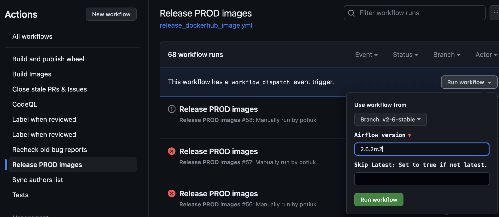
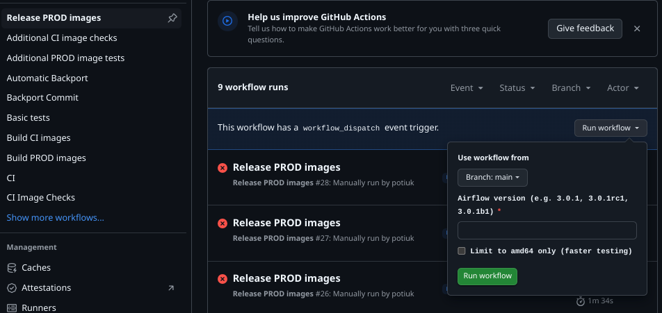

<!--
 Licensed to the Apache Software Foundation (ASF) under one
 or more contributor license agreements.  See the NOTICE file
 distributed with this work for additional information
 regarding copyright ownership.  The ASF licenses this file
 to you under the Apache License, Version 2.0 (the
 "License"); you may not use this file except in compliance
 with the License.  You may obtain a copy of the License at

   http://www.apache.org/licenses/LICENSE-2.0

 Unless required by applicable law or agreed to in writing,
 software distributed under the License is distributed on an
 "AS IS" BASIS, WITHOUT WARRANTIES OR CONDITIONS OF ANY
 KIND, either express or implied.  See the License for the
 specific language governing permissions and limitations
 under the License.
-->
<!-- START doctoc generated TOC please keep comment here to allow auto update -->
<!-- DON'T EDIT THIS SECTION, INSTEAD RE-RUN doctoc TO UPDATE -->
**Table of contents**

- [Perform review of security issues that are marked for the release](#perform-review-of-security-issues-that-are-marked-for-the-release)
- [Selecting what to put into the release](#selecting-what-to-put-into-the-release)
  - [Validating completeness of i18n locale files and announcing i18n freeze time](#validating-completeness-of-i18n-locale-files-and-announcing-i18n-freeze-time)
  - [Selecting what to cherry-pick](#selecting-what-to-cherry-pick)
  - [Making the cherry picking](#making-the-cherry-picking)
  - [Collapse Cadwyn Migrations](#collapse-cadwyn-migrations)
  - [Reviewing cherry-picked PRs and assigning labels](#reviewing-cherry-picked-prs-and-assigning-labels)
- [Prepare the Apache Airflow Package RC](#prepare-the-apache-airflow-package-rc)
  - [Update the milestone](#update-the-milestone)
  - [Build RC artifacts](#build-rc-artifacts)
  - [Publish release candidate documentation (staging)](#publish-release-candidate-documentation-staging)
  - [Prepare production Docker Image RC](#prepare-production-docker-image-rc)
  - [Prepare Vote email on the Apache Airflow release candidate](#prepare-vote-email-on-the-apache-airflow-release-candidate)
- [Verify the release candidate by PMC members](#verify-the-release-candidate-by-pmc-members)
  - [Reproducible package check](#reproducible-package-check)
  - [SVN check](#svn-check)
  - [Licence check](#licence-check)
  - [Signature check](#signature-check)
  - [SHA512 sum check](#sha512-sum-check)
- [Verify the release candidate by Contributors](#verify-the-release-candidate-by-contributors)
  - [Installing release candidate in your local virtual environment](#installing-release-candidate-in-your-local-virtual-environment)
- [Publish the final Apache Airflow release](#publish-the-final-apache-airflow-release)
  - [Summarize the voting for the Apache Airflow release](#summarize-the-voting-for-the-apache-airflow-release)
  - [Publish release to SVN](#publish-release-to-svn)
  - [Manually prepare production Docker Image](#manually-prepare-production-docker-image)
  - [Verify production images](#verify-production-images)
  - [Publish final documentation](#publish-final-documentation)
  - [Notify developers of release](#notify-developers-of-release)
  - [Send announcements about security issues fixed in the release](#send-announcements-about-security-issues-fixed-in-the-release)
  - [Add release data to Apache Committee Report Helper](#add-release-data-to-apache-committee-report-helper)
  - [Update Announcements page](#update-announcements-page)
  - [Create release on GitHub](#create-release-on-github)
  - [Close the milestone](#close-the-milestone)
  - [Close the testing status issue](#close-the-testing-status-issue)
  - [Announce the release on the community slack](#announce-the-release-on-the-community-slack)
  - [Announce about the release in social media](#announce-about-the-release-in-social-media)
  - [Update `main` with the latest release details](#update-main-with-the-latest-release-details)
  - [Update default Airflow version in the helm chart](#update-default-airflow-version-in-the-helm-chart)
  - [Update airflow/config_templates/config.yml file](#update-airflowconfig_templatesconfigyml-file)
  - [API clients](#api-clients)

<!-- END doctoc generated TOC please keep comment here to allow auto update -->

You can find the prerequisites to release Apache Airflow in [README.md](README.md).

# Perform review of security issues that are marked for the release

We are keeping track of security issues in the [Security Issues](https://github.com/airflow-s/airflow-s/issues)
repository currently. As a release manager, you should have access to the repository.
Please review and ensure that all security issues marked for the release have been
addressed and resolved. Ping security team (comment in the issues) if anything missing or
the issue does not seem to be addressed.

Additionally, the [dependabot alerts](https://github.com/apache/airflow/security/dependabot) and
code [scanning alerts](https://github.com/apache/airflow/security/code-scanning) should be reviewed
and security team should be pinged to review and resolve them.

# Selecting what to put into the release

The first step of a release is to work out what is being included. This differs based on whether it is a major/minor or a patch release.

- For a *major* or *minor* release, you want to include everything in `main` at the time of release; you'll turn this into a new release branch as part of the rest of the process.

- For a *patch* release, you will be selecting specific commits to cherry-pick and backport into the existing release branch.


## Validating completeness of i18n locale files and announcing i18n freeze time

> [!NOTE]
> It is recommended to delegate all operations in this task to another committer.

Before cutting the release candidate (RC), you should announce a freeze time for i18n changes to allow translators to complete translations for the upcoming release without being overloaded by new terms, or other significant changes.
The freeze should last at least one week, and until the RC is cut.
It is recommended to announce the freeze at least two weeks before it starts.
To prepare for the announcement, generate an output of completeness for all locale files - follow the instructions in section 8.1 of the [internationalization (i18n) policy](../airflow-core/src/airflow/ui/public/i18n/README.md#81-checking-completeness-of-i18n-files) for doing so.
The reminder should be sent via dev@airflow.apache.org mailing list - you may accompany it with a GitHub issue for tracking purposes.

> [!NOTE]
> When applicable - you should mention, within the output, translations that have been incomplete in the past release,
> and warn that they might be removed if they are not completed by the release date.

Subject:

```shell script
cat <<EOF
[ANNOUNCEMENT] English Translation freeze for Airflow ${VERSION} RC starting at <START_DATE>
EOF
```

Body (assuming delegation to another committer):

```shell script
cat <<EOF
Hey fellow Airflowers,

I'm sending this message on behalf of the release managers.
The release managers are planning to cut the Airflow ${VERSION} RC soon/by <RELEASE_DATE>.

After running the i18n completeness script, this is the coverage state of all merged locales as of <CURRENT_DATE>:

<OUTPUT_OF_I18N_COMPLETENESS_SCRIPT>

To prevent overloading the translators and to ensure completeness of all translations by the release, a freeze upon the English locale will be applied starting <START_DATE>,
and until the RC is cut.
Code owners, translation owners, and engaged translators are asked to complete the coverage of their assigned locales during this time.

Important notes:
1. Any changes merged after the final release won't not be included, and missing terms will fall back to English.
2. Any PR that modifies the English locale during the freeze time will fail CI checks.
3. Requests for exemptions should be communicated in the #i18n Slack channel, and approved by at least 1 PMC member - guidelines for approval are available in the i18n policy.
4. PRs approved for an exemption will be labeled with `allow translation change`, and then the relevant CI check will pass. Translators are encouraged to complete the translations for the exempted terms during the freeze time.
5. Merging PRs for adding new translations could be done during the freeze time - designated code owners should validate that by the end of the freeze time, the coverage of the suggested translation is complete.


Thanks for your cooperation!
<your name>
EOF
```

When the freeze starts, you should merge a PR for setting the flag `FAIL_WHEN_ENGLISH_TRANSLATION_CHANGED` to `True` in the file [selective_checks.py](./breeze/src/airflow_breeze/utils/selective_checks.py).
If the freeze gets extended, you should update the announcement thread accordingly.
When it is time to cut the RC, you should:

1. Generate an additional completeness output:
  a. If there are incomplete locales that were also incomplete in the previous completeness output, please contact the code owner and ask them to act according to section "Relinquishing translation/code ownership" in the i18n policy (section 6.4).
  b. If there are other incomplete locales, please write it as a reminder for the next freeze announcement.
2. Create a PR for setting the flag back to `False`.
3. Post on the same thread that the freeze is lifted, and share the final completeness output.

> [!NOTE]
> Release managers - do not hold the release process beyond the due date if there are still incomplete locales after the freeze.
> It is the responsibility of code owners to ensure the completeness of their locales by the due date.

## Selecting what to cherry-pick

For obvious reasons, you can't cherry-pick every change from `main` into the release branch -
some are incompatible without a large set of other changes, some are brand-new features, and some just don't need to be in a release.

In general only security fixes, data-loss bugs and regression fixes are essential to bring into a patch release;
also changes in dependencies (pyproject.toml) resulting from releasing newer versions of packages that Airflow depends on.
Other bugfixes can be added on a best-effort basis, but if something is going to be very difficult to backport
(maybe it has a lot of conflicts, or heavily depends on a new feature or API that's not being backported),
it's OK to leave it out of the release at your sole discretion as the release manager -
if you do this, update the milestone in the issue to the "next" minor release.

Many issues will be marked with the target release as their Milestone; this is a good shortlist
to start with for what to cherry-pick.

For a patch release, find out other bug fixes that are not marked with the target release as their Milestone
and mark those as well. You can accomplish this by running the following command:

```
./dev/airflow-github needs-categorization 2.3.2 HEAD
```

Often you also want to cherry-pick changes related to CI and development tools, to include the latest
stability fixes in CI and improvements in development tools. Usually you can see the list of such
changes via (this will exclude already merged changes):

```shell
git fetch apache
git log --oneline apache/v3-1-test | sed -n 's/.*\((#[0-9]*)\)$/\1/p' > /tmp/merged
git log --oneline --decorate apache/v2-2-stable..apache/main -- Dockerfile* scripts breeze* .github/ setup* dev | grep -vf /tmp/merged
```

Most of those PRs should be marked with `changelog:skip` label, so that they are excluded from the
user-facing changelog as they only matter for developers of Airflow. We have a tool
that allows to easily review the cherry-picked PRs and mark them with the right label - see below.

You also likely want to cherry-pick some of the latest doc changes in order to bring clarification and
explanations added to the documentation. Usually you can see the list of such changes via:

```shell
git fetch apache
git log --oneline apache/v3-1-test | sed -n 's/.*\((#[0-9]*)\)$/\1/p' > /tmp/merged
git log --oneline --decorate apache/v2-2-stable..apache/main -- docs/apache-airflow docs/docker-stack/ | grep -vf /tmp/merged
```

Those changes that are "doc-only" changes should be marked with `type:doc-only` label so that they
land in documentation part of the changelog. The tool to review and assign the labels is described below.

## Making the cherry picking

It is recommended to clone Airflow upstream (not your fork) and run the commands on
the relevant test branch in this clone. That way origin points to the upstream repo.

To see cherry picking candidates (unmerged PR with the appropriate milestone), from the test
branch you can run:

```shell
./dev/airflow-github compare 3.1.3 --unmerged
```

You can start cherry picking from the bottom of the list. (older commits first)

When you cherry-pick, pick in chronological order onto the `vX-Y-test` release branch.
You'll move them over to be on `vX-Y-stable` once the release is cut. Use the `-x` option
to keep a reference to the original commit we cherry picked from. ("cherry picked from commit ...")

```shell
git cherry-pick <hash-commit> -x
```

## Collapse Cadwyn Migrations

Before cutting an RC, bump the HEAD date of Cadwyn versioned API (execution api for now: `airflow-core/src/airflow/api_fastapi/execution_api`)
to reflect the tentative release date of Airflow. All the Cadwyn migrations in between the tentative release date and last release date
should be collapsed.

Refer https://github.com/apache/airflow/pull/49116 as a good example.


## Reviewing cherry-picked PRs and assigning labels

We have the tool that allows to review cherry-picked PRs and assign the labels
[./assign_cherry_picked_prs_with_milestone.py](./assign_cherry_picked_prs_with_milestone.py)

It allows to manually review and assign milestones and labels to cherry-picked PRs:

```shell
./dev/assign_cherry_picked_prs_with_milestone.py assign-prs --previous-release v2-2-stable --current-release apache/v2-2-test --milestone-number 48
```

It summarises the state of each cherry-picked PR including information whether it is going to be
excluded or included in changelog or included in doc-only part of it. It also allows to re-assign
the PRs to the target milestone and apply the `changelog:skip` or `type:doc-only` label.

You can also add `--skip-assigned` flag if you want to automatically skip the question of assignment
for the PRs that are already correctly assigned to the milestone. You can also avoid the "Are you OK?"
question with `--assume-yes` flag.

You can review the list of PRs cherry-picked and produce a nice summary with `--print-summary` (this flag
assumes the `--skip-assigned` flag, so that the summary can be produced without questions:

```shell
./dev/assign_cherry_picked_prs_with_milestone.py assign-prs --previous-release v2-2-stable \
  --current-release apache/v2-2-test --milestone-number 48 --skip-assigned --assume-yes --print-summary \
  --output-folder /tmp
```

This will produce summary output with nice links that you can use to review the cherry-picked changes,
but it also produces files with list of commits separated by type in the folder specified. In the case
above, it will produce three files that you can use in the next step:

```
Changelog commits written in /tmp/changelog-changes.txt

Doc only commits written in /tmp/doc-only-changes.txt

Excluded commits written in /tmp/excluded-changes.txt
```

You can see for example which files have been changed by "doc-only" or "excluded" changes, to make sure
that no "sneaky" changes were by mistake classified wrongly.

```shell
git show --format=tformat:"" --stat --name-only $(cat /tmp/doc-only-changes.txt) | sort | uniq
```

Then if you see suspicious file (example airflow/sensors/base.py) you can find details on where they came from:

```shell
git log apache/v3-1-test --format="%H" -- airflow/sensors/base.py | grep -f /tmp/doc-only-changes.txt | xargs git show
```

And the URL to the PR it comes from:

```shell
git log apache/v3-1-test --format="%H" -- airflow/sensors/base.py | grep -f /tmp/doc-only-changes.txt | \
    xargs -n 1 git log --oneline --max-count=1 | \
    sed s'/.*(#\([0-9]*\))$/https:\/\/github.com\/apache\/airflow\/pull\/\1/'
```

# Prepare the Apache Airflow Package RC

## Update the milestone

Before cutting an RC, we should look at the milestone and merge anything ready, or if we aren't going to include it in the release we should update the milestone for those issues. We should do that before cutting the RC so the milestone gives us an accurate view of what is going to be in the release as soon as we know what it will be.

## Build RC artifacts

The Release Candidate artifacts we vote upon should be the exact ones we vote against, without any modification other than renaming – i.e. the contents of the files must be the same between voted release candidate and final release. Because of this the version in the built artifacts that will become the official Apache releases must not include the rcN suffix.

- Set environment variables

```shell script

# You can avoid repeating this command for every release if you will set it in .zshrc
# see https://unix.stackexchange.com/questions/608842/zshrc-export-gpg-tty-tty-says-not-a-tty
export GPG_TTY=$(tty)

# Set Version
export VERSION=3.1.3
export VERSION_SUFFIX=rc1
export VERSION_RC=${VERSION}${VERSION_RC}
export VERSION_BRANCH=3-1
export TASK_SDK_VERSION=1.1.3
export TASK_SDK_VERSION_RC=${TASK_SDK_VERSION}${VERSION_SUFFIX}
export PREVIOUS_VERSION=3.1.2
export SYNC_BRANCH=changes-3.1.2rc1 # sync branch, if different from the test branch

# Set AIRFLOW_REPO_ROOT to the path of your git repo
export AIRFLOW_REPO_ROOT=$(pwd)


# Example after cloning
git clone https://github.com/apache/airflow.git airflow
cd airflow
export AIRFLOW_REPO_ROOT=$(pwd)
```

- Install `breeze` command:

```shell script
uv tool install -e ./dev/breeze
```

- For major/minor version release, run the following commands to create the 'test' and 'stable' branches.

    ```shell script
    breeze release-management create-minor-branch --version-branch ${VERSION_BRANCH}
    ```

- Check out the 'test' branch

    ```shell script
    git checkout v${VERSION_BRANCH}-test
    git reset --hard origin/v${VERSION_BRANCH}-test
    ```

- Create a new branch from v${VERSION_BRANCH}-test

    ```shell script
    git checkout -b ${SYNC_BRANCH}
    ```

    We sync this new branch to the stable branch so that people would continue to backport PRs to the test branch
    while the RC is being voted. The new branch must be in sync with where you cut it off from the test branch.

- Set the Airflow version in `airflow-core/src/airflow/__init__.py` (without the RC tag).
- Set the Task SDK version in `task-sdk/src/airflow/sdk/__init__.py` (without the RC tag)
- Update the Task SDK version `>=` part in `airflow-core/pyproject.toml` to `==` TASK_SDK_VERSION without RC
- Run `git commit` without a message to update versions in `docs`.
- Add supported Airflow version to `./scripts/ci/prek/supported_versions.py` and let prek do the job again.
- Replace the versions in `README.md` about installation and verify that installation instructions work fine.
- Add entry for default python version to `PROVIDERS_COMPATIBILITY_TESTS_MATRIX` in `src/airflow_breeze/global_constants.py`
  with the new Airflow version, and empty exclusion for providers. This list should be updated later when providers
  with minimum version for the next version of Airflow will be added in the future.
- Check `Apache Airflow is tested with` (stable version) in `README.md` has the same tested versions as in the tip of
  the stable branch in `dev/breeze/src/airflow_breeze/global_constants.py`
- Commit the above changes with the message `Update version to ${VERSION}`.
- Build the release notes:

  Preview with:

    ```shell script
    towncrier build --draft --version=${VERSION} --date=2021-12-15 --dir . --config newsfragments/config.toml
    ```


  Then remove the `--draft` flag to have towncrier build the release notes for real.

  If no significant changes were added in this release, add the header and put "No significant changes." (e.g. `2.1.4`).

  This will partly generate the release note based on the fragments (adjust to rst format). All PRs does not necessarily
  create a fragment to document its change, to generate the body of the release note based on the cherry picked commits:

  ```
  ./dev/airflow-github changelog v2-3-stable v2-3-test
  ```

- Commit the release note change.

- PR from the 'test' branch to the 'stable' branch

- When the PR is approved, install `dev/breeze` in a virtualenv:

    ```shell script
    pip install -e ./dev/breeze
    ```

- Set `GITHUB_TOKEN` environment variable. Needed in patch release for generating issue for testing of the RC.
    You can generate the token by following [this link](https://github.com/settings/tokens/new?description=Read%20sssues&scopes=repo:status)

    ```shell script
    export GITHUB_TOKEN="my_token"
    ```

- Start the release candidate process by running the below command (If you have not generated a key yet, generate it by following instructions on
    http://www.apache.org/dev/openpgp.html#key-gen-generate-key):

    ```shell script
    git checkout main
    git pull # Ensure that the script is up-to-date
    breeze release-management start-rc-process \
        --version ${VERSION_RC} \
        --previous-version ${PREVIOUS_VERSION} \
        --task-sdk-version ${TASK_SDK_VERSION_RC} \
        --sync-branch ${SYNC_BRANCH}
   ```

   **Testing the start-rc-process command:**
   Before running the actual release command, you can safely test it using:

   ```shell script
   # Test with dry-run (shows what would be executed without doing it)
   breeze release-management start-rc-process \
       --version ${VERSION_RC} \
       --previous-version ${PREVIOUS_VERSION} \
       --task-sdk-version ${TASK_SDK_VERSION_RC} \
       --remote-name upstream \
       --dry-run
   ```

- Create issue in github for testing the release using this subject:

  ```shell script
  cat <<EOF
  Status of testing of Apache Airflow ${VERSION_RC}
  EOF
  ```

- Generate the body of the issue using the below command:

  ```shell script
    breeze release-management generate-issue-content-core --previous-release ${PREVIOUS_VERSION} --current-release ${VERSION_RC}
    ```

## Publish release candidate documentation (staging)

Documentation is an essential part of the product and should be made available to users.
In our cases, documentation for the pre-release versions is published in `staging` S3 bucket.
The documentation source code and build tools are available in the `apache/airflow` repository, so
you need to run several workflows to publish the documentation. More details about it can be found in
[Docs README](../docs/README.md) showing the architecture and workflows including manual workflows for
emergency cases.

We have two options publishing the documentation 1. Using breeze commands 2. Manually using GitHub Actions.:

### Using breeze commands

You can use the `breeze` command to publish the documentation.
The command does the following:

1. Triggers [Publish Docs to S3](https://github.com/apache/airflow/actions/workflows/publish-docs-to-s3.yml).
2. Triggers workflow in apache/airflow-site to refresh
3. Triggers S3 to GitHub Sync

```shell script
breeze workflow-run publish-docs --ref <tag> --site-env <staging/live/auto> apache-airflow docker-stack task-sdk

# Example for RC
breeze workflow-run publish-docs --ref ${VERSION_RC} --site-env staging apache-airflow docker-stack task-sdk
```

The `--ref` parameter should be the tag of the release candidate you are publishing.

The `--site-env` parameter should be set to `staging` for pre-release versions or `live` for final releases. the default option is `auto`
if the tag is rc it publishes to `staging` bucket, otherwise it publishes to `live` bucket.

Other available parameters can be found with:

```shell script
breeze workflow-run publish-docs --help
```

In case you publish the documentation from branch, you can specify `--airflow-version` and `--airflow-base-version`
parameters to specify which version of airflow you want to build the documentation for - as it cannot
be automatically derived from tag name. Normally both are automatically derived from the tag name.

One of the interesting features of publishing this way is that you can also rebuild historical version of
the documentation with patches applied to the documentation (if they can be applied cleanly).

Yoy should specify the `--apply-commits` parameter with the list of commits you want to apply
separated by commas and the workflow will apply those commits to the documentation before
building it. (don't forget to add --skip-write-to-stable-folder if you are publishing
previous version of the distribution). Example:

```shell script
breeze workflow-run publish-docs --ref 3.0.3 --site-env staging \
  --apply-commits 4ae273cbedec66c87dc40218c7a94863390a380d,e61e9618bdd6be8213d277b1427f67079fcb1d9b \
  --skip-write-to-stable-folder \
  apache-airflow docker-stack task-sdk
```

### Manually using GitHub Actions

There are two steps to publish the documentation:

1. Publish the documentation to the `staging` S3 bucket.

The release manager publishes the documentation using GitHub Actions workflow
[Publish Docs to S3](https://github.com/apache/airflow/actions/workflows/publish-docs-to-s3.yml). By default `auto` selection should publish to the `staging` bucket - based on
the tag you use - pre-release tags go to staging. But you can also override it and specify the destination
manually to be `live` or `staging`.

You should specify 'apache-airflow docker-stack task-sdk' passed as packages to be
built.

After that step, the provider documentation should be available under https://airflow.stage.apache.org//
URL (RC PyPI packages are build with the staging urls) but stable links and drop-down boxes are not updated yet.

2. Invalidate Fastly cache, update version drop-down and stable links with the new versions of the documentation.

In order to do it, you need to run the [Build docs](https://github.com/apache/airflow-site/actions/workflows/build.yml)
workflow in `airflow-site` repository - but make sure to use `staging` branch.

After that workflow completes, the new version should be available in the drop-down list and stable links
should be updated, also Fastly cache will be updated

## Prepare production Docker Image RC

Production Docker images should be manually prepared and pushed by the release manager or another committer
who has access to Airflow's DockerHub. Note that we started releasing a multi-platform build, so you need
to have an environment prepared to build multi-platform images. You can achieve it with:

* GitHub Actions Manual Job (easiest)
* Emulation (very slow)
* Hardware builders if you have both AMD64 and ARM64 hardware locally

Building the image is triggered by running the
[Release PROD Images](https://github.com/apache/airflow/actions/workflows/release_dockerhub_image.yml) workflow.

When you trigger it you need to pass Airflow Version (including the right `rc` suffix). The workflow will
normalize and verify version passed. When you are testing or want to release image faster you can also
select the check-box to limit the build to only AMD platform. This will speed up the build significantly.



The manual building is described in [MANUALLY_BUILDING_IMAGES.md](MANUALLY_BUILDING_IMAGES.md).

## Prepare Vote email on the Apache Airflow release candidate

- Send out a vote to the dev@airflow.apache.org mailing list:

Subject:

```shell script
cat <<EOF
[VOTE] Release Airflow ${VERSION} from ${VERSION_RC} & Task SDK ${TASK_SDK_VERSION} from ${TASK_SDK_VERSION_RC}
EOF
```

Body:

```shell script
cat <<EOF
Hey fellow Airflowers,

The release candidates for Apache Airflow ${VERSION_RC} and Task SDK ${TASK_SDK_VERSION_RC} are now available for testing!

This email is calling for a vote on the release, which will last at least 72 hours, from Friday, October 8, 2021 at 4:00 pm UTC
until Monday, October 11, 2021 at 4:00 pm UTC, and until 3 binding +1 votes have been received.

https://www.timeanddate.com/worldclock/fixedtime.html?msg=8&iso=20211011T1600&p1=1440

Status of testing of the release is kept in TODO:URL_OF_THE_ISSUE_HERE

Consider this my +1 binding vote.

Airflow ${VERSION_RC} is available at:
https://dist.apache.org/repos/dist/dev/airflow/${VERSION_RC}/

"apache-airflow" Meta package:
- *apache-airflow-${VERSION}-source.tar.gz* is a source release that comes with INSTALL instructions.
- *apache-airflow-${VERSION}.tar.gz* is the binary Python "sdist" release.
- *apache_airflow-${VERSION}-py3-none-any.whl* is the binary Python wheel "binary" release.

"apache-airflow-core" package:
- *apache_airflow_core-${VERSION}.tar.gz* is the binary Python "sdist" release.
- *apache_airflow_core-${VERSION}-py3-none-any.whl* is the binary Python wheel "binary" release.

Task SDK ${TASK_SDK_VERSION} is available at:
https://dist.apache.org/repos/dist/dev/airflow/task-sdk/${TASK_SDK_VERSION}/

"apache-airflow-task-sdk" package:
- *apache_airflow_task_sdk-${TASK_SDK_VERSION}.tar.gz* is the binary Python "sdist" release.
- *apache_airflow_task_sdk-${TASK_SDK_VERSION}-py3-none-any.whl* is the binary Python wheel "binary" release.

Public keys are available at:
https://dist.apache.org/repos/dist/release/airflow/KEYS

Please vote accordingly:

[ ] +1 approve
[ ] +0 no opinion
[ ] -1 disapprove with the reason

Only votes from PMC members are binding, but all members of the community
are encouraged to test the release and vote with "(non-binding)".

The test procedure for PMC members is described in:
https://github.com/apache/airflow/blob/main/dev/README_RELEASE_AIRFLOW.md#verify-the-release-candidate-by-pmc-members

The test procedure for contributors and members of the community who would like to test this RC is described in:
https://github.com/apache/airflow/blob/main/dev/README_RELEASE_AIRFLOW.md#verify-the-release-candidate-by-contributors

Please note that the version number excludes the 'rcX' string, so it's now
simply ${VERSION} for Airflow package and ${TASK_SDK_VERSION} for Task SDK. This will allow us to rename the artifact without modifying
the artifact checksums when we actually release.

Docs (for preview):
https://airflow.staged.apache.org/docs/apache-airflow/${VERSION}

Release Notes:
- https://github.com/apache/airflow/blob/${VERSION_RC}/RELEASE_NOTES.rst
- https://airflow.staged.apache.org/docs/apache-airflow/${VERSION}/release_notes.html (Rendered HTML)

Testing Instructions using PyPI:
You can build a virtualenv that installs this and other required packages (e.g. task sdk), like this:

uv venv
uv pip install -U \\
  apache-airflow==${VERSION_RC} \\
  apache-airflow-core==${VERSION_RC} \\
  apache-airflow-task-sdk==${TASK_SDK_VERSION_RC}

Constraints files are at https://github.com/apache/airflow/tree/constraints-${VERSION_RC}

Cheers,
<your name>
EOF
```

Note, For RC2/3 you may refer to shorten vote period as agreed in mailing list [thread](https://lists.apache.org/thread/cv194w1fqqykrhswhmm54zy9gnnv6kgm).

# Verify the release candidate by PMC members

Note: PMCs can either choose to verify the release themselves or delegate the verification to breeze through
the new command `breeze release-management validate-rc-by-pmc`. It has been explained in detail in:
See [Breeze Command to validate RC](breeze/doc/09_release_management_tasks.rst).

PMC members should verify the releases in order to make sure the release is following the
[Apache Legal Release Policy](http://www.apache.org/legal/release-policy.html).

At least 3 (+1) votes should be recorded in accordance to
[Votes on Package Releases](https://www.apache.org/foundation/voting.html#ReleaseVotes)

The legal checks include:

* verifying if packages can be reproducibly built from sources
* checking if the packages are present in the right dist folder on svn
* verifying if all the sources have correct licences
* verifying if release manager signed the releases with the right key
* verifying if all the checksums are valid for the release

## Reproducible package check

Airflow supports reproducible builds, which means that the packages prepared from the same sources should
produce binary identical packages in reproducible way. You should check if the packages can be
binary-reproduced when built from the sources.

Checkout airflow sources and build packages in dist folder (replace X.Y.Zrc1 with the version
you are checking):

```shell script
VERSION=X.Y.Z
VERSION_SUFFIX=rc1
VERSION_RC=${VERSION}${VERSION_SUFFIX}
TASK_SDK_VERSION=X.Y.Z
TASK_SDK_VERSION_RC=${TASK_SDK_VERSION}${VERSION_SUFFIX}
git fetch apache --tags
git checkout ${VERSION_RC}
export AIRFLOW_REPO_ROOT=$(pwd)
rm -rf dist/*
breeze release-management prepare-airflow-distributions --distribution-format both
breeze release-management prepare-task-sdk-distributions --distribution-format both
breeze release-management prepare-tarball --tarball-type apache_airflow --version ${VERSION} --version-suffix ${VERSION_SUFFIX}
```

The `prepare-*-distributions` by default will use Dockerized approach and building of the packages
will be done in a docker container.  However, if you have  `hatch` installed locally you can use
`--use-local-hatch` flag and it will build and use  docker image that has `hatch` installed.

```bash
breeze release-management prepare-airflow-distributions --distribution-format both --use-local-hatch
breeze release-management prepare-task-sdk-distributions --distribution-format both --use-local-hatch
breeze release-management prepare-tarball --tarball-type apache_airflow --version ${VERSION} --version-suffix ${VERSION_SUFFIX}
```

This is generally faster and requires less resources/network bandwidth. Note that you have to
do it before preparing the tarball as preparing packages cleans up dist folder from
apache-airflow artifacts as it uses hatch's `-c` build flag.

The `prepare-*-distributions` commands (no matter if docker or local hatch is used) should produce the
reproducible `.whl`, `.tar.gz` packages in the dist folder.

The `prepare-tarball` command should produce reproducible `-source.tar.gz` tarball of sources.

Change to the directory where you have the packages from svn:

```shell script
# First clone the repo if you do not have it
cd ..
[ -d asf-dist ] || svn checkout --depth=immediates https://dist.apache.org/repos/dist asf-dist
svn update --set-depth=infinity asf-dist/dev/airflow

# Then compare the packages
cd asf-dist/dev/airflow/${VERSION_RC}
for i in *.whl *.tar.gz
do
  echo "Checking if $(basename $i) is the same as ${AIRFLOW_REPO_ROOT}/dist/$(basename $i)"
  diff "$(basename $i)" "${AIRFLOW_REPO_ROOT}/dist/$(basename $i)" && echo "OK"
done
cd ../task-sdk/${TASK_SDK_VERSION_RC}
for i in *.whl *.tar.gz
do
  echo "Checking if $(basename $i) is the same as ${AIRFLOW_REPO_ROOT}/dist/$(basename $i)"
  diff "$(basename $i)" "${AIRFLOW_REPO_ROOT}/dist/$(basename $i)" && echo "OK"
done
```

The output should be empty (files are identical).
In case the files are different, you should see:

```
Binary files apache_airflow-2.9.0.tar.gz and .../apache_airflow-2.9.0.tar.gz differ
```


## SVN check

The files should be present in the sub-folder of
[Airflow dist](https://dist.apache.org/repos/dist/dev/airflow/)

The following files should be present (9 files):

* -source.tar.gz + .asc + .sha512
* .tar.gz + .asc + .sha512
* -py3-none-any.whl + .asc + .sha512

As a PMC member, you should be able to clone the SVN repository
or update it if you already checked it out:

```shell script
cd ${AIRFLOW_REPO_ROOT}
cd ..
[ -d asf-dist ] || svn checkout --depth=immediates https://dist.apache.org/repos/dist asf-dist
svn update --set-depth=infinity asf-dist/dev/airflow
```

Set an environment variable: PATH_TO_AIRFLOW_SVN to the root of folder where you clone the SVN repository:

```shell scrupt
cd asf-dist/dev/airflow
export PATH_TO_AIRFLOW_SVN=$(pwd -P)
```

Optionally you can use the `breeze release-management check-release-files` command to verify that all expected files are
present in SVN. This command may also help with verifying installation of the packages.

```shell script
breeze release-management check-release-files airflow --version ${VERSION_RC}
```


```shell script
breeze release-management check-release-files task-sdk --version ${TASK_SDK_VERSION_RC}
```

## Licence check

This can be done with the Apache RAT tool.

Download the latest jar from https://creadur.apache.org/rat/download_rat.cgi (unpack the binary, the jar is inside)

You can run this command to do it for you:

```shell script
wget -qO- https://dlcdn.apache.org//creadur/apache-rat-0.17/apache-rat-0.17-bin.tar.gz | gunzip | tar -C /tmp -xvf -
```

Unpack the release source archive (the `<package + version>-source.tar.gz` file) to a folder

```shell script
rm -rf /tmp/apache-airflow-src && mkdir -p /tmp/apache-airflow-src && tar -xzf ${PATH_TO_AIRFLOW_SVN}/${VERSION_RC}/apache_airflow*-source.tar.gz --strip-components 1 -C /tmp/apache-airflow-src
```

Run the check:

```shell script
java -jar /tmp/apache-rat-0.17/apache-rat-0.17.jar --input-exclude-file /tmp/apache-airflow-src/.rat-excludes /tmp/apache-airflow-src/ | grep -E "! |INFO: "
```

You should see no files reported as Unknown or with wrong licence and summary of the check similar to:

```
INFO: Apache Creadur RAT 0.17 (Apache Software Foundation)
INFO: Excluding patterns: .git-blame-ignore-revs, .github/*, .git ...
INFO: Excluding MISC collection.
INFO: Excluding HIDDEN_DIR collection.
SLF4J(W): No SLF4J providers were found.
SLF4J(W): Defaulting to no-operation (NOP) logger implementation
SLF4J(W): See https://www.slf4j.org/codes.html#noProviders for further details.
INFO: RAT summary:
INFO:   Approved:  15615
INFO:   Archives:  2
INFO:   Binaries:  813
INFO:   Document types:  5
INFO:   Ignored:  2392
INFO:   License categories:  2
INFO:   License names:  2
INFO:   Notices:  216
INFO:   Standards:  15609
INFO:   Unapproved:  0
INFO:   Unknown:  0
```

There should be no files reported as Unknown or Unapproved. The files that are unknown or unapproved should be shown with a line starting with `!`.

For example:

```
! Unapproved:         1    A count of unapproved licenses.
! /CODE_OF_CONDUCT.md
```


## Signature check

Make sure you have imported into your GPG the PGP key of the person signing the release. You can find the valid keys in
[KEYS](https://dist.apache.org/repos/dist/release/airflow/KEYS).

You can import the whole KEYS file:

```shell script
gpg --import KEYS
```

You can also import the keys individually from a keyserver. The below one uses Kaxil's key and
retrieves it from the default GPG keyserver
[OpenPGP.org](https://keys.openpgp.org):

```shell script
gpg --keyserver keys.openpgp.org --receive-keys CDE15C6E4D3A8EC4ECF4BA4B6674E08AD7DE406F
```

You should choose to import the key when asked.

Note that by being default, the OpenPGP server tends to be overloaded often and might respond with
errors or timeouts. Many of the release managers also uploaded their keys to the
[GNUPG.net](https://keys.gnupg.net) keyserver, and you can retrieve it from there.

```shell script
gpg --keyserver keys.gnupg.net --receive-keys CDE15C6E4D3A8EC4ECF4BA4B6674E08AD7DE406F
```

Once you have the keys, the signatures can be verified after switching to the directory where you have the
release packages:

```shell script
cd ${PATH_TO_AIRFLOW_SVN}/${VERSION_RC}
```

And running this:


```shell script
for i in *.asc
do
   echo -e "Checking $i\n"; gpg --verify $i
done
```

This should produce results similar to the below. The "Good signature from ..." is indication
that the signatures are correct. Do not worry about the "not certified with a trusted signature"
warning. Most of the certificates used by release managers are self-signed, and that's why you get this
warning. By importing the key either from the server in the previous step or from the
[KEYS](https://dist.apache.org/repos/dist/release/airflow/KEYS) page, you know that
this is a valid key already.  To suppress the warning you may edit the key's trust level
by running `gpg --edit-key <key id> trust` and entering `5` to assign trust level `ultimate`.

```
Checking apache-airflow-3.0.5rc4.tar.gz.asc
gpg: assuming signed data in 'apache-airflow-3.0.5rc4.tar.gz'
gpg: Signature made sob, 22 sie 2020, 20:28:28 CEST
gpg:                using RSA key 12717556040EEF2EEAF1B9C275FCCD0A25FA0E4B
gpg: Good signature from "Kaxil Naik <kaxilnaik@gmail.com>" [unknown]
gpg: WARNING: This key is not certified with a trusted signature!
gpg:          There is no indication that the signature belongs to the owner.
Primary key fingerprint: 1271 7556 040E EF2E EAF1  B9C2 75FC CD0A 25FA 0E4B

Checking apache_airflow-3.0.5rc4-py2.py3-none-any.whl.asc
gpg: assuming signed data in 'apache_airflow-3.0.5rc4-py2.py3-none-any.whl'
gpg: Signature made sob, 22 sie 2020, 20:28:31 CEST
gpg:                using RSA key 12717556040EEF2EEAF1B9C275FCCD0A25FA0E4B
gpg: Good signature from "Kaxil Naik <kaxilnaik@gmail.com>" [unknown]
gpg: WARNING: This key is not certified with a trusted signature!
gpg:          There is no indication that the signature belongs to the owner.
Primary key fingerprint: 1271 7556 040E EF2E EAF1  B9C2 75FC CD0A 25FA 0E4B

Checking apache-airflow-3.0.5rc4-source.tar.gz.asc
gpg: assuming signed data in 'apache-airflow-3.0.5rc4-source.tar.gz'
gpg: Signature made sob, 22 sie 2020, 20:28:25 CEST
gpg:                using RSA key 12717556040EEF2EEAF1B9C275FCCD0A25FA0E4B
gpg: Good signature from "Kaxil Naik <kaxilnaik@gmail.com>" [unknown]
gpg: WARNING: This key is not certified with a trusted signature!
gpg:          There is no indication that the signature belongs to the owner.
Primary key fingerprint: 1271 7556 040E EF2E EAF1  B9C2 75FC CD0A 25FA 0E4B
```

## SHA512 sum check

Run this:

```shell script
for i in *.sha512
do
    echo "Checking $i"; shasum -a 512 `basename $i .sha512 ` | diff - $i
done
```

You should get output similar to:

```
Checking apache-airflow-3.1.3rc4.tar.gz.sha512
Checking apache_airflow-3.1.3rc4-py2.py3-none-any.whl.sha512
Checking apache_airflow-3.1.3rc4-source.tar.gz.sha512
```


# Verify the release candidate by Contributors

This can be done (and we encourage to) by any of the Contributors. In fact, it's best if the
actual users of Apache Airflow test it in their own staging/test installations. Each release candidate
is available on PyPI apart from SVN packages, so everyone should be able to install
the release candidate version.

But you can use any of the installation methods you prefer (you can even install it via the binary wheels
downloaded from the SVN).

## Installing release candidate in your local virtual environment

```shell script
pip install apache-airflow==<VERSION>rc<X>
```

Optionally it can be followed with constraints

```shell script
pip install apache-airflow==<VERSION>rc<X> \
  --constraint "https://raw.githubusercontent.com/apache/airflow/constraints-<VERSION>rc<X>/constraints-3.10.txt"
```

Note that the constraints contain python version that you are installing it with.

You can use any of the installation methods you prefer (you can even install it via the binary wheel
downloaded from the SVN).

There is also an easy way of installation with Breeze if you have the latest sources of Apache Airflow.
Running the following command will use tmux inside breeze, create `admin` user and run Webserver & Scheduler:

```shell script
breeze start-airflow --use-airflow-version 3.1.3rc1 --python 3.10 --backend postgres
```

You can also choose different executors and extras to install when you are installing airflow this way. For
example in order to run Airflow with CeleryExecutor and install celery, google and amazon provider (as of
Airflow 2.7.0, you need to have celery provider installed to run Airflow with CeleryExecutor) you can run:

```shell script
breeze start-airflow --use-airflow-version 3.1.3rc1 --python 3.10 --backend postgres \
  --executor CeleryExecutor --airflow-extras "celery,google,amazon"
```


Once you install and run Airflow, you should perform any verification you see as necessary to check
that the Airflow works as you expected.

Breeze also allows you to easily build and install pre-release candidates including providers by following
simple instructions described in
[Manually testing release candidate packages](https://github.com/apache/airflow/blob/main/contributing-docs/testing/testing-packages.rst)

# Publish the final Apache Airflow release

## Summarize the voting for the Apache Airflow release

Once the vote has been passed, you will need to send a result vote to dev@airflow.apache.org:

Subject:

```
[RESULT][VOTE] Release Airflow 3.1.3 from 3.1.3rc1 & Task SDK 1.1.3 from 1.1.3rc1
```

Message:

```
Hello,

The vote to release Apache Airflow version 3.1.3 based on 3.1.3rc3 & Task SDK 1.1.3 from 1.1.3rc3 is now closed.

The vote PASSED with 6 binding "+1", 4 non-binding "+1" and 0 "-1" votes:

"+1" Binding votes:
- Kaxil Naik
- Jens Scheffler
- Jarek Potiuk
- Ash Berlin-Taylor
- Hussein Awala
- Amogh Desai

"+1" non-Binding votes:
- Wei Lee
- Pavankumar Gopidesu
- Ankit Chaurasia
- Rahul Vats

Vote thread: https://lists.apache.org/thread/f72gglg5vdxnfmjqtjlhwgvn2tnh4gx4

I will continue with the release process, and the release announcement will follow shortly.

Cheers,
<your name>
```

## Publish release to SVN

You need to migrate the RC artifacts that passed to this repository:
https://dist.apache.org/repos/dist/release/airflow/
(The migration should include renaming the files so that they no longer have the RC number in their filenames.)

The best way of doing this is to svn cp between the two repos (this avoids having to upload the binaries again, and gives a clearer history in the svn commit logs):

```shell script
export VERSION=3.1.3
export VERSION_SUFFIX=rc1
export VERSION_RC=${VERSION}${VERSION_SUFFIX}
export TASK_SDK_VERSION=1.1.3
export TASK_SDK_VERSION_RC=${TASK_SDK_VERSION}${VERSION_SUFFIX}
export PREVIOUS_RELEASE=3.1.2
# cd to the airflow repo directory and set the environment variable below
export AIRFLOW_REPO_ROOT=$(pwd)
# start the release process by running the below command
breeze release-management start-release \
    --release-candidate ${VERSION_RC} \
    --previous-release ${PREVIOUS_RELEASE} \
    --task-sdk-release-candidate ${TASK_SDK_VERSION_RC}
```

Note: The `--task-sdk-release-candidate` parameter is optional. If you are releasing Airflow without a corresponding Task SDK release, you can omit this parameter.

```Dockerfile
ARG AIRFLOW_EXTRAS=".....,<provider>,...."
```

4. Make sure to update Airflow version in ``v3-*-test`` branch after cherry-picking to X.Y.1 in
   ``airflow/__init__.py``


## Manually prepare production Docker Image

Building the image is triggered by running the
[Release PROD Images](https://github.com/apache/airflow/actions/workflows/release_dockerhub_image.yml) workflow.

When you trigger it you need to pass:

* Airflow Version
* Optional "true" in skip latest field if you do not want to re-tag the latest image

Make sure you use ``v3-*-test`` branch to run the workflow.



Note that by default the `latest` images tagged are aliased to the just released image which is the usual
way we release. For example when you are releasing 2.3.N image and 2.3 is our latest branch the new image is
marked as "latest".

In case we are releasing (which almost never happens so far) a critical bugfix release in one of
the older branches, you should set the "skip" field to true.

## Verify production images

```shell script
for PYTHON in 3.10 3.11 3.12 3.13
do
    docker pull apache/airflow:${VERSION_RC}-python${PYTHON}
    breeze prod-image verify --image-name apache/airflow:${VERSION_RC}-python${PYTHON}
done
docker pull apache/airflow:${VERSION_RC}
breeze prod-image verify --image-name apache/airflow:${VERSION_RC}
```

## Publish final documentation

Documentation is an essential part of the product and should be made available to users.
In our cases, documentation for the released versions is published in the `live` S3 bucket, and the site is
kept in a separate repository - [`apache/airflow-site`](https://github.com/apache/airflow-site),
but the documentation source code and build tools are available in the `apache/airflow` repository, so
you need to run several workflows to publish the documentation. More details about it can be found in
[Docs README](../docs/README.md) showing the architecture and workflows including manual workflows for
emergency cases.

We have two options publishing the documentation 1. Using breeze commands 2. Manually using GitHub Actions.:

### Using breeze commands

You can use the `breeze` command to publish the documentation.
The command does the following:

1. Triggers [Publish Docs to S3](https://github.com/apache/airflow/actions/workflows/publish-docs-to-s3.yml).
2. Triggers workflow in apache/airflow-site to refresh
3. Triggers S3 to GitHub Sync

```shell script
# Example for final release
breeze workflow-run publish-docs --ref ${VERSION} --site-env live apache-airflow docker-stack task-sdk
```

The `--ref` parameter should be the tag of the final version you are publishing.

The `--site-env` parameter should be set to `staging` for pre-release versions or `live` for final releases. the default option is `auto`
if the tag is rc it publishes to `staging` bucket, otherwise it publishes to `live` bucket.

Other available parameters can be found with:

```shell
breeze workflow-run publish-docs --help
```

### Manually using GitHub Actions

There are two steps to publish the documentation:

1. Publish the documentation to S3 bucket.

The release manager publishes the documentation using GitHub Actions workflow
[Publish Docs to S3](https://github.com/apache/airflow/actions/workflows/publish-docs-to-s3.yml). By
default `auto` selection should publish to the `live` bucket - based on
the tag you use - pre-release tags go to staging. But you can also override it and specify the destination
manually to be `live` or `staging`.

After that step, the provider documentation should be available under the https://airflow.apache.org/ URL
(also linked directly from the PyPI packages) but stable links and drop-down boxes should not be yet updated.
That allows the Release Manager to verify if the documentation is published.

2. Invalidate Fastly Cache, update version drop-down and stable links with the new versions of the documentation.

In order to do it, you need to run the [Build docs](https://github.com/apache/airflow-site/actions/workflows/build.yml)
workflow in `airflow-site` repository. Make sure to use `main` as the branch to run the workflow.

After that workflow completes, the new version should be available in the drop-down list and stable links
should be updated, also Fastly cache will be invalidated.

## Notify developers of release

- Notify users@airflow.apache.org (cc'ing dev@airflow.apache.org) that
the artifacts have been published:

Subject:

```shell script
cat <<EOF
[ANNOUNCE] Apache Airflow ${VERSION} Released
EOF
```

Body:

```shell script
cat <<EOF
Dear Airflow community,

I'm happy to announce that Airflow ${VERSION} was just released.

The released sources and packages can be downloaded via https://airflow.apache.org/docs/apache-airflow/${VERSION}/installation/installing-from-sources.html

Other installation methods are described in https://airflow.apache.org/docs/apache-airflow/stable/installation/

We also made this version available on PyPI for convenience:
\`pip install apache-airflow\`
https://pypi.org/project/apache-airflow/${VERSION}/

The documentation is available at:
https://airflow.apache.org/docs/apache-airflow/${VERSION}/

Find the release notes here for more details:
https://airflow.apache.org/docs/apache-airflow/${VERSION}/release_notes.html

Container images are published at:
https://hub.docker.com/r/apache/airflow/tags/?page=1&name=${VERSION}

Cheers,
<your name>
EOF
```

Send the same email to announce@apache.org, except change the opening line to `Dear community,`.
It is more reliable to send it via the web ui at https://lists.apache.org/list.html?announce@apache.org
(press "c" to compose a new thread)

## Send announcements about security issues fixed in the release

The release manager should review and mark as READY all the security issues fixed in the release.
Such issues are marked as affecting `< <JUST_RELEASED_VERSION>` in the CVE management tool
at https://cveprocess.apache.org/. Then the release manager should announced the issues via the tool.

Once announced, each of the issue should be linked with a 'reference' with tag 'vendor advisory' with the
URL to the announcement published automatically by the CVE management tool.
Note that the announce@apache.org is moderated, and the link to the email thread will not be published
immediately, that's why it is recommended to add the link to users@airflow.apache.org which takes usually
few seconds to be published after the CVE tool sends them.

The ASF Security will be notified and will submit to the CVE project and will set the state to 'PUBLIC'.

## Add release data to Apache Committee Report Helper

Add the release data (version and date) at: https://reporter.apache.org/addrelease.html?airflow

## Update Announcements page

Update "Announcements" page at the [Official Airflow website](https://airflow.apache.org/announcements/)

## Create release on GitHub

Create a new release on GitHub with the release notes and assets from the release svn.

## Close the milestone

Before closing the milestone on GitHub, make sure that all PR marked for it are either part of the release (was cherry picked) or
postponed to the next release, then close the milestone. Create the next one if it hasn't been already (it probably has been).
Update the new milestone in the [*Currently we are working on* issue](https://github.com/apache/airflow/issues/10176)
make sure to update the last updated timestamp as well.

## Close the testing status issue

Don't forget to thank the folks who tested and close the issue tracking the testing status.

## Announce the release on the community slack

Post this in the #announce channel:

```shell
cat <<EOF
We've just released Apache Airflow $VERSION 🎉

📦 PyPI: https://pypi.org/project/apache-airflow/$VERSION/
📚 Docs: https://airflow.apache.org/docs/apache-airflow/$VERSION/
🛠 Release Notes: https://airflow.apache.org/docs/apache-airflow/$VERSION/release_notes.html
🐳 Docker Image: "docker pull apache/airflow:$VERSION"
🚏 Constraints: https://github.com/apache/airflow/tree/constraints-$VERSION

Thanks to all the contributors who made this possible.
EOF
```

## Announce about the release in social media

------------------------------------------------------------------------------------------------------------
Announcement is done from official Apache-Airflow accounts.

* LinkedIn: https://www.linkedin.com/company/apache-airflow/
* Fosstodon: https://fosstodon.org/@airflow
* Bluesky: https://bsky.app/profile/apache-airflow.bsky.social

Make sure attach the release image generated with Figma to the post.
If you don't have access to the account ask a PMC member to post.

------------------------------------------------------------------------------------------------------------

Tweet and post on Linkedin about the release:

```shell
cat <<EOF
We've just released Apache Airflow $VERSION 🎉

📦 PyPI: https://pypi.org/project/apache-airflow/$VERSION/
📚 Docs: https://airflow.apache.org/docs/apache-airflow/$VERSION/
🛠 Release Notes: https://airflow.apache.org/docs/apache-airflow/$VERSION/release_notes.html
🐳 Docker Image: "docker pull apache/airflow:$VERSION"

Thanks to all the contributors who made this possible.
EOF
```

## Update `main` with the latest release details

This includes:

- Modify `./scripts/ci/prek/supported_versions.py` and let prek do the job.
- For major/minor release, update version in `airflow/__init__.py` and `docs/docker-stack/` to the next likely minor version release.
- Sync `RELEASE_NOTES.rst` (including deleting relevant `newsfragments`) and `README.md` changes.
- Updating `Dockerfile` with the new version.
- Updating `1-airflow_bug_report.yml` issue template in `.github/ISSUE_TEMPLATE/` with the new version.
- Update `PROVIDERS_COMPATIBILITY_TESTS_MATRIX` in `src/airflow_breeze/global_constants.py` so that latest
  compatibility check uses the latest released version of Airflow.

## Update default Airflow version in the helm chart

Update the values of `airflowVersion`, `defaultAirflowTag` and `appVersion` in the helm chart so the next helm chart release
will use the latest released version. You'll need to update `chart/values.yaml`, `chart/values.schema.json` and
`chart/Chart.yaml`.

Add or adjust significant `chart/newsfragments` to express that the default version of Airflow has changed.

In `chart/Chart.yaml`, make sure the screenshot annotations are still all valid URLs.

## Update airflow/config_templates/config.yml file

File `airflow/config_templates/config.yml` contains documentation on all configuration options available in Airflow. The `version_added` fields must be updated when a new Airflow version is released.

- Get a diff between the released versions and the current local file on `main` branch:

    ```shell script
    ./dev/validate_version_added_fields_in_config.py
    ```

- Update `airflow/config_templates/config.yml` with the details, and commit it.


## API clients

After releasing airflow core, we need to check if we have to follow up with API clients release.

Clients are released in a separate process, with their own vote.

Clients can be found here:

- [Python client](https://github.com/apache/airflow-client-python)
- [Go client](https://github.com/apache/airflow-client-go)

### API Clients versioning policy

Clients and Core versioning are completely decoupled. Clients also follow SemVer and are updated when core introduce changes relevant to the clients.
Most of the time, if the [openapi specification](https://github.com/apache/airflow/blob/main/airflow-core/src/airflow/api_fastapi/core_api/openapi/v2-rest-api-generated.yaml) has
changed, clients need to be released.

To determine if you should release API clients, you can run from the airflow repository:

```shell
./dev/airflow-github api-clients-policy 2.3.2 2.4.0
```

> All clients follow SemVer and you should check what the appropriate new version for each client should be. Depending on the current
> client version and type of content added (feature, fix, breaking change etc.) appropriately increment the version number.

### Releasing the clients

According to the policy above, if we have to release clients:

- Follow the specific release process for each API client:

    - [Python client](https://github.com/apache/airflow/blob/main/dev/README_RELEASE_PYTHON_CLIENT.md)
    - [Go client](https://github.com/apache/airflow-client-go/blob/main/dev/README_RELEASE_CLIENT.md)
