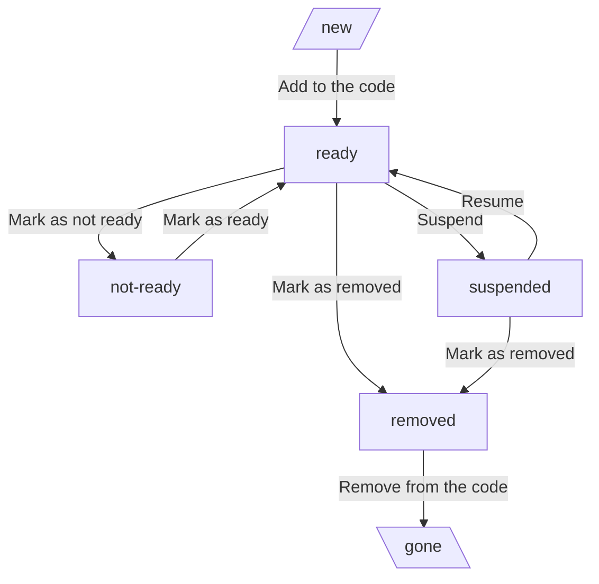

<!--
 Licensed to the Apache Software Foundation (ASF) under one
 or more contributor license agreements.  See the NOTICE file
 distributed with this work for additional information
 regarding copyright ownership.  The ASF licenses this file
 to you under the Apache License, Version 2.0 (the
 "License"); you may not use this file except in compliance
 with the License.  You may obtain a copy of the License at

   http://www.apache.org/licenses/LICENSE-2.0

 Unless required by applicable law or agreed to in writing,
 software distributed under the License is distributed on an
 "AS IS" BASIS, WITHOUT WARRANTIES OR CONDITIONS OF ANY
 KIND, either express or implied.  See the License for the
 specific language governing permissions and limitations
 under the License.
-->
<!-- START doctoc generated TOC please keep comment here to allow auto update -->
<!-- DON'T EDIT THIS SECTION, INSTEAD RE-RUN doctoc TO UPDATE -->
**Table of contents**

- [What the provider distributions are](#what-the-provider-distributions-are)
- [Provider distributions](#provider-distributions)
- [Perform review of security issues that are marked for the release](#perform-review-of-security-issues-that-are-marked-for-the-release)
- [Bump min Airflow version for providers](#bump-min-airflow-version-for-providers)
- [Decide when to release](#decide-when-to-release)
- [Provider distributions versioning](#provider-distributions-versioning)
- [Possible states of Provider distributions](#possible-states-of-provider-distributions)
- [Prepare Regular Provider distributions (RC)](#prepare-regular-provider-distributions-rc)
  - [Move provider into remove state](#move-provider-into-remove-state)
  - [Increasing version number](#increasing-version-number)
  - [Generate release notes](#generate-release-notes)
  - [(Optional) Apply template updates](#optional-apply-template-updates)
  - [Open PR with suggested version releases](#open-pr-with-suggested-version-releases)
  - [Build Provider distributions for SVN apache upload](#build-provider-distributions-for-svn-apache-upload)
  - [Build and sign the source and convenience packages](#build-and-sign-the-source-and-convenience-packages)
  - [Commit the source packages to Apache SVN repo](#commit-the-source-packages-to-apache-svn-repo)
  - [Publish the Regular distributions to PyPI (release candidates)](#publish-the-regular-distributions-to-pypi-release-candidates)
  - [Push the RC tags](#push-the-rc-tags)
  - [Prepare documentation in Staging](#prepare-documentation-in-staging)
  - [Prepare issue in GitHub to keep status of testing](#prepare-issue-in-github-to-keep-status-of-testing)
  - [Prepare voting email for Providers release candidate](#prepare-voting-email-for-providers-release-candidate)
  - [Verify the release candidate by PMC members](#verify-the-release-candidate-by-pmc-members)
  - [Licence check](#licence-check)
  - [Verify the release candidate by Contributors](#verify-the-release-candidate-by-contributors)
- [Publish release](#publish-release)
  - [Summarize the voting for the Apache Airflow release](#summarize-the-voting-for-the-apache-airflow-release)
  - [Publish release to SVN](#publish-release-to-svn)
  - [Publish the packages to PyPI](#publish-the-packages-to-pypi)
  - [Add tags in git](#add-tags-in-git)
  - [Publish documentation](#publish-documentation)
  - [Update providers metadata](#update-providers-metadata)
  - [Notify developers of release](#notify-developers-of-release)
  - [Send announcements about security issues fixed in the release](#send-announcements-about-security-issues-fixed-in-the-release)
  - [Announce about the release in social media](#announce-about-the-release-in-social-media)
  - [Add release data to Apache Committee Report Helper](#add-release-data-to-apache-committee-report-helper)
  - [Close the testing status issue](#close-the-testing-status-issue)
  - [Remove Provider distributions scheduled for removal](#remove-provider-distributions-scheduled-for-removal)
  - [Misc / Post Release Helpers](#misc--post-release-helpers)

<!-- END doctoc generated TOC please keep comment here to allow auto update -->

------------------------------------------------------------------------------------------------------------

# What the provider distributions are

The Provider distributions are separate packages (one package per provider) that implement
integrations with external services for Airflow in the form of installable Python packages.

The Release Manager prepares packages separately from the main Airflow Release, using
`breeze` commands and accompanying scripts. This document provides an overview of the command line tools
needed to prepare the packages.

NOTE!! When you have problems with any of those commands that run inside `breeze` docker image, you
can run the command with `--debug` flag that will drop you in the shell inside the image and will
print the command that you should run.

# Provider distributions

The prerequisites to release Apache Airflow are described in [README.md](README.md).

You can read more about the command line tools used to generate the packages in the
[Provider details](PROVIDER_DISTRIBUTIONS_DETAILS.md).

# Perform review of security issues that are marked for the release

We are keeping track of security issues in the [Security Issues](https://github.com/airflow-s/airflow-s/issues)
repository currently. As a release manager, you should have access to the repository.
Please review and ensure that all security issues marked for the release have been
addressed and resolved. Ping security team (comment in the issues) if anything missing or
the issue does not seem to be addressed.

Additionally, the [dependabot alerts](https://github.com/apache/airflow/security/dependabot) and
code [scanning alerts](https://github.com/apache/airflow/security/code-scanning) should be reviewed
and security team should be pinged to review and resolve them.


# Bump min Airflow version for providers

1. Update `PROVIDERS_COMPATIBILITY_TESTS_MATRIX` in `src/airflow_breeze/global_constants.py` to remove
the versions of Airflow that are not applicable anymore.

2. Check if Breeze unit tests in `dev/breeze/tests/test_packages.py` need adjustments. This is done by simply
searching and replacing old version occurrences with newer one. For example 2.8.0 to 2.9.0

3. Update minimum airflow version for all packages, you should modify `MIN_AIRFLOW_VERSION`
in `src/airflow_breeze/utils/packages.py` and run the `breeze release-management prepare-provider-documentation --only-min-version-update`
This will only update the min version in  the `__init__.py` files and package documentation without bumping the provider versions.

4. Remove `AIRFLOW_V_2_X_PLUS` in all tests (review and update skipif and other conditional
   behaviour and test_compat.py, where X is the TARGET version we change to. For example
   when we update min Airflow version to 2.10.0, we should remove all references to AIRFLOW_V_2_10_PLUS
   simply because "everything" in our tests is already 2.10.0+ and there is no need to exclude or
   modify tests for earlier versions of Airflow.

Note: Sometimes we are releasing a subset of providers and would not want to add the
list of these providers to every breeze command we run, specifically:
`prepare-provider-distributions`, `build-docs` , `publish-docs`, and, `add-back-references`. In this
case, we can instead export an environment variable: `DISTRIBUTIONS_LIST`, and it will work for every breeze
command involved in the release process. The value can also be passed as the `--distributions-list` argument.
Follow the steps below to set the environment variable:

```shell script
 export DISTRIBUTIONS_LIST="PACKAGE1 PACKAGE2"
```

```shell script
branch="update-min-airflow-version"
git checkout -b "${branch}"
breeze release-management prepare-provider-documentation --only-min-version-update
git add .
git commit -m "Bump minimum Airflow version in providers to Airflow 2.9.0"
git push --set-upstream origin "${branch}"
```

Note: that this command will only bump the min airflow versions for those providers that do not have it set to
a higher version. You do not have to skip specific providers - run it for all providers it will
handle everything automatically.

Note: this step is **not** part of the release cycle. It should be done independently
when the time to update min airflow version has come.

# Decide when to release

You can release Provider distributions separately from the main Airflow on an ad-hoc basis, whenever we find that
a given provider needs to be released - due to new features or due to bug fixes.
You can release each provider package separately, but due to voting and release overhead we try to group
releases of Provider distributions together.

# Provider distributions versioning

We are using the [SEMVER](https://semver.org/) versioning scheme for the Provider distributions. This is in order
to give the users confidence about maintaining backwards compatibility in the new releases of those
packages.

Details about maintaining the SEMVER version are going to be discussed and implemented in
[the related issue](https://github.com/apache/airflow/issues/11425)

# Possible states of Provider distributions

The Provider distributions can be in one of several states.

* The `not-ready` state is used when the provider has some in-progress changes (usually API changes) that
  we do not  want to release yet as part of the regular release cycle. Providers in this state are excluded
  from being  released as part of the regular release cycle (including documentation building). You can build
  and prepare  such provider when you explicitly specify it as argument of a release command or by passing
  `--include-not-ready-providers` flag in corresponding command. The `not-ready` providers are treated as
  regular providers when it comes to running tests and preparing and releasing packages in `CI` - as we want
  to make sure they are properly releasable any time and we want them to contribute to dependencies and we
  want to test them. Also in case of preinstalled providers, the `not-ready` providers are contributing
  their dependencies rather than the provider package to requirements of Airflow.
* The `ready` state is the usual state of the provider that is released in the regular release cycle
  (including the documentation, package building and publishing). This is the state most providers are in.
* The `suspended` state is used when we have a good reason to suspend such provider, following the devlist
  discussion and vote or "lazy consensus". The process of suspension is described in [Provider's docs](../PROVIDERS.rst).
  The `suspended` providers are excluded from being released as part of the regular release cycle (including
  documentation building) but also they do not contribute dependencies to the CI image and their tests are
  not run in CI process. You can build and prepare such provider when you explicitly specify it as argument
  of a release command or by passing `--include-suspended-providers` flag in corresponding command (but it
  might or might not work at any time as the provider release commands are not regularly run on CI for the
  suspended providers). The `suspended` providers are not released as part of the regular release cycle.
* The `removed` state is a temporary state after the provider has been voted (or agreed in "lazy consensus")
  to be removed and it is only used for exactly one release cycle - in order to produce the final version of
  the package - identical to the previous version with the exception of the removal notice. The process
  of removal is described in [Provider's docs](../PROVIDERS.rst).  The `removed` providers are included in
  the regular release cycle (including documentation building) because the `--include-removed-providers`
  flag is passed to commands that release manager runs (see below). The difference between `suspended`
  and `removed` providers is that additional information is added to their documentation about the provider
  not being maintained any more by the community.

This graph shows the possible transitions between the states:



# Prepare Regular Provider distributions (RC)

## Move provider into remove state

The removed state needs to be in a release wave before you actually plan to remove the source code for the provider.
Set provider with removed state -> release provider -> remove source code of the provider.
When setting the provider in removed state you need also to clarify in the change log that there will be
no more releases for this provider.

To set provider as removed do the following:

1. In provider yaml change state from to `ready` to `removed`
2. Place entry in changelog.txt that notify users about provider being removed.
3. Update test_get_removed_providers in `/dev/breeze/tests/test_packages.py` by adding the provider to the list

## Increasing version number

First thing that release manager has to do is to change version of the provider to a target
version. Each provider has a `provider.yaml` file that, among others, stores information
about provider versions. When you attempt to release a provider you should update that
information based on the changes for the provider, and its `CHANGELOG.rst` (or `changelog.rst` in the
new provider's structure). It might be that
`CHANGELOG.rst` already contains the right target version. This will be especially true if some
changes in the provider add new features (then minor version is increased) or when the changes
introduce backwards-incompatible, breaking change in the provider (then major version is
incremented). Committers, when approving and merging changes to the providers, should pay attention
that the `CHANGELOG.rst` is updated whenever anything other than bugfix is added.

If there are no new features or breaking changes, the release manager should simply increase the
patch-level version for the provider.

The new version should be first on the list.

## Generate release notes

Each of the Provider distributions contains Release notes in the form of the `CHANGELOG.rst` file that is
automatically generated from history of the changes and code of the provider.
They are stored in the documentation directory. The `README.md` file generated during package
preparation is not stored anywhere in the repository - it contains however link to the Changelog
generated.

When the provider package version has not been updated since the latest version, the release notes
are not generated. Release notes are only generated, when the latest version of the package does not
yet have a corresponding TAG.

The tags for providers is of the form ``providers-<PROVIDER_ID>/<VERSION>`` for example
``providers-amazon/1.0.0``. During releasing, the `rc*` tags are created (for example
``providers-amazon/1.0.0rc1``).

Details about maintaining the SEMVER version are going to be discussed and implemented in
[the related issue](https://github.com/apache/airflow/issues/11425)

```shell script
breeze release-management prepare-provider-documentation  --include-removed-providers
```

In case you prepare provider documentation for just a few selected providers, you can run:

```shell script
breeze release-management prepare-provider-documentation [packages]
```

In case you want to also release a pre-installed provider that is in ``not-ready`` state (i.e. when
you want to release it before you switch their state to ``ready``), you need to pass
``--include-not-ready-providers`` flag to the command above.

This command will not only prepare documentation but will also help the release manager to review
changes implemented in all providers, and determine which of the providers should be released. For each
provider details will be printed on what changes were implemented since the last release including
links to particular commits.

This should help to determine which version of provider should be released:

* increased patch-level for bugfix-only change
* increased minor version if new features are added
* increased major version if breaking changes are added

It also helps the release manager to update CHANGELOG.rst where high-level overview of the changes should be documented for the providers released.
You should iterate and re-generate the same content after any change as many times as you want.
The generated files should be added and committed to the repository.

When you want to regenerate the changes before the release and make sure all changelogs
are updated, run it in non-interactive mode:

```shell script
  breeze release-management prepare-provider-documentation --include-removed-providers --answer yes
```

In case you prepare provider documentation for just a few selected providers, you can run:

```shell script
breeze release-management prepare-provider-documentation --answer yes [packages]
```

In case you want to also release a pre-installed provider that is in ``not-ready`` state (i.e. when
you want to release it before you switch their state to ``ready``), you need to pass
``--include-not-ready-providers`` flag to the command above.

NOTE!! In case you prepare provider's documentation in a branch different than main, you need to manually
specify the base branch via `--base-branch` parameter.
For example if you try to build a `cncf.kubernetes` provider that is build from `provider-cncf-kubernetes/v4-4`
branch should be prepared like this:

```shell script
breeze release-management prepare-provider-documentation --include-removed-providers \
 --base-branch provider-cncf-kubernetes/v4-4 cncf.kubernetes
```

## (Optional) Apply template updates

This step should only be executed if we want to change template files for the providers - i.e. change
security information, commit/index/README content that is automatically generated.

Regenerate the documentation templates by running the command with
`--reapply-templates` flag to the command above. This refreshes the content of:

* `__init__.py` in provider's package
* Provider Commits
* Provider index for the documentation
* Provider README file used when publishing package in PyPI

```shell script
breeze release-management prepare-provider-documentation --include-removed-providers --reapply-templates-only
```

## Open PR with suggested version releases

At this point you should have providers yaml files and changelog updated.
You should go over the change log and place changes in their relevant section (breaking change, feature, bugs, etc...)
Once finished you should raise a PR : Prepare docs for MM YYYY wave of Providers
In the PR we will verify if we want to release a specific package or if the versions chosen are right.
Only after PR is merged you should proceed to next steps.


## Build Provider distributions for SVN apache upload

Those packages might get promoted  to "final" packages by just renaming the files, so internally they
should keep the final version number without the rc suffix, even if they are rc1/rc2/... candidates.

They also need to be signed and have checksum files. You can generate the checksum/signature files by running
the "dev/sign.sh" script (assuming you have the right PGP key set-up for signing). The script
generates corresponding .asc and .sha512 files for each file to sign.
note: sign script uses `libassuan` and `gnupg` if you don't have them installed run:

```shell script
brew install libassuan
brew install gnupg
```

## Build and sign the source and convenience packages

* Cleanup dist folder:

```shell script
export RELEASE_DATE=$(date "+%Y-%m-%d%n")
export AIRFLOW_REPO_ROOT=$(pwd -P)
rm -rf ${AIRFLOW_REPO_ROOT}/dist/*
```

* Release candidate packages:

Assume that your remote for apache repository is called `apache` you should now
set tags for the providers in the repo.


```shell script
echo "Tagging with providers/${RELEASE_DATE}"
git tag -s providers/${RELEASE_DATE} -m "Tag providers for ${RELEASE_DATE}" --force
git push apache providers/${RELEASE_DATE}
breeze release-management prepare-provider-distributions  --include-removed-providers --distribution-format both
breeze release-management prepare-tarball --tarball-type apache_airflow_providers --version "${RELEASE_DATE}"
```

The `prepare-*-distributions` commands should produce the reproducible `.whl`, `.tar.gz` packages in the dist folder.
The `prepare-tarball` command should produce reproducible `-source.tar.gz` tarball of sources.

if you only build few packages, run:

```shell script
echo "Tagging with providers/${RELEASE_DATE}"
git tag -s providers/${RELEASE_DATE} -m "Tag providers for ${RELEASE_DATE}" --force
git push apache providers/${RELEASE_DATE}
breeze release-management prepare-provider-distributions --include-removed-providers --distribution-format both PACKAGE PACKAGE ....
breeze release-management prepare-tarball --tarball-type apache_airflow_providers --version "${RELEASE_DATE}"

```

In case you want to also release a pre-installed provider that is in ``not-ready`` state (i.e. when
you want to release it before you switch their state to ``ready``), you need to pass
``--include-not-ready-providers`` flag to the command above.

* Sign all your packages

```shell script
pushd dist
../dev/sign.sh *
popd
```

If you see ``Library not loaded error`` it means that you are missing `libassuan` and `gnupg`.
check above steps to install them.

## Commit the source packages to Apache SVN repo

* Push the artifacts to ASF dev dist repo

```shell script
# First clone the repo if you do not have it
cd ..
[ -d asf-dist ] || svn checkout --depth=immediates https://dist.apache.org/repos/dist asf-dist
svn update --set-depth=infinity asf-dist/dev/airflow

# Create a new folder for the release.
cd asf-dist/dev/airflow/providers

# Remove previously released providers
svn rm *

# Move the artifacts to svn folder
mv ${AIRFLOW_REPO_ROOT}/dist/* .

# Add and commit
svn add *
svn commit -m "Add artifacts for Airflow Providers ${RELEASE_DATE}"

cd ${AIRFLOW_REPO_ROOT}
```

Verify that the files are available at
[providers](https://dist.apache.org/repos/dist/dev/airflow/providers/)

You should see only providers that you are about to release.
If you are seeing others there is an issue.
You can remove the redundant provider files manually with:

```shell script
svn rm file_name  // repeat that for every file
svn commit -m "delete old providers"
```

## Publish the Regular distributions to PyPI (release candidates)

In order to publish release candidate to PyPI you just need to build and release packages.
The packages should however contain the rcN suffix in the version file name but not internally in the package,
so you need to use `--version-suffix` switch to prepare those packages.
Note that these are different packages than the ones used for SVN upload
though they should be generated from the same sources.

* Generate the packages with the rc1 version (specify the version suffix with PyPI switch). Note that
you should clean up dist folder before generating the packages, so you will only have the right packages there.

```shell script
rm -rf ${AIRFLOW_REPO_ROOT}/dist/*

breeze release-management prepare-provider-distributions  --include-removed-providers \
 --version-suffix rc1 --distribution-format both
```

If you only build few packages, run:

```shell script
breeze release-management prepare-provider-distributions \
--version-suffix rc1 --distribution-format both PACKAGE PACKAGE ....
```

Alternatively, if you have set the environment variable: `DISTRIBUTIONS_LIST` above, just run the command:

```shell script
breeze release-management prepare-provider-distributions
```

Or using `--distributions-list` argument:

```shell script
breeze release-management prepare-provider-distributions --distributions-list "PACKAGE1 PACKAGE2"
```

In case some packages already had rc1 suffix prepared and released, and they still need to be released, they
will have automatically appropriate rcN suffix added to them. The suffix will be increased for each release
candidate and checked if tag has been already created for that release candidate. If yes, the suffix will be
increased until the tag is not found.

* Verify the artifacts that would be uploaded:

```shell script
twine check ${AIRFLOW_REPO_ROOT}/dist/*
```

* Upload the package to PyPi:

```shell script
twine upload -r pypi ${AIRFLOW_REPO_ROOT}/dist/*
```

* Confirm that the packages are available under the links printed and look good.

## Push the RC tags

Earlier, we pushed the date tag, now that the RC(s) are ready we can push the tags for them.

```shell script
breeze release-management tag-providers
```

## Prepare documentation in Staging

Documentation is an essential part of the product and should be made available to users.
In our cases, documentation for the released versions is published in the staging S3 bucket, and the site is
kept in a separate repository - [`apache/airflow-site`](https://github.com/apache/airflow-site),
but the documentation source code and build tools are available in the `apache/airflow` repository, so
you need to run several workflows to publish the documentation. More details about it can be found in
[Docs README](../docs/README.md) showing the architecture and workflows including manual workflows for
emergency cases.

We have two options publishing the documentation 1. Using breeze commands 2. Manually using GitHub Actions.:

### Using breeze commands

You can use the `breeze` command to publish the documentation.
The command does the following:

1. Triggers [Publish Docs to S3](https://github.com/apache/airflow/actions/workflows/publish-docs-to-s3.yml).
2. Triggers workflow in apache/airflow-site to refresh
3. Triggers S3 to GitHub Sync

```shell script
  breeze workflow-run publish-docs --ref <tag> --site-env <staging/live/auto> all-providers
```

Or if you just want to publish a few selected providers, you can run:

```shell script
  breeze workflow-run publish-docs --ref <tag> --site-env <staging/live/auto> PACKAGE1 PACKAGE2 ..
```

The `--ref` parameter should be the tag of the release candidate you are publishing.

The `--site-env` parameter should be set to `staging` for pre-release versions or `live` for final releases. the default option is `auto`
if the tag is rc it publishes to `staging` bucket, otherwise it publishes to `live` bucket.

One of the interesting features of publishing this way is that you can also rebuild historical version of
the documentation with patches applied to the documentation (if they can be applied cleanly).

Yoy should specify the `--apply-commits` parameter with the list of commits you want to apply
separated by commas and the workflow will apply those commits to the documentation before
building it (don't forget to add --skip-write-to-stable-folder if you are publishing
previous version of the distribution). Example:

```shell script
breeze workflow-run publish-docs --ref providers-apache-hive/9.0.0 --site-env live \
  --apply-commits 4ae273cbedec66c87dc40218c7a94863390a380d --skip-write-to-stable-folder \
  apache.hive
```

Other available parameters can be found with:

```shell
breeze workflow-run publish-docs --help
```

### Manually using GitHub Actions

There are two steps to publish the documentation:

1. Publish the documentation to the staging S3 bucket.

The release manager publishes the documentation using GitHub Actions workflow
[Publish Docs to S3](https://github.com/apache/airflow/actions/workflows/publish-docs-to-s3.yml).

You should specify the final tag to use to build the docs and list of providers to publish
(separated by spaces) or ``all-providers`` in case you want to publish all providers
(optionally you can exclude some of those providers). You should use `staging` bucket to publish the release
candidate documentation.

After that step, the provider documentation should be available under the http://airflow.staged.apache.org URL
(also present in the PyPI packages) but stable links and drop-down boxes should not be yet updated.

2. Invalidate Fastly cache, update version drop-down and stable links with the new versions of the documentation.

Before doing it - review the state of removed, suspended, new packages in
[the docs index](https://github.com/apache/airflow-site/blob/master/landing-pages/site/content/en/docs/_index.md):
Make sure to use `staging` branch to run the workflow.

There are few special considerations when the list of provider is updated.

- If you publish a new package, you must add it to the list of packages in the index.
- If there are changes to suspension or removal status of a package, you must move it appropriate section.

- In case you need to make any changes - create the commit and push changes and merge it to `staging` branch.
  in [airflow-site](https://github.com/apache/airflow-site) repository.

```shell script
cd "${AIRFLOW_SITE_DIRECTORY}"
branch="add-documentation-${RELEASE_DATE}"
git checkout -b "${branch}"
git add .
git commit -m "Add documentation for packages - ${RELEASE_DATE}"
git push --set-upstream origin "${branch}"
```

Merging the PR with the index changes to `staging` will trigger site publishing.

If you do not need to merge a PR, you should manually run the
[Build docs](https://github.com/apache/airflow-site/actions/workflows/build.yml)
workflow in `airflow-site` repository to refresh indexes and drop-downs.

After that build from PR or workflow completes, the new version should be available in the drop-down
list and stable links should be updated, also Fastly cache will be invalidated.

## Prepare issue in GitHub to keep status of testing

Create a GitHub issue with the content generated via manual execution of the command below. You will use
link to that issue in the next step.

```shell script
cd "${AIRFLOW_REPO_ROOT}"

breeze release-management generate-issue-content-providers --only-available-in-dist
```

GitHub API uses rate limiting that is based on the public IP address of client if you do not authenticate
with GitHub, so when you retrieve bigger number of PRs or when you are behind NAT and share your public
IP address with many other Anonymous GitHub API users, issue retrieval will be halted and your API calls
might slow down to a crawl, you will need then a GITHUB_TOKEN set as your
environment variable or pass  the token as `--github-token` option in the script.

```shell script
cd "${AIRFLOW_REPO_ROOT}"

breeze release-management generate-issue-content-providers --only-available-in-dist --github-token TOKEN
```

or

```shell script
cd "${AIRFLOW_REPO_ROOT}"
export GITHUB_TOKEN=TOKEN
breeze release-management generate-issue-content-providers --only-available-in-dist
```

You can generate the token by following
[this link](https://github.com/settings/tokens/new?description=Read%20issues&scopes=repo:status). Since it is easy to generate such token, by following the link, it is recommended to
generate a new token for each release and delete it once you've generated the issue.

If you see in the output that some of the PRs are just "noise" (i.e. there is no need to verify them
as they are misc/documentation kind of changes that have no impact on the actual installation of
the provider or the code of the provider, can optionally pass list of PR to be excluded from
the issue with `--excluded-pr-list`. This might limit the scope of verification. Some providers
might disappear from the list and list of authors that will be pinged in the generated issue.

You can repeat that and regenerate the issue content until you are happy with the generated issue.

```shell script
cd "${AIRFLOW_REPO_ROOT}"

breeze release-management generate-issue-content-providers --only-available-in-dist --github-token TOKEN \
    --excluded-pr-list PR_NUMBER1,PR_NUMBER2
```

It's also OK to manually modify the content of such generated issue before actually creating the
issue. There is a comment generated with NOTE TO RELEASE MANAGER about this in the issue content.
Hit Preview button on "create issue" screen before creating it to verify how it will look like
for the contributors.

By default, the command will output a clickable link to create the issue from terminal if you don't want this option use --no-include-browser-link flag

```shell script
cd "${AIRFLOW_REPO_ROOT}"

breeze release-management generate-issue-content-providers --only-available-in-dist --no-include-browser-link --github-token TOKEN \
    --excluded-pr-list PR_NUMBER1,PR_NUMBER2
```


## Prepare voting email for Providers release candidate

Make sure the packages are in https://dist.apache.org/repos/dist/dev/airflow/providers/

Send out a vote to the dev@airflow.apache.org mailing list. Here you can prepare text of the
email.

```shell script
export VOTE_DURATION_IN_HOURS=72
export IS_SHORTEN_VOTE=$([ $VOTE_DURATION_IN_HOURS -ge 72 ] && echo "false" || echo "true")
export SHORTEN_VOTE_TEXT="This is a shortened ($VOTE_DURATION_IN_HOURS hours vote) as agreed by policy set it https://lists.apache.org/thread/cv194w1fqqykrhswhmm54zy9gnnv6kgm"
export VOTE_END_TIME=$(LANG=en_US.UTF-8 TZ=UTC date -v+"${VOTE_DURATION_IN_HOURS}"H "+%B %d, %Y %H:%M %p")
export RELEASE_MANAGER_NAME="Elad Kalif"
export GITHUB_ISSUE_LINK="LINK_TO_GITHUB_ISSUE"
```

subject:

```shell script
cat <<EOF
$([ $VOTE_DURATION_IN_HOURS -ge 72 ] && echo "[VOTE]" || echo "[ACCELERATED VOTE]") Airflow Providers, release preparation date ${RELEASE_DATE}")
EOF
```

```shell script
cat <<EOF
Hey all,

I have just cut the new wave Airflow Providers packages with release preparation date ${RELEASE_DATE}. This email is calling a vote on the release,
which will last for $VOTE_DURATION_IN_HOURS hours - which means that it will end on $VOTE_END_TIME UTC and until 3 binding +1 votes have been received.
$([ "$IS_SHORTEN_VOTE" = "true" ] && echo "${SHORTEN_VOTE_TEXT}" || echo "")

Consider this my (binding) +1.

<ADD ANY HIGH-LEVEL DESCRIPTION OF THE CHANGES HERE!>

Airflow Providers are available at:
https://dist.apache.org/repos/dist/dev/airflow/providers/

*apache-airflow-providers-YYYY-MM-DD-source.tar.gz* is the full source tarball of airflow repo - snapshot taken at the moment of provider's release.

*apache-airflow-providers-<PROVIDER>-*.tar.gz* are the convenience python "sdist" distributions that we publish in PyPI

*apache_airflow_providers_<PROVIDER>-*.whl are the convenience Python "wheel" distributions that we publish in PyPI.

The test procedure for PMC members is described in
https://github.com/apache/airflow/blob/main/dev/README_RELEASE_PROVIDERS.md#verify-the-release-candidate-by-pmc-members

The test procedure for and Contributors who would like to test this RC is described in:
https://github.com/apache/airflow/blob/main/dev/README_RELEASE_PROVIDERS.md#verify-the-release-candidate-by-contributors


Public keys are available at:
https://dist.apache.org/repos/dist/release/airflow/KEYS

Please vote accordingly:

[ ] +1 approve
[ ] +0 no opinion
[ ] -1 disapprove with the reason

Only votes from PMC members are binding, but members of the community are
encouraged to test the release and vote with "(non-binding)".

Please note that the version number excludes the 'rcX' string.
This will allow us to rename the artifact without modifying
the artifact checksums when we actually release.

The status of testing the providers by the community is kept here:
$GITHUB_ISSUE_LINK

The issue is also the easiest way to see important PRs included in the RC candidates.
Detailed changelog for the providers will be published in the documentation after the
RC candidates are released.

You can find the RC packages in PyPI following these links:

<PASTE TWINE UPLOAD LINKS HERE. SORT THEM BEFORE!>

Cheers,
$RELEASE_MANAGER_NAME

EOF
```

Due to the nature of packages, not all packages have to be released as convenience
packages in the final release. During the voting process
the voting PMC members might decide to exclude certain packages from the release if some critical
problems have been found in some packages.

Please modify the message above accordingly to clearly exclude those packages.

Note, For RC2/3 you may refer to shorten vote period as agreed in mailing list [thread](https://lists.apache.org/thread/cv194w1fqqykrhswhmm54zy9gnnv6kgm).

## Verify the release candidate by PMC members

Set expected release tag (the same as announced in the vote email):

```shell script
export RELEASE_DATE=2025-11-03
````

### SVN check

The files should be present in
[Airflow dist](https://dist.apache.org/repos/dist/dev/airflow/providers/)

The following files should be present (6 files):

* .tar.gz + .asc + .sha512 (one set of files per provider)
* -py3-none-any.whl + .asc + .sha512 (one set of files per provider)

As a PMC member, you should be able to clone the SVN repository:

```shell script
cd ..
[ -d asf-dist ] || svn checkout --depth=immediates https://dist.apache.org/repos/dist asf-dist
svn update --set-depth=infinity asf-dist/dev/airflow
```

Or update it if you already checked it out:

```shell script
cd asf-dist/dev/airflow
svn update .
```

Set environment variables: PATH_TO_AIRFLOW_SVN to the root of folder where you have providers and RELEASE_DATE to
the release date you are verifying.

``` shell
cd asf-dist/dev/airflow
export PATH_TO_AIRFLOW_SVN=$(pwd -P)
```

Optionally you can use the `breeze release-management check-release-files` command
to verify that all expected files are present in SVN. This command will produce a `Dockerfile.pmc` which
may help with verifying installation of the packages.

Once you have cloned/updated the SVN repository, copy the PyPi URLs shared
in the email to a file called `packages.txt` in the $AIRFLOW_REPO_ROOT/dev
directory.

```shell script
cd ${AIRFLOW_REPO_ROOT}/dev
# Copy packages.txt extracted from the mail sent by the release manager here
breeze release-management check-release-files providers --release-date ${RELEASE_DATE}
```

After the above command completes you can build `Dockerfile.pmc` to trigger an installation of each provider
package and verify the correct versions are installed:

```shell script
docker build -f Dockerfile.pmc --tag local/airflow .
docker run --rm --entrypoint "airflow" local/airflow info
docker image rm local/airflow
```

### Reproducible package builds checks

For Provider distributions we introduced a reproducible build mechanism - which means that whoever wants
to use sources of Airflow from the release tag, can reproducibly build the same "wheel" and "sdist"
packages as the release manager and they will be byte-by-byte identical, which makes them easy to
verify - if they came from the same sources. This build is only done using released dependencies
from PyPI and source code in our repository - no other binary dependencies are used during the build
process and if the packages produced are byte-by-byte identical with the one we create from tagged sources
it means that the build has a verified provenance.

How to verify it:

1) Change directory where your airflow sources are checked out

```shell
cd "${AIRFLOW_REPO_ROOT}"
```

2) Check out the ``providers/YYYY-MM-DD`` tag:

```shell
git fetch apache --tags
git checkout providers/2025-10-31
```

3) Remove all the packages you have in dist folder

```shell
rm -rf dist/*
```

4) Build the packages using checked out sources

```shell
breeze release-management prepare-provider-distributions --include-removed-providers --distribution-format both
```

5) Switch to the folder where you checked out the SVN dev files

```shell
cd ${PATH_TO_AIRFLOW_SVN}
cd providers/${RELEASE_DATE}
```

6) Compare the packages in SVN to the ones you just built

```shell
for i in *.tar.gz *.whl
do
   echo -n "$i:"; diff $i ${AIRFLOW_REPO_ROOT}/dist/$i && echo "No diff found"
done
```

You should see output similar to:

```
apache_airflow_providers_amazon-8.12.0.tar.gz:No diff found
apache_airflow_providers_apache_impala-1.2.1.tar.gz:No diff found
apache_airflow_providers_atlassian_jira-2.3.0.tar.gz:No diff found
apache_airflow_providers_cncf_kubernetes-7.10.0.tar.gz:No diff found
apache_airflow_providers_common_io-1.1.0.tar.gz:No diff found
apache_airflow_providers_common_sql-1.8.1.tar.gz:No diff found
apache_airflow_providers_databricks-5.0.1.tar.gz:No diff found
apache_airflow_providers_dbt_cloud-3.4.1.tar.gz:No diff found
apache_airflow_providers_docker-3.8.2.tar.gz:No diff found
apache_airflow_providers_elasticsearch-5.2.0.tar.gz:No diff found
apache_airflow_providers_google-10.12.0.tar.gz:No diff found
apache_airflow_providers_microsoft_azure-8.3.0.tar.gz:No diff found
apache_airflow_providers_odbc-4.2.0.tar.gz:No diff found
apache_airflow_providers_openai-1.0.1.tar.gz:No diff found
apache_airflow_providers_opsgenie-5.3.0.tar.gz:No diff found
apache_airflow_providers_papermill-3.5.0.tar.gz:No diff found
apache_airflow_providers_redis-3.4.1.tar.gz:No diff found
apache_airflow_providers_snowflake-5.1.2.tar.gz:No diff found
apache_airflow_providers_trino-5.4.1.tar.gz:No diff found
apache_airflow_providers_amazon-8.12.0-py3-none-any.whl:No diff found
apache_airflow_providers_apache_impala-1.2.1-py3-none-any.whl:No diff found
apache_airflow_providers_atlassian_jira-2.3.0-py3-none-any.whl:No diff found
apache_airflow_providers_cncf_kubernetes-7.10.0-py3-none-any.whl:No diff found
apache_airflow_providers_common_io-1.1.0-py3-none-any.whl:No diff found
apache_airflow_providers_common_sql-1.8.1-py3-none-any.whl:No diff found
apache_airflow_providers_databricks-5.0.1-py3-none-any.whl:No diff found
apache_airflow_providers_dbt_cloud-3.4.1-py3-none-any.whl:No diff found
apache_airflow_providers_docker-3.8.2-py3-none-any.whl:No diff found
apache_airflow_providers_elasticsearch-5.2.0-py3-none-any.whl:No diff found
apache_airflow_providers_google-10.12.0-py3-none-any.whl:No diff found
apache_airflow_providers_microsoft_azure-8.3.0-py3-none-any.whl:No diff found
apache_airflow_providers_odbc-4.2.0-py3-none-any.whl:No diff found
apache_airflow_providers_openai-1.0.1-py3-none-any.whl:No diff found
apache_airflow_providers_opsgenie-5.3.0-py3-none-any.whl:No diff found
apache_airflow_providers_papermill-3.5.0-py3-none-any.whl:No diff found
apache_airflow_providers_redis-3.4.1-py3-none-any.whl:No diff found
apache_airflow_providers_snowflake-5.1.2-py3-none-any.whl:No diff found
apache_airflow_providers_trino-5.4.1-py3-none-any.whl:No diff found
```

## Licence check

This can be done with the Apache RAT tool.

Download the latest jar from https://creadur.apache.org/rat/download_rat.cgi (unpack the binary, the jar is inside)

You can run this command to do it for you:

```shell script
wget -qO- https://dlcdn.apache.org//creadur/apache-rat-0.17/apache-rat-0.17-bin.tar.gz | gunzip | tar -C /tmp -xvf -
```

Unpack the release source archive (the `<package + version>-source.tar.gz` file) to a folder

```shell script
rm -rf /tmp/apache/airflow-providers-src && mkdir -p /tmp/apache-airflow-providers-src && tar -xzf ${PATH_TO_AIRFLOW_SVN}/providers/${RELEASE_DATE}/apache_airflow_providers-*-source.tar.gz --strip-components 1 -C /tmp/apache-airflow-providers-src
```

Run the check:

```shell script
java -jar /tmp/apache-rat-0.17/apache-rat-0.17.jar --input-exclude-file /tmp/apache-airflow-src/.rat-excludes /tmp/apache-airflow-src/ | grep -E "! |INFO: "
```

You should see no files reported as Unknown or with wrong licence and summary of the check similar to:

```
INFO: Apache Creadur RAT 0.17 (Apache Software Foundation)
INFO: Excluding patterns: .git-blame-ignore-revs, .github/*, .git ...
INFO: Excluding MISC collection.
INFO: Excluding HIDDEN_DIR collection.
SLF4J(W): No SLF4J providers were found.
SLF4J(W): Defaulting to no-operation (NOP) logger implementation
SLF4J(W): See https://www.slf4j.org/codes.html#noProviders for further details.
INFO: RAT summary:
INFO:   Approved:  15615
INFO:   Archives:  2
INFO:   Binaries:  813
INFO:   Document types:  5
INFO:   Ignored:  2392
INFO:   License categories:  2
INFO:   License names:  2
INFO:   Notices:  216
INFO:   Standards:  15609
INFO:   Unapproved:  0
INFO:   Unknown:  0
```

There should be no files reported as Unknown or Unapproved. The files that are unknown or unapproved should be shown with a line starting with `!`.

For example:

```
! Unapproved:         1    A count of unapproved licenses.
! /CODE_OF_CONDUCT.md
```

### Signature check

Make sure you have imported into your GPG the PGP key of the person signing the release. You can find the valid keys in
[KEYS](https://dist.apache.org/repos/dist/release/airflow/KEYS).

Download the KEYS file from the above link and save it locally.

You can import the whole KEYS file into gpg by running the following command:

```shell script
gpg --import KEYS
```

You can also import the keys individually from a keyserver. The below one uses Kaxil's key and
retrieves it from the default GPG keyserver
[OpenPGP.org](https://keys.openpgp.org):

```shell script
gpg --keyserver keys.openpgp.org --receive-keys CDE15C6E4D3A8EC4ECF4BA4B6674E08AD7DE406F
```

You should choose to import the key when asked.

Note that by being default, the OpenPGP server tends to be overloaded often and might respond with
errors or timeouts. Many of the release managers also uploaded their keys to the
[GNUPG.net](https://keys.gnupg.net) keyserver, and you can retrieve it from there.

```shell script
gpg --keyserver keys.gnupg.net --receive-keys CDE15C6E4D3A8EC4ECF4BA4B6674E08AD7DE406F
```

Once you have the keys, the signatures can be verified by running this:

```shell
cd ${PATH_TO_AIRFLOW_SVN}
cd providers/${RELEASE_DATE}
```

```shell script
for i in *.asc
do
   echo -e "Checking $i\n"; gpg --verify $i
done
```

This should produce results similar to the below. The "Good signature from ..." is indication
that the signatures are correct. Do not worry about the "not certified with a trusted signature"
warning. Most of the certificates used by release managers are self-signed, and that's why you get this
warning. By importing the key either from the server in the previous step or from the
[KEYS](https://dist.apache.org/repos/dist/release/airflow/KEYS) page, you know that
this is a valid key already.  To suppress the warning you may edit the key's trust level
by running `gpg --edit-key <key id> trust` and entering `5` to assign trust level `ultimate`.

```
Checking apache_airflow_providers-2025-11-03-source.tar.gz.asc

gpg: assuming signed data in 'apache_airflow_providers-2025-11-03-source.tar.gz'
gpg: Signature made Mon 03 Nov 2025 09:30:25 CET
gpg:                using EDDSA key 0B63993D3B84EE3E2EBB984B2A454DAA1E6A437B
gpg:                issuer "eladkal@apache.org"
gpg: Good signature from "Elad Kalif <eladkal@apache.org>" [unknown]
gpg: WARNING: The key's User ID is not certified with a trusted signature!
gpg:          There is no indication that the signature belongs to the owner.
Primary key fingerprint: 0B63 993D 3B84 EE3E 2EBB  984B 2A45 4DAA 1E6A 437B
Checking apache_airflow_providers_edge3-1.4.1-py3-none-any.whl.asc

gpg: assuming signed data in 'apache_airflow_providers_edge3-1.4.1-py3-none-any.whl'
gpg: Signature made Mon 03 Nov 2025 09:30:24 CET
gpg:                using EDDSA key 0B63993D3B84EE3E2EBB984B2A454DAA1E6A437B
gpg:                issuer "eladkal@apache.org"
gpg: Good signature from "Elad Kalif <eladkal@apache.org>" [unknown]
gpg: WARNING: The key's User ID is not certified with a trusted signature!
gpg:          There is no indication that the signature belongs to the owner.
Primary key fingerprint: 0B63 993D 3B84 EE3E 2EBB  984B 2A45 4DAA 1E6A 437B
Checking apache_airflow_providers_edge3-1.4.1.tar.gz.asc

gpg: assuming signed data in 'apache_airflow_providers_edge3-1.4.1.tar.gz'
gpg: Signature made Mon 03 Nov 2025 09:30:24 CET
gpg:                using EDDSA key 0B63993D3B84EE3E2EBB984B2A454DAA1E6A437B
gpg:                issuer "eladkal@apache.org"
gpg: Good signature from "Elad Kalif <eladkal@apache.org>" [unknown]
gpg: WARNING: The key's User ID is not certified with a trusted signature!
gpg:          There is no indication that the signature belongs to the owner.
Primary key fingerprint: 0B63 993D 3B84 EE3E 2EBB  984B 2A45 4DAA 1E6A 437B
⌁0% [jarek:~/code/asf-dist/dev/airflow/providers] dist ‡ for i in *.sha512

```

### SHA512 check

Run this:

```shell script
for i in *.sha512
do
    echo "Checking $i"; shasum -a 512 `basename $i .sha512 ` | diff - $i
done
```

You should get output similar to:

```
Checking apache_airflow_providers-2025-11-03-source.tar.gz.sha512
Checking apache_airflow_providers_edge3-1.4.1-py3-none-any.whl.sha512
Checking apache_airflow_providers_edge3-1.4.1.tar.gz.sha512
...
```

## Verify the release candidate by Contributors

This can be done (and we encourage to) by any of the Contributors. In fact, it's best if the
actual users of Apache Airflow test it in their own staging/test installations. Each release candidate
is available on PyPI apart from SVN packages, so everyone should be able to install
the release candidate version.

Breeze allows you to easily install and run pre-release candidates by following simple instructions
described in
[Manually testing release candidate packages](https://github.com/apache/airflow/blob/main/contributing-docs/testing/testing_packages.rst)

But you can use any of the installation methods you prefer (you can even install it via the binary wheels
downloaded from the SVN).

### Installing in your local virtualenv

You have to make sure you have Airflow 3* installed in your PIP virtualenv
(the version you want to install providers with).

```shell
pip install apache-airflow-providers-<provider>==<VERSION>rc<X>
```

### Installing with Breeze

```shell
breeze start-airflow --use-airflow-version 3.1.3 --python 3.10 --backend postgres \
    --load-example-dags --load-default-connections
```

After you are in Breeze:

```shell
pip install apache-airflow-providers-<provider>==<VERSION>rc<X>
```

NOTE! You should `Ctrl-C` and restart the connections to restart airflow components and make sure new
Provider distributions is used.

### Building your own docker image

If you prefer to build your own image, you can also use the official image and PyPI packages to test
Provider distributions. This is especially helpful when you want to test integrations, but you need to install
additional tools. Below is an example Dockerfile, which installs providers for Google. Please note, these
version numbers are arbitrary. You'll need to substitute the proper version numbers when running this
yourself.

```dockerfile
FROM apache/airflow:3.1.3
RUN pip install  --user apache-airflow-providers-google==18.1.0.rc1

USER ${AIRFLOW_UID}
```

To build an image build and run a shell, run:

```shell script
docker build . --tag my-image:0.0.1
docker run  -ti \
    --rm \
    -v "$PWD/data:/opt/airflow/" \
    -v "$PWD/keys/:/keys/" \
    -p 8080:8080 \
    -e AIRFLOW__CORE__LOAD_EXAMPLES=True \
    my-image:0.0.1 bash
```

### Additional Verification

Once you install and run Airflow, you can perform any verification you see as necessary to check
that the Airflow works as you expected.


# Publish release

```
export RELEASE_DATE=2025-11-03
export RELEASE_MANAGER_NAME="Elad Kalif"
echo "prepare release date is ${RELEASE_DATE}"
```

## Summarize the voting for the Apache Airflow release

Once the vote has been passed, you will need to send a result vote to dev@airflow.apache.org:

In both subject and message update DATE OF RELEASE, FIRST/LAST NAMES and numbers). In case
some providers were  excluded, explain why they were excluded and what is the plan for them
(otherwise remove the optional part of the message). There are two options for releasing
the next RC candidates:

* They will be released as an ad-hoc release with accelerated vote
  period on their own (when there are not many changes to other providers in the meantime and when
  we have a small bugfix for the providers that we want to release quickly.

* They will be included together with the next wave of releases (our tooling
  supports automated calculation of RC version for candidates for the next wave of releases that
  already had earlier RCs.

Email subject:

```
cat <<EOF
[RESULT][VOTE] Airflow Providers - release preparation date ${RELEASE_DATE}
EOF
```

Email content:

```
cat <<EOF
Hello,

Apache Airflow Providers prepared on ${RELEASE_DATE} have been accepted.

3 "+1" binding votes received:
- FIRST LAST NAME (binding)
- FIRST LAST NAME (binding)
- FIRST LAST NAME (binding)

2 "+1" non-binding votes received:
- FIRST LAST NAME
- FIRST LAST NAME

[optional] The providers PROVIDER, PROVIDER have been excluded from the release.
This is due to REASON HERE.
The next RC candidates for those providers will be released [in the next wave
of providers] or [as an ad-hoc release on their own with accelerated vote period].

Vote thread: https://lists.apache.org/thread/cs6mcvpn2lk9w2p4oz43t20z3fg5nl7l

I'll continue with the release process, and the release announcement will follow shortly.

Cheers,
${RELEASE_MANAGER_NAME}
EOF
```

## Publish release to SVN

The best way of doing this is to svn cp  between the two repos (this avoids having to upload the binaries
again, and gives a clearer history in the svn commit logs.

We also need to archive older releases before copying the new ones
[Release policy](http://www.apache.org/legal/release-policy.html#when-to-archive)

```bash
cd "<ROOT_OF_YOUR_AIRFLOW_REPO>"
# Set AIRFLOW_REPO_ROOT to the path of your git repo
export AIRFLOW_REPO_ROOT="$(pwd -P)"

# Go the folder where you have checked out the release repo from SVN
# Make sure this is direct directory and a symbolic link
# Otherwise 'svn mv' errors out if it is with "E200033: Another process is blocking the working copy database
cd "<ROOT_WHERE_YOUR_ASF_DIST_IS_CREATED>"

export ASF_DIST_PARENT="$(pwd -P)"
# make sure physical path is used, in case original directory is symbolically linked
cd "${ASF_DIST_PARENT}"

# or clone it if it's not done yet
[ -d asf-dist ] || svn checkout --depth=immediates https://dist.apache.org/repos/dist asf-dist
# Update to latest version
svn update --set-depth=infinity asf-dist/dev/airflow asf-dist/release/airflow

SOURCE_DIR="${ASF_DIST_PARENT}/asf-dist/dev/airflow/providers"

# If some packages have been excluded, remove them now
# Check the packages are there (replace <provider> with the name of the provider that you remove)
ls ${SOURCE_DIR}/*<provider>*
# Remove them
svn rm ${SOURCE_DIR}/*<provider>*

# Create providers folder if it does not exist
# All latest releases are kept in this one folder without version sub-folder
cd "${ASF_DIST_PARENT}/asf-dist/release/airflow"
mkdir -pv providers
cd providers

# Copy your providers with the target name to dist directory and to SVN
rm -rf "${AIRFLOW_REPO_ROOT}"/dist/*

for file in "${SOURCE_DIR}"/*
do
 base_file=$(basename ${file})
 cp -v "${file}" "${AIRFLOW_REPO_ROOT}/dist/${base_file//rc[0-9]/}"
 svn mv "${file}" "${base_file//rc[0-9]/}"
done

# Check which old packages will be removed using dry run
breeze release-management clean-old-provider-artifacts --directory $(pwd -P) --dry-run

# Remove those packages
breeze release-management clean-old-provider-artifacts --directory $(pwd -P)

# You need to do go to the asf-dist directory in order to commit both dev and release together
cd ${ASF_DIST_PARENT}/asf-dist
# Commit to SVN
svn commit -m "Release Airflow Providers on $(date "+%Y-%m-%d%n")"
```

Verify that the packages appear in
[providers](https://dist.apache.org/repos/dist/release/airflow/providers)

You are expected to see all latest versions of providers.
The ones you are about to release (with new version) and the ones that are not part of the current release.

Troubleshoot:
In case that while viewing the packages in dist/release you see that a provider has files from current version and release version it probably means that you wanted to exclude the new version of provider from release but didn't remove all providers files as expected in previous step.
Since you already commit to SVN you need to recover files from previous version with svn copy (svn merge will not work since you don't have copy of the file locally)
for example:

```
svn copy https://dist.apache.org/repos/dist/release/airflow/providers/apache_airflow_providers_docker-3.4.0-py3-none-any.whl@59404
https://dist.apache.org/repos/dist/release/airflow/providers/apache_airflow_providers_docker-3.4.0-py3-none-any.whl
```

Where `59404` is the revision we want to copy the file from. Then you can commit again.
You can also add  `-m "undeleted file"` to the `svn copy` to commit in 1 step.

Then remove from svn the files of the new provider version that you wanted to exclude from release.
If you had this issue you will need also to make adjustments in the next step to remove the provider from listed in twine check.
This is simply by removing the relevant files locally.


## Publish the packages to PyPI

By that time the packages should be in your dist folder.

```shell script
cd ${AIRFLOW_REPO_ROOT}
git checkout providers/YYYY-MM-DD
```

example `git checkout providers/2025-10-31`

Note you probably will see message `You are in 'detached HEAD' state.`
This is expected, the RC tag is most likely behind the main branch.

* Verify the artifacts that would be uploaded:

```shell script
twine check ${AIRFLOW_REPO_ROOT}/dist/*.whl ${AIRFLOW_REPO_ROOT}/dist/*.tar.gz
```

* Upload the package to PyPi:

```shell script
twine upload -r pypi ${AIRFLOW_REPO_ROOT}/dist/*.whl ${AIRFLOW_REPO_ROOT}/dist/*.tar.gz
```

* Verify that the packages are available under the links printed.

Copy links to updated packages, sort it alphabetically and save it on the side. You will need it for the announcement message.

* Again, confirm that the packages are available under the links printed.


## Add tags in git

Assume that your remote for apache repository is called `apache` you should now
set tags for the providers in the repo.

Sometimes in cases when there is a connectivity issue to GitHub, it might be possible that local tags get created
and lead to annoying errors. The default behaviour would be to clean such local tags up.

If you want to disable this behaviour, set the env **CLEAN_LOCAL_TAGS** to false.

```shell script
breeze release-management tag-providers
```

The command should output all the tags it created. At the end it should also print the general tag
applied for this provider's release wave - with current date in the format of:

```
providers/YYYY-MM-DD
```

## Publish documentation

Documentation is an essential part of the product and should be made available to users.
In our cases, documentation for the released versions is published in the `live` S3 bucket, and the site is
kept in a separate repository - [`apache/airflow-site`](https://github.com/apache/airflow-site),
but the documentation source code and build tools are available in the `apache/airflow` repository, so
you need to run several workflows to publish the documentation. More details about it can be found in
[Docs README](../docs/README.md) showing the architecture and workflows including manual workflows for
emergency cases.

We have two options publishing the documentation 1. Using breeze commands 2. Manually using GitHub Actions.:

### Using breeze commands

You can use the `breeze` command to publish the documentation.
The command does the following:

1. Triggers [Publish Docs to S3](https://github.com/apache/airflow/actions/workflows/publish-docs-to-s3.yml).
2. Triggers workflow in apache/airflow-site to refresh
3. Triggers S3 to GitHub Sync

```shell script
  unset GITHUB_TOKEN
  breeze workflow-run publish-docs --ref <tag> --site-env <staging/live/auto> all-providers
```

Or if you just want to publish a few selected providers, you can run:

```shell script
  unset GITHUB_TOKEN
  breeze workflow-run publish-docs --ref <tag> --site-env <staging/live/auto> PACKAGE1 PACKAGE2 ..
```


The `--ref` parameter should be the tag of the final candidate you are publishing.

The `--site-env` parameter should be set to `staging` for pre-release versions or `live` for final releases. the default option is `auto`
if the tag is rc it publishes to `staging` bucket, otherwise it publishes to `live` bucket.

Other available parameters can be found with:

```shell
breeze workflow-run publish-docs --help
```

### Manually using GitHub Actions

There are two steps to publish the documentation:

1. Publish the documentation to the live S3 bucket.

The release manager publishes the documentation using GitHub Actions workflow
[Publish Docs to S3](https://github.com/apache/airflow/actions/workflows/publish-docs-to-s3.yml).

You should specify the final tag to use to build the docs and list of providers to publish
(separated by spaces) or ``all-providers`` in case you want to publish all providers
(optionally you can exclude some of those providers).

The release manager publishes the documentation using GitHub Actions workflow
[Publish Docs to S3](https://github.com/apache/airflow/actions/workflows/publish-docs-to-s3.yml).
By default `auto` selection should publish to the `live` bucket - based on
the tag you use - pre-release tags go to staging. But you can also override it and specify the destination
manually to be `live` or `staging`.

After that step, the provider documentation should be available under the http://airflow.apache.org URL
(also present in the PyPI packages) but stable links and drop-down boxes should not be yet updated.

2. Invalidate Fastly cache, update version drop-down and stable links with the new versions of the documentation.

Before doing it - review the state of removed, suspended, new packages in
[the docs index](https://github.com/apache/airflow-site/blob/master/landing-pages/site/content/en/docs/_index.md):
Make sure to use `main` branch to run the workflow.

There are few special considerations when the list of provider is updated.

- If you publish a new package, you must add it to the list of packages in the index.
- If there are changes to suspension or removal status of a package, you must move it appropriate section.
- In case you need to make any changes - create the commit and push changes and merge it to `main` branch.
  in [airflow-site](https://github.com/apache/airflow-site) repository.

```shell script
cd airflow-site
export AIRFLOW_SITE_DIRECTORY="$(pwd -P)"
cd "${AIRFLOW_SITE_DIRECTORY}"
branch="add-documentation-$(date "+%Y-%m-%d%n")"
git checkout -b "${branch}"
git add .
git commit -m "Add documentation for packages - $(date "+%Y-%m-%d%n")"
git push --set-upstream origin "${branch}"
```

Merging the PR with the index changes to `main` will trigger site publishing.

If you do not need to merge a PR, you should manually run the
[Build docs](https://github.com/apache/airflow-site/actions/workflows/build.yml)
workflow in `airflow-site` repository to refresh indexes and drop-downs.

After that build from PR or workflow completes, the new version should be available in the drop-down
list and stable links should be updated, also Fastly cache will be invalidated.

## Update providers metadata

```shell script
cd ${AIRFLOW_REPO_ROOT}
git checkout main
git pull apache main
current_date=$(date '+%Y-%m-%d%n')
branch="update-providers-metadata-${current_date}"
git checkout -b "${branch}"
breeze release-management generate-providers-metadata --refresh-constraints-and-airflow-releases
git add -p .
git commit -m "Update providers metadata ${current_date}"
git push --set-upstream origin "${branch}"
```

Create PR and get it merged

## Notify developers of release

Notify users@airflow.apache.org (cc'ing dev@airflow.apache.org) that
the artifacts have been published.

Subject:

```
cat <<EOF
[ANNOUNCE] Apache Airflow Providers prepared on ${RELEASE_DATE} are released
EOF
```

Body:

```
cat <<EOF
Dear Airflow community,

I'm happy to announce that new versions of Airflow Providers packages prepared on ${RELEASE_DATE} were just released.
Full list of PyPI packages released is added at the end of the message.

The source release, as well as the binary releases, are available here:

https://airflow.apache.org/docs/apache-airflow-providers/installing-from-sources

You can install the providers via PyPI: https://airflow.apache.org/docs/apache-airflow-providers/installing-from-pypi

The documentation is available at https://airflow.apache.org/docs/ and linked from the PyPI packages.

----

Full list of released PyPI packages:

TODO: Paste the list of packages here that you put on the side. Sort them alphabetically.

Cheers,
${RELEASE_MANAGER_NAME}
EOF
```

Send the same email to announce@apache.org, except change the opening line to `Dear community,`.
It is more reliable to send it via the web ui at https://lists.apache.org/list.html?announce@apache.org
(press "c" to compose a new thread)

Note If you choose sending it with your email client make sure the email is set to plain text mode.
Trying to send HTML content will result in failure.

## Send announcements about security issues fixed in the release

The release manager should review and mark as READY all the security issues fixed in the release.
Such issues are marked as affecting `< <JUST_RELEASED_VERSION>` in the CVE management tool
at https://cveprocess.apache.org/. Then the release manager should announced the issues via the tool.

Once announced, each of the issue should be linked with a 'reference' with tag 'vendor advisory' with the
URL to the announcement published automatically by the CVE management tool.
Note that the announce@apache.org is moderated, and the link to the email thread will not be published
immediately, that's why it is recommended to add the link to users@airflow.apache.org which takes usually
few seconds to be published after the CVE tool sends them.

The ASF Security will be notified and will submit to the CVE project and will set the state to 'PUBLIC'.

## Announce about the release in social media

NOTE!


As a rule we announce only new providers that were added.
If you believe there is a reason to announce in social media for another case consult with PMC
members about it.

Example for special cases:

* an exciting new capability that the community waited for and should have big impact.
* big number of providers released at once.
* bumping min airflow version (which is a special case of the above)

------------------------------------------------------------------------------------------------------------
Announcement is done from official Apache-Airflow accounts.

* X: https://x.com/ApacheAirflow
* LinkedIn: https://www.linkedin.com/company/apache-airflow/
* Fosstodon: https://fosstodon.org/@airflow
* Bluesky: https://bsky.app/profile/apache-airflow.bsky.social

Make sure attach the release image generated with Figma to the post.
If you don't have access to the account ask a PMC member to post.

------------------------------------------------------------------------------------------------------------

## Add release data to Apache Committee Report Helper

Add the release data (version and date) at: https://reporter.apache.org/addrelease.html?airflow

## Close the testing status issue

Don't forget to thank the folks who tested and close the issue tracking the testing status.

```
Thank you everyone. Providers are released.

I invite everyone to help improve providers for the next release, a list of open issues can be found [here](https://github.com/apache/airflow/issues?q=is%3Aopen+is%3Aissue+label%3Aarea%3Aproviders).
```

## Remove Provider distributions scheduled for removal

If there are Provider distributions scheduler for removal, create PR and merge it to remove them.

The following places should be checked:

* `airflow/providers/PROVIDER`
* `tests/providers/PROVIDER`
* `tests/system/providers/PROVIDER`
* `tests/integration/providers/PROVIDER`
* `docs/apache-airflow-providers-PROVIDER`
* `docs/integration-logos/PROVIDER`
* `.github/boring-cyborg.yml`
* `airflow/contrib/hooks/__init__.py`
* `airflow/contrib/operators/__init__.py`
* `airflow/utils/db.py` (for default connections)
* `dev/breeze/tests/test_packages.py` (remove the providers from `removed` lists)
* `generated/provider_metadata.json`

Run `breeze setup regenerate-command-images --force`

Update test_get_removed_providers in `/dev/breeze/tests/test_packages.py` by removing the provider from the list


## Misc / Post Release Helpers

In case you need to rebuild docs with addition of a commit that is not part of the original release use


```shell script
  breeze workflow-run publish-docs --ref <tag> --site-env <staging/live/auto> PACKAGE1 \
  --apply-commits <commit_hash> --skip-write-to-stable-folder \
  PACKAGE1
```

Example:

```shell script
breeze workflow-run publish-docs --ref providers-apache-hive/9.0.0 --site-env live \
  --apply-commits 4ae273cbedec66c87dc40218c7a94863390a380d --skip-write-to-stable-folder \
  apache.hive
```
