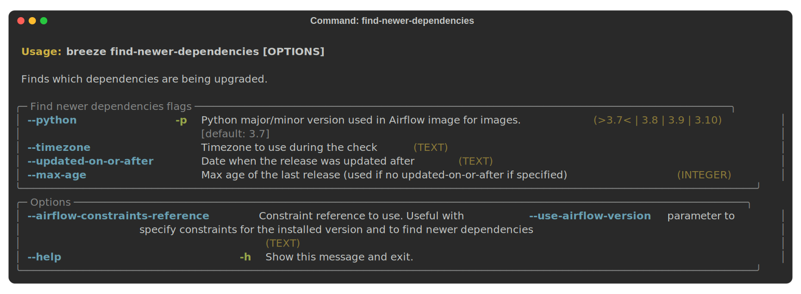

<!--
 Licensed to the Apache Software Foundation (ASF) under one
 or more contributor license agreements.  See the NOTICE file
 distributed with this work for additional information
 regarding copyright ownership.  The ASF licenses this file
 to you under the Apache License, Version 2.0 (the
 "License"); you may not use this file except in compliance
 with the License.  You may obtain a copy of the License at

   http://www.apache.org/licenses/LICENSE-2.0

 Unless required by applicable law or agreed to in writing,
 software distributed under the License is distributed on an
 "AS IS" BASIS, WITHOUT WARRANTIES OR CONDITIONS OF ANY
 KIND, either express or implied.  See the License for the
 specific language governing permissions and limitations
 under the License.
-->

<!-- START doctoc generated TOC please keep comment here to allow auto update -->
<!-- DON'T EDIT THIS SECTION, INSTEAD RE-RUN doctoc TO UPDATE -->
**Table of Contents**  *generated with [DocToc](https://github.com/thlorenz/doctoc)*

- [Backtracking issues context](#backtracking-issues-context)
- [What can we do about it?](#what-can-we-do-about-it)
- [How to detect it](#how-to-detect-it)
- [How to track the root cause](#how-to-track-the-root-cause)
- [Finding candidates manually](#finding-candidates-manually)

<!-- END doctoc generated TOC please keep comment here to allow auto update -->

# Backtracking issues context

The `pip` tool we are using in Airflow has a long standing problem with backtracking kicking in sometimes
randomly. This is something we have very little control over, because the moment when backtracking kicks in
depends on how many versions of conflicting packages are released in `PyPI` and can change completely without
any change to Airflow. We have `constraint` mechanism to protect our users installing Released versions
and developers making "regular" PRs, however in `main` builds and in PRs that change setup.py, this
backtracking might lead to extremely long (many hours) image builds and eventually cancelling the
image build jobs in CI.

An example of such issue is described [here](https://github.com/pypa/pip/issues/10924).

Unfortunately the problem is that in such cases, it is not possible to figure out what caused the
problem from `pip` output (state as of `pip` 22.1.2).

There are a number of issues in `pip` that describe the issue, and some backtracking reasons have been already
tracked down and fixed by `pip` maintainers, but this is a difficult problem to solve and it is likely it
is going to be with us for a while. Some other opened issues:

Some issues here

* https://github.com/pypa/pip/issues/10884
* https://github.com/pypa/pip/issues/10235
* https://github.com/pypa/pip/issues/10417
* https://github.com/pypa/pip/issues/9254
* https://github.com/pypa/pip/issues/10788

Also, the PR that might help in a relatively short time is here:

* https://github.com/pypa/pip/pull/10258

# What can we do about it?

Until `pip` gets an improved way of avoiding or detecting and showing the root cause of the conflict there
is unfortunately only a trial-and-error method. We need to track down which dependencies have been changed
recently and try to pinpoint the root cause of the backtracking. This is not easy because sometimes
the root cause of the problem is not at all obvious and relies on some hidden limitations and design choices
of the `pip` backtracking algorithm, which produce a non-obvious problems.

The [issue](https://github.com/pypa/pip/issues/10924) is a good example of that.

# How to detect it

Whenever such situation occurs, The `build image` workflow of ours from the `main` repository will start to
get cancelled on timeout.

https://github.com/apache/airflow/actions/workflows/build-images.yml?query=event%3Apush+branch%3Amain

You might see various errors:

```
#32 3883.7 INFO: pip is looking at multiple versions of NNNN to determine which version is compatible with other requirements. This could take a while.
Error: The operation was canceled.
```

Or you might see errors about various pip installation problems:

```
#32 664.1 Collecting Flask-OpenID<2,>=1.2.5
  #32 664.2   Downloading Flask-OpenID-1.2.5.tar.gz (43 kB)
  #32 664.2      ━━━━━━━━━━━━━━━━━━━━━━━━━━━━━━━━━━━━━━━ 43.4/43.4 KB 181.6 MB/s eta 0:00:00
  #32 664.2   Preparing metadata (setup.py): started
  #32 664.3   Preparing metadata (setup.py): finished with status 'error'
  #32 664.3   error: subprocess-exited-with-error
  #32 664.3
  #32 664.3   × python setup.py egg_info did not run successfully.
  #32 664.3   │ exit code: 1
  #32 664.3   ╰─> [1 lines of output]
  #32 664.3       error in Flask-OpenID setup command: use_2to3 is invalid.
  #32 664.3       [end of output]
```

But important thing is that suddenly the `main` build images stop working without any action from our side.

# How to track the root cause

Whenever a conditions occurs which leads to cancelling CI image build, there are steps run in CI.
"Candidates for pip resolver backtrack triggers". Those steps will list the packages that have been
updated since the last successful `main` build in the last day.

You need to find the first such failing job from the
[list](https://github.com/apache/airflow/actions/workflows/build-images.yml?query=event%3Apush+branch%3Amain).

And you should find the list of packages with information which versions and when were updated. You will
also find a command that you can use for tracking the package, similar to:

```shell
pip install ".[devel_all]" --upgrade --upgrade-strategy eager \
        "dill<0.3.3" "certifi<2021.0.0" "google-ads<14.0.1"' "package1==N.N.N" "package2==N.N.N" ...
```

Example:


The candidate packages are the ones with `==`. The command attempts to install the suspicious packages in
the version that was correctly installed before and is stored in the current constraints.

The process of tracking down which package is the "root cause" looks as follows:

1. Checkout the latest main of Airflow
2. Build the latest image (with constraints): `breeze ci-image build --python 3.7`
3. Enter breeze `breeze`
4. Attempt to run the `pip install` command that was printed in the "Candidates ..." step
5. The command should succeed (the candidates are pinned to the "working" version)
6. Attempt to run `pip install ".[devel_all]" --upgrade --upgrade-strategy eager "dill<0.3.3" "certifi<2021.0.0" "google-ads<14.0.1"`
7. This one should cause backtracking
8. Use the original command from "Candidates ..." job the candidates and remove the candidates one-by-one
   from the command and re-run until you get into backtracking
9. Even if you enter into backtracking with one candidate - do not stop - bring it back and remove other
   candidates one-by-one to make sure that the candidate you found is the "REAL" cause. There should usually
   be only one candidate left and removing this one candidate from the list should cause backtracking.

Example:

This is the original candidate list from https://github.com/pypa/pip/issues/10924. The list was long because
when we tracked this one we did not have the "first failing" build and our list of candidates got a bit long
after 3 days of failing build.

```shell
pip install ".[devel_all]" --upgrade --upgrade-strategy eager "dill<0.3.3" "certifi<2021.0.0" "google-ads<14.0.1" \
   "APScheduler==3.6.3" "boto3==1.21.4" "botocore==1.24.4" "connexion==2.11.2" "github3.py==3.0.0" \
   "google-api-python-client==1.12.10" "google-auth-oauthlib==0.4.6" "google-cloud-automl==2.6.0" \
   "google-cloud-dataproc==3.2.0" "google-cloud-os-login==2.5.1" \
   "google-cloud-redis==2.5.1"  "google-cloud-translate==1.7.0"
```

This command works correctly without backtracking. Then run the "bare" upgrade command:

```shell
pip install ".[devel_all]" --upgrade --upgrade-strategy eager "dill<0.3.3" "certifi<2021.0.0" "google-ads<14.0.1"
```

This one should enter into backtracking.

After removing all the candidates one-by-one, what is left is:

```shell
pip install ".[devel_all]" --upgrade --upgrade-strategy eager "dill<0.3.3" "certifi<2021.0.0" "google-ads<14.0.1" \
    "github3.py==3.0.0"
```

This command also succeeds.

However removing "github3.py==3.0.0" triggers backtracking.

Now we know what triggers backtracking. You can download and unpack the guilty package from PyPI -
in this case [github3.py files](https://pypi.org/project/github3.py/#files).
By inspecting setup.py and setup.cfg and comparing it with `pipdeptree | less` output, you should figure out
what causes the conflict. In this case `github3.py` had `PyJWT>=2.3.0` and from our `pipdeptree`
`PyJWT<2.0` was the limitation of Flask App Builder. In this case the limitation of `pip` algorithm caused
that it was not able to determine that `github3.py==3.0.0` is a good candidate. In this case it was misleading
because when github3.py did not have a 3.1.2 release, and 3.1.0 and 3.1.1 had the same PyJWT limitation, `pip`
was able to find the right resolution without backtracking.

# Finding candidates manually

You can also find the candidates manually. This is especially when you are not sure when the build broke,
and you need to extend the time or when you need to run it for another branch.
You need to install the breeze:

* `pipx install -e ./dev/breeze` if you use pipx install.

Then you can run ``breeze ci find-newer-dependencies`` with optional flags.
For example if you know that the build  was likely broken on a given date and time
(in your timezone) and you want to check python 3.8 (because this is the only
failing build) you can run:

```
breeze ci find-newer-dependencies --updated-on-or-after '2022-02-22 10:30:00' --timezone 'CET' --python 3.8
```

The full list of options for `find-newer-dependencies` can be seen here


