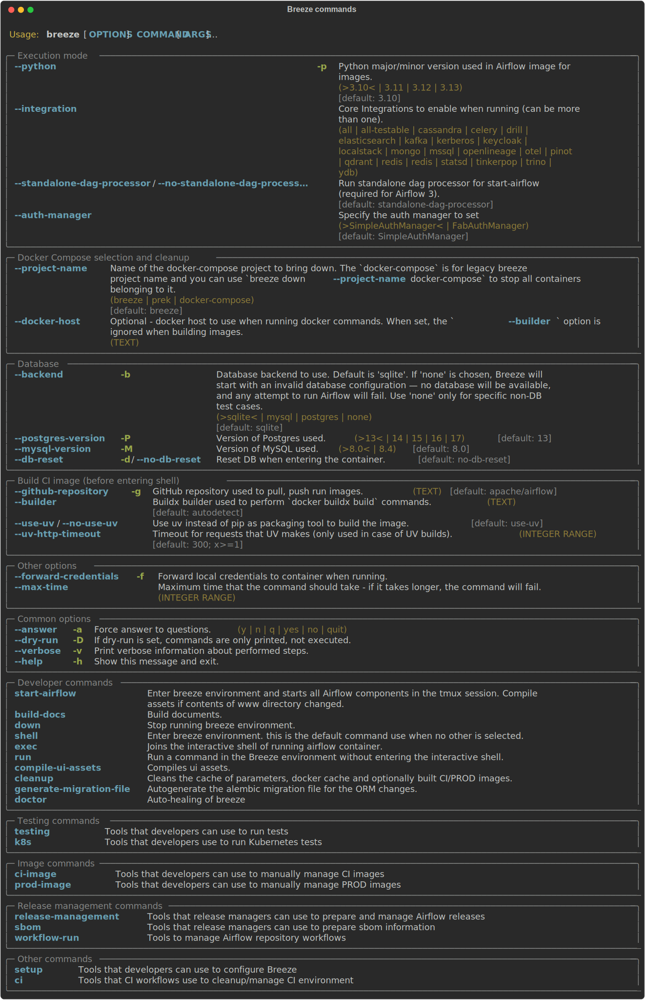
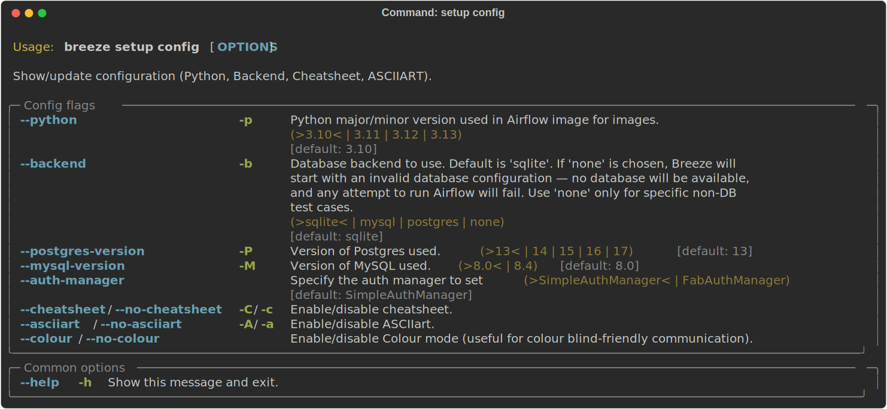

 .. Licensed to the Apache Software Foundation (ASF) under one
    or more contributor license agreements.  See the NOTICE file
    distributed with this work for additional information
    regarding copyright ownership.  The ASF licenses this file
    to you under the Apache License, Version 2.0 (the
    "License"); you may not use this file except in compliance
    with the License.  You may obtain a copy of the License at

 ..   http://www.apache.org/licenses/LICENSE-2.0

 .. Unless required by applicable law or agreed to in writing,
    software distributed under the License is distributed on an
    "AS IS" BASIS, WITHOUT WARRANTIES OR CONDITIONS OF ANY
    KIND, either express or implied.  See the License for the
    specific language governing permissions and limitations
    under the License.

Installation
============

This document describes prerequisites for running Breeze and installation process.

**The outline for this document in GitHub is available at top-right corner button (with 3-dots and 3 lines).**

Docker Desktop
--------------

- **Version**: Install the latest stable `Docker Desktop <https://docs.docker.com/get-docker/>`_
  and make sure it is in your PATH. ``Breeze`` detects if you are using version that is too
  old and warns you to upgrade.
- **Permissions**: Configure to run the ``docker`` commands directly and not only via root user.
  Your user should be in the ``docker`` group.
  See `Docker installation guide <https://docs.docker.com/install/>`_ for details.
- **Disk space**: On macOS, increase your available disk space before starting to work with
  the environment. At least 20 GB of free disk space is recommended. You can also get by with a
  smaller space but make sure to clean up the Docker disk space periodically.
  See also `Docker for Mac - Space <https://docs.docker.com/docker-for-mac/space>`_ for details
  on increasing disk space available for Docker on Mac.
- **Docker problems**: Sometimes it is not obvious that space is an issue when you run into
  a problem with Docker. If you see a weird behaviour, try ``breeze cleanup`` command.
  Also see `pruning <https://docs.docker.com/config/pruning/>`_ instructions from Docker.
- **Docker context**: Recent versions of Docker Desktop are by default configured to use ``desktop-linux``
  docker context that uses docker socket created in user home directory. Older versions (and plain docker)
  uses ``/var/run/docker.sock`` socket and ``default`` context. Breeze will attempt to detect if you have
  ``desktop-linux`` context configured and will use it if it is available, but you can force the
  context by adding ``--builder`` flag to the commands that build image or run the container and forward
  the socket to inside the image.

Here is an example configuration with more than 200GB disk space for Docker:

.. raw:: html

    

        
    

- **Docker is not running** - even if it is running with Docker Desktop. This is an issue
  specific to Docker Desktop 4.13.0 (released in late October 2022). Please upgrade Docker
  Desktop to 4.13.1 or later to resolve the issue. For technical details, see also
  `docker/for-mac#6529 <https://github.com/docker/for-mac/issues/6529>`_.

**Docker errors that may come while running breeze**

- If docker not running in python virtual environment
- **Solution**
- 1. Create the docker group if it does not exist
- ``sudo groupadd docker``
- 2. Add your user to the docker group.
- ``sudo usermod -aG docker $USER``
- 3. Log in to the new docker group
- ``newgrp docker``
- 4. Check if docker can be run without root
- ``docker run hello-world``
- 5. In some cases you might make sure that "Allow the default Docker socket to
  be used" in "Advanced" tab of "Docker Desktop" settings is checked

.. raw:: html

   

        
    

Note: If you use Colima, please follow instructions at:
`Contributors Quick Start Guide <../../../contributing-docs/03_contributors_quick_start.rst>`__

Docker Compose
--------------

- **Version**: Install the latest stable `Docker Compose <https://docs.docker.com/compose/install/>`_
  and add it to the PATH. ``Breeze`` detects if you are using version that is too old and warns you to upgrade.
- **Permissions**: Configure permission to be able to run the ``docker-compose`` command by your user.

Docker in WSL 2
---------------

- **WSL 2 installation** :
    Install WSL 2 and a Linux Distro (e.g. Ubuntu) see
    `WSL 2 Installation Guide <https://docs.microsoft.com/en-us/windows/wsl/install-win10>`_ for details.

- **Docker Desktop installation** :
    Install Docker Desktop for Windows. For Windows Home follow the
    `Docker Windows Home Installation Guide <https://docs.docker.com/docker-for-windows/install-windows-home>`_.
    For Windows Pro, Enterprise, or Education follow the
    `Docker Windows Installation Guide <https://docs.docker.com/docker-for-windows/install/>`_.

- **Docker setting** :
    WSL integration needs to be enabled

.. raw:: html

    

        
    

- **WSL 2 Filesystem Performance** :
    Accessing the host Windows filesystem incurs a performance penalty,
    it is therefore recommended to do development on the Linux filesystem.
    E.g. Run ``cd ~`` and create a development folder in your Linux distro home
    and git pull the Airflow repo there.

- **WSL 2 Docker mount errors**:
    Another reason to use Linux filesystem, is that sometimes - depending on the length of
    your path, you might get strange errors when you try start ``Breeze``, such as
    ``caused: mount through procfd: not a directory: unknown:``. Therefore checking out
    Airflow in Windows-mounted Filesystem is strongly discouraged.

- **WSL 2 Docker volume remount errors**:
    If you're experiencing errors such as ``ERROR: for docker-compose_airflow_run
    Cannot create container for service airflow: not a directory`` when starting Breeze
    after the first time or an error like ``docker: Error response from daemon: not a directory.
    See 'docker run --help'.`` when running the pre-commit tests, you may need to consider
    `installing Docker directly in WSL 2 <https://dev.to/bowmanjd/install-docker-on-windows-wsl-without-docker-desktop-34m9>`_
    instead of using Docker Desktop for Windows.

- **WSL 2 Memory Usage** :
    WSL 2 can consume a lot of memory under the process name "Vmmem". To reclaim the memory after
    development you can:

    * On the Linux distro clear cached memory: ``sudo sysctl -w vm.drop_caches=3``
    * If no longer using Docker you can quit Docker Desktop
      (right click system try icon and select "Quit Docker Desktop")
    * If no longer using WSL you can shut it down on the Windows Host
      with the following command: ``wsl --shutdown``

- **Developing in WSL 2**:
    You can use all the standard Linux command line utilities to develop on WSL 2.
    Further VS Code supports developing in Windows but remotely executing in WSL.
    If VS Code is installed on the Windows host system then in the WSL Linux Distro
    you can run ``code .`` in the root directory of you Airflow repo to launch VS Code.

The pipx tool
--------------

We are using ``pipx`` tool to install and manage Breeze. The ``pipx`` tool is created by the creators
of ``pip`` from `Python Packaging Authority <https://www.pypa.io/en/latest/>`_

Note that ``pipx`` >= 1.4.1 is used.

Install pipx

.. code-block:: bash

    pip install --user "pipx>=1.4.1"

Breeze, is not globally accessible until your PATH is updated. Add <USER FOLDER>\.local\bin as a variable
environments. This can be done automatically by the following command (follow instructions printed).

.. code-block:: bash

    pipx ensurepath

In Mac

.. code-block:: bash

    python -m pipx ensurepath

Resources required
==================

Memory
------

Minimum 4GB RAM for Docker Engine is required to run the full Breeze environment.

On macOS, 2GB of RAM are available for your Docker containers by default, but more memory is recommended
(4GB should be comfortable). For details see
`Docker for Mac - Advanced tab <https://docs.docker.com/v17.12/docker-for-mac/#advanced-tab>`_.

On Windows WSL 2 expect the Linux Distro and Docker containers to use 7 - 8 GB of RAM.

Disk
----

Minimum 40GB free disk space is required for your Docker Containers.

On Mac OS This might deteriorate over time so you might need to increase it or run ``breeze cleanup``
periodically. For details see
`Docker for Mac - Advanced tab <https://docs.docker.com/v17.12/docker-for-mac/#advanced-tab>`_.

On WSL2 you might want to increase your Virtual Hard Disk by following:
`Expanding the size of your WSL 2 Virtual Hard Disk <https://docs.microsoft.com/en-us/windows/wsl/compare-versions#expanding-the-size-of-your-wsl-2-virtual-hard-disk>`_

There is a command ``breeze ci resource-check`` that you can run to check available resources. See below
for details.

Cleaning the environment
------------------------

You may need to clean up your Docker environment occasionally. The images are quite big
(1.5GB for both images needed for static code analysis and CI tests) and, if you often rebuild/update
them, you may end up with some unused image data.

To clean up the Docker environment:

1. Stop Breeze with ``breeze down``. (If Breeze is already running)

2. Run the ``breeze cleanup`` command.

3. Run ``docker images --all`` and ``docker ps --all`` to verify that your Docker is clean.

   Both commands should return an empty list of images and containers respectively.

If you run into disk space errors, consider pruning your Docker images with the ``docker system prune --all``
command. You may need to restart the Docker Engine before running this command.

In case of disk space errors on macOS, increase the disk space available for Docker. See
`Prerequisites <#prerequisites>`_ for details.

Installation
============
First you will need to clone the Airflow repository, and make sure you are not in the home directory, or it may cause some trouble.

.. code-block:: bash

    git clone https://github.com/apache/airflow.git

Then set your working directory to root of (this) cloned repository.

.. code-block:: bash

    cd  airflow

Run this command to install Breeze (make sure to use ``-e`` flag):

.. code-block:: bash

    pipx install -e ./dev/breeze

.. warning::

  If you see below warning - it means that you hit `known issue <https://github.com/pypa/pipx/issues/1092>`_
  with ``packaging`` version 23.2:
  ⚠️ Ignoring --editable install option. pipx disallows it for anything but a local path,
  to avoid having to create a new src/ directory.

  The workaround is to downgrade packaging to 23.1 and re-running the ``pipx install`` command.

  .. code-block:: bash

     pip install "packaging<23.2"
     pipx install -e ./dev/breeze --force

.. note:: Note for Windows users

    The ``./dev/breeze`` in command about is a PATH to sub-folder where breeze source packages are.
    If you are on Windows, you should use Windows way to point to the ``dev/breeze`` sub-folder
    of Airflow either as absolute or relative path. For example:

    .. code-block:: bash

        pipx install -e dev\breeze

Once this is complete, you should have ``breeze`` binary on your PATH and available to run by ``breeze``
command.

Those are all available commands for Breeze and details about the commands are described below:

Breeze installed this way is linked to your checked out sources of Airflow, so Breeze will
automatically use latest version of sources from ``./dev/breeze``. Sometimes, when dependencies are
updated ``breeze`` commands with offer you to run self-upgrade.

You can always run such self-upgrade at any time:

.. code-block:: bash

    breeze setup self-upgrade

If you have several checked out Airflow sources, Breeze will warn you if you are using it from a different
source tree and will offer you to re-install from those sources - to make sure that you are using the right
version.

You can skip Breeze's upgrade check by setting ``SKIP_BREEZE_UPGRADE_CHECK`` variable to non empty value.

By default Breeze works on the version of Airflow that you run it in - in case you are outside of the
sources of Airflow and you installed Breeze from a directory - Breeze will be run on Airflow sources from
where it was installed.

You can run ``breeze setup version`` command to see where breeze installed from and what are the current sources
that Breeze works on

.. warning:: Upgrading from earlier Python version

    If you used Breeze with Python 3.7 and when running it, it will complain that it needs Python 3.8. In this
    case you should force-reinstall Breeze with ``pipx``:

        .. code-block:: bash

            pipx install --force -e ./dev/breeze

    .. note:: Note for Windows users

        The ``./dev/breeze`` in command about is a PATH to sub-folder where breeze source packages are.
        If you are on Windows, you should use Windows way to point to the ``dev/breeze`` sub-folder
        of Airflow either as absolute or relative path. For example:

        .. code-block:: bash

            pipx install --force -e dev\breeze

    .. note:: creating pipx virtual env ``apache-airflow-breeze`` with a specific python version

        In ``pipx install -e ./dev/breeze`` or ``pipx install  -e dev\breeze``, ``pipx`` uses default
        system python version to create virtual env for breeze.
        We can use a specific version by providing python executable in ``--python``  argument. For example:

        If you have breeze installed already with another Python version you can reinstall breeze with reinstall
        command

        .. code-block:: bash

            pipx reinstall --python /Users/airflow/.pyenv/versions/3.8.16/bin/python apache-airflow-breeze

        Or you can uninstall breeze and install it with a specific python version:

        .. code-block:: bash

            pipx uninstall apache-airflow-breeze
            pipx install -e ./dev/breeze --python /Users/airflow/.pyenv/versions/3.8.16/bin/python

Running Breeze for the first time
---------------------------------

The First time you run Breeze, it pulls and builds a local version of Docker images.
It pulls the latest Airflow CI images from the
`GitHub Container Registry <https://github.com/orgs/apache/packages?repo_name=airflow>`_
and uses them to build your local Docker images. Note that the first run (per python) might take up to 10
minutes on a fast connection to start. Subsequent runs should be much faster.

Once you enter the environment, you are dropped into bash shell of the Airflow container and you can
run tests immediately.

To use the full potential of breeze you should set up autocomplete. The ``breeze`` command comes
with a built-in bash/zsh/fish autocomplete setup command. After installing,
when you start typing the command, you can use <TAB> to show all the available switches and get
auto-completion on typical values of parameters that you can use.

You should set up the autocomplete option automatically by running:

.. code-block:: bash

   breeze setup autocomplete

Breeze setup
------------

Breeze has tools that you can use to configure defaults and breeze behaviours and perform some maintenance
operations that might be necessary when you add new commands in Breeze. It also allows to configure your
host operating system for Breeze autocompletion.

These are all available flags of ``setup`` command:

Setting up autocompletion
.........................

You get the auto-completion working when you re-enter the shell (follow the instructions printed).
The command will warn you and not reinstall autocomplete if you already did, but you can
also force reinstalling the autocomplete via:

.. code-block:: bash

   breeze setup autocomplete --force

These are all available flags of ``setup-autocomplete`` command:

Breeze setup self-upgrade
.........................

You can self-upgrade breeze automatically - which will reinstall all the latest dependencies of breeze. This
should generally happen automatically, but sometimes when your installation is broken you might need
to force the upgrade. These are all available flags of ``self-upgrade`` command:

Breeze setup version
....................

You can display Breeze version and with ``--verbose`` flag it can provide more information: where
Breeze is installed from and details about setup hashes.

These are all available flags of ``version`` command:

Breeze setup config
....................

You can configure and inspect settings of Breeze command via this command: Python version, Backend used as
well as backend versions.

Another part of configuration is enabling/disabling cheatsheet, asciiart. The cheatsheet and asciiart can
be disabled - they are "nice looking" and cheatsheet
contains useful information for first time users but eventually you might want to disable both if you
find it repetitive and annoying.

With the config setting colour-blind-friendly communication for Breeze messages. By default we communicate
with the users about information/errors/warnings/successes via colour-coded messages, but we can switch
it off by passing ``--no-colour`` to config in which case the messages to the user printed by Breeze
will be printed using different schemes (italic/bold/underline) to indicate different kind of messages
rather than colours.

These are all available flags of ``setup config`` command:

Automating breeze installation
------------------------------

Breeze on POSIX-compliant systems (Linux, MacOS) can be automatically installed by running the
``scripts/tools/setup_breeze`` bash script. This includes checking and installing ``pipx``, setting up
``breeze`` with it and setting up autocomplete.

Uninstalling Breeze
-------------------

Since Breeze is installed with ``pipx``, with ``pipx list``, you can list the installed packages.
Once you have the name of ``breeze`` package you can proceed to uninstall it.

.. code-block:: bash

    pipx list

This will also remove breeze from the folder: ``${HOME}.local/bin/``

.. code-block:: bash

    pipx uninstall apache-airflow-breeze

----

Next step: Follow the `Customizing <02_customizing.rst>`_ guide to customize your environment.
