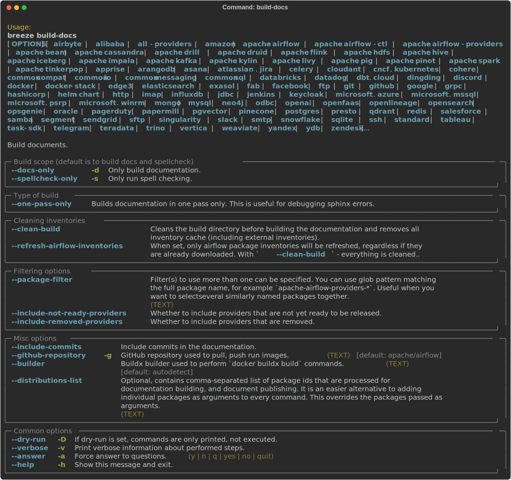
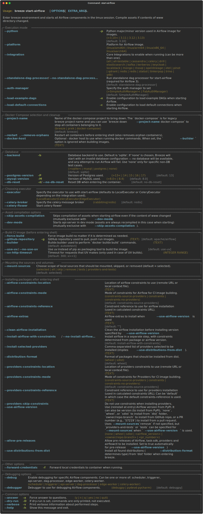
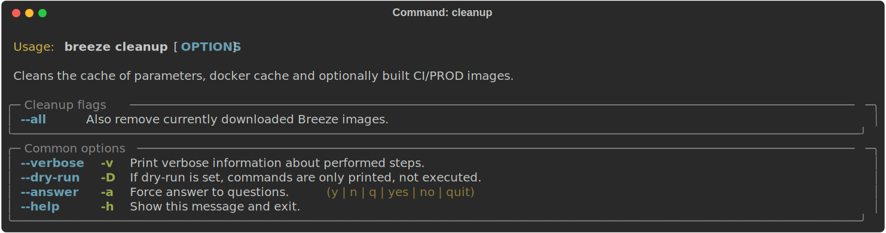
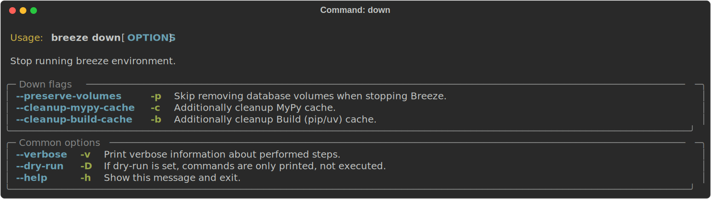
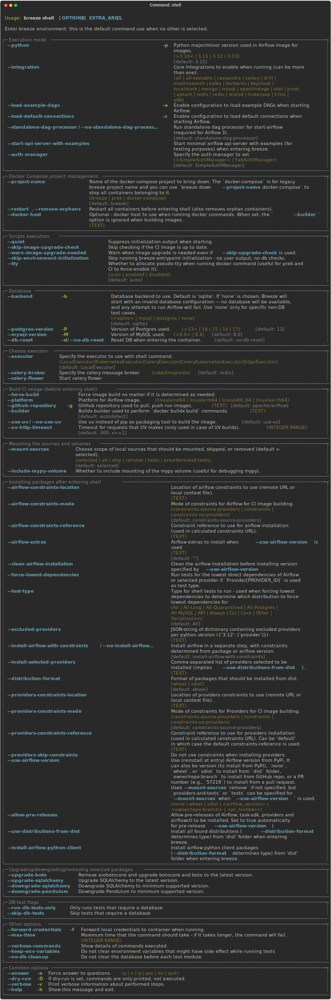
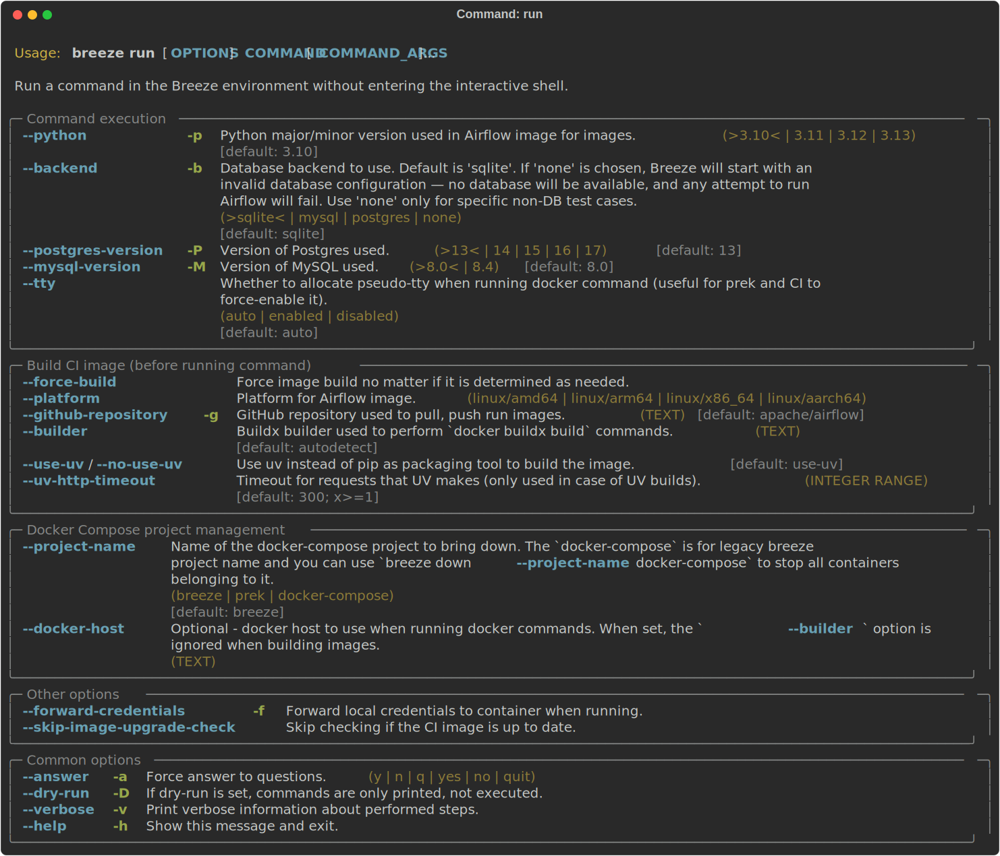
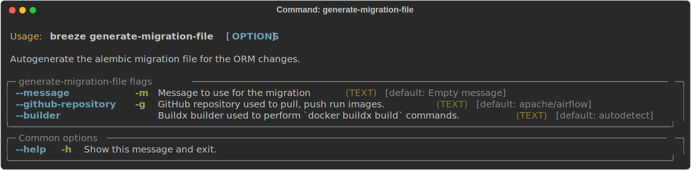

 .. Licensed to the Apache Software Foundation (ASF) under one
    or more contributor license agreements.  See the NOTICE file
    distributed with this work for additional information
    regarding copyright ownership.  The ASF licenses this file
    to you under the Apache License, Version 2.0 (the
    "License"); you may not use this file except in compliance
    with the License.  You may obtain a copy of the License at

 ..   http://www.apache.org/licenses/LICENSE-2.0

 .. Unless required by applicable law or agreed to in writing,
    software distributed under the License is distributed on an
    "AS IS" BASIS, WITHOUT WARRANTIES OR CONDITIONS OF ANY
    KIND, either express or implied.  See the License for the
    specific language governing permissions and limitations
    under the License.

Regular development tasks
=========================

The regular Breeze development tasks are available as top-level commands. Those tasks are most often
used during the development, that's why they are available without any sub-command. More advanced
commands are separated to sub-commands.

**The outline for this document in GitHub is available at top-right corner button (with 3-dots and 3 lines).**

Entering Breeze shell
---------------------

This is the most often used feature of breeze. It simply allows to enter the shell inside the Breeze
development environment (inside the Breeze container).

You can use additional ``breeze`` flags to choose your environment. You can specify a Python
version to use, and backend (the meta-data database). Thanks to that, with Breeze, you can recreate the same
environments as we have in matrix builds in the CI. See next chapter for backend selection.

For example, you can choose to run Python 3.10 tests with MySQL as backend and with mysql version 8
as follows:

.. code-block:: bash

    breeze --python 3.10 --backend mysql --mysql-version 8.0

.. note:: Note for Windows WSL2 users

   You may find error messages:

.. code-block:: bash

    Current context is now "..."
    protocol not available
    Error 1 returned

Try adding ``--builder=default`` to your command. For example:

.. code-block:: bash

    breeze --builder=default --python 3.10 --backend mysql --mysql-version 8.0

The choices you make are persisted in the ``./.build/`` cache directory so that next time when you use the
``breeze`` script, it could use the values that were used previously. This way you do not have to specify
them when you run the script. You can delete the ``.build/`` directory in case you want to restore the
default settings.

You can also run breeze with ``SKIP_SAVING_CHOICES`` to non-empty value and breeze invocation will not save
used cache value to cache - this is useful when you run non-interactive scripts with ``breeze shell`` and
want to - for example - force Python version used only for that execution without changing the Python version
that user used last time.

You can see which value of the parameters that can be stored persistently in cache marked with >VALUE<
in the help of the commands (for example in output of ``breeze config --help``).

Selecting Backend
-----------------

When you run breeze commands, you can additionally select which backend you want to use. Currently Airflow
supports Sqlite, MySQL and Postgres as backends - MySQL and Postgres are supported in various versions.

You can choose which backend to use by adding ``--backend`` flag and additionally you can select version
of the backend, if you want to start a different version of backend (for example for ``--backend postgres``
you can specify ``--postgres-version 13`` to start Postgres 13). The ``--help`` command in breeze commands
will show you which backends are supported and which versions are available for each backend.

The choice you made for backend and version are ``sticky`` - the last used selection is cached in the
``.build`` folder and next time you run any of the ``breeze`` commands that use backend the will use the
last selected backend and version.

.. note::

  You can also (temporarily for the time of running a single command) override the backend version
  used via ``BACKEND_VERSION`` environment variable. This is used mostly in CI where we have common way of
  running tests for all backends and we want to specify different parameters. In order to override the
  backend version, it has to be a valid version for the backend you are using. For example if you set
  ``BACKEND_VERSION`` to ``13`` and you are using ``--backend postgres``, Postgres 13 will be used, but
  if you set ``BACKEND_VERSION`` to ``8.0`` and you are using ``--backend postgres``, the last used Postgres
  version will be used.

Breeze will inform you at startup which backend and version it is using:

.. raw:: html

    

        
    

Port Forwarding
---------------

When you run Airflow Breeze, the following ports are automatically forwarded:

.. code-block::

    * 12322 -> forwarded to Airflow ssh server -> airflow:22
    * 28080 -> forwarded to Airflow API server -> airflow:8080
    * 25555 -> forwarded to Flower dashboard -> airflow:5555
    * 25433 -> forwarded to Postgres database -> postgres:5432
    * 23306 -> forwarded to MySQL database  -> mysql:3306
    * 26379 -> forwarded to Redis broker -> redis:6379

You can connect to these ports/databases using:

.. code-block::

    * ssh connection for remote debugging: ssh -p 12322 airflow@localhost pw: airflow
    * API server:    http://localhost:28080
    * Flower:    http://localhost:25555
    * Postgres:  jdbc:postgresql://localhost:25433/airflow?user=postgres&password=airflow
    * Mysql:     jdbc:mysql://localhost:23306/airflow?user=root
    * Redis:     redis://localhost:26379/0

If you do not use ``start-airflow`` command. You can use ``tmux`` to multiply terminals.
You may need to create a user prior to running the API server in order to log in.

**Authentication and User Management**

The authentication method depends on which auth manager is configured:

**SimpleAuthManager (Default in Airflow 3.x)**

SimpleAuthManager is the default authentication manager and comes pre-configured with test username and passwords for development:

.. code-block::

    * admin:admin     (Admin role)
    * viewer:viewer   (Viewer role)
    * user:user       (User role)
    * op:op           (Operator role)

These users are automatically available when using SimpleAuthManager and require no additional setup.

**FabAuthManager**

When using FabAuthManager, you can create users manually:

.. code-block:: bash

    airflow users create --role Admin --username admin --password admin --email admin@example.com --firstname foo --lastname bar

Or use the ``--create-all-roles`` flag with ``start-airflow`` in dev mode to automatically create test users:

.. code-block:: bash

    breeze start-airflow --dev-mode --create-all-roles --auth-manager FabAuthManager

This will create the following test users:

.. code-block::

    * admin:admin         (Admin role)
    * viewer:viewer       (Viewer role)
    * user:user           (User role)
    * op:op               (Op role)
    * testadmin:testadmin (Admin role)

.. note::
    ``airflow users`` command is only available when `FAB auth manager <https://airflow.apache.org/docs/apache-airflow-providers-fab/stable/auth-manager/index.html>`_ is enabled.

For databases, you need to run ``airflow db reset`` at least once (or run some tests) after you started
Airflow Breeze to get the database/tables created. You can connect to databases with IDE or any other
database client:

.. raw:: html

    

        
    

You can change the used host port numbers by setting appropriate environment variables:

* ``SSH_PORT``
* ``WEB_HOST_PORT`` - API server when --use-airflow-version is used
* ``POSTGRES_HOST_PORT``
* ``MYSQL_HOST_PORT``
* ``MSSQL_HOST_PORT``
* ``FLOWER_HOST_PORT``
* ``REDIS_HOST_PORT``
* ``RABBITMQ_HOST_PORT``

If you set these variables, next time when you enter the environment the new ports should be in effect.

Remote Debugging in IDE
-----------------------

One of the possibilities (albeit only easy if you have a paid version of IntelliJ IDEs for example) with
Breeze is an option to run remote debugging in your IDE graphical interface.

When you run tests, airflow, example Dags, even if you run them using unit tests, they are run in a separate
container. This makes it a little harder to use with IDE built-in debuggers.
Fortunately, IntelliJ/PyCharm provides an effective remote debugging feature (but only in paid versions).
See additional details on
`remote debugging <https://www.jetbrains.com/help/pycharm/remote-debugging-with-product.html>`_.

You can set up your remote debugging session as follows:

Note that on macOS, you have to use a real IP address of your host rather than the default
localhost because on macOS the container runs in a virtual machine with a different IP address.

Make sure to configure source code mapping in the remote debugging configuration to map
your local sources to the ``/opt/airflow`` location of the sources within the container:

.. note::

   For comprehensive debugging documentation using the new ``--debug`` and ``--debugger`` flags
   with VSCode and debugpy, see the `Debugging Airflow Components <../../contributing-docs/20_debugging_airflow_components.rst>`__
   guide.

Building the documentation
--------------------------

To build documentation in Breeze, use the ``build-docs`` command:

.. code-block:: bash

     breeze build-docs

Results of the build can be found in the ``generated/_build`` folder.

The documentation build consists of three steps:

* verifying consistency of indexes
* building documentation
* spell checking

You can choose only one stage of the two by providing ``--spellcheck-only`` or ``--docs-only`` after
extra ``--`` flag.

.. code-block:: bash

    breeze build-docs --spellcheck-only

This process can take some time, so in order to make it shorter you can filter by package, using package
short ``provider id`` (might be multiple of them).

.. code-block:: bash

     breeze build-docs <provider id> <provider id>

To build documentation for Task SDK package, use the below command
.. code-block:: bash
     breeze build-docs task-sdk

or you can use package filter. The filters are glob pattern matching full
package names and can be used to select more than one package with single filter.

.. code-block:: bash

     breeze build-docs --package-filter apache-airflow-providers-*

Often errors during documentation generation come from the docstrings of auto-api generated classes.
During the docs building auto-api generated files are stored in the ``generated`` folder. This helps you
easily identify the location the problems with documentation originated from.

These are all available flags of ``build-docs`` command:

While you can use full name of doc package starting with ``apache-airflow-providers-`` in package filter,
You can use shorthand version - just take the remaining part and replace every ``dash("-")`` with
a ``dot(".")``.

Example:
If the provider name is ``apache-airflow-providers-cncf-kubernetes``, it will be ``cncf.kubernetes``.

Note: For building docs for apache-airflow-providers index, use ``apache-airflow-providers``
as the short hand operator.

Running static checks
---------------------

You can run static checks via prek.

For example, this following command:

.. code-block:: bash

     prek mypy-airflow

will run mypy check for currently staged files inside ``airflow/`` excluding providers.
.. _breeze-dev:running-prek-in-breeze:

A note on running ``prek`` inside the Breeze container
-----------------------------------------------------

While ``prek`` (pre-commit) is intended to be run on your host machine, it can
also be run from within the Breeze shell for debugging or manual checks.

If you choose to do this, you may need to mount all sources by running
``breeze shell --mount-sources all``.

Selecting files to run static checks on
---------------------------------------

Prek hooks run by default on staged changes that you have locally changed. It will run it on all the
files you run ``git add`` on and it will ignore any changes that you have modified but not staged.
If you want to run it on all your modified files you should add them with ``git add`` command.

With ``--all-files`` you can run static checks on all files in the repository. This is useful when you
want to be sure they will not fail in CI, or when you just rebased your changes and want to
re-run latest prek hooks on your changes, but it can take a long time (few minutes) to wait for the result.

.. code-block:: bash

     prek mypy-airflow --all-files

The above will run mypy check for all files.

You can limit that by selecting specific files you want to run static checks on. You can do that by
specifying (can be multiple times) ``--file`` flag.

.. code-block:: bash

     prek mypy-airflow --file airflow/utils/code_utils.py --file airflow/utils/timeout.py

The above will run mypy check for those to files (note: autocomplete should work for the file selection).

However, often you do not remember files you modified and you want to run checks for files that belong
to specific commits you already have in your branch. You can use ``prek`` to run the checks
only on changed files you have already committed to your branch - either for specific commit, for last
commit, for all changes in your branch since you branched off from main or for specific range
of commits you choose.

.. code-block:: bash

     prek mypy-airflow --last-commit

The above will run mypy check for all files in the last commit in your branch.

.. code-block:: bash

     prek identity --verbose --from-ref HEAD^^^^ --to-ref HEAD

The above will run the check for the last 4 commits in your branch. You can use any ``commit-ish`` references
in ``--from-ref`` and ``--to-ref`` flags.

.. note::

    When you run static checks, some of the artifacts (mypy_cache) is stored in docker-compose volume
    so that it can speed up static checks execution significantly. However, sometimes, the cache might
    get broken, in which case you should run ``breeze down`` to clean up the cache.

.. note::

    You cannot change Python version for static checks that are run within Breeze containers.
    The ``--python`` flag has no effect for them. They are always run with lowest supported Python version.
    The main reason is to keep consistency in the results of static checks and to make sure that
    our code is fine when running the lowest supported version.

Starting Airflow
----------------

For testing Airflow you often want to start multiple components (in multiple terminals). Breeze has
built-in ``start-airflow`` command that start breeze container, launches multiple terminals using tmux
and launches all Airflow necessary components in those terminals.

When you are starting Airflow from local sources, www asset compilation is automatically executed before.

.. code-block:: bash

    breeze --python 3.10 --backend mysql start-airflow

You can also use it to start different executor.

.. code-block:: bash

    breeze start-airflow --executor CeleryExecutor

Using KubernetesExecutor
^^^^^^^^^^^^^^^^^^^^^^^^^

For KubernetesExecutor, Breeze will automatically create and manage a KinD cluster.

**Prerequisites**:

* Docker (with at least 8GB memory allocated)
* Kind and kubectl (installed automatically by breeze)

**Quick start**:

.. code-block:: bash

    breeze start-airflow --executor KubernetesExecutor

**Using Custom DAGs and Include Files**:

Place your DAGs in ``files/dags/`` and any supporting modules in ``files/include/`` before starting.
These directories are built into the worker image at startup.

**Important**: Any changes to ``files/dags/`` or ``files/include/`` require a complete restart

The worker image is built when breeze starts, so new or modified files are only available after a restart.

**Configuration Options**:

Force rebuild the KinD cluster (useful when configuration changes):

.. code-block:: bash

    breeze start-airflow --executor KubernetesExecutor --force-rebuild-cluster

Skip rebuilding the worker image on restart (faster when no DAG changes):

.. code-block:: bash

    breeze start-airflow --executor KubernetesExecutor --skip-image-rebuild

**Warning**: Only use ``--skip-image-rebuild`` when you're certain no changes have
been made to ``files/dags/`` or ``files/include/`` since the last image build.

Use a specific Kubernetes version for the KinD cluster:

.. code-block:: bash

    breeze start-airflow --executor KubernetesExecutor --kubernetes-version v1.30.13

**Accessing Task Logs**:

**Current Limitation**: Task logs are ephemeral and lost when pods are deleted.

**Workaround for Development** - Configure Airflow to keep pods after task completion:

.. code-block:: bash

    export AIRFLOW__KUBERNETES_EXECUTOR__DELETE_WORKER_PODS=False
    export AIRFLOW__KUBERNETES_EXECUTOR__DELETE_WORKER_PODS_ON_FAILURE=False
    breeze start-airflow --executor KubernetesExecutor

With these settings:

* Completed pods remain available for log inspection
* View logs via Airflow UI while pods exist
* Manually delete pods when done: ``kubectl delete pods -l airflow-worker -n airflow``

You can also use it to start any released version of Airflow from ``PyPI`` with the
``--use-airflow-version`` flag - useful for testing and looking at issues raised for specific version.

.. code-block:: bash

    breeze start-airflow --python 3.10 --backend mysql --use-airflow-version 2.7.0

When you are installing version from PyPI, it's also possible to specify extras that should be used
when installing Airflow - you can provide several extras separated by coma - for example to install
providers together with Airflow that you are installing. For example when you are using celery executor
in Airflow 2.7.0+ you need to add ``celery`` extra.

.. code-block:: bash

    breeze start-airflow --use-airflow-version 2.7.0 --executor CeleryExecutor --airflow-extras celery

These are all available flags of ``start-airflow`` command:

Running External System Integrations with Breeze
------------------------------------------------

You can run Airflow alongside external systems in Breeze, such as Kafka, Cassandra, MongoDB, and more.

To start Airflow with an integration, use the following command:

.. code-block:: bash

    breeze --python 3.10 --backend postgres --integration <integration_name>

For example, to run Airflow with Kafka:

.. code-block:: bash

    breeze --python 3.10 --backend postgres --integration kafka

Check the available integrations by running:

.. code-block:: bash

    breeze --integration --help

Launching multiple terminals in the same environment
----------------------------------------------------

Often if you want to run full Airflow in the Breeze environment you need to launch multiple terminals and
run ``airflow api-server``, ``airflow scheduler``, ``airflow worker`` in separate terminals.

This can be achieved either via ``tmux`` or via exec-ing into the running container from the host. Tmux
is installed inside the container and you can launch it with ``tmux`` command. Tmux provides you with the
capability of creating multiple virtual terminals and multiplex between them. More about ``tmux`` can be
found at `tmux GitHub wiki page <https://github.com/tmux/tmux/wiki>`_ . Tmux has several useful shortcuts
that allow you to split the terminals, open new tabs etc - it's pretty useful to learn it.

Another way is to exec into Breeze terminal from the host's terminal. Often you can
have multiple terminals in the host (Linux/MacOS/WSL2 on Windows) and you can simply use those terminals
to enter the running container. It's as easy as launching ``breeze exec`` while you already started the
Breeze environment. You will be dropped into bash and environment variables will be read in the same
way as when you enter the environment. You can do it multiple times and open as many terminals as you need.

These are all available flags of ``exec`` command:

Breeze cleanup
--------------

Sometimes you need to cleanup your docker environment (and it is recommended you do that regularly). There
are several reasons why you might want to do that.

Breeze uses docker images heavily and those images are rebuild periodically and might leave dangling, unused
images in docker cache. This might cause extra disk usage. Also running various docker compose commands
(for example running tests with ``breeze testing core-tests``) might create additional docker networks that might
prevent new networks from being created. Those networks are not removed automatically by docker-compose.
Also Breeze uses its own cache to keep information about all images.

All those unused images, networks and cache can be removed by running ``breeze cleanup`` command. By default
it will not remove the most recent images that you might need to run breeze commands, but you
can also remove those breeze images to clean-up everything by adding ``--all`` command (note that you will
need to build the images again from scratch - pulling from the registry might take a while).

Breeze will ask you to confirm each step, unless you specify ``--answer yes`` flag.

These are all available flags of ``cleanup`` command:

Database and config volumes in Breeze
-------------------------------------

Breeze keeps data for all its integration, database, configuration in named docker volumes.
Those volumes are persisted until ``breeze down`` command. You can also preserve the volumes by adding
flag ``--preserve-volumes`` when you run the command. Then, next time when you start Breeze,
it will have the data pre-populated.

These are all available flags of ``down`` command:

Running arbitrary commands in container
---------------------------------------

More sophisticated usages of the breeze shell is using the ``breeze shell`` command - it has more parameters
and you can also use it to execute arbitrary commands inside the container.

.. code-block:: bash

     breeze shell "ls -la"

Those are all available flags of ``shell`` command:

Running commands without interactive shell
------------------------------------------

For automated testing, and one-off command execution, you can use the ``breeze run`` command
to execute commands in the Breeze environment without entering the interactive shell. This command is
particularly useful when you want to run a specific command and exit immediately, without the overhead
of an interactive session.

The ``breeze run`` command creates a fresh container that is automatically cleaned up after the command
completes, and each run uses a unique project name to avoid conflicts with other instances.

Here are some common examples:

Running a specific test:

.. code-block:: bash

    breeze run pytest providers/google/tests/unit/google/cloud/operators/test_dataflow.py -v

Running Python commands:

.. code-block:: bash

    breeze run python -c "from airflow.providers.google.version_compat import AIRFLOW_V_3_0_PLUS; print(AIRFLOW_V_3_0_PLUS)"

Running bash commands:

.. code-block:: bash

    breeze run bash -c "cd /opt/airflow && python -m pytest providers/google/tests/"

Running with different Python version:

.. code-block:: bash

    breeze run --python 3.11 pytest providers/standard/tests/unit/operators/test_bash.py

Running with PostgreSQL backend:

.. code-block:: bash

    breeze run --backend postgres pytest providers/postgres/tests/

Those are all available flags of ``run`` command:

Running Breeze with Metrics
---------------------------

Running Breeze with a StatsD Metrics Stack
..........................................

You can launch an instance of Breeze pre-configured to emit StatsD metrics using
``breeze start-airflow --integration statsd``.  This will launch an Airflow API server
within the Breeze environment as well as containers running StatsD, Prometheus, and
Grafana.  The integration configures the "Targets" in Prometheus, the "Datasources" in
Grafana, and includes a default dashboard in Grafana.

When you run Airflow Breeze with this integration, in addition to the standard ports
(See "Port Forwarding" below), the following are also automatically forwarded:

* 29102 -> forwarded to StatsD Exporter -> breeze-statsd-exporter:9102
* 29090 -> forwarded to Prometheus -> breeze-prometheus:9090
* 23000 -> forwarded to Grafana -> breeze-grafana:3000

You can connect to these ports/databases using:

* StatsD Metrics: http://127.0.0.1:29102/metrics
* Prometheus Targets: http://127.0.0.1:29090/targets
* Grafana Dashboards: http://127.0.0.1:23000/dashboards

Running Breeze with an OpenTelemetry Metrics Stack
..................................................

----

[Work in Progress]
NOTE:  This will launch the stack as described below but Airflow integration is
still a Work in Progress.  This should be considered experimental and likely to
change by the time Airflow fully supports emitting metrics via OpenTelemetry.

----

You can launch an instance of Breeze pre-configured to emit OpenTelemetry metrics
using ``breeze start-airflow --integration otel``.  This will launch Airflow within
the Breeze environment as well as containers running OpenTelemetry-Collector,
Prometheus, and Grafana.  The integration handles all configuration of the
"Targets" in Prometheus and the "Datasources" in Grafana, so it is ready to use.

When you run Airflow Breeze with this integration, in addition to the standard ports
(See "Port Forwarding" below), the following are also automatically forwarded:

* 28889 -> forwarded to OpenTelemetry Collector -> breeze-otel-collector:8889
* 29090 -> forwarded to Prometheus -> breeze-prometheus:9090
* 23000 -> forwarded to Grafana -> breeze-grafana:3000

You can connect to these ports using:

* OpenTelemetry Collector: http://127.0.0.1:28889/metrics
* Prometheus Targets: http://127.0.0.1:29090/targets
* Grafana Dashboards: http://127.0.0.1:23000/dashboards

Running Breeze with OpenLineage
...............................

You can launch an instance of Breeze pre-configured to emit OpenLineage metrics using
``breeze start-airflow --integration openlineage``.  This will launch an Airflow API server
within the Breeze environment as well as containers running a [Marquez](https://marquezproject.ai/)
API server.

When you run Airflow Breeze with this integration, in addition to the standard ports
(See "Port Forwarding" below), the following are also automatically forwarded:

* MARQUEZ_API_HOST_PORT (default 25000) -> forwarded to Marquez API -> marquez:5000
* MARQUEZ_API_ADMIN_HOST_PORT (default 25001) -> forwarded to Marquez Admin API -> marquez:5001
* MARQUEZ_HOST_PORT (default 23100) -> forwarded to Marquez -> marquez_web:3000

You can connect to these services using:

* Marquez Webserver: http://127.0.0.1:23100
* Marquez API: http://127.0.0.1:25000/api/v1
* Marquez Admin API: http://127.0.0.1:25001

Make sure to substitute the port numbers if you have customized them via the above env vars.

Stopping the environment
------------------------

After starting up, the environment runs in the background and takes quite some memory which you might
want to free for other things you are running on your host.

You can always stop it via:

.. code-block:: bash

   breeze down

These are all available flags of ``down`` command:

Using local virtualenv environment in Your Host IDE
---------------------------------------------------

You can set up your host IDE (for example, IntelliJ's PyCharm/Idea) to work with Breeze
and benefit from all the features provided by your IDE, such as local and remote debugging,
language auto-completion, documentation support, etc.

To use your host IDE with Breeze:

1. Create a local virtual environment:

   You can use any of the following wrappers to create and manage your virtual environments:
   `pyenv <https://github.com/pyenv/pyenv>`_, `pyenv-virtualenv <https://github.com/pyenv/pyenv-virtualenv>`_,
   or `virtualenvwrapper <https://virtualenvwrapper.readthedocs.io/en/latest/>`_.

2. Use the right command to activate the virtualenv (``workon`` if you use virtualenvwrapper or
   ``pyenv activate`` if you use pyenv.

3. Initialize the created local virtualenv:

.. code-block:: bash

   ./scripts/tools/initialize_virtualenv.py

.. warning::
   Make sure that you use the right Python version in this command - matching the Python version you have
   in your local virtualenv. If you don't, you will get strange conflicts.

4. Select the virtualenv you created as the project's default virtualenv in your IDE.

Note that you can also use the local virtualenv for Airflow development without Breeze.
This is a lightweight solution that has its own limitations.

More details on using the local virtualenv are available in the
`Local Virtualenv </contributing-docs/07_local_virtualenv.rst>`_.

Auto-generating migration files
-------------------------------
After making changes in the ORM models, you need to generate migration files. You can do this by running
the following command:

.. code-block:: bash

    breeze generate-migration-file -m "Your migration message"

This command will generate a migration file in the ``airflow/migrations/versions`` directory.

These are all available flags of ``generate-migration-file`` command:

------

Next step: Follow the `Troubleshooting <04_troubleshooting.rst>`_ guide to troubleshoot your Breeze environment.
