 .. Licensed to the Apache Software Foundation (ASF) under one
    or more contributor license agreements.  See the NOTICE file
    distributed with this work for additional information
    regarding copyright ownership.  The ASF licenses this file
    to you under the Apache License, Version 2.0 (the
    "License"); you may not use this file except in compliance
    with the License.  You may obtain a copy of the License at

 ..   http://www.apache.org/licenses/LICENSE-2.0

 .. Unless required by applicable law or agreed to in writing,
    software distributed under the License is distributed on an
    "AS IS" BASIS, WITHOUT WARRANTIES OR CONDITIONS OF ANY
    KIND, either express or implied.  See the License for the
    specific language governing permissions and limitations
    under the License.

Test commands
==============

Airflow Breeze is a Python script serving as a "swiss-army-knife" of Airflow testing. Under the
hood it uses other scripts that you can also run manually if you have problem with running the Breeze
environment. Breeze script allows performing the following tasks:

**The outline for this document in GitHub is available at top-right corner button (with 3-dots and 3 lines).**

Running tests
-------------

You can run tests with ``breeze``. There are various tests type and breeze allows to run different test
types easily. You can run unit tests in different ways, either interactively run tests with the default
``shell`` command or via the ``testing`` commands. The latter allows to run more kinds of tests easily.

Here is the detailed set of options for the ``breeze testing`` command.

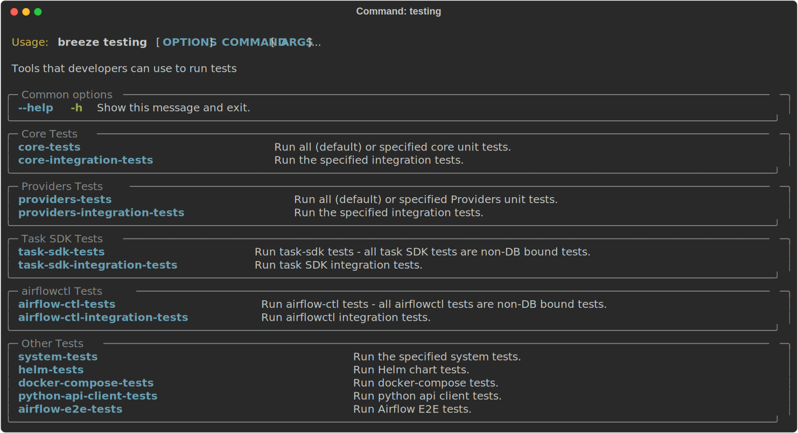

Iterate on tests interactively via ``shell`` command
....................................................

You can simply enter the ``breeze`` container in interactive shell (via ``breeze`` or more comprehensive
``breeze shell`` command) or use your local virtualenv and run ``pytest`` command there.
This is the best way if you want to interactively run selected tests and iterate with the tests.

The good thing about ``breeze`` interactive shell is that it has all the dependencies to run all the tests
and it has the running and configured backed database started for you when you decide to run DB tests.
It also has auto-complete enabled for ``pytest`` command so that you can easily run the tests you want.
(autocomplete should help you with autocompleting test name if you start typing ``pytest tests<TAB>``).

Here are few examples:

Running single test:

.. code-block:: bash

    pytest tests/core/test_core.py::TestCore::test_dag_params_and_task_params

To run the whole test class:

.. code-block:: bash

    pytest tests/core/test_core.py::TestCore

You can re-run the tests interactively, add extra parameters to pytest  and modify the files before
re-running the test to iterate over the tests. You can also add more flags when starting the
``breeze shell`` command when you run integration tests or system tests. Read more details about it
in the `testing doc <../../../contributing-docs/testing.rst>`_ where all the test types and information on how to run them are explained.

This applies to all kind of tests - all our tests can be run using pytest.

Running unit tests with ``breeze testing`` commands
...................................................

An option you have is that you can also run tests via built-in ``breeze testing tests`` command - which
is a "swiss-army-knife" of unit testing with Breeze. This command has a lot of parameters and is very
flexible thus might be a bit overwhelming.

In most cases if you want to run tess you want to use dedicated ``breeze testing db-tests``
or ``breeze testing non-db-tests`` commands that automatically run groups of tests that allow you to choose
subset of tests to run (with ``--parallel-test-types`` flag)

Using ``breeze testing tests`` command
......................................

The ``breeze testing tests`` command is that you can easily specify sub-set of the tests -- including
selecting specific Providers tests to run.

For example this will only run provider tests for airbyte and http providers:

.. code-block:: bash

   breeze testing tests --test-type "Providers[airbyte,http]"

You can also exclude tests for some providers from being run when whole "Providers" test type is run.

For example this will run tests for all providers except amazon and google provider tests:

.. code-block:: bash

   breeze testing tests --test-type "Providers[-amazon,google]"

You can also run parallel tests with ``--run-in-parallel`` flag - by default it will run all tests types
in parallel, but you can specify the test type that you want to run with space separated list of test
types passed to ``--parallel-test-types`` flag.

For example this will run API and WWW tests in parallel:

.. code-block:: bash

    breeze testing tests --parallel-test-types "API WWW" --run-in-parallel

There are few special types of tests that you can run:

* ``All`` - all tests are run in single pytest run.
* ``All-Postgres`` - runs all tests that require Postgres database
* ``All-MySQL`` - runs all tests that require MySQL database
* ``All-Quarantine`` - runs all tests that are in quarantine (marked with ``@pytest.mark.quarantined``
  decorator)

Here is the detailed set of options for the ``breeze testing tests`` command.

.. image:: ./images/output_testing_tests.svg
  :target: https://raw.githubusercontent.com/apache/airflow/main/dev/breeze/images/output_testing_tests.svg
  :width: 100%
  :alt: Breeze testing tests

Using ``breeze testing db-tests`` command
.........................................

The ``breeze testing db-tests`` command is simplified version of the ``breeze testing tests`` command
that only allows you to run tests that are not bound to a database - in parallel utilising all your CPUS.
The DB-bound tests are the ones that require a database to be started and configured separately for
each test type run and they are run in parallel containers/parallel docker compose projects to
utilise multiple CPUs your machine has - thus allowing you to quickly run few groups of tests in parallel.
This command is used in CI to run DB tests.

By default this command will run complete set of test types we have, thus allowing you to see result
of all DB tests we have but you can choose a subset of test types to run by ``--parallel-test-types``
flag or exclude some test types by specifying ``--excluded-parallel-test-types`` flag.

Run all DB tests:

.. code-block:: bash

   breeze testing db-tests

Only run DB tests from "API CLI WWW" test types:

.. code-block:: bash

   breeze testing db-tests --parallel-test-types "API CLI WWW"

Run all DB tests excluding those in CLI and WWW test types:

.. code-block:: bash

   breeze testing db-tests --excluded-parallel-test-types "CLI WWW"

Here is the detailed set of options for the ``breeze testing db-tests`` command.

.. image:: ./images/output_testing_db-tests.svg
  :target: https://raw.githubusercontent.com/apache/airflow/main/dev/breeze/images/output_testing_db-tests.svg
  :width: 100%
  :alt: Breeze testing db-tests

Using ``breeze testing non-db-tests`` command
.........................................

The ``breeze testing non-db-tests`` command is simplified version of the ``breeze testing tests`` command
that only allows you to run tests that are not bound to a database - in parallel utilising all your CPUS.
The non-DB-bound tests are the ones that do not expect a database to be started and configured and we can
utilise multiple CPUs your machine has via ``pytest-xdist`` plugin - thus allowing you to quickly
run few groups of tests in parallel using single container rather than many of them as it is the case for
DB-bound tests. This command is used in CI to run Non-DB tests.

By default this command will run complete set of test types we have, thus allowing you to see result
of all DB tests we have but you can choose a subset of test types to run by ``--parallel-test-types``
flag or exclude some test types by specifying ``--excluded-parallel-test-types`` flag.

Run all non-DB tests:

.. code-block:: bash

   breeze testing non-db-tests

Only run non-DB tests from "API CLI WWW" test types:

.. code-block:: bash

   breeze testing non-db-tests --parallel-test-types "API CLI WWW"

Run all non-DB tests excluding those in CLI and WWW test types:

.. code-block:: bash

   breeze testing non-db-tests --excluded-parallel-test-types "CLI WWW"

Here is the detailed set of options for the ``breeze testing non-db-tests`` command.

.. image:: ./images/output_testing_non-db-tests.svg
  :target: https://raw.githubusercontent.com/apache/airflow/main/dev/breeze/images/output_testing_non-db-tests.svg
  :width: 100%
  :alt: Breeze testing non-db-tests

Using ``breeze testing task-sdk-tests`` command
............................................

The ``breeze testing task-sdk-tests`` command is simplified version of the ``breeze testing tests`` command
that allows you to run tests for Task SDK without initializing database. The Task SDK should not need
database to be started so this acts as a good check to see if the Task SDK tests are working properly.

Run all Task SDK tests:

.. code-block:: bash

   breeze testing task-sdk-tests

Here is the detailed set of options for the ``breeze testing task-sdk-tests`` command.

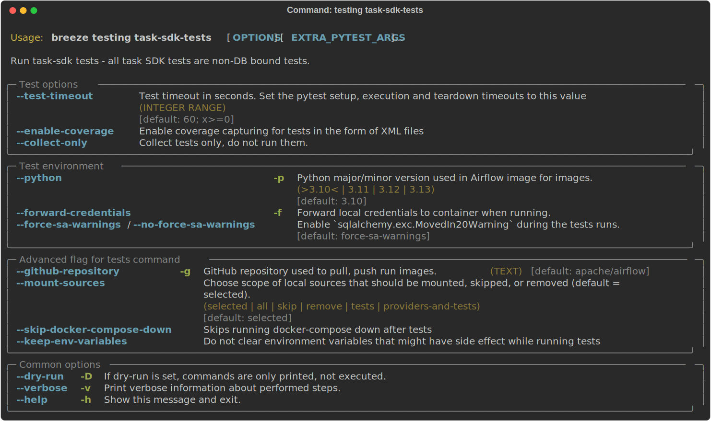

Running integration tests
.........................

You can also run integration tests via built-in ``breeze testing integration-tests`` command. Some of our
tests require additional integrations to be started in docker-compose. The integration tests command will
run the expected integration and tests that need that integration.

For example this will only run kerberos tests:

.. code-block:: bash

   breeze testing integration-tests --integration kerberos

Here is the detailed set of options for the ``breeze testing integration-tests`` command.

.. image:: ./images/output_testing_integration-tests.svg
  :target: https://raw.githubusercontent.com/apache/airflow/main/dev/breeze/images/output_testing_integration_tests.svg
  :width: 100%
  :alt: Breeze testing integration-tests

Running Helm unit tests
.......................

You can use Breeze to run all Helm unit tests. Those tests are run inside the breeze image as there are all
necessary tools installed there. Those tests are merely checking if the Helm chart of ours renders properly
as expected when given a set of configuration parameters. The tests can be run in parallel if you have
multiple CPUs by specifying ``--run-in-parallel`` flag - in which case they will run separate containers
(one per helm-test package) and they will run in parallel.

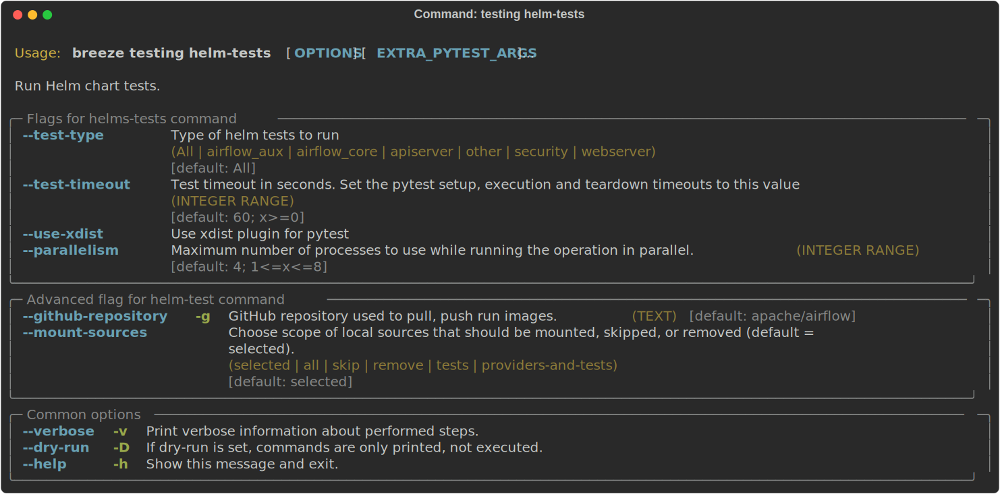

You can also iterate over those tests with pytest commands, similarly as in case of regular unit tests.
The helm tests can be found in ``tests/chart`` folder in the main repo.

Running docker-compose tests
............................

You can use Breeze to run all docker-compose tests. Those tests are run using Production image
and they are running test with the Quick-start docker compose we have.

You can also iterate over those tests with pytest command, but - unlike regular unit tests and
Helm tests, they need to be run in local virtual environment. They also require to have
``DOCKER_IMAGE`` environment variable set, pointing to the image to test if you do not run them
through ``breeze testing docker-compose-tests`` command.

The docker-compose tests are in ``docker-tests/`` folder in the main repo.

Running Kubernetes tests
------------------------

Breeze helps with running Kubernetes tests in the same environment/way as CI tests are run.
Breeze helps to setup KinD cluster for testing, setting up virtualenv and downloads the right tools
automatically to run the tests.

You can:

* Setup environment for k8s tests with ``breeze k8s setup-env``
* Build airflow k8S images with ``breeze k8s build-k8s-image``
* Manage KinD Kubernetes cluster and upload image and deploy Airflow to KinD cluster via
  ``breeze k8s create-cluster``, ``breeze k8s configure-cluster``, ``breeze k8s deploy-airflow``, ``breeze k8s status``,
  ``breeze k8s upload-k8s-image``, ``breeze k8s delete-cluster`` commands
* Run Kubernetes tests  specified with ``breeze k8s tests`` command
* Run complete test run with ``breeze k8s run-complete-tests`` - performing the full cycle of creating
  cluster, uploading the image, deploying airflow, running tests and deleting the cluster
* Enter the interactive kubernetes test environment with ``breeze k8s shell`` and ``breeze k8s k9s`` command
* Run multi-cluster-operations ``breeze k8s list-all-clusters`` and
  ``breeze k8s delete-all-clusters`` commands as well as running complete tests in parallel
  via ``breeze k8s dump-logs`` command

This is described in detail in `Testing Kubernetes <../../../contributing-docs/testing/k8s_tests.rst>`_.

You can read more about KinD that we use in `The documentation <https://kind.sigs.k8s.io/>`_

Here is the detailed set of options for the ``breeze k8s`` command.

.. image:: ./images/output_k8s.svg
  :target: https://raw.githubusercontent.com/apache/airflow/main/dev/breeze/images/output_k8s.svg
  :width: 100%
  :alt: Breeze k8s

Setting up K8S environment
..........................

Kubernetes environment can be set with the ``breeze k8s setup-env`` command.
It will create appropriate virtualenv to run tests and download the right set of tools to run
the tests: ``kind``, ``kubectl`` and ``helm`` in the right versions. You can re-run the command
when you want to make sure the expected versions of the tools are installed properly in the
virtualenv. The Virtualenv is available in ``.build/.k8s-env/bin`` subdirectory of your Airflow
installation.

Creating K8S cluster
....................

You can create kubernetes cluster (separate cluster for each python/kubernetes version) via
``breeze k8s create-cluster`` command. With ``--force`` flag the cluster will be
deleted if exists. You can also use it to create multiple clusters in parallel with
``--run-in-parallel`` flag - this is what happens in our CI.

All parameters of the command are here:

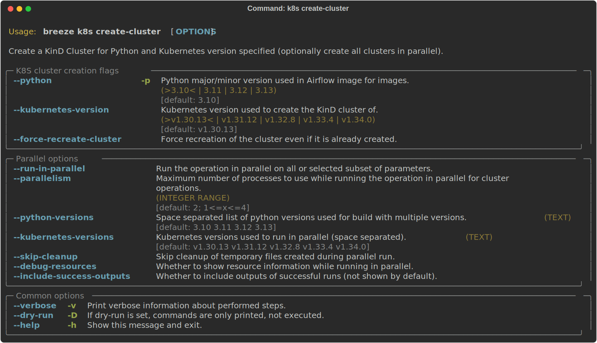

Deleting K8S cluster
....................

You can delete current kubernetes cluster via ``breeze k8s delete-cluster`` command. You can also add
``--run-in-parallel`` flag to delete all clusters.

All parameters of the command are here:

Building Airflow K8s images
...........................

Before deploying Airflow Helm Chart, you need to make sure the appropriate Airflow image is build (it has
embedded test dags, pod templates and webserver is configured to refresh immediately. This can
be done via ``breeze k8s build-k8s-image`` command. It can also be done in parallel for all images via
``--run-in-parallel`` flag.

All parameters of the command are here:

.. image:: ./images/output_k8s_build-k8s-image.svg
  :target: https://raw.githubusercontent.com/apache/airflow/main/dev/breeze/images/output_k8s_build-k8s-image.svg
  :width: 100%
  :alt: Breeze k8s build-k8s-image

Uploading Airflow K8s images
............................

The K8S airflow images need to be uploaded to the KinD cluster. This can be done via
``breeze k8s upload-k8s-image`` command. It can also be done in parallel for all images via
``--run-in-parallel`` flag.

All parameters of the command are here:

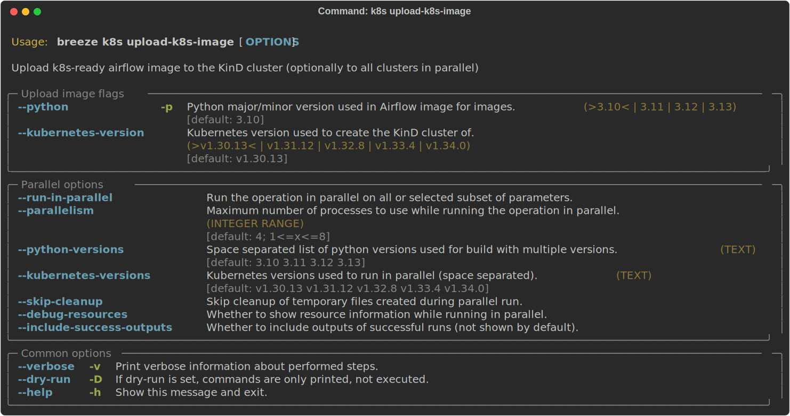

Configuring K8S cluster
.......................

In order to deploy Airflow, the cluster needs to be configured. Airflow namespace needs to be created
and test resources should be deployed. By passing ``--run-in-parallel`` the configuration can be run
for all clusters in parallel.

All parameters of the command are here:

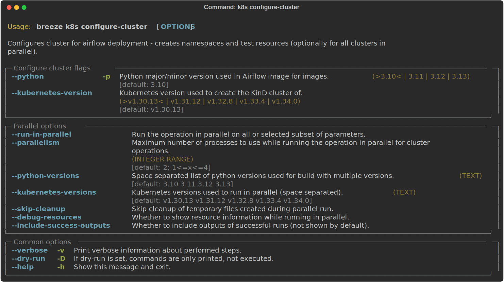

Deploying Airflow to the Cluster
................................

Airflow can be deployed to the Cluster with ``breeze k8s deploy-airflow``. This step will automatically
(unless disabled by switches) will rebuild the image to be deployed. It also uses the latest version
of the Airflow Helm Chart to deploy it. You can also choose to upgrade existing airflow deployment
and pass extra arguments to ``helm install`` or ``helm upgrade`` commands that are used to
deploy airflow. By passing ``--run-in-parallel`` the deployment can be run
for all clusters in parallel.

All parameters of the command are here:

Checking status of the K8S cluster
..................................

You can delete kubernetes cluster and airflow deployed in the current cluster
via ``breeze k8s status`` command. It can be also checked for all clusters created so far by passing
``--all`` flag.

All parameters of the command are here:

Running k8s tests
.................

You can run ``breeze k8s tests`` command to run ``pytest`` tests with your cluster. Those tests are placed
in ``kubernetes_tests/`` and you can either specify the tests to run as parameter of the tests command or
you can leave them empty to run all tests. By passing ``--run-in-parallel`` the tests can be run
for all clusters in parallel.

Run all tests:

.. code-block:: bash

    breeze k8s tests

Run selected tests:

.. code-block:: bash

    breeze k8s tests test_kubernetes_executor.py

All parameters of the command are here:

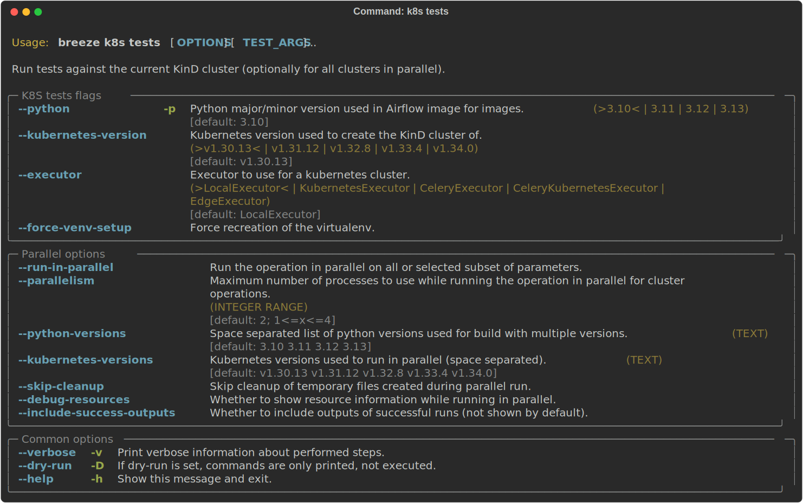

You can also specify any pytest flags as extra parameters - they will be passed to the
shell command directly. In case the shell parameters are the same as the parameters of the command, you
can pass them after ``--``. For example this is the way how you can see all available parameters of the shell
you have:

.. code-block:: bash

    breeze k8s tests -- --help

The options that are not overlapping with the ``tests`` command options can be passed directly and mixed
with the specifications of tests you want to run. For example the command below will only run
``test_kubernetes_executor.py`` and will suppress capturing output from Pytest so that you can see the
output during test execution.

.. code-block:: bash

    breeze k8s tests -- test_kubernetes_executor.py -s

Running k8s complete tests
..........................

You can run ``breeze k8s run-complete-tests`` command to combine all previous steps in one command. That
command will create cluster, deploy airflow and run tests and finally delete cluster. It is used in CI
to run the whole chains in parallel.

Run all tests:

.. code-block:: bash

    breeze k8s run-complete-tests

Run selected tests:

.. code-block:: bash

    breeze k8s run-complete-tests test_kubernetes_executor.py

All parameters of the command are here:

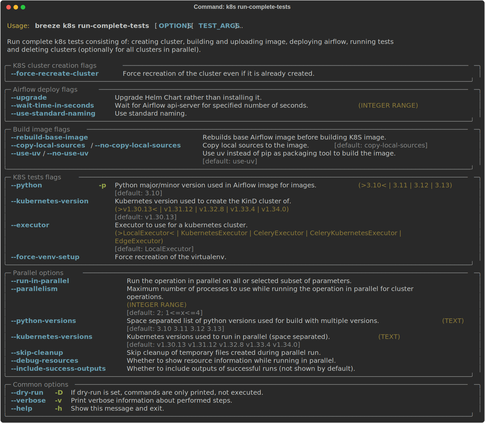

You can also specify any pytest flags as extra parameters - they will be passed to the
shell command directly. In case the shell parameters are the same as the parameters of the command, you
can pass them after ``--``. For example this is the way how you can see all available parameters of the shell
you have:

.. code-block:: bash

    breeze k8s run-complete-tests -- --help

The options that are not overlapping with the ``tests`` command options can be passed directly and mixed
with the specifications of tests you want to run. For example the command below will only run
``test_kubernetes_executor.py`` and will suppress capturing output from Pytest so that you can see the
output during test execution.

.. code-block:: bash

    breeze k8s run-complete-tests -- test_kubernetes_executor.py -s

Entering k8s shell
..................

You can have multiple clusters created - with different versions of Kubernetes and Python at the same time.
Breeze enables you to interact with the chosen cluster by entering dedicated shell session that has the
cluster pre-configured. This is done via ``breeze k8s shell`` command.

Once you are in the shell, the prompt will indicate which cluster you are interacting with as well
as executor you use, similar to:

.. code-block:: bash

    (kind-airflow-python-3.9-v1.24.0:KubernetesExecutor)>

The shell automatically activates the virtual environment that has all appropriate dependencies
installed and you can interactively run all k8s tests with pytest command (of course the cluster need to
be created and airflow deployed to it before running the tests):

.. code-block:: bash

    (kind-airflow-python-3.9-v1.24.0:KubernetesExecutor)> pytest test_kubernetes_executor.py
    ================================================= test session starts =================================================
    platform linux -- Python 3.10.6, pytest-6.2.5, py-1.11.0, pluggy-1.0.0 -- /home/jarek/code/airflow/.build/.k8s-env/bin/python
    cachedir: .pytest_cache
    rootdir: /home/jarek/code/airflow, configfile: pytest.ini
    plugins: anyio-3.6.1
    collected 2 items

    test_kubernetes_executor.py::TestKubernetesExecutor::test_integration_run_dag PASSED           [ 50%]
    test_kubernetes_executor.py::TestKubernetesExecutor::test_integration_run_dag_with_scheduler_failure PASSED [100%]

    ================================================== warnings summary ===================================================
    .build/.k8s-env/lib/python3.10/site-packages/_pytest/config/__init__.py:1233
      /home/jarek/code/airflow/.build/.k8s-env/lib/python3.10/site-packages/_pytest/config/__init__.py:1233: PytestConfigWarning: Unknown config option: asyncio_mode

        self._warn_or_fail_if_strict(f"Unknown config option: {key}\n")

    -- Docs: https://docs.pytest.org/en/stable/warnings.html
    ============================================ 2 passed, 1 warning in 38.62s ============================================
    (kind-airflow-python-3.9-v1.24.0:KubernetesExecutor)>

All parameters of the command are here:

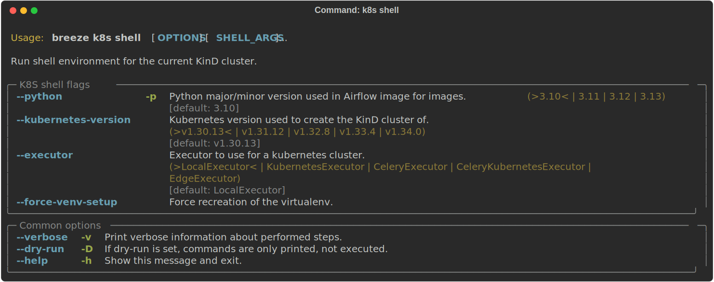

You can also specify any shell flags and commands as extra parameters - they will be passed to the
shell command directly. In case the shell parameters are the same as the parameters of the command, you
can pass them after ``--``. For example this is the way how you can see all available parameters of the shell
you have:

.. code-block:: bash

    breeze k8s shell -- --help

Running k9s tool
................

The ``k9s`` is a fantastic tool that allows you to interact with running k8s cluster. Since we can have
multiple clusters capability, ``breeze k8s k9s`` allows you to start k9s without setting it up or
downloading - it uses k9s docker image to run it and connect it to the right cluster.

All parameters of the command are here:

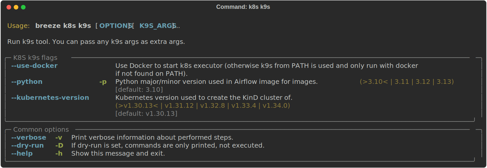

You can also specify any ``k9s`` flags and commands as extra parameters - they will be passed to the
``k9s`` command directly. In case the ``k9s`` parameters are the same as the parameters of the command, you
can pass them after ``--``. For example this is the way how you can see all available parameters of the
``k9s`` you have:

.. code-block:: bash

    breeze k8s k9s -- --help

Dumping logs from all k8s clusters
..................................

KinD allows to export logs from the running cluster so that you can troubleshoot your deployment.
This can be done with ``breeze k8s logs`` command. Logs can be also dumped for all clusters created
so far by passing ``--all`` flag.

All parameters of the command are here:

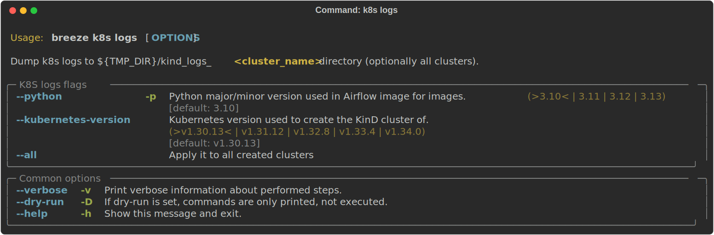

-----

Next step: Follow the `Managing Breeze images <06_managing_docker_images.rst>`_ guide to learn how to manage
CI and PROD images of Breeze.
