 .. Licensed to the Apache Software Foundation (ASF) under one
    or more contributor license agreements.  See the NOTICE file
    distributed with this work for additional information
    regarding copyright ownership.  The ASF licenses this file
    to you under the Apache License, Version 2.0 (the
    "License"); you may not use this file except in compliance
    with the License.  You may obtain a copy of the License at

 ..   http://www.apache.org/licenses/LICENSE-2.0

 .. Unless required by applicable law or agreed to in writing,
    software distributed under the License is distributed on an
    "AS IS" BASIS, WITHOUT WARRANTIES OR CONDITIONS OF ANY
    KIND, either express or implied.  See the License for the
    specific language governing permissions and limitations
    under the License.

Managing Docker images
======================

This document describes how to manage Breeze images CI and PROD - used to run containerized
Airflow development environment and tests.

**The outline for this document in GitHub is available at top-right corner button (with 3-dots and 3 lines).**

CI Image tasks
--------------

The image building is usually run for users automatically when needed,
but sometimes Breeze users might want to manually build, pull or verify the CI images.

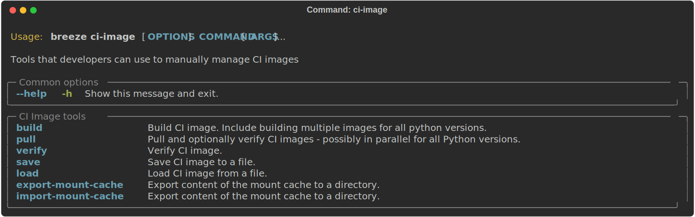

For all development tasks, unit tests, integration tests, and static code checks, we use the
**CI image** maintained in GitHub Container Registry.

The CI image is built automatically as needed, however it can be rebuilt manually with
``ci image build`` command.

Building the image first time pulls a pre-built version of images from the Docker Hub, which may take some
time. But for subsequent source code changes, no wait time is expected.
However, changes to sensitive files like ``pyproject.toml`` or ``Dockerfile.ci`` will trigger a rebuild
that may take more time though it is highly optimized to only rebuild what is needed.

Breeze has built in mechanism to check if your local image has not diverged too much from the
latest image build on CI. This might happen when for example latest patches have been released as new
Python images or when significant changes are made in the Dockerfile. In such cases, Breeze will
download the latest images before rebuilding because this is usually faster than rebuilding the image.

Building CI image
.................

These are all available flags of ``ci-image build`` command:

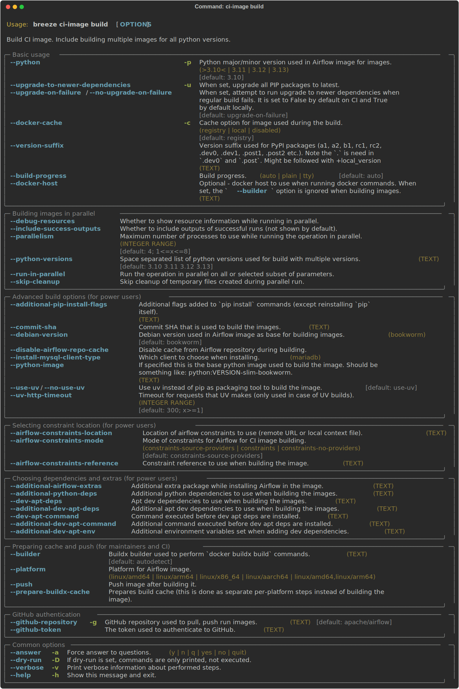

Pulling CI image
................

You can also pull the CI images locally in parallel with optional verification.

These are all available flags of ``pull`` command:

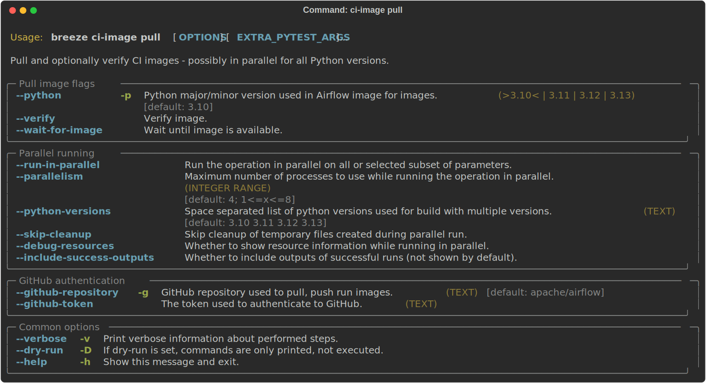

Verifying CI image
..................

You can verify CI image by running tests - either with the pulled/built images or
with an arbitrary image.

These are all available flags of ``verify`` command:

Loading and saving CI image
...........................

You can load and save PROD image - for example to transfer it to another machine or to load an image
that has been built in our CI.

These are all available flags of ``save`` command:

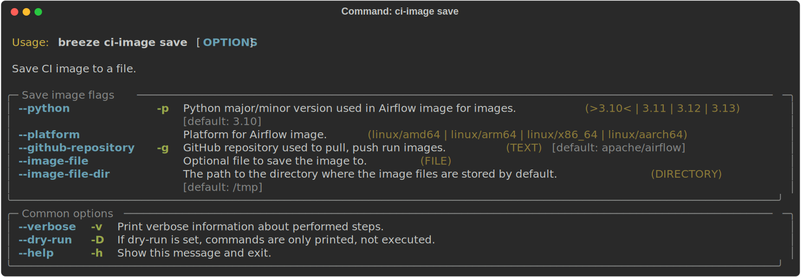

These are all available flags of ``load`` command:

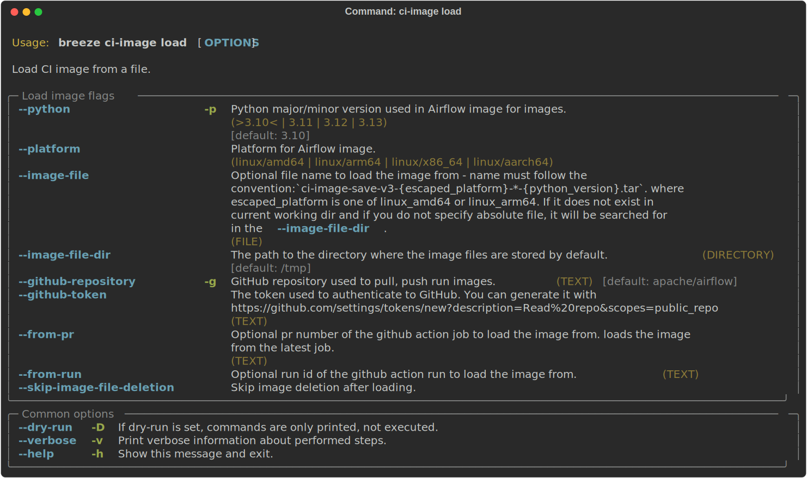

Images for every build from our CI are uploaded as artifacts to the
GitHub Action run (in summary) and can be downloaded from there for 2 days in order to reproduce the complete
environment used during the tests and loaded to the local Docker registry (note that you have
to use the same platform as the CI run).

You will find the artifacts for each image in the summary of the CI run. The artifacts are named
``ci-image-docker-export-<platform>-<python_version>-<PR>_merge``. Those are compressed zip files that
contain the ".tar" image that should be used with ``--image-file`` flag of the load method. Make sure to
use the same ``--python`` version as the image was built with.

To load the image from specific PR, you can use the following command:

.. code-block:: bash

     breeze ci-image load --from-pr 12345 --python 3.10 --github-token <your_github_token>

To load the image from specific job run (for example 12538475388), you can use the following command, find the run id from github action runs.

.. code-block:: bash

     breeze ci-image load --from-run 12538475388 --python 3.10 --github-token <your_github_token>

After you load the image, you can reproduce the very exact environment that was used in the CI run by
entering breeze container without mounting your local sources:

.. code-block:: bash

     breeze shell --mount-sources skip [OTHER OPTIONS]

And you should be able to run any tests and commands interactively in the very exact environment that
was used in the failing CI run. This is a powerful tool to debug and fix CI issues.

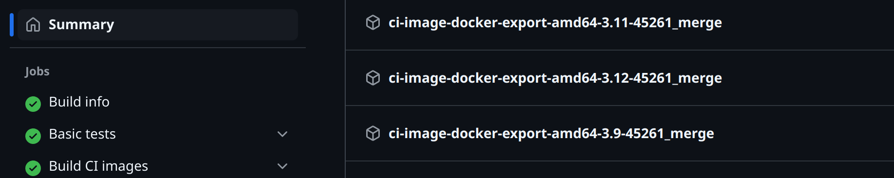

Exporting and importing CI image cache mount
............................................

During the build, cache of ``uv`` and ``pip`` is stored in a separate "cache mount" volume that is mounted
during the build. This cache mount volume is preserved between builds and can be exported and imported
to speed up the build process in CI - where cache is stored as artifact and can be imported in the next
build.

These are all available flags of ``export-mount-cache`` command:

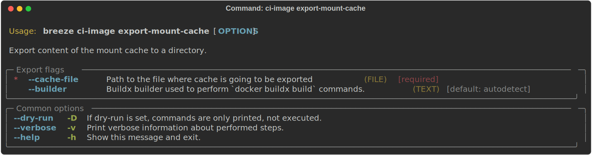

These are all available flags of ``import-mount-cache`` command:

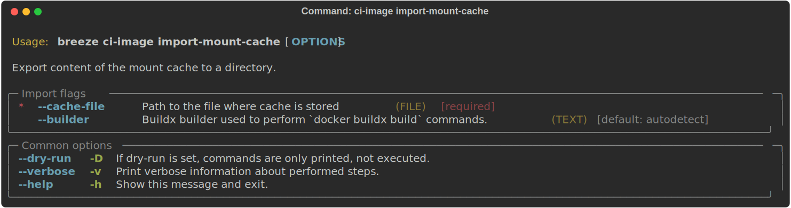

PROD Image tasks
----------------

Users can also build Production images when they are developing them. However when you want to
use the PROD image, the regular docker build commands are recommended. See
`building the image <https://airflow.apache.org/docs/docker-stack/build.html>`_

The **Production image** is also maintained in GitHub Container Registry for Caching
and in ``apache/airflow`` manually pushed for released versions. This Docker image (built using official
Dockerfile) contains size-optimised Airflow installation with selected extras and dependencies.

However in many cases you want to add your own custom version of the image - with added apt dependencies,
python dependencies, additional Airflow extras. Breeze's ``prod-image build`` command helps to build your own,
customized variant of the image that contains everything you need.

You can building the production image manually by using ``prod-image build`` command.
Note, that the images can also be built using ``docker build`` command by passing appropriate
build-args as described in `Images documentation <ci/02_images.md>`_ , but Breeze provides several flags that
makes it easier to do it. You can see all the flags by running ``breeze prod-image build --help``,
but here typical examples are presented:

.. code-block:: bash

     breeze prod-image build --additional-airflow-extras "jira"

This installs additional ``jira`` extra while installing Airflow in the image.

.. code-block:: bash

     breeze prod-image build --additional-python-deps "torchio==0.17.10"

This install additional pypi dependency - torchio in specified version.

.. code-block:: bash

     breeze prod-image build --additional-dev-apt-deps "libasound2-dev" \
         --additional-runtime-apt-deps "libasound2"

This installs additional apt dependencies - ``libasound2-dev`` in the build image and ``libasound`` in the
final image. Those are development dependencies that might be needed to build and use python packages added
via the ``--additional-python-deps`` flag. The ``dev`` dependencies are not installed in the final
production image, they are only installed in the build "segment" of the production image that is used
as an intermediate step to build the final image. Usually names of the ``dev`` dependencies end with ``-dev``
suffix and they need to also be paired with corresponding runtime dependency added for the runtime image
(without -dev).

.. code-block:: bash

     breeze prod-image build --python 3.10 --additional-dev-deps "libasound2-dev" \
        --additional-runtime-apt-deps "libasound2"

Same as above but uses python 3.10.

Building PROD image
...................

These are all available flags of ``build-prod-image`` command:

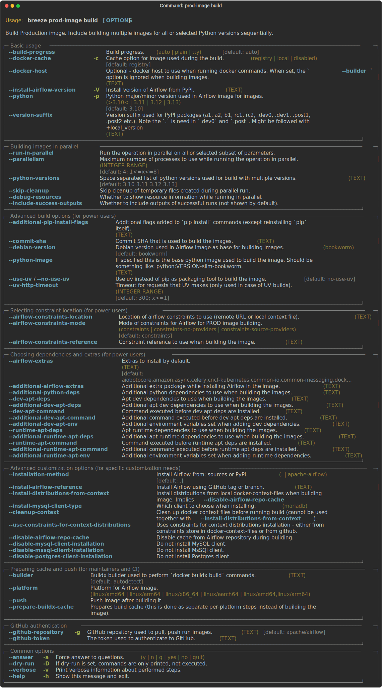

Pulling PROD image
..................

You can also pull PROD images in parallel with optional verification.

These are all available flags of ``pull-prod-image`` command:

Verifying PROD image
....................

You can verify PROD image by running tests - either with the pulled/built images or
with an arbitrary image.

These are all available flags of ``verify-prod-image`` command:

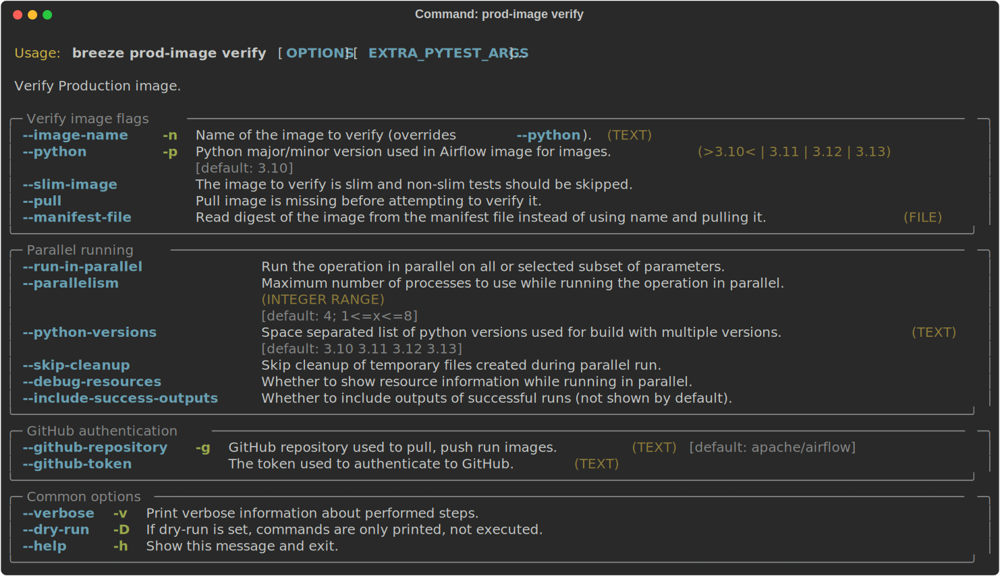

Loading and saving PROD image
.............................

You can load and save PROD image - for example to transfer it to another machine or to load an image
that has been built in our CI.

These are all available flags of ``save`` command:

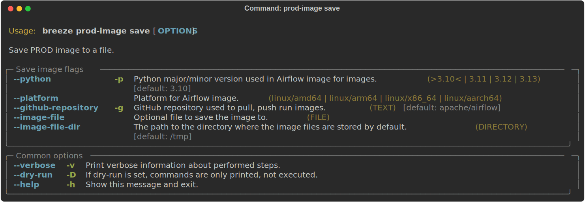

These are all available flags of ``load`` command:

.. image:: ./images/output-prod-image_load.svg
  :target: https://raw.githubusercontent.com/apache/airflow/main/dev/breeze/images/output_prod-image_load.svg
  :width: 100%
  :alt: Breeze prod-image load

Similarly as in case of CI images, Images for every build from our CI are uploaded as artifacts to the
GitHub Action run (in summary) and can be downloaded from there for 2 days in order to reproduce the complete
environment used during the tests and loaded to the local Docker registry (note that you have
to use the same platform as the CI run).

------

Next step: Follow the `Breeze maintenance tasks <07_breeze_maintenance_tasks.rst>`_ to learn about tasks that
are useful when you are modifying Breeze itself.
