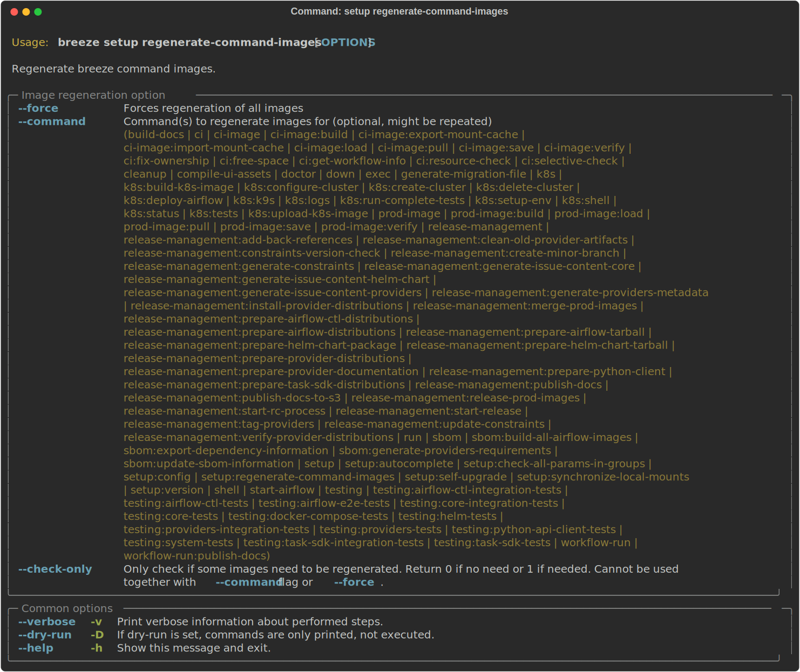
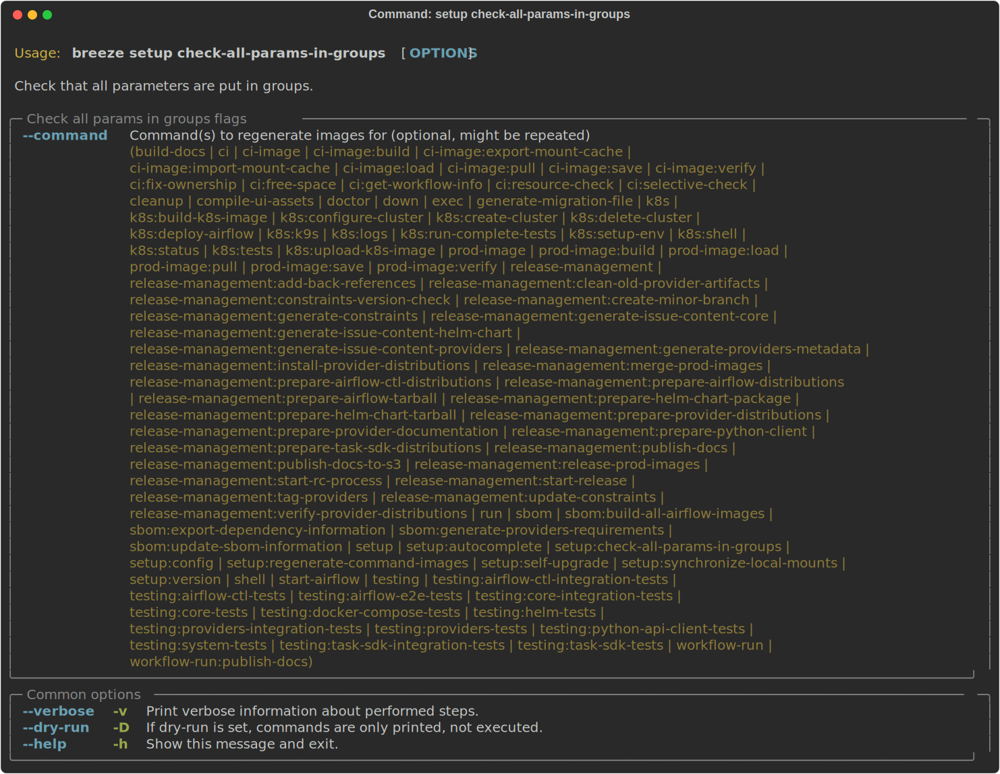

 .. Licensed to the Apache Software Foundation (ASF) under one
    or more contributor license agreements.  See the NOTICE file
    distributed with this work for additional information
    regarding copyright ownership.  The ASF licenses this file
    to you under the Apache License, Version 2.0 (the
    "License"); you may not use this file except in compliance
    with the License.  You may obtain a copy of the License at

 ..   http://www.apache.org/licenses/LICENSE-2.0

 .. Unless required by applicable law or agreed to in writing,
    software distributed under the License is distributed on an
    "AS IS" BASIS, WITHOUT WARRANTIES OR CONDITIONS OF ANY
    KIND, either express or implied.  See the License for the
    specific language governing permissions and limitations
    under the License.

Breeze maintenance tasks
========================

This document describes Breeze maintenance tasks, that are mostly useful when you are
modifying Breeze itself.

**The outline for this document in GitHub is available at top-right corner button (with 3-dots and 3 lines).**

Regenerating documentation SVG screenshots
..........................................

This documentation contains exported SVG screenshots with "help" of their commands and parameters. You can
regenerate those images that need to be regenerated because their commands changed (usually after
the breeze code has been changed) via ``regenerate-command-images`` command. Usually this is done
automatically via pre-commit, but sometimes (for example when ``rich`` or ``rich-click`` library changes)
you need to regenerate those images.

You can add ``--force`` flag (or ``FORCE="true"`` environment variable to regenerate all images (not
only those that need regeneration). You can also run the command with ``--check-only`` flag to simply
check if there are any images that need regeneration.

Breeze check-all-params-in-groups
.................................

When you add a breeze command or modify a parameter, you are also supposed to make sure that "rich groups"
for the command is present and that all parameters are assigned to the right group so they can be
nicely presented in ``--help`` output. You can check that via ``check-all-params-in-groups`` command.

Breeze synchronize-local-mounts
...............................

When you add volumes mounted to docker, they need to be added in ``docker_command_utils.py`` - so that they
are added by plain ``docker`` command, but they also need to be synchronized with ``local.yml``. This can be
done via ``synchronize-local-mounts`` command.

-----

Next step: Follow the `CI tasks <08_ci_tasks.rst>`_ guide to learn how to use Breeze for regular development tasks.
