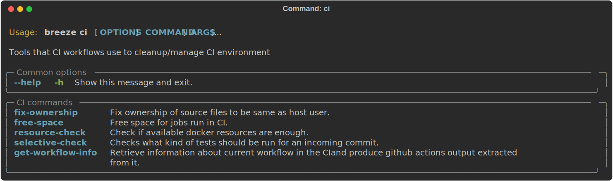
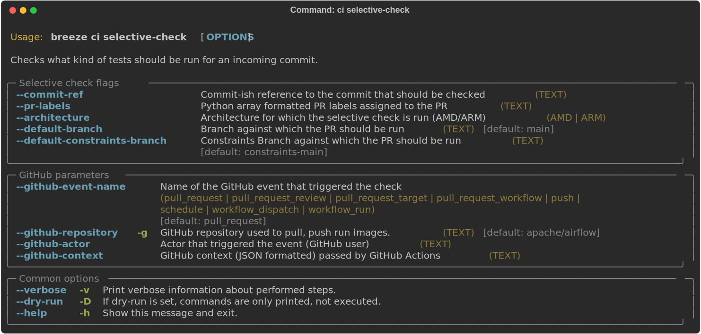

 .. Licensed to the Apache Software Foundation (ASF) under one
    or more contributor license agreements.  See the NOTICE file
    distributed with this work for additional information
    regarding copyright ownership.  The ASF licenses this file
    to you under the Apache License, Version 2.0 (the
    "License"); you may not use this file except in compliance
    with the License.  You may obtain a copy of the License at

 ..   http://www.apache.org/licenses/LICENSE-2.0

 .. Unless required by applicable law or agreed to in writing,
    software distributed under the License is distributed on an
    "AS IS" BASIS, WITHOUT WARRANTIES OR CONDITIONS OF ANY
    KIND, either express or implied.  See the License for the
    specific language governing permissions and limitations
    under the License.

CI tasks
========

Breeze hase a number of commands that are mostly used in CI environment to perform cleanup.
Detailed description of the CI design can be found in `CI design <ci/README.md>`_.

**The outline for this document in GitHub is available at top-right corner button (with 3-dots and 3 lines).**

Those are all the commands available in the ``ci`` group:

Running resource check
----------------------

Breeze requires certain resources to be available - disk, memory, CPU. When you enter Breeze's shell,
the resources are checked and information if there is enough resources is displayed. However you can
manually run resource check any time by ``breeze ci resource-check`` command.

These are all available flags of ``resource-check`` command:

Freeing the space
-----------------

When our CI runs a job, it needs all memory and disk it can have. We have a Breeze command that frees
the memory and disk space used. You can also use it clear space locally but it performs a few operations
that might be a bit invasive - such are removing swap file and complete pruning of docker disk space used.

These are all available flags of ``free-space`` command:

Fixing File/Directory Ownership
-------------------------------

On Linux, there is a problem with propagating ownership of created files (a known Docker problem). The
files and directories created in the container are not owned by the host user (but by the root user in our
case). This may prevent you from switching branches, for example, if files owned by the root user are
created within your sources. In case you are on a Linux host and have some files in your sources created
by the root user, you can fix the ownership of those files by running :

.. code-block::

  breeze ci fix-ownership

These are all available flags of ``fix-ownership`` command:

Selective check
---------------

When our CI runs a job, it needs to decide which tests to run, whether to build images and how much the test
should be run on multiple combinations of Python, Kubernetes, Backend versions. In order to optimize time
needed to run the CI Builds. You can also use the tool to test what tests will be run when you provide
a specific commit that Breeze should run the tests on.

The selective-check command will produce the set of ``name=value`` pairs of outputs derived
from the context of the commit/PR to be merged via stderr output.

More details about the algorithm used to pick the right tests and the available outputs can be
found in `Selective Checks <ci/04_selective_checks.md>`_.

These are all available flags of ``selective-check`` command:

Getting workflow information
----------------------------

When our CI runs a job, it might be within one of several workflows. Information about those workflows
is stored in GITHUB_CONTEXT. Rather than using some jq/bash commands, we retrieve the necessary information
(like PR labels, event_type, where the job runs on, job description and convert them into GA outputs.

These are all available flags of ``get-workflow-info`` command:

Finding backtracking candidates
-------------------------------

Sometimes the CI build fails because ``pip`` timeouts when trying to resolve the latest set of dependencies
for that we have the ``find-backtracking-candidates`` command. This command will try to find the
backtracking candidates that might cause the backtracking.

The details on how to use that command are explained in
`Figuring out backtracking dependencies <dev/MANUALLY_GENERATING_IMAGE_CACHE_AND_CONSTRAINTS.md#figuring-out-backtracking-dependencies>`_.

These are all available flags of ``find-backtracking-candidates`` command:

.. image:: ./images/output_ci_find-backtracking-candidates.svg
  :target: https://raw.githubusercontent.com/apache/airflow/main/dev/breeze/images/output_ci_find-backtracking-candidates.svg
  :width: 100%
  :alt: Breeze ci find-backtracking-candidates

-----

Next step: Follow the `Release management tasks <09_release_management_tasks.rst>`_ guide to learn how
release managers are using Breeze to release various Airflow artifacts.
