 .. Licensed to the Apache Software Foundation (ASF) under one
    or more contributor license agreements.  See the NOTICE file
    distributed with this work for additional information
    regarding copyright ownership.  The ASF licenses this file
    to you under the Apache License, Version 2.0 (the
    "License"); you may not use this file except in compliance
    with the License.  You may obtain a copy of the License at

 ..   http://www.apache.org/licenses/LICENSE-2.0

 .. Unless required by applicable law or agreed to in writing,
    software distributed under the License is distributed on an
    "AS IS" BASIS, WITHOUT WARRANTIES OR CONDITIONS OF ANY
    KIND, either express or implied.  See the License for the
    specific language governing permissions and limitations
    under the License.

Release management tasks
------------------------

Maintainers also can use Breeze for other purposes (those are commands that regular contributors likely
do not need or have no access to run). Those are usually connected with releasing Airflow:

**The outline for this document in GitHub is available at top-right corner button (with 3-dots and 3 lines).**

Those are all of the available release management commands:

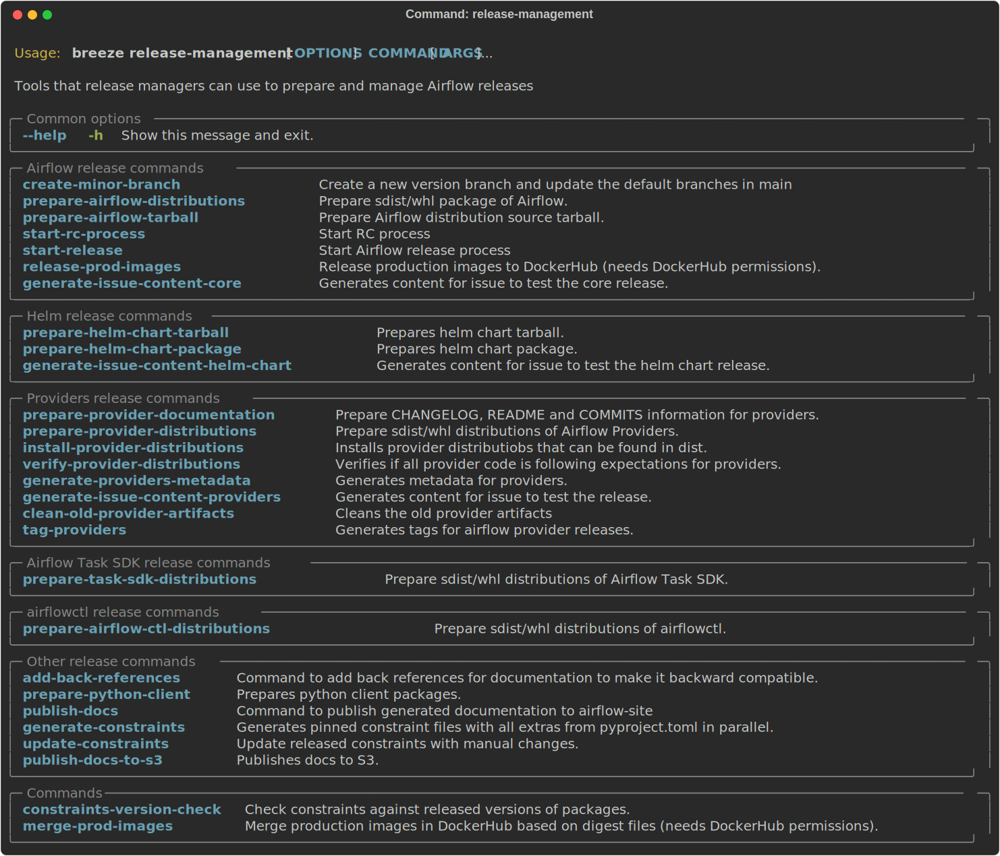

Airflow release commands
........................

Running airflow release commands is part of the release procedure performed by the release managers
and it is described in detail in `dev <dev/README_RELEASE_AIRFLOW.md>`_ .

Preparing airflow packages
""""""""""""""""""""""""""

You can prepare airflow packages using Breeze:

.. code-block:: bash

     breeze release-management prepare-airflow-package

This prepares airflow .whl package in the dist folder.

Again, you can specify optional ``--package-format`` flag to build selected formats of airflow packages,
default is to build ``both`` type of packages ``sdist`` and ``wheel``.

.. code-block:: bash

     breeze release-management prepare-airflow-package --package-format=wheel

.. image:: ./images/output_release-management_prepare-airflow-package.svg
  :target: https://raw.githubusercontent.com/apache/airflow/main/dev/breeze/doc/images/output_release-management_prepare-airflow-package.svg
  :width: 100%
  :alt: Breeze release-management prepare-airflow-package

Preparing airflow tarball
"""""""""""""""""""""""""

You can prepare airflow source tarball using Breeze:

.. code-block:: bash

     breeze release-management prepare-airflow-tarball

This prepares airflow -source.tar.gz package in the dist folder.

You must specify ``--version`` flag which is a pre-release version of Airflow you are preparing the
tarball for.

.. code-block:: bash

     breeze release-management prepare-airflow-tarball --version 2.8.0rc1

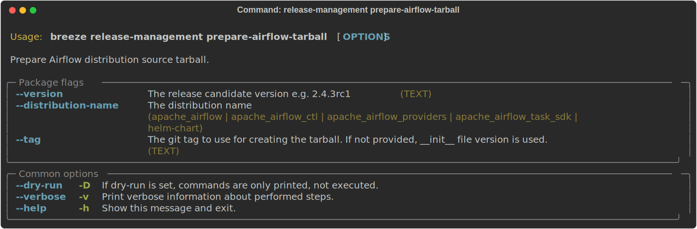

Start minor branch of Airflow
"""""""""""""""""""""""""""""

When we create a new minor branch of Airflow, we need to perform a few maintenance tasks. This command
automates it.

.. code-block:: bash

     breeze release-management create-minor-branch

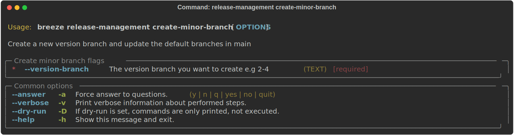

Start release candidate process
"""""""""""""""""""""""""""""""

When we prepare release candidate, we automate some of the steps we need to do.

.. code-block:: bash

     breeze release-management start-rc-process

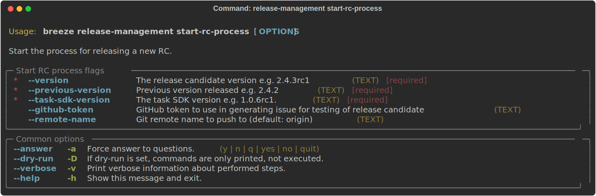

Start release process
"""""""""""""""""""""

When we prepare final release, we automate some of the steps we need to do.

.. code-block:: bash

     breeze release-management start-release

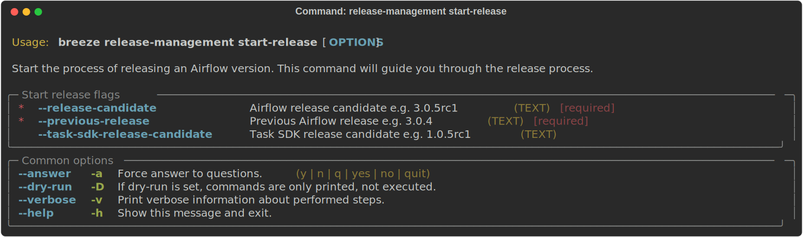

Generating airflow core Issue
"""""""""""""""""""""""""

You can use Breeze to generate a airflow core issue when you release new airflow.

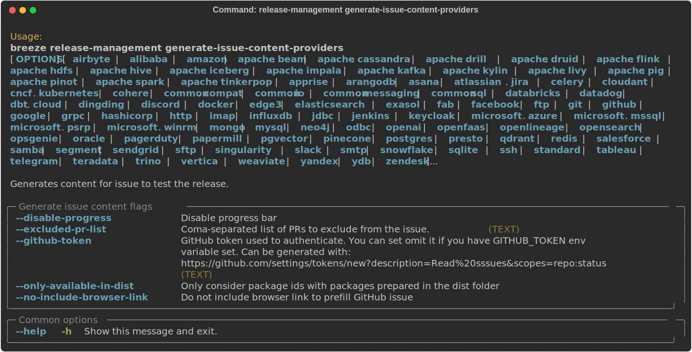

Preparing Python Clients
""""""""""""""""""""""""

The **Python client** source code can be generated and Python client packages could be built. For that you
need to have python client's repository checked out

.. code-block:: bash

     breeze release-management prepare-python-client --python-client-repo ~/code/airflow-client-python

You can also generate python client with custom security schemes.

These are all of the available flags for the command:

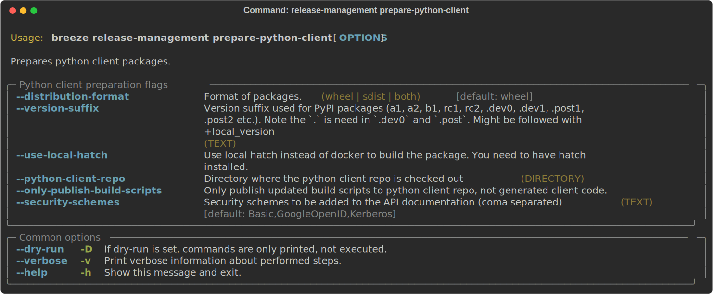

Releasing Production images
"""""""""""""""""""""""""""

The **Production image** can be released by release managers who have permissions to push the image. This
happens only when there is an RC candidate or final version of Airflow released.

You release "regular" and "slim" images as separate steps.

Releasing "regular" images:

.. code-block:: bash

     breeze release-management release-prod-images --airflow-version 2.4.0

Or "slim" images:

.. code-block:: bash

     breeze release-management release-prod-images --airflow-version 2.4.0 --slim-images

By default when you are releasing the "final" image, we also tag image with "latest" tags but this
step can be skipped if you pass the ``--skip-latest`` flag.

These are all of the available flags for the ``release-prod-images`` command:

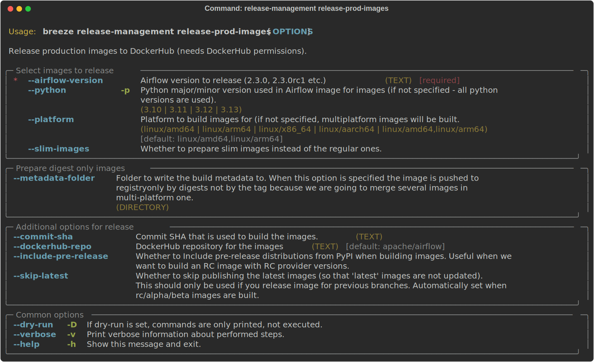

Adding git tags for providers
"""""""""""""""""""""""""""""

This command can be utilized to manage git tags for providers within the airflow remote repository during provider releases.
Sometimes in cases when there is a connectivity issue to Github, it might be possible that local tags get created and lead to annoying errors.
The default behaviour would be to clean such local tags up.

The flag ``--clean-local-tags`` can be used to delete the local tags.

However, If you want to disable this behaviour, set the envvar CLEAN_LOCAL_TAGS to false or use the
``--no-clean-local-tags`` flag.

.. code-block:: bash

     breeze release-management tag-providers

These are all of the available flags for the ``tag-providers`` command:

.. image:: ./images/output_release-management_tag-providers.svg
  :target: https://raw.githubusercontent.com/apache/airflow/main/dev/breeze/doc/images/output_release-management_tag-providers.svg
  :width: 100%
  :alt: Breeze release management tag-providers

Helm Chart release commands
...........................

Preparing helm chart tarball
""""""""""""""""""""""""""""

You can prepare helm chart source tarball using Breeze:

.. code-block:: bash

     breeze release-management prepare-helm-chart-tarball

This prepares helm chart -source.tar.gz package in the dist folder.

You must specify ``--version`` and ``--version-suffix`` flags that specify
which version of Helm Chart you are preparing the tarball for.

.. code-block:: bash

     breeze release-management prepare-helm-chart-tarball --version 1.12.0 --version-suffix rc1

Preparing helm chart package
""""""""""""""""""""""""""""

You can prepare helm chart package and optionally sign it using Breeze:

.. code-block:: bash

     breeze release-management prepare-helm-chart-package

This prepares helm chart .tar.gz package in the dist folder.

.. code-block:: bash

     breeze release-management prepare-helm-chart-package --sign myemail@apache.org

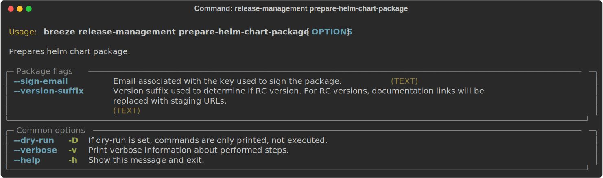

Generating helm chart Issue
"""""""""""""""""""""""""

You can use Breeze to generate a helm chart issue when you release new helm chart.

Provider release commands
.........................

Preparing provider release is part of the release procedure by the release managers
and it is described in detail in `dev <dev/README_RELEASE_PROVIDER_PACKAGES.md>`_ .

Preparing provider documentation
""""""""""""""""""""""""""""""""

You can use Breeze to prepare provider documentation.

The below example perform documentation preparation for provider packages.

.. code-block:: bash

     breeze release-management prepare-provider-documentation

You can also add ``--answer yes`` to perform non-interactive build.

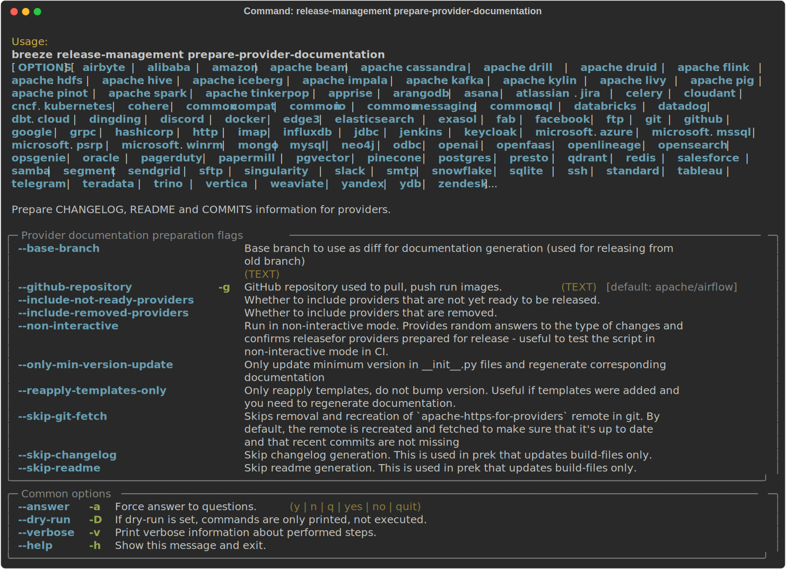

Preparing provider packages
"""""""""""""""""""""""""""

You can use Breeze to prepare provider packages.

The packages are prepared in ``dist`` folder. Note, that this command cleans up the ``dist`` folder
before running, so you should run it before generating airflow package below as it will be removed.

The below example builds provider packages in the wheel format.

.. code-block:: bash

     breeze release-management prepare-provider-packages

If you run this command without packages, you will prepare all packages, you can however specify
providers that you would like to build. By default ``both`` types of packages are prepared (
``wheel`` and ``sdist``, but you can change it providing optional --package-format flag.

.. code-block:: bash

     breeze release-management prepare-provider-packages google amazon

You can see all providers available by running this command:

.. code-block:: bash

     breeze release-management prepare-provider-packages --help

.. image:: ./images/output_release-management_prepare-provider-packages.svg
  :target: https://raw.githubusercontent.com/apache/airflow/main/dev/breeze/doc/images/output_release-management_prepare-provider-packages.svg
  :width: 100%
  :alt: Breeze prepare-provider-packages

Installing provider packages
""""""""""""""""""""""""""""

In some cases we want to just see if the provider packages generated can be installed with airflow without
verifying them. This happens automatically on CI for sdist pcackages but you can also run it manually if you
just prepared provider packages and they are present in ``dist`` folder.

.. code-block:: bash

     breeze release-management install-provider-packages

You can also run the verification with an earlier airflow version to check for compatibility.

.. code-block:: bash

    breeze release-management install-provider-packages --use-airflow-version 2.4.0

All the command parameters are here:

.. image:: ./images/output_release-management_install-provider-packages.svg
  :target: https://raw.githubusercontent.com/apache/airflow/main/dev/breeze/doc/images/output_release-management_install-provider-packages.svg
  :width: 100%
  :alt: Breeze install-provider-packages

Verifying provider packages
"""""""""""""""""""""""""""

Breeze can also be used to verify if provider classes are importable and if they are following the
right naming conventions. This happens automatically on CI but you can also run it manually if you
just prepared provider packages and they are present in ``dist`` folder.

.. code-block:: bash

     breeze release-management verify-provider-packages

You can also run the verification with an earlier airflow version to check for compatibility.

.. code-block:: bash

    breeze release-management verify-provider-packages --use-airflow-version 2.4.0

All the command parameters are here:

.. image:: ./images/output_release-management_verify-provider-packages.svg
  :target: https://raw.githubusercontent.com/apache/airflow/main/dev/breeze/doc/images/output_release-management_verify-provider-packages.svg
  :width: 100%
  :alt: Breeze verify-provider-packages

Generating Providers Metadata
"""""""""""""""""""""""""""""

The release manager can generate providers metadata per provider version - information about provider versions
including the associated Airflow version for the provider version (i.e first airflow version released after the
provider has been released) and date of the release of the provider version.

These are all of the available flags for the ``generate-providers-metadata`` command:

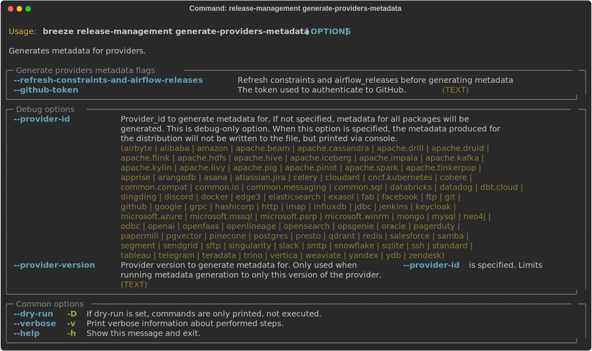

Generating Provider Issue
"""""""""""""""""""""""""

You can use Breeze to generate a provider issue when you release new providers.

Cleaning up of providers
""""""""""""""""""""""""

During the provider releases, we need to clean up the older provider versions in the SVN release folder.
Earlier this was done using a script, but now it is being migrated to a breeze command to ease the life of
release managers for providers. This can be achieved using ``breeze release-management clean-old-provider-artifacts``
command.

These are all available flags of ``clean-old-provider-artifacts`` command:

Constraints management
......................

Generating constraints
""""""""""""""""""""""

Whenever ``pyproject.toml`` gets modified, the CI main job will re-generate constraint files. Those constraint
files are stored in separated orphan branches: ``constraints-main``, ``constraints-2-0``.

Those are constraint files as described in detail in the
`<../../../contributing-docs/12_airflow_dependencies_and_extras.rst#pinned-constraint-files>`_ contributing documentation.

You can use ``breeze release-management generate-constraints`` command to manually generate constraints for
all or selected python version and single constraint mode like this:

.. warning::

   In order to generate constraints, you need to build all images with ``--upgrade-to-newer-dependencies``
   flag - for all python versions.

.. code-block:: bash

     breeze release-management generate-constraints --airflow-constraints-mode constraints

Constraints are generated separately for each python version and there are separate constraints modes:

* 'constraints' - those are constraints generated by matching the current airflow version from sources
   and providers that are installed from PyPI. Those are constraints used by the users who want to
   install airflow with pip.

* "constraints-source-providers" - those are constraints generated by using providers installed from
  current sources. While adding new providers their dependencies might change, so this set of providers
  is the current set of the constraints for airflow and providers from the current main sources.
  Those providers are used by CI system to keep "stable" set of constraints.

* "constraints-no-providers" - those are constraints generated from only Apache Airflow, without any
  providers. If you want to manage airflow separately and then add providers individually, you can
  use those.

These are all available flags of ``generate-constraints`` command:

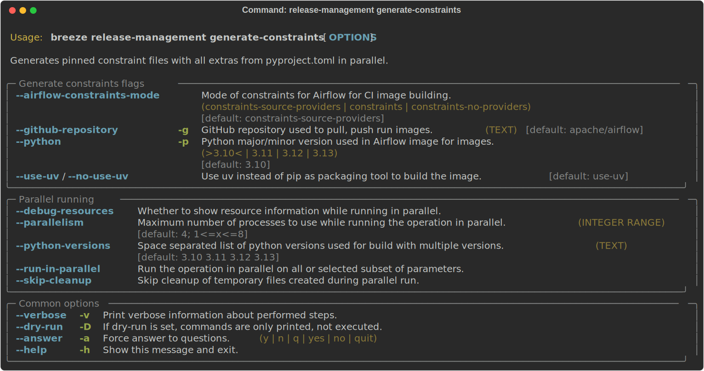

In case someone modifies ``pyproject.toml``, the scheduled CI Tests automatically upgrades and
pushes changes to the constraint files, however you can also perform test run of this locally using
the procedure described in the
`Manually generating image cache and constraints <../../MANUALLY_GENERATING_IMAGE_CACHE_AND_CONSTRAINTS.md>`_
which utilises multiple processors on your local machine to generate such constraints faster.

This bumps the constraint files to latest versions and stores hash of ``pyproject.toml``. The generated constraint
and ``pyproject.toml`` hash files are stored in the ``files`` folder and while generating the constraints diff
of changes vs the previous constraint files is printed.

Updating constraints
""""""""""""""""""""

Sometimes (very rarely) we might want to update individual packages in constraints that we generated and
tagged already in the past. This can be done using ``breeze release-management update-constraints`` command.

These are all available flags of ``update-constraints`` command:

You can read more details about what happens when you update constraints in the
`Manually generating image cache and constraints <../../MANUALLY_GENERATING_IMAGE_CACHE_AND_CONSTRAINTS.md>`_

Other release commands
......................

Publishing the documentation
""""""""""""""""""""""""""""

To publish the documentation generated by ``build-docs`` in Breeze to ``airflow-site``,
use the ``release-management publish-docs`` command:

.. code-block:: bash

     breeze release-management publish-docs

The publishing documentation consists of the following steps:

* checking out the latest ``main`` of cloned ``airflow-site``
* copying the documentation to ``airflow-site``
* running post-docs scripts on the docs to generate back referencing HTML for new versions of docs

.. code-block:: bash

     breeze release-management publish-docs <provider id>

Where ``provider id`` is a short form of provider name.

.. code-block:: bash

     breeze release-management publish-docs amazon

The flag ``--package-filter`` can be used to selectively publish docs during a release. The filters are glob
pattern matching full package names and can be used to select more than one package with single filter.

.. code-block:: bash

     breeze release-management publish-docs "apache-airflow-providers-microsoft*"

.. code-block:: bash

     breeze release-management publish-docs --override-versioned

The flag ``--override-versioned`` is a boolean flag that is used to override the versioned directories
while publishing the documentation.

.. code-block:: bash

     breeze release-management publish-docs --airflow-site-directory

You can also use shorthand names as arguments instead of using the full names
for airflow providers. To find the short hand names, follow the instructions in :ref:`generating_short_form_names`.

The flag ``--airflow-site-directory`` takes the path of the cloned ``airflow-site``. The command will
not proceed if this is an invalid path.

When you have multi-processor machine docs publishing can be vastly sped up by using ``--run-in-parallel`` option when
publishing docs for multiple providers.

These are all available flags of ``release-management publish-docs`` command:

.. image:: ./images/output_release-management_publish-docs.svg
  :target: https://raw.githubusercontent.com/apache/airflow/main/dev/breeze/doc/images/output_release-management_publish-docs.svg
  :width: 100%
  :alt: Breeze Publish documentation

Adding back referencing HTML for the documentation
""""""""""""""""""""""""""""""""""""""""""""""""""

To add back references to the documentation generated by ``build-docs`` in Breeze to ``airflow-site``,
use the ``release-management add-back-references`` command. This is important to support backward compatibility
the airflow documentation.

You have to specify which packages you run it on. For example you can run it for all providers:

.. code-block:: bash

     release-management add-back-references --airflow-site-directory DIRECTORY all-providers

The flag ``--airflow-site-directory`` takes the path of the cloned ``airflow-site``. The command will
not proceed if this is an invalid path.

You can also run the command for apache-airflow (core documentation):

.. code-block:: bash

     breeze release-management publish-docs --airflow-site-directory DIRECTORY apache-airflow

Also for helm-chart package:

.. code-block:: bash

     breeze release-management publish-docs --airflow-site-directory DIRECTORY helm-chart

You can also manually specify (it's auto-completable) list of packages to run the command for including individual
providers - you can mix apache-airflow, helm-chart and provider packages this way:

.. code-block:: bash

     breeze release-management publish-docs --airflow-site-directory DIRECTORY apache.airflow apache.beam google

These are all available flags of ``release-management add-back-references`` command:

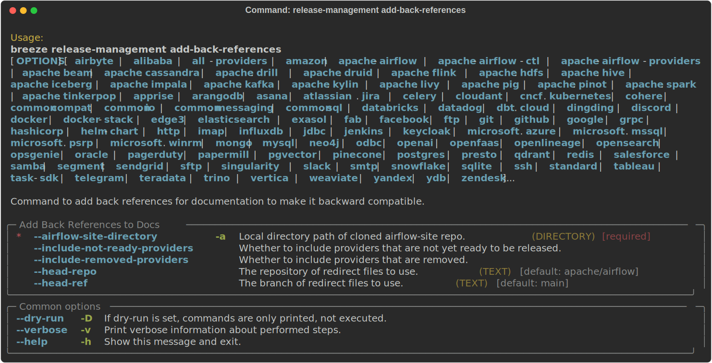

SBOM generation tasks
.....................

Maintainers also can use Breeze for SBOM generation:

Generating Provider requirements
""""""""""""""""""""""""""""""""

In order to generate SBOM information for providers, we need to generate requirements for them. This is
done by the ``generate-providers-requirements`` command. This command generates requirements for the
selected provider and python version, using the airflow version specified.

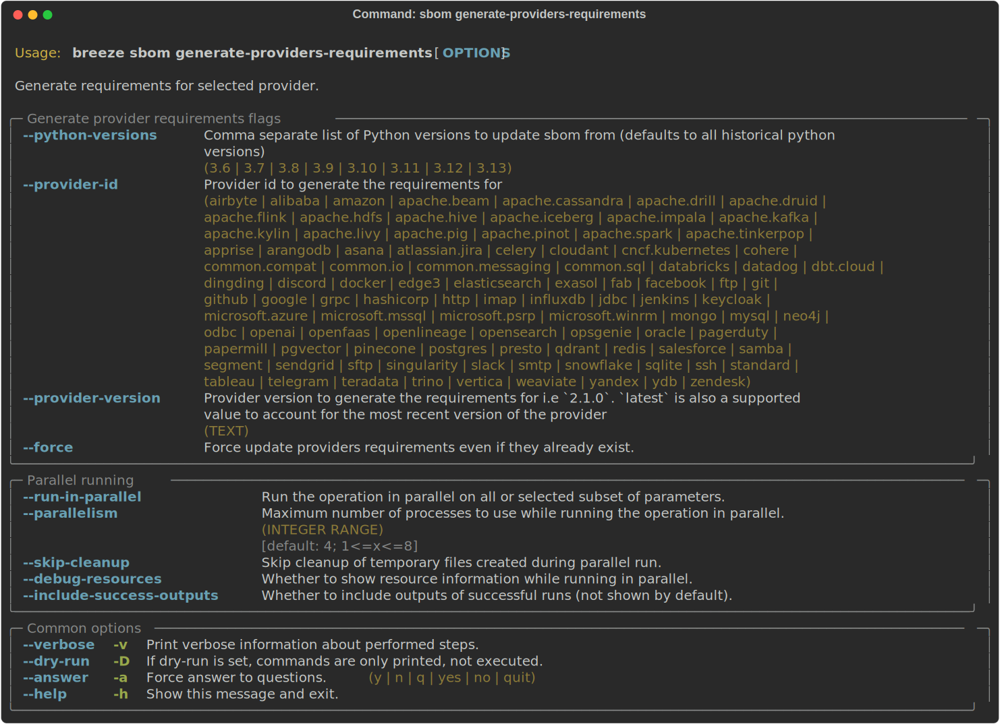

Generating SBOM information
"""""""""""""""""""""""""""

Thanks to our constraints captured for all versions of Airflow we can easily generate SBOM information for
Apache Airflow. SBOM information contains information about Airflow dependencies that are possible to consume
by our users and allow them to determine whether security issues in dependencies affect them. The SBOM
information is written directly to ``docs-archive`` in airflow-site repository.

These are all of the available flags for the ``update-sbom-information`` command:

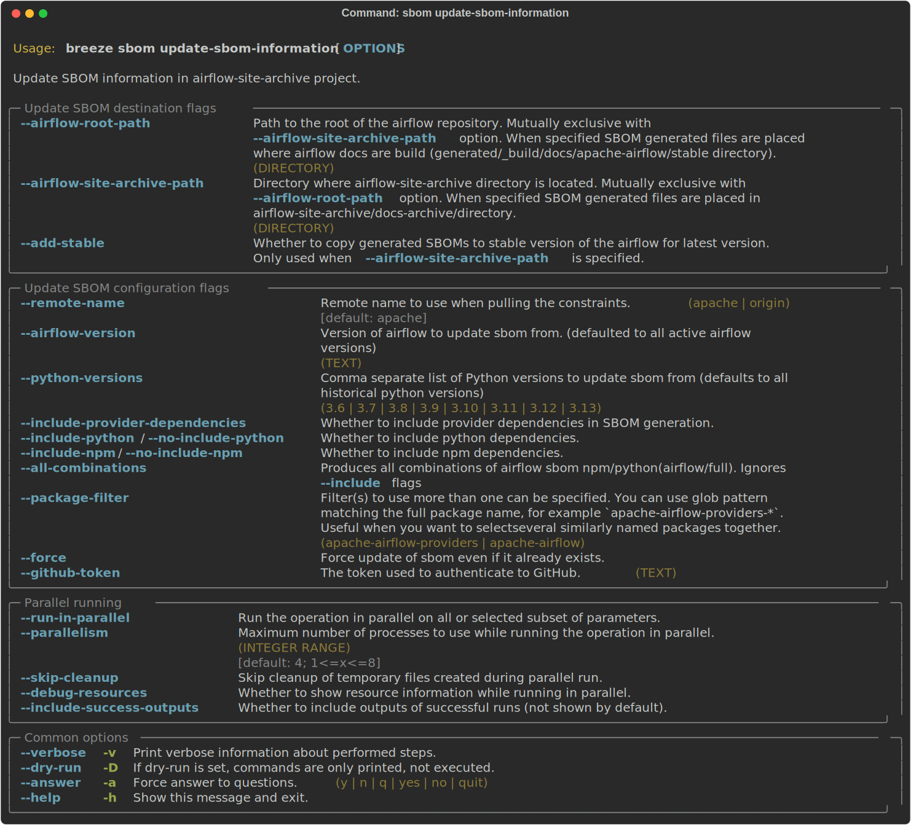

Build all airflow images
""""""""""""""""""""""""

In order to generate providers requirements, we need docker images with all airflow versions pre-installed,
such images are built with the ``build-all-airflow-images`` command.
This command will build one docker image per python version, with all the airflow versions >=2.0.0 compatible.

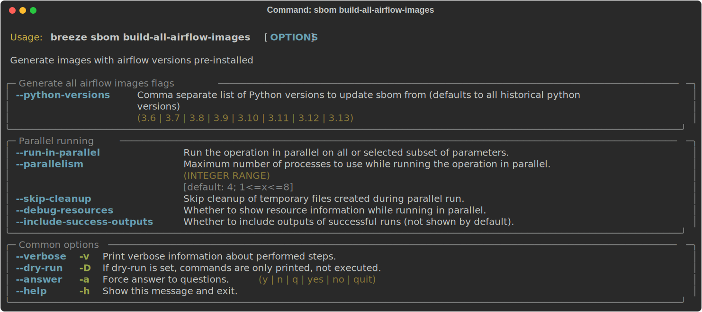

Exporting SBOM information
""""""""""""""""""""""""""

The SBOM information published on our website can be converted into a spreadsheet that we are using to analyse security
properties of the dependencies. This is done by the ``export-dependency-information`` command.

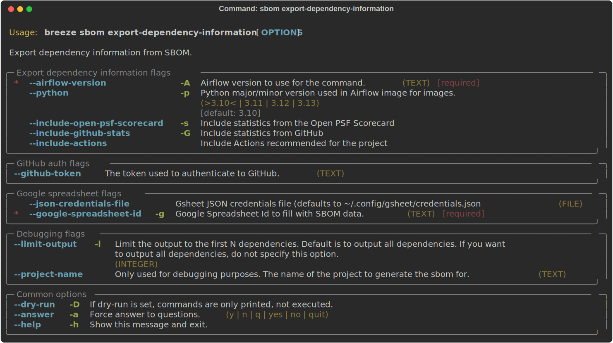

-----

Next step: Follow the `Advanced Breeze topics <10_advanced_breeze_topics.rst>`_ to
learn more about Breeze internals.
